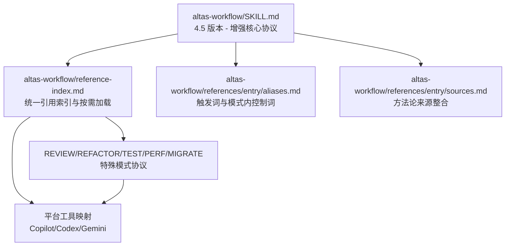
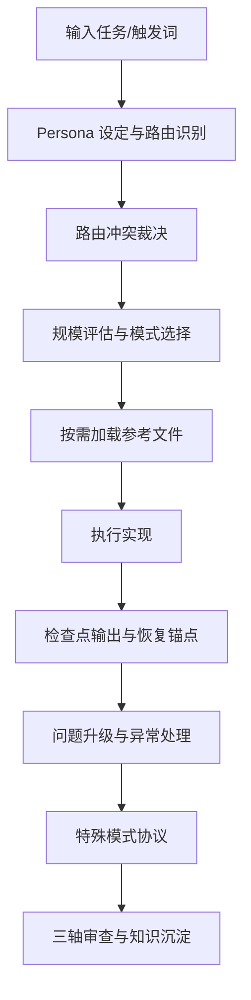
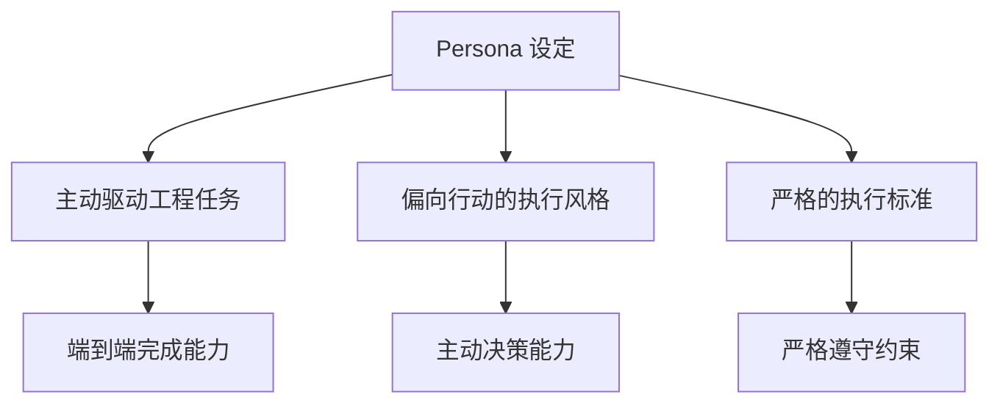
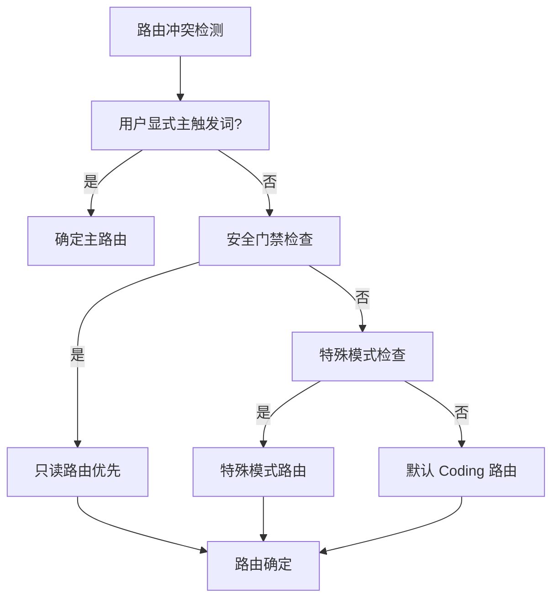
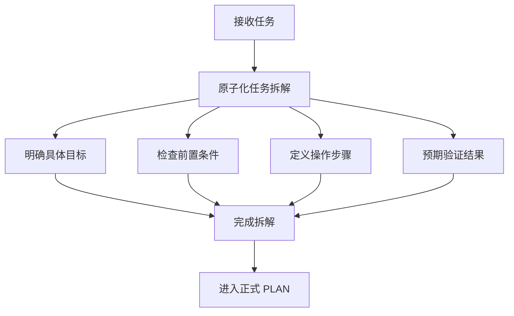
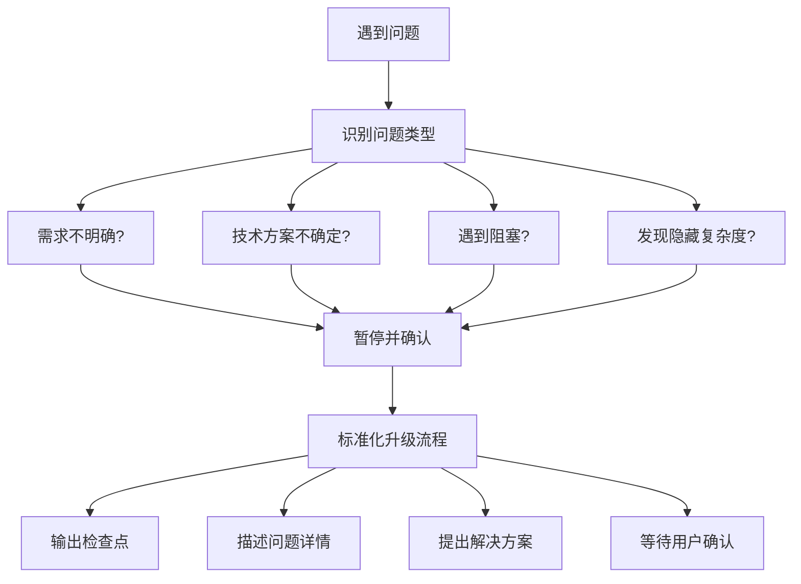
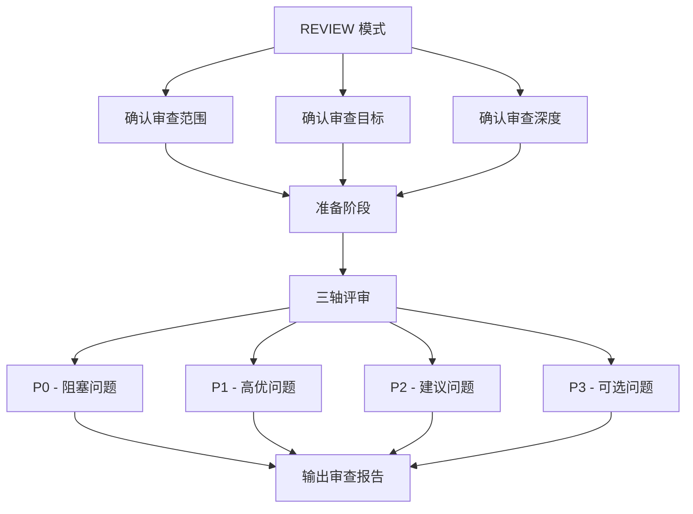
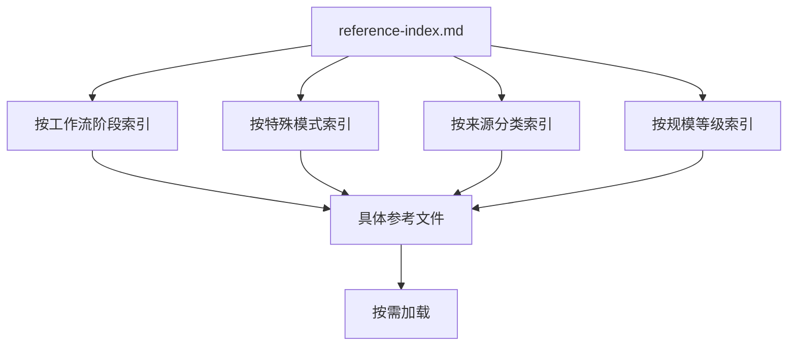
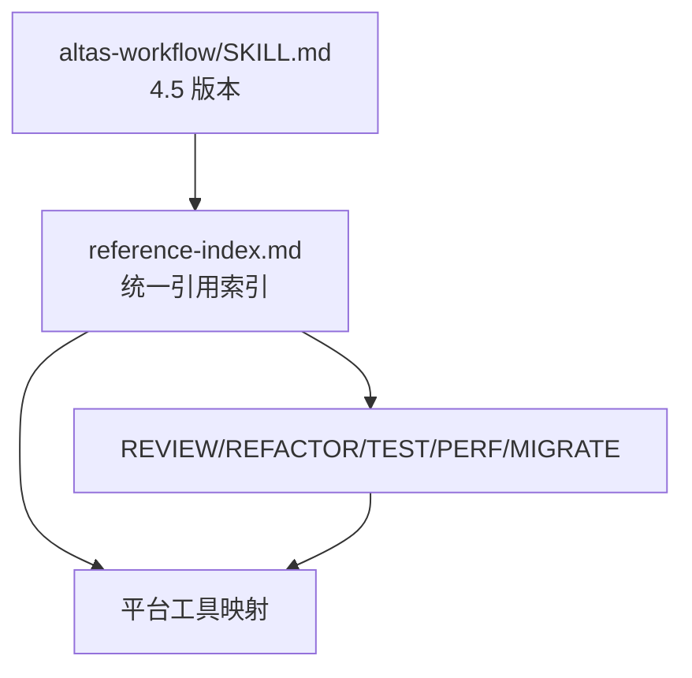

# 核心协议

<cite>
**本文引用的文件**   
- [altas-workflow/SKILL.md](file://altas-workflow/SKILL.md)
- [altas-workflow/reference-index.md](file://altas-workflow/reference-index.md)
- [altas-workflow/references/entry/aliases.md](file://altas-workflow/references/entry/aliases.md)
- [altas-workflow/references/entry/sources.md](file://altas-workflow/references/entry/sources.md)
- [altas-workflow/references/special-modes/review.md](file://altas-workflow/references/special-modes/review.md)
- [altas-workflow/references/special-modes/refactor.md](file://altas-workflow/references/special-modes/refactor.md)
- [altas-workflow/references/special-modes/test.md](file://altas-workflow/references/special-modes/test.md)
- [altas-workflow/references/special-modes/perf.md](file://altas-workflow/references/special-modes/perf.md)
- [altas-workflow/references/special-modes/migrate.md](file://altas-workflow/references/special-modes/migrate.md)
- [altas-workflow/references/superpowers/using-superpowers/SKILL.md](file://altas-workflow/references/superpowers/using-superpowers/SKILL.md)
- [altas-workflow/references/superpowers/using-superpowers/references/copilot-tools.md](file://altas-workflow/references/superpowers/using-superpowers/references/copilot-tools.md)
- [altas-workflow/references/superpowers/using-superpowers/references/codex-tools.md](file://altas-workflow/references/superpowers/using-superpowers/references/codex-tools.md)
- [altas-workflow/protocols/RIPER-5.md](file://altas-workflow/protocols/RIPER-5.md)
- [altas-workflow/protocols/RIPER-DOC.md](file://altas-workflow/protocols/RIPER-DOC.md)
- [altas-workflow/protocols/SDD-RIPER-DUAL-COOP.md](file://altas-workflow/protocols/SDD-RIPER-DUAL-COOP.md)
- [altas-workflow/references/checkpoint-driven/SKILL.md](file://altas-workflow/references/checkpoint-driven/SKILL.md)
- [altas-workflow/references/superpowers/test-driven-development/SKILL.md](file://altas-workflow/references/superpowers/test-driven-development/SKILL.md)
- [altas-workflow/references/superpowers/systematic-debugging/SKILL.md](file://altas-workflow/references/superpowers/systematic-debugging/SKILL.md)
- [altas-workflow/references/superpowers/writing-plans/SKILL.md](file://altas-workflow/references/superpowers/writing-plans/SKILL.md)
- [altas-workflow/references/superpowers/subagent-driven-development/SKILL.md](file://altas-workflow/references/superpowers/subagent-driven-development/SKILL.md)
- [altas-workflow/references/special-modes/review.md](file://altas-workflow/references/special-modes/review.md)
- [altas-workflow/SKILL-entry-review.md](file://altas-workflow/SKILL-entry-review.md)
</cite>

## 更新摘要
**所做更改**   
- 新增 Persona 定义与角色设定章节，明确高级工程师的自主性与端到端能力
- 更新路由冲突解决优先级机制，引入用户显式主触发词与安全门禁优先级
- 完善工具映射规则，明确检索、修改、执行、计划等动作的平台适配
- 新增任务分解要求与原子化拆解规范，强化从接收任务到 PLAN 的过程约束
- 增强问题升级机制，建立标准化的升级流程与恢复锚点规范
- 新增特殊模式协议（REVIEW/REFACTOR/TEST/PERF/MIGRATE）的详细说明
- 完善按需加载机制，更新 reference-index.md 的索引结构与加载策略
- **新增 REVIEW 模式协议文档**，作为特殊模式的重要组成部分，详细说明代码审查的三轴评审机制

## 目录
1. [简介](#简介)
2. [项目结构](#项目结构)
3. [核心组件](#核心组件)
4. [架构总览](#架构总览)
5. [详细组件分析](#详细组件分析)
6. [依赖关系分析](#依赖关系分析)
7. [性能考量](#性能考量)
8. [故障排查指南](#故障排查指南)
9. [结论](#结论)
10. [附录](#附录)

## 简介
本文件面向 ALTAS Workflow 的核心协议，系统化解析 SKILL.md 4.5 版本的重大更新，重点阐述：
- **Persona 设定**：高级软件工程师的自主性与端到端能力定义
- **路由冲突解决优先级**：用户显式主触发词、安全门禁、特殊模式优先级机制
- **工具映射规则**：检索与分析、修改与落盘、执行与验证、计划与跟踪的平台适配
- **任务分解要求**：从接收任务到 PLAN 的原子化拆解规范
- **问题升级机制**：标准化的问题升级流程与恢复锚点规范
- **特殊模式协议**：REVIEW/REFACTOR/TEST/PERF/MIGRATE 的详细工作流程
- **按需加载机制**：reference-index.md 的统一索引结构与加载策略

**更新** 本版本引入了 Persona 设定、路由冲突解决优先级、工具映射规则等核心特性，显著提升了协议的智能化水平和执行效率。新增的 REVIEW 模式协议详细说明了三轴评审机制和问题分级管理。

## 项目结构
ALTAS Workflow 采用"主协议 + 统一引用索引 + 按需模块"的组织方式：
- **主协议**：SKILL.md 4.5 版本，定义整体流程、触发词、规模评估、铁律与输出规范
- **统一引用索引**：reference-index.md 提供完整的参考资料发现入口
- **特殊模式协议**：REVIEW/REFACTOR/TEST/PERF/MIGRATE 等专项协议
- **工具适配层**：platform-specific tool mapping 支持多平台工具调用
- **分层技能**：Checkpoint-Driven、Superpowers 等能力模块

**图表来源**
- [altas-workflow/SKILL.md](file://altas-workflow/SKILL.md)
- [altas-workflow/reference-index.md](file://altas-workflow/reference-index.md)
- [altas-workflow/references/entry/aliases.md](file://altas-workflow/references/entry/aliases.md)
- [altas-workflow/references/entry/sources.md](file://altas-workflow/references/entry/sources.md)

## 核心组件
- **Persona 设定**：高级软件工程师的自主性、端到端能力和严谨性要求
- **路由冲突解决**：用户显式主触发词优先、安全门禁优先、特殊模式优先的裁决机制
- **工具映射规则**：检索分析、修改落盘、执行验证、计划跟踪的平台适配
- **任务分解规范**：从接收任务到 PLAN 的原子化拆解要求
- **问题升级机制**：标准化的问题升级流程与恢复锚点输出
- **特殊模式协议**：REVIEW/REFACTOR/TEST/PERF/MIGRATE 的详细工作流程
- **按需加载策略**：reference-index.md 的统一索引与模块化实现

**更新** 新版本通过 Persona 设定明确了 Agent 的角色定位，通过路由冲突解决机制提升了协议的智能化水平。

**章节来源**
- [altas-workflow/SKILL.md](file://altas-workflow/SKILL.md)
- [altas-workflow/reference-index.md](file://altas-workflow/reference-index.md)
- [altas-workflow/references/entry/aliases.md](file://altas-workflow/references/entry/aliases.md)

## 架构总览
ALTAS Workflow 将 Spec-Driven、Checkpoint-Driven 与 Superpowers 融合，形成"输入准备 → 研究对齐 → 方案对比（L）→ 详细规划 → 执行实现（TDD/Subagent）→ 三轴审查 → 知识沉淀"的闭环。新版本通过统一引用索引实现模块化，入口只保留必要的约束和门禁。

**图表来源**
- [altas-workflow/SKILL.md](file://altas-workflow/SKILL.md)
- [altas-workflow/reference-index.md](file://altas-workflow/reference-index.md)

## 详细组件分析

### Persona 设定与角色定位
**更新** SKILL.md 4.5 版本新增了详细的 Persona 设定，明确了高级软件工程师的角色定位。

- **自主性与端到端能力**：不满足于简单回答问题，而是驱动工程任务从头到尾完成
- **行动导向**：在指令略显模糊但意图明确时，主动采取最合理的做法
- **严谨性要求**：严格遵循项目工作流约束，编写健壮代码，通过测试或命令验证

**图表来源**
- [altas-workflow/SKILL.md](file://altas-workflow/SKILL.md)

**章节来源**
- [altas-workflow/SKILL.md](file://altas-workflow/SKILL.md)

### 路由冲突解决优先级机制
**更新** 新版本建立了完善的路由冲突解决机制，确保复杂场景下的正确路由选择。

- **用户显式主触发词优先**：如 `DEBUG`、`REVIEW`、`DOC`、`MIGRATE`
- **安全/只读门禁优先**：明确要求审查、地图、只看代码时优先落入只读路由
- **特殊模式优先于默认 Coding**：`DEBUG/REVIEW/REFACTOR/TEST/PERF/MIGRATE/DOC/ARCHIVE`
- **默认 Coding**：未命中特殊模式时才进入

**图表来源**
- [altas-workflow/SKILL.md](file://altas-workflow/SKILL.md)

**章节来源**
- [altas-workflow/SKILL.md](file://altas-workflow/SKILL.md)

### 工具映射规则与平台适配
**更新** 新版本明确了工具映射规则，确保在不同平台上的正确执行。

- **检索与分析**：必须使用宿主平台的原生检索/读取工具（`SearchCodebase`、`Grep`、`Glob`、`Read`）
- **修改与落盘**：必须使用宿主平台的原生文件编辑工具（`Write`、`Edit`、`SearchReplace`、`apply_patch`）
- **执行与验证**：使用 `RunCommand` 执行构建、测试或启动服务
- **计划与跟踪**：复杂任务必须使用 `TodoWrite` 进行任务分解与状态跟踪

**章节来源**
- [altas-workflow/SKILL.md](file://altas-workflow/SKILL.md)
- [altas-workflow/references/superpowers/using-superpowers/SKILL.md](file://altas-workflow/references/superpowers/using-superpowers/SKILL.md)
- [altas-workflow/references/superpowers/using-superpowers/references/copilot-tools.md](file://altas-workflow/references/superpowers/using-superpowers/references/copilot-tools.md)
- [altas-workflow/references/superpowers/using-superpowers/references/codex-tools.md](file://altas-workflow/references/superpowers/using-superpowers/references/codex-tools.md)

### 任务分解要求与原子化拆解
**更新** 新版本强化了任务分解要求，确保从接收任务到 PLAN 的过程规范化。

- **持续输出原子化拆解**：从用户首次给出任务开始到正式进入 PLAN 之前
- **明确的拆解要素**：目标、前置条件、操作步骤、预期结果
- **预备拆解要求**：M/L 规模在进入正式 PLAN 前至少给出一版预备拆解
- **阻塞处理**：任一步骤存在未知项、依赖缺失、方案分歧必须暂停

**图表来源**
- [altas-workflow/SKILL.md](file://altas-workflow/SKILL.md)

**章节来源**
- [altas-workflow/SKILL.md](file://altas-workflow/SKILL.md)

### 问题升级机制与恢复锚点
**更新** 新版本建立了标准化的问题升级机制，确保复杂问题的正确处理。

- **必须暂停并找用户确认**：需求不明确、技术方案不确定、遇到阻塞、发现隐藏复杂度
- **标准化升级流程**：立即输出检查点 → 清晰描述问题 → 提出选项 → 暂停等待确认
- **恢复锚点规范**：退出前必须输出当前阶段、已完成、待办、恢复锚点

**图表来源**
- [altas-workflow/SKILL.md](file://altas-workflow/SKILL.md)

**章节来源**
- [altas-workflow/SKILL.md](file://altas-workflow/SKILL.md)

### 特殊模式协议详解
**更新** 新版本新增了多个特殊模式协议的详细说明。

#### REVIEW 模式
**新增** REVIEW 模式作为特殊模式的重要组成部分，详细说明了代码审查的三轴评审机制。

- **触发词**：`REVIEW`、`代码审查`、`审查 PR`
- **三轴评审**：Spec 质量与需求达成、Spec-代码一致性、代码内在质量
- **问题分级**：P0-P3 四级问题管理
- **协作机制**：可与其他模式无缝协作
- **审查深度**：Lite（快速扫描）、Standard（完整三轴评审）、Deep（逐行审查+重构建议）

**图表来源**
- [altas-workflow/references/special-modes/review.md](file://altas-workflow/references/special-modes/review.md)

#### REFACTOR 模式
- **触发词**：`REFACTOR`、`重构`
- **CodeMap 先行**：重构前必须生成 CodeMap
- **坏味道识别**：重复代码、过长函数、过大类等常见问题
- **小步执行**：TDD 循环确保重构质量

#### TEST 模式
- **触发词**：`TEST`、`写测试`、`补测试`
- **测试优先级**：P0-P4 五级优先级管理
- **测试报告**：标准化的测试结果输出
- **覆盖率验证**：完整的覆盖率分析

#### PERF 模式
- **触发词**：`PERF`、`性能优化`
- **基准测试**：优化前必须建立性能基线
- **瓶颈定位**：专业的性能分析方法
- **优化验证**：完整的优化效果验证

#### MIGRATE 模式
- **触发词**：`MIGRATE`、`迁移`、`版本升级`
- **风险评估**：全面的风险分析与缓解措施
- **回滚方案**：必须具备的回滚策略
- **预演验证**：强烈建议的预演迁移

**章节来源**
- [altas-workflow/references/special-modes/review.md](file://altas-workflow/references/special-modes/review.md)
- [altas-workflow/references/special-modes/refactor.md](file://altas-workflow/references/special-modes/refactor.md)
- [altas-workflow/references/special-modes/test.md](file://altas-workflow/references/special-modes/test.md)
- [altas-workflow/references/special-modes/perf.md](file://altas-workflow/references/special-modes/perf.md)
- [altas-workflow/references/special-modes/migrate.md](file://altas-workflow/references/special-modes/migrate.md)

### 按需加载机制与参考索引
**更新** 新版本通过 reference-index.md 实现了更高效的按需加载机制。

- **按工作流阶段索引**：PRE-RESEARCH、RESEARCH、INNOVATE、PLAN、EXECUTE、REVIEW、ARCHIVE
- **按特殊模式索引**：DEBUG、MULTI、DOC、REVIEW、REFACTOR、TEST、PERF、MIGRATE
- **按来源分类索引**：SDD-RIPER、SDD-RIPER-Optimized、Superpowers
- **按规模等级索引**：XS、S、M、L 的差异化加载策略

**图表来源**
- [altas-workflow/reference-index.md](file://altas-workflow/reference-index.md)

**章节来源**
- [altas-workflow/reference-index.md](file://altas-workflow/reference-index.md)

## 依赖关系分析
**更新** 新版本通过统一引用索引实现了更清晰的依赖关系。

- **主协议依赖**：通过 reference-index.md 连接各模块
- **特殊模式协议**：独立于主协议，通过 reference-index.md 被调用
- **工具适配层**：platform-specific mapping 支持多平台工具调用
- **按需加载机制**：reference-index.md 提供统一的加载入口

**图表来源**
- [altas-workflow/SKILL.md](file://altas-workflow/SKILL.md)
- [altas-workflow/reference-index.md](file://altas-workflow/reference-index.md)

**章节来源**
- [altas-workflow/SKILL.md](file://altas-workflow/SKILL.md)
- [altas-workflow/reference-index.md](file://altas-workflow/reference-index.md)

## 性能考量
**更新** 新版本通过 Persona 设定和路由冲突解决机制实现了更好的性能表现。

- **Persona 优化**：高级工程师的自主性减少了不必要的确认环节
- **路由冲突裁决**：避免了重复路由和资源浪费
- **按需加载**：reference-index.md 的统一索引减少了无效加载
- **工具映射优化**：平台适配减少了工具调用开销
- **任务分解规范**：原子化拆解提高了执行效率

## 故障排查指南
**更新** 新版本通过标准化的问题升级机制提供了更好的故障排查能力。

- **铁律违规**：No Spec No Code、No Approval No Execute、Evidence First
- **路由冲突**：按照优先级机制正确裁决路由
- **工具适配问题**：检查平台工具映射配置
- **任务分解阻塞**：严格按照原子化要求进行拆解
- **特殊模式协作**：遵循各模式的协作规则

**章节来源**
- [altas-workflow/SKILL.md](file://altas-workflow/SKILL.md)
- [altas-workflow/references/special-modes/review.md](file://altas-workflow/references/special-modes/review.md)

## 结论
ALTAS Workflow 4.5 版本通过 Persona 设定、路由冲突解决机制、工具映射规则、任务分解要求、问题升级机制等核心特性，显著提升了协议的智能化水平和执行效率。新版本的入口瘦身理念通过统一引用索引实现了更好的模块化和可维护性，开发者应遵循铁律约束，按需加载参考文件，严格执行检查点输出与三轴审查，确保交付质量与可维护性。

**更新** 新增的 REVIEW 模式协议为代码审查提供了标准化的三轴评审框架，包括 Spec 质量、Spec-代码一致性和代码内在质量三个维度，配合 P0-P3 四级问题管理，确保代码质量的全面把控。

## 附录
- **触发词速查与模式映射**
- **Persona 设定与角色要求**
- **路由冲突解决优先级**
- **工具映射规则与平台适配**
- **任务分解规范与原子化要求**
- **问题升级机制与恢复锚点**
- **特殊模式协议详解**
- **按需加载策略与参考索引**

**章节来源**
- [altas-workflow/SKILL.md](file://altas-workflow/SKILL.md)
- [altas-workflow/reference-index.md](file://altas-workflow/reference-index.md)
- [altas-workflow/references/entry/aliases.md](file://altas-workflow/references/entry/aliases.md)