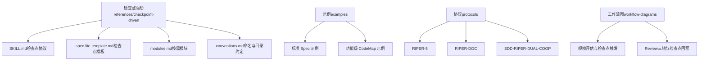
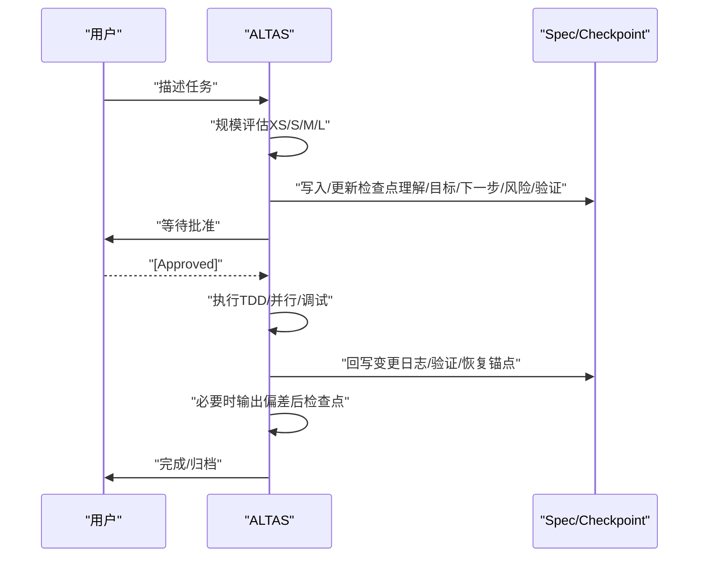
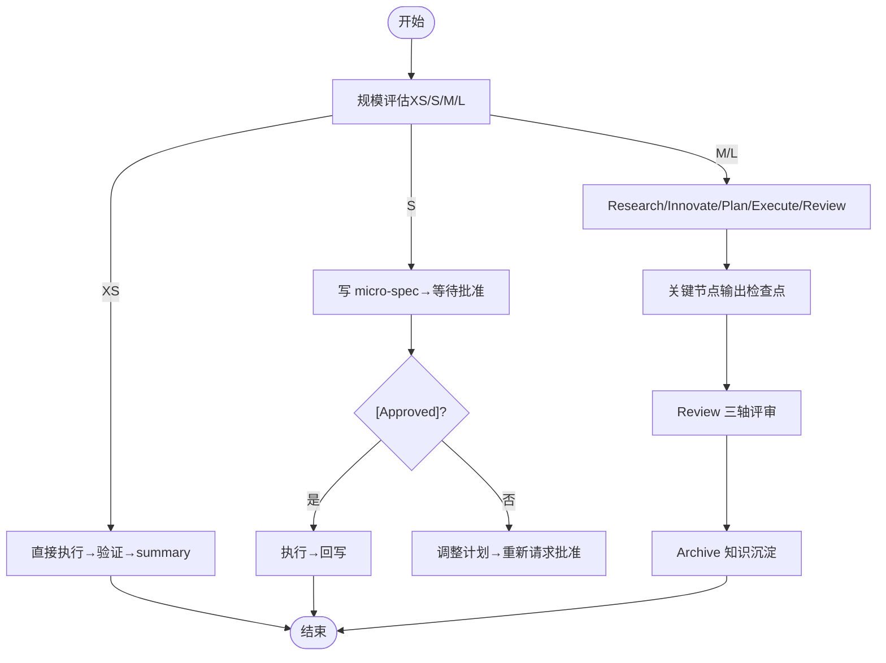
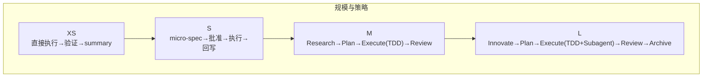
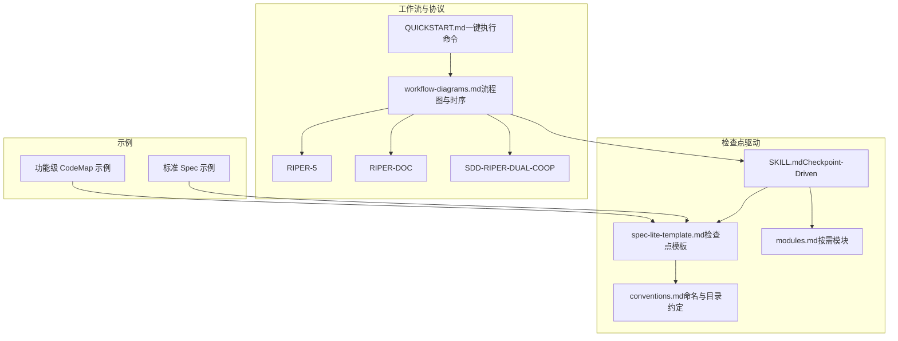

# 检查点机制

<cite>
**本文引用的文件**
- [reference-index.md](file://altas-workflow/reference-index.md)
- [workflow-diagrams.md](file://altas-workflow/workflow-diagrams.md)
- [QUICKSTART.md](file://altas-workflow/QUICKSTART.md)
- [SKILL.md（Checkpoint-Driven）](file://altas-workflow/references/checkpoint-driven/SKILL.md)
- [检查点模板（Spec Lite）](file://altas-workflow/references/checkpoint-driven/spec-lite-template.md)
- [命名与目录约定](file://altas-workflow/references/checkpoint-driven/conventions.md)
- [按需模块](file://altas-workflow/references/checkpoint-driven/modules.md)
- [示例：标准 Spec](file://altas-workflow/references/agents/sdd-riper-one-light/examples/specs/spec-standard-security-status-race.md)
- [示例：功能级 CodeMap](file://altas-workflow/references/agents/sdd-riper-one-light/examples/codemap/codemap-feature-content-control.md)
- [RIPER-5 协议](file://altas-workflow/protocols/RIPER-5.md)
- [RIPER-DOC 协议](file://altas-workflow/protocols/RIPER-DOC.md)
- [SDD-RIPER 双模型协作协议](file://altas-workflow/protocols/SDD-RIPER-DUAL-COOP.md)
</cite>

## 目录
1. [简介](#简介)
2. [项目结构](#项目结构)
3. [核心组件](#核心组件)
4. [架构总览](#架构总览)
5. [详细组件分析](#详细组件分析)
6. [依赖关系分析](#依赖关系分析)
7. [性能考量](#性能考量)
8. [故障排查指南](#故障排查指南)
9. [结论](#结论)
10. [附录](#附录)

## 简介
本文件系统化阐述 ALTAS Workflow 的检查点机制，聚焦“检查点”的输出策略、格式规范与生成时机，覆盖 XS/S/M/L 不同规模任务的差异化实践。检查点是贯穿研究、创新、规划、执行与审查各阶段的“短 checkpoint”，用于固化当前理解、核心目标、下一步动作、风险与验证方式，并在执行前后与偏差暴露后进行对齐与回写，确保“证据优先、可审计、可恢复”。本文还提供完整检查点模板的组成要素、生成与回写流程、样例与最佳实践，帮助开发者正确生成与解读检查点，从而实现高质量进度跟踪与质量控制。

## 项目结构
与检查点机制直接相关的知识资产主要分布在以下区域：
- references/checkpoint-driven：检查点驱动的核心协议、模板与约定
- references/agents/sdd-riper-one-light/examples：真实任务示例（标准 Spec、轻量 Spec、CodeMap）
- protocols：RIPER-5、RIPER-DOC、SDD-RIPER-DUAL-COOP 等协议，支撑检查点在不同模式下的落地
- altas-workflow/workflow-diagrams.md：工作流可视化，体现检查点在各阶段的触发与作用
- altas-workflow/reference-index.md：索引文件，指引按需加载与调用时机

**图表来源**
- [reference-index.md:130-140](file://altas-workflow/reference-index.md#L130-L140)
- [workflow-diagrams.md:1-42](file://altas-workflow/workflow-diagrams.md#L1-L42)

**章节来源**
- [reference-index.md:130-140](file://altas-workflow/reference-index.md#L130-L140)
- [workflow-diagrams.md:1-42](file://altas-workflow/workflow-diagrams.md#L1-L42)

## 核心组件
- 检查点协议（Checkpoint Protocol）：定义检查点的生成时机、输出内容与回写规则，强调“实现前 checkpoint、偏差后对齐、执行后回写”
- 检查点模板（Spec Lite）：提供标准化字段清单，确保检查点在 XS/S/M/L 各规模下的一致性与可审计性
- 按需模块（Modules）：Deep Planning、Debug、Review、Multi-project 等，按场景加载，避免常驻 token
- 命名与目录约定：统一 micro-spec、standard spec、codemap 的落盘路径与命名，便于检索与回溯
- 工作流图与时序：明确检查点在规模评估、阶段转换、Review 三轴与归档中的触发点

**章节来源**
- [SKILL.md（Checkpoint-Driven）:14-27](file://altas-workflow/references/checkpoint-driven/SKILL.md#L14-L27)
- [检查点模板（Spec Lite）:40-49](file://altas-workflow/references/checkpoint-driven/spec-lite-template.md#L40-L49)
- [按需模块:1-57](file://altas-workflow/references/checkpoint-driven/modules.md#L1-L57)
- [命名与目录约定:10-21](file://altas-workflow/references/checkpoint-driven/conventions.md#L10-L21)
- [workflow-diagrams.md:291-337](file://altas-workflow/workflow-diagrams.md#L291-L337)

## 架构总览
检查点机制在 ALTAS Workflow 中的总体作用：
- 规模评估后，XS/S/M/L 各规模在关键节点输出检查点，作为“门禁”与“暂停点”
- 执行前检查点用于获取批准；偏差暴露后检查点用于对齐核心目标；执行后检查点用于回写证据
- Review 三轴评审与 Archive 知识沉淀均以检查点为依据，确保可追溯与可审计

**图表来源**
- [workflow-diagrams.md:291-337](file://altas-workflow/workflow-diagrams.md#L291-L337)
- [QUICKSTART.md:36-49](file://altas-workflow/QUICKSTART.md#L36-L49)
- [SKILL.md（Checkpoint-Driven）:48-57](file://altas-workflow/references/checkpoint-driven/SKILL.md#L48-L57)

## 详细组件分析

### 检查点模板与字段规范
检查点模板提供标准化字段，确保在 XS/S/M/L 各规模下检查点的一致性与可审计性。关键字段包括：
- 任务理解（当前对任务的理解与边界）
- 核心目标（阶段性核心目标，需事件触发式复述）
- 当前进度（已完成/在途/阻塞）
- 下一步（1-3 个原子动作）
- 涉及文件/模块（范围与边界）
- 风险（技术/业务/跨项目/兼容性等）
- 验证方式（自检/静态检查/运行/测试/人工确认）
- 执行批准（Pending/Approved）

此外，模板建议：
- Done Contract 保持 1-3 行，优先写“完成定义 + 证明来源”
- Checkpoint Summary 明确区分“任务理解/核心目标/当前进度”
- Validation 优先记录外部证据，模型自检仅作补充
- 执行前将 Execution Approval 置为 Pending，获批后改为 Approved
- 暂停/切换任务点或准备交接前，更新 Resume/Handoff

**章节来源**
- [检查点模板（Spec Lite）:8-69](file://altas-workflow/references/checkpoint-driven/spec-lite-template.md#L8-L69)
- [检查点模板（Spec Lite）:71-85](file://altas-workflow/references/checkpoint-driven/spec-lite-template.md#L71-L85)

### 生成时机与触发规则
- 实现阶段：实现前必须输出一次短检查点（理解/目标/下一步/风险/验证），获取批准后方可执行
- 偏差暴露后：基于证据重述核心目标是否变化，决定继续或调整
- 执行后：回写 Change Log、Validation、Resume/Handoff，说明核心目标是否由证据证明完成
- 规模评估后：XS 直接执行；S 输出 micro-spec 并等待批准；M/L 进入 Research/Plan/Execute/Review 流程并在关键节点输出检查点

**图表来源**
- [workflow-diagrams.md:291-337](file://altas-workflow/workflow-diagrams.md#L291-L337)
- [QUICKSTART.md:36-49](file://altas-workflow/QUICKSTART.md#L36-L49)
- [SKILL.md（Checkpoint-Driven）:48-57](file://altas-workflow/references/checkpoint-driven/SKILL.md#L48-L57)

**章节来源**
- [SKILL.md（Checkpoint-Driven）:23](file://altas-workflow/references/checkpoint-driven/SKILL.md#L23)
- [SKILL.md（Checkpoint-Driven）:53](file://altas-workflow/references/checkpoint-driven/SKILL.md#L53)
- [workflow-diagrams.md:291-337](file://altas-workflow/workflow-diagrams.md#L291-L337)

### XS/S/M/L 规模差异与检查点策略
- XS（无需加载任何参考）：识别为“极简修改”（typo、日志、配置值等），直接执行并输出 1 行 summary；若复杂度超预期，立即升级
- S（按需加载）：写 micro-spec，输出检查点，等待批准后执行；复杂度上升时升级
- M（标准加载）：进入 Research→Plan→Execute（TDD）→Review；在 Research/Plan/Execute/Review 各阶段输出检查点，确保门禁与证据
- L（完整加载）：在 Innovate 阶段给出方案对比与取舍，Plan 提供原子 Checklist，Execute 阶段 TDD+Subagent 并行，Review 三轴评审后 Archive

**图表来源**
- [workflow-diagrams.md:12-18](file://altas-workflow/workflow-diagrams.md#L12-L18)
- [QUICKSTART.md:52-90](file://altas-workflow/QUICKSTART.md#L52-L90)
- [reference-index.md:177-202](file://altas-workflow/reference-index.md#L177-L202)

**章节来源**
- [QUICKSTART.md:67-75](file://altas-workflow/QUICKSTART.md#L67-L75)
- [QUICKSTART.md:40-43](file://altas-workflow/QUICKSTART.md#L40-L43)
- [reference-index.md:177-202](file://altas-workflow/reference-index.md#L177-L202)

### 检查点在工作流中的作用与价值
- 进度跟踪：通过 Checkpoint Summary 的“任务理解/核心目标/当前进度/下一步/风险/验证”，持续对齐与汇报
- 质量控制：通过 Done Contract、Validation、Review 三轴评审，确保实现与 Spec/Checkpoint 一致
- 可恢复性：通过 Resume/Handoff，确保长任务或暂停后可快速恢复
- 可审计性：通过 Change Log、Execution Approval、Evidence First，形成可追溯的证据链

**章节来源**
- [检查点模板（Spec Lite）:12-69](file://altas-workflow/references/checkpoint-driven/spec-lite-template.md#L12-L69)
- [按需模块:31-43](file://altas-workflow/references/checkpoint-driven/modules.md#L31-L43)
- [RIPER-5.md:104-125](file://altas-workflow/protocols/RIPER-5.md#L104-L125)

### 检查点样例与最佳实践
- 样例参考
  - 标准 Spec 示例展示了完整的“目标/范围/事实/开放问题/复述理解/检查点摘要/变更日志/验证/恢复/交接”闭环
  - 功能级 CodeMap 示例展示了如何用 CodeMap 组织复杂功能的入口、主链路、状态边界与风险点，辅助检查点对齐
- 最佳实践
  - 小任务用 micro-spec + micro-summary；复杂任务再按需展开
  - Done Contract 保持简洁，优先写“完成定义 + 证明来源”
  - 执行前将 Execution Approval 置为 Pending，获批后改为 Approved
  - 偏差暴露后优先更新 Checkpoint 的“目标一致性检查”，再决定继续或调整
  - 暂停/切换任务点或准备交接前，务必更新 Resume/Handoff

**章节来源**
- [示例：标准 Spec:1-87](file://altas-workflow/references/agents/sdd-riper-one-light/examples/specs/spec-standard-security-status-race.md#L1-L87)
- [示例：功能级 CodeMap:1-136](file://altas-workflow/references/agents/sdd-riper-one-light/examples/codemap/codemap-feature-content-control.md#L1-L136)
- [检查点模板（Spec Lite）:71-85](file://altas-workflow/references/checkpoint-driven/spec-lite-template.md#L71-L85)

### 检查点与协议的关系
- RIPER-5：强调模式声明、严格评审与结论格式，检查点作为评审依据之一
- RIPER-DOC：强调事实核查与准确性，检查点可作为验证证据的一部分
- SDD-RIPER-DUAL-COOP：强调“Spec-centric universe”，检查点与 Spec 互为索引与回写点

**章节来源**
- [RIPER-5.md:104-125](file://altas-workflow/protocols/RIPER-5.md#L104-L125)
- [RIPER-DOC.md:43-60](file://altas-workflow/protocols/RIPER-DOC.md#L43-L60)
- [SDD-RIPER-DUAL-COOP.md:32-40](file://altas-workflow/protocols/SDD-RIPER-DUAL-COOP.md#L32-L40)

## 依赖关系分析
检查点机制与工作流各阶段、协议与示例之间的依赖关系如下：

**图表来源**
- [SKILL.md（Checkpoint-Driven）:69-74](file://altas-workflow/references/checkpoint-driven/SKILL.md#L69-L74)
- [workflow-diagrams.md:1-42](file://altas-workflow/workflow-diagrams.md#L1-L42)
- [QUICKSTART.md:36-49](file://altas-workflow/QUICKSTART.md#L36-L49)
- [示例：标准 Spec:1-87](file://altas-workflow/references/agents/sdd-riper-one-light/examples/specs/spec-standard-security-status-race.md#L1-L87)
- [示例：功能级 CodeMap:1-136](file://altas-workflow/references/agents/sdd-riper-one-light/examples/codemap/codemap-feature-content-control.md#L1-L136)

**章节来源**
- [reference-index.md:130-140](file://altas-workflow/reference-index.md#L130-L140)
- [workflow-diagrams.md:1-42](file://altas-workflow/workflow-diagrams.md#L1-L42)

## 性能考量
- 渐进式披露：只在命中场景时按需加载 references，减少常驻 token
- 轻量输出：默认短输出，优先“当前理解 + 核心目标 + 下一步 + 必要风险”，避免冗长计划
- 证据优先：验证以外部证据为主，减少模型自检成本
- 目录与命名约定：统一落盘路径与命名，降低检索与回溯成本

**章节来源**
- [SKILL.md（Checkpoint-Driven）:75-84](file://altas-workflow/references/checkpoint-driven/SKILL.md#L75-L84)
- [命名与目录约定:10-21](file://altas-workflow/references/checkpoint-driven/conventions.md#L10-L21)

## 故障排查指南
常见问题与处理建议：
- AI 一次性输出过多代码：ALTAS 内置检查点机制，AI 完成一步后必须暂停等确认。如出现“暴走”，回复“请停止，严格执行检查点机制，每次只推进一步”
- 为什么总是先写测试：这是 Evidence First + TDD 铁律。若任务极简，可用 “>>” 触发 XS 模式跳过 TDD
- 如何中途干预计划：在任意检查点回复“[修改] …”，AI 会根据反馈调整 Plan 后重新请求 Approve
- 如何选择 XS/S/M/L：ALTAS 会自动评估；也可强制指定：">>"=XS、"FAST"=S、默认=M、"DEEP"=L；执行中可随时“[升级为M]”或“[降级为S]”

**章节来源**
- [QUICKSTART.md:119-140](file://altas-workflow/QUICKSTART.md#L119-L140)

## 结论
检查点机制是 ALTAS Workflow 的“控制点与证据源”，贯穿 XS/S/M/L 各规模任务的关键节点，确保实现前对齐、偏差后对齐与执行后回写。通过标准化模板、按需模块与命名约定，开发者可在强模型高频多轮场景中高效落地检查点，实现高质量进度跟踪与质量控制。建议在实践中坚持“证据优先、可审计、可恢复”的原则，配合 Done Contract、Validation 与 Resume/Handoff，构建可持续的知识沉淀与协作信任。

## 附录
- 触发词与模式映射：FAST/快速/>>、DEEP、MAP/PROJECT MAP、MULTI/多项目、DEBUG/排查、REVIEW SPEC/REVIEW EXECUTE、ARCHIVE/归档、DOC/写文档
- 命名与目录约定：micro-spec、standard spec、codemap 的落盘路径与命名规则

**章节来源**
- [workflow-diagrams.md:261-287](file://altas-workflow/workflow-diagrams.md#L261-L287)
- [命名与目录约定:6-21](file://altas-workflow/references/checkpoint-driven/conventions.md#L6-L21)