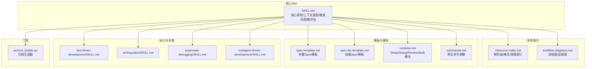
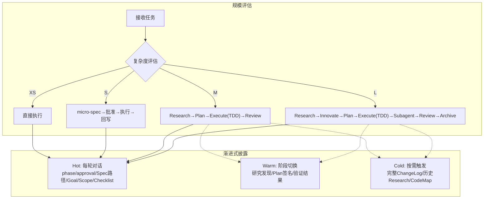
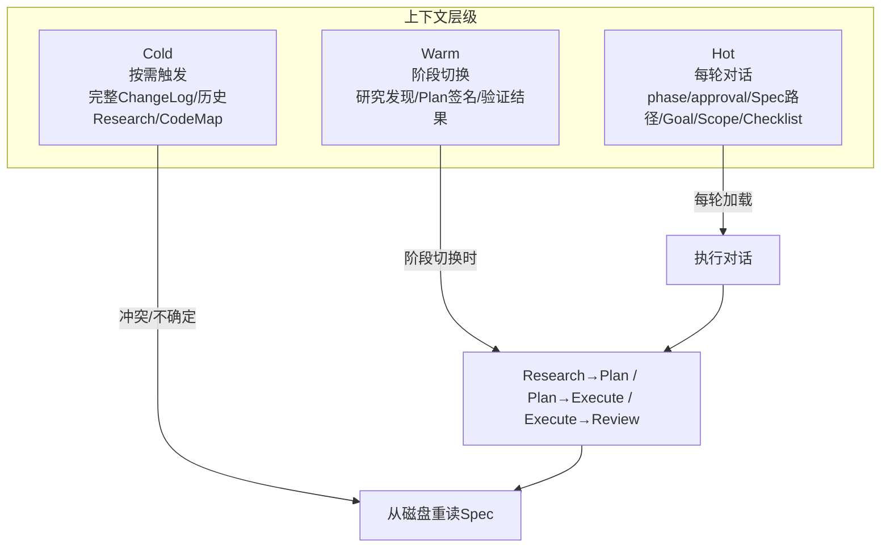
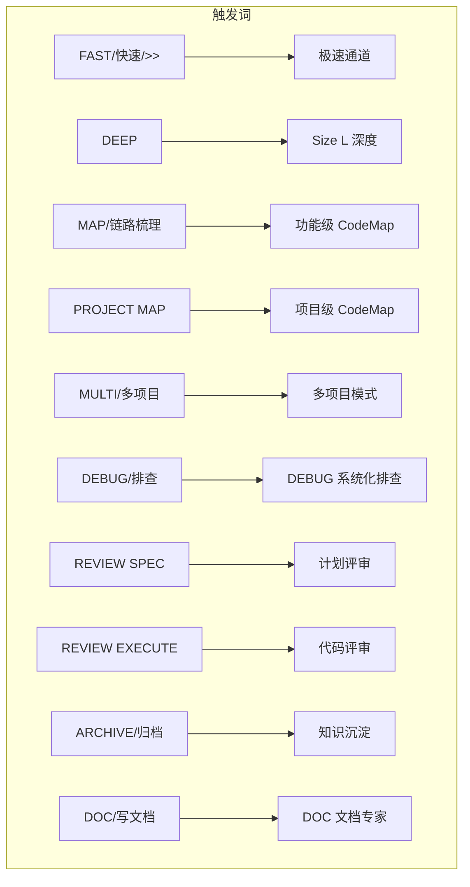
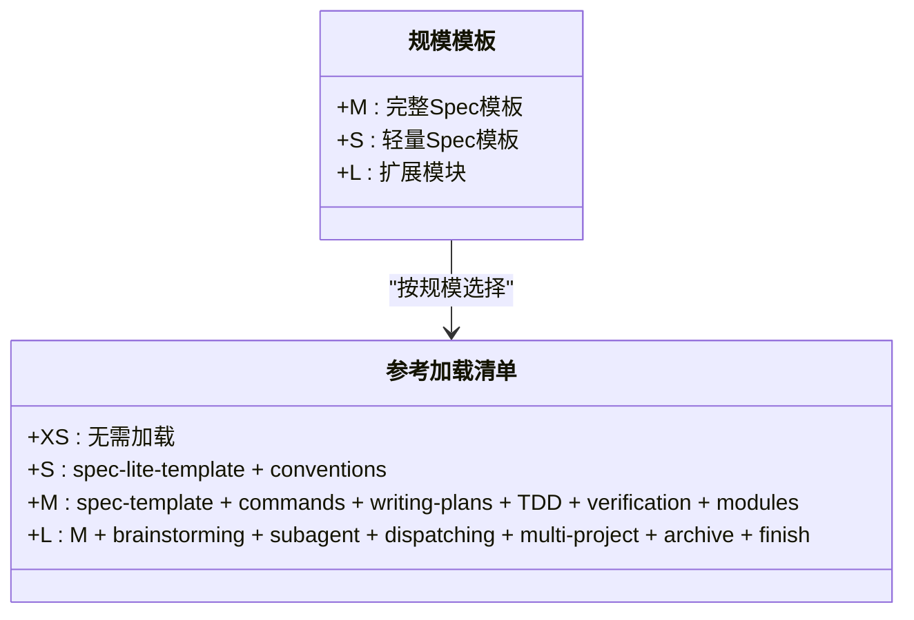
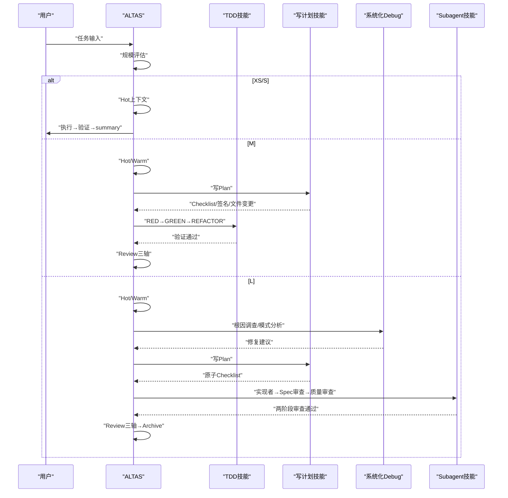
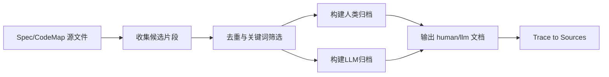
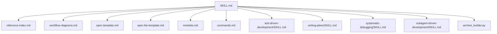

# 渐进式披露机制

<cite>
**本文引用的文件**   
- [altas-workflow/QUICKSTART.md](file://altas-workflow/QUICKSTART.md)
- [altas-workflow/SKILL.md](file://altas-workflow/SKILL.md)
- [altas-workflow/reference-index.md](file://altas-workflow/reference-index.md)
- [altas-workflow/workflow-diagrams.md](file://altas-workflow/workflow-diagrams.md)
- [altas-workflow/references/spec-driven-development/spec-template.md](file://altas-workflow/references/spec-driven-development/spec-template.md)
- [altas-workflow/references/checkpoint-driven/spec-lite-template.md](file://altas-workflow/references/checkpoint-driven/spec-lite-template.md)
- [altas-workflow/references/superpowers/systematic-debugging/SKILL.md](file://altas-workflow/references/superpowers/systematic-debugging/SKILL.md)
- [altas-workflow/references/superpowers/test-driven-development/SKILL.md](file://altas-workflow/references/superpowers/test-driven-development/SKILL.md)
- [altas-workflow/scripts/archive_builder.py](file://altas-workflow/scripts/archive_builder.py)
- [altas-workflow/references/superpowers/writing-plans/SKILL.md](file://altas-workflow/references/superpowers/writing-plans/SKILL.md)
- [altas-workflow/references/checkpoint-driven/modules.md](file://altas-workflow/references/checkpoint-driven/modules.md)
- [altas-workflow/references/spec-driven-development/commands.md](file://altas-workflow/references/spec-driven-development/commands.md)
- [altas-workflow/references/superpowers/subagent-driven-development/SKILL.md](file://altas-workflow/references/superpowers/subagent-driven-development/SKILL.md)
</cite>

## 目录
1. [简介](#简介)
2. [项目结构](#项目结构)
3. [核心组件](#核心组件)
4. [架构总览](#架构总览)
5. [详细组件分析](#详细组件分析)
6. [依赖分析](#依赖分析)
7. [性能考量](#性能考量)
8. [故障排查指南](#故障排查指南)
9. [结论](#结论)
10. [附录](#附录)

## 简介
本文件围绕 ALTAS Workflow 的“渐进式披露机制”进行系统化技术说明，聚焦于按需加载参考资料的实现原理与工作机制，阐释 Hot/Warm/Cold 三层上下文层级的设计理念、加载时机、内容范围与使用场景，并给出避免上下文腐烂、保持有效工作记忆的策略。同时，文档提供上下文装配策略（磁盘重读与硬门约束）、实际使用示例与最佳实践，帮助开发者在不同规模任务中高效运用。

## 项目结构
ALTAS Workflow 将工作流能力整合为 Skill，并通过“按需加载”的参考索引体系实现资源的渐进式披露。核心文件包括：
- 快速入门与使用指引：QUICKSTART.md
- 核心 Skill 与上下文装配策略：SKILL.md
- 参考资料总索引与按规模加载清单：reference-index.md
- 流程图与可视化参考：workflow-diagrams.md
- 规模相关模板与模块：spec-template.md、spec-lite-template.md、modules.md、commands.md
- 执行与评审相关技能：test-driven-development、writing-plans、systematic-debugging、subagent-driven-development
- 归档与知识沉淀工具：archive_builder.py

**图表来源**
- [altas-workflow/SKILL.md](file://altas-workflow/SKILL.md)
- [altas-workflow/reference-index.md](file://altas-workflow/reference-index.md)
- [altas-workflow/workflow-diagrams.md](file://altas-workflow/workflow-diagrams.md)

**章节来源**
- [altas-workflow/QUICKSTART.md](file://altas-workflow/QUICKSTART.md)
- [altas-workflow/SKILL.md](file://altas-workflow/SKILL.md)
- [altas-workflow/reference-index.md](file://altas-workflow/reference-index.md)
- [altas-workflow/workflow-diagrams.md](file://altas-workflow/workflow-diagrams.md)

## 核心组件
- 渐进式披露策略：按规模与阶段动态加载参考材料，避免一次性常驻全部上下文，降低 token 消耗与认知负担。
- Hot/Warm/Cold 三层上下文：
  - Hot：每轮对话携带的“即时上下文”，如阶段、审批状态、Spec 路径、目标、范围、活跃 Checklist。
  - Warm：阶段切换时的“过渡上下文”，如研究发现、Plan 文件/签名、验证结果。
  - Cold：按需触发的“深度上下文”，如完整 ChangeLog、历史 Research 详情、完整 CodeMap。
- 硬门与磁盘重读：当出现冲突、缺失或不确定时，立即从磁盘重读完整 Spec，确保决策基于最新事实。
- 规模评估与触发词：通过自动评估任务规模（XS/S/M/L）选择工作流深度与加载策略，配合触发词进入特殊模式（FAST/DEBUG/MULTI/DOC/MAP/ARCHIVE）。

**章节来源**
- [altas-workflow/SKILL.md](file://altas-workflow/SKILL.md)
- [altas-workflow/workflow-diagrams.md](file://altas-workflow/workflow-diagrams.md)

## 架构总览
下图展示 ALTAS 的工作流与渐进式披露在不同规模下的交互关系，以及各阶段的参考加载点。

**图表来源**
- [altas-workflow/workflow-diagrams.md](file://altas-workflow/workflow-diagrams.md)
- [altas-workflow/SKILL.md](file://altas-workflow/SKILL.md)

## 详细组件分析

### 渐进式披露机制与上下文装配策略
- Hot 层（每轮）：承载“当前最相关的即时信息”，如当前阶段、审批状态、Spec 路径、目标、范围、活跃 Checklist，确保对话轮次间的一致性与可追踪性。
- Warm 层（阶段切换）：在 Research→Plan、Plan→Execute、Execute→Review 等关键节点，补充“过渡上下文”，如研究发现、Plan 文件/签名、验证结果，减少重复输入与认知损耗。
- Cold 层（按需）：在冲突、不确定或需要回溯时触发，加载完整 ChangeLog、历史 Research 详情、完整 CodeMap，用于“磁盘重读”以恢复一致的决策基线。
- 硬门与磁盘重读：当出现冲突/缺失/不确定时，立即从磁盘重读完整 Spec，确保后续动作基于最新事实，避免上下文腐烂。
- 规模化加载清单：
  - XS：无需加载任何参考，依赖对话上下文；S 规模的 micro-spec 回写时确保 Goal 与验证结果落盘。
  - S：按需加载 spec-lite-template 与 conventions。
  - M：加载 spec-template、commands、writing-plans、test-driven-development、verification-before-completion、modules（Review 模块）。
  - L：在 M 基础上增加 brainstorming、subagent-driven-development、dispatching-parallel-agents、multi-project、archive-template、finishing-a-development-branch。

**图表来源**
- [altas-workflow/SKILL.md](file://altas-workflow/SKILL.md)
- [altas-workflow/reference-index.md](file://altas-workflow/reference-index.md)

**章节来源**
- [altas-workflow/SKILL.md](file://altas-workflow/SKILL.md)
- [altas-workflow/reference-index.md](file://altas-workflow/reference-index.md)

### 规模评估与触发词映射
- 触发词与模式映射：FAST/DEEP/MAP/MULTI/DEBUG/REVIEW/ARCHIVE/DOC 等触发词映射到相应工作流与参考加载点，确保在正确时机按需加载。
- 规模评估速查：根据任务信号（如 typo、配置项、接口参数、CRUD、重构、跨模块、架构级重构、前后端联动等）自动评估 XS/S/M/L，执行中可随时升级/降级。

**图表来源**
- [altas-workflow/workflow-diagrams.md](file://altas-workflow/workflow-diagrams.md)
- [altas-workflow/QUICKSTART.md](file://altas-workflow/QUICKSTART.md)

**章节来源**
- [altas-workflow/QUICKSTART.md](file://altas-workflow/QUICKSTART.md)
- [altas-workflow/workflow-diagrams.md](file://altas-workflow/workflow-diagrams.md)

### 规模模板与参考加载
- M 规模：使用完整 Spec 模板，包含 Context Sources、Codemap Used、Research Findings、Plan（含文件变更、签名、Checklist）、Execute Log、Review Verdict、Plan-Execution Diff、Archive Record 等章节。
- S 规模：使用轻量 Spec 模板，强调 Goal、Done Contract、Scope、Facts/Constraints、Open Questions、Restated Understanding、Checkpoint Summary、Change Log、Validation、Resume/Handoff 等关键区块。
- L 规模：在 M 基础上扩展 Innovate（方案对比）、Subagent 驱动、并行 Agent、Multi-project、Archive 等模块。

**图表来源**
- [altas-workflow/references/spec-driven-development/spec-template.md](file://altas-workflow/references/spec-driven-development/spec-template.md)
- [altas-workflow/references/checkpoint-driven/spec-lite-template.md](file://altas-workflow/references/checkpoint-driven/spec-lite-template.md)
- [altas-workflow/reference-index.md](file://altas-workflow/reference-index.md)

**章节来源**
- [altas-workflow/references/spec-driven-development/spec-template.md](file://altas-workflow/references/spec-driven-development/spec-template.md)
- [altas-workflow/references/checkpoint-driven/spec-lite-template.md](file://altas-workflow/references/checkpoint-driven/spec-lite-template.md)
- [altas-workflow/reference-index.md](file://altas-workflow/reference-index.md)

### 执行与评审中的渐进式披露
- TDD 循环：RED→GREEN→REFACTOR，逐步或批量执行，确保每次变更都有失败测试先行与最小实现通过。
- 写计划：将任务拆解为原子 Checklist，明确文件变更、签名与 Done Contract，便于按需加载与两阶段审查。
- 系统化 Debug：在 DEBUG 模式下，先根因调查，再模式分析，形成假设并最小化验证，最后实施修复，避免症状修复。
- Subagent 驱动：在 L 规模下，按任务派发实现者子代理，先做 Spec 合规审查，再做代码质量审查，确保高质量与快速迭代。

**图表来源**
- [altas-workflow/SKILL.md](file://altas-workflow/SKILL.md)
- [altas-workflow/references/superpowers/test-driven-development/SKILL.md](file://altas-workflow/references/superpowers/test-driven-development/SKILL.md)
- [altas-workflow/references/superpowers/writing-plans/SKILL.md](file://altas-workflow/references/superpowers/writing-plans/SKILL.md)
- [altas-workflow/references/superpowers/systematic-debugging/SKILL.md](file://altas-workflow/references/superpowers/systematic-debugging/SKILL.md)
- [altas-workflow/references/superpowers/subagent-driven-development/SKILL.md](file://altas-workflow/references/superpowers/subagent-driven-development/SKILL.md)

**章节来源**
- [altas-workflow/SKILL.md](file://altas-workflow/SKILL.md)
- [altas-workflow/references/superpowers/test-driven-development/SKILL.md](file://altas-workflow/references/superpowers/test-driven-development/SKILL.md)
- [altas-workflow/references/superpowers/writing-plans/SKILL.md](file://altas-workflow/references/superpowers/writing-plans/SKILL.md)
- [altas-workflow/references/superpowers/systematic-debugging/SKILL.md](file://altas-workflow/references/superpowers/systematic-debugging/SKILL.md)
- [altas-workflow/references/superpowers/subagent-driven-development/SKILL.md](file://altas-workflow/references/superpowers/subagent-driven-development/SKILL.md)

### 归档与知识沉淀中的上下文装配
- 归档生成器支持从 Spec 与 CodeMap 提炼“人类可读”与“LLM 可复用”两类文档，自动抽取决策、结果、风险、接口、触点与模式，输出 Trace to Sources，避免上下文腐烂。
- 归档模式支持 snapshot 与 thematic，topic 可由用户指定或从 targets 推断，输出路径遵循统一时间前缀命名约定。

**图表来源**
- [altas-workflow/scripts/archive_builder.py](file://altas-workflow/scripts/archive_builder.py)

**章节来源**
- [altas-workflow/scripts/archive_builder.py](file://altas-workflow/scripts/archive_builder.py)

## 依赖分析
- 参考索引与按规模加载：reference-index.md 提供按阶段/模式/规模的统一发现入口，SKILL.md 与 workflow-diagrams.md 明确加载时机与内容范围。
- 执行与评审技能：test-driven-development、writing-plans、systematic-debugging、subagent-driven-development 与 modules.md 形成完整的执行闭环。
- 命令与上下文：commands.md 定义 create_codemap/build_context_bundle/sdd_bootstrap 等原生命令参数，支撑 PRE-RESEARCH 阶段的上下文装配。

**图表来源**
- [altas-workflow/SKILL.md](file://altas-workflow/SKILL.md)
- [altas-workflow/reference-index.md](file://altas-workflow/reference-index.md)
- [altas-workflow/workflow-diagrams.md](file://altas-workflow/workflow-diagrams.md)

**章节来源**
- [altas-workflow/SKILL.md](file://altas-workflow/SKILL.md)
- [altas-workflow/reference-index.md](file://altas-workflow/reference-index.md)
- [altas-workflow/workflow-diagrams.md](file://altas-workflow/workflow-diagrams.md)

## 性能考量
- 减少 token 消耗：通过 Hot/Warm/Cold 三层上下文与按需加载，避免一次性常驻全部参考材料。
- 避免上下文腐烂：冲突/缺失/不确定时磁盘重读完整 Spec，确保决策基线一致。
- 规模化策略：XS/S 规模尽量依赖对话上下文与轻量模板，M/L 规模在关键节点补充 Warm/Cold 上下文，降低重复输入与认知负担。
- 执行效率：TDD 循环与 Subagent 驱动减少调试成本与返工，两阶段审查保证质量与速度平衡。

## 故障排查指南
- 常见问题与建议：
  - AI 一次性输出过多：ALTAS 内置检查点机制，必须在每步完成后等待确认；若 AI 暴走，回复“请停止，严格执行检查点机制”。
  - 为什么 AI 总是先写测试：这是 Evidence First + TDD 铁律；若任务极简，可用 >> 触发 XS 模式跳过 TDD。
  - 如何中途干预计划：在任意检查点回复“[修改] 请不要使用 Redis，改为内存缓存”，AI 会根据反馈调整 Plan 后重新请求 Approve。
  - 参考资料太多：不需要全部读取，ALTAS 采用渐进式披露，只在命中场景时按需读取对应文件。
- 磁盘重读与硬门：
  - 冲突/缺失/不确定时，立即从磁盘重读完整 Spec，确保后续动作基于最新事实。
  - No Spec, No Code / No Approval, No Execute 铁律贯穿全流程，避免无约束执行。

**章节来源**
- [altas-workflow/QUICKSTART.md](file://altas-workflow/QUICKSTART.md)
- [altas-workflow/SKILL.md](file://altas-workflow/SKILL.md)

## 结论
ALTAS Workflow 的渐进式披露机制通过 Hot/Warm/Cold 三层上下文与磁盘重读硬门，实现了在不同规模任务中的高效、可控与可追溯的知识装配。结合按需加载的参考索引体系与严格的铁律约束，开发者可以在复杂项目中保持有效的工作记忆，避免上下文腐烂，提升交付质量与速度。

## 附录
- 实际使用示例与最佳实践：
  - 日常功能迭代（Size M）：sdd_bootstrap 启动 → Research 对齐 → Plan 拆解 → TDD 执行 → Review 三轴 → Archive 沉淀。
  - 紧急修复（Size XS）：>> 前缀 → 直接修改 → 验证 → 1 行 summary。
  - 架构重构（Size L）：create_codemap → Research → Innovate 方案对比 → Plan → TDD + Subagent → Review → Archive。
  - Bug 排查（DEBUG）：系统化 Debug → 三角定位 → 根因候选 → 修复建议（若需修复，进入 RIPER/FAST）。
  - 多项目协作（MULTI）：自动发现子项目 → 生成双项目 CodeMap → 按项目分组 Plan → 依赖顺序执行 → 记录 Contract Interfaces。
- 上下文装配策略最佳实践：
  - XS/S：依赖对话上下文；S 规模 micro-spec 回写时确保 Goal 与验证结果落盘。
  - M/L：在 Research→Plan、Plan→Execute、Execute→Review 阶段切换时加载 Warm 上下文；遇到冲突/不确定时加载 Cold 上下文并磁盘重读完整 Spec。
  - 归档：使用 archive_builder.py 生成 human/llm 双视角文档，附带 Trace to Sources，避免上下文腐烂。

**章节来源**
- [altas-workflow/QUICKSTART.md](file://altas-workflow/QUICKSTART.md)
- [altas-workflow/SKILL.md](file://altas-workflow/SKILL.md)
- [altas-workflow/scripts/archive_builder.py](file://altas-workflow/scripts/archive_builder.py)