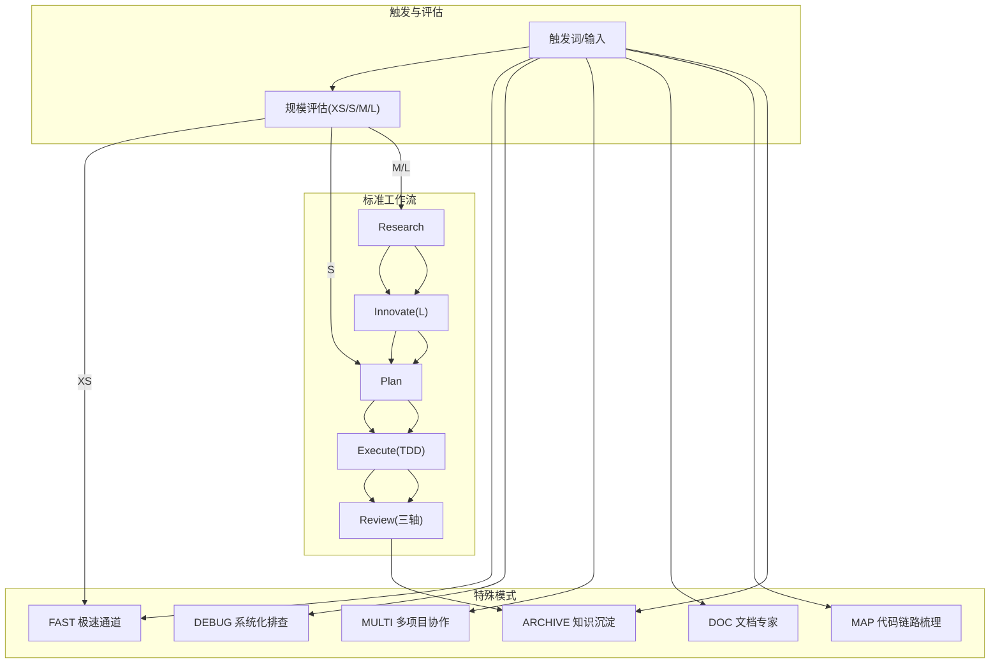
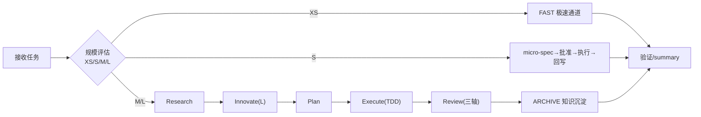
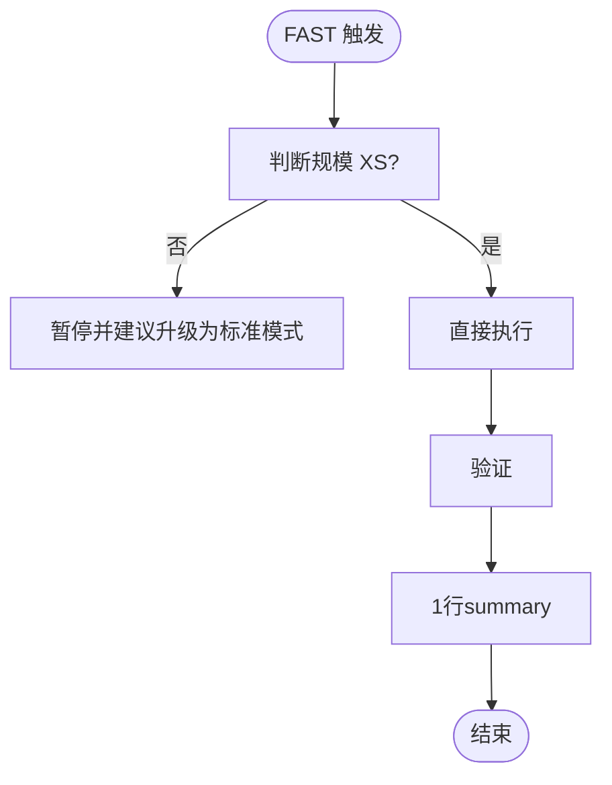
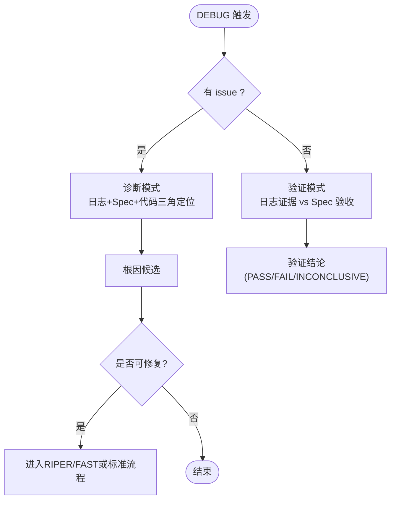
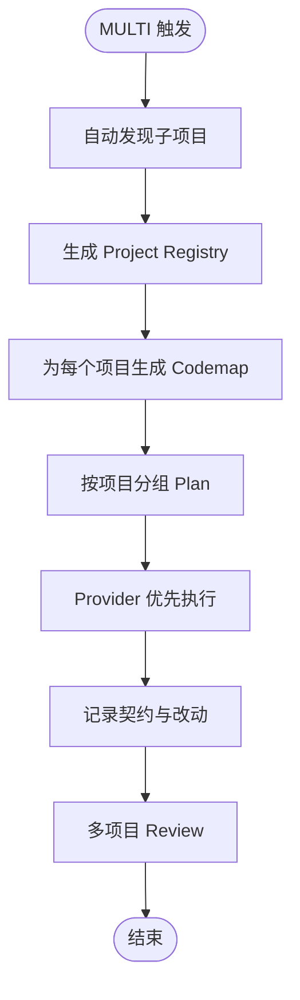
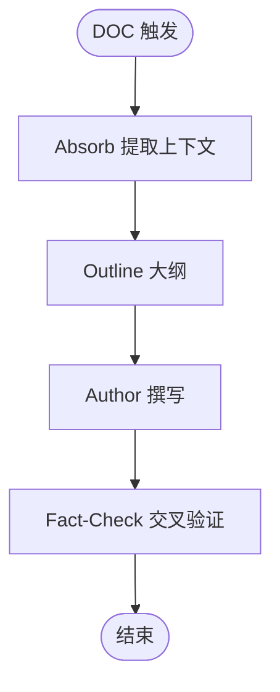
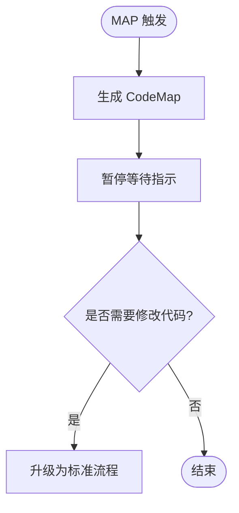
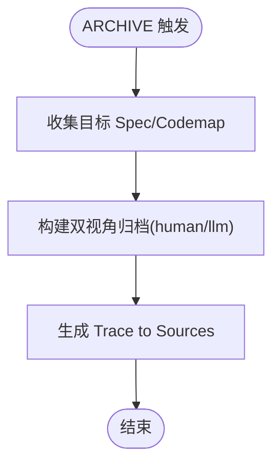
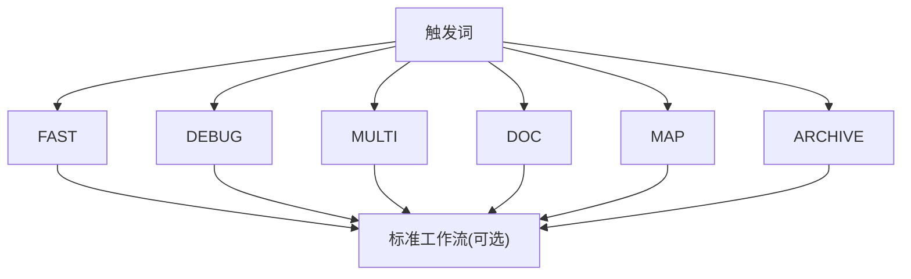

# 特殊模式

<cite>
**本文引用的文件**   
- [altas-workflow/QUICKSTART.md](file://altas-workflow/QUICKSTART.md)
- [altas-workflow/SKILL.md](file://altas-workflow/SKILL.md)
- [altas-workflow/reference-index.md](file://altas-workflow/reference-index.md)
- [altas-workflow/workflow-diagrams.md](file://altas-workflow/workflow-diagrams.md)
- [altas-workflow/protocols/RIPER-DOC.md](file://altas-workflow/protocols/RIPER-DOC.md)
- [altas-workflow/protocols/RIPER-5.md](file://altas-workflow/protocols/RIPER-5.md)
- [altas-workflow/protocols/SDD-RIPER-DUAL-COOP.md](file://altas-workflow/protocols/SDD-RIPER-DUAL-COOP.md)
- [altas-workflow/references/superpowers/systematic-debugging/SKILL.md](file://altas-workflow/references/superpowers/systematic-debugging/SKILL.md)
- [altas-workflow/references/superpowers/systematic-debugging/root-cause-tracing.md](file://altas-workflow/references/superpowers/systematic-debugging/root-cause-tracing.md)
- [altas-workflow/references/superpowers/systematic-debugging/condition-based-waiting.md](file://altas-workflow/references/superpowers/systematic-debugging/condition-based-waiting.md)
- [altas-workflow/references/superpowers/systematic-debugging/defense-in-depth.md](file://altas-workflow/references/superpowers/systematic-debugging/defense-in-depth.md)
- [altas-workflow/references/spec-driven-development/multi-project.md](file://altas-workflow/references/spec-driven-development/multi-project.md)
- [altas-workflow/references/spec-driven-development/archive-template.md](file://altas-workflow/references/spec-driven-development/archive-template.md)
- [altas-workflow/scripts/archive_builder.py](file://altas-workflow/scripts/archive_builder.py)
</cite>

## 目录
1. [简介](#简介)
2. [项目结构](#项目结构)
3. [核心组件](#核心组件)
4. [架构总览](#架构总览)
5. [详细组件分析](#详细组件分析)
6. [依赖关系分析](#依赖关系分析)
7. [性能考量](#性能考量)
8. [故障排查指南](#故障排查指南)
9. [结论](#结论)
10. [附录](#附录)

## 简介
本文件面向 ALTAS Workflow 的“特殊模式”，系统化解析 FAST 极速模式、DEBUG 系统化排查、MULTI 多项目协作、DOC 文档专家、MAP 代码链路梳理、ARCHIVE 知识沉淀模式的设计目的、触发条件、执行逻辑、适用场景、约束与产出要求，并给出模式间转换规则、组合使用方式、决策指南与性能优化建议。文档同时提供面向不同开发任务的实践指引与注意事项，帮助团队在不同规模与复杂度的任务中稳定高效地落地规范。

## 项目结构
ALTAS 将“特殊模式”内嵌于统一的技能与协议体系中，通过触发词与规模评估实现自动分流。核心文件包括：
- 技能与触发词定义：SKILL.md
- 快速启动与命令示例：QUICKSTART.md
- 参考资料索引：reference-index.md
- 流程图与可视化：workflow-diagrams.md
- 特殊模式协议与参考：
  - RIPER-DOC（文档专家）
  - RIPER-5（严格模式）
  - SDD-RIPER-DUAL-COOP（双模型协作）
  - Systematic Debugging（系统化调试）
  - Multi-Project（多项目协作）
  - Archive Template（归档模板）
- 归档自动化脚本：scripts/archive_builder.py

图表来源
- [altas-workflow/SKILL.md](file://altas-workflow/SKILL.md)
- [altas-workflow/QUICKSTART.md](file://altas-workflow/QUICKSTART.md)
- [altas-workflow/workflow-diagrams.md](file://altas-workflow/workflow-diagrams.md)

章节来源
- [altas-workflow/SKILL.md](file://altas-workflow/SKILL.md)
- [altas-workflow/QUICKSTART.md](file://altas-workflow/QUICKSTART.md)
- [altas-workflow/reference-index.md](file://altas-workflow/reference-index.md)
- [altas-workflow/workflow-diagrams.md](file://altas-workflow/workflow-diagrams.md)

## 核心组件
- 触发词与模式映射：FAST/DEBUG/MULTI/DOC/MAP/ARCHIVE 等触发词将任务路由到相应模式。
- 规模评估：XS/S/M/L 四档，决定是否进入 Research/Plan/Execute/Review/Archive 等标准阶段。
- 铁律与门禁：No Spec, No Code；No Approval, No Execute；Spec is Truth；Evidence First；TDD 铁律；Root Cause 必须；Resume Ready 等。
- 特殊模式子模块：
  - FAST：跳过 Research/Plan，直接执行，事后同步 Spec。
  - DEBUG：诊断模式（日志+Spec+代码三角定位）与验证模式（日志证据 vs Spec 验收标准）。
  - MULTI：自动发现子项目、Codemap、作用域隔离、跨项目契约与 Review。
  - DOC：Absorb→Outline→Author→Fact-Check 的文档专家流程。
  - MAP：只读分析，生成 CodeMap，必要时升级为标准流程。
  - ARCHIVE：双视角归档（human/llm），Trace to Sources，自动化脚本支持。

章节来源
- [altas-workflow/SKILL.md](file://altas-workflow/SKILL.md)
- [altas-workflow/QUICKSTART.md](file://altas-workflow/QUICKSTART.md)

## 架构总览
下图展示 ALTAS 的整体工作流与特殊模式的接入点，以及与标准阶段的衔接关系。

图表来源
- [altas-workflow/workflow-diagrams.md](file://altas-workflow/workflow-diagrams.md)
- [altas-workflow/SKILL.md](file://altas-workflow/SKILL.md)

## 详细组件分析

### FAST 极速模式
- 设计目的
  - 面向 XS 规模（typo、配置值、日志、UI 微调、单文件逻辑）的“极速通道”，跳过 Research/Plan，降低开销。
- 触发条件
  - 触发词：`>>` / `FAST` / `快速`。
- 执行逻辑
  - 直接执行→验证→1行 summary；若触及>2核心文件或架构改动，暂停并建议升级为标准模式。
- 适用场景
  - 紧急修复、小范围配置变更、UI 微调、日志调整。
- 约束与产出
  - 约束：XS 规模豁免 Spec；事后同步 Spec；不得绕过 Evidence First。
  - 产出：mydocs/micro_specs/（若有）与 1 行总结。
- 组合使用
  - 与 DEBUG/MAP/DOC/ARCHIVE 可在执行后串联使用，但 FAST 本身不生成 Spec。

图表来源
- [altas-workflow/SKILL.md](file://altas-workflow/SKILL.md)

章节来源
- [altas-workflow/SKILL.md](file://altas-workflow/SKILL.md)
- [altas-workflow/QUICKSTART.md](file://altas-workflow/QUICKSTART.md)

### DEBUG 系统化排查
- 设计目的
  - 面向 Bug/测试失败/异常行为的系统化根因分析，坚持“无根因不修复”的铁律。
- 触发条件
  - 触发词：`DEBUG` / `排查` / `日志分析`。
- 子模式
  - 诊断模式（有 issue）：日志+Spec+代码三角定位→根因候选。
  - 验证模式（有 spec）：日志证据 vs Spec 验收标准→PASS/FAIL/INCONCLUSIVE。
- 执行逻辑
  - 诊断阶段：Phase 1-4（根因调查→模式分析→假设与测试→实现）；必要时启用根因追溯、纵深防御、条件等待等技术。
  - 代码修改必须进入 RIPER/FAST 或后续标准流程，不得在 DEBUG 中直接改代码。
- 适用场景
  - 生产问题定位、CI 失败、集成问题、性能问题、构建失败。
- 约束与产出
  - 约束：只读分析；根因不明不修复；修复需回到 Spec/Plan。
  - 产出：根因候选、验证结论、建议修复清单。
- 组合使用
  - 诊断后如需修复，进入 FAST 或标准流程；若已有 Spec，可进入验证模式。

图表来源
- [altas-workflow/SKILL.md](file://altas-workflow/SKILL.md)
- [altas-workflow/references/superpowers/systematic-debugging/SKILL.md](file://altas-workflow/references/superpowers/systematic-debugging/SKILL.md)
- [altas-workflow/references/superpowers/systematic-debugging/root-cause-tracing.md](file://altas-workflow/references/superpowers/systematic-debugging/root-cause-tracing.md)
- [altas-workflow/references/superpowers/systematic-debugging/condition-based-waiting.md](file://altas-workflow/references/superpowers/systematic-debugging/condition-based-waiting.md)
- [altas-workflow/references/superpowers/systematic-debugging/defense-in-depth.md](file://altas-workflow/references/superpowers/systematic-debugging/defense-in-depth.md)

章节来源
- [altas-workflow/SKILL.md](file://altas-workflow/SKILL.md)
- [altas-workflow/references/superpowers/systematic-debugging/SKILL.md](file://altas-workflow/references/superpowers/systematic-debugging/SKILL.md)
- [altas-workflow/references/superpowers/systematic-debugging/root-cause-tracing.md](file://altas-workflow/references/superpowers/systematic-debugging/root-cause-tracing.md)
- [altas-workflow/references/superpowers/systematic-debugging/condition-based-waiting.md](file://altas-workflow/references/superpowers/systematic-debugging/condition-based-waiting.md)
- [altas-workflow/references/superpowers/systematic-debugging/defense-in-depth.md](file://altas-workflow/references/superpowers/systematic-debugging/defense-in-depth.md)

### MULTI 多项目协作
- 设计目的
  - 支持跨项目任务的自动发现、作用域隔离、契约记录与并行执行。
- 触发条件
  - 触发词：`MULTI` / `多项目`；可配合 `CROSS`/`跨项目`、`SWITCH <project_id>`、`REGISTRY`、`SCOPE LOCAL` 等。
- 执行逻辑
  - 自动发现子项目（基于标志文件与 monorepo 约定）→ 生成 Project Registry → 自动生成各项目 Codemap → 按项目分组 Plan → Provider 优先执行 → 记录契约与改动范围 → Review。
- 适用场景
  - 前后端联动、跨服务接口变更、跨仓库工具链集成。
- 约束与产出
  - 约束：默认 local 作用域；跨项目需显式 CROSS；必须记录契约与 touched projects；codemap-first。
  - 产出：mydocs/codemap/<project>项目总图.md；跨项目契约记录；按项目分组的 Plan 与 Review。
- 组合使用
  - 与 MAP（先生成 Codemap）和 ARCHIVE（沉淀跨项目结论）组合使用。

图表来源
- [altas-workflow/SKILL.md](file://altas-workflow/SKILL.md)
- [altas-workflow/references/spec-driven-development/multi-project.md](file://altas-workflow/references/spec-driven-development/multi-project.md)

章节来源
- [altas-workflow/SKILL.md](file://altas-workflow/SKILL.md)
- [altas-workflow/references/spec-driven-development/multi-project.md](file://altas-workflow/references/spec-driven-development/multi-project.md)

### DOC 文档专家
- 设计目的
  - 将代码逻辑转化为清晰、可验证的人类可读文档，杜绝臆测。
- 触发条件
  - 触发词：`DOC` / `写文档` / 生成文档类任务。
- 执行逻辑
  - Absorb（提取上下文）→ Outline（大纲）→ Author（撰写）→ Fact-Check（交叉验证）。
- 适用场景
  - API 文档、架构说明、设计文档、使用手册、最佳实践。
- 约束与产出
  - 约束：不猜测实现；每个细节必须对照实际代码验证。
  - 产出：符合项目风格的文档草稿与最终校验结果。
- 组合使用
  - 与 MAP/ARCHIVE 结合，先梳理链路再撰写文档，最后沉淀归档。

图表来源
- [altas-workflow/protocols/RIPER-DOC.md](file://altas-workflow/protocols/RIPER-DOC.md)

章节来源
- [altas-workflow/protocols/RIPER-DOC.md](file://altas-workflow/protocols/RIPER-DOC.md)

### MAP 代码链路梳理
- 设计目的
  - 对功能或项目进行只读分析，生成 CodeMap，帮助理解链路与风险。
- 触发条件
  - 触发词：`MAP` / `链路梳理` / `只看代码`；或 `PROJECT MAP` 生成项目级总图。
- 执行逻辑
  - 生成 CodeMap 后暂停，等待用户指示；如需修改代码，升级为标准流程。
- 适用场景
  - 新人入职、需求澄清、技术选型、重构前置。
- 约束与产出
  - 约束：只读分析，不改代码；升级后进入 Research/Plan/Execute。
  - 产出：mydocs/codemap/<feature>功能.md 或 <project>项目总图.md。
- 组合使用
  - 与 MULTI/DOC/DEBUG/ARCHIVE 组合：先 MAP 梳理，再 DOC 撰写，必要时 DEBUG 排查，最后 ARCHIVE 沉淀。

图表来源
- [altas-workflow/SKILL.md](file://altas-workflow/SKILL.md)

章节来源
- [altas-workflow/SKILL.md](file://altas-workflow/SKILL.md)

### ARCHIVE 知识沉淀
- 设计目的
  - 将已完成任务的结论沉淀为双视角文档（human/llm），便于复用与审计。
- 触发条件
  - 触发词：`ARCHIVE` / `归档` / `沉淀`；前提是目标 Spec 已完成 Review。
- 执行逻辑
  - 生成 human 版（汇报视角）与 llm 版（开发参考视角），每个结论附 Trace to Sources；可使用自动化脚本批量生成。
- 适用场景
  - 项目阶段性总结、跨任务主题归档、架构决策沉淀、经验复用。
- 约束与产出
  - 约束：需基于已完成 Review 的 Spec；脚本默认不允许活跃/未终结的 Spec。
  - 产出：mydocs/archive/<timestamp>_<topic>_{human,llm}.md；Trace to Sources 表。
- 组合使用
  - 与 MAP/DOC/DEBUG/FAST/MULTI/DEEP 等模式均可组合，形成“产出→归档”的闭环。

图表来源
- [altas-workflow/SKILL.md](file://altas-workflow/SKILL.md)
- [altas-workflow/references/spec-driven-development/archive-template.md](file://altas-workflow/references/spec-driven-development/archive-template.md)
- [altas-workflow/scripts/archive_builder.py](file://altas-workflow/scripts/archive_builder.py)

章节来源
- [altas-workflow/SKILL.md](file://altas-workflow/SKILL.md)
- [altas-workflow/references/spec-driven-development/archive-template.md](file://altas-workflow/references/spec-driven-development/archive-template.md)
- [altas-workflow/scripts/archive_builder.py](file://altas-workflow/scripts/archive_builder.py)

## 依赖关系分析
- 触发词与模式映射
  - FAST/快速/>> → 极速通道
  - DEEP → Size L 深度模式
  - MAP/链路梳理 → 功能级 CodeMap
  - PROJECT MAP → 项目级 CodeMap
  - MULTI/多项目 → 多项目协作
  - DEBUG/排查 → 系统化排查
  - DOC/写文档 → 文档专家
  - ARCHIVE/归档 → 知识沉淀
- 参考资料索引
  - 按需加载：Spec 模板、命令参数、TDD、Debug、Plan、Subagent、Verification、Review、Archive 等。
- 模式间耦合
  - FAST/MAP/DOC/DEBUG/MULTI/ARCHIVE 可与标准工作流（Research/Innovate/Plan/Execute/Review/Archive）组合使用，形成“只读→产出→沉淀”的闭环。

图表来源
- [altas-workflow/SKILL.md](file://altas-workflow/SKILL.md)
- [altas-workflow/reference-index.md](file://altas-workflow/reference-index.md)

章节来源
- [altas-workflow/SKILL.md](file://altas-workflow/SKILL.md)
- [altas-workflow/reference-index.md](file://altas-workflow/reference-index.md)

## 性能考量
- 触发词与规模评估
  - 通过触发词与规模评估快速分流，避免不必要的上下文装配与阶段切换。
- 渐进式披露
  - 参考资料按需加载，减少无关文件读取与上下文噪声。
- 批量执行
  - 标准模式支持“全部/execute all”批量执行，提高 XS/S/M 规模效率。
- 自动化归档
  - 使用 archive_builder.py 批量抽取要点、生成双视角归档，减少重复劳动。
- 上下文层级
  - Hot/Warm/Cold 分层装配，冲突/不确定时从磁盘重读，保证一致性与性能平衡。

章节来源
- [altas-workflow/SKILL.md](file://altas-workflow/SKILL.md)
- [altas-workflow/scripts/archive_builder.py](file://altas-workflow/scripts/archive_builder.py)

## 故障排查指南
- 常见问题
  - AI 一次性输出过多：ALTAS 内置检查点机制，必须经确认后再推进；可回复“请停止，严格执行检查点机制”。
  - 为何总是先写测试：Evidence First + TDD 铁律；极简任务可用 `>>` 跳过。
  - 如何干预计划：在检查点回复“[修改] + 意见”，AI 会调整 Plan 后重新请求 Approve。
  - 多人协作：Spec 是团队共享真相源，Review Plan 即可，不必 Review 全部代码。
- Debug 专项
  - 铁律：无根因不修复；根因不明使用 root-cause-tracing；异步问题使用 condition-based-waiting；多层防御使用 defense-in-depth。
  - 失败处理：3+ 失效尝试后需质疑架构，讨论重构而非继续修补。
- 归档专项
  - 脚本默认不允许活跃/未终结 Spec；如需覆盖，需显式确认并使用 --allow-active-spec。

章节来源
- [altas-workflow/QUICKSTART.md](file://altas-workflow/QUICKSTART.md)
- [altas-workflow/references/superpowers/systematic-debugging/SKILL.md](file://altas-workflow/references/superpowers/systematic-debugging/SKILL.md)
- [altas-workflow/references/superpowers/systematic-debugging/root-cause-tracing.md](file://altas-workflow/references/superpowers/systematic-debugging/root-cause-tracing.md)
- [altas-workflow/references/superpowers/systematic-debugging/condition-based-waiting.md](file://altas-workflow/references/superpowers/systematic-debugging/condition-based-waiting.md)
- [altas-workflow/references/superpowers/systematic-debugging/defense-in-depth.md](file://altas-workflow/references/superpowers/systematic-debugging/defense-in-depth.md)
- [altas-workflow/scripts/archive_builder.py](file://altas-workflow/scripts/archive_builder.py)

## 结论
ALTAS 的特殊模式围绕“只读→产出→沉淀”的闭环设计，既满足快速交付（FAST/MAP/DOC），又保障系统化治理（DEBUG/MULTI/ARCHIVE）。通过触发词与规模评估实现智能分流，结合渐进式披露与自动化工具，团队可在不同复杂度与协作场景中稳定高效地落地规范，持续沉淀知识资产。

## 附录

### 模式选择决策指南
- 任务规模与类型
  - XS：typo、配置值、UI 微调、日志 → FAST
  - S：1-2 文件、逻辑清晰 → FAST 或 S 规模微 Spec
  - M：模块内改动、3-10 文件 → 标准流程（Research/Plan/Execute/Review）
  - L：跨模块、>500 行、架构级 → 标准流程 + Innovate/Subagent + Archive
- 特殊场景
  - Bug/异常：DEBUG（诊断/验证）→ 必要时进入 RIPER/FAST
  - 跨项目：MULTI（自动发现/作用域隔离/契约记录）
  - 文档：DOC（Absorb→Outline→Author→Fact-Check）
  - 链路理解：MAP（只读 CodeMap，必要时升级）
  - 成果沉淀：ARCHIVE（双视角归档）

章节来源
- [altas-workflow/SKILL.md](file://altas-workflow/SKILL.md)
- [altas-workflow/QUICKSTART.md](file://altas-workflow/QUICKSTART.md)