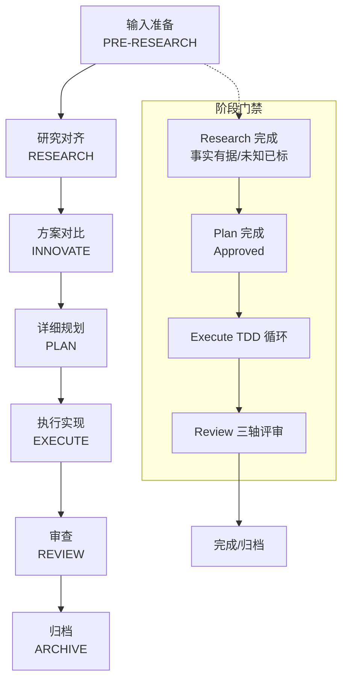
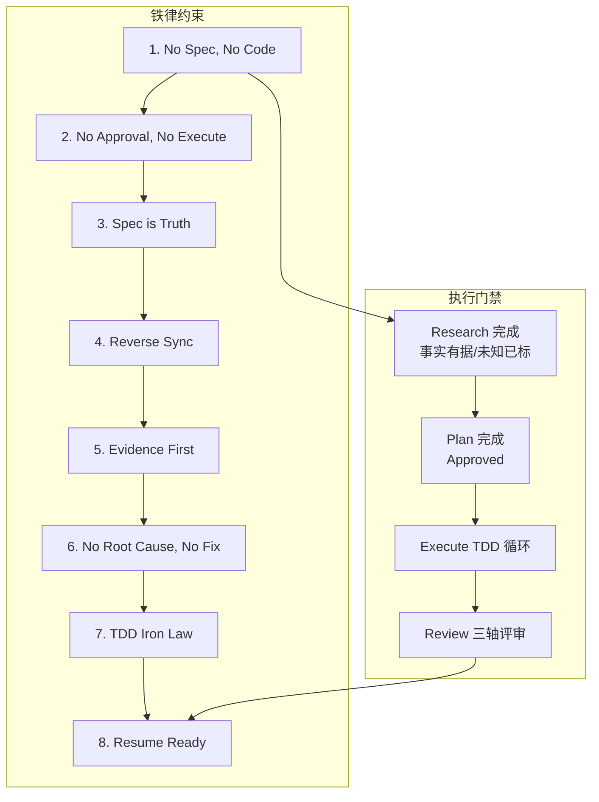
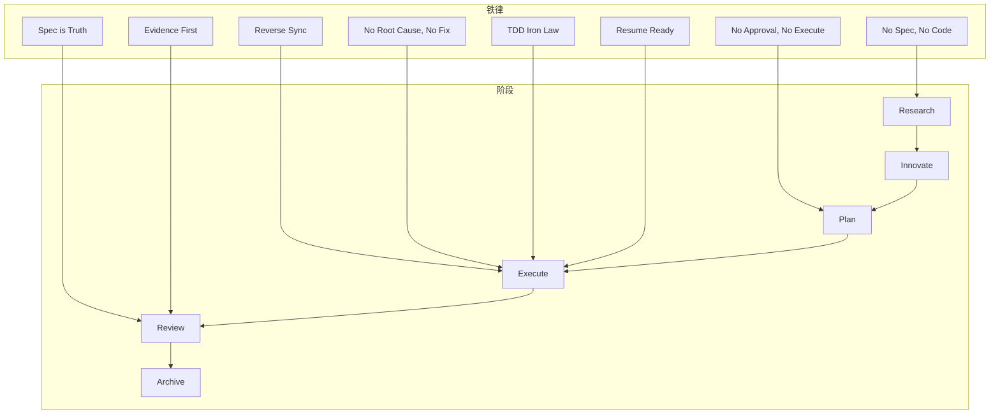

# 铁律约束执行

<cite>
**本文引用的文件**
- [README.md](file://README.md)
- [workflow-diagrams.md](file://altas-workflow/workflow-diagrams.md)
- [reference-index.md](file://altas-workflow/reference-index.md)
- [RIPER-5.md](file://altas-workflow/protocols/RIPER-5.md)
- [RIPER-DOC.md](file://altas-workflow/protocols/RIPER-DOC.md)
- [SDD-RIPER-DUAL-COOP.md](file://altas-workflow/protocols/SDD-RIPER-DUAL-COOP.md)
- [SKILL.md（测试驱动开发）](file://altas-workflow/references/superpowers/test-driven-development/SKILL.md)
- [SKILL.md（系统化调试）](file://altas-workflow/references/superpowers/systematic-debugging/SKILL.md)
- [SKILL.md（完成前验证）](file://altas-workflow/references/superpowers/verification-before-completion/SKILL.md)
- [SKILL.md（子代理驱动开发）](file://altas-workflow/references/superpowers/subagent-driven-development/SKILL.md)
- [AI-原生研发范式-从代码中心到文档驱动的演进.md](file://altas-workflow/docs/AI-原生研发范式-从代码中心到文档驱动的演进.md)
</cite>

## 目录
1. [简介](#简介)
2. [项目结构](#项目结构)
3. [核心组件](#核心组件)
4. [架构总览](#架构总览)
5. [详细组件分析](#详细组件分析)
6. [依赖分析](#依赖分析)
7. [性能考虑](#性能考虑)
8. [故障排除指南](#故障排除指南)
9. [结论](#结论)
10. [附录](#附录)

## 简介
本文件系统化阐述 ALTAS Workflow 的“铁律约束”执行机制，围绕八条不可违背的铁律，结合工作流阶段、检查点与门禁，给出可操作的执行规范、最佳实践与常见违规场景的处理方法。铁律不仅是流程规则，更是质量与可追溯性的底线，贯穿研究、创新、规划、执行、审查与归档的全流程。

## 项目结构
- 工作流与铁律的总体视图与阶段流程，参见工作流图集与阶段流程图。
- 铁律清单与检查点模板来自顶层 README，配合参考索引按需加载各阶段技能与协议。
- 专项能力（TDD、系统化调试、完成前验证、子代理驱动开发）作为铁律执行的支撑工具。

图表来源
- [workflow-diagrams.md:45-67](file://altas-workflow/workflow-diagrams.md#L45-L67)

章节来源
- [README.md:270-469](file://README.md#L270-L469)
- [reference-index.md:16-81](file://altas-workflow/reference-index.md#L16-L81)

## 核心组件
- 铁律清单与门禁：八条铁律构成工作流的“硬约束”，贯穿每个阶段的检查点与门禁。
- 阶段与检查点：每个阶段完成后输出标准化检查点，作为门禁触发与推进依据。
- 专项能力：TDD、系统化调试、完成前验证、子代理驱动开发等，作为铁律执行的工具与保障。

章节来源
- [README.md:270-469](file://README.md#L270-L469)
- [workflow-diagrams.md:71-104](file://altas-workflow/workflow-diagrams.md#L71-L104)

## 架构总览
铁律约束在工作流中的“门禁-检查点-阶段推进”闭环如下：

图表来源
- [workflow-diagrams.md:71-104](file://altas-workflow/workflow-diagrams.md#L71-L104)

章节来源
- [workflow-diagrams.md:71-104](file://altas-workflow/workflow-diagrams.md#L71-L104)

## 详细组件分析

### 铁律一：No Spec, No Code（无 Spec 不写代码）
- 含义：在形成最小 Spec 前不写代码；Size XS 豁免（可直接执行）。
- 应用场景：
  - Size M/L：必须先 Research → Plan → Approved 后再进入 Execute。
  - Size XS：可直接执行，但需在完成后回写最小 Spec。
- 违反后果：代码与 Spec 脱节，导致 Spec Drift、返工与审查失败。
- 执行要求：
  - Research 阶段必须输出“已完成/预期产出/下一步操作”的检查点。
  - Plan 阶段必须输出“原子级 Checklist + Done Contract”。

章节来源
- [README.md:270-469](file://README.md#L270-L469)
- [workflow-diagrams.md:71-104](file://altas-workflow/workflow-diagrams.md#L71-L104)

### 铁律二：No Approval, No Execute（无人批准不执行）
- 含义：Plan 阶段必须获得人类批准，方可进入 Execute。
- 应用场景：Plan 完成后，必须等待 [Approved] 才能进入 Execute。
- 违反后果：未经共识的变更进入实现，导致偏差与风险。
- 执行要求：Plan 检查点中明确“[Approved]”按钮与升级/降级选项。

章节来源
- [README.md:270-469](file://README.md#L270-L469)
- [workflow-diagrams.md:71-104](file://altas-workflow/workflow-diagrams.md#L71-L104)

### 铁律三：Spec is Truth（Spec 是唯一真相）
- 含义：当 Spec 与代码冲突时，代码是错的，必须以 Spec 为准。
- 应用场景：Review 阶段轴1/轴2用于验证 Spec 与代码一致性。
- 违反后果：代码偏离 Spec，导致验收失败与回归风险。
- 执行要求：Review 三轴评审中，轴1/轴2必须 PASS，否则回退至 Research/Plan。

章节来源
- [README.md:270-469](file://README.md#L270-L469)
- [workflow-diagrams.md:108-125](file://altas-workflow/workflow-diagrams.md#L108-L125)

### 铁律四：Reverse Sync（逆向同步）
- 含义：执行中发现偏差，先更新 Spec，再修代码。
- 应用场景：Execute 阶段发现实现与 Spec 不一致时，先回写 Spec，再修复代码。
- 违反后果：代码与 Spec 同步失败，形成“暗箱修改”。
- 执行要求：发现偏差即刻回写 Spec，并在 Review 中验证同步效果。

章节来源
- [README.md:270-469](file://README.md#L270-L469)
- [AI-原生研发范式-从代码中心到文档驱动的演进.md:336-356](file://altas-workflow/docs/AI-原生研发范式-从代码中心到文档驱动的演进.md#L336-L356)

### 铁律五：Evidence First（证据优先）
- 含义：完成由验证结果证明，非模型自宣布。
- 应用场景：Review 阶段与完成前验证，必须运行命令并读取输出后方可宣称“通过”。
- 违反后果：虚假宣称导致信任破裂与返工。
- 执行要求：完成前验证的“Gate Function”五步法必须严格执行。

章节来源
- [README.md:270-469](file://README.md#L270-L469)
- [SKILL.md（完成前验证）:16-38](file://altas-workflow/references/superpowers/verification-before-completion/SKILL.md#L16-L38)

### 铁律六：No Root Cause, No Fix（无根因不修）
- 含义：修复前必须完成系统化根因调查，禁止盲改。
- 应用场景：Bug/测试失败/异常行为出现时，必须先完成系统化调试四阶段。
- 违反后果：症状修复导致新问题与技术债。
- 执行要求：系统化调试四阶段必须完整，Phase 1 完成后方可进入 Fix。

章节来源
- [README.md:270-469](file://README.md#L270-L469)
- [SKILL.md（系统化调试）:16-48](file://altas-workflow/references/superpowers/systematic-debugging/SKILL.md#L16-L48)

### 铁律七：TDD Iron Law（测试驱动铁律）
- 含义：Size M/L：无失败测试不写生产代码。
- 应用场景：Execute 阶段采用 TDD 循环（RED→GREEN→REFACTOR），先写失败测试。
- 迉反后果：缺乏测试覆盖，回归风险高。
- 执行要求：每个新功能/修复均需先写失败测试并通过，再实现与重构。

章节来源
- [README.md:270-469](file://README.md#L270-L469)
- [SKILL.md（测试驱动开发）:31-46](file://altas-workflow/references/superpowers/test-driven-development/SKILL.md#L31-L46)

### 铁律八：Resume Ready（可恢复就绪）
- 含义：长任务暂停前在 Spec 中留下恢复锚点。
- 应用场景：Size L/深度任务中，暂停/中断前必须在 Spec 中记录当前进度与下一步。
- 违反后果：恢复困难、上下文丢失、重复劳动。
- 执行要求：暂停前输出“进度/当前成果/预期产出/下一步操作”的检查点。

章节来源
- [README.md:270-469](file://README.md#L270-L469)
- [workflow-diagrams.md:291-337](file://altas-workflow/workflow-diagrams.md#L291-L337)

## 依赖分析
- 铁律与阶段流程的耦合关系：
  - No Spec, No Code → Research/Plan 完成门禁
  - No Approval, No Execute → Plan 完成门禁
  - Spec is Truth → Review 三轴评审（轴1/轴2）
  - Reverse Sync → Execute 阶段偏差处理
  - Evidence First → Review/完成前验证门禁
  - No Root Cause, No Fix → DEBUG 模式与系统化调试
  - TDD Iron Law → Execute 阶段 TDD 循环
  - Resume Ready → 长任务暂停与恢复

图表来源
- [workflow-diagrams.md:45-67](file://altas-workflow/workflow-diagrams.md#L45-L67)

章节来源
- [reference-index.md:16-81](file://altas-workflow/reference-index.md#L16-L81)

## 性能考虑
- 铁律带来的“慢”是纪律与门禁的成本，但换来的是：
  - 减少返工与审查失败，提高整体吞吐稳定性。
  - 通过 TDD 与系统化调试降低调试成本与回归风险。
  - 通过 Evidence First 与三轴评审减少“虚假通过”造成的浪费。
- 建议：
  - 在 Size S/XS 场景适度简化门禁，但必须在完成后回写最小 Spec。
  - 在 Size L 场景利用子代理驱动开发（Subagent）提升并行与质量门禁效率。

## 故障排除指南
- 常见违规场景与处理：
  - 未形成最小 Spec 即开始实现：立即回退至 Research/Plan，完善 Spec 并获得批准。
  - 未经批准进入 Execute：暂停执行，等待批准后再推进。
  - Spec 与代码冲突：以 Spec 为准，先回写 Spec，再修复代码。
  - 执行中发现偏差：先更新 Spec，再修复代码，随后 Review 验证。
  - 自称完成但无验证证据：运行验证命令，读取输出后方可宣称“通过”。
  - 盲改导致症状反复：启动系统化调试四阶段，找到根因后再修复。
  - 先写代码后写测试：删除代码，按 TDD 重新开始。
  - 长任务中断未留恢复锚点：暂停并补写检查点，明确下一步。

章节来源
- [README.md:270-469](file://README.md#L270-L469)
- [SKILL.md（完成前验证）:52-62](file://altas-workflow/references/superpowers/verification-before-completion/SKILL.md#L52-L62)
- [SKILL.md（系统化调试）:215-233](file://altas-workflow/references/superpowers/systematic-debugging/SKILL.md#L215-L233)
- [SKILL.md（测试驱动开发）:272-289](file://altas-workflow/references/superpowers/test-driven-development/SKILL.md#L272-L289)

## 结论
八条铁律构成了 ALTAS Workflow 的质量与可追溯性基石。通过阶段门禁与检查点机制，铁律在每个关键节点形成“硬约束”，辅以 TDD、系统化调试、完成前验证与子代理驱动开发等专项能力，确保从需求到交付的全过程可控、可审、可维护。团队应在实践中坚持“证据优先、根因先行、Spec 为真、逆向同步”，并在长任务中落实“可恢复就绪”，以实现高质量与高效率的平衡。

## 附录
- 铁律与阶段的集成方式：
  - Research 完成门禁：事实有据/未知已标。
  - Plan 完成门禁：[Approved]。
  - Execute 门禁：TDD 循环与 Evidence First。
  - Review 门禁：三轴评审（轴1/轴2 PASS，轴3无高风险）。
- 铁律执行最佳实践：
  - 每阶段完成后输出标准化检查点，明确“已完成/当前/下一步/后续”。
  - 遇到分歧以 Spec 为准，先回写再修复。
  - 任何宣称“完成/通过”前，必须运行验证命令并读取输出。
  - 长任务暂停前在 Spec 中留下恢复锚点。
  - 严格遵循系统化调试流程，无根因不修。

章节来源
- [README.md:286-347](file://README.md#L286-L347)
- [workflow-diagrams.md:291-337](file://altas-workflow/workflow-diagrams.md#L291-L337)