# 测试专项模式

<cite>
**本文档引用的文件**
- [altas-workflow/README.md](file://altas-workflow/README.md)
- [altas-workflow/references/special-modes/test.md](file://altas-workflow/references/special-modes/test.md)
- [altas-workflow/references/superpowers/systematic-debugging/SKILL.md](file://altas-workflow/references/superpowers/systematic-debugging/SKILL.md)
- [altas-workflow/references/superpowers/test-driven-development/SKILL.md](file://altas-workflow/references/superpowers/test-driven-development/SKILL.md)
- [altas-workflow/references/superpowers/test-driven-development/testing-anti-patterns.md](file://altas-workflow/references/superpowers/test-driven-development/testing-anti-patterns.md)
</cite>

## 目录
1. [简介](#简介)
2. [项目结构](#项目结构)
3. [核心组件](#核心组件)
4. [架构概览](#架构概览)
5. [详细组件分析](#详细组件分析)
6. [依赖关系分析](#依赖关系分析)
7. [性能考虑](#性能考虑)
8. [故障排除指南](#故障排除指南)
9. [结论](#结论)

## 简介

测试专项模式是ALTAS工作流中专门针对测试场景设计的标准化流程。该模式专注于为现有代码补充测试、提高测试覆盖率、修复失败测试以及生成测试报告等核心任务。

测试专项模式的核心价值在于：
- **标准化测试流程**：提供从测试现状分析到测试报告输出的完整流程
- **优先级管理**：基于P0-P4优先级体系确保关键功能得到充分测试
- **质量保证**：通过系统化的测试用例编写和验证机制提升代码质量
- **协作集成**：与DEBUG、REFACTOR、REVIEW等其他工作模式无缝衔接

## 项目结构

ALTAS工作流采用模块化架构，测试专项模式作为特殊模式之一，位于references/special-modes目录下：

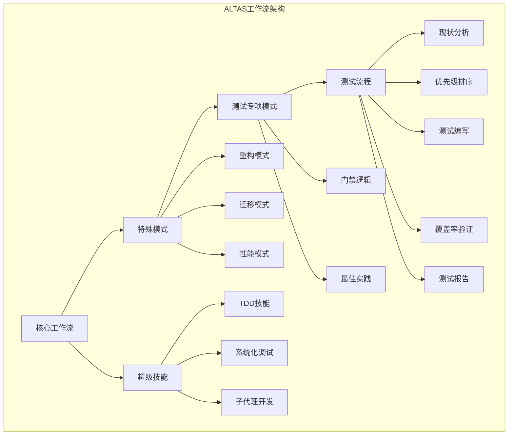

**图表来源**
- [altas-workflow/README.md:62-133](file://altas-workflow/README.md#L62-L133)
- [altas-workflow/references/special-modes/test.md:1-210](file://altas-workflow/references/special-modes/test.md#L1-L210)

**章节来源**
- [altas-workflow/README.md:1-133](file://altas-workflow/README.md#L1-L133)
- [altas-workflow/references/special-modes/test.md:1-210](file://altas-workflow/references/special-modes/test.md#L1-L210)

## 核心组件

测试专项模式包含以下核心组件：

### 1. 触发机制
- **触发词**：TEST、写测试、补测试
- **适用场景**：现有代码测试补充、覆盖率提升、失败测试修复、测试报告生成

### 2. 首轮动作框架
- **测试目标确认**：补测试覆盖、提高覆盖率、修复失败测试、生成测试报告
- **测试范围确认**：单个文件/函数/模块或全项目扫描
- **测试框架确认**：项目使用的测试框架及运行命令

### 3. 测试优先级体系
| 优先级 | 测试类型 | 说明 |
|--------|----------|------|
| **P0** | 核心逻辑测试 | 业务核心功能，必须覆盖 |
| **P1** | 边界条件测试 | 极值/空值/非法输入 |
| **P2** | 异常路径测试 | 错误处理/降级逻辑 |
| **P3** | 集成测试 | 跨模块/跨系统交互 |
| **P4** | 性能测试 | 响应时间/吞吐量/资源消耗 |

**章节来源**
- [altas-workflow/references/special-modes/test.md:3-150](file://altas-workflow/references/special-modes/test.md#L3-L150)

## 架构概览

测试专项模式采用分阶段的流水线架构，确保测试工作的系统性和可追溯性：

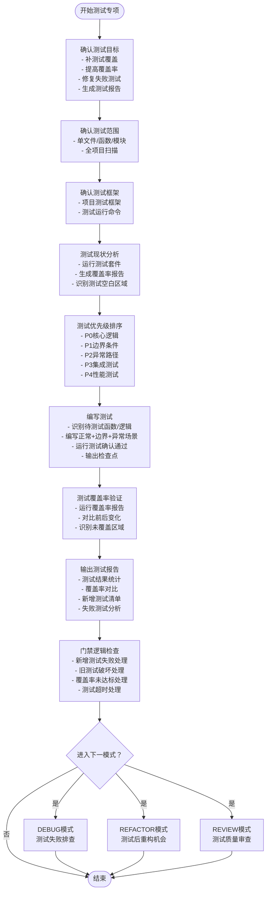

**图表来源**
- [altas-workflow/references/special-modes/test.md:18-150](file://altas-workflow/references/special-modes/test.md#L18-L150)

## 详细组件分析

### 测试流程详解

#### 1) 测试现状分析
测试现状分析阶段是整个测试专项的基础，主要包含三个核心活动：

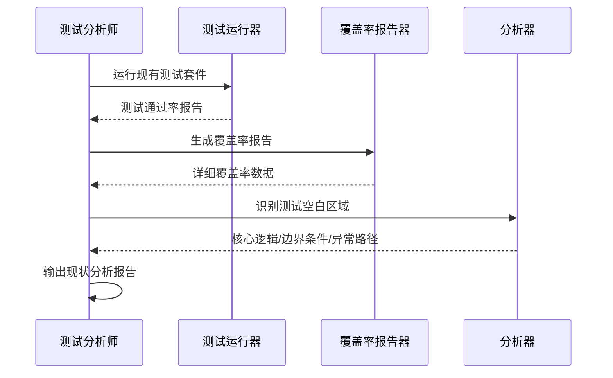

**图表来源**
- [altas-workflow/references/special-modes/test.md:36-44](file://altas-workflow/references/special-modes/test.md#L36-L44)

#### 2) 测试优先级排序
优先级排序采用严格的等级制度，确保关键功能得到优先测试：

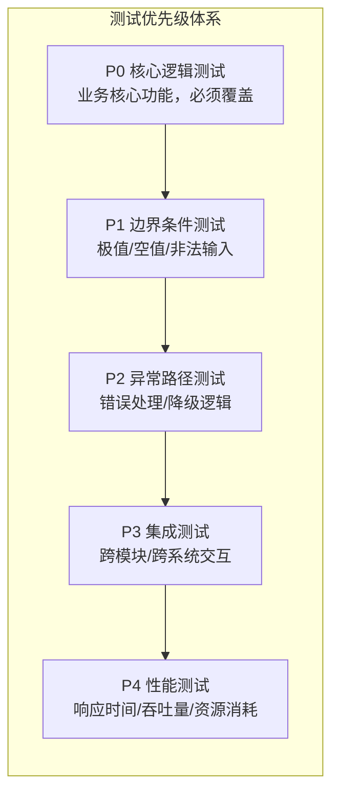

**图表来源**
- [altas-workflow/references/special-modes/test.md:45-54](file://altas-workflow/references/special-modes/test.md#L45-L54)

#### 3) 测试用例编写模板
测试用例遵循AAA模式（Arrange-Act-Assert）：

**图表来源**
- [altas-workflow/references/special-modes/test.md:64-91](file://altas-workflow/references/special-modes/test.md#L64-L91)

#### 4) 测试覆盖率验证
覆盖率验证确保测试质量的客观指标：

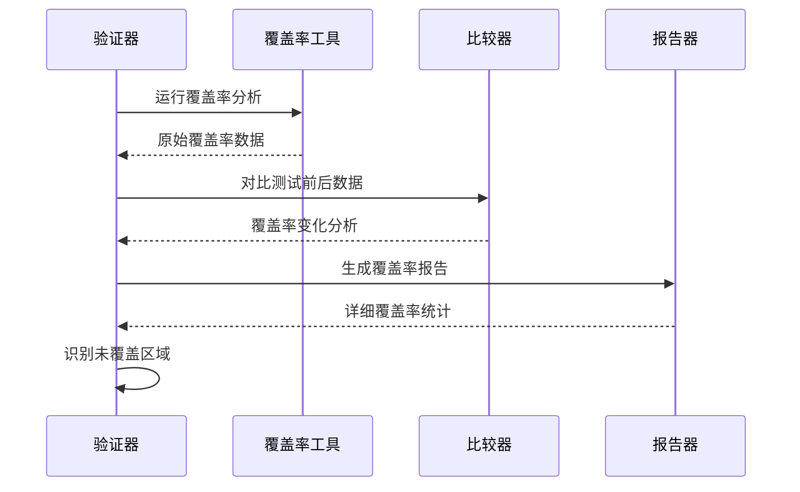

**图表来源**
- [altas-workflow/references/special-modes/test.md:93-98](file://altas-workflow/references/special-modes/test.md#L93-L98)

#### 5) 测试报告输出
标准测试报告包含完整的测试信息：

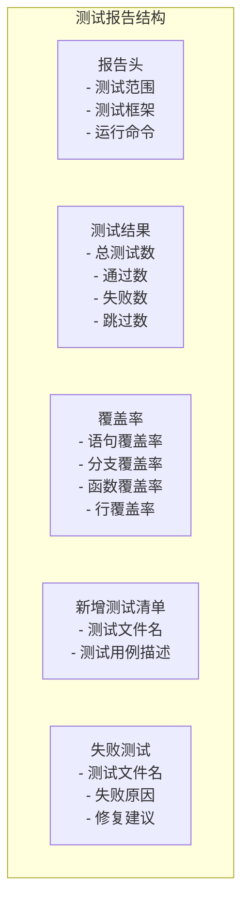

**图表来源**
- [altas-workflow/references/special-modes/test.md:99-132](file://altas-workflow/references/special-modes/test.md#L99-L132)

### 门禁逻辑分析

门禁逻辑确保测试质量的底线要求：

| 场景 | 处理方式 | 处理依据 |
|------|----------|----------|
| 新增测试失败 | 必须修复测试或确认是代码Bug而非测试错误 | 测试质量保证 |
| 新增测试导致旧测试失败 | 检查是否破坏了现有行为，若是则调整测试或回到Plan | 向后兼容性 |
| 覆盖率未达标 | 若用户设定了目标覆盖率，继续补充测试直到达标或用户确认降低目标 | 质量目标达成 |
| 测试运行超时 | 识别慢测试，建议用户优化或拆分 | 性能效率 |

**章节来源**
- [altas-workflow/references/special-modes/test.md:135-143](file://altas-workflow/references/special-modes/test.md#L135-L143)

### 特殊场景处理

#### 1) 无测试框架项目
对于缺乏测试框架的项目，提供渐进式解决方案：

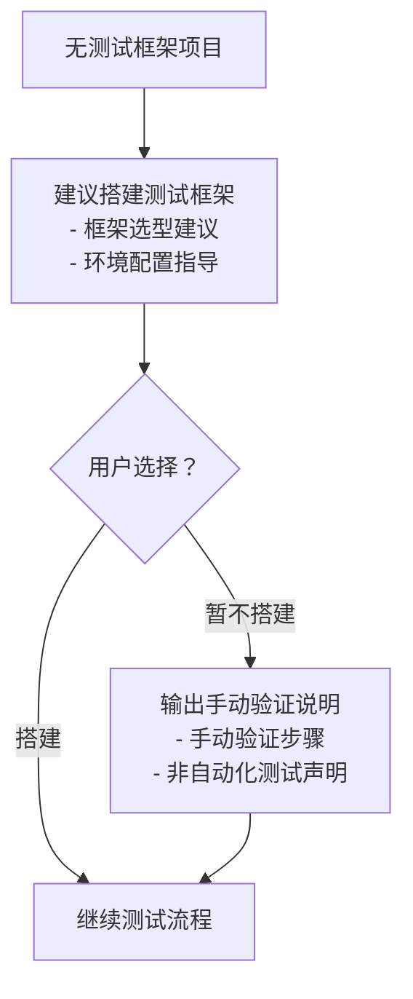

**图表来源**
- [altas-workflow/references/special-modes/test.md:156-159](file://altas-workflow/references/special-modes/test.md#L156-L159)

#### 2) 复杂测试依赖环境
针对数据库、外部API等复杂依赖场景：

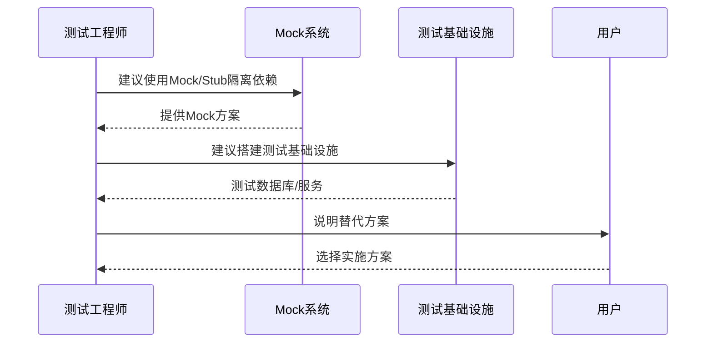

**图表来源**
- [altas-workflow/references/special-modes/test.md:161-165](file://altas-workflow/references/special-modes/test.md#L161-L165)

#### 3) 测试代码量过大
当测试代码量超过被测试代码时的处理策略：

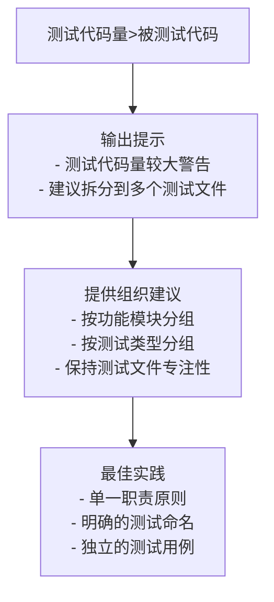

**图表来源**
- [altas-workflow/references/special-modes/test.md:166-169](file://altas-workflow/references/special-modes/test.md#L166-L169)

### 测试最佳实践

#### 测试命名规范
采用"应该...当..."的命名模式，清晰表达测试意图：

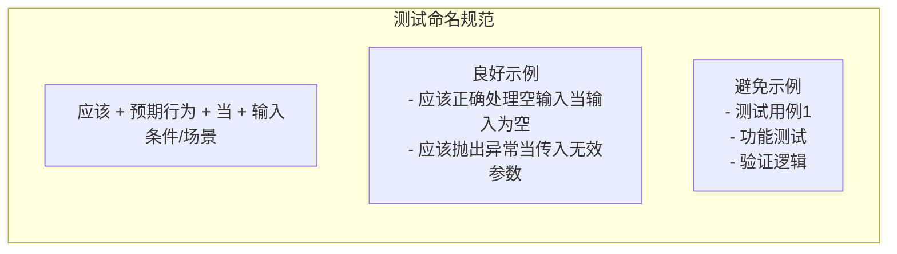

**图表来源**
- [altas-workflow/references/special-modes/test.md:175-181](file://altas-workflow/references/special-modes/test.md#L175-L181)

#### AAA测试模式
严格按照Arrange-Act-Assert模式编写测试：

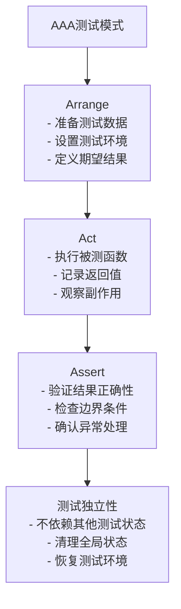

**图表来源**
- [altas-workflow/references/special-modes/test.md:183-202](file://altas-workflow/references/special-modes/test.md#L183-L202)

**章节来源**
- [altas-workflow/references/special-modes/test.md:173-210](file://altas-workflow/references/special-modes/test.md#L173-L210)

## 依赖关系分析

测试专项模式与ALTAS工作流其他组件存在密切的依赖关系：

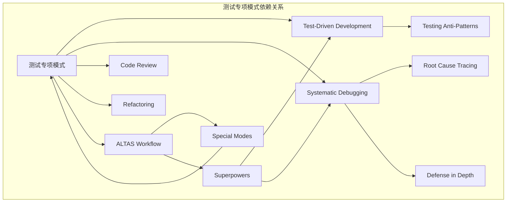

**图表来源**
- [altas-workflow/README.md:91-117](file://altas-workflow/README.md#L91-L117)
- [altas-workflow/references/special-modes/test.md:146-150](file://altas-workflow/references/special-modes/test.md#L146-L150)

### 协作模式集成

测试专项模式在不同场景下与其它模式的协作关系：

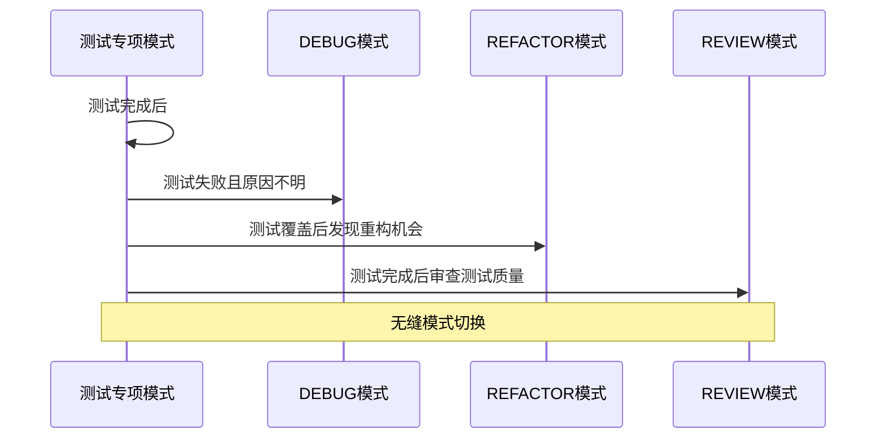

**图表来源**
- [altas-workflow/references/special-modes/test.md:148-150](file://altas-workflow/references/special-modes/test.md#L148-L150)

**章节来源**
- [altas-workflow/README.md:91-117](file://altas-workflow/README.md#L91-L117)
- [altas-workflow/references/special-modes/test.md:146-150](file://altas-workflow/references/special-modes/test.md#L146-L150)

## 性能考虑

测试专项模式在性能方面的考量包括：

### 测试执行效率
- **并行测试执行**：合理安排测试用例的并行执行，避免资源竞争
- **测试隔离**：确保测试之间的独立性，减少不必要的重复执行
- **缓存策略**：利用测试结果缓存，避免重复计算

### 覆盖率分析性能
- **增量覆盖率**：仅分析发生变化的代码部分
- **采样策略**：对大型项目采用采样覆盖率分析
- **并行分析**：利用多核CPU进行并行覆盖率计算

### 报告生成优化
- **增量报告**：仅生成变化部分的报告内容
- **压缩输出**：对大量测试结果进行压缩存储
- **延迟计算**：按需生成详细的测试报告

## 故障排除指南

### 常见问题诊断

#### 测试失败问题
当遇到测试失败时，按照以下流程进行诊断：

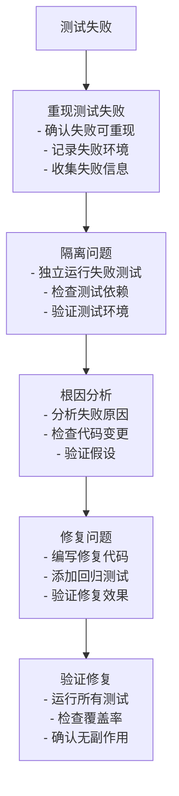

**图表来源**
- [altas-workflow/references/superpowers/systematic-debugging/SKILL.md:50-121](file://altas-workflow/references/superpowers/systematic-debugging/SKILL.md#L50-L121)

#### 覆盖率不足问题
当覆盖率未达到预期时：

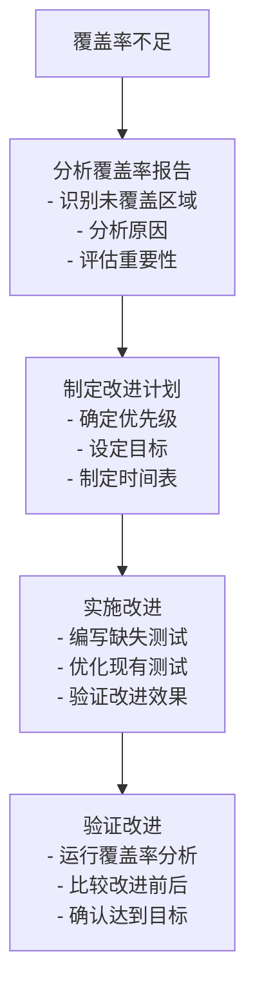

**图表来源**
- [altas-workflow/references/special-modes/test.md:95-98](file://altas-workflow/references/special-modes/test.md#L95-L98)

### 门禁逻辑触发条件

当满足以下条件时，测试专项模式会触发相应的门禁逻辑：

| 触发条件 | 处理措施 | 预防建议 |
|----------|----------|----------|
| 新增测试失败 | 修复测试或确认代码Bug | 加强测试设计评审 |
| 旧测试被破坏 | 检查向后兼容性 | 建立回归测试机制 |
| 覆盖率未达标 | 继续补充测试或调整目标 | 设定合理的覆盖率目标 |
| 测试运行超时 | 优化测试或拆分测试 | 识别慢测试并优化 |

**章节来源**
- [altas-workflow/references/special-modes/test.md:137-143](file://altas-workflow/references/special-modes/test.md#L137-L143)

## 结论

测试专项模式作为ALTAS工作流的重要组成部分，为软件测试提供了系统化、标准化的解决方案。其核心价值体现在：

### 主要优势
1. **标准化流程**：提供从测试现状分析到测试报告输出的完整流程
2. **优先级管理**：基于P0-P4优先级体系确保关键功能得到充分测试
3. **质量保证**：通过系统化的测试用例编写和验证机制提升代码质量
4. **协作集成**：与DEBUG、REFACTOR、REVIEW等其他工作模式无缝衔接

### 最佳实践建议
1. **严格执行测试优先级**：优先保证核心逻辑和边界条件的测试覆盖
2. **遵循AAA模式**：确保测试用例的可读性和可维护性
3. **持续改进覆盖率**：定期评估和改进测试覆盖率
4. **建立测试文化**：培养团队的测试意识和测试习惯

### 未来发展
随着ALTAS工作流的不断发展，测试专项模式将继续演进，为AI驱动的软件开发提供更加智能化、自动化的测试解决方案。通过与TDD、系统化调试等超级技能的深度融合，测试专项模式将成为保障软件质量的重要基石。