# 测试专项模式

<cite>
**本文档引用的文件**
- [altas-workflow/README.md](file://altas-workflow/README.md)
- [altas-workflow/references/special-modes/test.md](file://altas-workflow/references/special-modes/test.md)
- [altas-workflow/references/superpowers/systematic-debugging/SKILL.md](file://altas-workflow/references/superpowers/systematic-debugging/SKILL.md)
- [altas-workflow/references/superpowers/test-driven-development/SKILL.md](file://altas-workflow/references/superpowers/test-driven-development/SKILL.md)
- [altas-workflow/references/superpowers/test-driven-development/testing-anti-patterns.md](file://altas-workflow/references/superpowers/test-driven-development/testing-anti-patterns.md)
- [altas-workflow/references/testing/pytest-patterns.md](file://altas-workflow/references/testing/pytest-patterns.md)
- [altas-workflow/references/testing/api-testing.md](file://altas-workflow/references/testing/api-testing.md)
- [altas-workflow/references/testing/test-data-management.md](file://altas-workflow/references/testing/test-data-management.md)
- [altas-workflow/references/testing/ci-cd-integration.md](file://altas-workflow/references/testing/ci-cd-integration.md)
- [altas-workflow/references/testing/test-scaffold-templates.md](file://altas-workflow/references/testing/test-scaffold-templates.md)
- [altas-workflow/references/testing/test-task-pressure-scenarios.md](file://altas-workflow/references/testing/test-task-pressure-scenarios.md)
- [altas-workflow/references/testing/test-quality-metrics.md](file://altas-workflow/references/testing/test-quality-metrics.md)
- [altas-workflow/references/testing/test-review-checklist.md](file://altas-workflow/references/testing/test-review-checklist.md)
- [.agents/skills/pytest-patterns/SKILL.md](file://.agents/skills/pytest-patterns/SKILL.md)
- [.agents/skills/advanced-api-testing/SKILL.md](file://.agents/skills/advanced-api-testing/SKILL.md)
- [altas-workflow/references/testing/templates/conftest.py](file://altas-workflow/references/testing/templates/conftest.py)
- [altas-workflow/references/testing/templates/api_client_fixture.py](file://altas-workflow/references/testing/templates/api_client_fixture.py)
- [altas-workflow/references/testing/templates/auth_fixture.py](file://altas-workflow/references/testing/templates/auth_fixture.py)
- [altas-workflow/references/testing/templates/db_rollback_fixture.py](file://altas-workflow/references/testing/templates/db_rollback_fixture.py)
- [altas-workflow/references/testing/templates/factories.py](file://altas-workflow/references/testing/templates/factories.py)
- [altas-workflow/references/testing/templates/api_test_matrix.md](file://altas-workflow/references/testing/templates/api_test_matrix.md)
- [altas-workflow/references/testing/templates/test_report.md](file://altas-workflow/references/testing/templates/test_report.md)
</cite>

## 更新摘要
**变更内容**
- 新增测试审查检查清单，提供系统性的测试质量评估标准
- 增强测试质量度量体系，完善测试代码审查流程
- 集成测试审查清单与质量度量体系，形成完整的测试质量保证闭环
- 新增测试审查最佳实践，指导开发者进行有效的代码审查

## 目录
1. [简介](#简介)
2. [项目结构](#项目结构)
3. [核心组件](#核心组件)
4. [架构概览](#架构概览)
5. [详细组件分析](#详细组件分析)
6. [依赖关系分析](#依赖关系分析)
7. [性能考虑](#性能考虑)
8. [故障排除指南](#故障排除指南)
9. [结论](#结论)

## 简介

测试专项模式是ALTAS工作流中专门针对测试场景设计的标准化流程。该模式专注于为现有代码补充测试、提高测试覆盖率、修复失败测试以及生成测试报告等核心任务。

**更新** 集成新增的测试审查检查清单和增强的质量度量体系，显著增强了测试专项模式的专业性和实用性。新增的测试审查检查清单提供了系统性的测试质量评估标准，包括命名约定、AAA模式、断言质量等评估维度，形成了从测试编写到质量审查的完整闭环。

测试专项模式的核心价值在于：
- **标准化测试流程**：提供从测试现状分析到测试报告输出的完整流程
- **优先级管理**：基于P0-P4优先级体系确保关键功能得到充分测试
- **质量保证**：通过系统化的测试用例编写和验证机制提升代码质量
- **协作集成**：与DEBUG、REFACTOR、REVIEW等其他工作模式无缝衔接
- **框架集成**：深度整合pytest模式和API测试参考文档，提供专业级测试指导
- **模板化支持**：提供完整的测试脚手架模板，加速测试基础设施搭建
- **压力验证**：内置压力场景验证机制，确保在各种挑战情况下保持测试纪律
- **质量度量**：集成全面的质量度量体系，提供量化评估和质量门禁
- **审查保障**：新增测试审查检查清单，提供系统性的质量评估标准

## 项目结构

ALTAS工作流采用模块化架构，测试专项模式作为特殊模式之一，位于references/special-modes目录下，并集成了多个专业的测试参考文档、测试审查检查清单和新的模板系统：

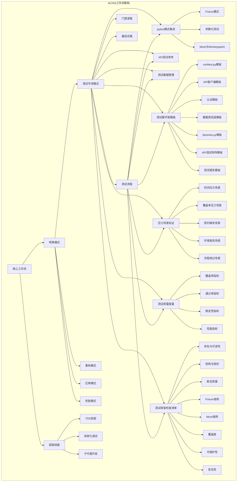

**图表来源**
- [altas-workflow/README.md:62-133](file://altas-workflow/README.md#L62-L133)
- [altas-workflow/references/special-modes/test.md:1-421](file://altas-workflow/references/special-modes/test.md#L1-L421)
- [altas-workflow/references/testing/test-scaffold-templates.md:1-81](file://altas-workflow/references/testing/test-scaffold-templates.md#L1-L81)
- [altas-workflow/references/testing/test-task-pressure-scenarios.md:1-149](file://altas-workflow/references/testing/test-task-pressure-scenarios.md#L1-L149)
- [altas-workflow/references/testing/test-quality-metrics.md:1-900](file://altas-workflow/references/testing/test-quality-metrics.md#L1-L900)
- [altas-workflow/references/testing/test-review-checklist.md:1-83](file://altas-workflow/references/testing/test-review-checklist.md#L1-L83)

**章节来源**
- [altas-workflow/README.md:1-133](file://altas-workflow/README.md#L1-L133)
- [altas-workflow/references/special-modes/test.md:1-421](file://altas-workflow/references/special-modes/test.md#L1-L421)

## 核心组件

测试专项模式包含以下核心组件：

### 1. 触发机制
- **触发词**：TEST、写测试、补测试
- **适用场景**：现有代码测试补充、覆盖率提升、失败测试修复、测试报告生成

### 2. 首轮动作框架
- **测试目标确认**：补测试覆盖、提高覆盖率、修复失败测试、生成测试报告
- **测试范围确认**：单个文件/函数/模块或全项目扫描
- **测试框架确认**：项目使用的测试框架及运行命令

### 3. 测试框架集成体系

#### Python/pytest项目
- **核心模式**：`references/testing/pytest-patterns.md`
- **API测试**：`references/testing/api-testing.md`
- **测试数据**：`references/testing/test-data-management.md`

#### 其他语言项目
- **Jest/Mocha**：JavaScript/TypeScript测试框架
- **Go test**：Go语言测试框架
- **自定义框架**：按项目实际框架编写

### 4. 测试脚手架模板系统

**新增** 提供完整的测试基础设施模板集合，支持快速搭建测试环境：

- **基础共享fixture**：`references/testing/templates/conftest.py`
- **测试数据工厂**：`references/testing/templates/factories.py`
- **API客户端fixture**：`references/testing/templates/api_client_fixture.py`
- **认证fixture**：`references/testing/templates/auth_fixture.py`
- **数据库回滚fixture**：`references/testing/templates/db_rollback_fixture.py`
- **API测试矩阵**：`references/testing/templates/api_test_matrix.md`
- **测试报告模板**：`references/testing/templates/test_report.md`

### 5. 压力场景验证机制

**新增** 内置5种典型压力场景，确保测试纪律在各种挑战情况下得到保持：

- **场景1：时间紧张** - 用户催促直接补用例的压力
- **场景2：覆盖率压力** - 用户只关注覆盖率数值的压力
- **场景3：契约缺失** - API文档缺失时的测试压力
- **场景4：环境差异** - 本地与CI环境差异导致的测试压力
- **场景5：流程绕过** - 已有实现代码时的测试纪律压力

### 6. 测试质量度量体系

**新增** 集成全面的质量度量指标，提供量化评估和质量门禁：

- **一级指标**：测试覆盖率、测试通过率、Flaky率、测试执行时间
- **二级指标**：断言密度、Mock比例、测试复杂度、代码-测试比
- **三级指标**：缺陷检出率、MTTD、回归防护度、测试维护成本

### 7. 测试审查检查清单

**新增** 系统性的测试质量评估标准，提供完整的代码审查指导：

- **命名与可读性**：测试函数名描述行为、文件名与模块对应、Fixture名称描述角色
- **结构与组织**：AAA模式清晰、单一职责、测试独立性、文件组织合理
- **断言质量**：断言充分性、具体性、意义性、异常断言精确性
- **Fixture使用**：作用域合理性、无状态泄漏、依赖链清晰度、conftest.py大小控制
- **Mock使用**：必要性、比例控制、范围精确性、清理机制
- **覆盖度**：Happy path覆盖、边界条件覆盖、异常路径覆盖、并发测试覆盖
- **可维护性**：无硬编码、时间处理、测试间数据独立性、参数化使用
- **安全性**：测试数据安全、PII保护、生产环境隔离、敏感数据清理

**章节来源**
- [altas-workflow/references/special-modes/test.md:3-421](file://altas-workflow/references/special-modes/test.md#L3-L421)
- [altas-workflow/references/testing/test-scaffold-templates.md:1-81](file://altas-workflow/references/testing/test-scaffold-templates.md#L1-L81)
- [altas-workflow/references/testing/test-task-pressure-scenarios.md:1-149](file://altas-workflow/references/testing/test-task-pressure-scenarios.md#L1-L149)
- [altas-workflow/references/testing/test-quality-metrics.md:1-900](file://altas-workflow/references/testing/test-quality-metrics.md#L1-L900)
- [altas-workflow/references/testing/test-review-checklist.md:1-83](file://altas-workflow/references/testing/test-review-checklist.md#L1-L83)

## 架构概览

测试专项模式采用分阶段的流水线架构，确保测试工作的系统性和可追溯性，并深度集成了pytest、API测试、模板系统、压力验证、质量度量和测试审查的专业指导：

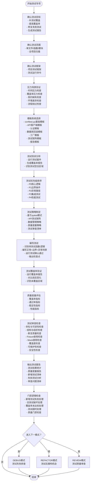

**图表来源**
- [altas-workflow/references/special-modes/test.md:18-421](file://altas-workflow/references/special-modes/test.md#L18-L421)
- [altas-workflow/references/testing/test-task-pressure-scenarios.md:8-18](file://altas-workflow/references/testing/test-task-pressure-scenarios.md#L8-L18)
- [altas-workflow/references/testing/test-quality-metrics.md:18-46](file://altas-workflow/references/testing/test-quality-metrics.md#L18-L46)
- [altas-workflow/references/testing/test-review-checklist.md:8-83](file://altas-workflow/references/testing/test-review-checklist.md#L8-L83)

## 详细组件分析

### 测试流程详解

#### 1) 测试现状分析
测试现状分析阶段是整个测试专项的基础，主要包含三个核心活动：

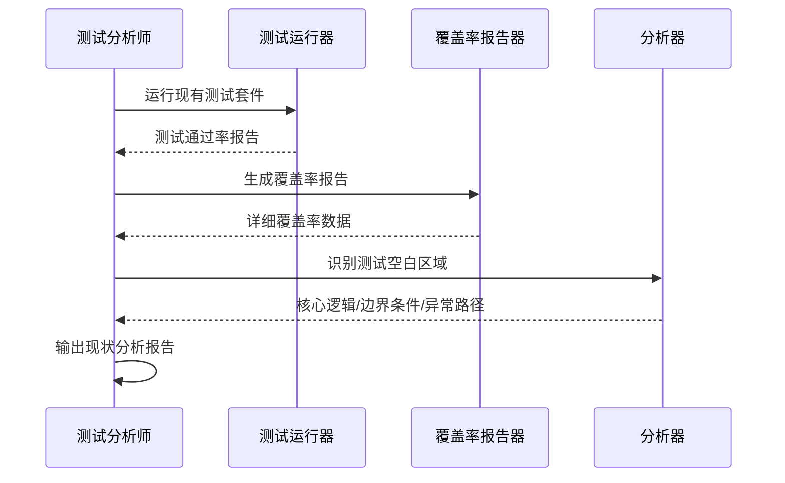

**图表来源**
- [altas-workflow/references/special-modes/test.md:52-60](file://altas-workflow/references/special-modes/test.md#L52-L60)

#### 2) 压力场景验证机制

**新增** 压力场景验证确保测试纪律在各种挑战情况下得到保持：

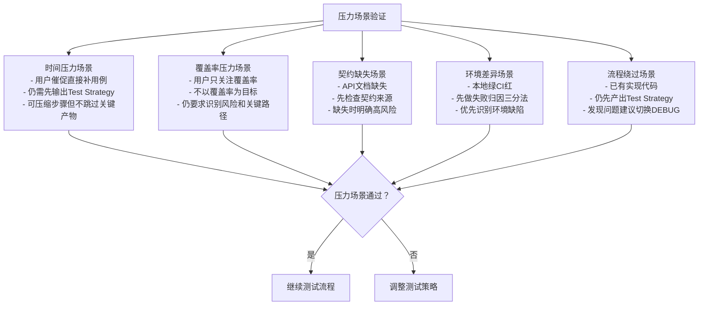

**图表来源**
- [altas-workflow/references/testing/test-task-pressure-scenarios.md:21-149](file://altas-workflow/references/testing/test-task-pressure-scenarios.md#L21-L149)

#### 3) 测试脚手架模板系统

**新增** 模板系统提供可直接使用的测试基础设施：

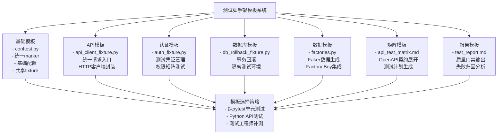

**图表来源**
- [altas-workflow/references/testing/test-scaffold-templates.md:24-81](file://altas-workflow/references/testing/test-scaffold-templates.md#L24-L81)
- [altas-workflow/references/testing/templates/conftest.py:15-67](file://altas-workflow/references/testing/templates/conftest.py#L15-L67)
- [altas-workflow/references/testing/templates/api_client_fixture.py:14-57](file://altas-workflow/references/testing/templates/api_client_fixture.py#L14-L57)
- [altas-workflow/references/testing/templates/auth_fixture.py:10-51](file://altas-workflow/references/testing/templates/auth_fixture.py#L10-L51)
- [altas-workflow/references/testing/templates/db_rollback_fixture.py:15-43](file://altas-workflow/references/testing/templates/db_rollback_fixture.py#L15-L43)
- [altas-workflow/references/testing/templates/factories.py:16-50](file://altas-workflow/references/testing/templates/factories.py#L16-L50)
- [altas-workflow/references/testing/templates/api_test_matrix.md:14-29](file://altas-workflow/references/testing/templates/api_test_matrix.md#L14-L29)
- [altas-workflow/references/testing/templates/test_report.md:11-59](file://altas-workflow/references/testing/templates/test_report.md#L11-L59)

#### 4) 测试优先级排序
优先级排序采用严格的等级制度，确保关键功能得到优先测试：

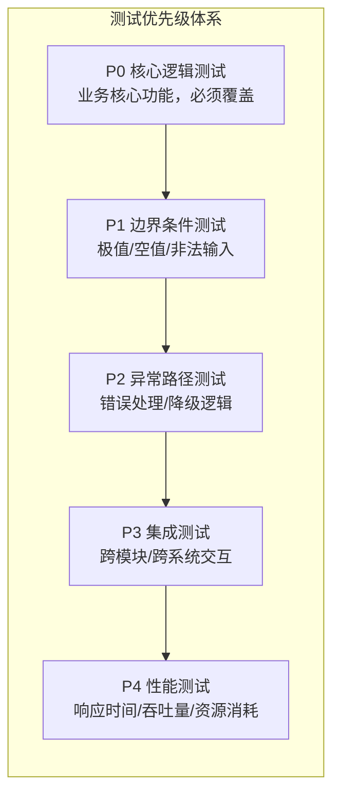

**图表来源**
- [altas-workflow/references/special-modes/test.md:107-116](file://altas-workflow/references/special-modes/test.md#L107-L116)

#### 5) 测试策略制定
基于pytest模式、API测试参考文档、质量度量和测试审查制定专业测试策略：

```mermaid
flowchart TD
Strategy[测试策略制定] --> Pytest["pytest模式集成<br/>- AAA模式<br/>- Fixture设计<br/>- 参数化测试"]
Strategy --> API["API测试矩阵<br/>- 输入验证<br/>- 幂等性测试<br/>- 并发测试<br/>- 错误处理"]
Strategy --> Data["测试数据管理<br/>- Factory Boy<br/>- Faker数据<br/>- 隔离策略"]
Strategy --> Quality["质量度量策略<br/>- 覆盖率目标<br/>- 通过率要求<br/>- 稳定性监控<br/>- 性能预算"]
Strategy --> Review["测试审查策略<br/>- 命名约定检查<br/>- AAA模式验证<br/>- 断言质量评估<br/>- Fixture使用规范<br/>- Mock使用控制"]
Pytest --> AAA["AAA测试模式<br/>Arrange-Act-Assert"]
API --> Validation["输入验证<br/>必填字段/类型/格式"]
API --> Idempotency["幂等性测试<br/>重复请求处理"]
API --> Concurrency["并发测试<br/>竞态条件处理"]
API --> Error["错误处理<br/>异常场景覆盖"]
Data --> Factory["Factory模式<br/>对象创建/管理"]
Data --> Faker["Faker数据<br/>真实感测试数据"]
Data --> Isolation["数据隔离<br/>事务回滚/物理删除"]
Quality --> CoverageTarget["覆盖率目标<br/>全局80%/核心95%"]
Quality --> PassRate["通过率要求<br/>零失败政策"]
Quality --> Stability["稳定性监控<br/>Flaky率<1%"]
Quality --> Performance["性能预算<br/>套件<5min"]
Review --> Naming["命名规范检查<br/>描述行为而非实现"]
Review --> Structure["结构组织检查<br/>单一职责/独立性"]
Review --> Assertion["断言质量检查<br/>充分性/具体性/意义性"]
Review --> Fixture["Fixture使用检查<br/>作用域/依赖链/清理"]
Review --> Mock["Mock使用检查<br/>必要性/比例/范围/清理"]
```

**图表来源**
- [altas-workflow/references/special-modes/test.md:117-165](file://altas-workflow/references/special-modes/test.md#L117-L165)
- [altas-workflow/references/testing/pytest-patterns.md:9-16](file://altas-workflow/references/testing/pytest-patterns.md#L9-L16)
- [altas-workflow/references/testing/api-testing.md:9-32](file://altas-workflow/references/testing/api-testing.md#L9-L32)
- [altas-workflow/references/testing/test-quality-metrics.md:20-46](file://altas-workflow/references/testing/test-quality-metrics.md#L20-L46)
- [altas-workflow/references/testing/test-review-checklist.md:10-65](file://altas-workflow/references/testing/test-review-checklist.md#L10-L65)

#### 6) 测试用例编写模板
测试用例遵循AAA模式（Arrange-Act-Assert），并结合pytest的最佳实践：

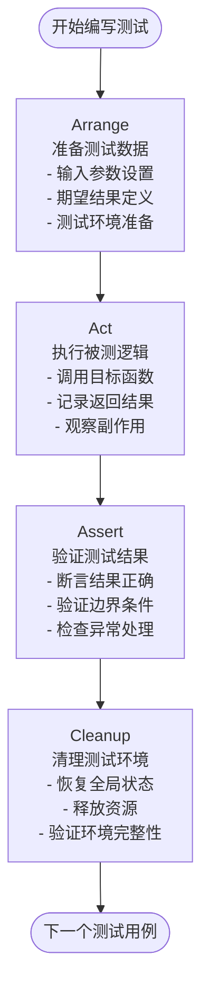

**图表来源**
- [altas-workflow/references/special-modes/test.md:179-210](file://altas-workflow/references/special-modes/test.md#L179-L210)

#### 7) 测试覆盖率验证
覆盖率验证确保测试质量的客观指标：

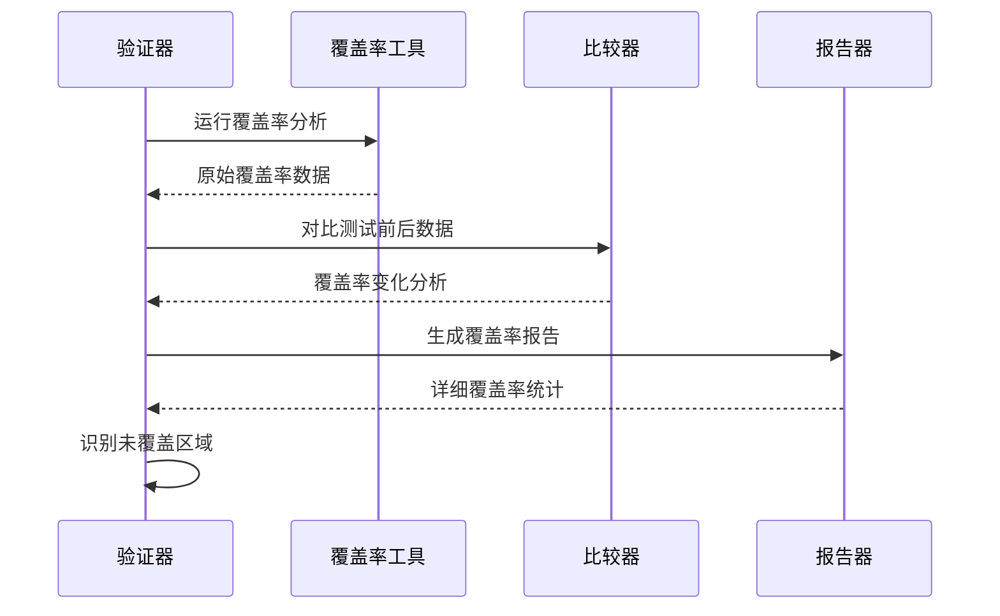

**图表来源**
- [altas-workflow/references/special-modes/test.md:239-244](file://altas-workflow/references/special-modes/test.md#L239-L244)

#### 8) 测试质量度量评估

**新增** 全面的质量度量评估体系：

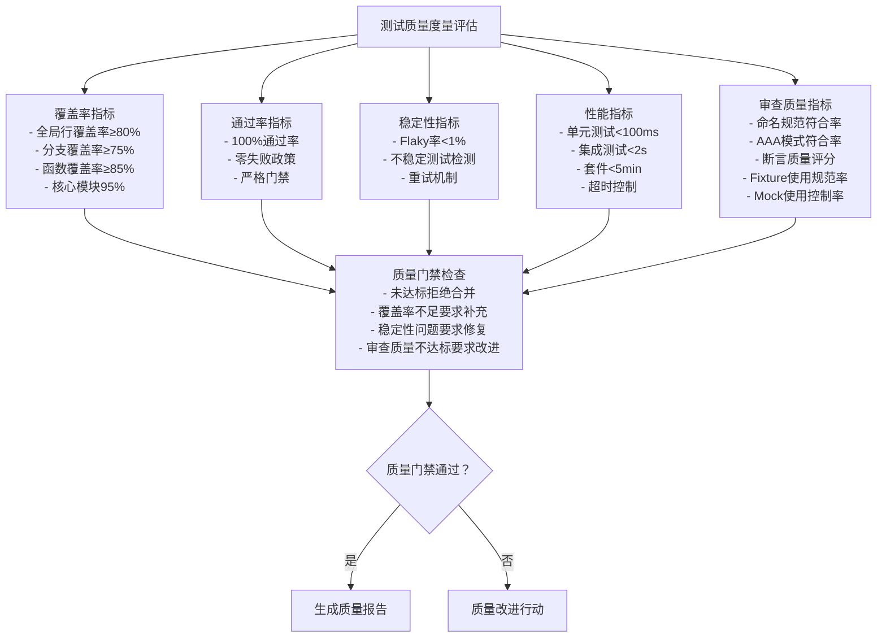

**图表来源**
- [altas-workflow/references/testing/test-quality-metrics.md:20-46](file://altas-workflow/references/testing/test-quality-metrics.md#L20-L46)
- [altas-workflow/references/testing/test-quality-metrics.md:245-292](file://altas-workflow/references/testing/test-quality-metrics.md#L245-L292)
- [altas-workflow/references/testing/test-quality-metrics.md:295-383](file://altas-workflow/references/testing/test-quality-metrics.md#L295-L383)
- [altas-workflow/references/testing/test-quality-metrics.md:386-496](file://altas-workflow/references/testing/test-quality-metrics.md#L386-L496)

#### 9) 测试审查检查清单

**新增** 系统性的测试质量评估标准：

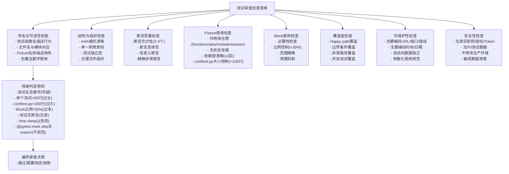

**图表来源**
- [altas-workflow/references/testing/test-review-checklist.md:10-83](file://altas-workflow/references/testing/test-review-checklist.md#L10-L83)

#### 10) 测试报告输出
标准测试报告包含完整的测试信息：

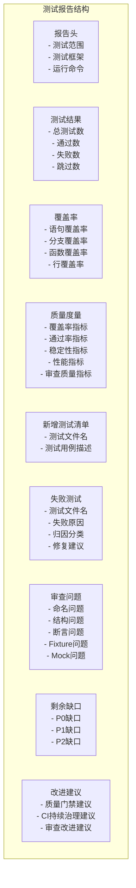

**图表来源**
- [altas-workflow/references/special-modes/test.md:259-320](file://altas-workflow/references/special-modes/test.md#L259-L320)
- [altas-workflow/references/testing/templates/test_report.md:11-59](file://altas-workflow/references/testing/templates/test_report.md#L11-L59)

### 门禁逻辑分析

门禁逻辑确保测试质量的底线要求：

| 场景 | 处理方式 | 处理依据 |
|------|----------|----------|
| 新增测试失败 | 必须修复测试或确认是代码Bug而非测试错误 | 测试质量保证 |
| 新增测试导致旧测试失败 | 检查是否破坏了现有行为，若是则调整测试或回到Plan | 向后兼容性 |
| 覆盖率未达标 | 若用户设定了目标覆盖率，继续补充测试直到达标或用户确认降低目标 | 质量目标达成 |
| 测试运行超时 | 识别慢测试，建议用户优化或拆分 | 性能效率 |
| 质量门禁不通过 | 根据质量度量指标拒绝合并，要求修复质量问题 | 质量门禁 |
| 审查质量不达标 | 根据测试审查检查清单拒绝合并，要求修复测试质量问题 | 审查质量门禁 |

**章节来源**
- [altas-workflow/references/special-modes/test.md:323-333](file://altas-workflow/references/special-modes/test.md#L323-L333)

### 特殊场景处理

#### 1) 无测试框架项目
对于缺乏测试框架的项目，提供渐进式解决方案：

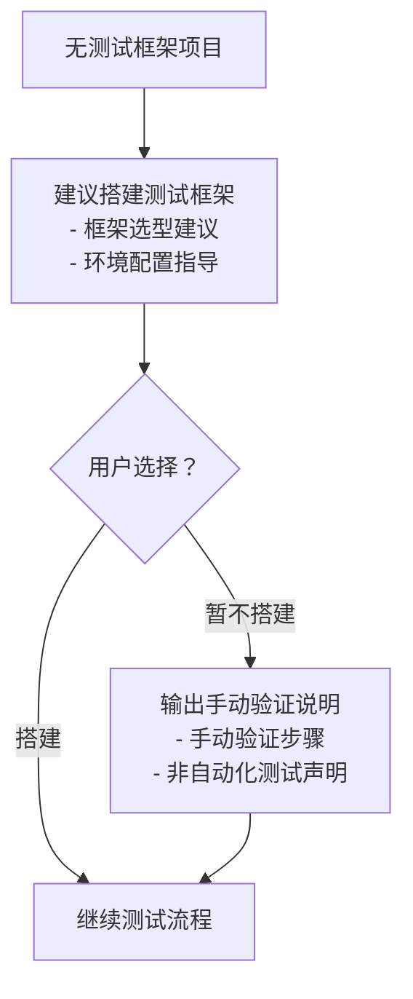

**图表来源**
- [altas-workflow/references/special-modes/test.md:344-350](file://altas-workflow/references/special-modes/test.md#L344-L350)

#### 2) 复杂测试依赖环境
针对数据库、外部API等复杂依赖场景：

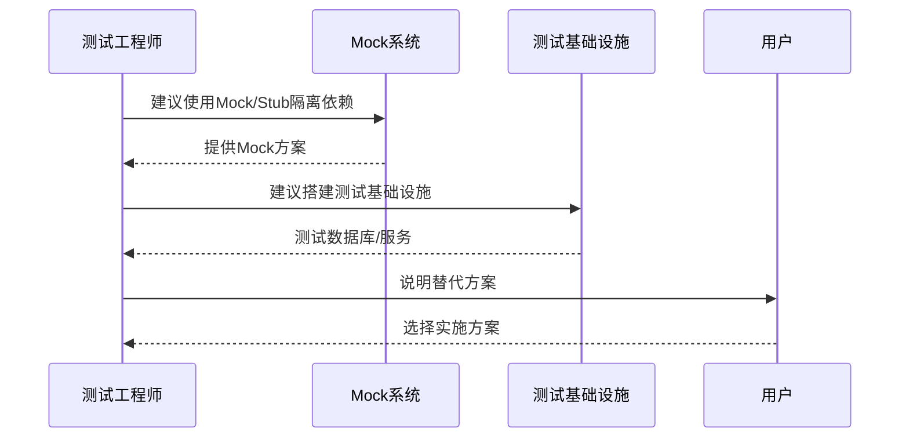

**图表来源**
- [altas-workflow/references/special-modes/test.md:351-355](file://altas-workflow/references/special-modes/test.md#L351-L355)

#### 3) 测试代码量过大
当测试代码量超过被测试代码时的处理策略：

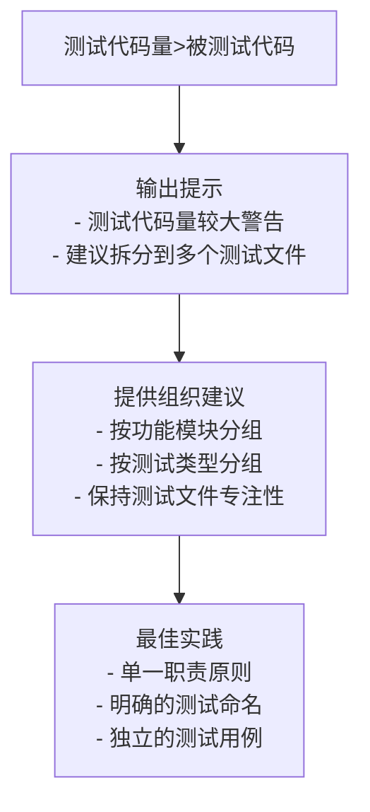

**图表来源**
- [altas-workflow/references/special-modes/test.md:356-360](file://altas-workflow/references/special-modes/test.md#L356-L360)

### 测试最佳实践

#### 测试命名规范
采用"应该...当..."的命名模式，清晰表达测试意图：

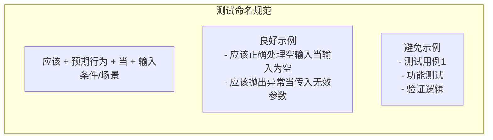

**图表来源**
- [altas-workflow/references/special-modes/test.md:379-388](file://altas-workflow/references/special-modes/test.md#L379-L388)

#### AAA测试模式
严格按照Arrange-Act-Assert模式编写测试：

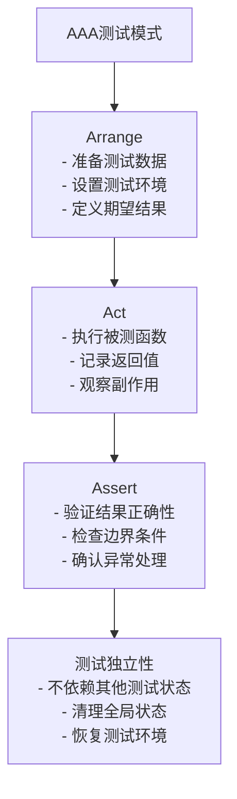

**图表来源**
- [altas-workflow/references/special-modes/test.md:389-401](file://altas-workflow/references/special-modes/test.md#L389-L401)

#### pytest模式最佳实践
结合pytest的高级特性编写高质量测试：

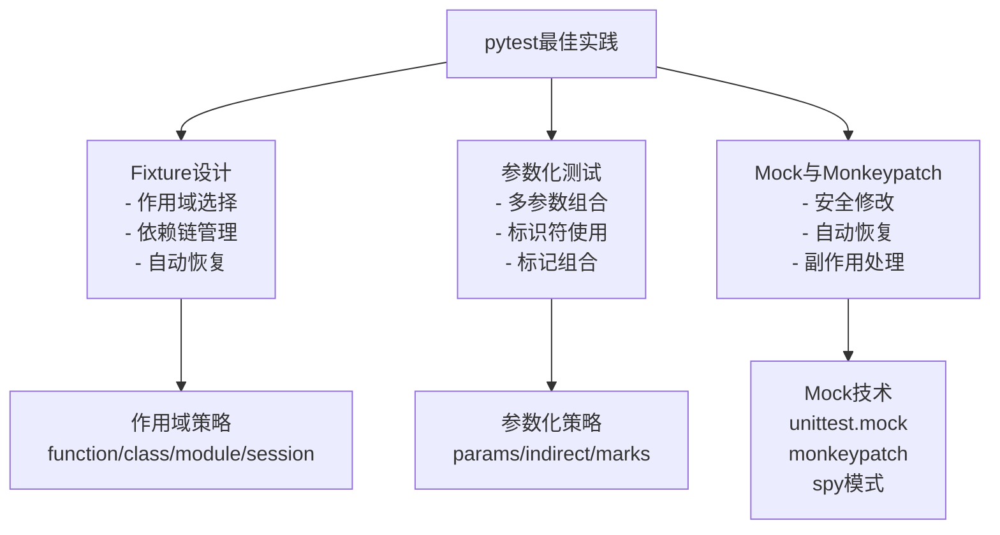

**图表来源**
- [altas-workflow/references/testing/pytest-patterns.md:18-118](file://altas-workflow/references/testing/pytest-patterns.md#L18-L118)
- [altas-workflow/references/testing/pytest-patterns.md:121-181](file://altas-workflow/references/testing/pytest-patterns.md#L121-L181)
- [altas-workflow/references/testing/pytest-patterns.md:184-256](file://altas-workflow/references/testing/pytest-patterns.md#L184-L256)

#### 测试模板使用最佳实践

**新增** 模板系统的最佳使用实践：

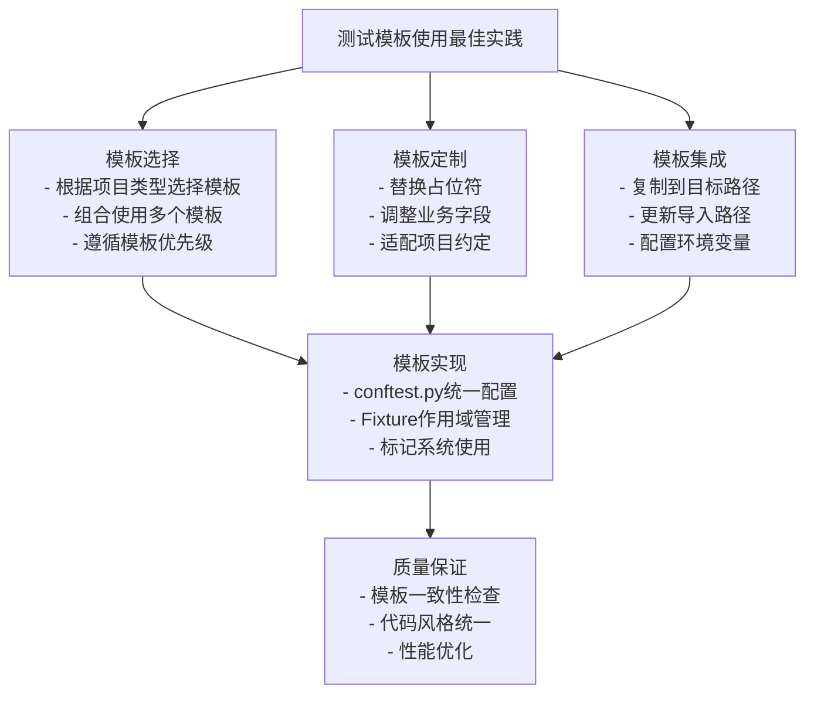

**图表来源**
- [altas-workflow/references/testing/test-scaffold-templates.md:12-21](file://altas-workflow/references/testing/test-scaffold-templates.md#L12-L21)
- [altas-workflow/references/testing/test-scaffold-templates.md:61-81](file://altas-workflow/references/testing/test-scaffold-templates.md#L61-L81)

#### 测试审查最佳实践

**新增** 基于测试审查检查清单的最佳实践：

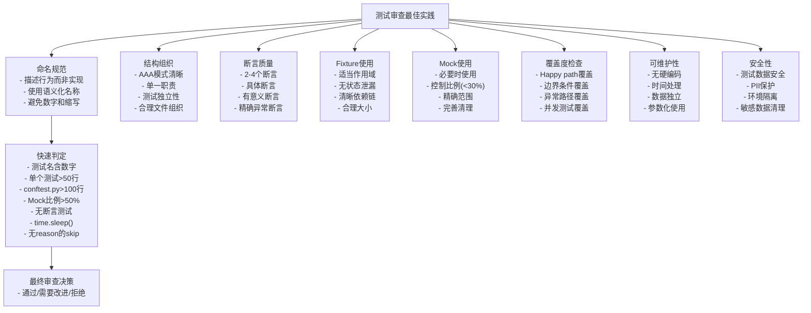

**图表来源**
- [altas-workflow/references/testing/test-review-checklist.md:10-83](file://altas-workflow/references/testing/test-review-checklist.md#L10-L83)

**章节来源**
- [altas-workflow/references/special-modes/test.md:379-421](file://altas-workflow/references/special-modes/test.md#L379-L421)

## 依赖关系分析

测试专项模式与ALTAS工作流其他组件存在密切的依赖关系，并深度集成了pytest、API测试、模板系统、压力验证、质量度量和测试审查的专业知识：

```mermaid
graph TB
subgraph "测试专项模式依赖关系"
TestMode[测试专项模式] --> TDD[Test-Driven Development]
TestMode --> Debug[Systematic Debugging]
TestMode --> Review[Code Review]
TestMode --> Refactor[Refactoring]
TestMode --> PytestPatterns[pytest模式参考]
TestMode --> APITesting[API测试参考]
TestMode --> TestDataManagement[测试数据管理]
TestMode --> TemplateSystem[测试脚手架模板]
TestMode --> PressureScenarios[压力场景验证]
TestMode --> QualityMetrics[测试质量度量]
TestMode --> ReviewChecklist[测试审查检查清单]
PytestPatterns --> PytestCore[pytest核心概念]
PytestPatterns --> FixtureSystem[Fixture系统]
PytestPatterns --> ParametrizeSystem[参数化系统]
APITesting --> ValidationTests[输入验证测试]
APITesting --> IdempotencyTests[幂等性测试]
APITesting --> ConcurrencyTests[并发测试]
APITesting --> ErrorHandlingTests[错误处理测试]
TestDataManagement --> FactoryBoy[Factory Boy集成]
TestDataManagement --> Faker[Faker库使用]
TestDataManagement --> IsolationStrategies[隔离策略]
TemplateSystem --> ConftestTemplate[conftest.py模板]
TemplateSystem --> APIClientTemplate[API客户端模板]
TemplateSystem --> AuthTemplate[认证模板]
TemplateSystem --> DBRollbackTemplate[数据库回滚模板]
TemplateSystem --> FactoriesTemplate[Factories模板]
TemplateSystem --> APIMatrixTemplate[API测试矩阵模板]
TemplateSystem --> TestReportTemplate[测试报告模板]
PressureScenarios --> TimeStress[时间压力场景]
PressureScenarios --> CoverageStress[覆盖率压力场景]
PressureScenarios --> ContractMissing[契约缺失场景]
PressureScenarios --> EnvDiff[环境差异场景]
PressureScenarios --> ProcessBypass[流程绕过场景]
QualityMetrics --> CoverageMetrics[覆盖率指标]
QualityMetrics --> PassRateMetrics[通过率指标]
QualityMetrics --> StabilityMetrics[稳定性指标]
QualityMetrics --> PerformanceMetrics[性能指标]
ReviewChecklist --> NamingChecklist[命名检查清单]
ReviewChecklist --> StructureChecklist[结构检查清单]
ReviewChecklist --> AssertionChecklist[断言检查清单]
ReviewChecklist --> FixtureChecklist[Fixture检查清单]
ReviewChecklist --> MockChecklist[Mock检查清单]
ReviewChecklist --> CoverageChecklist[覆盖度检查清单]
ReviewChecklist --> MaintainabilityChecklist[可维护性检查清单]
ReviewChecklist --> SecurityChecklist[安全性检查清单]
TDD --> AntiPatterns[Testing Anti-Patterns]
Debug --> RootCause[Root Cause Tracing]
Debug --> Defense[Defense in Depth]
TestMode --> Workflow[ALTAS Workflow]
Workflow --> SpecialModes[Special Modes]
Workflow --> Superpowers[Superpowers]
SpecialModes --> TestMode
Superpowers --> TDD
Superpowers --> Debug
end
```

**图表来源**
- [altas-workflow/README.md:91-117](file://altas-workflow/README.md#L91-L117)
- [altas-workflow/references/special-modes/test.md:146-150](file://altas-workflow/references/special-modes/test.md#L146-L150)
- [altas-workflow/references/testing/pytest-patterns.md:1-741](file://altas-workflow/references/testing/pytest-patterns.md#L1-L741)
- [altas-workflow/references/testing/api-testing.md:1-1110](file://altas-workflow/references/testing/api-testing.md#L1-L1110)
- [altas-workflow/references/testing/test-scaffold-templates.md:1-81](file://altas-workflow/references/testing/test-scaffold-templates.md#L1-L81)
- [altas-workflow/references/testing/test-task-pressure-scenarios.md:1-149](file://altas-workflow/references/testing/test-task-pressure-scenarios.md#L1-L149)
- [altas-workflow/references/testing/test-quality-metrics.md:1-900](file://altas-workflow/references/testing/test-quality-metrics.md#L1-L900)
- [altas-workflow/references/testing/test-review-checklist.md:1-83](file://altas-workflow/references/testing/test-review-checklist.md#L1-L83)

### 协作模式集成

测试专项模式在不同场景下与其它模式的协作关系：

```mermaid
sequenceDiagram
participant TestMode as 测试专项模式
participant DebugMode as DEBUG模式
participant RefactorMode as REFACTOR模式
participant ReviewMode as REVIEW模式
TestMode->>TestMode : 测试完成后
TestMode->>DebugMode : 测试失败且原因不明
TestMode->>RefactorMode : 测试覆盖后发现重构机会
TestMode->>ReviewMode : 测试完成后审查测试质量
Note over TestMode,ReviewMode : 无缝模式切换
```

**图表来源**
- [altas-workflow/references/special-modes/test.md:336-341](file://altas-workflow/references/special-modes/test.md#L336-L341)

**章节来源**
- [altas-workflow/README.md:91-117](file://altas-workflow/README.md#L91-L117)
- [altas-workflow/references/special-modes/test.md:336-341](file://altas-workflow/references/special-modes/test.md#L336-L341)

## 性能考虑

测试专项模式在性能方面的考量包括：

### 测试执行效率
- **并行测试执行**：合理安排测试用例的并行执行，避免资源竞争
- **测试隔离**：确保测试之间的独立性，减少不必要的重复执行
- **缓存策略**：利用测试结果缓存，避免重复计算
- **pytest-xdist并行化**：利用pytest-xdist进行多进程并行执行
- **模板复用**：通过模板系统减少重复配置，提高搭建效率

### 覆盖率分析性能
- **增量覆盖率**：仅分析发生变化的代码部分
- **采样策略**：对大型项目采用采样覆盖率分析
- **并行分析**：利用多核CPU进行并行覆盖率计算

### 压力场景验证性能
- **快速验证**：压力场景验证采用快速检查机制
- **条件判断**：通过条件判断快速识别压力场景
- **模板选择**：智能模板选择减少不必要的配置

### 质量度量性能
- **指标聚合**：多指标聚合分析减少重复计算
- **阈值检查**：快速阈值检查避免全量分析
- **基线对比**：基线对比减少历史数据处理

### 测试数据管理性能
- **惰性加载**：Factory Boy的惰性求值特性
- **批量预生成**：使用build_batch批量创建测试数据
- **数据库优化**：事务回滚vs物理删除的选择策略

### 报告生成优化
- **增量报告**：仅生成变化部分的报告内容
- **压缩输出**：对大量测试结果进行压缩存储
- **延迟计算**：按需生成详细的测试报告

### 测试审查性能
- **检查清单自动化**：通过检查清单模板自动化质量评估
- **快速判定规则**：基于规则的快速质量筛选
- **批量审查**：支持批量测试用例的审查评估

## 故障排除指南

### 常见问题诊断

#### 测试失败问题
当遇到测试失败时，按照以下流程进行诊断：

```mermaid
flowchart TD
Fail[测试失败] --> Reproduce["重现测试失败<br/>- 确认失败可重现<br/>- 记录失败环境<br/>- 收集失败信息"]
Reproduce --> Isolate["隔离问题<br/>- 独立运行失败测试<br/>- 检查测试依赖<br/>- 验证测试环境"]
Isolate --> RootCause["根因分析<br/>- 分析失败原因<br/>- 检查代码变更<br/>- 验证假设"]
RootCause --> Fix["修复问题<br/>- 编写修复代码<br/>- 添加回归测试<br/>- 验证修复效果"]
Fix --> Verify["验证修复<br/>- 运行所有测试<br/>- 检查覆盖率<br/>- 确认无副作用"]
```

**图表来源**
- [altas-workflow/references/superpowers/systematic-debugging/SKILL.md:50-121](file://altas-workflow/references/superpowers/systematic-debugging/SKILL.md#L50-L121)

#### 压力场景绕过问题

**新增** 压力场景绕过问题的诊断和处理：

```mermaid
flowchart TD
PressureBypass[压力场景绕过] --> Identify["识别绕过行为<br/>- 时间压力绕过<br/>- 覆盖率压力绕过<br/>- 契约缺失绕过<br/>- 环境差异绕过<br/>- 流程绕过"]
Identify --> Analyze["分析绕过原因<br/>- 用户动机分析<br/>- 系统限制识别<br/>- 风险评估"]
Analyze --> Correct["纠正行为<br/>- 回到标准流程<br/>- 重新执行关键步骤<br/>- 记录绕过原因"]
Correct --> Prevent["预防再次发生<br/>- 加强压力场景训练<br/>- 完善质量门禁<br/>- 建立监督机制"]
```

**图表来源**
- [altas-workflow/references/testing/test-task-pressure-scenarios.md:17](file://altas-workflow/references/testing/test-task-pressure-scenarios.md#L17)

#### 质量门禁不通过问题

**新增** 质量门禁不通过问题的处理：

```mermaid
flowchart TD
QualityGateFail[质量门禁不通过] --> AnalyzeMetrics["分析质量指标<br/>- 覆盖率不足<br/>- 通过率不达标<br/>- 稳定性问题<br/>- 性能超限<br/>- 审查质量不达标"]
AnalyzeMetrics --> Prioritize["优先级排序<br/>- 严重程度评估<br/>- 影响范围分析<br/>- 修复难度评估"]
Prioritize --> Action["采取行动<br/>- 修复覆盖率<br/>- 优化测试稳定性<br/>- 改进测试性能<br/>- 修复测试质量问题<br/>- 重新进行测试审查"]
Action --> Verify["验证改进<br/>- 重新运行质量检查<br/>- 比较改进前后<br/>- 确认达到门禁标准"]
```

**图表来源**
- [altas-workflow/references/testing/test-quality-metrics.md:752-800](file://altas-workflow/references/testing/test-quality-metrics.md#L752-L800)

#### 审查质量不达标问题

**新增** 测试审查质量不达标问题的处理：

```mermaid
flowchart TD
ReviewGateFail[审查质量不达标] --> AnalyzeIssues["分析审查问题<br/>- 命名问题<br/>- 结构问题<br/>- 断言问题<br/>- Fixture问题<br/>- Mock问题<br/>- 覆盖度问题<br/>- 可维护性问题<br/>- 安全性问题"]
AnalyzeIssues --> Prioritize["优先级排序<br/>- 问题严重程度<br/>- 影响范围<br/>- 修复难度"]
Prioritize --> Action["采取行动<br/>- 修复命名问题<br/>- 改进测试结构<br/>- 优化断言质量<br/>- 规范Fixture使用<br/>- 控制Mock使用<br/>- 完善覆盖度<br/>- 提升可维护性<br/>- 加强安全性"]
Action --> Verify["验证改进<br/>- 重新进行审查<br/>- 比较改进前后<br/>- 确认达到标准"]
```

**图表来源**
- [altas-workflow/references/testing/test-review-checklist.md:68-79](file://altas-workflow/references/testing/test-review-checklist.md#L68-L79)

#### 覆盖率不足问题
当覆盖率未达到预期时：

```mermaid
flowchart TD
LowCoverage[覆盖率不足] --> Analyze["分析覆盖率报告<br/>- 识别未覆盖区域<br/>- 分析原因<br/>- 评估重要性"]
Analyze --> Plan["制定改进计划<br/>- 确定优先级<br/>- 设定目标<br/>- 制定时间表"]
Plan --> Implement["实施改进<br/>- 编写缺失测试<br/>- 优化现有测试<br/>- 验证改进效果"]
Implement --> Verify["验证改进<br/>- 运行覆盖率分析<br/>- 比较改进前后<br/>- 确认达到目标"]
```

**图表来源**
- [altas-workflow/references/special-modes/test.md:239-244](file://altas-workflow/references/special-modes/test.md#L239-L244)

### 门禁逻辑触发条件

当满足以下条件时，测试专项模式会触发相应的门禁逻辑：

| 触发条件 | 处理措施 | 预防建议 |
|----------|----------|----------|
| 新增测试失败 | 修复测试或确认代码Bug | 加强测试设计评审 |
| 旧测试被破坏 | 检查向后兼容性 | 建立回归测试机制 |
| 覆盖率未达标 | 继续补充测试或调整目标 | 设定合理的覆盖率目标 |
| 测试运行超时 | 优化测试或拆分测试 | 识别慢测试并优化 |
| 质量门禁不通过 | 根据质量指标修复问题 | 建立质量门禁机制 |
| 审查质量不达标 | 根据审查清单修复问题 | 建立测试审查机制 |

### pytest相关问题

#### Fixture作用域问题
- **问题**：Fixture作用域不当导致测试间相互影响
- **解决**：使用适当的scope（function/class/module/session）
- **预防**：遵循最小作用域原则

#### 参数化测试问题
- **问题**：参数化测试输出难以理解
- **解决**：使用pytest.param的id参数提供描述性标识
- **预防**：为每个测试参数组合提供清晰的ID

#### Mock问题
- **问题**：Mock对象未正确清理导致测试污染
- **解决**：使用monkeypatch自动恢复或unittest.mock的上下文管理
- **预防**：确保每个测试都有适当的清理逻辑

### 模板系统问题

**新增** 模板系统的常见问题和解决方案：

#### 模板复制问题
- **问题**：模板复制后路径不正确
- **解决**：检查目标路径映射，更新导入路径
- **预防**：使用模板复制清单，验证路径映射

#### 模板定制问题
- **问题**：模板定制后不符合项目约定
- **解决**：检查业务字段替换，验证配置参数
- **预防**：建立模板定制检查清单

#### 模板集成问题
- **问题**：模板集成后测试无法运行
- **解决**：检查环境变量配置，验证依赖安装
- **预防**：建立模板集成验证流程

### 测试审查问题

**新增** 基于测试审查检查清单的问题诊断和处理：

#### 命名问题
- **问题**：测试函数名不描述行为
- **解决**：使用"应该...当..."的命名模式
- **预防**：建立命名规范检查清单

#### 结构问题
- **问题**：测试结构不符合AAA模式
- **解决**：重构测试结构，确保三段分明
- **预防**：建立结构检查清单

#### 断言问题
- **问题**：断言不充分或不具体
- **解决**：增加断言数量，提高断言质量
- **预防**：建立断言质量检查清单

#### Fixture问题
- **问题**：Fixture使用不当
- **解决**：调整作用域，优化依赖链
- **预防**：建立Fixture使用检查清单

#### Mock问题
- **问题**：Mock使用比例过高
- **解决**：减少Mock使用，提高测试稳定性
- **预防**：建立Mock使用控制清单

**章节来源**
- [altas-workflow/references/special-modes/test.md:323-333](file://altas-workflow/references/special-modes/test.md#L323-L333)

## 结论

测试专项模式作为ALTAS工作流的重要组成部分，为软件测试提供了系统化、标准化的解决方案。通过深度集成pytest模式、API测试参考文档、测试脚手架模板系统、压力场景验证机制、测试质量度量体系和测试审查检查清单，该模式现在具备了更强的专业性和实用性。

### 主要优势
1. **标准化流程**：提供从测试现状分析到测试报告输出的完整流程
2. **优先级管理**：基于P0-P4优先级体系确保关键功能得到充分测试
3. **质量保证**：通过系统化的测试用例编写和验证机制提升代码质量
4. **协作集成**：与DEBUG、REFACTOR、REVIEW等其他工作模式无缝衔接
5. **专业指导**：集成pytest模式和API测试的专业知识，提供高质量测试实践
6. **模板化支持**：提供完整的测试脚手架模板，加速测试基础设施搭建
7. **压力验证**：内置压力场景验证机制，确保测试纪律在各种挑战情况下得到保持
8. **质量度量**：集成全面的质量度量体系，提供量化评估和质量门禁机制
9. **数据管理**：提供完整的测试数据管理策略，确保测试的可靠性
10. **审查保障**：新增测试审查检查清单，提供系统性的质量评估标准

### 最佳实践建议
1. **严格执行测试优先级**：优先保证核心逻辑和边界条件的测试覆盖
2. **遵循AAA模式**：确保测试用例的可读性和可维护性
3. **利用pytest高级特性**：合理使用Fixture、参数化、Mock等高级功能
4. **实施测试数据管理**：使用Factory Boy和Faker确保测试数据的质量和隔离
5. **使用模板系统**：通过模板快速搭建测试基础设施，提高开发效率
6. **应对压力场景**：在各种挑战情况下保持测试纪律，确保测试质量
7. **监控质量指标**：持续监控覆盖率、通过率、稳定性等关键质量指标
8. **建立质量门禁**：通过质量门禁机制确保测试质量的底线要求
9. **定期进行测试审查**：使用测试审查检查清单定期评估测试质量
10. **持续改进覆盖率**：定期评估和改进测试覆盖率
11. **建立测试文化**：培养团队的测试意识和测试习惯

### 未来发展
随着ALTAS工作流的不断发展，测试专项模式将继续演进，为AI驱动的软件开发提供更加智能化、自动化的测试解决方案。通过与TDD、系统化调试等超级技能的深度融合，以及pytest、API测试、模板系统、压力验证、质量度量和测试审查专业知识的持续集成，测试专项模式将成为保障软件质量的重要基石。

**更新** 本次更新显著增强了测试专项模式的专业性和实用性，通过集成测试审查检查清单、增强的质量度量体系和压力场景验证机制，为开发者提供了更加完善和专业的测试工作指导。新增的测试审查检查清单不仅保持了原有的标准化优势，还大幅提升了测试工作的质量保证能力和审查效率，为现代软件开发提供了强有力的支持。

通过本次更新，测试专项模式不仅保持了原有的标准化优势，还显著增强了专业性和实用性，为开发者提供了更加完善和专业的测试工作指导。新增的测试审查检查清单、增强的质量度量体系和压力验证机制共同构成了一个完整的测试专业化解决方案，能够有效应对现代软件开发中的各种测试挑战，形成从测试编写到质量审查的完整闭环。