# 测试专项模式

<cite>
**本文档引用的文件**
- [altas-workflow/README.md](file://altas-workflow/README.md)
- [altas-workflow/references/special-modes/test.md](file://altas-workflow/references/special-modes/test.md)
- [altas-workflow/references/superpowers/systematic-debugging/SKILL.md](file://altas-workflow/references/superpowers/systematic-debugging/SKILL.md)
- [altas-workflow/references/superpowers/test-driven-development/SKILL.md](file://altas-workflow/references/superpowers/test-driven-development/SKILL.md)
- [altas-workflow/references/superpowers/test-driven-development/testing-anti-patterns.md](file://altas-workflow/references/superpowers/test-driven-development/testing-anti-patterns.md)
- [altas-workflow/references/testing/pytest-patterns.md](file://altas-workflow/references/testing/pytest-patterns.md)
- [altas-workflow/references/testing/api-testing.md](file://altas-workflow/references/testing/api-testing.md)
- [altas-workflow/references/testing/test-data-management.md](file://altas-workflow/references/testing/test-data-management.md)
- [altas-workflow/references/testing/ci-cd-integration.md](file://altas-workflow/references/testing/ci-cd-integration.md)
- [.agents/skills/pytest-patterns/SKILL.md](file://.agents/skills/pytest-patterns/SKILL.md)
- [.agents/skills/advanced-api-testing/SKILL.md](file://.agents/skills/advanced-api-testing/SKILL.md)
</cite>

## 更新摘要
**变更内容**
- 新增pytest模式和API测试参考文档的集成
- 增强测试工作流程的指导性和实用性
- 更新测试框架选择和配置指南
- 添加测试数据管理和CI/CD集成相关内容

## 目录
1. [简介](#简介)
2. [项目结构](#项目结构)
3. [核心组件](#核心组件)
4. [架构概览](#架构概览)
5. [详细组件分析](#详细组件分析)
6. [依赖关系分析](#依赖关系分析)
7. [性能考虑](#性能考虑)
8. [故障排除指南](#故障排除指南)
9. [结论](#结论)

## 简介

测试专项模式是ALTAS工作流中专门针对测试场景设计的标准化流程。该模式专注于为现有代码补充测试、提高测试覆盖率、修复失败测试以及生成测试报告等核心任务。

测试专项模式的核心价值在于：
- **标准化测试流程**：提供从测试现状分析到测试报告输出的完整流程
- **优先级管理**：基于P0-P4优先级体系确保关键功能得到充分测试
- **质量保证**：通过系统化的测试用例编写和验证机制提升代码质量
- **协作集成**：与DEBUG、REFACTOR、REVIEW等其他工作模式无缝衔接
- **框架集成**：深度整合pytest模式和API测试参考文档，提供专业级测试指导

## 项目结构

ALTAS工作流采用模块化架构，测试专项模式作为特殊模式之一，位于references/special-modes目录下，并集成了多个专业的测试参考文档：

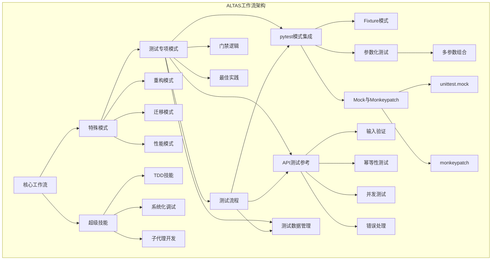

**图表来源**
- [altas-workflow/README.md:62-133](file://altas-workflow/README.md#L62-L133)
- [altas-workflow/references/special-modes/test.md:1-266](file://altas-workflow/references/special-modes/test.md#L1-L266)
- [altas-workflow/references/testing/pytest-patterns.md:1-741](file://altas-workflow/references/testing/pytest-patterns.md#L1-L741)
- [altas-workflow/references/testing/api-testing.md:1-1110](file://altas-workflow/references/testing/api-testing.md#L1-L1110)

**章节来源**
- [altas-workflow/README.md:1-133](file://altas-workflow/README.md#L1-L133)
- [altas-workflow/references/special-modes/test.md:1-266](file://altas-workflow/references/special-modes/test.md#L1-L266)

## 核心组件

测试专项模式包含以下核心组件：

### 1. 触发机制
- **触发词**：TEST、写测试、补测试
- **适用场景**：现有代码测试补充、覆盖率提升、失败测试修复、测试报告生成

### 2. 首轮动作框架
- **测试目标确认**：补测试覆盖、提高覆盖率、修复失败测试、生成测试报告
- **测试范围确认**：单个文件/函数/模块或全项目扫描
- **测试框架确认**：项目使用的测试框架及运行命令

### 3. 测试框架集成体系

#### Python/pytest项目
- **核心模式**：`references/testing/pytest-patterns.md`
- **API测试**：`references/testing/api-testing.md`
- **测试数据**：`references/testing/test-data-management.md`

#### 其他语言项目
- **Jest/Mocha**：JavaScript/TypeScript测试框架
- **Go test**：Go语言测试框架
- **自定义框架**：按项目实际框架编写

**章节来源**
- [altas-workflow/references/special-modes/test.md:3-150](file://altas-workflow/references/special-modes/test.md#L3-L150)

## 架构概览

测试专项模式采用分阶段的流水线架构，确保测试工作的系统性和可追溯性，并深度集成了pytest和API测试的专业指导：

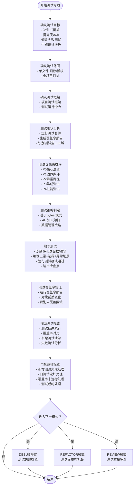

**图表来源**
- [altas-workflow/references/special-modes/test.md:18-266](file://altas-workflow/references/special-modes/test.md#L18-L266)

## 详细组件分析

### 测试流程详解

#### 1) 测试现状分析
测试现状分析阶段是整个测试专项的基础，主要包含三个核心活动：

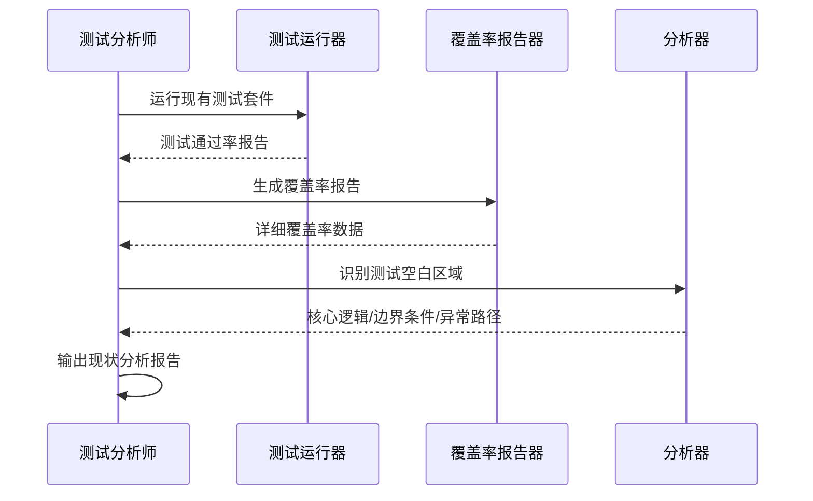

**图表来源**
- [altas-workflow/references/special-modes/test.md:36-44](file://altas-workflow/references/special-modes/test.md#L36-L44)

#### 2) 测试优先级排序
优先级排序采用严格的等级制度，确保关键功能得到优先测试：

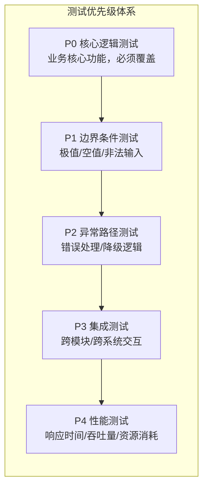

**图表来源**
- [altas-workflow/references/special-modes/test.md:45-54](file://altas-workflow/references/special-modes/test.md#L45-L54)

#### 3) 测试策略制定
基于pytest模式和API测试参考文档制定专业测试策略：

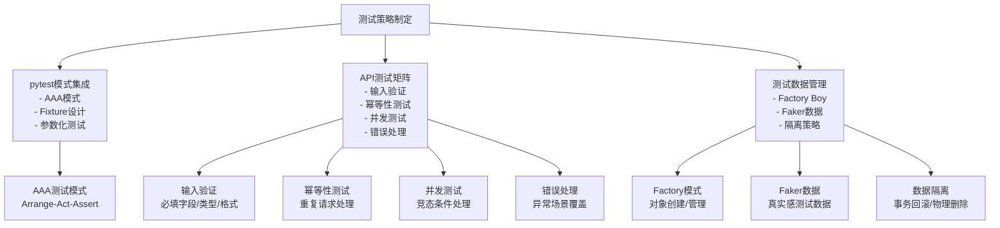

**图表来源**
- [altas-workflow/references/special-modes/test.md:61-107](file://altas-workflow/references/special-modes/test.md#L61-L107)
- [altas-workflow/references/testing/pytest-patterns.md:9-16](file://altas-workflow/references/testing/pytest-patterns.md#L9-L16)
- [altas-workflow/references/testing/api-testing.md:9-32](file://altas-workflow/references/testing/api-testing.md#L9-L32)

#### 4) 测试用例编写模板
测试用例遵循AAA模式（Arrange-Act-Assert），并结合pytest的最佳实践：

**图表来源**
- [altas-workflow/references/special-modes/test.md:117-139](file://altas-workflow/references/special-modes/test.md#L117-L139)

#### 5) 测试覆盖率验证
覆盖率验证确保测试质量的客观指标：

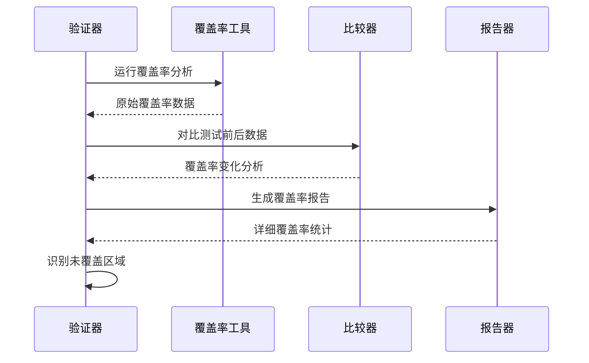

**图表来源**
- [altas-workflow/references/special-modes/test.md:140-145](file://altas-workflow/references/special-modes/test.md#L140-L145)

#### 6) 测试报告输出
标准测试报告包含完整的测试信息：

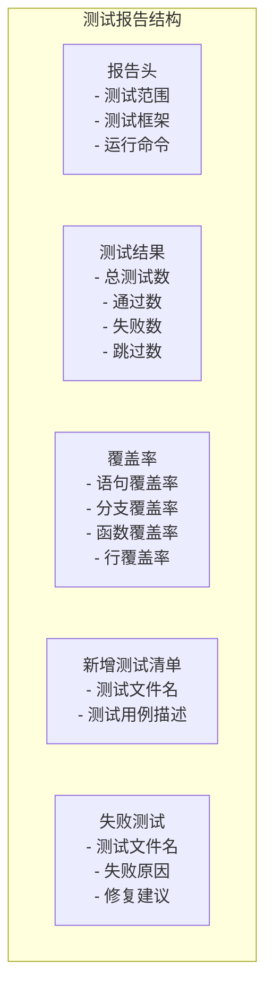

**图表来源**
- [altas-workflow/references/special-modes/test.md:146-185](file://altas-workflow/references/special-modes/test.md#L146-L185)

### 门禁逻辑分析

门禁逻辑确保测试质量的底线要求：

| 场景 | 处理方式 | 处理依据 |
|------|----------|----------|
| 新增测试失败 | 必须修复测试或确认是代码Bug而非测试错误 | 测试质量保证 |
| 新增测试导致旧测试失败 | 检查是否破坏了现有行为，若是则调整测试或回到Plan | 向后兼容性 |
| 覆盖率未达标 | 若用户设定了目标覆盖率，继续补充测试直到达标或用户确认降低目标 | 质量目标达成 |
| 测试运行超时 | 识别慢测试，建议用户优化或拆分 | 性能效率 |

**章节来源**
- [altas-workflow/references/special-modes/test.md:189-197](file://altas-workflow/references/special-modes/test.md#L189-L197)

### 特殊场景处理

#### 1) 无测试框架项目
对于缺乏测试框架的项目，提供渐进式解决方案：

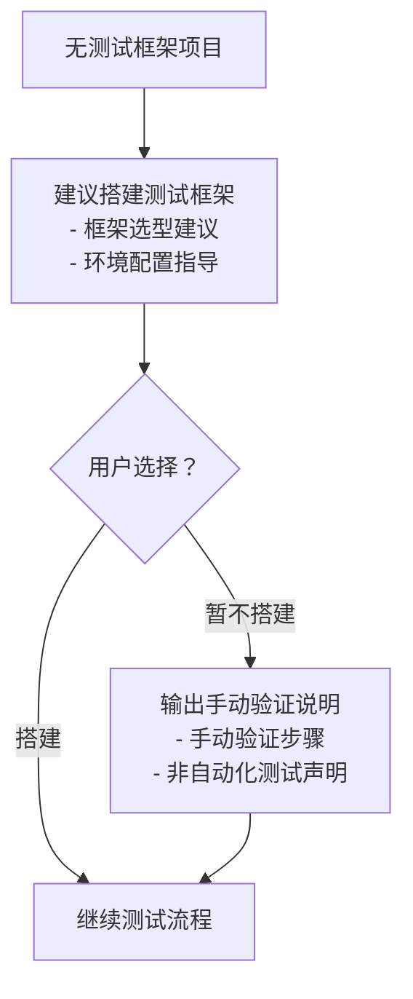

**图表来源**
- [altas-workflow/references/special-modes/test.md:210-214](file://altas-workflow/references/special-modes/test.md#L210-L214)

#### 2) 复杂测试依赖环境
针对数据库、外部API等复杂依赖场景：

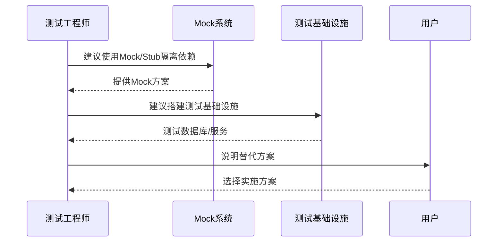

**图表来源**
- [altas-workflow/references/special-modes/test.md:215-219](file://altas-workflow/references/special-modes/test.md#L215-L219)

#### 3) 测试代码量过大
当测试代码量超过被测试代码时的处理策略：

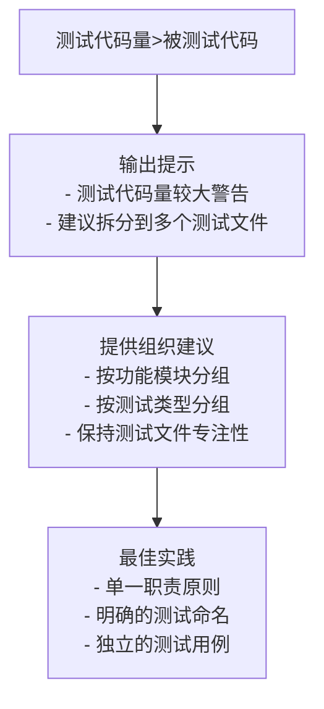

**图表来源**
- [altas-workflow/references/special-modes/test.md:220-224](file://altas-workflow/references/special-modes/test.md#L220-L224)

### 测试最佳实践

#### 测试命名规范
采用"应该...当..."的命名模式，清晰表达测试意图：

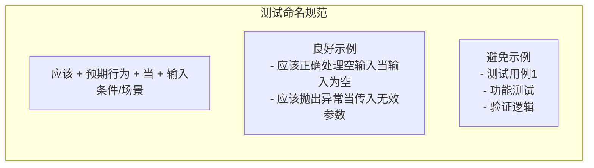

**图表来源**
- [altas-workflow/references/special-modes/test.md:229-236](file://altas-workflow/references/special-modes/test.md#L229-L236)

#### AAA测试模式
严格按照Arrange-Act-Assert模式编写测试：

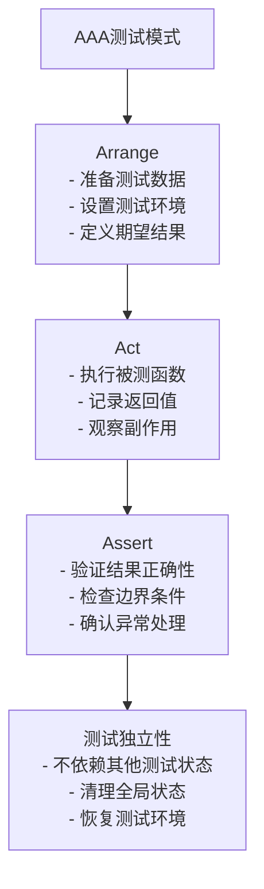

**图表来源**
- [altas-workflow/references/special-modes/test.md:237-256](file://altas-workflow/references/special-modes/test.md#L237-L256)

#### pytest模式最佳实践
结合pytest的高级特性编写高质量测试：

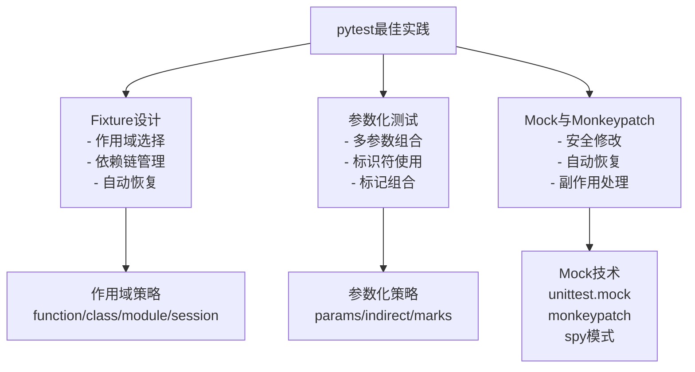

**图表来源**
- [altas-workflow/references/testing/pytest-patterns.md:18-118](file://altas-workflow/references/testing/pytest-patterns.md#L18-L118)
- [altas-workflow/references/testing/pytest-patterns.md:121-181](file://altas-workflow/references/testing/pytest-patterns.md#L121-L181)
- [altas-workflow/references/testing/pytest-patterns.md:184-256](file://altas-workflow/references/testing/pytest-patterns.md#L184-L256)

**章节来源**
- [altas-workflow/references/special-modes/test.md:227-266](file://altas-workflow/references/special-modes/test.md#L227-L266)

## 依赖关系分析

测试专项模式与ALTAS工作流其他组件存在密切的依赖关系，并深度集成了pytest和API测试的专业知识：

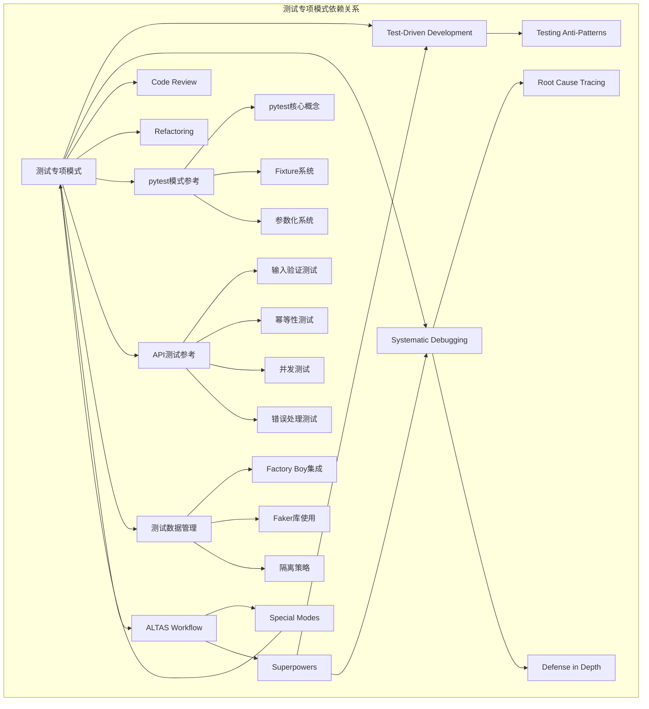

**图表来源**
- [altas-workflow/README.md:91-117](file://altas-workflow/README.md#L91-L117)
- [altas-workflow/references/special-modes/test.md:146-150](file://altas-workflow/references/special-modes/test.md#L146-L150)
- [altas-workflow/references/testing/pytest-patterns.md:1-741](file://altas-workflow/references/testing/pytest-patterns.md#L1-L741)
- [altas-workflow/references/testing/api-testing.md:1-1110](file://altas-workflow/references/testing/api-testing.md#L1-L1110)

### 协作模式集成

测试专项模式在不同场景下与其它模式的协作关系：

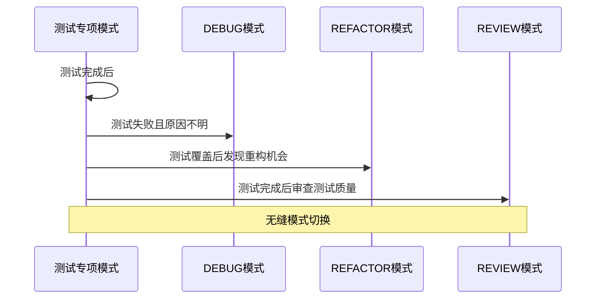

**图表来源**
- [altas-workflow/references/special-modes/test.md:200-205](file://altas-workflow/references/special-modes/test.md#L200-L205)

**章节来源**
- [altas-workflow/README.md:91-117](file://altas-workflow/README.md#L91-L117)
- [altas-workflow/references/special-modes/test.md:200-205](file://altas-workflow/references/special-modes/test.md#L200-L205)

## 性能考虑

测试专项模式在性能方面的考量包括：

### 测试执行效率
- **并行测试执行**：合理安排测试用例的并行执行，避免资源竞争
- **测试隔离**：确保测试之间的独立性，减少不必要的重复执行
- **缓存策略**：利用测试结果缓存，避免重复计算
- **pytest-xdist并行化**：利用pytest-xdist进行多进程并行执行

### 覆盖率分析性能
- **增量覆盖率**：仅分析发生变化的代码部分
- **采样策略**：对大型项目采用采样覆盖率分析
- **并行分析**：利用多核CPU进行并行覆盖率计算

### 报告生成优化
- **增量报告**：仅生成变化部分的报告内容
- **压缩输出**：对大量测试结果进行压缩存储
- **延迟计算**：按需生成详细的测试报告

### 测试数据管理性能
- **惰性加载**：Factory Boy的惰性求值特性
- **批量预生成**：使用build_batch批量创建测试数据
- **数据库优化**：事务回滚vs物理删除的选择策略

## 故障排除指南

### 常见问题诊断

#### 测试失败问题
当遇到测试失败时，按照以下流程进行诊断：

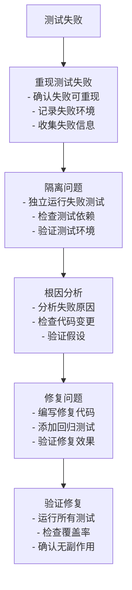

**图表来源**
- [altas-workflow/references/superpowers/systematic-debugging/SKILL.md:50-121](file://altas-workflow/references/superpowers/systematic-debugging/SKILL.md#L50-L121)

#### 覆盖率不足问题
当覆盖率未达到预期时：

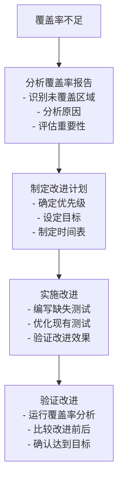

**图表来源**
- [altas-workflow/references/special-modes/test.md:140-145](file://altas-workflow/references/special-modes/test.md#L140-L145)

### 门禁逻辑触发条件

当满足以下条件时，测试专项模式会触发相应的门禁逻辑：

| 触发条件 | 处理措施 | 预防建议 |
|----------|----------|----------|
| 新增测试失败 | 修复测试或确认代码Bug | 加强测试设计评审 |
| 旧测试被破坏 | 检查向后兼容性 | 建立回归测试机制 |
| 覆盖率未达标 | 继续补充测试或调整目标 | 设定合理的覆盖率目标 |
| 测试运行超时 | 优化测试或拆分测试 | 识别慢测试并优化 |

### pytest相关问题

#### Fixture作用域问题
- **问题**：Fixture作用域不当导致测试间相互影响
- **解决**：使用适当的scope（function/class/module/session）
- **预防**：遵循最小作用域原则

#### 参数化测试问题
- **问题**：参数化测试输出难以理解
- **解决**：使用pytest.param的id参数提供描述性标识
- **预防**：为每个测试参数组合提供清晰的ID

#### Mock问题
- **问题**：Mock对象未正确清理导致测试污染
- **解决**：使用monkeypatch自动恢复或unittest.mock的上下文管理
- **预防**：确保每个测试都有适当的清理逻辑

**章节来源**
- [altas-workflow/references/special-modes/test.md:189-197](file://altas-workflow/references/special-modes/test.md#L189-L197)

## 结论

测试专项模式作为ALTAS工作流的重要组成部分，为软件测试提供了系统化、标准化的解决方案。通过深度集成pytest模式和API测试参考文档，该模式现在具备了更强的专业性和实用性。

### 主要优势
1. **标准化流程**：提供从测试现状分析到测试报告输出的完整流程
2. **优先级管理**：基于P0-P4优先级体系确保关键功能得到充分测试
3. **质量保证**：通过系统化的测试用例编写和验证机制提升代码质量
4. **协作集成**：与DEBUG、REFACTOR、REVIEW等其他工作模式无缝衔接
5. **专业指导**：集成pytest模式和API测试的专业知识，提供高质量测试实践
6. **数据管理**：提供完整的测试数据管理策略，确保测试的可靠性

### 最佳实践建议
1. **严格执行测试优先级**：优先保证核心逻辑和边界条件的测试覆盖
2. **遵循AAA模式**：确保测试用例的可读性和可维护性
3. **利用pytest高级特性**：合理使用Fixture、参数化、Mock等高级功能
4. **实施测试数据管理**：使用Factory Boy和Faker确保测试数据的质量和隔离
5. **持续改进覆盖率**：定期评估和改进测试覆盖率
6. **建立测试文化**：培养团队的测试意识和测试习惯

### 未来发展
随着ALTAS工作流的不断发展，测试专项模式将继续演进，为AI驱动的软件开发提供更加智能化、自动化的测试解决方案。通过与TDD、系统化调试等超级技能的深度融合，以及pytest和API测试专业知识的持续集成，测试专项模式将成为保障软件质量的重要基石。

通过本次更新，测试专项模式不仅保持了原有的标准化优势，还显著增强了专业性和实用性，为开发者提供了更加完善和专业的测试工作指导。