# 测试可观察性指南

<cite>
**本文档引用的文件**
- [测试可观测性](file://altas-workflow/references/testing/test-observability.md)
- [测试质量度量体系](file://altas-workflow/references/testing/test-quality-metrics.md)
- [测试代码审查清单](file://altas-workflow/references/testing/test-review-checklist.md)
- [pytest 测试模式参考](file://altas-workflow/references/testing/pytest-patterns.md)
- [测试数据管理策略](file://altas-workflow/references/testing/test-data-management.md)
</cite>

## 目录
1. [简介](#简介)
2. [项目结构](#项目结构)
3. [核心组件](#核心组件)
4. [架构概览](#架构概览)
5. [详细组件分析](#详细组件分析)
6. [依赖关系分析](#依赖关系分析)
7. [性能考虑](#性能考虑)
8. [故障排查指南](#故障排查指南)
9. [结论](#结论)
10. [附录](#附录)

## 简介

测试可观察性是现代软件测试工程中的关键能力，它通过系统化的日志记录、追踪、指标收集和报告生成，为测试过程提供完整的透明度和洞察力。本指南基于 Altas 项目的测试可观察性最佳实践，提供了从基础概念到高级应用的完整解决方案。

测试可观察性的核心价值在于：
- **调试效率**：快速定位测试失败的根本原因
- **性能监控**：实时跟踪测试执行时间和资源消耗
- **质量度量**：建立可量化的测试质量指标体系
- **趋势分析**：可视化测试质量变化趋势
- **自动化决策**：基于数据驱动的质量门禁和决策

## 项目结构

该项目采用模块化的设计理念，将测试可观察性相关的知识和实践分为多个专门的主题领域：

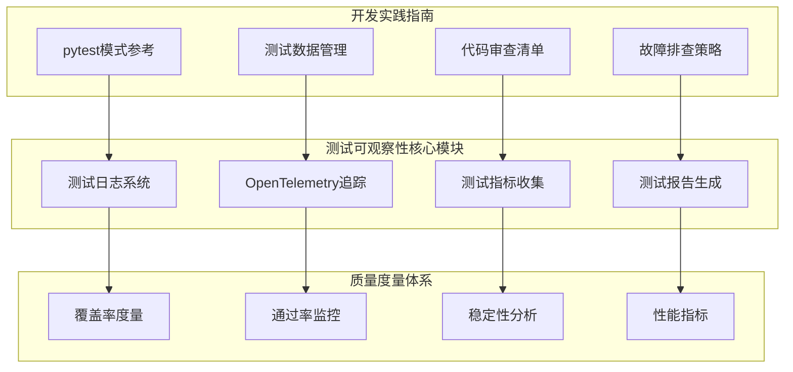

**图表来源**
- [测试可观测性:1-737](file://altas-workflow/references/testing/test-observability.md#L1-L737)
- [测试质量度量体系:1-900](file://altas-workflow/references/testing/test-quality-metrics.md#L1-L900)

**章节来源**
- [测试可观测性:1-737](file://altas-workflow/references/testing/test-observability.md#L1-L737)
- [测试质量度量体系:1-900](file://altas-workflow/references/testing/test-quality-metrics.md#L1-L900)

## 核心组件

### 测试日志系统

测试日志系统是测试可观察性的基础设施，提供结构化、可分析的日志记录能力。

#### 结构化日志格式
系统采用 JSON 格式的结构化日志，包含时间戳、级别、测试名称、执行阶段和持续时间等关键信息。

#### 自动化日志记录
通过 pytest fixture 自动为每个测试提供结构化日志记录器，确保测试过程的完整记录。

**章节来源**
- [测试可观测性:17-131](file://altas-workflow/references/testing/test-observability.md#L17-L131)

### OpenTelemetry 追踪系统

OpenTelemetry 为测试过程提供分布式追踪能力，支持跨组件的端到端追踪。

#### 追踪配置
系统配置了 TracerProvider 和 BatchSpanProcessor，支持将追踪数据导出到 OTLP 端点。

#### 测试步骤追踪
通过嵌套的 Span 结构，精确记录测试执行的各个步骤和关键操作。

#### 数据库查询追踪
集成了 SQLAlchemy 事件监听器，自动追踪数据库查询操作，包括 SQL 语句和参数。

**章节来源**
- [测试可观测性:134-244](file://altas-workflow/references/testing/test-observability.md#L134-L244)

### 测试指标收集

系统建立了多层次的指标收集体系，涵盖性能、质量、稳定性等多个维度。

#### 自定义指标定义
- **测试执行时间**：使用直方图指标记录测试执行时长
- **测试结果统计**：使用计数器指标跟踪通过、失败、跳过的测试数量
- **断言数量统计**：记录每个测试中的断言执行次数

#### 覆盖率趋势追踪
实现了覆盖率历史数据的持久化存储和趋势分析功能，支持回归检测。

**章节来源**
- [测试可观测性:247-401](file://altas-workflow/references/testing/test-observability.md#L247-L401)

### 测试报告生成

系统提供多种格式的测试报告，包括 JSON 和 HTML 格式，支持自动化集成。

#### 自定义报告插件
实现了 pytest 插件机制，自动收集测试结果并生成结构化报告。

#### 失败分析报告
集成了自动失败分类功能，为每个测试失败提供根因分析和修复建议。

**章节来源**
- [测试可观测性:405-511](file://altas-workflow/references/testing/test-observability.md#L405-L511)

## 架构概览

测试可观察性系统采用分层架构设计，各组件之间通过清晰的接口进行交互：

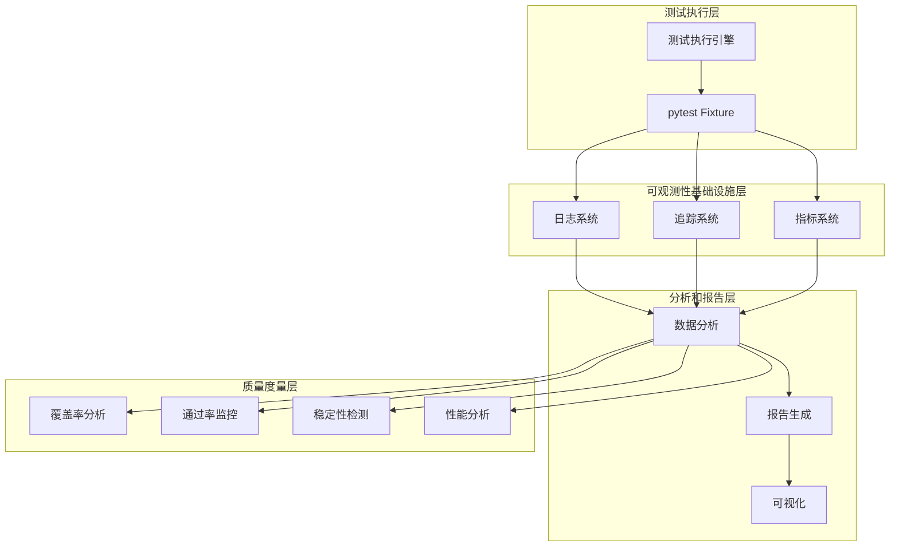

**图表来源**
- [测试可观测性:1-737](file://altas-workflow/references/testing/test-observability.md#L1-L737)
- [测试质量度量体系:1-900](file://altas-workflow/references/testing/test-quality-metrics.md#L1-L900)

## 详细组件分析

### 测试日志系统详细分析

#### 日志格式设计
系统采用统一的 JSON 格式，确保日志的结构化和可解析性：

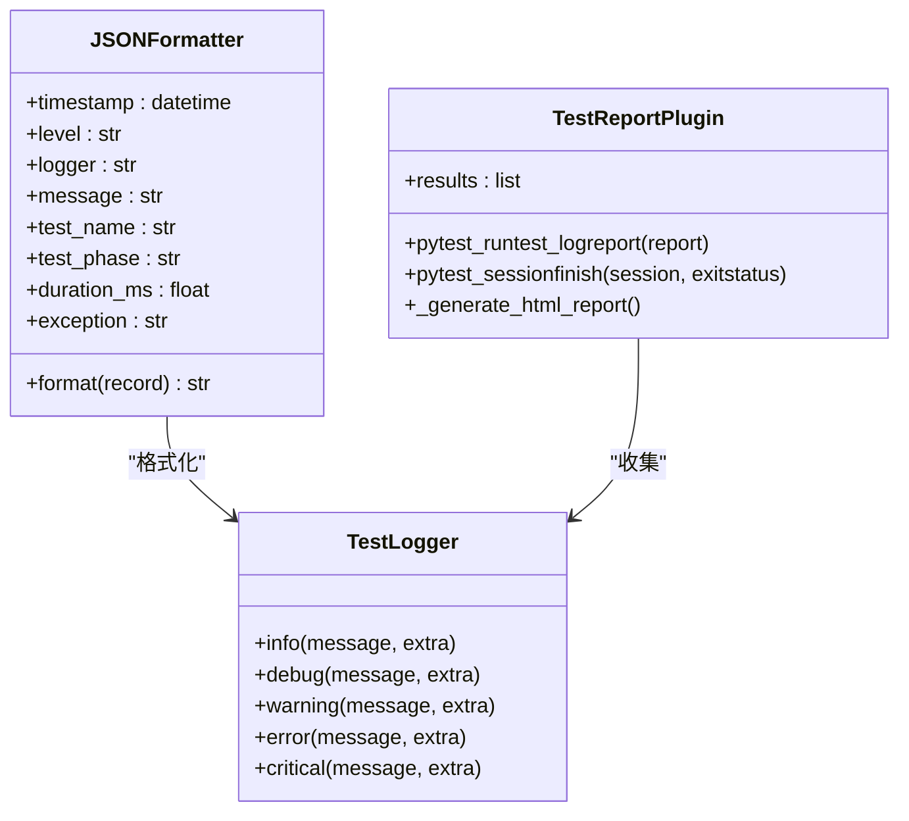

**图表来源**
- [测试可观测性:29-81](file://altas-workflow/references/testing/test-observability.md#L29-L81)
- [测试可观测性:416-510](file://altas-workflow/references/testing/test-observability.md#L416-L510)

#### 日志分析工作流
系统提供了完整的日志分析工具链，支持多种分析场景：

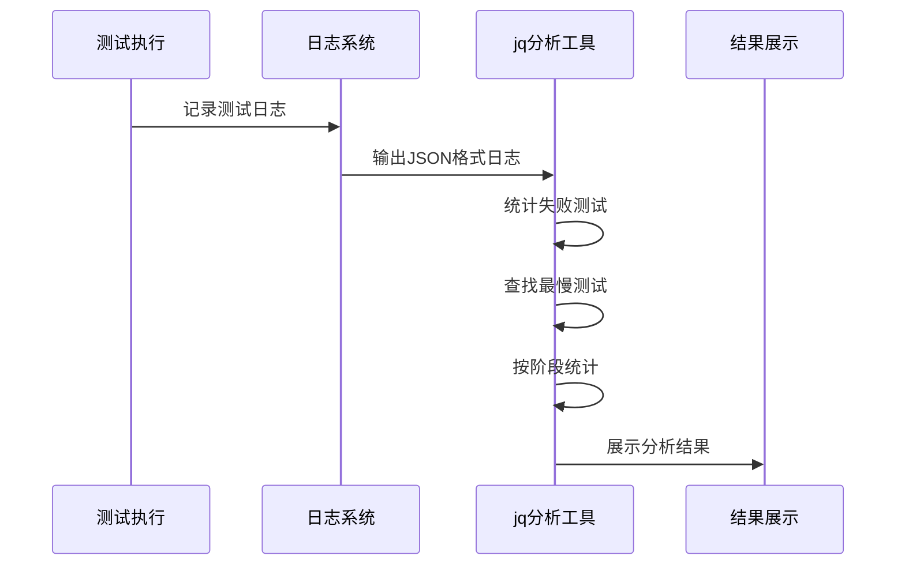

**图表来源**
- [测试可观测性:120-130](file://altas-workflow/references/testing/test-observability.md#L120-L130)

**章节来源**
- [测试可观测性:17-131](file://altas-workflow/references/testing/test-observability.md#L17-L131)

### OpenTelemetry 追踪系统深入分析

#### 追踪配置架构
系统实现了完整的 OpenTelemetry 集成，支持多维度的追踪数据收集：

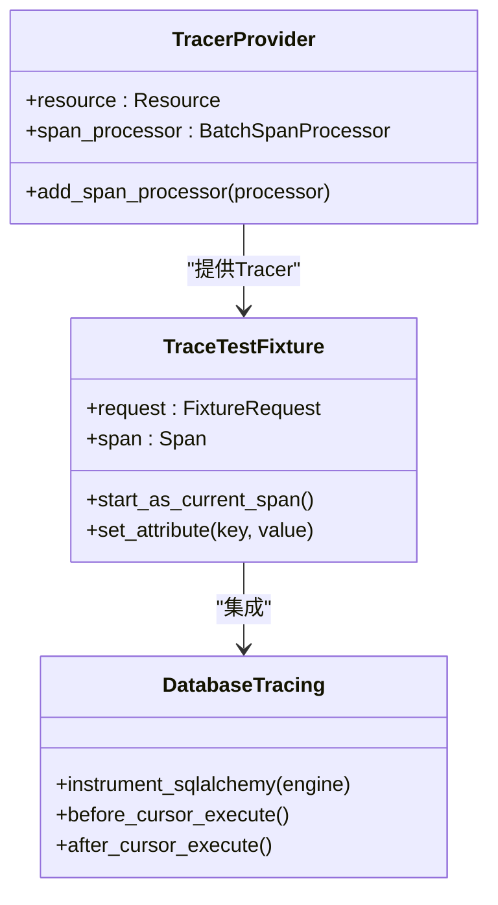

**图表来源**
- [测试可观测性:138-180](file://altas-workflow/references/testing/test-observability.md#L138-L180)
- [测试可观测性:223-243](file://altas-workflow/references/testing/test-observability.md#L223-L243)

#### 追踪数据流
系统通过嵌套的 Span 结构，精确记录测试执行的完整流程：

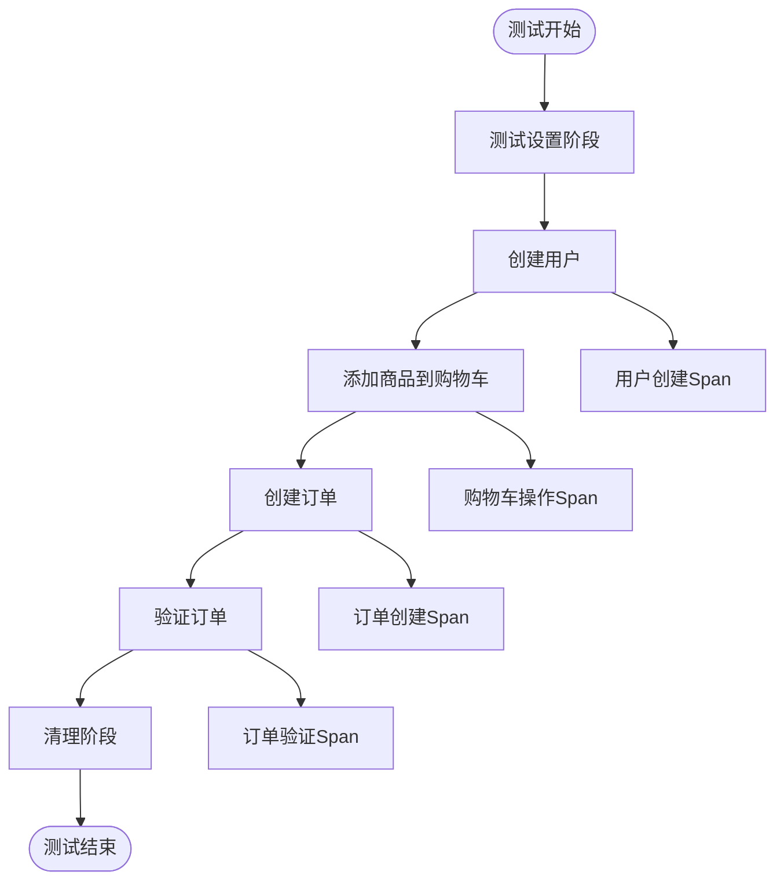

**图表来源**
- [测试可观测性:191-218](file://altas-workflow/references/testing/test-observability.md#L191-L218)

**章节来源**
- [测试可观测性:134-244](file://altas-workflow/references/testing/test-observability.md#L134-L244)

### 测试指标收集系统分析

#### 指标定义和收集
系统实现了多维度的指标收集机制，支持实时监控和历史趋势分析：

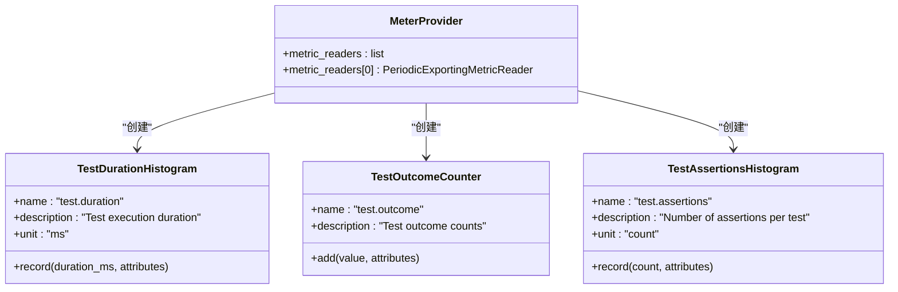

**图表来源**
- [测试可观测性:252-303](file://altas-workflow/references/testing/test-observability.md#L252-L303)

#### 覆盖率趋势追踪
系统提供了完整的覆盖率历史数据管理和趋势分析功能：

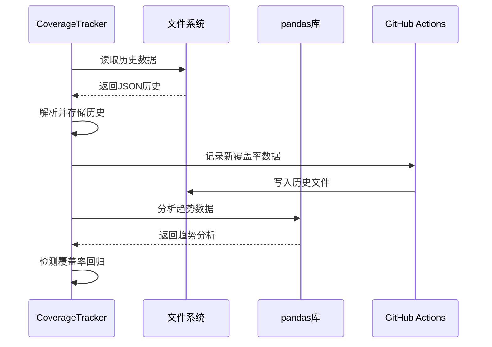

**图表来源**
- [测试可观测性:308-401](file://altas-workflow/references/testing/test-observability.md#L308-L401)

**章节来源**
- [测试可观测性:247-401](file://altas-workflow/references/testing/test-observability.md#L247-L401)

### 测试报告生成系统分析

#### 报告插件架构
系统实现了可扩展的报告生成机制，支持多种输出格式：

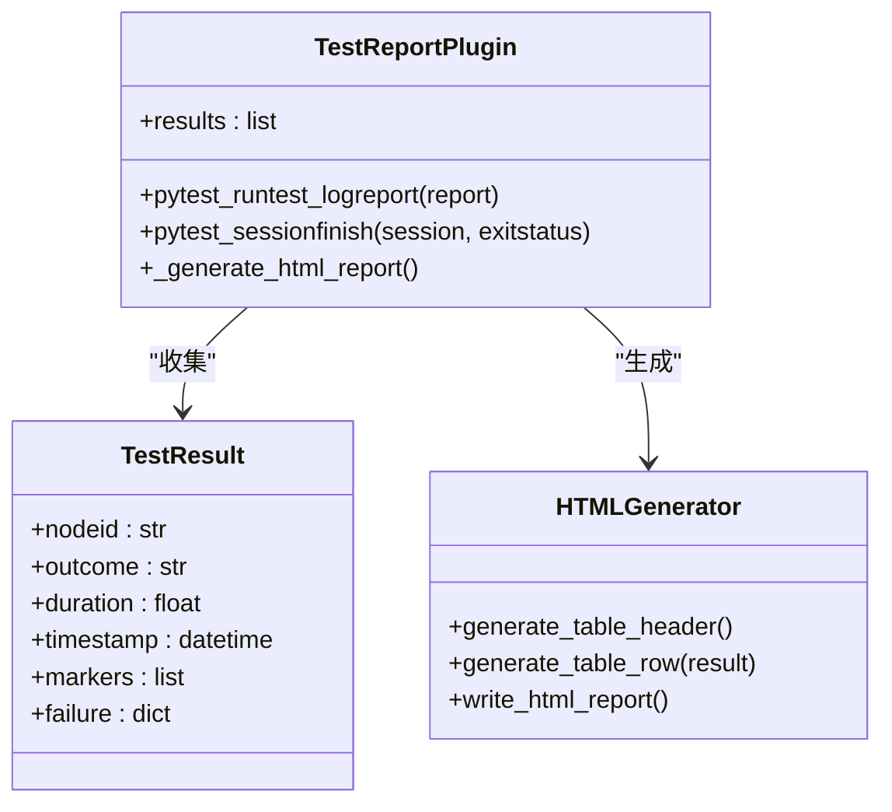

**图表来源**
- [测试可观测性:416-510](file://altas-workflow/references/testing/test-observability.md#L416-L510)

#### 失败分析和分类
系统提供了智能的测试失败分析和自动分类功能：

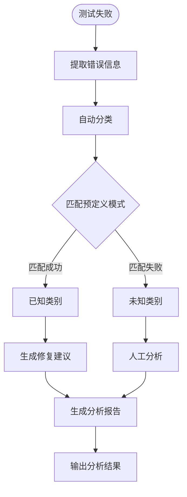

**图表来源**
- [测试可观测性:518-610](file://altas-workflow/references/testing/test-observability.md#L518-L610)

**章节来源**
- [测试可观测性:405-657](file://altas-workflow/references/testing/test-observability.md#L405-L657)

## 依赖关系分析

测试可观察性系统依赖于多个开源库和框架，形成了完整的技术栈：

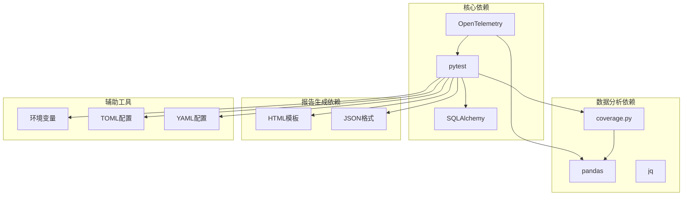

**图表来源**
- [测试可观测性:735-737](file://altas-workflow/references/testing/test-observability.md#L735-L737)
- [测试质量度量体系:756-800](file://altas-workflow/references/testing/test-quality-metrics.md#L756-L800)

### 外部依赖分析

系统的主要外部依赖包括：

| 依赖库 | 版本要求 | 用途 | 关键特性 |
|--------|----------|------|----------|
| OpenTelemetry | >= 1.0 | 分布式追踪 | 跨组件追踪、指标导出 |
| pytest | >= 7.0 | 测试框架 | Fixture、插件系统 |
| SQLAlchemy | >= 1.4 | ORM框架 | 数据库操作、事件监听 |
| pandas | >= 1.0 | 数据分析 | 时间序列分析、数据处理 |
| coverage.py | >= 6.0 | 覆盖率分析 | 代码覆盖率、XML报告 |

**章节来源**
- [测试可观测性:735-737](file://altas-workflow/references/testing/test-observability.md#L735-L737)
- [测试质量度量体系:756-800](file://altas-workflow/references/testing/test-quality-metrics.md#L756-L800)

## 性能考虑

测试可观察性系统的性能优化主要体现在以下几个方面：

### 日志性能优化
- **异步日志写入**：使用批量处理器减少磁盘 I/O 操作
- **结构化格式**：JSON 格式便于机器解析，减少处理开销
- **条件日志记录**：根据日志级别动态决定记录内容

### 追踪性能优化
- **批量导出**：使用 BatchSpanProcessor 减少网络请求频率
- **采样策略**：对高频操作实施采样，避免过度追踪
- **延迟初始化**：仅在需要时创建追踪器实例

### 指标收集优化
- **周期性导出**：定期批量导出指标数据
- **内存缓存**：在内存中缓存近期指标，减少磁盘操作
- **压缩传输**：对导出数据进行压缩以减少网络带宽

### 报告生成优化
- **增量更新**：仅更新发生变化的数据
- **并行处理**：利用多核 CPU 并行处理大量数据
- **内存映射**：对于大型报告使用内存映射文件

## 故障排查指南

### 常见问题诊断

#### 日志系统问题
- **日志丢失**：检查文件权限和磁盘空间
- **日志格式错误**：验证 JSON 序列化过程
- **日志级别配置**：确认日志级别设置是否正确

#### 追踪系统问题
- **追踪数据缺失**：检查 TracerProvider 配置
- **Span 嵌套错误**：验证嵌套结构的正确性
- **导出失败**：检查 OTLP 端点连接状态

#### 指标收集问题
- **指标不更新**：确认指标收集器的生命周期
- **数据精度问题**：检查时间戳和单位转换
- **导出配置错误**：验证 MetricReader 配置

#### 报告生成问题
- **报告格式错误**：检查模板渲染过程
- **数据完整性**：验证测试结果收集的完整性
- **文件权限**：确认报告文件的写入权限

### 调试工具和技巧

#### 日志分析工具
- **jq 命令行工具**：用于快速分析 JSON 格式日志
- **grep 过滤**：按关键字快速筛选日志内容
- **tail -f 实时查看**：监控实时日志输出

#### 追踪数据验证
- **Span 关系验证**：检查嵌套结构的正确性
- **属性完整性**：确认关键属性的完整性
- **时间戳一致性**：验证时间戳的逻辑顺序

#### 性能监控
- **执行时间分析**：使用 `--durations` 参数分析慢测试
- **内存使用监控**：检查内存泄漏和过度占用
- **并发性能测试**：验证多线程环境下的稳定性

**章节来源**
- [测试可观测性:514-657](file://altas-workflow/references/testing/test-observability.md#L514-L657)

## 结论

测试可观察性指南为现代软件测试工程提供了完整的解决方案。通过系统化的日志记录、分布式追踪、指标收集和报告生成，开发者可以获得对测试过程的全面洞察。

该指南的核心优势包括：

1. **全面性**：涵盖了测试可观察性的各个方面，从基础日志到高级分析
2. **实用性**：提供了可直接应用的具体实现和最佳实践
3. **可扩展性**：支持与其他工具和系统的集成
4. **自动化**：减少了手动操作，提高了效率
5. **可维护性**：代码结构清晰，易于维护和扩展

通过实施这些实践，团队可以显著提升测试效率，加快问题定位速度，并建立可持续的质量保障体系。

## 附录

### 快速开始指南

#### 基础配置步骤
1. **安装依赖**：安装 OpenTelemetry、pytest、SQLAlchemy 等核心依赖
2. **配置日志系统**：设置结构化日志格式和输出目标
3. **启用追踪**：配置 OpenTelemetry 追踪器和导出器
4. **设置指标收集**：定义和配置各类测试指标
5. **配置报告生成**：设置报告插件和输出格式

#### 最佳实践清单

##### 日志记录
- [ ] 使用结构化日志格式
- [ ] 为每个测试步骤添加日志
- [ ] 包含关键上下文信息
- [ ] 设置适当的日志级别

##### 追踪配置
- [ ] 为关键操作创建独立的 Span
- [ ] 设置有意义的属性和标签
- [ ] 实现嵌套的追踪结构
- [ ] 集成数据库查询追踪

##### 指标收集
- [ ] 定义关键性能指标
- [ ] 设置合理的阈值和告警
- [ ] 实现趋势分析功能
- [ ] 集成覆盖率监控

##### 报告生成
- [ ] 生成多种格式的报告
- [ ] 包含详细的失败分析
- [ ] 提供可视化图表
- [ ] 支持自动化集成

### 参考资源

#### 相关文档
- [pytest 官方文档](https://docs.pytest.org/)
- [OpenTelemetry 官方文档](https://opentelemetry.io/docs/)
- [SQLAlchemy 官方文档](https://docs.sqlalchemy.org/)
- [pandas 官方文档](https://pandas.pydata.org/docs/)

#### 社区资源
- [pytest 插件生态](https://plugins.pypi.org/)
- [OpenTelemetry 生态系统](https://opentelemetry.io/ecosystem/)
- [测试工具推荐](https://github.com/topics/testing)