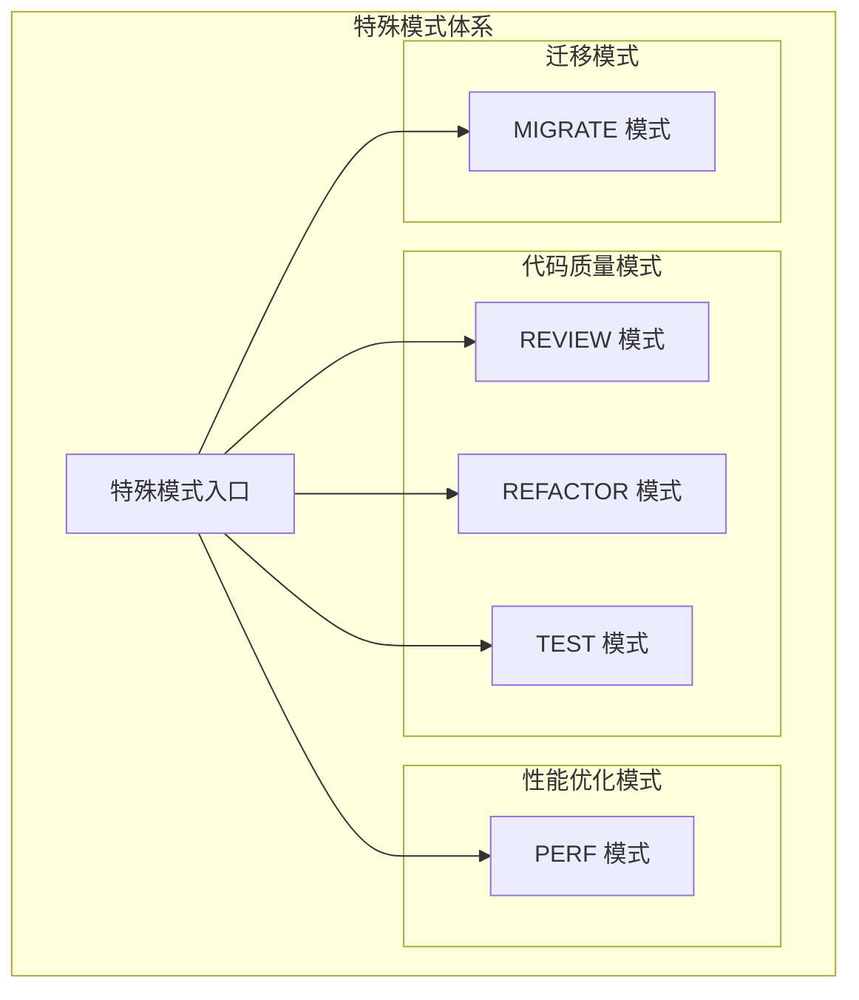
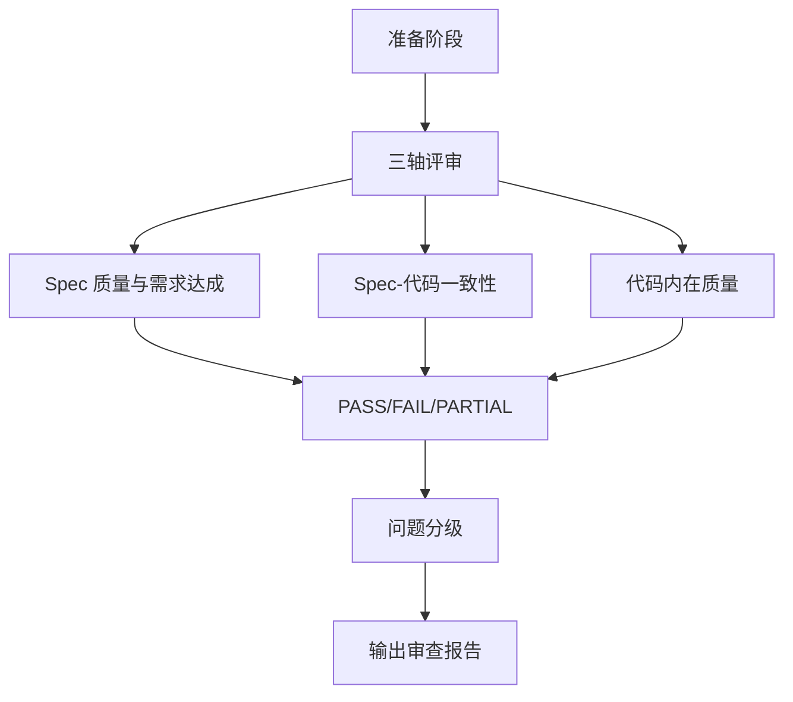
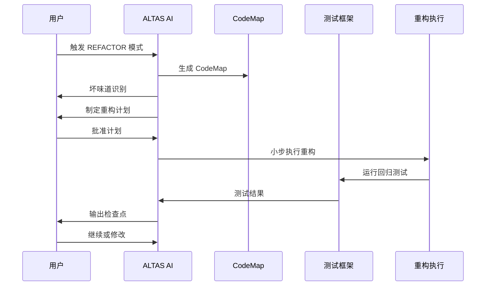
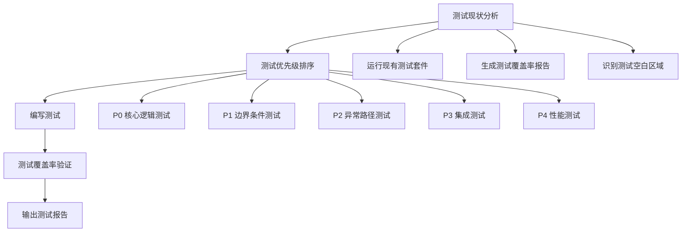
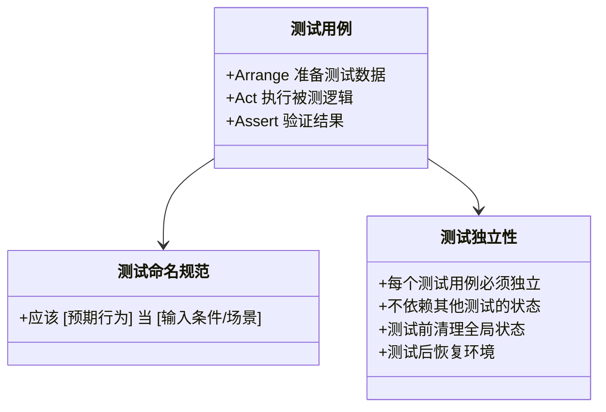
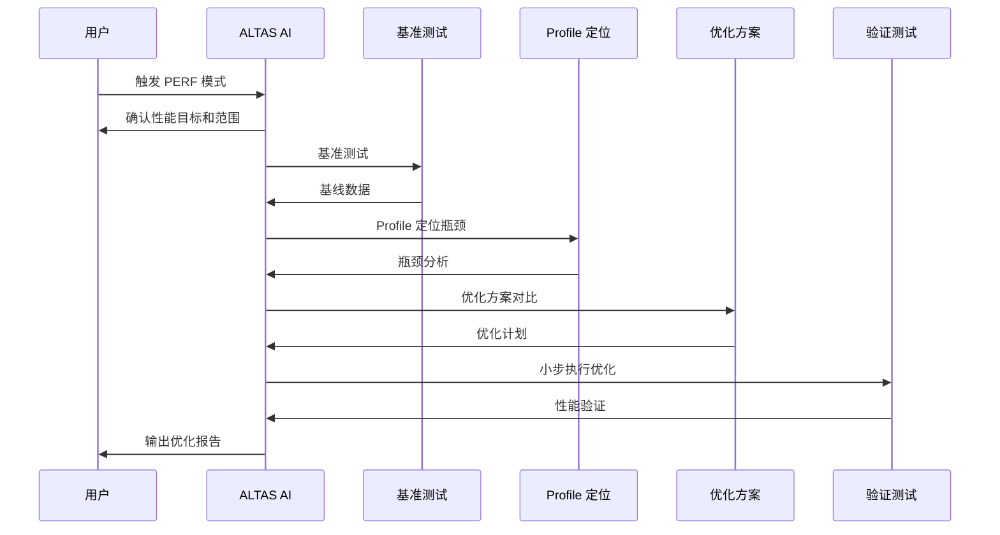
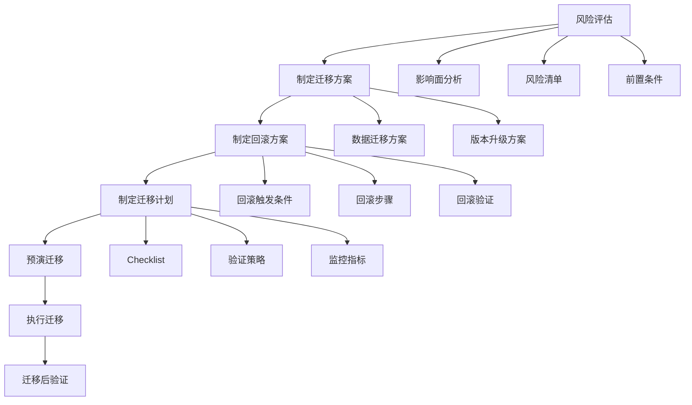
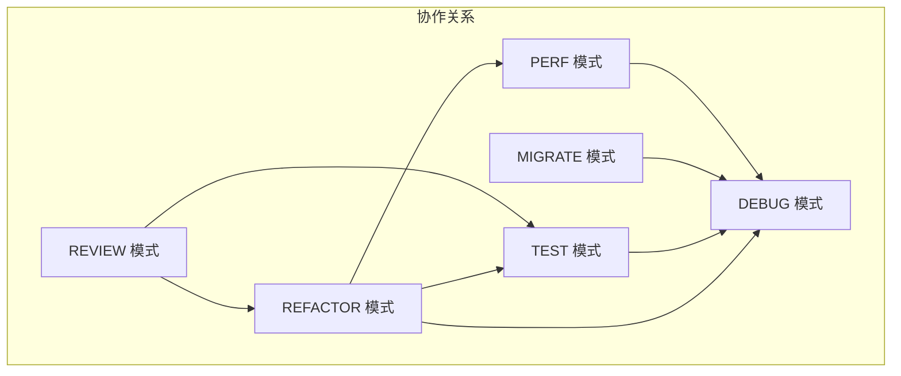
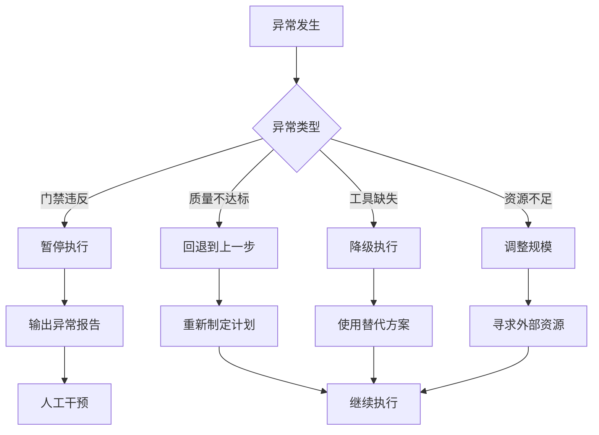

# 特殊模式章节

<cite>
**本文档引用的文件**
- [SKILL.md](file://altas-workflow/SKILL.md)
- [reference-index.md](file://altas-workflow/reference-index.md)
- [review.md](file://altas-workflow/references/special-modes/review.md)
- [refactor.md](file://altas-workflow/references/special-modes/refactor.md)
- [test.md](file://altas-workflow/references/special-modes/test.md)
- [perf.md](file://altas-workflow/references/special-modes/perf.md)
- [migrate.md](file://altas-workflow/references/special-modes/migrate.md)
- [modules.md](file://altas-workflow/references/checkpoint-driven/modules.md)
- [requesting-code-review/SKILL.md](file://altas-workflow/references/superpowers/requesting-code-review/SKILL.md)
- [receiving-code-review/SKILL.md](file://altas-workflow/references/superpowers/receiving-code-review/SKILL.md)
</cite>

## 更新摘要
**所做更改**
- 新增了 REVIEW 模式的完整协议和操作指南
- 扩展了特殊模式章节的详细内容，涵盖五个专项模式的完整工作流程
- 更新了模式间的协作关系说明
- 增强了工具映射和参考文档的完整性
- 完善了特殊模式的组织结构和按需加载机制

## 目录
1. [简介](#简介)
2. [特殊模式概览](#特殊模式概览)
3. [REVIEW 模式](#review-模式)
4. [REFACTOR 模式](#refactor-模式)
5. [TEST 模式](#test-模式)
6. [PERF 模式](#perf-模式)
7. [MIGRATE 模式](#migrate-模式)
8. [模式间的协作关系](#模式间的协作关系)
9. [最佳实践指南](#最佳实践指南)
10. [故障排除](#故障排除)

## 简介

ALTAS Workflow 的特殊模式章节提供了针对特定场景的专业化工作流程，涵盖了代码审查、重构、测试、性能优化和数据迁移等专业领域。这些模式基于 ALTAS 的核心原则，结合了 Spec-Driven Development、Checkpoint-Driven 和 Superpowers 的精华，为复杂的工程任务提供了标准化的解决方案。

**更新**：在 SKILL.md 4.5 版本中，特殊模式的实现已从入口文件中分离，采用按需加载的参考文件结构。入口文件只保留高杠杆约束，具体实现细节转移到专门的参考文件中。新增的 REVIEW 模式为代码审查提供了完整的三轴评审框架。

## 特殊模式概览

特殊模式是 ALTAS Workflow 的重要组成部分，它们为特定类型的工程任务提供了专门的工作流程和指导原则。每个模式都有其独特的触发词、适用场景和执行流程。

**图表来源**
- [SKILL.md:81-100](file://altas-workflow/SKILL.md#L81-L100)

**章节来源**
- [SKILL.md:81-100](file://altas-workflow/SKILL.md#L81-L100)
- [reference-index.md:107-147](file://altas-workflow/reference-index.md#L107-L147)

## REVIEW 模式

REVIEW 模式专注于代码审查和质量评估，提供了标准化的三轴评审框架，确保代码变更的质量和一致性。

### 触发条件和适用场景

- **触发词**: `REVIEW`、`代码审查`、`审查 PR`
- **适用场景**: Pull Request 审查、代码变更评估、第三方代码质量评估
- **注意**: 完整开发流程的最后阶段使用标准工作流的 Review 阶段

### 三轴评审框架

REVIEW 模式采用三轴评审标准，确保全面的质量评估：

**图表来源**
- [review.md:37-90](file://altas-workflow/references/special-modes/review.md#L37-L90)

### 评审标准

| 轴 | 检查项 | PASS 判定 | FAIL 判定 | PARTIAL 判定 |
|----|--------|-----------|-----------|-------------|
| Spec 质量与需求达成 | Goal/In-Scope/Acceptance 是否完整；需求是否达成 | Goal 明确可验证，In-Scope 边界清晰，所有 Acceptance Criteria 有对应测试通过 | Goal 模糊或缺失验收标准；核心需求未实现；Out-of-Scope 项被误实现 | 非核心 Acceptance 缺测试覆盖；Goal 描述可进一步精确化 |
| Spec-代码一致性 | 文件、签名、Checklist、行为是否与 Plan 一致 | 所有 Plan 中的文件变更、函数签名、Checklist 项均有对应代码且行为匹配 | 计划外的文件被修改；签名与 Plan 不符；Checklist 项遗漏或多余 | 注释/日志等非关键差异；次要文件路径调整未回写 Plan |
| 代码内在质量 | 正确性、鲁棒性、可维护性、测试、关键风险 | 核心逻辑有测试覆盖；无已知 bug 或安全漏洞；错误处理完备 | 存在未处理的异常路径；安全漏洞；关键逻辑无测试 | 代码风格不统一（不影响正确性）；性能非瓶颈处可优化 |

### 问题分级

| 级别 | 定义 | 示例 |
|------|------|------|
| **P0 - 阻塞** | 必须修复，否则不能合并 | 安全漏洞、核心逻辑错误、数据不一致 |
| **P1 - 高优** | 强烈建议修复 | 未处理的异常路径、关键逻辑无测试、性能瓶颈 |
| **P2 - 建议** | 可择机优化 | 代码风格不统一、注释缺失、可读性差 |
| **P3 - 可选** | 锦上添花 | 命名不够精确、小的重构机会 |

**章节来源**
- [review.md:1-137](file://altas-workflow/references/special-modes/review.md#L1-L137)

## REFACTOR 模式

REFACTOR 模式专注于代码重构，提供系统化的重构流程，确保在不改变外部行为的前提下改善代码质量。

### 触发条件和适用场景

- **触发词**: `REFACTOR`、`重构`
- **适用场景**: 改进代码结构、消除技术债务、为新功能铺路、优化代码可读性
- **默认规模**: M/L（重构涉及理解现有代码 + 小步验证）

### 重构流程

**图表来源**
- [refactor.md:33-91](file://altas-workflow/references/special-modes/refactor.md#L33-L91)

### 重构策略

| 坏味道 | 描述 | 重构策略 |
|--------|------|----------|
| **重复代码** | 相同/相似代码出现在多处 | 提取函数/提取公共模块 |
| **过长函数** | 函数超过 50 行 | 提取函数/分解为多个小函数 |
| **过大类** | 类超过 500 行或职责过多 | 拆分类/提取职责 |
| **过长参数列表** | 函数参数超过 5 个 | 引入参数对象/使用配置对象 |
| **过度耦合** | 模块间依赖复杂 | 引入接口/依赖注入 |
| **命名不清晰** | 变量/函数名不能表达意图 | 重命名 |
| **条件复杂** | 嵌套 if/switch 超过 3 层 | 提取条件函数/使用策略模式 |
| **数据簇** | 多个数据总是一起出现 | 封装为数据结构/类 |

### 重构铁律

- **每步重构后必须验证行为不变**
- **不允许在重构中混入新功能开发**
- **若发现必须改动行为 → 暂停，回到 Plan 重新对齐**
- **每步改动 < 50 行**

**章节来源**
- [refactor.md:1-181](file://altas-workflow/references/special-modes/refactor.md#L1-L181)

## TEST 模式

TEST 模式专注于测试专项工作，提供系统化的测试补充和质量保证流程。

### 触发条件和适用场景

- **触发词**: `TEST`、`写测试`、`补测试`
- **适用场景**: 为现有代码补充测试、提高测试覆盖率、修复失败测试、生成测试报告
- **注意**: 新功能/新 Bug 修复使用标准工作流的 Execute(TDD) 阶段

### 测试流程

**图表来源**
- [test.md:34-100](file://altas-workflow/references/special-modes/test.md#L34-L100)

### 测试优先级

| 优先级 | 测试类型 | 说明 |
|--------|----------|------|
| **P0** | 核心逻辑测试 | 业务核心功能，必须覆盖 |
| **P1** | 边界条件测试 | 极值/空值/非法输入 |
| **P2** | 异常路径测试 | 错误处理/降级逻辑 |
| **P3** | 集成测试 | 跨模块/跨系统交互 |
| **P4** | 性能测试 | 响应时间/吞吐量/资源消耗 |

### 测试最佳实践

**图表来源**
- [test.md:173-202](file://altas-workflow/references/special-modes/test.md#L173-L202)

**章节来源**
- [test.md:1-210](file://altas-workflow/references/special-modes/test.md#L1-L210)

## PERF 模式

PERF 模式专注于性能优化，提供系统化的性能分析和优化流程。

### 触发条件和适用场景

- **触发词**: `PERF`、`性能优化`
- **适用场景**: 优化代码性能、排查性能瓶颈、性能基准测试、容量规划建议
- **默认规模**: L（性能优化需要基准测试→定位→优化→验证的完整闭环）

### 性能优化流程

**图表来源**
- [perf.md:33-151](file://altas-workflow/references/special-modes/perf.md#L33-L151)

### 性能优化策略

| 瓶颈类型 | 优化策略 |
|----------|----------|
| **CPU 密集型** | 算法优化、缓存结果、并行计算、WebAssembly |
| **I/O 密集型** | 批量请求、连接池、缓存、异步化 |
| **内存密集型** | 对象复用、流式处理、数据结构优化 |
| **锁竞争** | 无锁数据结构、细粒度锁、读写锁 |

### 性能验证

- **每次只应用一个优化**（防止多个优化互相干扰）
- **每个优化必须有可量化的性能提升**
- **不允许以牺牲正确性为代价换取性能**

**章节来源**
- [perf.md:1-234](file://altas-workflow/references/special-modes/perf.md#L1-L234)

## MIGRATE 模式

MIGRATE 模式专注于数据和版本迁移，提供高风险操作的标准化流程。

### 触发条件和适用场景

- **触发词**: `MIGRATE`、`迁移`、`数据迁移`、`版本升级`
- **适用场景**: 数据迁移、依赖版本升级、API 迁移、基础设施迁移
- **默认规模**: L（高风险操作，必须有完整计划和回滚方案）

### 迁移流程

**图表来源**
- [migrate.md:36-228](file://altas-workflow/references/special-modes/migrate.md#L36-L228)

### 迁移类型

#### 数据迁移方案

| 方案 | 适用场景 | 优点 | 缺点 |
|------|----------|------|------|
| **一次性迁移** | 小数据量、允许停机 | 简单快速 | 停机时间长、风险集中 |
| **渐进式迁移** | 大数据量、不能停机 | 风险分散 | 复杂度高、需要双写 |
| **蓝绿迁移** | 关键业务、零容忍停机 | 可快速回滚 | 资源成本高 |

#### 版本升级方案

| 方案 | 适用场景 | 优点 | 缺点 |
|------|----------|------|------|
| **直接升级** | Breaking Changes 少 | 简单快速 | 风险集中 |
| **渐进升级** | Breaking Changes 多 | 风险分散 | 需要兼容多版本 |
| **并行运行** | 关键系统 | 可快速回滚 | 资源成本高 |

### 回滚策略

**回滚触发条件**:
- 错误率 > X%
- 性能下降 > Y%
- 数据不一致 > Z 条
- 核心功能不可用

**章节来源**
- [migrate.md:1-306](file://altas-workflow/references/special-modes/migrate.md#L1-L306)

## 模式间的协作关系

特殊模式之间存在紧密的协作关系，形成了完整的工程质量保障体系。

**图表来源**
- [review.md:104-109](file://altas-workflow/references/special-modes/review.md#L104-L109)
- [refactor.md:148-153](file://altas-workflow/references/special-modes/refactor.md#L148-L153)
- [test.md:146-151](file://altas-workflow/references/special-modes/test.md#L146-L151)
- [perf.md:198-203](file://altas-workflow/references/special-modes/perf.md#L198-L203)
- [migrate.md:244-249](file://altas-workflow/references/special-modes/migrate.md#L244-L249)

### 协作场景示例

1. **REVIEW → REFACTOR**: 审查发现重构机会，用户确认后进入 REFACTOR 模式
2. **REFACTOR → TEST**: 重构后发现测试覆盖不足，进入 TEST 模式补测试
3. **PERF → DEBUG**: 优化后出现异常行为，进入 DEBUG 模式排查
4. **MIGRATE → DEBUG**: 迁移后出现异常，进入 DEBUG 模式排查

**章节来源**
- [review.md:104-137](file://altas-workflow/references/special-modes/review.md#L104-L137)
- [refactor.md:148-181](file://altas-workflow/references/special-modes/refactor.md#L148-L181)
- [test.md:146-210](file://altas-workflow/references/special-modes/test.md#L146-L210)
- [perf.md:198-234](file://altas-workflow/references/special-modes/perf.md#L198-L234)
- [migrate.md:244-306](file://altas-workflow/references/special-modes/migrate.md#L244-L306)

## 最佳实践指南

### 模式选择策略

1. **根据任务性质选择模式**
   - 代码审查 → REVIEW 模式
   - 代码重构 → REFACTOR 模式
   - 测试补充 → TEST 模式
   - 性能优化 → PERF 模式
   - 数据迁移 → MIGRATE 模式

2. **考虑复杂度和风险**
   - 简单任务使用相应模式的 Lite 版本
   - 复杂任务使用完整流程
   - 高风险操作必须有回滚方案

3. **遵循门禁逻辑**
   - 所有模式都有相应的门禁条件
   - 严格遵守各模式的铁律
   - 保持质量标准不降低

### 实施建议

1. **充分准备**
   - 明确目标和范围
   - 识别潜在风险
   - 准备必要的工具和环境

2. **小步快跑**
   - 每个步骤都要可验证
   - 及时获取反馈
   - 快速调整方向

3. **文档记录**
   - 详细记录决策过程
   - 保存重要的中间结果
   - 建立知识沉淀

## 故障排除

### 常见问题和解决方案

#### 模式触发失败

**问题**: 模式无法正常触发
**解决方案**:
- 确认使用正确的触发词
- 检查任务描述是否足够清晰
- 确认当前上下文中没有活跃任务

#### 流程执行异常

**问题**: 模式执行过程中出现问题
**解决方案**:
- 检查门禁条件是否满足
- 遵循相应的铁律约束
- 必要时暂停并寻求人工干预

#### 质量标准不达标

**问题**: 审查或验证结果不理想
**解决方案**:
- 回到上一步重新执行
- 调整策略或方案
- 寻求其他模式的协助

### 异常处理流程

**章节来源**
- [SKILL.md:253-259](file://altas-workflow/SKILL.md#L253-L259)
- [reference-index.md:107-147](file://altas-workflow/reference-index.md#L107-L147)