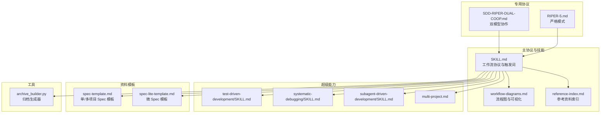
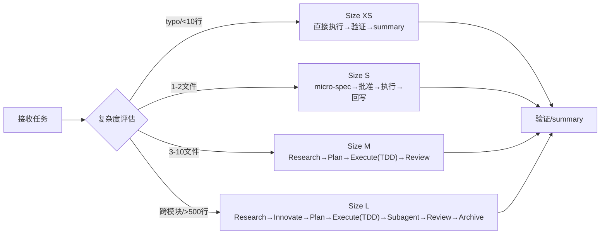
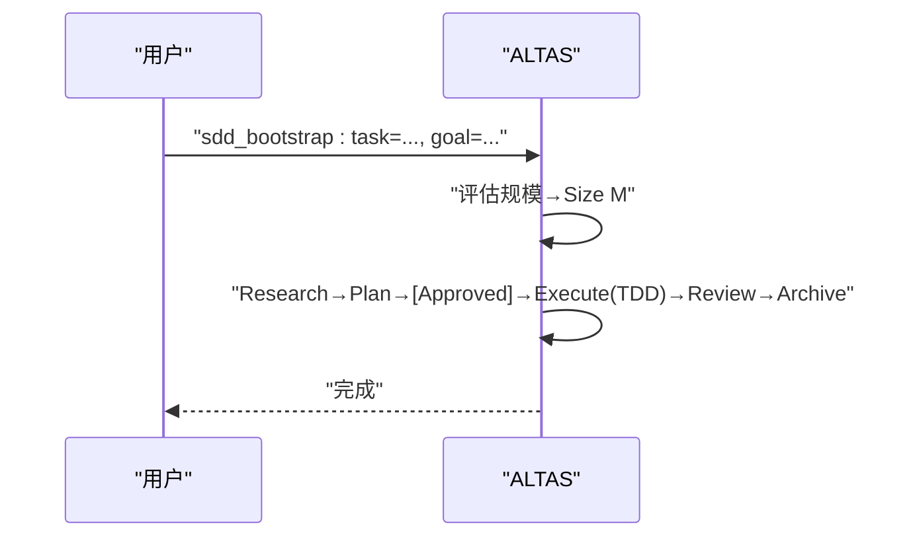
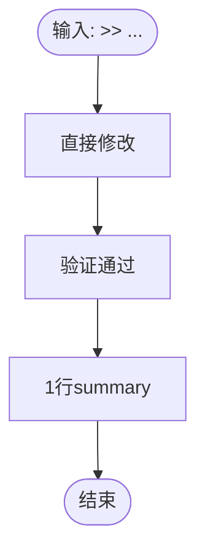
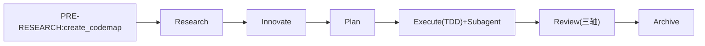
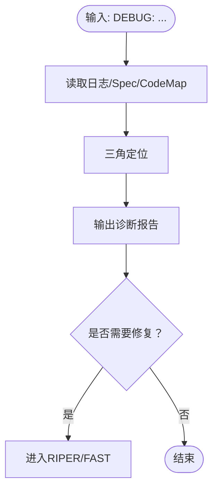
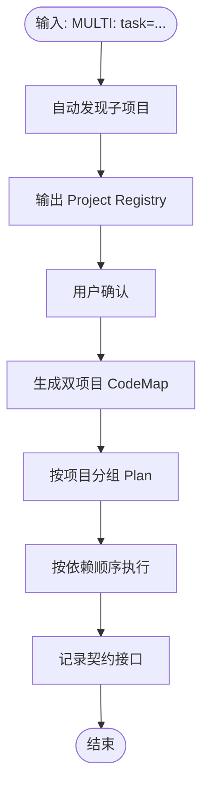
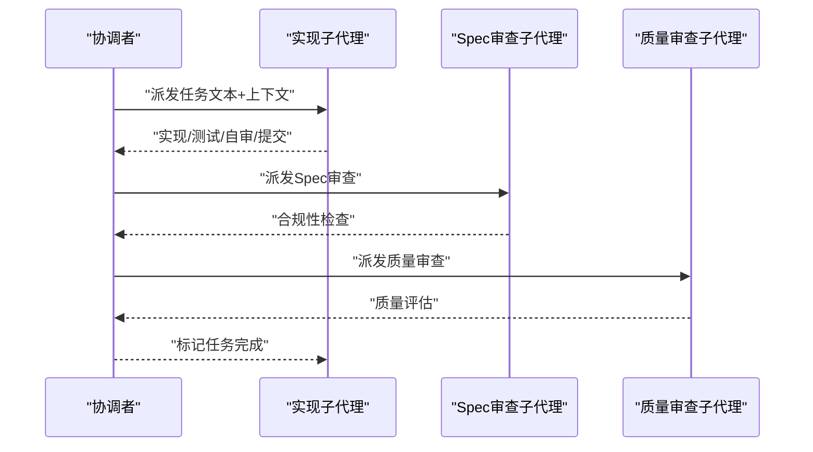
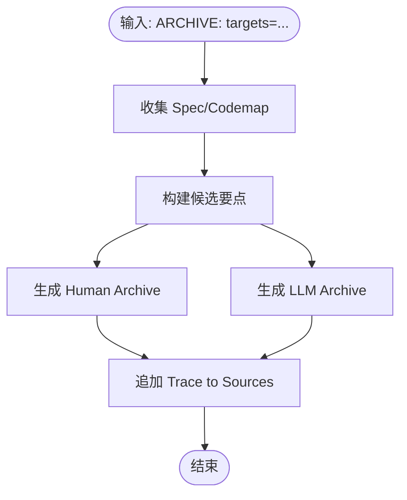
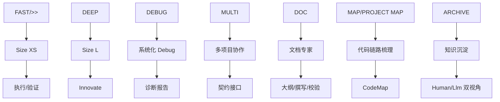

# 示例和最佳实践

<cite>
**本文引用的文件**
- [README.md](file://README.md)
- [QUICKSTART.md](file://altas-workflow/QUICKSTART.md)
- [SKILL.md](file://altas-workflow/SKILL.md)
- [reference-index.md](file://altas-workflow/reference-index.md)
- [workflow-diagrams.md](file://altas-workflow/workflow-diagrams.md)
- [spec-template.md](file://altas-workflow/references/spec-driven-development/spec-template.md)
- [spec-lite-template.md](file://altas-workflow/references/checkpoint-driven/spec-lite-template.md)
- [systematic-debugging/SKILL.md](file://altas-workflow/references/superpowers/systematic-debugging/SKILL.md)
- [test-driven-development/SKILL.md](file://altas-workflow/references/superpowers/test-driven-development/SKILL.md)
- [archive_builder.py](file://altas-workflow/scripts/archive_builder.py)
- [multi-project.md](file://altas-workflow/references/spec-driven-development/multi-project.md)
- [subagent-driven-development/SKILL.md](file://altas-workflow/references/superpowers/subagent-driven-development/SKILL.md)
- [RIPER-5.md](file://altas-workflow/protocols/RIPER-5.md)
- [SDD-RIPER-DUAL-COOP.md](file://altas-workflow/protocols/SDD-RIPER-DUAL-COOP.md)
</cite>

## 目录
1. [简介](#简介)
2. [项目结构](#项目结构)
3. [核心组件](#核心组件)
4. [架构总览](#架构总览)
5. [详细组件分析](#详细组件分析)
6. [依赖分析](#依赖分析)
7. [性能考虑](#性能考虑)
8. [故障排查指南](#故障排查指南)
9. [结论](#结论)
10. [附录](#附录)

## 简介
本文件面向 ALTAS Workflow 的使用者，提供从新手到高级用户的系统化示例与最佳实践，涵盖日常功能迭代（Size M）、紧急修复线上配置（Size XS）、架构重构（Size L）、Bug 排查与多项目协作的完整案例流程，并结合规模评估与执行模式选择，帮助团队在不同复杂度的任务中稳定交付高质量成果。

## 项目结构
ALTAS Workflow 以“协议 + 资料 + 工具”的方式组织，核心包括：
- 主协议与技能：SKILL.md 定义工作流、触发词、铁律、进度检查点与阶段门禁
- 参考资料索引：reference-index.md 提供按需加载的文件清单与调用时机
- 专用协议：RIPER-5、RIPER-DOC、SDD-RIPER-DUAL-COOP 等
- 超级能力：TDD、系统化 Debug、Subagent 驱动、并行 Agent 等
- 自动化工具：archive_builder.py 用于知识沉淀归档

图表来源
- [SKILL.md:1-351](file://altas-workflow/SKILL.md#L1-L351)
- [reference-index.md:1-210](file://altas-workflow/reference-index.md#L1-L210)
- [workflow-diagrams.md:1-338](file://altas-workflow/workflow-diagrams.md#L1-L338)
- [spec-template.md:1-297](file://altas-workflow/references/spec-driven-development/spec-template.md#L1-L297)
- [spec-lite-template.md:1-85](file://altas-workflow/references/checkpoint-driven/spec-lite-template.md#L1-L85)
- [systematic-debugging/SKILL.md:1-297](file://altas-workflow/references/superpowers/systematic-debugging/SKILL.md#L1-L297)
- [test-driven-development/SKILL.md:1-372](file://altas-workflow/references/superpowers/test-driven-development/SKILL.md#L1-L372)
- [archive_builder.py:1-505](file://altas-workflow/scripts/archive_builder.py#L1-L505)
- [multi-project.md:1-57](file://altas-workflow/references/spec-driven-development/multi-project.md#L1-L57)
- [subagent-driven-development/SKILL.md:1-278](file://altas-workflow/references/superpowers/subagent-driven-development/SKILL.md#L1-L278)
- [RIPER-5.md:1-187](file://altas-workflow/protocols/RIPER-5.md#L1-L187)
- [SDD-RIPER-DUAL-COOP.md:1-210](file://altas-workflow/protocols/SDD-RIPER-DUAL-COOP.md#L1-L210)

章节来源
- [README.md:46-82](file://README.md#L46-L82)
- [reference-index.md:1-210](file://altas-workflow/reference-index.md#L1-L210)

## 核心组件
- 触发词与模式：FAST/DEEP/DEBUG/MULTI/DOC/MAP/ARCHIVE 等，覆盖 XS/S/M/L 的不同深度与特殊场景
- 铁律与门禁：No Spec, No Code；No Approval, No Execute；Spec is Truth；Reverse Sync；Evidence First；No Root Cause, No Fix；TDD Iron Law；Resume Ready
- 规模评估：XS（typo/配置值）、S（1-2 文件）、M（模块内）、L（跨模块/架构级）
- 阶段流程：PRE-RESEARCH → RESEARCH → INNOVATE（L）→ PLAN → EXECUTE（TDD/Subagent）→ REVIEW（三轴）→ ARCHIVE（可选）

章节来源
- [SKILL.md:45-102](file://altas-workflow/SKILL.md#L45-L102)
- [SKILL.md:138-275](file://altas-workflow/SKILL.md#L138-L275)
- [README.md:237-266](file://README.md#L237-L266)

## 架构总览
下图展示 ALTAS 的整体工作流：根据任务复杂度自动评估规模，进入相应深度的工作流，贯穿 Spec、Plan、Execute、Review、Archive 的闭环。

图表来源
- [workflow-diagrams.md:7-41](file://altas-workflow/workflow-diagrams.md#L7-L41)
- [README.md:237-266](file://README.md#L237-L266)

## 详细组件分析

### 组件 A：日常功能迭代（Size M）
- 典型场景：新增接口、模块重构、引入依赖等
- 流程要点：
  - Research：收集现状、明确事实与风险
  - Plan：拆解为原子 Checklist，定义文件变更与签名
  - Execute：TDD 循环（RED→GREEN→REFACTOR），逐步或批量执行
  - Review：三轴评审（Spec 质量/一致性/代码质量）
  - Archive：可选，沉淀双视角文档
- 输出产物：Spec、代码改动、测试、可选 Archive

图表来源
- [README.md:421-439](file://README.md#L421-L439)
- [SKILL.md:176-193](file://altas-workflow/SKILL.md#L176-L193)

章节来源
- [README.md:421-439](file://README.md#L421-L439)
- [SKILL.md:176-193](file://altas-workflow/SKILL.md#L176-L193)

### 组件 B：紧急修复线上配置（Size XS）
- 典型场景：typo、配置值、日志等小于 10 行的改动
- 流程要点：
  - 直接执行→验证→事后 1 行 summary
  - 无需 Spec，但需确保验证通过
- 输出产物：1 行 summary

图表来源
- [README.md:442-455](file://README.md#L442-L455)
- [SKILL.md:223-229](file://altas-workflow/SKILL.md#L223-L229)

章节来源
- [README.md:442-455](file://README.md#L442-L455)
- [SKILL.md:223-229](file://altas-workflow/SKILL.md#L223-L229)

### 组件 C：架构重构（Size L）
- 典型场景：跨模块重构、服务拆分、引入新架构
- 流程要点：
  - PRE-RESEARCH：create_codemap → 生成代码地图
  - Research：梳理现状链路与风险
  - Innovate：给出 2-3 种方案对比（Pros/Cons/Risks/Effort）
  - Plan：原子 Checklist + Subagent 分配
  - Execute：TDD + Subagent 并行实现 + 两阶段 Review
  - Review：三轴评审 + Archive 沉淀
- 输出产物：CodeMap、Spec、Archive（human/llm）

图表来源
- [README.md:458-478](file://README.md#L458-L478)
- [SKILL.md:159-193](file://altas-workflow/SKILL.md#L159-L193)

章节来源
- [README.md:458-478](file://README.md#L458-L478)
- [SKILL.md:159-193](file://altas-workflow/SKILL.md#L159-L193)

### 组件 D：Bug 排查（DEBUG 模式）
- 典型场景：日志分析、异常定位、根因追踪
- 流程要点：
  - 进入 DEBUG 模式（只读分析）
  - 三角定位：日志 + Spec + CodeMap
  - 输出：症状/预期行为/根因候选/建议修复
  - 如需修复：进入 RIPER 或 FAST
- 输出产物：结构化诊断报告

图表来源
- [README.md:481-496](file://README.md#L481-L496)
- [systematic-debugging/SKILL.md:46-120](file://altas-workflow/references/superpowers/systematic-debugging/SKILL.md#L46-L120)

章节来源
- [README.md:481-496](file://README.md#L481-L496)
- [systematic-debugging/SKILL.md:1-297](file://altas-workflow/references/superpowers/systematic-debugging/SKILL.md#L1-L297)

### 组件 E：多项目协作（MULTI 模式）
- 典型场景：前后端联动、跨子项目接口契约
- 流程要点：
  - 自动发现子项目（package.json/pom.xml/go.mod 等）
  - 生成双项目 CodeMap
  - Plan 按项目分组：Provider（被调用方）→ Consumer（调用方）
  - 执行按依赖顺序，记录 Contract Interfaces
- 输出产物：Project Registry、Contract Interfaces、Touched Projects

图表来源
- [README.md:499-517](file://README.md#L499-L517)
- [multi-project.md:5-47](file://altas-workflow/references/spec-driven-development/multi-project.md#L5-L47)

章节来源
- [README.md:499-517](file://README.md#L499-L517)
- [multi-project.md:1-57](file://altas-workflow/references/spec-driven-development/multi-project.md#L1-L57)

### 组件 F：Subagent 并行实现（Size L）
- 典型场景：多文件、多模块、集成协调
- 流程要点：
  - 每任务派发实现子代理（Implementer）
  - 两阶段审查：Spec 合规审查 → 代码质量审查
  - 任务完成后标记完成，最终代码审查
- 输出产物：各任务实现、审查意见、最终合并

图表来源
- [subagent-driven-development/SKILL.md:40-85](file://altas-workflow/references/superpowers/subagent-driven-development/SKILL.md#L40-L85)

章节来源
- [subagent-driven-development/SKILL.md:1-278](file://altas-workflow/references/superpowers/subagent-driven-development/SKILL.md#L1-L278)

### 组件 G：知识沉淀与归档（ARCHIVE 模式）
- 典型场景：任务收尾、跨项目总结、复用知识
- 流程要点：
  - 生成双视角文档：human（汇报视角）+ llm（开发参考视角）
  - 关键结论附“Trace to Sources”
  - 自动化脚本：archive_builder.py
- 输出产物：human/llm 双版本 Archive

图表来源
- [archive_builder.py:318-443](file://altas-workflow/scripts/archive_builder.py#L318-L443)

章节来源
- [archive_builder.py:1-505](file://altas-workflow/scripts/archive_builder.py#L1-L505)

## 依赖分析
- 触发词与模式映射：FAST/DEEP/DEBUG/MULTI/DOC/MAP/ARCHIVE 等触发词映射到对应模式与阶段
- 参考资料按需加载：SKILL.md 中的“参考资料索引”明确各阶段读取文件
- 阶段间耦合：RESEARCH→PLAN→EXECUTE→REVIEW→ARCHIVE 形成闭环，任一阶段失败需回退至前序阶段

图表来源
- [SKILL.md:61-73](file://altas-workflow/SKILL.md#L61-L73)
- [reference-index.md:278-299](file://altas-workflow/reference-index.md#L278-L299)

章节来源
- [SKILL.md:61-73](file://altas-workflow/SKILL.md#L61-L73)
- [reference-index.md:1-210](file://altas-workflow/reference-index.md#L1-L210)

## 性能考虑
- 上下文装配策略：Hot（每轮）/Warm（阶段切换）/Cold（按需）三层装配，减少无关上下文干扰
- 执行粒度：Size S/XS 采用 micro-spec 与直接执行，降低沟通成本；Size M/L 通过 TDD/Subagent 提升质量与稳定性
- 自动化归档：archive_builder.py 支持 snapshot/thematic 模式，兼顾回顾与主题沉淀

章节来源
- [SKILL.md:318-334](file://altas-workflow/SKILL.md#L318-L334)
- [archive_builder.py:46-68](file://altas-workflow/scripts/archive_builder.py#L46-L68)

## 故障排查指南
- 常见问题与对策：
  - AI 一次性输出过多：强调检查点机制，要求每次只推进一步
  - 中途干预计划：在检查点回复“[修改] + 意见”，AI 会调整 Plan 后重新请求 Approve
  - 选择 XS/S/M/L：自动评估，也可强制指定；执行中可随时“[升级为 M]”或“[降级为 S]”
  - TDD 跳过：Size XS/S 可豁免；Size M/L 必须遵守 TDD 铁律
  - 文档管理：强烈建议提交 mydocs/ 下文件；使用统一时间前缀与定期归档
  - 参考资料：按需加载，避免上下文污染
  - 多人协作：Spec 是团队共享真相源；核心开发者 Review Plan 即可
- Debug 模式铁律：无根因不修复；四阶段系统化排查；必要时“架构层面”重新审视

章节来源
- [README.md:537-607](file://README.md#L537-L607)
- [systematic-debugging/SKILL.md:16-46](file://altas-workflow/references/superpowers/systematic-debugging/SKILL.md#L16-L46)

## 结论
ALTAS Workflow 通过“智能深度适配 + 进度可视化 + 按需加载 + 铁律约束”，为不同规模与复杂度的任务提供了可落地、可复用、可审计的工作流。配合 TDD、系统化 Debug、Subagent 并行与多项目契约管理，团队可在保证质量的前提下高效交付。建议从标准模式（M/L）起步，逐步引入轻量模式（S/XS）与特殊模式（DEBUG/MULTI/DOC），并在任务收尾阶段使用 Archive 沉淀知识。

## 附录

### A. 触发词与命令速查
- FAST/快速/>>：极速通道（Size XS/S）
- DEEP：深度模式（Size L）
- DEBUG/排查：系统化 Debug
- MULTI/多项目：多项目协作
- DOC/写文档：文档专家
- MAP/链路梳理：功能级 CodeMap
- PROJECT MAP/项目总图：项目级 CodeMap
- ARCHIVE/归档：知识沉淀
- 全部/all/execute all：批量执行

章节来源
- [README.md:175-191](file://README.md#L175-L191)
- [SKILL.md:61-73](file://altas-workflow/SKILL.md#L61-L73)

### B. 规模评估速查表
- XS：typo、配置值、<10 行
- S：1-2 文件，逻辑清晰
- M：3-10 文件，模块内
- L：跨模块、>500 行、架构级

章节来源
- [README.md:519-534](file://README.md#L519-L534)
- [SKILL.md:47-54](file://altas-workflow/SKILL.md#L47-L54)

### C. 产物命名约定
- CodeMap（功能级/项目级）
- Context Bundle
- Spec（M/L）/Micro-spec（S）
- Archive（human/llm）

章节来源
- [SKILL.md:302-315](file://altas-workflow/SKILL.md#L302-L315)

### D. 特殊协议与协作模式
- RIPER-5：严格模式，严格遵循五阶段与模式声明
- SDD-RIPER-DUAL-COOP：双模型协作（Scout-Architect），外部模型负责 Spec，内部模型负责执行

章节来源
- [RIPER-5.md:1-187](file://altas-workflow/protocols/RIPER-5.md#L1-L187)
- [SDD-RIPER-DUAL-COOP.md:1-210](file://altas-workflow/protocols/SDD-RIPER-DUAL-COOP.md#L1-L210)

### E. 示例与最佳实践清单
- 日常功能迭代（Size M）
  - 使用 sdd_bootstrap 启动，确保 Research→Plan→[Approved]→Execute(TDD)→Review→Archive
  - 使用 Spec 模板与 TDD 技能，保证证据先行
- 紧急修复线上配置（Size XS）
  - 使用 >> 前缀，直接修改→验证→1 行 summary
- 架构重构（Size L）
  - 先 create_codemap，再 Innovate→Plan→Subagent 并行→Review→Archive
- Bug 排查（DEBUG）
  - 三角定位：日志+Spec+CodeMap；无根因不修复
- 多项目协作（MULTI）
  - 自动发现子项目→生成双项目 CodeMap→按 Provider→Consumer 顺序执行→记录契约接口
- 归档沉淀（ARCHIVE）
  - 使用 archive_builder.py 生成 human/llm 双视角文档，附“Trace to Sources”

章节来源
- [README.md:419-517](file://README.md#L419-L517)
- [archive_builder.py:451-500](file://altas-workflow/scripts/archive_builder.py#L451-L500)