# 移动测试指南

<cite>
**本文档引用的文件**
- [mobile-testing.md](file://altas-workflow/references/testing/mobile-testing.md)
- [conftest.py](file://altas-workflow/references/testing/templates/conftest.py)
- [api_client_fixture.py](file://altas-workflow/references/testing/templates/api_client_fixture.py)
- [auth_fixture.py](file://altas-workflow/references/testing/templates/auth_fixture.py)
- [factories.py](file://altas-workflow/references/testing/templates/factories.py)
- [pytest_config.toml](file://altas-workflow/references/testing/templates/pytest_config.toml)
- [db_rollback_fixture.py](file://altas-workflow/references/testing/templates/db_ensemble_fixture.py)
- [test_report.md](file://altas-workflow/references/testing/templates/test_report.md)
</cite>

## 目录
1. [简介](#简介)
2. [项目结构](#项目结构)
3. [核心组件](#核心组件)
4. [架构概览](#架构概览)
5. [详细组件分析](#详细组件分析)
6. [依赖关系分析](#依赖关系分析)
7. [性能考虑](#性能考虑)
8. [故障排除指南](#故障排除指南)
9. [结论](#结论)
10. [附录](#附录)

## 简介

移动测试指南是基于 Altas 工作流的综合性移动应用测试解决方案。该指南涵盖了 iOS、Android 和移动 Web 应用的完整测试策略，包括自动化测试框架选择、设备配置、网络条件模拟、权限处理等关键测试领域。

本指南的核心目标是为移动应用开发团队提供一套标准化的测试实践，确保应用在不同设备、操作系统版本和网络条件下都能稳定运行。

## 项目结构

移动测试指南采用模块化组织方式，主要包含以下核心部分：

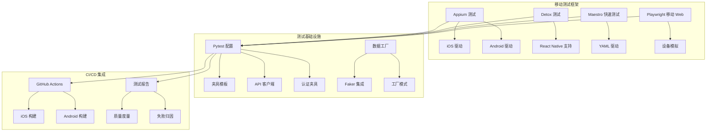

**图表来源**
- [mobile-testing.md:1-732](file://altas-workflow/references/testing/mobile-testing.md#L1-L732)
- [conftest.py:1-67](file://altas-workflow/references/testing/templates/conftest.py#L1-L67)

**章节来源**
- [mobile-testing.md:1-732](file://altas-workflow/references/testing/mobile-testing.md#L1-L732)

## 核心组件

### 测试框架矩阵

移动测试指南提供了多种测试框架的选择和配置方案：

| 框架类型 | 平台支持 | 特点 | 适用场景 |
|---------|----------|------|----------|
| Appium | iOS/Android | 跨平台、多语言绑定 | 通用移动应用测试 |
| Detox | iOS/Android (RN) | 快速、灰盒测试 | React Native 应用 |
| XCUITest | iOS | 原生框架、性能最佳 | iOS 原生应用 |
| Espresso | Android | 原生框架、快速稳定 | Android 原生应用 |
| Maestro | iOS/Android | 配置简单、YAML驱动 | 快速冒烟测试 |
| Playwright | Mobile Web | 跨浏览器、设备模拟 | 移动 Web 应用 |

### 设备矩阵策略

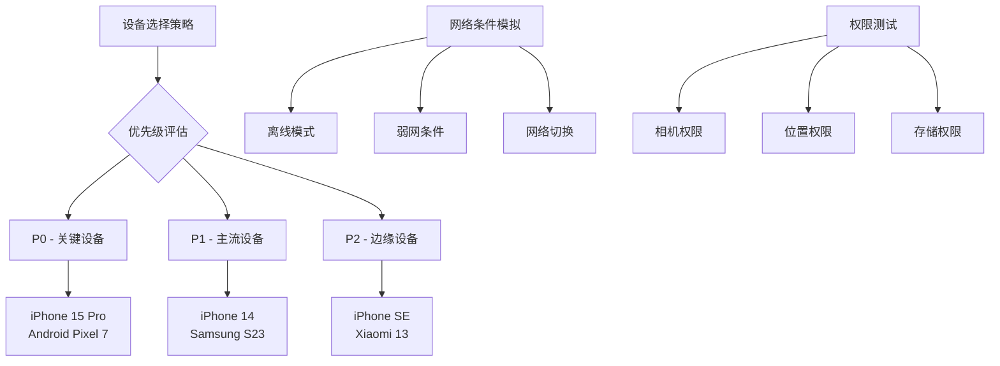

**图表来源**
- [mobile-testing.md:594-620](file://altas-workflow/references/testing/mobile-testing.md#L594-L620)

**章节来源**
- [mobile-testing.md:17-33](file://altas-workflow/references/testing/mobile-testing.md#L17-L33)
- [mobile-testing.md:592-620](file://altas-workflow/references/testing/mobile-testing.md#L592-L620)

## 架构概览

移动测试架构采用分层设计，确保测试的可维护性和可扩展性：

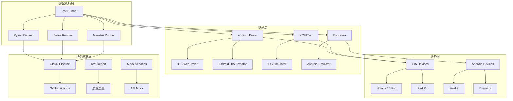

**图表来源**
- [mobile-testing.md:274-316](file://altas-workflow/references/testing/mobile-testing.md#L274-L316)
- [mobile-testing.md:624-688](file://altas-workflow/references/testing/mobile-testing.md#L624-L688)

## 详细组件分析

### Appium 测试框架

Appium 是移动测试的核心框架，支持跨平台测试和多种编程语言绑定。

#### 环境配置

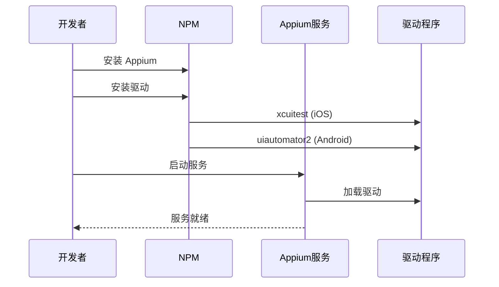

**图表来源**
- [mobile-testing.md:38-50](file://altas-workflow/references/testing/mobile-testing.md#L38-L50)

#### 测试夹具设计

Appium 使用 Pytest 夹具管理测试驱动生命周期：

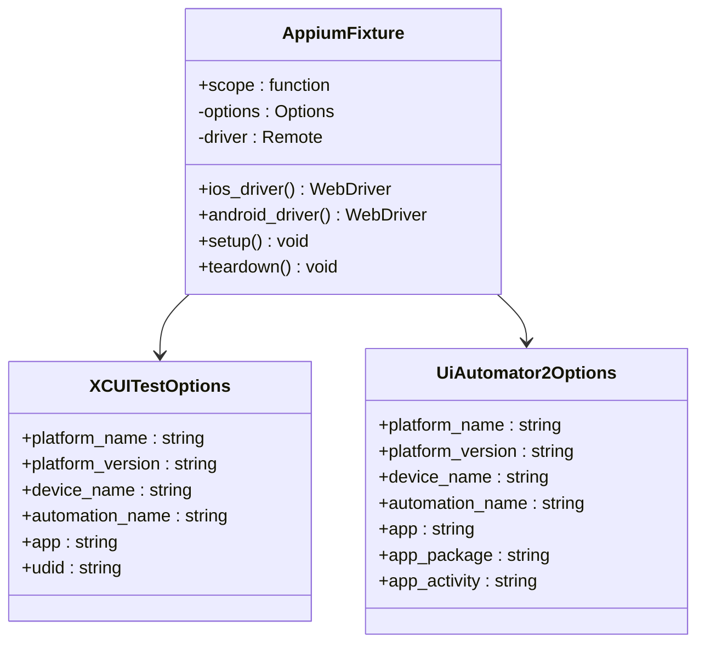

**图表来源**
- [mobile-testing.md:52-99](file://altas-workflow/references/testing/mobile-testing.md#L52-L99)

**章节来源**
- [mobile-testing.md:36-99](file://altas-workflow/references/testing/mobile-testing.md#L36-L99)

### Detox React Native 测试

Detox 提供了针对 React Native 应用的专用测试框架，具有更快的执行速度和更好的稳定性。

#### 配置结构

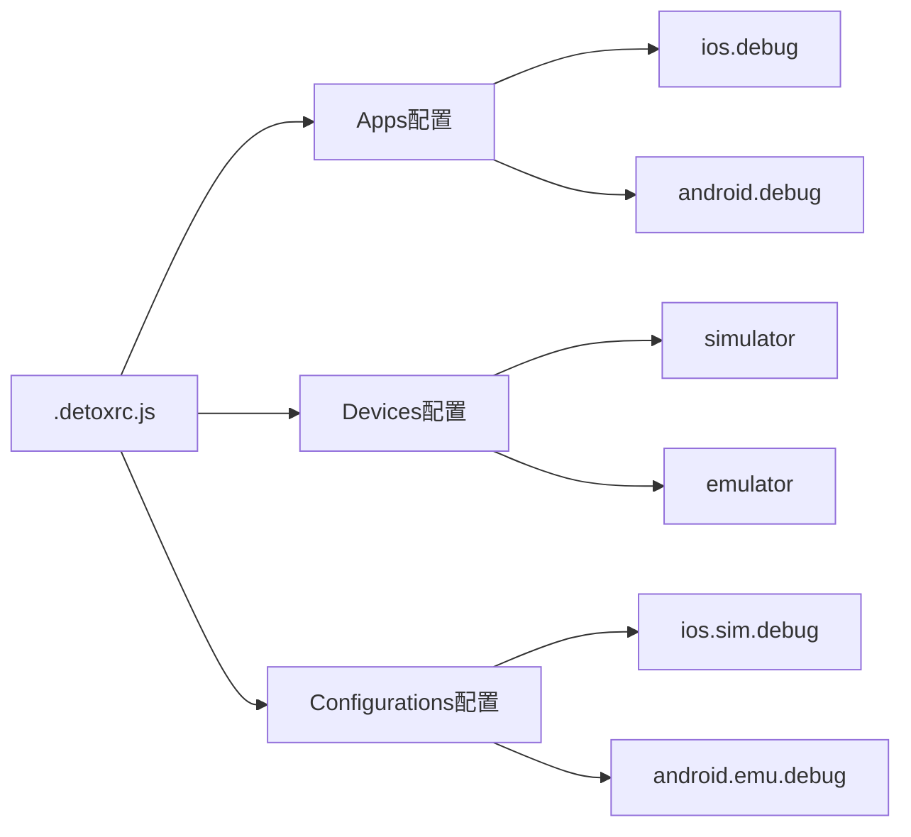

**图表来源**
- [mobile-testing.md:276-316](file://altas-workflow/references/testing/mobile-testing.md#L276-L316)

#### 测试流程

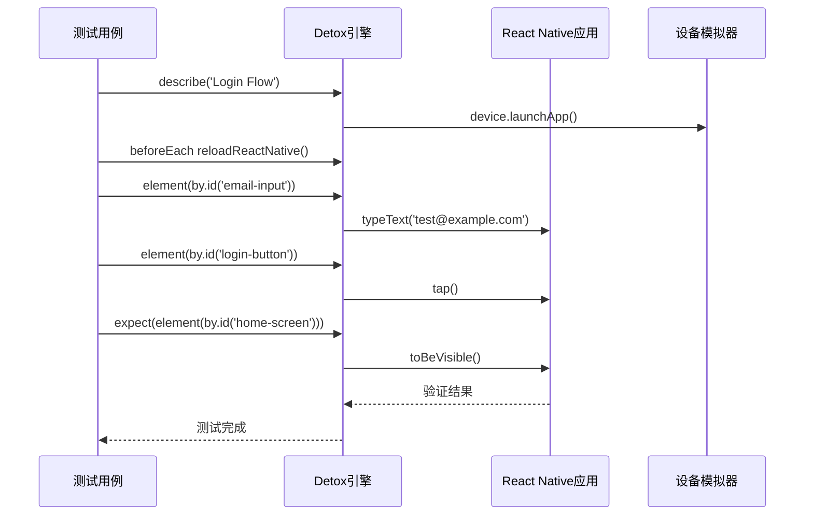

**图表来源**
- [mobile-testing.md:318-391](file://altas-workflow/references/testing/mobile-testing.md#L318-L391)

**章节来源**
- [mobile-testing.md:272-391](file://altas-workflow/references/testing/mobile-testing.md#L272-L391)

### Maestro 快速测试

Maestro 使用 YAML 驱动的测试编写方式，适合快速冒烟测试和回归测试。

#### Flow 文件结构

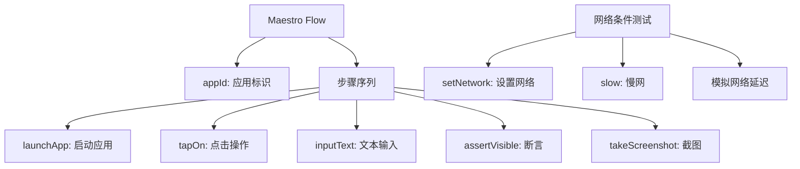

**图表来源**
- [mobile-testing.md:409-451](file://altas-workflow/references/testing/mobile-testing.md#L409-L451)

**章节来源**
- [mobile-testing.md:395-451](file://altas-workflow/references/testing/mobile-testing.md#L395-L451)

### 移动 Web 测试 (Playwright)

Playwright 提供了强大的移动 Web 测试能力，支持多种设备类型的模拟。

#### 设备配置矩阵

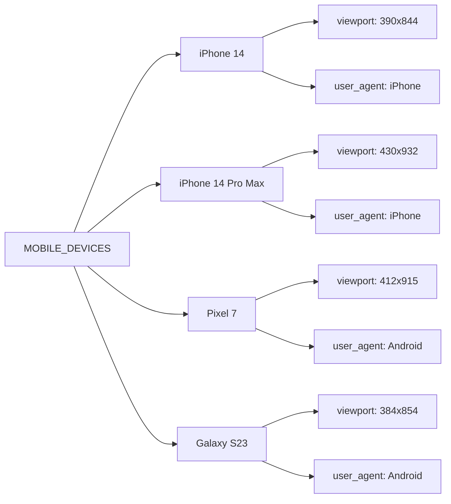

**图表来源**
- [mobile-testing.md:462-467](file://altas-workflow/references/testing/mobile-testing.md#L462-L467)

**章节来源**
- [mobile-testing.md:454-532](file://altas-workflow/references/testing/mobile-testing.md#L454-L532)

### 网络条件测试

网络条件测试是移动应用测试的重要组成部分，模拟真实网络环境下的应用表现。

#### 网络模拟策略

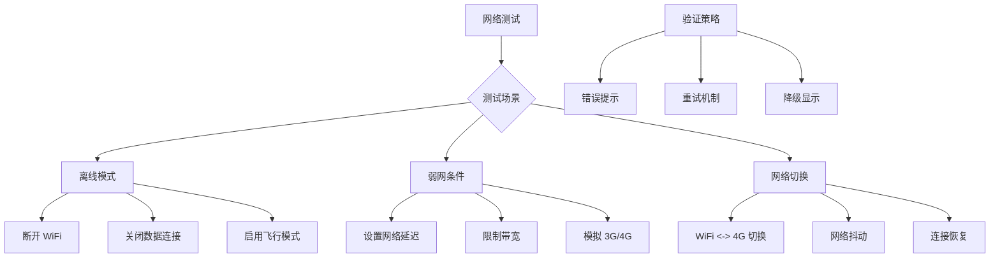

**图表来源**
- [mobile-testing.md:538-588](file://altas-workflow/references/testing/mobile-testing.md#L538-L588)

**章节来源**
- [mobile-testing.md:536-588](file://altas-workflow/references/testing/mobile-testing.md#L536-L588)

## 依赖关系分析

测试基础设施采用模块化设计，各组件之间保持松耦合：

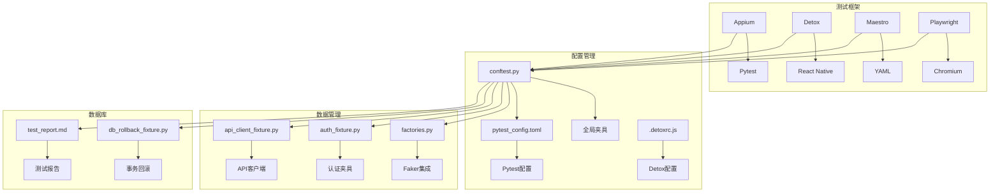

**图表来源**
- [conftest.py:15-67](file://altas-workflow/references/testing/templates/conftest.py#L15-L67)
- [factories.py:13-50](file://altas-workflow/references/testing/templates/factories.py#L13-L50)
- [auth_fixture.py:10-51](file://altas-workflow/references/testing/templates/auth_fixture.py#L10-L51)

**章节来源**
- [conftest.py:1-67](file://altas-workflow/references/testing/templates/conftest.py#L1-L67)
- [factories.py:1-50](file://altas-workflow/references/testing/templates/factories.py#L1-L50)
- [auth_fixture.py:1-51](file://altas-workflow/references/testing/templates/auth_fixture.py#L1-L51)

## 性能考虑

移动测试的性能优化涉及多个层面：

### 测试执行优化

1. **并行执行**: 利用 pytest-xdist 实现测试并行化
2. **设备池管理**: 合理分配测试设备资源
3. **测试分层**: 区分快速测试和深度测试
4. **缓存策略**: 复用测试环境和数据

### 性能监控指标

| 指标类型 | 目标值 | 监控方法 |
|---------|--------|----------|
| 测试执行时间 | < 5分钟 | CI/CD 时间统计 |
| 设备利用率 | > 80% | 设备池监控 |
| 失败率 | < 5% | 测试报告分析 |
| 覆盖率 | > 80% | 代码覆盖率工具 |

## 故障排除指南

### 常见问题及解决方案

#### Appium 驱动问题

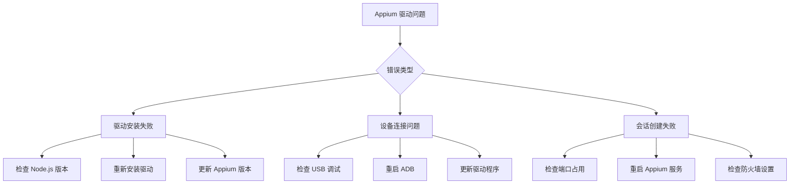

#### Detox 构建问题

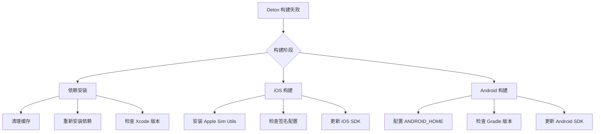

**章节来源**
- [mobile-testing.md:624-688](file://altas-workflow/references/testing/mobile-testing.md#L624-L688)

## 结论

移动测试指南提供了一套完整的移动应用测试解决方案，涵盖了从框架选择到执行优化的各个方面。通过采用多框架并行的策略，团队可以根据具体需求选择最适合的测试方案。

关键优势包括：
- **灵活性**: 支持多种测试框架和设备平台
- **可扩展性**: 模块化设计便于功能扩展
- **可靠性**: 完善的错误处理和故障排除机制
- **效率**: 自动化 CI/CD 集成和并行执行

建议团队根据应用特点和资源情况，选择合适的测试框架组合，并建立相应的测试策略和质量标准。

## 附录

### 测试清单模板

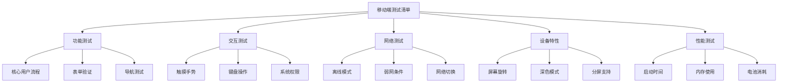

### CI/CD 集成最佳实践

1. **并行执行**: 在不同平台上并行运行测试
2. **设备池**: 维护稳定的设备池以提高效率
3. **报告聚合**: 集中收集和分析测试结果
4. **质量门禁**: 设置自动化的质量检查机制

**章节来源**
- [mobile-testing.md:692-732](file://altas-workflow/references/testing/mobile-testing.md#L692-L732)