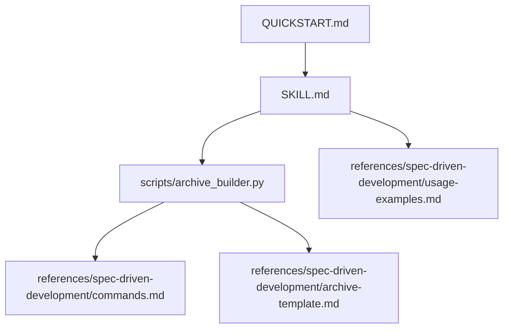
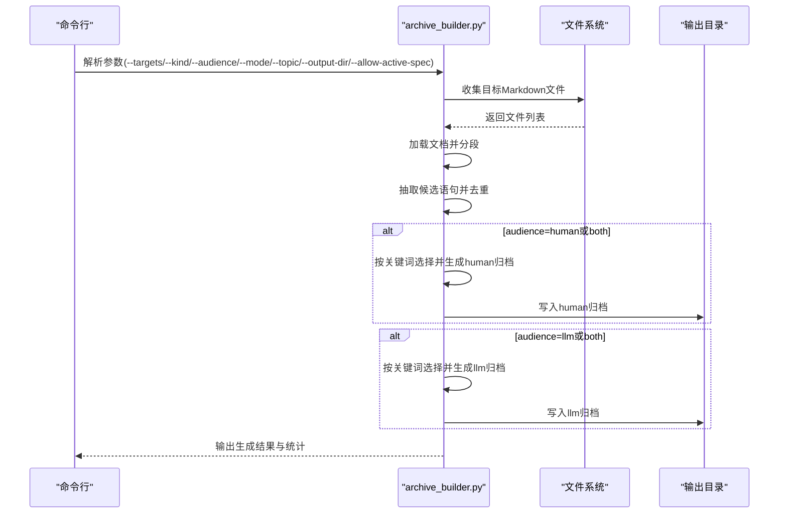
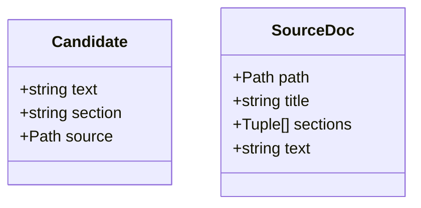

# 自动化工具

<cite>
**本文引用的文件**
- [archive_builder.py](file://altas-workflow/scripts/archive_builder.py)
- [QUICKSTART.md](file://altas-workflow/QUICKSTART.md)
- [SKILL.md](file://altas-workflow/SKILL.md)
- [archive-template.md](file://altas-workflow/references/spec-driven-development/archive-template.md)
- [commands.md](file://altas-workflow/references/spec-driven-development/commands.md)
- [usage-examples.md](file://altas-workflow/references/spec-driven-development/usage-examples.md)
- [reference-index.md](file://altas-workflow/reference-index.md)
- [spec-template.md](file://altas-workflow/references/spec-driven-development/spec-template.md)
</cite>

## 目录
1. [简介](#简介)
2. [项目结构](#项目结构)
3. [核心组件](#核心组件)
4. [架构总览](#架构总览)
5. [详细组件分析](#详细组件分析)
6. [依赖分析](#依赖分析)
7. [性能考虑](#性能考虑)
8. [故障排除指南](#故障排除指南)
9. [结论](#结论)
10. [附录](#附录)

## 简介
本文件为 ALTAS Workflow 的自动化工具“归档构建器（archive_builder.py）”提供完整技术文档。该工具用于将 Spec 与 CodeMap 等中间产物提炼为“双视角知识沉淀”文档：面向汇报的人类视角（human）与面向后续开发的机器可读视角（llm）。文档涵盖安装配置、命令行参数、输入输出格式、使用示例、扩展机制、性能优化与故障排除，帮助开发者快速上手并进行二次开发。

## 项目结构
- 工具位于 scripts/archive_builder.py，负责解析 Markdown、抽取候选语句、生成双视角归档。
- 参考资料位于 references/spec-driven-development/，包含命令参数、模板与使用示例，指导归档的生成与集成。
- QUICKSTART.md 与 SKILL.md 提供整体工作流与触发方式，便于在 ALTAS Workflow 中集成归档流程。

图表来源
- [archive_builder.py:1-505](file://altas-workflow/scripts/archive_builder.py#L1-L505)
- [commands.md:78-97](file://altas-workflow/references/spec-driven-development/commands.md#L78-L97)
- [archive-template.md:1-88](file://altas-workflow/references/spec-driven-development/archive-template.md#L1-L88)
- [QUICKSTART.md:1-182](file://altas-workflow/QUICKSTART.md#L1-L182)
- [SKILL.md:210-275](file://altas-workflow/SKILL.md#L210-L275)
- [usage-examples.md:427-454](file://altas-workflow/references/spec-driven-development/usage-examples.md#L427-L454)

章节来源
- [archive_builder.py:1-505](file://altas-workflow/scripts/archive_builder.py#L1-L505)
- [QUICKSTART.md:1-182](file://altas-workflow/QUICKSTART.md#L1-L182)
- [SKILL.md:210-275](file://altas-workflow/SKILL.md#L210-L275)

## 核心组件
- 命令行参数解析：支持 targets、kind、audience、mode、topic、output-dir、allow-active-spec 等。
- 目标收集：递归扫描目录，过滤 Markdown 文件，按 kind 进行筛选（spec、codemap、mixed）。
- 文档加载与分段：读取 Markdown 文本，按标题切分为 sections，提取标题与正文。
- 候选语句抽取：规范化与去噪，保留有意义的短语，去重后形成候选集。
- 关键词选择与回退：按关键词类别挑选结论，若无匹配则回退取前若干条。
- 双视角归档生成：分别构建 human 与 llm 版本，包含摘要、来源索引与“Trace to Sources”表格。
- 输出写入：按时间戳与 topic 生成文件名，写入 mydocs/archive 目录。

章节来源
- [archive_builder.py:36-79](file://altas-workflow/scripts/archive_builder.py#L36-L79)
- [archive_builder.py:122-154](file://altas-workflow/scripts/archive_builder.py#L122-L154)
- [archive_builder.py:183-190](file://altas-workflow/scripts/archive_builder.py#L183-L190)
- [archive_builder.py:227-248](file://altas-workflow/scripts/archive_builder.py#L227-L248)
- [archive_builder.py:318-443](file://altas-workflow/scripts/archive_builder.py#L318-L443)
- [archive_builder.py:446-500](file://altas-workflow/scripts/archive_builder.py#L446-L500)

## 架构总览
归档构建器的处理流程从命令行参数开始，经过文件收集、文档解析、候选抽取、关键词选择、双视角生成与输出写入，最终形成可汇报与可复用的知识沉淀。

图表来源
- [archive_builder.py:451-500](file://altas-workflow/scripts/archive_builder.py#L451-L500)
- [commands.md:78-97](file://altas-workflow/references/spec-driven-development/commands.md#L78-L97)

## 详细组件分析

### 命令行参数与控制流
- 参数说明
  - --targets：支持多个文件/目录，逗号分隔可展开。
  - --kind：spec、codemap、mixed，过滤目标文件类型。
  - --audience：human、llm、both，控制生成文档类型。
  - --mode：snapshot（单任务）、thematic（跨任务主题），影响 topic 推断与输出命名。
  - --topic：归档主题，为空时根据 targets 与 mode 推断。
  - --output-dir：输出目录，默认 mydocs/archive。
  - --allow-active-spec：允许归档未完成 Review 的活跃 Spec（需显式确认）。
- 控制流
  - 参数解析后，先展开 targets，再收集文件，随后加载文档，必要时检查活跃 Spec，最后按 audience 生成对应归档并写入。

章节来源
- [archive_builder.py:36-79](file://altas-workflow/scripts/archive_builder.py#L36-L79)
- [archive_builder.py:451-500](file://altas-workflow/scripts/archive_builder.py#L451-L500)
- [commands.md:78-97](file://altas-workflow/references/spec-driven-development/commands.md#L78-L97)

### 文件收集与过滤
- 支持单文件与目录递归扫描，仅接受 .md 文件。
- kind 过滤规则：
  - mixed：不过滤。
  - spec：路径包含 specs 或文件名包含 spec。
  - codemap：路径包含 codemap 或文件名包含 codemap、项目总图、功能。
- 去重：按绝对路径去重，排序后返回。

章节来源
- [archive_builder.py:122-154](file://altas-workflow/scripts/archive_builder.py#L122-L154)
- [archive_builder.py:94-119](file://altas-workflow/scripts/archive_builder.py#L94-L119)

### 文档加载与分段
- 读取 UTF-8 文本，忽略无法解码字符。
- 使用正则匹配标题行，按标题切分 sections，保留原始行尾空白。
- 标题推断：优先取首个非空标题，否则使用文件名 stem。

章节来源
- [archive_builder.py:183-190](file://altas-workflow/scripts/archive_builder.py#L183-L190)
- [archive_builder.py:157-173](file://altas-workflow/scripts/archive_builder.py#L157-L173)
- [archive_builder.py:176-180](file://altas-workflow/scripts/archive_builder.py#L176-L180)

### 候选语句抽取与去重
- 规范化：去除列表标记、编号、多余空白。
- 去噪：过滤代码块、表格、过短行。
- 去重：按标准化后的文本小写去重，保留顺序。

章节来源
- [archive_builder.py:207-224](file://altas-workflow/scripts/archive_builder.py#L207-L224)
- [archive_builder.py:227-248](file://altas-workflow/scripts/archive_builder.py#L227-L248)

### 关键词选择与回退策略
- human 归档关键词类别：decision、selected、结论、决策、方案、取舍、why；goal、完成、result、outcome、验收、pass、上线、收益；risk、风险、follow-up、todo、block、issue、regression、回归。
- llm 归档关键词类别：constraint、must、禁止、约束、门禁、No Spec、Plan Approved、scope；api、interface、contract、schema、provider、consumer、endpoint；entry、module、file、path、core、链路、入口、依赖；option、selected、pattern、anti-pattern、recommended、建议、避免。
- 回退策略：若某类别未找到，则从候选集中顺序取前若干条作为兜底。

章节来源
- [archive_builder.py:324-346](file://altas-workflow/scripts/archive_builder.py#L324-L346)
- [archive_builder.py:380-408](file://altas-workflow/scripts/archive_builder.py#L380-L408)
- [archive_builder.py:251-266](file://altas-workflow/scripts/archive_builder.py#L251-L266)

### 双视角归档生成
- human 归档（汇报视角）
  - 包含：执行摘要、范围与来源、关键决策、成果与业务影响、风险与后续、来源追踪表。
- llm 归档（开发参考视角）
  - 包含：任务快照、稳定事实与约束、接口与契约、代码触点、接受模式/拒绝路径、复用提示、来源索引、来源追踪表。
- 追踪表：包含结论、来源文件、章节，支持表格渲染与转义。

章节来源
- [archive_builder.py:318-371](file://altas-workflow/scripts/archive_builder.py#L318-L371)
- [archive_builder.py:374-443](file://altas-workflow/scripts/archive_builder.py#L374-L443)
- [archive_builder.py:306-315](file://altas-workflow/scripts/archive_builder.py#L306-L315)

### 输出与命名
- 输出目录：--output-dir，默认 mydocs/archive。
- 文件命名：YYYY-MM-DD_HH-MM_主题_类型.md，类型为 human 或 llm。
- topic 推断与清理：若传入则使用；单文件去前缀后使用；thematic 模式使用主题名；其他使用 snapshot-archive。

章节来源
- [archive_builder.py:273-289](file://altas-workflow/scripts/archive_builder.py#L273-L289)
- [archive_builder.py:476-498](file://altas-workflow/scripts/archive_builder.py#L476-L498)
- [archive-template.md:1-88](file://altas-workflow/references/spec-driven-development/archive-template.md#L1-L88)

### 类与数据结构

图表来源
- [archive_builder.py:21-34](file://altas-workflow/scripts/archive_builder.py#L21-L34)

## 依赖分析
- 工具内部无第三方依赖，仅使用 Python 标准库。
- 与参考文档的耦合关系：
  - commands.md 定义命令参数与输出规范。
  - archive-template.md 定义 human 与 llm 归档的结构与字段。
  - usage-examples.md 提供归档使用的完整示例与最佳实践。
  - reference-index.md 提供参考文件索引与调用时机。
  - spec-template.md 体现归档在 SDD 流程中的位置与落盘约定。

章节来源
- [archive_builder.py:1-505](file://altas-workflow/scripts/archive_builder.py#L1-L505)
- [commands.md:78-97](file://altas-workflow/references/spec-driven-development/commands.md#L78-L97)
- [archive-template.md:1-88](file://altas-workflow/references/spec-driven-development/archive-template.md#L1-L88)
- [usage-examples.md:427-454](file://altas-workflow/references/spec-driven-development/usage-examples.md#L427-L454)
- [reference-index.md:73-80](file://altas-workflow/reference-index.md#L73-L80)
- [spec-template.md:105-115](file://altas-workflow/references/spec-driven-development/spec-template.md#L105-L115)

## 性能考虑
- I/O 与内存
  - 读取所有目标 Markdown 文本后进行内存处理，适合中小规模归档。
  - 建议限制 targets 数量与文件大小，避免超大文档导致内存压力。
- 去重与关键词匹配
  - 候选去重使用集合，时间复杂度近似 O(n)。
  - 关键词匹配为线性扫描，n 为候选数量；可通过预处理或索引优化（见扩展开发）。
- 并行化
  - 当前为单进程；可考虑按文件分片并行处理，注意合并阶段的并发安全。
- 输出写入
  - 写入为顺序 I/O，建议在高并发场景下使用本地 SSD 与合适的缓冲策略。

[本节为通用性能建议，不直接分析特定文件]

## 故障排除指南
- 无有效 targets
  - 现象：提示未提供有效 targets。
  - 处理：检查 --targets 是否为空或仅包含无效路径。
  - 参考：[archive_builder.py:454-456](file://altas-workflow/scripts/archive_builder.py#L454-L456)
- 未发现 Markdown 文件
  - 现象：在 targets 下未发现 .md 文件。
  - 处理：确认目标路径存在且包含 .md 文件，或调整 --kind。
  - 参考：[archive_builder.py:459-461](file://altas-workflow/scripts/archive_builder.py#L459-L461)
- 检测到活跃/未完成的 Spec
  - 现象：检测到未完成 Review 的活跃 Spec，阻止归档。
  - 处理：确认 Spec 已完成 Review，或使用 --allow-active-spec 显式允许（需确认）。
  - 参考：[archive_builder.py:464-474](file://altas-workflow/scripts/archive_builder.py#L464-L474)
- 输出目录权限问题
  - 现象：无法写入输出文件。
  - 处理：确认 --output-dir 存在且具有写权限。
  - 参考：[archive_builder.py:479](file://altas-workflow/scripts/archive_builder.py#L479)
- 归档内容为空或过少
  - 现象：human/llm 归档中某些类别为空。
  - 处理：检查源 Markdown 是否包含相应关键词；可适当放宽关键词或手动补充。
  - 参考：[archive_builder.py:324-346](file://altas-workflow/scripts/archive_builder.py#L324-L346), [archive_builder.py:380-408](file://altas-workflow/scripts/archive_builder.py#L380-L408)

章节来源
- [archive_builder.py:451-500](file://altas-workflow/scripts/archive_builder.py#L451-L500)

## 结论
archive_builder.py 以简洁高效的实现，将 Spec 与 CodeMap 等中间产物转化为双视角归档，满足汇报与复用两大需求。其参数化设计与模板化的输出结构，便于在 ALTAS Workflow 中无缝集成。通过合理的输入过滤、候选抽取与关键词选择策略，工具能够在不同规模与主题下稳定产出高质量知识沉淀。

[本节为总结性内容，不直接分析特定文件]

## 附录

### 安装与配置
- 环境要求
  - Python 3.x（标准库依赖）。
- 项目目录
  - 建议在项目根目录创建 mydocs/，其中包含 codemap、context、specs、micro_specs、archive 等子目录。
  - 参考：[QUICKSTART.md:19-28](file://altas-workflow/QUICKSTART.md#L19-L28)
- 工具位置
  - scripts/archive_builder.py 为归档构建器入口。

章节来源
- [QUICKSTART.md:19-28](file://altas-workflow/QUICKSTART.md#L19-L28)
- [archive_builder.py:1-505](file://altas-workflow/scripts/archive_builder.py#L1-L505)

### 命令行参数详解
- --targets：目标文件或目录（支持多个，逗号分隔可展开）。
- --kind：spec、codemap、mixed。
- --audience：human、llm、both。
- --mode：snapshot、thematic。
- --topic：归档主题名。
- --output-dir：输出目录。
- --allow-active-spec：允许归档未完成 Review 的活跃 Spec。

章节来源
- [archive_builder.py:36-79](file://altas-workflow/scripts/archive_builder.py#L36-L79)
- [commands.md:78-97](file://altas-workflow/references/spec-driven-development/commands.md#L78-L97)

### 输入输出格式
- 输入
  - Markdown 文件（.md），支持 Spec 与 CodeMap。
  - 支持目录递归扫描与 kind 过滤。
- 输出
  - human 归档：YYYY-MM-DD_HH-MM_主题_human.md
  - llm 归档：YYYY-MM-DD_HH-MM_主题_llm.md
  - 每份归档包含来源索引与“Trace to Sources”表格。
- 参考模板
  - [archive-template.md:1-88](file://altas-workflow/references/spec-driven-development/archive-template.md#L1-L88)

章节来源
- [archive_template.md:1-88](file://altas-workflow/references/spec-driven-development/archive-template.md#L1-L88)
- [archive_builder.py:476-498](file://altas-workflow/scripts/archive_builder.py#L476-L498)

### 使用示例
- 单任务快照归档
  - 示例输入与预期输出参见 usage-examples.md 中的 archive 部分。
  - 参考：[usage-examples.md:427-443](file://altas-workflow/references/spec-driven-development/usage-examples.md#L427-L443)
- 主题归档（跨任务）
  - 示例输入与预期输出参见 usage-examples.md 中的主题归档部分。
  - 参考：[usage-examples.md:444-454](file://altas-workflow/references/spec-driven-development/usage-examples.md#L444-L454)
- 在 ALTAS Workflow 中触发
  - ARCHIVE 模式触发与自动化脚本调用参见 SKILL.md 与 QUICKSTART.md。
  - 参考：[SKILL.md:266-274](file://altas-workflow/SKILL.md#L266-L274), [QUICKSTART.md:48](file://altas-workflow/QUICKSTART.md#L48)

章节来源
- [usage-examples.md:427-454](file://altas-workflow/references/spec-driven-development/usage-examples.md#L427-L454)
- [SKILL.md:266-274](file://altas-workflow/SKILL.md#L266-L274)
- [QUICKSTART.md:48](file://altas-workflow/QUICKSTART.md#L48)

### 扩展开发指南
- 自定义模板
  - 可在 archive-template.md 基础上扩展字段与结构，然后在 human/llm 生成函数中映射。
  - 参考：[archive-template.md:1-88](file://altas-workflow/references/spec-driven-development/archive-template.md#L1-L88)
- 输出格式扩展
  - 可在 build_human_archive 与 build_llm_archive 中增加新的关键词类别与字段。
  - 参考：[archive_builder.py:318-443](file://altas-workflow/scripts/archive_builder.py#L318-L443)
- 集成方式
  - 在 ALTAS Workflow 的 ARCHIVE 模式中调用 archive_builder.py，或在 CI 中定期执行。
  - 参考：[SKILL.md:266-274](file://altas-workflow/SKILL.md#L266-L274), [commands.md:94-96](file://altas-workflow/references/spec-driven-development/commands.md#L94-L96)
- 性能优化建议
  - 候选抽取与关键词匹配可引入预处理与索引；对大文件可分块处理；并行化候选去重与关键词匹配。
  - 参考：[archive_builder.py:227-248](file://altas-workflow/scripts/archive_builder.py#L227-L248), [archive_builder.py:251-266](file://altas-workflow/scripts/archive_builder.py#L251-L266)

章节来源
- [archive-template.md:1-88](file://altas-workflow/references/spec-driven-development/archive-template.md#L1-L88)
- [archive_builder.py:318-443](file://altas-workflow/scripts/archive_builder.py#L318-L443)
- [SKILL.md:266-274](file://altas-workflow/SKILL.md#L266-L274)
- [commands.md:94-96](file://altas-workflow/references/spec-driven-development/commands.md#L94-L96)