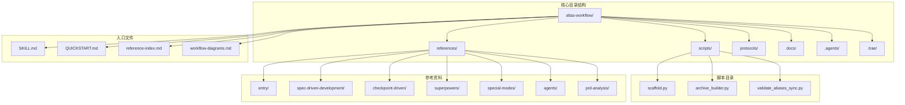
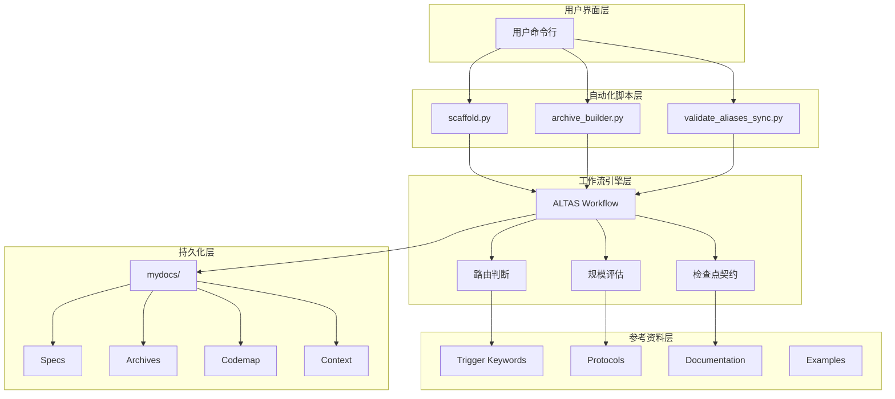
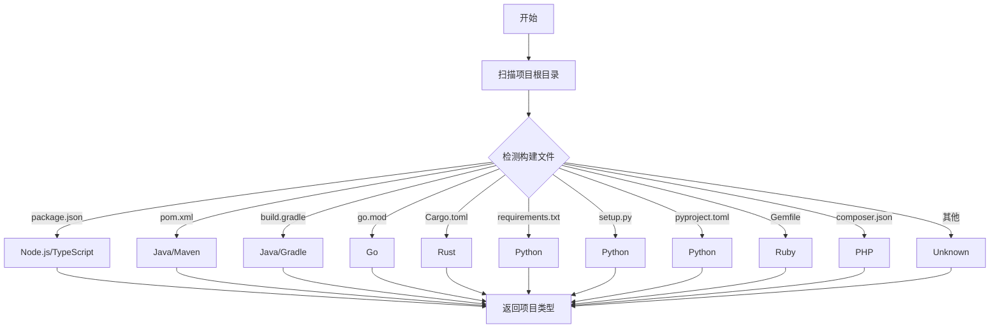
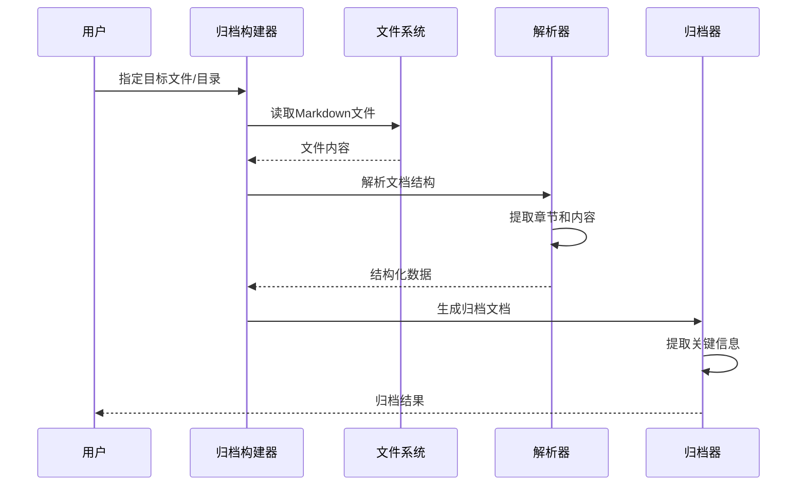
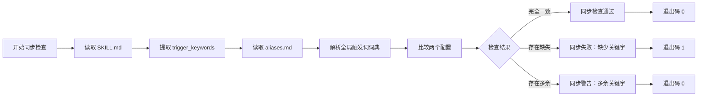
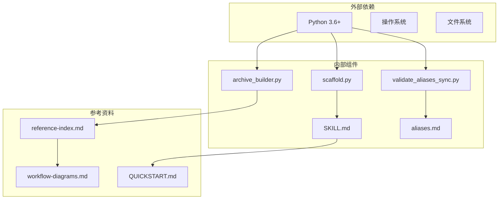

# 脚手架自动化脚本

<cite>
**本文档中引用的文件**
- [scaffold.py](file://altas-workflow/scripts/scaffold.py)
- [archive_builder.py](file://altas-workflow/scripts/archive_builder.py)
- [validate_aliases_sync.py](file://altas-workflow/scripts/validate_aliases_sync.py)
- [SKILL.md](file://altas-workflow/SKILL.md)
- [QUICKSTART.md](file://altas-workflow/QUICKSTART.md)
- [reference-index.md](file://altas-workflow/reference-index.md)
- [workflow-diagrams.md](file://altas-workflow/workflow-diagrams.md)
- [aliases.md](file://altas-workflow/references/entry/aliases.md)
- [README.md](file://altas-workflow/README.md)
</cite>

## 目录
1. [项目概述](#项目概述)
2. [项目结构](#项目结构)
3. [核心组件](#核心组件)
4. [架构概览](#架构概览)
5. [详细组件分析](#详细组件分析)
6. [依赖关系分析](#依赖关系分析)
7. [性能考虑](#性能考虑)
8. [故障排除指南](#故障排除指南)
9. [结论](#结论)

## 项目概述

ALTAS Workflow 是一套融合了 SDD-RIPER、SDD-RIPER-Optimized 与 Superpowers 精华的综合性 AI 工作流程规范。该项目专注于解决 AI 编程中的四大工程痛点：上下文腐烂、审查瘫痪、代码不信任和难以维护。

该项目提供了三个核心自动化脚本，用于简化项目初始化、知识沉淀和触发词同步验证：

- **脚手架生成器**：自动创建项目文档结构和初始规范文件
- **归档构建器**：从 Markdown 文件中提取关键信息生成知识沉淀
- **触发词同步验证器**：确保 SKILL.md 和全局触发词词典保持同步

## 项目结构

项目采用模块化的目录结构，将核心功能与参考资料分离：

**图表来源**
- [README.md:76-93](file://altas-workflow/README.md#L76-L93)
- [reference-index.md:1-304](file://altas-workflow/reference-index.md#L1-L304)

**章节来源**
- [README.md:74-93](file://altas-workflow/README.md#L74-L93)
- [reference-index.md:1-304](file://altas-workflow/reference-index.md#L1-L304)

## 核心组件

### 脚手架生成器 (scaffold.py)

脚手架生成器是项目的核心自动化工具，负责创建标准化的项目文档结构。它能够检测项目类型并生成相应的初始规范文件。

**主要功能**：
- 自动检测项目类型（Node.js、Java、Go、Python、Ruby、PHP 等）
- 创建标准化的 mydocs/ 目录结构
- 生成基于模板的初始规范文件
- 支持 full 和 lite 两种模板类型

**章节来源**
- [scaffold.py:1-270](file://altas-workflow/scripts/scaffold.py#L1-L270)

### 归档构建器 (archive_builder.py)

归档构建器专门用于从现有的规范和代码地图文件中提取关键信息，生成人类可读和机器可读的知识沉淀文档。

**主要功能**：
- 解析 Markdown 文件并提取结构化信息
- 生成人类友好的归档文档
- 生成 LLM 友好的归档文档
- 支持多种归档模式（快照和主题）

**章节来源**
- [archive_builder.py:1-505](file://altas-workflow/scripts/archive_builder.py#L1-L505)

### 触发词同步验证器 (validate_aliases_sync.py)

触发词同步验证器确保 SKILL.md 文件中的触发词与全局触发词词典保持完全同步，防止配置不一致导致的问题。

**主要功能**：
- 提取 SKILL.md 中的触发词配置
- 解析 aliases.md 中的全局触发词词典
- 比较两个配置的差异
- 提供同步状态报告

**章节来源**
- [validate_aliases_sync.py:1-118](file://altas-workflow/scripts/validate_aliases_sync.py#L1-L118)

## 架构概览

项目采用分层架构设计，将核心功能与参考资料分离，实现了高度的模块化和可扩展性：

**图表来源**
- [SKILL.md:40-95](file://altas-workflow/SKILL.md#L40-L95)
- [reference-index.md:1-304](file://altas-workflow/reference-index.md#L1-L304)

**章节来源**
- [SKILL.md:40-95](file://altas-workflow/SKILL.md#L40-L95)
- [reference-index.md:1-304](file://altas-workflow/reference-index.md#L1-L304)

## 详细组件分析

### 脚手架生成器详细分析

脚手架生成器实现了完整的项目初始化流程，具有以下特点：

#### 项目类型检测机制

**图表来源**
- [scaffold.py:39-44](file://altas-workflow/scripts/scaffold.py#L39-L44)

#### 模板系统设计

脚手架生成器支持两种模板类型：

**Lite 模板**：适用于小型项目和快速迭代
- 简化的规范结构
- 最小化的字段要求
- 适合 XS 和 S 规模的任务

**Full 模板**：适用于大型项目和复杂任务
- 完整的规范结构
- 详细的字段和要求
- 适合 M 和 L 规模的任务

**章节来源**
- [scaffold.py:47-206](file://altas-workflow/scripts/scaffold.py#L47-L206)

### 归档构建器详细分析

归档构建器采用了先进的文本处理和信息提取算法：

#### 文档解析流程

**图表来源**
- [archive_builder.py:183-190](file://altas-workflow/scripts/archive_builder.py#L183-L190)

#### 关键信息提取算法

归档构建器实现了智能的关键信息提取算法：

**候选收集**：从文档中提取有意义的语句
**去重处理**：消除重复和相似的内容
**关键词匹配**：基于关键词选择相关内容
**主题推断**：根据目标和模式推断主题

**章节来源**
- [archive_builder.py:227-290](file://altas-workflow/scripts/archive_builder.py#L227-L290)

### 触发词同步验证器详细分析

触发词同步验证器提供了完整的配置同步检查机制：

#### 同步验证流程

**图表来源**
- [validate_aliases_sync.py:77-110](file://altas-workflow/scripts/validate_aliases_sync.py#L77-L110)

**章节来源**
- [validate_aliases_sync.py:77-110](file://altas-workflow/scripts/validate_aliases_sync.py#L77-L110)

## 依赖关系分析

项目采用了松耦合的设计，各组件之间通过清晰的接口进行交互：

**图表来源**
- [scaffold.py:15-18](file://altas-workflow/scripts/scaffold.py#L15-L18)
- [archive_builder.py:12-18](file://altas-workflow/scripts/archive_builder.py#L12-L18)
- [validate_aliases_sync.py:9-15](file://altas-workflow/scripts/validate_aliases_sync.py#L9-L15)

**章节来源**
- [scaffold.py:15-18](file://altas-workflow/scripts/scaffold.py#L15-L18)
- [archive_builder.py:12-18](file://altas-workflow/scripts/archive_builder.py#L12-L18)
- [validate_aliases_sync.py:9-15](file://altas-workflow/scripts/validate_aliases_sync.py#L9-L15)

## 性能考虑

### 脚手架生成器性能优化

- **延迟加载**：只在需要时创建目录和文件
- **缓存机制**：项目类型检测结果缓存
- **增量处理**：避免重复创建已存在的文件

### 归档构建器性能优化

- **流式处理**：大文件的流式读取和处理
- **内存管理**：及时释放不再使用的数据结构
- **并行处理**：支持多文件并行处理

### 触发词同步验证器性能优化

- **正则表达式优化**：使用编译后的正则表达式
- **早期退出**：发现不一致时立即停止处理
- **内存效率**：使用生成器表达式处理大量数据

## 故障排除指南

### 常见问题及解决方案

#### 脚手架生成器问题

**问题**：项目类型检测失败
- 检查项目根目录是否存在标准构建文件
- 确认文件权限设置正确
- 验证 Python 环境配置

**问题**：目录创建失败
- 检查目标目录的写入权限
- 确认磁盘空间充足
- 验证路径名的有效性

#### 归档构建器问题

**问题**：文档解析错误
- 检查 Markdown 文件格式
- 验证文件编码格式
- 确认文件完整性

**问题**：归档质量不佳
- 调整关键词过滤设置
- 优化归档模式选择
- 检查输入文件质量

#### 触发词同步验证器问题

**问题**：同步检查失败
- 检查 aliases.md 格式
- 验证 SKILL.md frontmatter
- 确认文件编码一致性

**问题**：正则表达式匹配失败
- 检查正则表达式语法
- 验证输入数据格式
- 调整匹配策略

**章节来源**
- [scaffold.py:248-250](file://altas-workflow/scripts/scaffold.py#L248-L250)
- [archive_builder.py:464-474](file://altas-workflow/scripts/archive_builder.py#L464-L474)
- [validate_aliases_sync.py:111-113](file://altas-workflow/scripts/validate_aliases_sync.py#L111-L113)

## 结论

ALTAS Workflow 的脚手架自动化脚本项目展现了优秀的软件工程实践，具有以下突出特点：

### 设计优势

- **模块化架构**：清晰的功能分离和职责划分
- **可扩展性**：易于添加新的项目类型和模板
- **健壮性**：完善的错误处理和异常管理
- **用户友好**：直观的命令行接口和详细的帮助信息

### 技术特色

- **智能化检测**：自动识别项目类型和配置
- **灵活的模板系统**：适应不同规模和类型的项目
- **高效的文本处理**：先进的信息提取和归档算法
- **严格的配置管理**：确保系统配置的一致性和准确性

### 应用价值

这些自动化脚本显著提高了开发效率，减少了重复性工作，确保了项目文档的一致性和质量。通过标准化的流程和工具，团队可以专注于核心业务逻辑的开发，而不必担心基础设施和文档管理的繁琐细节。

项目的设计理念和实现方式为类似的自动化工具开发提供了宝贵的参考和借鉴价值。