# 自动化验证工具

<cite>
**本文档引用的文件**
- [README.md](file://README.md)
- [altas-workflow/README.md](file://altas-workflow/README.md)
- [altas-workflow/SKILL.md](file://altas-workflow/SKILL.md)
- [altas-workflow/QUICKSTART.md](file://altas-workflow/QUICKSTART.md)
- [altas-workflow/reference-index.md](file://altas-workflow/reference-index.md)
- [altas-workflow/references/entry/aliases.md](file://altas-workflow/references/entry/aliases.md)
- [altas-workflow/protocols/RIPER-5.md](file://altas-workflow/protocols/RIPER-5.md)
- [altas-workflow/protocols/RIPER-DOC.md](file://altas-workflow/protocols/RIPER-DOC.md)
- [altas-workflow/protocols/SDD-RIPER-DUAL-COOP.md](file://altas-workflow/protocols/SDD-RIPER-DUAL-COOP.md)
- [altas-workflow/scripts/archive_builder.py](file://altas-workflow/scripts/archive_builder.py)
- [altas-workflow/scripts/validate_aliases_sync.py](file://altas-workflow/scripts/validate_aliases_sync.py)
- [altas-workflow/references/superpowers/test-driven-development/SKILL.md](file://altas-workflow/references/superpowers/test-driven-development/SKILL.md)
- [altas-workflow/references/superpowers/systematic-debugging/SKILL.md](file://altas-workflow/references/superpowers/systematic-debugging/SKILL.md)
- [altas-workflow/references/superpowers/writing-plans/SKILL.md](file://altas-workflow/references/superpowers/writing-plans/SKILL.md)
- [altas-workflow/references/spec-driven-development/spec-template.md](file://altas-workflow/references/spec-driven-development/spec-template.md)
- [altas-workflow/references/checkpoint-driven/spec-lite-template.md](file://altas-workflow/references/checkpoint-driven/spec-lite-template.md)
- [altas-workflow/references/special-modes/review.md](file://altas-workflow/references/special-modes/review.md)
- [altas-workflow/references/special-modes/test.md](file://altas-workflow/references/special-modes/test.md)
- [altas-workflow/references/special-modes/refactor.md](file://altas-workflow/references/special-modes/refactor.md)
- [altas-workflow/references/special-modes/perf.md](file://altas-workflow/references/special-modes/perf.md)
- [altas-workflow/references/special-modes/migrate.md](file://altas-workflow/references/special-modes/migrate.md)
- [altas-workflow/workflow-diagrams.md](file://altas-workflow/workflow-diagrams.md)
</cite>

## 更新摘要
**所做更改**
- 更新了自动化工具文档结构重组的相关内容
- 新增了专业化模式文档的详细分析
- 增强了文档结构的维护性和针对性更新能力说明
- 完善了特殊模式的专业化文档组织结构

## 目录
1. [简介](#简介)
2. [项目结构](#项目结构)
3. [核心组件](#核心组件)
4. [架构概览](#架构概览)
5. [详细组件分析](#详细组件分析)
6. [依赖分析](#依赖分析)
7. [性能考虑](#性能考虑)
8. [故障排除指南](#故障排除指南)
9. [结论](#结论)
10. [附录](#附录)

## 简介

ALTAS Workflow 是一套综合性 AI 原生研发工作流规范，融合了 SDD-RIPER、SDD-RIPER-Optimized (Checkpoint-Driven) 与 Superpowers 三大优秀工作流的精华。该项目致力于解决 AI 编程中的四大工程痛点：

- **上下文腐烂**：CodeMap 索引 + 渐进式披露，按需加载参考资料
- **审查瘫痪**：4 级智能深度 (XS/S/M/L)，小任务不卡审批
- **代码不信任**：Spec 中心论 + 三轴评审，Spec is Truth
- **难以维护**：Archive 知识沉淀 + TDD 铁律，完成即资产

### 核心铁律

1. **No Spec, No Code** — 未形成最小 Spec 前不写代码 (Size XS 豁免)
2. **No Approval, No Execute** — Plan 阶段人类不点头，绝不写代码
3. **Spec is Truth** — Spec 与代码冲突时，代码是错的
4. **Reverse Sync** — 执行中发现偏差→先更新 Spec→再修代码
5. **Evidence First** — 完成由验证结果证明，非模型自宣布
6. **No Root Cause, No Fix** — Bug 修复前必须有根因分析，禁止盲改
7. **TDD Iron Law** — Size M/L: 无失败测试不写生产代码
8. **Resume Ready** — 长任务暂停前在 Spec 中留恢复锚点

## 项目结构

项目采用模块化设计，主要包含以下核心目录：

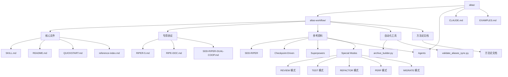

**图表来源**
- [README.md:48-82](file://README.md#L48-L82)
- [altas-workflow/README.md:1-673](file://altas-workflow/README.md#L1-L673)

### 核心资产统计

| 类别 | 数量 | 说明 |
|------|------|------|
| **核心协议** | 1 个 | SKILL.md (ALTAS Workflow 主协议) |
| **专用协议** | 3 个 | RIPER-5 / RIPER-DOC / DUAL-COOP |
| **方法论** | 4 篇 | 从传统到大模型 / AI 原生范式 / 团队落地 / 手把手教程 |
| **参考资料** | 70+ 个 | Spec 驱动 (7) / Checkpoint (4) / Superpowers (37) / Agents (22) / Special Modes (5) |
| **独立 Agent** | 2 个 | SDD-RIPER-ONE (标准版/轻量版) |
| **代码示例** | 1 个 | EXAMPLES.md (四大原则实战示例) |
| **自动化工具** | 2 个 | archive_builder.py (Archive 构建器) + validate_aliases_sync.py (触发词同步验证器) |
| **特殊模式** | 5 个 | REVIEW / TEST / REFACTOR / PERF / MIGRATE |

**章节来源**
- [README.md:84-94](file://README.md#L84-L94)
- [altas-workflow/README.md:628-643](file://altas-workflow/README.md#L628-L643)

## 核心组件

### 主协议系统 (SKILL.md)

SKILL.md 是 ALTAS Workflow 的核心入口，负责三件事：
1. **识别路由**：先判断任务属于 Coding / Debug / Doc / Map / Archive / Review / Refactor / Test / Perf / Migrate / Multi 中哪一类
2. **评估规模**：再判断 `XS / S / M / L`，决定需要多重的 Spec、Plan、Review 与验证门禁
3. **按需加载**：入口只保留高杠杆约束；模板、阶段细节、特殊模式协议一律去 `reference-index.md` 与 `references/` 按需读取

### 触发词系统

项目提供了完整的触发词词典，支持多种语言和别名：

| 模式 | 主触发词 | 支持别名 | 说明 |
|------|----------|----------|------|
| 极速通道 | `>>` | `FAST`、`快速` | `>>` 适合极小改动；`FAST` 是同一路由的显式写法 |
| 标准启动 | `sdd_bootstrap` | 无 | RIPER 标准启动动作 |
| 深度模式 | `DEEP` | 无 | 默认按 `L` 规模处理 |
| 调试模式 | `DEBUG` | `排查`、`日志分析`、`验证功能` | `验证功能` 仍归入 DEBUG 路由 |
| 文档模式 | `DOC` | `写文档` | 文档撰写与结构化整理 |
| 功能级地图 | `MAP` | `链路梳理`、`只看代码` | 输出功能级 CodeMap |
| 项目级地图 | `PROJECT MAP` | `MAP ALL`、`全局地图`、`项目总图` | 输出项目级 CodeMap |
| 归档模式 | `ARCHIVE` | `归档`、`沉淀` | 生成 human / llm 双视角沉淀 |
| 审查模式 | `REVIEW` | `代码审查`、`审查 PR` | 通用审查入口 |
| 计划评审 | `REVIEW SPEC` | `评审规格`、`计划评审` | 执行前审查 Spec / Plan |
| 执行复盘 | `REVIEW EXECUTE` | `代码评审`、`实现复盘` | 执行后三轴评审 |
| 重构模式 | `REFACTOR` | `重构` | 重构与结构调整 |
| 测试模式 | `TEST` | `写测试`、`补测试` | 测试补齐与测试治理 |
| 性能模式 | `PERF` | `性能优化` | 性能基线、定位与优化 |
| 迁移模式 | `MIGRATE` | `迁移`、`版本升级` | 版本、框架、数据或流程迁移 |
| 多项目模式 | `MULTI` | `多项目` | 自动发现子项目并建立作用域 |
| 跨项目改动 | `CROSS` | `跨项目` | 显式允许当前轮跨项目改动 |
| 退出协议 | `EXIT ALTAS` | `退出协议` | 输出摘要与恢复锚点后退出 |

**章节来源**
- [altas-workflow/SKILL.md:1-415](file://altas-workflow/SKILL.md#L1-L415)
- [altas-workflow/references/entry/aliases.md:1-52](file://altas-workflow/references/entry/aliases.md#L1-L52)

## 架构概览

### 四级任务深度系统

ALTAS 采用智能深度适配，提供四种任务规模：

```mermaid
flowchart TD
Start[任务开始] --> Evaluate[规模评估]
Evaluate --> XS[XS (极速)]
Evaluate --> S[S (快速)]
Evaluate --> M[M (标准)]
Evaluate --> L[L (深度)]
XS --> XS_Process[直接执行→验证→summary]
S --> S_Process[micro-spec→批准→执行→回写]
M --> M_Process[Research→Plan→Execute(TDD)→Review]
L --> L_Process[Research→Innovate→Plan→Execute(TDD)→Review→Archive]
M_Process --> Review[三轴评审]
L_Process --> Archive[知识沉淀]
Review --> Verify[验证证据]
Archive --> Verify
Verify --> End[任务完成]
```

**图表来源**
- [altas-workflow/README.md:235-266](file://altas-workflow/README.md#L235-L266)
- [altas-workflow/SKILL.md:131-161](file://altas-workflow/SKILL.md#L131-L161)

### 工作流阶段

#### Size M (标准) 流程

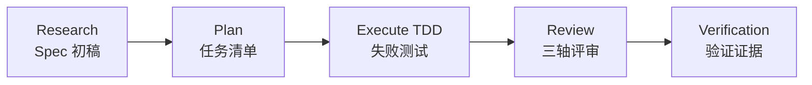

#### Size L (深度) 流程

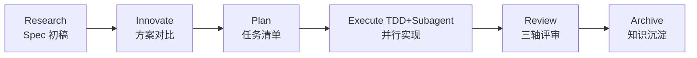

**章节来源**
- [altas-workflow/README.md:195-232](file://altas-workflow/README.md#L195-L232)

## 详细组件分析

### 自动化验证工具

#### 归档构建器 (archive_builder.py)

归档构建器是项目的核心自动化工具，负责从 spec/codemap markdown 文件生成双视角归档文档。

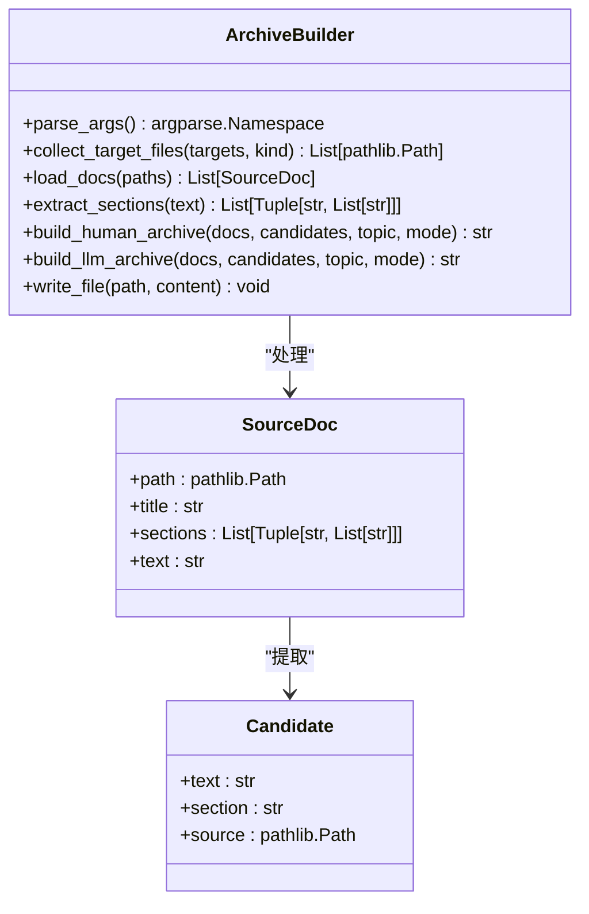

**图表来源**
- [altas-workflow/scripts/archive_builder.py:21-505](file://altas-workflow/scripts/archive_builder.py#L21-L505)

##### 核心功能特性

1. **多格式支持**：支持 spec、codemap 和混合模式的归档生成
2. **双视角输出**：生成 human 友好版本和 llm 可用版本
3. **智能关键词提取**：自动识别决策、结果、风险等关键信息
4. **来源追踪**：提供完整的来源文件和章节追踪
5. **主题推断**：根据目标自动推断归档主题

##### 归档模式

| 模式 | 描述 | 输出内容 |
|------|------|----------|
| `snapshot` | 快照模式 | 基于指定中间产物的即时归档 |
| `thematic` | 主题模式 | 基于主题的综合归档 |

**章节来源**
- [altas-workflow/scripts/archive_builder.py:1-505](file://altas-workflow/scripts/archive_builder.py#L1-L505)

#### 触发词同步验证器 (validate_aliases_sync.py)

触发词同步验证器确保 SKILL.md 中的 trigger_keywords 与 aliases.md 中的全局触发词词典保持同步。

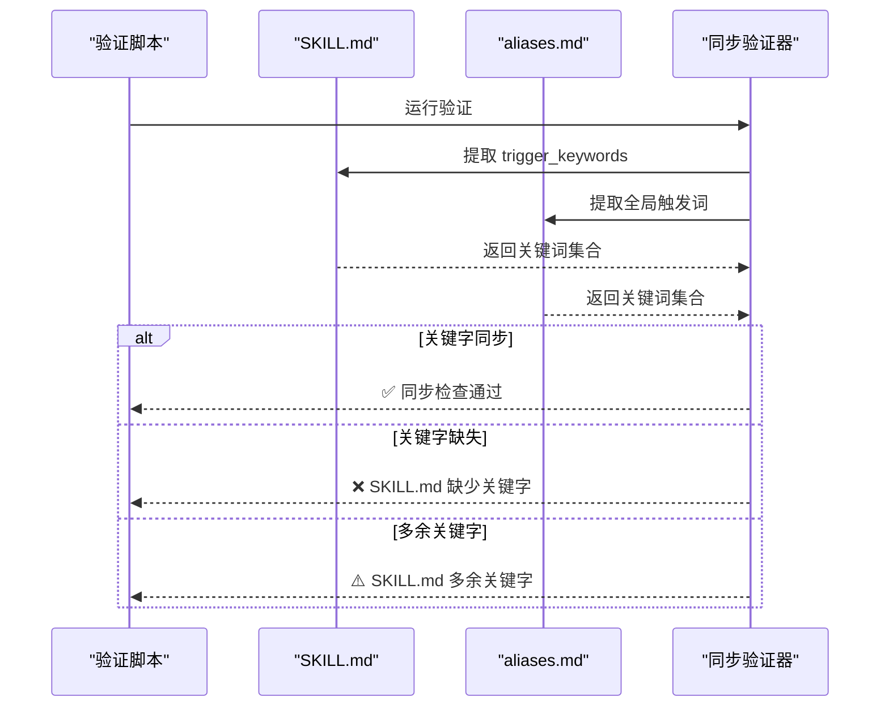

**图表来源**
- [altas-workflow/scripts/validate_aliases_sync.py:77-118](file://altas-workflow/scripts/validate_aliases_sync.py#L77-L118)

##### 验证流程

1. **提取 SKILL.md 关键字**：从 frontmatter 中解析 trigger_keywords
2. **提取 aliases.md 关键字**：解析全局触发词词典
3. **比较差异**：检测缺失和多余的触发词
4. **输出结果**：根据差异情况返回相应状态码

**章节来源**
- [altas-workflow/scripts/validate_aliases_sync.py:1-118](file://altas-workflow/scripts/validate_aliases_sync.py#L1-L118)

### 专用协议

#### RIPER-5 严格模式协议

RIPER-5 是一个严格的五阶段协议，要求 AI 在每个阶段都必须声明当前模式。

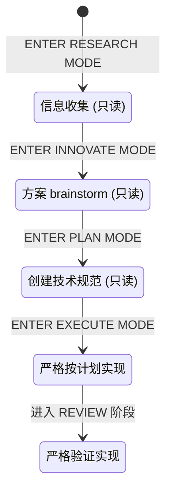

**图表来源**
- [altas-workflow/protocols/RIPER-5.md:25-187](file://altas-workflow/protocols/RIPER-5.md#L25-L187)

#### RIPER-DOC 文档专家协议

RIPER-DOC 是专门的文档撰写协议，包含四个阶段：

```mermaid
flowchart TD
A[ABSORB 阶段] --> B[OUTLINE 阶段]
B --> C[AUTHOR 阶段]
C --> D[FACT-CHECK 阶段]
A: 内容提取
B: 结构规划
C: 内容生成
D: 准确性验证
```

**图表来源**
- [altas-workflow/protocols/RIPER-DOC.md:9-66](file://altas-workflow/protocols/RIPER-DOC.md#L9-L66)

#### SDD-RIPER-DUAL-COOP 双模型协作协议

双模型协作协议定义了外部模型 (Architect) 和内部模型 (Executor/Scout) 的角色分工。

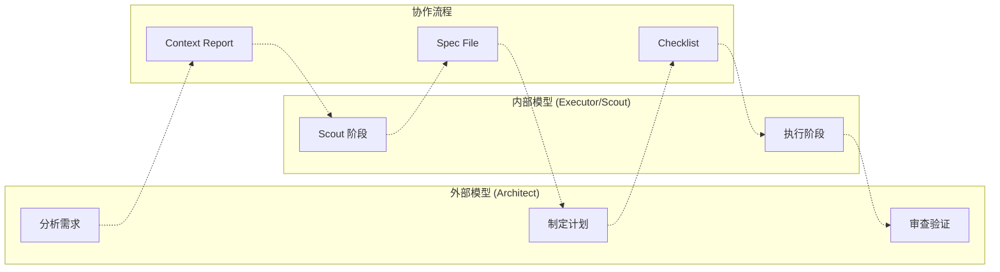

**图表来源**
- [altas-workflow/protocols/SDD-RIPER-DUAL-COOP.md:13-210](file://altas-workflow/protocols/SDD-RIPER-DUAL-COOP.md#L13-L210)

### 专业模式系统

#### 代码审查模式 (REVIEW)

REVIEW 模式是一个专门的代码审查专项协议，提供三种审查深度：

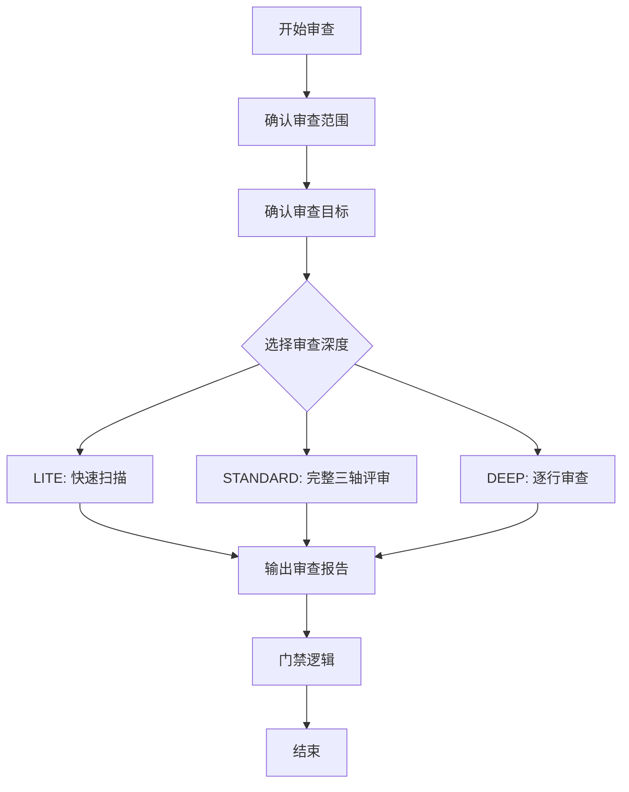

**图表来源**
- [altas-workflow/references/special-modes/review.md:1-L137]

##### 审查深度对比

| 深度 | 适用场景 | 审查范围 | 输出要求 |
|------|----------|----------|----------|
| **Lite** | 快速问题定位 | 高风险问题优先 | 简要问题清单 |
| **Standard** | 常规代码审查 | 三轴评审完整执行 | 标准审查报告 |
| **Deep** | 重要模块审查 | 逐行审查 + 重构建议 | 详细审查报告 |

**章节来源**
- [altas-workflow/references/special-modes/review.md:1-L137]

#### 测试模式 (TEST)

TEST 模式专注于测试专项工作，提供五种测试优先级：

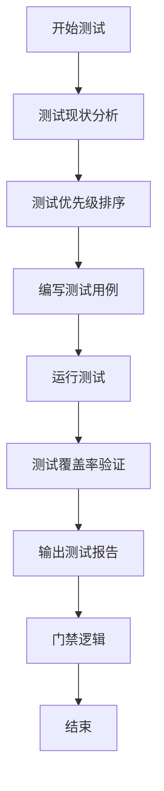

**图表来源**
- [altas-workflow/references/special-modes/test.md:1-L210]

##### 测试优先级矩阵

| 优先级 | 测试类型 | 说明 | 适用场景 |
|--------|----------|------|----------|
| **P0** | 核心逻辑测试 | 业务核心功能 | 必须覆盖，影响阻塞 |
| **P1** | 边界条件测试 | 极值/空值/非法输入 | 高优先级修复 |
| **P2** | 异常路径测试 | 错误处理/降级逻辑 | 建议修复 |
| **P3** | 集成测试 | 跨模块/跨系统交互 | 可选优化 |
| **P4** | 性能测试 | 响应时间/吞吐量 | 性能优化 |

**章节来源**
- [altas-workflow/references/special-modes/test.md:1-L210]

#### 重构模式 (REFACTOR)

REFACTOR 模式提供系统化的重构指导，强调 TDD 循环：

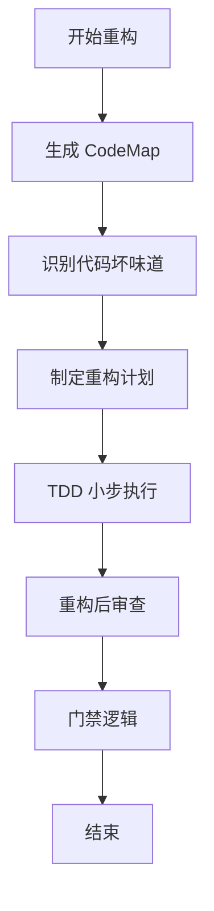

**图表来源**
- [altas-workflow/references/special-modes/refactor.md:1-L181]

##### 常见代码坏味道

| 坏味道类型 | 描述 | 重构策略 |
|------------|------|----------|
| **重复代码** | 相同/相似代码出现在多处 | 提取函数/提取公共模块 |
| **过长函数** | 函数超过 50 行 | 提取函数/分解为多个小函数 |
| **过大类** | 类超过 500 行或职责过多 | 拆分类/提取职责 |
| **过长参数列表** | 函数参数超过 5 个 | 引入参数对象/使用配置对象 |
| **过度耦合** | 模块间依赖复杂 | 引入接口/依赖注入 |
| **命名不清晰** | 变量/函数名不能表达意图 | 重命名 |
| **条件复杂** | 嵌套 if/switch 超过 3 层 | 提取条件函数/使用策略模式 |
| **数据簇** | 多个数据总是一起出现 | 封装为数据结构/类 |

**章节来源**
- [altas-workflow/references/special-modes/refactor.md:1-L181]

#### 性能优化模式 (PERF)

PERF 模式提供完整的性能优化流程，强调基准测试的重要性：

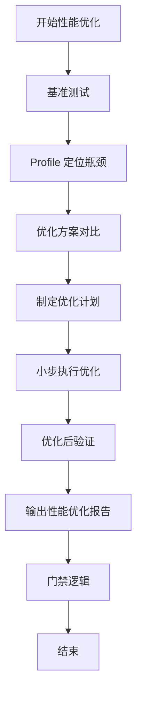

**图表来源**
- [altas-workflow/references/special-modes/perf.md:1-L234]

##### 性能优化策略

| 瓶颈类型 | 优化策略 | 工具推荐 |
|----------|----------|----------|
| **CPU 密集型** | 算法优化、缓存结果、并行计算、WebAssembly | Chrome DevTools, clinic.js, 0x |
| **I/O 密集型** | 批量请求、连接池、缓存、异步化 | wrk, k6, JMeter |
| **内存密集型** | 对象复用、流式处理、数据结构优化 | cProfile, py-spy, line_profiler |
| **锁竞争** | 无锁数据结构、细粒度锁、读写锁 | VisualVM, JProfiler, async-profiler |

**章节来源**
- [altas-workflow/references/special-modes/perf.md:1-L234]

#### 数据迁移模式 (MIGRATE)

MIGRATE 模式提供高风险迁移操作的完整指导：

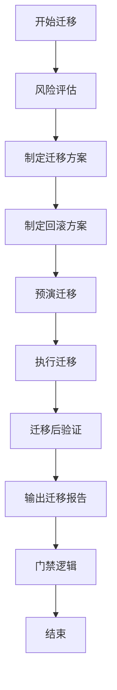

**图表来源**
- [altas-workflow/references/special-modes/migrate.md:1-L306]

##### 迁移方案对比

| 方案类型 | 适用场景 | 优点 | 缺点 |
|----------|----------|------|------|
| **一次性迁移** | 小数据量、允许停机 | 简单快速 | 停机时间长、风险集中 |
| **渐进式迁移** | 大数据量、不能停机 | 风险分散 | 复杂度高、需要双写 |
| **蓝绿迁移** | 关键业务、零容忍停机 | 可快速回滚 | 资源成本高 |

**章节来源**
- [altas-workflow/references/special-modes/migrate.md:1-L306]

### 超级能力 (Superpowers)

#### 测试驱动开发 (TDD)

TDD 铁律要求先写测试，再实现代码，最后重构优化。

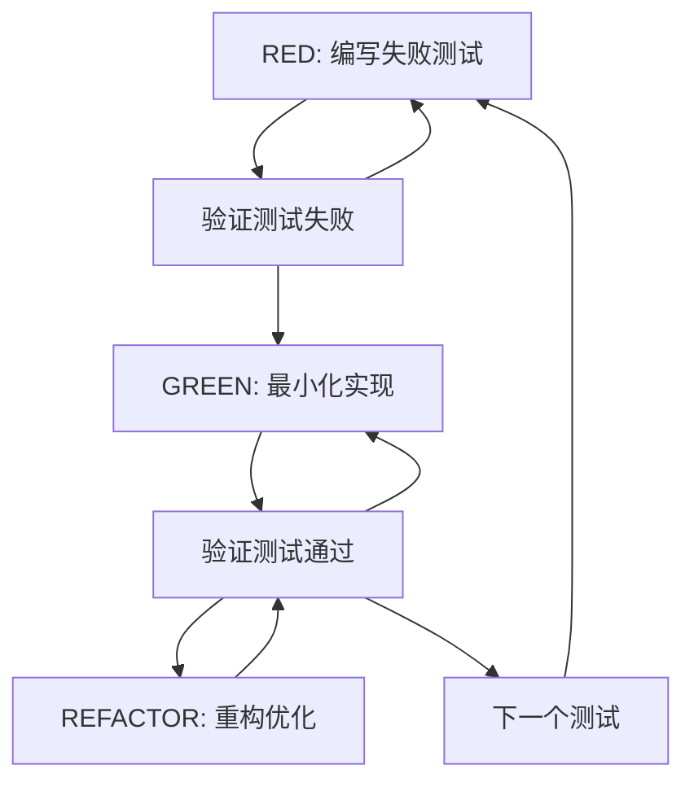

**图表来源**
- [altas-workflow/references/superpowers/test-driven-development/SKILL.md:47-69]

#### 系统化调试 (Systematic Debugging)

系统化调试包含四个阶段，必须严格按照顺序执行：

```mermaid
flowchart TD
PHASE1[Phase 1: 根因调查] --> PHASE2[Phase 2: 模式分析]
PHASE2 --> PHASE3[Phase 3: 假设与测试]
PHASE3 --> PHASE4[Phase 4: 实施修复]
PHASE1: 读取错误信息→重现问题→检查变更→收集证据
PHASE2: 寻找工作示例→对比参考→识别差异→理解依赖
PHASE3: 形成单一假设→最小化测试→验证结果→必要时重新分析
PHASE4: 创建失败测试→实施单一修复→验证修复→架构问题讨论
```

**图表来源**
- [altas-workflow/references/superpowers/systematic-debugging/SKILL.md:46-297]

#### 规划写作 (Writing Plans)

规划写作技能要求将复杂的多步骤任务分解为可执行的原子任务。

```mermaid
flowchart LR
A[需求分析] --> B[文件结构设计]
B --> C[任务粒度分解]
C --> D[任务结构定义]
D --> E[无占位符检查]
E --> F[执行交接]
B: 明确文件边界和接口
C: 2-5分钟可完成的原子任务
D: 完整的代码和命令示例
E: 无 TBD/TODO/类似 Task X
```

**图表来源**
- [altas-workflow/references/superpowers/writing-plans/SKILL.md:25-153]

### 规范模板

#### 完整 Spec 模板

完整 Spec 模板适用于中大型任务，包含八个主要章节：

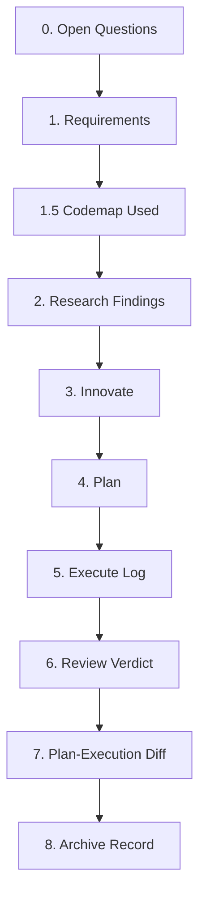

**图表来源**
- [altas-workflow/references/spec-driven-development/spec-template.md:7-297]

#### 轻量 Spec 模板

轻量 Spec 模板适用于小任务，包含关键要素但保持简洁：


**图表来源**
- [altas-workflow/references/checkpoint-driven/spec-lite-template.md:1-85]

**章节来源**
- [altas-workflow/README.md:351-396](file://altas-workflow/README.md#L351-L396)

## 依赖分析

### 参考资料索引系统

项目采用统一的参考资料索引系统，支持三种加载方式：

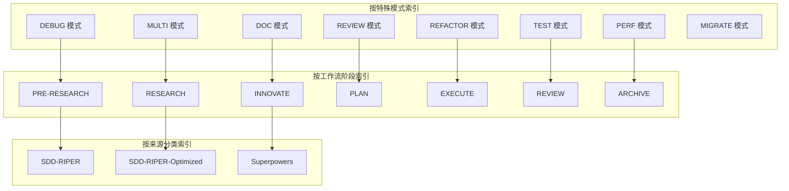

**图表来源**
- [altas-workflow/reference-index.md:39-274](file://altas-workflow/reference-index.md#L39-L274)

### 规模等级依赖

| 规模 | 必需文件 | 可选文件 |
|------|----------|----------|
| **XS** | 无 | 无 |
| **S** | `spec-lite-template.md` | `conventions.md` |
| **M** | `spec-template.md`、`commands.md`、`writing-plans/SKILL.md`、`test-driven-development/SKILL.md`、`verification-before-completion/SKILL.md`、`checkpoint-driven/modules.md` | 无 |
| **L** | 全部 M 文件 + `brainstorming/SKILL.md` + `subagent-driven-development/SKILL.md` + `dispatching-parallel-agents/SKILL.md` + `multi-project.md` + `archive-template.md` + `finishing-a-development-branch/SKILL.md` | 无 |

**章节来源**
- [altas-workflow/reference-index.md:239-266](file://altas-workflow/reference-index.md#L239-L266)

### 专业模式依赖关系

```mermaid
graph TB
subgraph "专业模式"
Review[REVIEW 模式] --> ReviewFiles[三轴评审模块]
Test[TEST 模式] --> TestFiles[TDD 执行协议]
Refactor[REFACTOR 模式] --> RefactorFiles[CodeMap 生成]
Perf[PERF 模式] --> PerfFiles[基准测试方法]
Migrate[MIGRATE 模式] --> MigrateFiles[风险评估方法]
end
subgraph "共享文件"
Shared1[requests-code-review/SKILL.md]
Shared2[receiving-code-review/SKILL.md]
Shared3[verification-before-completion/SKILL.md]
Shared4[systematic-debugging/SKILL.md]
Shared5[archive-template.md]
end
Review --> Shared1
Review --> Shared2
Test --> Shared3
Refactor --> Shared4
Perf --> Shared3
Perf --> Shared4
Migrate --> Shared4
Migrate --> Shared5
```

**图表来源**
- [altas-workflow/reference-index.md:130-170](file://altas-workflow/reference-index.md#L130-L170)

## 性能考虑

### 渐进式披露机制

ALTAS 采用渐进式披露机制，避免一次性加载所有参考资料：

1. **按需加载**：AI 只在命中场景时按需读取对应文件
2. **上下文管理**：通过 Done Contract 和 Resume Ready 机制控制上下文长度
3. **工具映射**：明确区分检索工具和修改工具，避免不必要的文件访问

### 检查点机制

每个步骤完成后，AI 必须输出标准化检查点，包含：
- 当前成果
- 预期产出  
- 下一步操作
- 升降级选项

### 并行执行优化

对于 L 规模任务，项目支持 Subagent 并行执行：
- 每个任务分配独立的 Subagent
- 两阶段 Review 确保质量
- 任务间最小耦合

### 专业模式的性能优化

专业模式通过以下方式提升性能：

1. **触发词优化**：每个专业模式都有专门的触发词，减少歧义
2. **文件组织优化**：专业模式文件独立存放，便于快速定位
3. **门禁逻辑优化**：针对特定场景的门禁逻辑，避免无效执行
4. **协作流程优化**：专业模式间的协作流程清晰，减少来回切换

## 故障排除指南

### 常见问题及解决方案

#### AI 一次性输出太多代码

**问题**：AI 跑完所有步骤，没有遵循检查点机制

**解决方案**：回复 "请停止，严格执行检查点机制，每次只推进一步。"

#### 触发词同步问题

**问题**：SKILL.md 与 aliases.md 中的触发词不一致

**解决方案**：运行 `python scripts/validate_aliases_sync.py` 进行同步验证

#### 归档生成失败

**问题**：archive_builder.py 报告 active/non-finalized specs 检测

**解决方案**：使用 `--allow-active-spec` 参数强制生成，或先完成 Spec

#### 上下文窗口不足

**问题**：AI 无法继续执行，提示上下文耗尽

**解决方案**：立即执行 Resume Ready，将状态写回 Spec 后再继续

#### 专业模式触发失败

**问题**：专业模式无法正确识别触发词

**解决方案**：
1. 检查触发词拼写是否正确
2. 确认使用的是最新版本的 aliases.md
3. 验证 SKILL.md 中的 trigger_keywords 是否包含该触发词

**章节来源**
- [altas-workflow/README.md:537-607](file://altas-workflow/README.md#L537-L607)
- [altas-workflow/SKILL.md:347-415](file://altas-workflow/SKILL.md#L347-L415)

## 结论

ALTAS Workflow 通过融合三大优秀工作流，建立了完整的 AI 原生研发体系。其核心价值体现在：

1. **工程化思维**：通过严格的门禁和检查点机制，确保代码质量和可维护性
2. **渐进式披露**：避免上下文污染，提高 AI 的工作效率
3. **自动化验证**：通过 TDD、系统化调试和三轴评审，确保交付质量
4. **知识沉淀**：通过 Archive 机制，将项目经验转化为可持续的知识资产
5. **专业化模式**：通过独立的专业化文档，提升维护性和针对性更新能力

项目的设计充分考虑了实际工程场景，既适合个人开发者，也适合团队协作。通过合理的规模评估和模式选择，可以在保证质量的前提下最大化开发效率。

## 附录

### 快速开始指南

1. **环境配置**：在项目根目录创建 `mydocs/` 目录
2. **安装 Skill**：将 `SKILL.md` 内容复制到各平台的 AI 规则中
3. **测试框架**：确保项目能一键运行测试
4. **触发词使用**：根据任务性质选择合适的触发词

### 版本历史

| 版本 | 日期 | 关键变更 |
|------|------|----------|
| **v4.0** | 2026-04-13 | 融合三大工作流，新增智能深度适配、进度可视化、按需加载 |
| **v1.0** | 2026-04-12 | 初始版本 |

**章节来源**
- [altas-workflow/README.md:610-626](file://altas-workflow/README.md#L610-L626)
- [altas-workflow/QUICKSTART.md:1-193](file://altas-workflow/QUICKSTART.md#L1-L193)