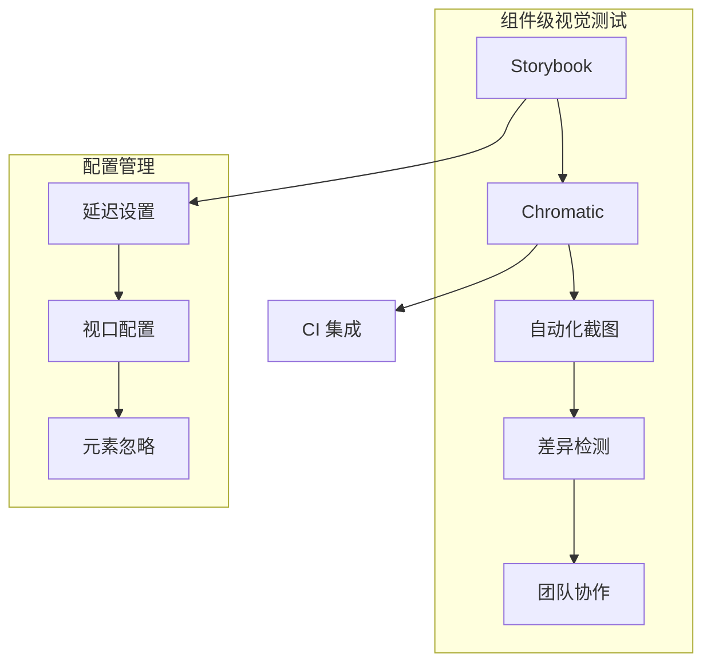
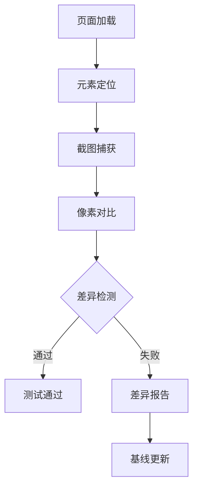
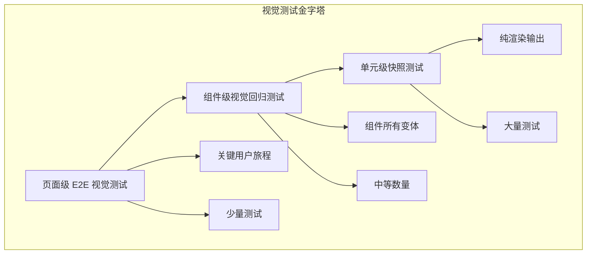
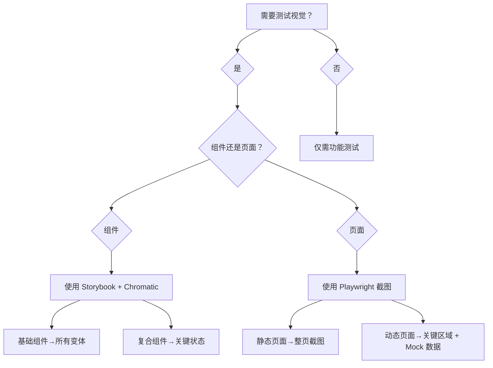
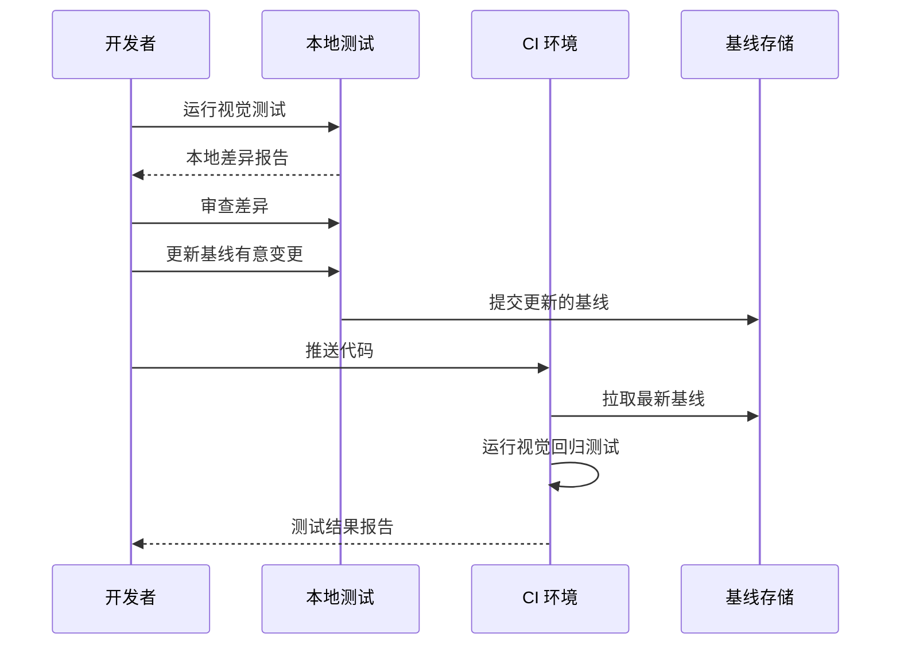
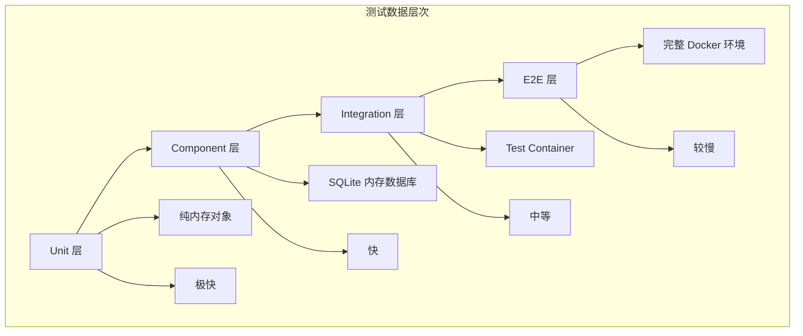
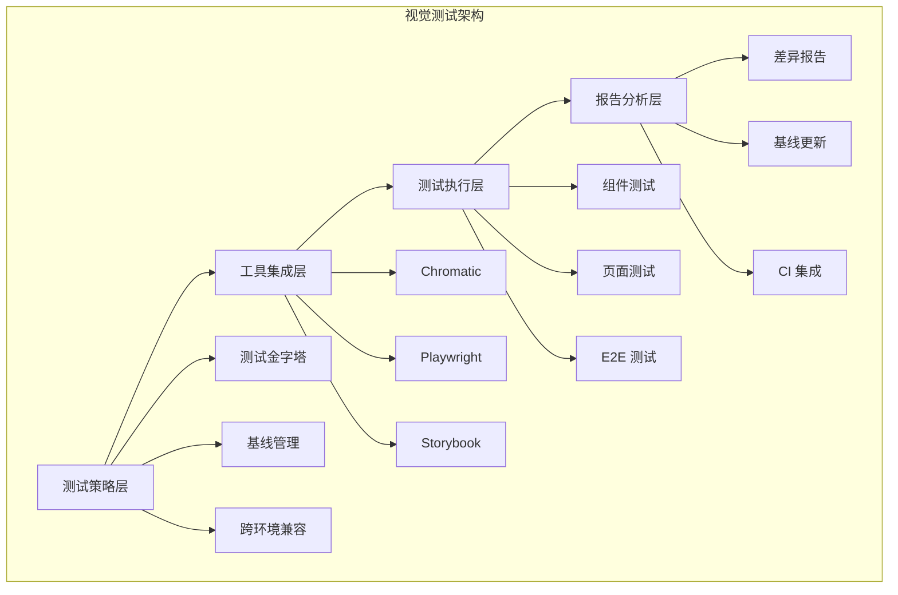
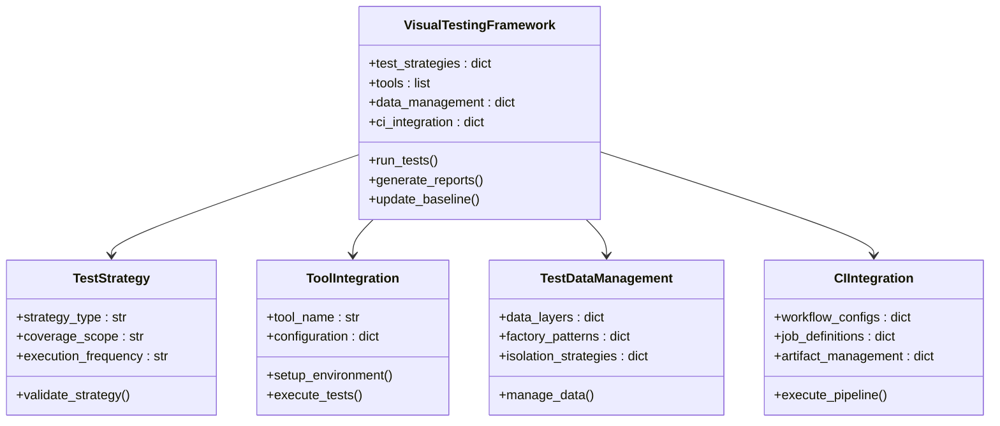

# 视觉测试框架

<cite>
**本文档引用的文件**
- [README_EN.md](file://README_EN.md)
- [altas-workflow/README.md](file://altas-workflow/README.md)
- [altas-workflow/SKILL.md](file://altas-workflow/SKILL.md)
- [altas-workflow/QUICKSTART.md](file://altas-workflow/QUICKSTART.md)
- [altas-workflow/reference-index.md](file://altas-workflow/reference-index.md)
- [altas-workflow/references/testing/visual-testing.md](file://altas-workflow/references/testing/visual-testing.md)
- [altas-workflow/references/testing/e2e-testing.md](file://altas-workflow/references/testing/e2e-testing.md)
- [altas-workflow/references/testing/pytest-patterns.md](file://altas-workflow/references/testing/pytest-patterns.md)
- [altas-workflow/references/testing/test-data-management.md](file://altas-workflow/references/testing/test-data-management.md)
- [altas-workflow/scripts/archive_builder.py](file://altas-workflow/scripts/archive_builder.py)
</cite>

## 目录
1. [项目概述](#项目概述)
2. [视觉测试核心概念](#视觉测试核心概念)
3. [工具选型与集成](#工具选型与集成)
4. [测试策略与实施](#测试策略与实施)
5. [E2E 测试框架](#e2e-测试框架)
6. [测试数据管理](#测试数据管理)
7. [CI/CD 集成](#cicd-集成)
8. [最佳实践与故障排查](#最佳实践与故障排查)
9. [架构设计与组件关系](#架构设计与组件关系)
10. [性能考虑与优化](#性能考虑与优化)
11. [故障排查指南](#故障排查指南)
12. [总结](#总结)

## 项目概述

视觉测试框架是 ALTAS Workflow 的重要组成部分，专注于 UI 外观一致性和视觉回归检测。该框架提供了完整的测试解决方案，涵盖组件级视觉测试、页面级视觉测试以及跨浏览器兼容性验证。

### 核心特性

- **多层测试金字塔**：从单元测试到组件测试再到 E2E 测试的完整覆盖
- **跨工具集成**：支持 Chromatic、Playwright、Storybook 等主流测试工具
- **自动化基线管理**：智能的视觉基线更新和版本控制
- **响应式设计验证**：全面的断点测试和设备兼容性验证
- **动态内容处理**：智能处理时间戳、随机数等不稳定因素

### 适用场景

- 组件外观一致性验证
- 页面布局稳定性检测
- 跨浏览器视觉兼容性
- 响应式设计测试
- 视觉回归监控

## 视觉测试核心概念

### 视觉即契约原则

视觉测试的核心理念是将 UI 外观视为用户体验的重要组成部分，需要像功能测试一样被严格验证。这一原则确保了视觉质量在整个开发周期中得到持续关注。

### 像素级精确检测

框架采用高精度的视觉对比算法，能够检测到微小的视觉变化，包括颜色差异、尺寸变化、位置偏移等。这种精确性对于维护一致的用户体验至关重要。

### 基线管理策略

有效的基线管理是视觉测试的关键。框架提供了智能的基线更新机制，确保有意的视觉变更能够被正确识别和记录，同时阻止意外的回归。

### 跨环境兼容性

支持在不同操作系统、浏览器和设备上进行视觉测试，确保应用在各种环境下的一致表现。

## 工具选型与集成

### 推荐工具组合

#### 组件级测试（Chromatic + Storybook）



**图表来源**
- [altas-workflow/references/testing/visual-testing.md:35-188](file://altas-workflow/references/testing/visual-testing.md#L35-L188)

#### 页面级测试（Playwright）



**图表来源**
- [altas-workflow/references/testing/visual-testing.md:191-357](file://altas-workflow/references/testing/visual-testing.md#L191-L357)

### 工具对比分析

| 工具 | 类型 | 适用场景 | 优点 | 缺点 |
|------|------|----------|------|------|
| **Chromatic** | 云托管 | Storybook 组件测试 | 零配置、CI 集成、团队协作 | 付费（有免费额度） |
| **Storybook Test Runner** | 本地 + CI | 组件交互 + 视觉 | 开源、与 Storybook 深度集成 | 需自行配置视觉对比 |
| **Percy** | 云托管 | 全栈视觉测试 | 支持多种框架、并行快照 | 付费 |
| **Applitools** | 云托管 | AI 驱动的视觉测试 | AI 忽略动态内容、跨平台 | 较贵 |
| **Playwright** | 本地 | E2E 视觉测试 | 内置截图对比、免费 | 需自行管理基线 |
| **Cypress + cypress-image-snapshot** | 本地 | E2E 视觉测试 | 社区插件丰富 | 配置较复杂 |

**章节来源**
- [altas-workflow/references/testing/visual-testing.md:17-32](file://altas-workflow/references/testing/visual-testing.md#L17-L32)

## 测试策略与实施

### 测试金字塔（视觉版）



**图表来源**
- [altas-workworkflow/references/testing/visual-testing.md:360-376](file://altas-workflow/references/testing/visual-testing.md#L360-L376)

### 测试范围决策树



**图表来源**
- [altas-workflow/references/testing/visual-testing.md:378-390](file://altas-workflow/references/testing/visual-testing.md#L378-L390)

### 基线更新工作流



**图表来源**
- [altas-workflow/references/testing/visual-testing.md:392-408](file://altas-workflow/references/testing/visual-testing.md#L392-L408)

**章节来源**
- [altas-workflow/references/testing/visual-testing.md:361-409](file://altas-workflow/references/testing/visual-testing.md#L361-L409)

## E2E 测试框架

### E2E 测试工具选型

#### Playwright（推荐）

Playwright 提供了强大的浏览器自动化能力，支持多种编程语言，具有出色的稳定性和易用性。

**核心优势**：
- 自动等待机制，避免硬编码 sleep
- 支持多种浏览器（Chromium、Firefox、WebKit）
- 内置截图和视频录制功能
- 强大的断言库

#### Cypress

Cypress 专为前端测试设计，提供了实时重载和时间旅行调试功能。

**适用场景**：
- 前端为主的 E2E 测试
- 开发者友好的调试体验
- 丰富的插件生态系统

**章节来源**
- [altas-workflow/references/testing/e2e-testing.md:42-61](file://altas-workflow/references/testing/e2e-testing.md#L42-L61)

### E2E 测试环境搭建

#### Playwright 安装配置

```bash
# 安装 Playwright
pip install playwright
playwright install

# 生成 playwright 配置
playwright codegen http://localhost:3000
```

#### pytest-playwright 集成

```python
# conftest.py
import pytest
from playwright.sync_api import Page, expect

@pytest.fixture
def base_url():
    return "http://localhost:3000"

@pytest.fixture
def logged_in_page(page: Page, base_url: str):
    """登录后的页面 fixture"""
    page.goto(f"{base_url}/login")
    page.fill("input[name='email']", "test@example.com")
    page.fill("input[name='password']", "password123")
    page.click("button[type='submit']")
    page.wait_for_url("**/dashboard")
    return page
```

**章节来源**
- [altas-workflow/references/testing/e2e-testing.md:64-142](file://altas-workflow/references/testing/e2e-testing.md#L64-L142)

### 测试稳定性保障

#### 智能等待机制

```python
# ❌ 避免硬编码等待
import time
time.sleep(5)

# ✅ 使用 Playwright 自动等待
page.click("button[type='submit']")  # 自动等待按钮可点击
page.wait_for_selector(".success-message")  # 等待元素出现
page.wait_for_url("**/dashboard")  # 等待 URL 变化

# ✅ 使用 expect 断言自动重试
from playwright.sync_api import expect
expect(page.get_by_text("Welcome")).to_be_visible(timeout=10000)
```

#### 测试隔离与重试

```python
# pytest.ini
[pytest]
addopts = --reruns 2 --reruns-delay 1
markers =
    e2e: End-to-end tests (slow, run in CI only)
    flaky: Known flaky tests (investigate and fix)

# 单个测试重试
@pytest.mark.flaky(reruns=3, reruns_delay=2)
def test_checkout_flow(page: Page):
    ...
```

**章节来源**
- [altas-workflow/references/testing/e2e-testing.md:220-281](file://altas-workflow/references/testing/e2e-testing.md#L220-L281)

## 测试数据管理

### 测试数据层次架构



**图表来源**
- [altas-workflow/references/testing/test-data-management.md:18-40](file://altas-workflow/references/testing/test-data-management.md#L18-L40)

### Factory Boy 集成

#### 基础 Factory 定义

```python
# tests/factories.py
import factory
from faker import Faker
from datetime import datetime, timedelta
from myapp.models import User, Order, Product

fake = Faker()

class UserFactory(factory.Factory):
    """用户工厂"""
    class Meta:
        model = User

    id = factory.Sequence(lambda n: n + 1)
    username = factory.LazyFunction(fake.user_name)
    email = factory.LazyFunction(fake.email)
    full_name = factory.LazyFunction(fake.name)
    is_active = True
    created_at = factory.LazyFunction(datetime.utcnow)
```

#### 高级 Factory 模式

```python
class UserFactory(factory.Factory):
    class Meta:
        model = User
    
    account_type = "regular"
    
    # 根据类型动态设置权限
    @factory.lazy_attribute
    def permissions(self):
        if self.account_type == "admin":
            return ["read", "write", "delete", "manage_users"]
        elif self.account_type == "premium":
            return ["read", "write"]
        else:
            return ["read"]

class AdminUserFactory(UserFactory):
    """管理员子工厂"""
    account_type = "admin"
    email = factory.LazyFunction(lambda: f"admin_{fake.user_name()}@example.com")
```

**章节来源**
- [altas-workflow/references/testing/test-data-management.md:43-253](file://altas-workflow/references/testing/test-data-management.md#L43-L253)

### 并发测试数据处理

#### 并发安全的用户工厂

```python
import os

def get_worker_id():
    """获取当前 pytest-xdist worker ID"""
    return os.environ.get("PYTEST_XDIST_WORKER", "gw0")

class ConcurrentSafeUserFactory(UserFactory):
    """并发安全的用户工厂"""
    
    @factory.lazy_attribute
    def username(self):
        worker_id = get_worker_id()
        return f"{fake.user_name()}_{worker_id}_{fake.random_int(min=1000, max=9999)}"
```

**章节来源**
- [altas-workflow/references/testing/test-data-management.md:581-642](file://altas-workflow/references/testing/test-data-management.md#L581-L642)

## CI/CD 集成

### GitHub Actions 完整配置

#### Chromatic 组件测试

```yaml
name: Visual Tests - Chromatic

on:
  push:
    branches: [main]
  pull_request:

jobs:
  chromatic:
    runs-on: ubuntu-latest
    steps:
      - uses: actions/checkout@v4
        with:
          fetch-depth: 0
      
      - uses: actions/setup-node@v4
        with:
          node-version: '18'
          cache: 'npm'
      
      - run: npm ci
      
      - name: Run Chromatic
        uses: chromaui/action@latest
        with:
          projectToken: ${{ secrets.CHROMATIC_PROJECT_TOKEN }}
          exitZeroOnChanges: true
```

#### Playwright 页面级测试

```yaml
name: Visual Tests - Playwright

on:
  push:
    branches: [main]
  pull_request:

jobs:
  playwright-visual:
    runs-on: ubuntu-latest
    steps:
      - uses: actions/checkout@v4
      
      - uses: actions/setup-node@v4
        with:
          node-version: '18'
          cache: 'npm'
      
      - run: npm ci
      
      - name: Install Playwright
        run: npx playwright install --with-deps
      
      - name: Build app
        run: npm run build
      
      - name: Start server
        run: npm start &
      
      - name: Wait for server
        run: npx wait-on http://localhost:3000
      
      - name: Run visual tests
        run: npx playwright test tests/visual/
      
      - name: Upload report
        if: failure()
        uses: actions/upload-artifact@v4
        with:
          name: visual-test-results
          path: |
            test-results/
            tests/visual/__snapshots__/
```

**章节来源**
- [altas-workflow/references/testing/visual-testing.md:464-535](file://altas-workflow/references/testing/visual-testing.md#L464-L535)

## 最佳实践与故障排查

### 视觉测试最佳实践

#### DO ✅ 建议的做法

- **组件隔离**：使用 Storybook 隔离测试组件，避免页面级干扰
- **确定性数据**：使用固定数据，避免随机内容导致误报
- **聚焦测试**：一个测试验证一个视觉状态
- **跨浏览器**：至少在 Chromium、Firefox、WebKit 中测试
- **响应式**：测试关键断点（mobile、tablet、desktop）

#### DON'T ❌ 避免的做法

- **测试动态内容**：时间、随机数、动画等不稳定内容
- **过度测试**：不需要为每个像素测试，关注关键视觉元素
- **忽略基线更新**：视觉变更是正常的，及时更新基线
- **仅依赖视觉**：视觉测试补充而非替代功能测试

### 常见问题与解决方案

| 问题 | 原因 | 解决方案 |
|------|------|----------|
| 字体渲染差异 | 系统字体不同 | 使用 web fonts 或指定字体 |
| 图片加载不稳定 | 外部 CDN | Mock 图片或使用本地资源 |
| 动画导致差异 | 截图时机不一致 | 禁用动画或等待动画完成 |
| 滚动条差异 | 操作系统差异 | 统一滚动条样式或隐藏 |
| 抗锯齿差异 | 浏览器渲染差异 | 增加阈值或使用相同浏览器 |

### 调试技巧

```bash
# 查看截图差异
npx playwright show-report

# 仅运行失败的测试
npx playwright test --last-failed

# 生成新基线（谨慎使用）
npx playwright test --update-snapshots

# 对比特定测试
npx playwright test button.spec.ts --debug
```

**章节来源**
- [altas-workflow/references/testing/visual-testing.md:539-566](file://altas-workflow/references/testing/visual-testing.md#L539-L566)

## 架构设计与组件关系

### 整体架构图



**图表来源**
- [altas-workflow/references/testing/visual-testing.md:1-584](file://altas-workflow/references/testing/visual-testing.md#L1-L584)

### 组件交互关系



**图表来源**
- [altas-workflow/references/testing/visual-testing.md:1-584](file://altas-workflow/references/testing/visual-testing.md#L1-L584)

**章节来源**
- [altas-workflow/references/testing/visual-testing.md:1-584](file://altas-workflow/references/testing/visual-testing.md#L1-L584)

## 性能考虑与优化

### 性能优化策略

#### 1. 惰性加载优化

```python
class LazyOrderFactory(factory.Factory):
    class Meta:
        model = Order
    
    # ❌ 每次 create 都生成
    description = factory.LazyFunction(
        lambda: fake.paragraph(nb_sentences=5)  # 每次都执行
    )
    
    # ✅ 只在访问时生成
    lazy_description = factory.LazyAttribute(
        lambda o: fake.paragraph(nb_sentences=5)  # 仅当 .lazy_description 被访问时
    )
```

#### 2. 批量预生成

```python
@pytsest.fixture(scope="session")
def product_pool():
    """预生成产品池，整个会话复用"""
    return ProductFactory.build_batch(size=100)

@pytsest.fixture
def random_products(product_pool):
    """从池中随机抽取"""
    import random
    return random.sample(product_pool, k=5)
```

#### 3. 数据库级别优化

```python
# pytest.ini
[pytest]
addopts =
    --tb=short
    -q
# 以下选项根据项目调整：
# --forked  # 每个测试独立进程（最彻底隔离）
# -n auto   # 并行执行（最快但需要处理并发）
```

### 测试执行优化

#### 并行执行策略

```python
# pytest.ini
[pytest]
addopts = --dist=loadscope --tx=popen//python=python3.11

# 标记串行执行的关键测试
@pytest.mark.xdist_group("serial")
def test_requires_serial_execution():
    """标记为串行执行，避免并发冲突"""
    ...
```

## 故障排查指南

### 常见问题诊断

#### 1. 测试不稳定问题

**症状**：测试结果不稳定，时好时坏

**诊断步骤**：
1. 检查是否存在硬编码的 sleep 语句
2. 验证是否有未处理的异步操作
3. 确认测试数据的隔离性
4. 检查浏览器兼容性问题

**解决方案**：
- 使用智能等待替代硬编码等待
- 实现适当的测试隔离机制
- 使用固定的时间戳和随机数
- 确保测试环境的一致性

#### 2. 基线更新问题

**症状**：基线更新失败或更新不正确

**诊断步骤**：
1. 检查差异报告的准确性
2. 验证基线文件的版本控制
3. 确认更新权限和流程
4. 检查 CI 环境的配置

**解决方案**：
- 实施严格的基线更新流程
- 使用自动化工具进行基线管理
- 建立基线变更的审批机制
- 确保基线文件的版本控制

#### 3. 跨浏览器兼容性问题

**症状**：在某些浏览器上测试失败

**诊断步骤**：
1. 检查浏览器版本和配置
2. 验证 CSS 兼容性
3. 确认 JavaScript 支持
4. 检查第三方库的兼容性

**解决方案**：
- 使用浏览器兼容性测试工具
- 实施渐进式增强策略
- 建立多浏览器测试矩阵
- 采用兼容性前缀和 polyfill

### 调试工具和技巧

#### 1. 日志和监控

```python
import logging
import pytest

# 配置测试日志
logging.basicConfig(level=logging.INFO)
logger = logging.getLogger(__name__)

def test_with_debugging():
    logger.info("开始测试")
    # 测试代码
    logger.debug("中间状态")
    logger.info("测试完成")
```

#### 2. 断点调试

```python
import pytest

@pytest.mark.debug
def test_with_breakpoint():
    breakpoint()  # 设置断点进行调试
    # 测试代码
```

#### 3. 性能分析

```bash
# 使用 pytest-benchmark 进行性能测试
pytest --benchmark-only

# 生成性能报告
pytest --benchmark-json=benchmark.json
```

**章节来源**
- [altas-workflow/references/testing/visual-testing.md:539-584](file://altas-workflow/references/testing/visual-testing.md#L539-L584)

## 总结

视觉测试框架为现代 Web 应用提供了全面的视觉质量保证解决方案。通过集成多种测试工具和策略，该框架能够：

### 核心价值

1. **质量保证**：确保 UI 外观的一致性和稳定性
2. **效率提升**：自动化测试流程，减少人工干预
3. **团队协作**：提供可视化的测试结果和报告
4. **成本控制**：通过早期发现问题降低修复成本

### 技术优势

- **多层测试覆盖**：从组件到页面的完整测试金字塔
- **智能基线管理**：自动化的视觉基线更新和版本控制
- **跨环境兼容**：支持多种浏览器和设备的测试
- **CI/CD 集成**：无缝集成到现有的持续集成流程

### 未来发展方向

1. **AI 驱动的测试**：利用机器学习提高测试智能化水平
2. **云原生测试**：基于容器和微服务的测试架构
3. **实时监控**：生产环境的实时视觉质量监控
4. **测试即服务**：提供可扩展的视觉测试服务

通过遵循本文档的最佳实践和指导原则，开发团队可以建立高效、可靠的视觉测试体系，确保应用的视觉质量和用户体验达到最高标准。