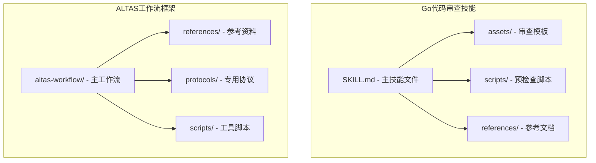
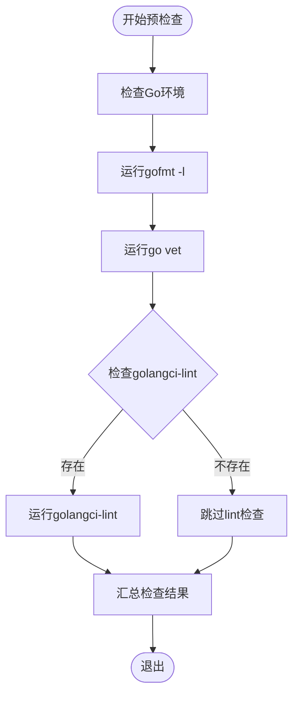
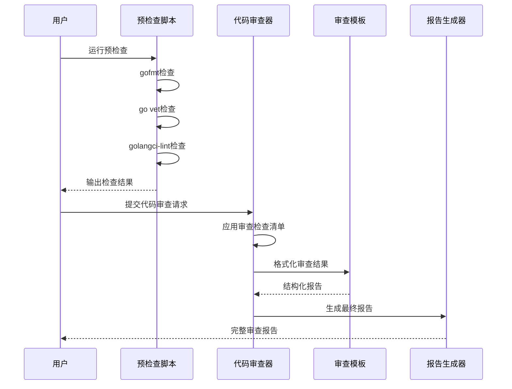
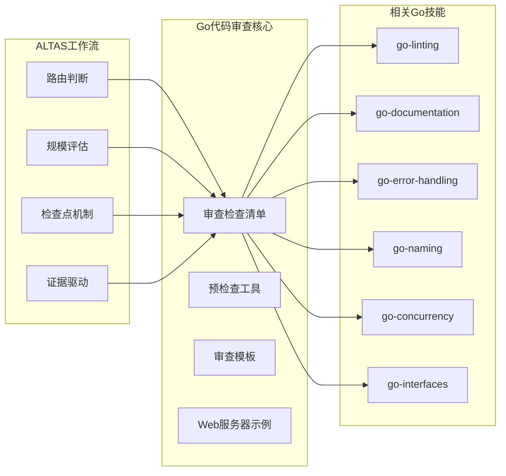
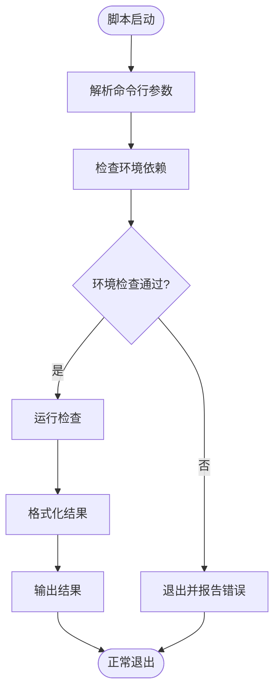
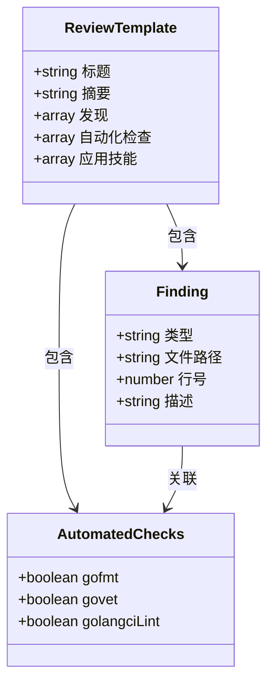
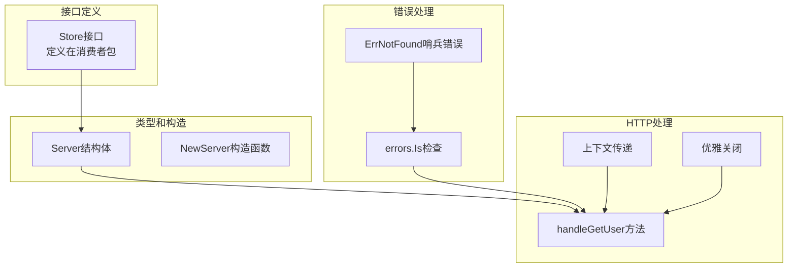
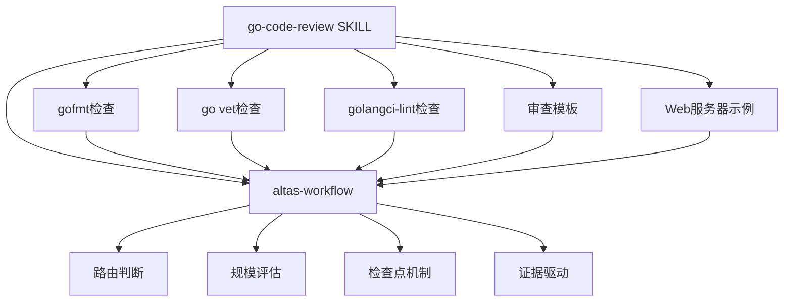

# Go代码审查技能

<cite>
**本文档引用的文件**
- [SKILL.md](file://.agents/skills/go-code-review/SKILL.md)
- [review-template.md](file://.agents/skills/go-code-review/assets/review-template.md)
- [pre-review.sh](file://.agents/skills/go-code-review/scripts/pre-review.sh)
- [WEB-SERVER.md](file://.agents/skills/go-code-review/references/WEB-SERVER.md)
- [SKILL.md](file://altas-workflow/SKILL.md)
- [QUICKSTART.md](file://altas-workflow/QUICKSTART.md)
- [review-template.md](file://altas-workflow/references/superpowers/go-code-review/assets/review-template.md)
- [pre-review.sh](file://altas-workflow/references/superpowers/go-code-review/scripts/pre-review.sh)
- [WEB-SERVER.md](file://altas-workflow/references/superpowers/go-code-review/references/WEB-SERVER.md)
</cite>

## 目录
1. [简介](#简介)
2. [项目结构](#项目结构)
3. [核心组件](#核心组件)
4. [架构概览](#架构概览)
5. [详细组件分析](#详细组件分析)
6. [依赖分析](#依赖分析)
7. [性能考虑](#性能考虑)
8. [故障排除指南](#故障排除指南)
9. [结论](#结论)

## 简介

Go代码审查技能是一个专门设计用于审查Go语言代码质量和风格的AI助手系统。该技能基于ALTAS工作流框架，提供了完整的代码审查流程，包括自动化预检查、人工审查和最佳实践指导。

该技能的核心目标是确保Go代码符合社区标准和最佳实践，涵盖格式化、文档注释、错误处理、命名约定、并发安全等多个方面。通过系统化的审查流程，帮助开发者提高代码质量，减少潜在问题。

## 项目结构

该项目采用模块化设计，主要包含以下核心组件：

**图表来源**
- [.agents/skills/go-code-review/SKILL.md:1-184](file://.agents/skills/go-code-review/SKILL.md#L1-L184)
- [altas-workflow/SKILL.md:1-543](file://altas-workflow/SKILL.md#L1-L543)

**章节来源**
- [.agents/skills/go-code-review/SKILL.md:1-184](file://.agents/skills/go-code-review/SKILL.md#L1-L184)
- [altas-workflow/SKILL.md:1-543](file://altas-workflow/SKILL.md#L1-L543)

## 核心组件

### 审查检查清单

Go代码审查技能提供了一个全面的检查清单，涵盖了Go语言开发的各个方面：

| 审查类别 | 检查要点 | 相关技能 |
|---------|---------|---------|
| **格式化** | 使用gofmt或goimports进行代码格式化 | go-linting |
| **文档** | 注释完整句子、包文档、命名结果参数 | go-documentation |
| **错误处理** | 避免丢弃错误、错误字符串格式、内联错误 | go-error-handling |
| **命名** | MixedCaps命名、缩写一致性、变量命名 | go-naming |
| **并发** | goroutine生命周期、同步函数、上下文使用 | go-concurrency |
| **接口** | 接口位置、避免过早接口、接收者类型 | go-interfaces |

### 自动化预检查工具

预检查脚本提供了三种运行模式：

**图表来源**
- [.agents/skills/go-code-review/scripts/pre-review.sh:69-107](file://.agents/skills/go-code-review/scripts/pre-review.sh#L69-L107)

**章节来源**
- [.agents/skills/go-code-review/SKILL.md:154-166](file://.agents/skills/go-code-review/SKILL.md#L154-L166)
- [.agents/skills/go-code-review/scripts/pre-review.sh:1-247](file://.agents/skills/go-code-review/scripts/pre-review.sh#L1-L247)

## 架构概览

### 整体工作流程

**图表来源**
- [.agents/skills/go-code-review/SKILL.md:13-24](file://.agents/skills/go-code-review/SKILL.md#L13-L24)
- [.agents/skills/go-code-review/scripts/pre-review.sh:154-244](file://.agents/skills/go-code-review/scripts/pre-review.sh#L154-L244)

### 技能集成架构

**图表来源**
- [altas-workflow/SKILL.md:45-50](file://altas-workflow/SKILL.md#L45-L50)
- [.agents/skills/go-code-review/SKILL.md:175-184](file://.agents/skills/go-code-review/SKILL.md#L175-L184)

**章节来源**
- [altas-workflow/SKILL.md:40-50](file://altas-workflow/SKILL.md#L40-L50)
- [.agents/skills/go-code-review/SKILL.md:1-184](file://.agents/skills/go-code-review/SKILL.md#L1-L184)

## 详细组件分析

### 审查检查清单详解

#### 格式化检查
格式化是代码审查的基础要求，确保代码风格的一致性：

- **gofmt检查**：使用`gofmt -d .`检测未格式化的文件
- **goimports检查**：确保导入语句的正确排序和管理
- **自动修复**：推荐使用`gofmt -w`或`goimports -w`自动修复

#### 文档注释检查
良好的文档注释是高质量代码的重要标志：

- **注释完整性**：注释应为完整句子，以被描述的名称开头
- **包文档**：包注释应紧邻包声明，无空行分隔
- **命名结果参数**：仅在能澄清含义时使用，避免滥用裸返回

#### 错误处理检查
错误处理是Go语言的核心特性之一：

- **错误处理**：避免丢弃错误（使用_），必须处理、返回或恐慌
- **错误字符串**：使用小写，除非是专有名词或首字母缩写
- **内联错误**：避免使用魔法值（-1、""、nil），使用多返回值

**章节来源**
- [.agents/skills/go-code-review/SKILL.md:27-135](file://.agents/skills/go-code-review/SKILL.md#L27-L135)

### 预检查脚本分析

#### 功能特性
预检查脚本提供了灵活的运行选项：

| 选项 | 功能 | 默认值 |
|------|------|--------|
| `--json` | 以JSON格式输出结果 | false |
| `--force` | 即使未安装golangci-lint也运行 | false |
| `--limit N` | 限制每节输出项目数量 | 0（无限制） |
| `-h, --help` | 显示帮助信息 | - |
| `-v, --version` | 显示版本信息 | - |

#### 错误处理机制
脚本实现了完善的错误处理：

**图表来源**
- [.agents/skills/go-code-review/scripts/pre-review.sh:55-65](file://.agents/skills/go-code-review/scripts/pre-review.sh#L55-L65)
- [.agents/skills/go-code-review/scripts/pre-review.sh:109-113](file://.agents/skills/go-code-review/scripts/pre-review.sh#L109-L113)

**章节来源**
- [.agents/skills/go-code-review/scripts/pre-review.sh:1-247](file://.agents/skills/go-code-review/scripts/pre-review.sh#L1-L247)

### 审查模板系统

#### 模板结构
审查模板提供了标准化的报告格式：

**图表来源**
- [.agents/skills/go-code-review/assets/review-template.md:1-24](file://.agents/skills/go-code-review/assets/review-template.md#L1-L24)

#### 分类系统
模板采用三层分类系统：

1. **Must Fix**：必须修复的关键问题
2. **Should Fix**：建议修复的改进问题  
3. **Nits**：轻微的样式建议

**章节来源**
- [.agents/skills/go-code-review/assets/review-template.md:1-24](file://.agents/skills/go-code-review/assets/review-template.md#L1-L24)

### Web服务器综合示例

#### 示例架构
Web服务器示例展示了Go技能的实际应用：

**图表来源**
- [.agents/skills/go-code-review/references/WEB-SERVER.md:23-104](file://.agents/skills/go-code-review/references/WEB-SERVER.md#L23-L104)

#### 技能应用矩阵
示例展示了多种Go技能的综合应用：

| 技能领域 | 具体应用 | 价值 |
|---------|---------|------|
| 接口设计 | 在消费者包定义Store接口 | 清晰的依赖边界 |
| 命名约定 | MixedCaps、接收者缩写 | 代码可读性 |
| 错误处理 | 哨兵错误、errors.Is | 一致的错误处理 |
| 上下文使用 | 从请求派生上下文 | 生命周期管理 |
| 并发控制 | 清晰的goroutine生命周期 | 资源管理 |
| 防御编程 | defer清理、time.Duration | 代码健壮性 |
| 包管理 | 仅在main包退出 | 符合Go惯例 |

**章节来源**
- [.agents/skills/go-code-review/references/WEB-SERVER.md:1-120](file://.agents/skills/go-code-review/references/WEB-SERVER.md#L1-L120)

## 依赖分析

### 外部依赖

| 依赖项 | 版本要求 | 用途 | 依赖关系 |
|--------|----------|------|----------|
| Go | 1.21+ | 语言运行时 | 必需 |
| gofmt | - | 代码格式化 | 内置工具 |
| go vet | - | 静态分析 | 内置工具 |
| golangci-lint | 可选 | 高级静态分析 | 可选 |
| Bash | 4.0+ | 脚本执行 | 系统工具 |

### 内部依赖关系

**图表来源**
- [.agents/skills/go-code-review/SKILL.md:5-8](file://.agents/skills/go-code-review/SKILL.md#L5-L8)
- [altas-workflow/SKILL.md:1-13](file://altas-workflow/SKILL.md#L1-L13)

**章节来源**
- [.agents/skills/go-code-review/SKILL.md:5-8](file://.agents/skills/go-code-review/SKILL.md#L5-L8)
- [altas-workflow/SKILL.md:1-13](file://altas-workflow/SKILL.md#L1-L13)

## 性能考虑

### 预检查性能优化

1. **增量检查**：仅检查修改的文件，而非整个项目
2. **并行执行**：golangci-lint支持并行分析
3. **缓存机制**：利用Go工具链的内置缓存
4. **输出限制**：通过--limit参数控制输出量

### 审查效率提升

1. **自动化优先**：优先使用自动化工具检测机械错误
2. **模板化报告**：标准化的审查报告格式
3. **分类系统**：三层分类帮助优先处理关键问题
4. **JSON输出**：支持机器可读的结构化输出

## 故障排除指南

### 常见问题及解决方案

#### 环境问题
- **Go未安装**：确保Go 1.21+正确安装并加入PATH
- **gofmt未找到**：检查Go工具链完整性
- **golangci-lint未安装**：使用--force选项跳过lint检查

#### 检查失败处理
- **gofmt失败**：运行`gofmt -w`自动修复
- **go vet失败**：根据具体错误信息修正代码
- **golangci-lint失败**：检查配置文件和依赖项

#### 输出格式问题
- **JSON输出**：使用--json选项获取结构化结果
- **输出过多**：使用--limit参数限制输出数量
- **编码问题**：确保终端支持UTF-8字符集

**章节来源**
- [.agents/skills/go-code-review/scripts/pre-review.sh:69-107](file://.agents/skills/go-code-review/scripts/pre-review.sh#L69-L107)
- [.agents/skills/go-code-review/scripts/pre-review.sh:114-176](file://.agents/skills/go-code-review/scripts/pre-review.sh#L114-L176)

## 结论

Go代码审查技能提供了一个完整、系统化的代码质量保证框架。通过结合自动化工具和人工审查，该技能能够：

1. **提高代码质量**：通过全面的检查清单确保代码符合Go语言最佳实践
2. **提升开发效率**：自动化预检查减少重复劳动
3. **保证一致性**：标准化的审查流程和报告格式
4. **促进团队协作**：基于证据的审查过程和清晰的分类系统

该技能不仅适用于个人开发者，更适用于团队协作场景，通过统一的审查标准和流程，帮助团队建立高质量的Go代码开发规范。结合ALTAS工作流框架，该技能能够在更大范围内发挥作用，支持从个人项目到企业级应用的各类Go开发任务。