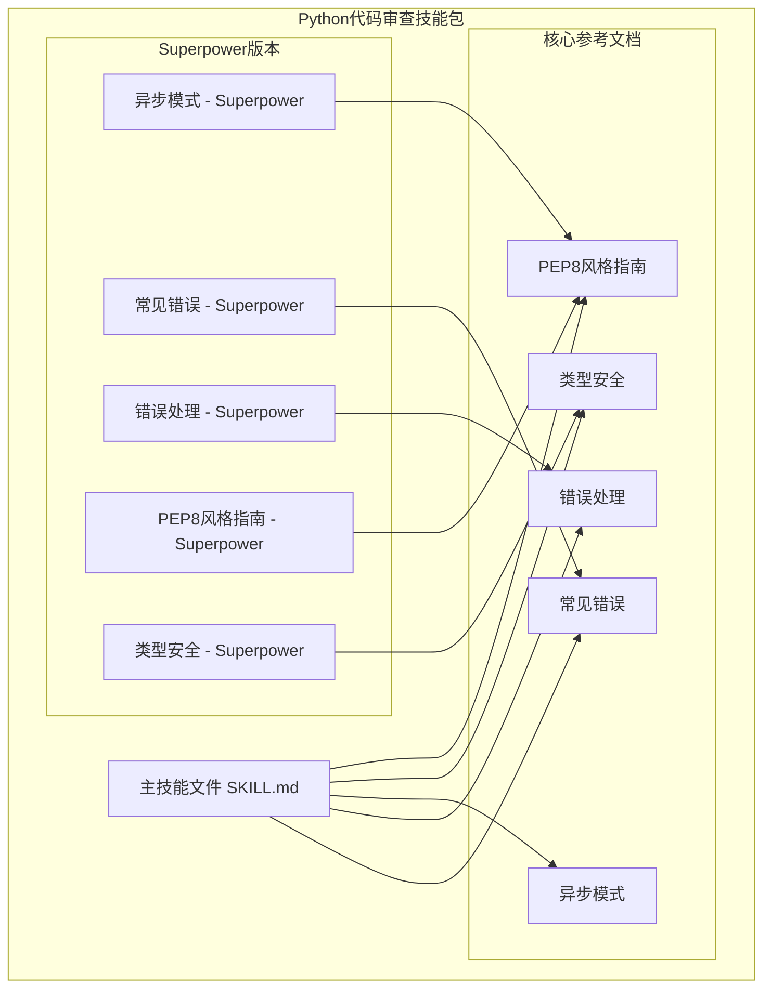
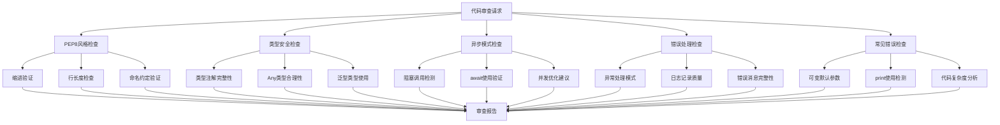
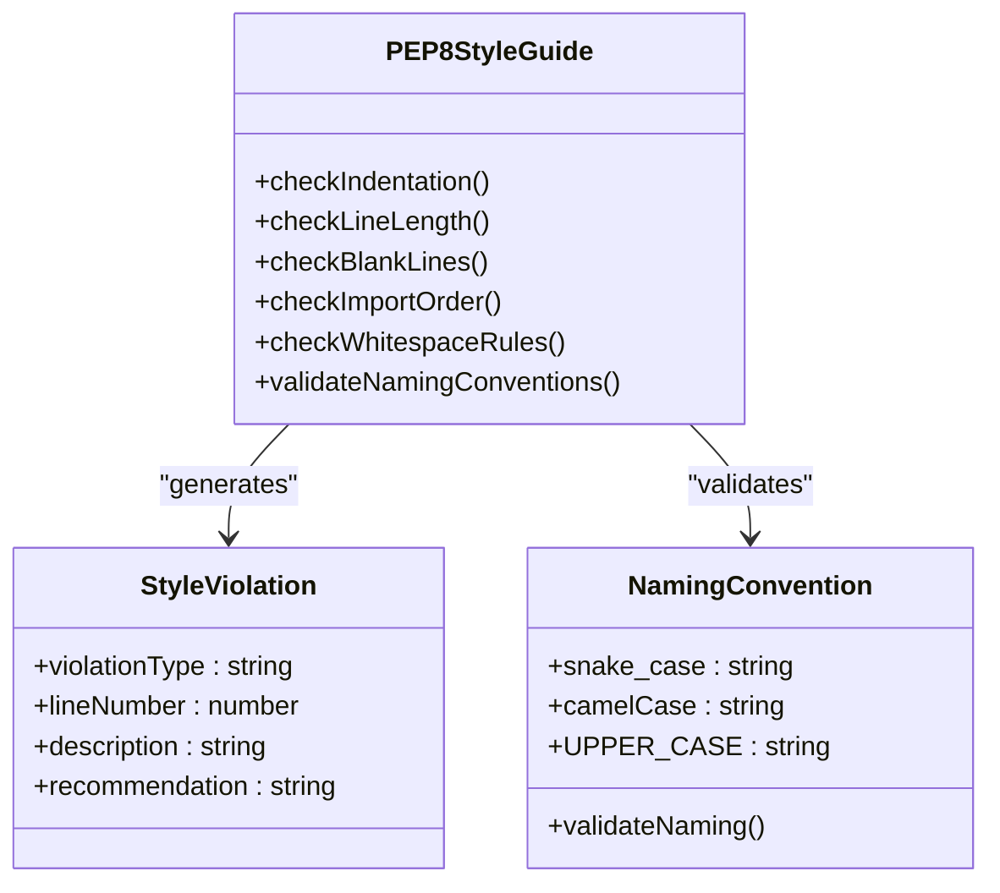
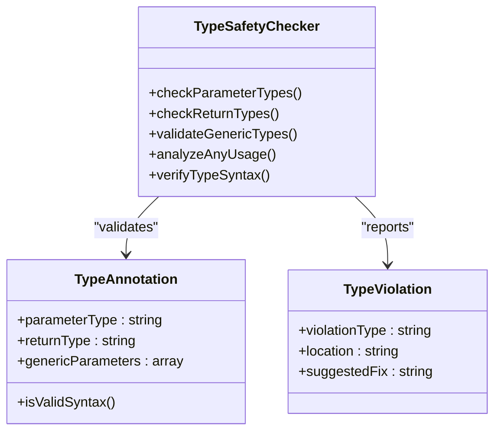
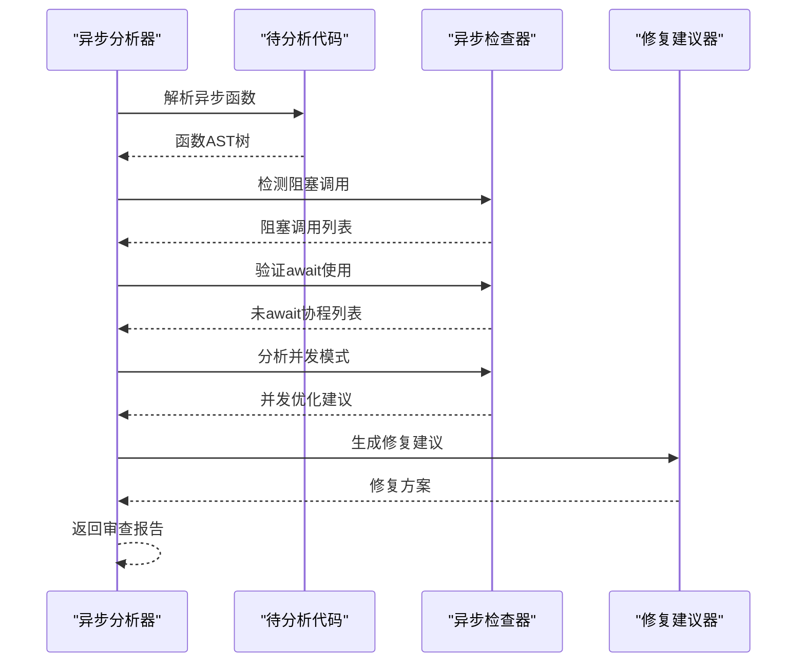
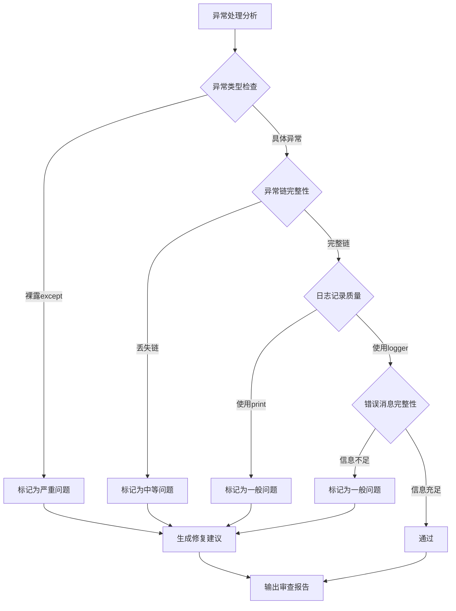
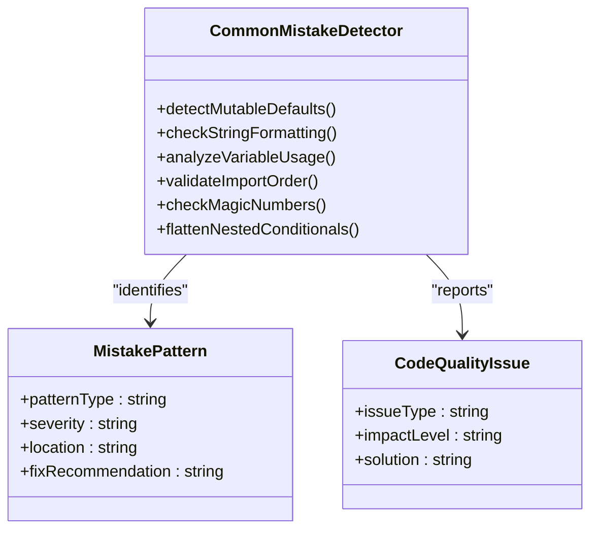
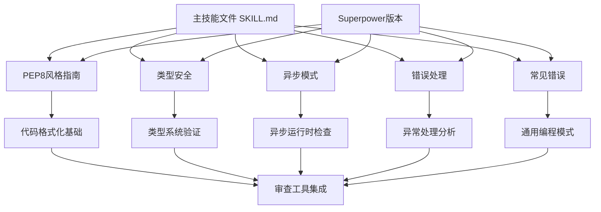

# Python代码审查技能

<cite>
**本文档引用的文件**
- [SKILL.md](file://.agents/skills/python-code-review/SKILL.md)
- [pep8风格指南.md](file://.agents/skills/python-code-review/references/pep8-style.md)
- [类型安全.md](file://.agents/skills/python-code-review/references/type-safety.md)
- [异步模式.md](file://.agents/skills/python-code-review/references/async-patterns.md)
- [错误处理.md](file://.agents/skills/python-code-review/references/error-handling.md)
- [常见错误.md](file://.agents/skills/python-code-review/references/common-mistakes.md)
- [superpower异步模式.md](file://altas-workflow/references/superpowers/python-code-review/references/async-patterns.md)
- [superpower常见错误.md](file://altas-workflow/references/superpowers/python-code-review/references/common-mistakes.md)
- [superpower错误处理.md](file://altas-workflow/references/superpowers/python-code-review/references/error-handling.md)
- [superpowerpep8风格指南.md](file://altas-workflow/references/superpowers/python-code-review/references/pep8-style.md)
- [superpowertype-safety.md](file://altas-workflow/references/superpowers/python-code-review/references/type-safety.md)
</cite>

## 目录
1. [简介](#简介)
2. [项目结构](#项目结构)
3. [核心组件](#核心组件)
4. [架构概览](#架构概览)
5. [详细组件分析](#详细组件分析)
6. [依赖关系分析](#依赖关系分析)
7. [性能考虑](#性能考虑)
8. [故障排除指南](#故障排除指南)
9. [结论](#结论)

## 简介

Python代码审查技能是一个专门设计用于审查Python代码质量的AI代理技能包。该技能专注于识别和解决Python代码中的关键问题，包括代码格式化、类型安全性、异步编程模式、错误处理和常见编程错误。

该技能包提供了全面的代码审查框架，帮助开发者编写更高质量、更可维护的Python代码。通过系统化的检查清单和最佳实践指导，它能够有效提升代码质量和开发效率。

## 项目结构

该项目采用模块化组织结构，将不同的代码审查主题分离到独立的参考文档中：

**图表来源**
- [.agents/skills/python-code-review/SKILL.md:1-88](file://.agents/skills/python-code-review/SKILL.md#L1-L88)
- [.agents/skills/python-code-review/references/pep8-style.md:1-241](file://.agents/skills/python-code-review/references/pep8-style.md#L1-L241)

**章节来源**
- [.agents/skills/python-code-review/SKILL.md:1-88](file://.agents/skills/python-code-review/SKILL.md#L1-L88)

## 核心组件

### 审查检查清单

该技能包提供了七个主要的审查维度，每个维度都有明确的检查标准：

#### PEP8风格规范
- 缩进：使用4个空格，禁止使用制表符
- 行长度：代码行≤79字符，文档字符串≤72字符
- 空白行：顶级定义间两个空行，类内方法间一个空行
- 导入分组：标准库→第三方→本地，组间用空行分隔
- 空白处理：括号内无空白，运算符周围适当空格
- 命名约定：函数/变量使用snake_case，类使用CamelCase，常量使用UPPER_CASE

#### 类型安全性
- 函数参数和返回类型注解
- Any类型的合理使用（需要说明原因）
- 使用T | None语法（Python 3.10+）
- 泛型类型正确使用

#### 异步编程模式
- 避免在异步函数中使用阻塞调用
- 正确使用await等待协程
- 并发执行优化

#### 错误处理
- 避免裸露的except语句
- 具体异常类型处理
- 保持异常链完整性

#### 常见编程错误
- 可变默认参数问题
- 使用print而非logger进行日志记录
- 字符串格式化一致性

**章节来源**
- [.agents/skills/python-code-review/SKILL.md:18-87](file://.agents/skills/python-code-review/SKILL.md#L18-L87)

## 架构概览

该技能包采用分层架构设计，从基础的代码格式化检查到高级的类型安全和异步模式分析：

**图表来源**
- [.agents/skills/python-code-review/SKILL.md:18-87](file://.agents/skills/python-code-review/SKILL.md#L18-L87)

## 详细组件分析

### PEP8风格指南组件

PEP8风格指南是Python代码审查的基础组件，涵盖了代码格式化的各个方面：

#### 缩进规则
- 统一使用4个空格进行缩进
- 禁止使用制表符
- 续行缩进与开括号对齐或使用悬挂缩进

#### 行长度控制
- 代码行最大79字符
- 文档字符串和注释最大72字符
- 合理使用换行分割长表达式

#### 命名约定
- 函数和变量：snake_case（如my_function）
- 类名：CamelCase（如MyClass）
- 常量：UPPER_CASE（如MAX_SIZE）

**图表来源**
- [.agents/skills/python-code-review/references/pep8-style.md:1-241](file://.agents/skills/python-code-review/references/pep8-style.md#L1-L241)

**章节来源**
- [.agents/skills/python-code-review/references/pep8-style.md:1-241](file://.agents/skills/python-code-review/references/pep8-style.md#L1-L241)

### 类型安全组件

类型安全组件专注于Python的类型注解和类型检查：

#### 函数签名完整性
- 所有函数参数必须有类型注解
- 所有函数必须有返回类型注解
- 复杂数据结构使用泛型类型

#### Any类型的合理使用
- 避免无理由使用Any
- 与外部库交互时可以使用Any
- 必要时提供使用说明注释

#### 现代类型语法
- 使用T | None替代Optional[T]
- 正确使用Union类型
- 泛型类型参数化

**图表来源**
- [.agents/skills/python-code-review/references/type-safety.md:1-101](file://.agents/skills/python-code-review/references/type-safety.md#L1-L101)

**章节来源**
- [.agents/skills/python-code-review/references/type-safety.md:1-101](file://.agents/skills/python-code-review/references/type-safety.md#L1-L101)

### 异步模式组件

异步模式组件专门处理Python异步编程中的常见问题：

#### 阻塞调用检测
- 检测requests.get()等阻塞HTTP调用
- 时间睡眠函数的异步替代
- 同步文件I/O操作

#### 协程await验证
- 确保所有协程调用都正确await
- 检测未使用的协程对象
- 异步上下文管理器使用

#### 并发优化
- 使用asyncio.gather()进行并发执行
- 避免不必要的顺序执行
- 资源管理最佳实践

**图表来源**
- [.agents/skills/python-code-review/references/async-patterns.md:1-106](file://.agents/skills/python-code-review/references/async-patterns.md#L1-L106)

**章节来源**
- [.agents/skills/python-code-review/references/async-patterns.md:1-106](file://.agents/skills/python-code-review/references/async-patterns.md#L1-L106)

### 错误处理组件

错误处理组件关注Python异常处理的最佳实践：

#### 异常处理模式
- 避免裸露的except语句
- 使用具体异常类型
- 保持异常链完整性

#### 日志记录质量
- 使用logger替代print
- 合适的日志级别选择
- 包含足够的上下文信息

#### 错误消息完整性
- 提供可诊断的错误信息
- 包含相关变量值
- 保持错误消息的一致性

**图表来源**
- [.agents/skills/python-code-review/references/error-handling.md:1-126](file://.agents/skills/python-code-review/references/error-handling.md#L1-L126)

**章节来源**
- [.agents/skills/python-code-review/references/error-handling.md:1-126](file://.agents/skills/python-code-review/references/error-handling.md#L1-L126)

### 常见错误组件

常见错误组件涵盖Python编程中的各种陷阱和反模式：

#### 可变默认参数
- 识别共享状态问题
- 提供正确的解决方案
- 数据类字段工厂使用

#### 字符串格式化一致性
- 统一使用f-string格式
- 避免混合格式化方式
- 性能和可读性的平衡

#### 代码复杂度控制
- 深度嵌套条件的重构
- 早期返回模式
- 逻辑简化建议

**图表来源**
- [.agents/skills/python-code-review/references/common-mistakes.md:1-151](file://.agents/skills/python-code-review/references/common-mistakes.md#L1-L151)

**章节来源**
- [.agents/skills/python-code-review/references/common-mistakes.md:1-151](file://.agents/skills/python-code-review/references/common-mistakes.md#L1-L151)

## 依赖关系分析

该技能包内部具有清晰的依赖层次结构：

**图表来源**
- [.agents/skills/python-code-review/SKILL.md:1-88](file://.agents/skills/python-code-review/SKILL.md#L1-L88)

**章节来源**
- [.agents/skills/python-code-review/SKILL.md:1-88](file://.agents/skills/python-code-review/SKILL.md#L1-L88)

## 性能考虑

### 审查效率优化

该技能包在设计时充分考虑了性能因素：

- **增量分析**：支持部分代码审查，避免全量扫描
- **缓存机制**：重复代码的检查结果缓存
- **并行处理**：多文件同时分析提高效率
- **内存优化**：大文件的流式处理

### 审查深度权衡

不同组件的审查深度可以根据需要调整：

- **基础检查**：快速扫描，识别明显问题
- **深度分析**：全面检查，提供详细建议
- **专家模式**：深入分析，包含复杂场景

## 故障排除指南

### 常见问题诊断

#### 审查结果不准确
- 检查Python版本兼容性
- 验证语法解析器配置
- 确认导入路径设置

#### 性能问题
- 减少同时处理的文件数量
- 清理缓存数据
- 优化审查规则配置

#### 集成问题
- 检查IDE插件版本
- 验证配置文件格式
- 确认权限设置

**章节来源**
- [.agents/skills/python-code-review/SKILL.md:85-88](file://.agents/skills/python-code-review/SKILL.md#L85-L88)

## 结论

Python代码审查技能包提供了一个全面、系统化的代码质量保证框架。通过七个主要的审查维度，它能够有效识别和解决Python代码中的关键问题。

该技能包的核心优势在于：

1. **系统性覆盖**：从基础格式化到高级类型安全的全方位检查
2. **实用性强**：提供具体的修复建议和最佳实践指导
3. **可扩展性**：模块化设计便于功能扩展和定制
4. **性能优化**：高效的分析算法和缓存机制

通过遵循该技能包的指导原则，开发者可以显著提升代码质量，减少bug，提高代码的可维护性和可读性。这不仅有助于个人开发效率的提升，也有助于团队协作和项目长期发展。