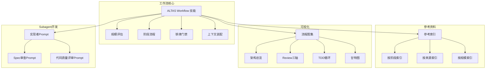
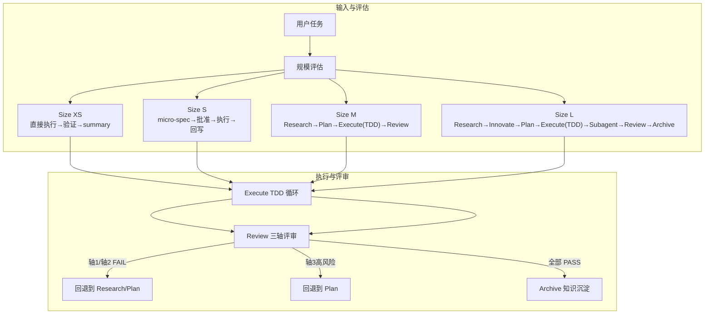
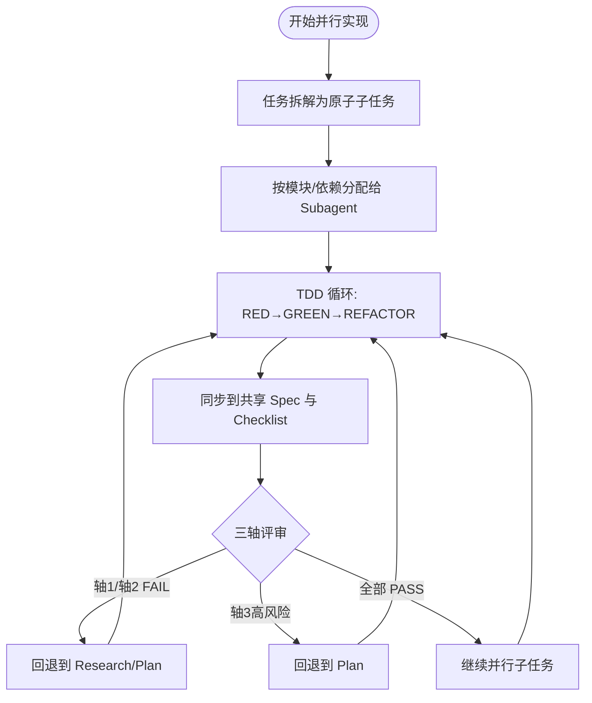
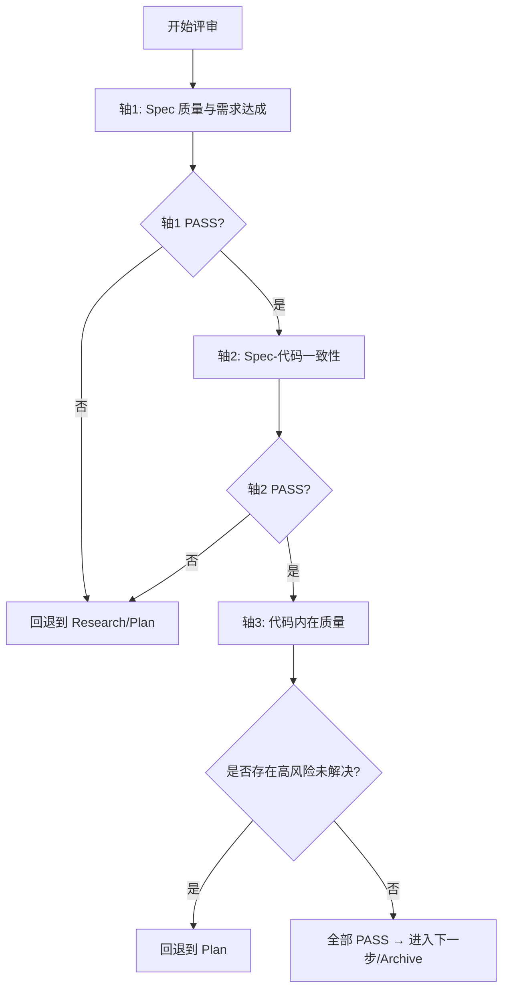
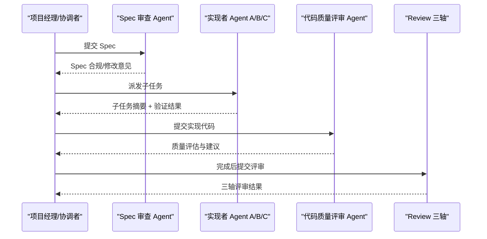
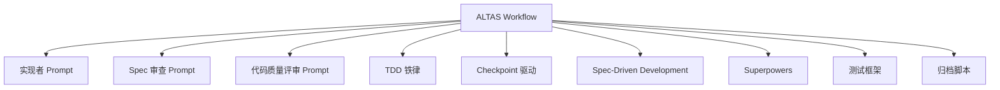

# Subagent 驱动开发

<cite>
**本文引用的文件**
- [altas-workflow/SKILL.md](file://altas-workflow/SKILL.md)
- [altas-workflow/QUICKSTART.md](file://altas-workflow/QUICKSTART.md)
- [altas-workflow/reference-index.md](file://altas-workflow/reference-index.md)
- [altas-workflow/workflow-diagrams.md](file://altas-workflow/workflow-diagrams.md)
- [altas-workflow/references/superpowers/subagent-driven-development/implementer-prompt.md](file://altas-workflow/references/superpowers/subagent-driven-development/implementer-prompt.md)
- [altas-workflow/references/superpowers/subagent-driven-development/spec-reviewer-prompt.md](file://altas-workflow/references/superpowers/subagent-driven-development/spec-reviewer-prompt.md)
- [altas-workflow/references/superpowers/subagent-driven-development/code-quality-reviewer-prompt.md](file://altas-workflow/references/superpowers/subagent-driven-development/code-quality-reviewer-prompt.md)
- [altas-workflow/AGENTS.md](file://altas-workflow/AGENTS.md)
- [altas-workflow/EXAMPLES.md](file://altas-workflow/EXAMPLES.md)
</cite>

## 目录
1. [简介](#简介)
2. [项目结构](#项目结构)
3. [核心组件](#核心组件)
4. [架构总览](#架构总览)
5. [详细组件分析](#详细组件分析)
6. [依赖关系分析](#依赖关系分析)
7. [性能考量](#性能考量)
8. [故障排除指南](#故障排除指南)
9. [结论](#结论)
10. [附录](#附录)

## 简介
本技术文档面向 Subagent 驱动开发的实施者与团队，系统阐述并行实现策略的理论基础与实践方法，覆盖任务拆解、子任务分配与协调机制；两阶段评审机制（Spec 审查与代码质量评审）的设计与执行；实现者 Prompt 的设计原则与最佳实践；代码质量评审器的评估维度与评分标准；以及 Subagent 配置示例、工作流编排与结果整合方法。文档同时提供团队协作模式、进度监控与质量保证策略，帮助开发者构建稳定高效的并行开发流水线。

## 项目结构
本仓库以“工作流技能”为核心，围绕 ALTAS Workflow 提供了完整的流程规范、参考资料索引与可视化图表，辅以 Subagent 驱动开发所需的 Prompt 模板与评审指南。关键模块包括：
- 工作流主技能：ALTAS Workflow（含规模评估、阶段流程、铁律门禁、上下文装配）
- 参考资料索引：按阶段/模式/来源/规模的分层索引，指导按需加载
- 可视化图表：流程图、甘特图、时序图等，直观呈现工作流与评审机制
- Subagent 驱动开发：实现者 Prompt、Spec 审查 Prompt、代码质量评审 Prompt
- 行为准则与示例：避免常见错误，强化目标导向与最小可行变更

**图表来源**
- [altas-workflow/SKILL.md:1-351](file://altas-workflow/SKILL.md#L1-L351)
- [altas-workflow/reference-index.md:1-210](file://altas-workflow/reference-index.md#L1-L210)
- [altas-workflow/workflow-diagrams.md:1-338](file://altas-workflow/workflow-diagrams.md#L1-L338)

**章节来源**
- [altas-workflow/SKILL.md:1-351](file://altas-workflow/SKILL.md#L1-L351)
- [altas-workflow/QUICKSTART.md:1-182](file://altas-workflow/QUICKSTART.md#L1-L182)
- [altas-workflow/reference-index.md:1-210](file://altas-workflow/reference-index.md#L1-L210)
- [altas-workflow/workflow-diagrams.md:1-338](file://altas-workflow/workflow-diagrams.md#L1-L338)

## 核心组件
- 规模评估与工作流深度选择：根据任务复杂度自动选择 XS/S/M/L，决定是否进入 Research/Plan/Execute/Subagent/Review 等阶段。
- 阶段流程与门禁：Research/Innovate/Plan/Execute/Review 的阶段性门禁与回退机制，确保 Spec 与代码一致、证据先行。
- 上下文装配策略：Hot/Warm/Cold 三层上下文，按轮/阶段切换/按需加载，减少不必要的信息噪声。
- Subagent 驱动开发：在 L 规模下，通过并行 Agent 分工实现，结合两阶段评审保障质量与一致性。
- 评审体系：三轴评审（Spec 质量与需求达成、Spec-代码一致性、代码内在质量），失败即回退到上一阶段。
- Prompt 生态：实现者、Spec 审查、代码质量评审三大 Prompt，分别承担“执行”“合规”“质量”职责。

**章节来源**
- [altas-workflow/SKILL.md:47-102](file://altas-workflow/SKILL.md#L47-L102)
- [altas-workflow/SKILL.md:138-218](file://altas-workflow/SKILL.md#L138-L218)
- [altas-workflow/SKILL.md:318-351](file://altas-workflow/SKILL.md#L318-L351)
- [altas-workflow/reference-index.md:16-80](file://altas-workflow/reference-index.md#L16-L80)

## 架构总览
下图展示了 ALTAS Workflow 的整体架构与关键交互：从任务输入到规模评估，再到各阶段推进与评审闭环，以及 Subagent 并行实现与两阶段评审的协同。

**图表来源**
- [altas-workflow/workflow-diagrams.md:7-41](file://altas-workflow/workflow-diagrams.md#L7-L41)
- [altas-workflow/SKILL.md:176-218](file://altas-workflow/SKILL.md#L176-L218)

## 详细组件分析

### 并行实现策略：理论基础与实践方法
- 理论基础
  - 任务拆解：将复杂模块内的 Checklists 拆分为原子子任务，明确文件变更与签名，确保可验证与可回溯。
  - 子任务分配：基于模块边界与依赖关系，将子任务分配给不同 Subagent，避免竞态与冲突。
  - 协调机制：通过共享的 Spec 与活跃 Checklist 作为协调中枢，执行过程中持续同步状态，必要时回退到 Plan 对齐目标。
- 实践要点
  - 在 Execute 阶段引入 TDD 循环，确保每次子任务变更均具备失败测试→最小实现→重构的闭环。
  - 使用 Hot/Warm/Cold 上下文策略，减少无关信息对并行 Agent 的干扰。
  - 通过 Review 三轴评审，确保 Spec 与代码一致、质量达标，未解决的高风险必须回退到 Plan。

**图表来源**
- [altas-workflow/SKILL.md:176-218](file://altas-workflow/SKILL.md#L176-L218)
- [altas-workflow/workflow-diagrams.md:108-126](file://altas-workflow/workflow-diagrams.md#L108-L126)

**章节来源**
- [altas-workflow/SKILL.md:167-192](file://altas-workflow/SKILL.md#L167-L192)
- [altas-workflow/SKILL.md:318-351](file://altas-workflow/SKILL.md#L318-L351)

### 两阶段评审机制：Spec 审查与代码质量评审
- 第一阶段：Spec 审查（Spec 质量与需求达成）
  - 关注点：目标完整性、范围界定、验收标准、事实依据与风险识别。
  - 判定：PASS/FAIL/PARTIAL；若 FAIL，回退到 Research/Plan。
- 第二阶段：代码质量评审（Spec-代码一致性 + 代码内在质量）
  - 关注点：文件/签名/Checklist/行为与 Plan 一致；正确性、鲁棒性、可维护性、测试覆盖率与关键风险。
  - 判定：轴1/轴2 FAIL 回退；轴3高风险未解决回退；全部 PASS 进入下一阶段或 Archive。
- 评审门禁与回退策略：失败即回退，确保质量门槛不被绕过。

**图表来源**
- [altas-workflow/SKILL.md:194-209](file://altas-workflow/SKILL.md#L194-L209)
- [altas-workflow/workflow-diagrams.md:108-126](file://altas-workflow/workflow-diagrams.md#L108-L126)

**章节来源**
- [altas-workflow/SKILL.md:194-209](file://altas-workflow/SKILL.md#L194-L209)

### 实现者 Prompt 设计原则与最佳实践
- 设计原则
  - 明确角色与边界：实现者负责“按 Spec 执行”，不参与设计与评审。
  - 上下文提供：包含目标、Scope、Checklist、相关文件与签名、验证方法。
  - 约束条件：遵循 Evidence First、No Approval No Execute、Spec is Truth；变更需可验证且与 Plan 一致。
  - 输出格式：以“子任务执行摘要 + 验证结果 + 待办/阻塞”形式返回，便于协调与合并。
- 最佳实践
  - 与 Spec 审查 Prompt 协同：先由 Spec 审查 Agent 确认 Spec 合规，再派发实现者。
  - 与代码质量评审 Prompt 协同：实现完成后由质量评审 Agent 评估，未达标则回退到 Plan。
  - 与 TDD 结合：实现者输出的代码需配套失败测试，确保 Evidence First。

**章节来源**
- [altas-workflow/references/superpowers/subagent-driven-development/implementer-prompt.md](file://altas-workflow/references/superpowers/subagent-driven-development/implementer-prompt.md)
- [altas-workflow/references/superpowers/subagent-driven-development/spec-reviewer-prompt.md](file://altas-workflow/references/superpowers/subagent-driven-development/spec-reviewer-prompt.md)
- [altas-workflow/references/superpowers/subagent-driven-development/code-quality-reviewer-prompt.md](file://altas-workflow/references/superpowers/subagent-driven-development/code-quality-reviewer-prompt.md)

### 代码质量评审器的评估维度与评分标准
- 维度一：正确性（Correctness）
  - 是否满足 Spec 的验收标准；是否通过失败测试→通过测试→回归测试的 TDD 循环。
- 维度二：鲁棒性（Robustness）
  - 是否处理异常与边界条件；是否有必要的输入校验与错误处理。
- 维度三：可维护性（Maintainability）
  - 是否遵循现有风格与命名；是否避免过度抽象与臆造特性；是否最小化变更面。
- 维度四：测试与验证（Testing & Verification）
  - 是否提供可运行的测试；是否覆盖关键路径与边界；是否具备可重复验证的方法。
- 评分标准
  - PASS：满足全部关键维度要求；
  - PARTIAL：存在轻微不足但可接受；
  - FAIL：存在重大缺陷或高风险未解决。

**章节来源**
- [altas-workflow/SKILL.md:194-209](file://altas-workflow/SKILL.md#L194-L209)
- [altas-workflow/AGENTS.md:7-65](file://altas-workflow/AGENTS.md#L7-L65)
- [altas-workflow/EXAMPLES.md:97-222](file://altas-workflow/EXAMPLES.md#L97-L222)

### Subagent 配置示例、工作流编排与结果整合
- 配置示例
  - 角色分工：实现者 A 负责接口层，实现者 B 负责业务逻辑，实现者 C 负责数据访问；均由 Spec 审查与代码质量评审把关。
  - 上下文注入：实现者 Prompt 包含 Spec 路径、目标、Scope、Checklist、签名与验证方法。
- 工作流编排
  - Step 1：Spec 审查通过 → 派发子任务给实现者；
  - Step 2：实现者执行并输出“子任务摘要 + 验证结果”；
  - Step 3：代码质量评审通过 → 合并变更；未通过 → 回退到 Plan；
  - Step 4：全部子任务完成后，进入 Review 三轴评审。
- 结果整合
  - 将各实现者的变更与验证结果汇总到共享 Spec，保持 Checklist 与签名一致；必要时回滚并修正 Spec。

**图表来源**
- [altas-workflow/SKILL.md:176-218](file://altas-workflow/SKILL.md#L176-L218)
- [altas-workflow/reference-index.md:55-58](file://altas-workflow/reference-index.md#L55-L58)

**章节来源**
- [altas-workflow/SKILL.md:176-218](file://altas-workflow/SKILL.md#L176-L218)
- [altas-workflow/reference-index.md:55-58](file://altas-workflow/reference-index.md#L55-L58)

### 团队协作模式、进度监控与质量保证策略
- 团队协作
  - Spec 为团队共享的真相源，核心开发者 Review Plan，不必逐字 Review 代码。
  - 多项目协作时，自动发现子项目并隔离作用域，按依赖顺序执行。
- 进度监控
  - 每步完成后输出检查点，含“已完成/当前/下一步/后续”与“预期产出/下一步操作”。
  - 支持逐步或批量执行，批量执行需明确“全部/execute all”指令。
- 质量保证
  - 铁律约束：No Spec No Code、No Approval No Execute、Evidence First、No Fixes Without Root Cause。
  - 三轴评审：Spec 质量、Spec-代码一致性、代码内在质量，失败即回退。
  - 行为准则：Think Before Coding、Simplicity First、Surgical Changes、Goal-Driven Execution。

**章节来源**
- [altas-workflow/SKILL.md:22-102](file://altas-workflow/SKILL.md#L22-L102)
- [altas-workflow/SKILL.md:105-135](file://altas-workflow/SKILL.md#L105-L135)
- [altas-workflow/AGENTS.md:7-65](file://altas-workflow/AGENTS.md#L7-L65)
- [altas-workflow/EXAMPLES.md:370-522](file://altas-workflow/EXAMPLES.md#L370-L522)

## 依赖关系分析
- 模块耦合与内聚
  - ALTAS Workflow 作为主控模块，内聚度高；通过参考索引与可视化图表降低对外部模块的耦合依赖。
  - Subagent Prompt 生态与评审模块相互依赖，共同保障质量闭环。
- 直接与间接依赖
  - 直接依赖：实现者 Prompt、Spec 审查 Prompt、代码质量评审 Prompt。
  - 间接依赖：TDD、Checkpoint 驱动、Spec-Driven Development、Superpowers。
- 外部依赖与集成点
  - 测试框架：确保项目可一键运行测试（如 npm test/pytest/go test）。
  - 归档脚本：自动化生成双视角归档（human/llm）。

**图表来源**
- [altas-workflow/reference-index.md:109-173](file://altas-workflow/reference-index.md#L109-L173)
- [altas-workflow/QUICKSTART.md:30-33](file://altas-workflow/QUICKSTART.md#L30-L33)

**章节来源**
- [altas-workflow/reference-index.md:109-173](file://altas-workflow/reference-index.md#L109-L173)
- [altas-workflow/QUICKSTART.md:30-33](file://altas-workflow/QUICKSTART.md#L30-L33)

## 性能考量
- 并行效率
  - 子任务粒度应足够小以提升并行度，同时避免过度切分导致同步成本上升。
  - 通过共享 Checklist 与签名减少重复沟通与冲突。
- 资源占用
  - 上下文按需加载（Hot/Warm/Cold），避免一次性加载过多文件导致延迟。
  - 评审前置，尽早暴露问题，减少后期回退成本。
- 可观测性
  - 每步输出检查点，便于快速定位瓶颈与失败原因。
  - 使用可视化图表（流程图/甘特图）辅助进度与资源分配分析。

## 故障排除指南
- 常见问题
  - AI 一次性输出过多代码：严格遵循检查点机制，要求每次只推进一步。
  - 测试优先导致速度较慢：对于极简任务可使用 `>>` 触发 XS 模式跳过 TDD。
  - 计划频繁变更：在 Plan 阶段充分对齐后再进入 Execute，变更需回到 Plan。
- 排查步骤
  - 若评审失败：优先检查 Spec 与代码一致性，修正后再提交评审。
  - 若并行冲突：回退到 Plan，重新拆分子任务并明确依赖关系。
  - 若上下文缺失：从磁盘重读完整 Spec，确保 Hot/Warm/Cold 上下文正确加载。

**章节来源**
- [altas-workflow/QUICKSTART.md:119-152](file://altas-workflow/QUICKSTART.md#L119-L152)
- [altas-workflow/SKILL.md:324-351](file://altas-workflow/SKILL.md#L324-L351)

## 结论
Subagent 驱动开发以 ALTAS Workflow 为骨架，通过明确的并行策略、两阶段评审与 Prompt 生态，实现了从任务拆解到质量闭环的全链路自动化。配合行为准则与进度检查点，团队可在保证质量的前提下高效推进复杂任务。建议在实践中持续优化子任务粒度、评审阈值与上下文加载策略，以获得更优的吞吐与稳定性。

## 附录
- 快速参考
  - 触发词与模式映射：FAST/DEEP/MAP/MULTI/DEBUG/REVIEW/ARCHIVE/DOC 等。
  - 规模评估速查：typo/配置值（XS）、1-2文件（S）、3-10文件（M）、跨模块/架构级（L）。
- 参考资料索引
  - 按阶段/来源/规模的分层索引，指导按需加载对应文件。

**章节来源**
- [altas-workflow/QUICKSTART.md:36-182](file://altas-workflow/QUICKSTART.md#L36-L182)
- [altas-workflow/reference-index.md:1-210](file://altas-workflow/reference-index.md#L1-L210)