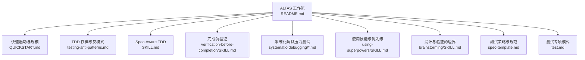
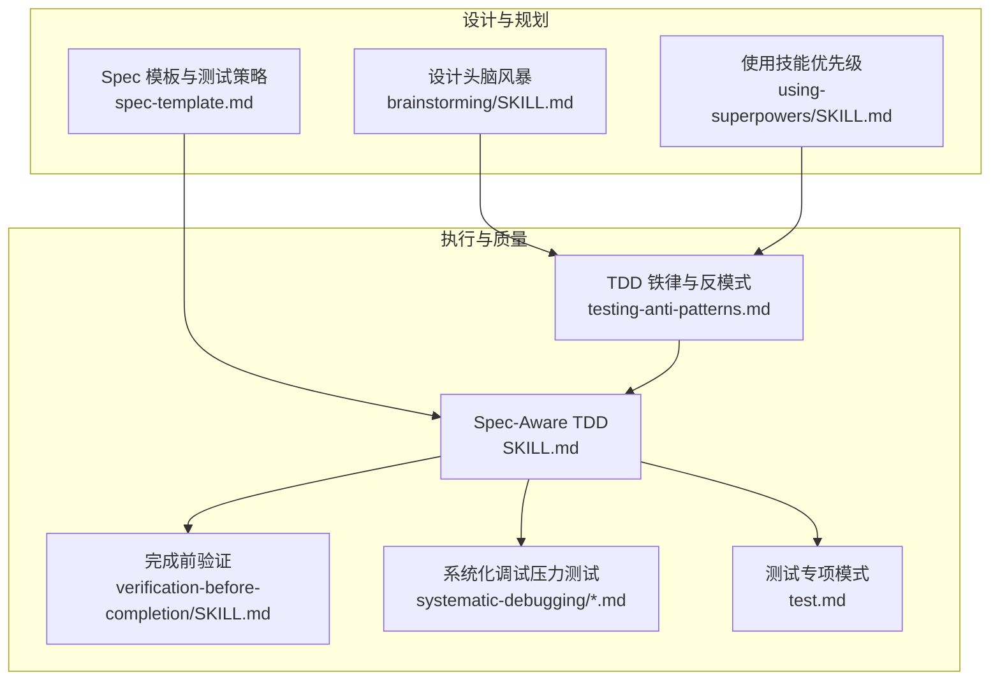
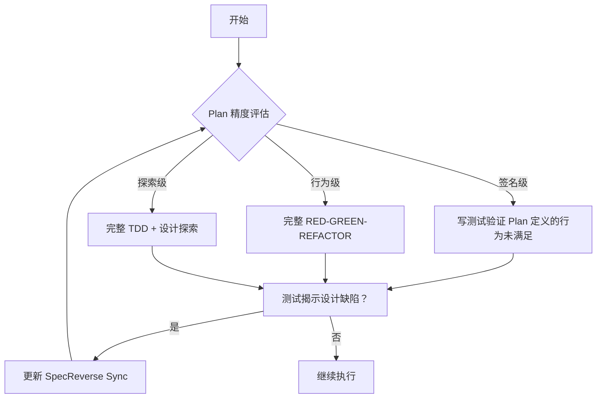
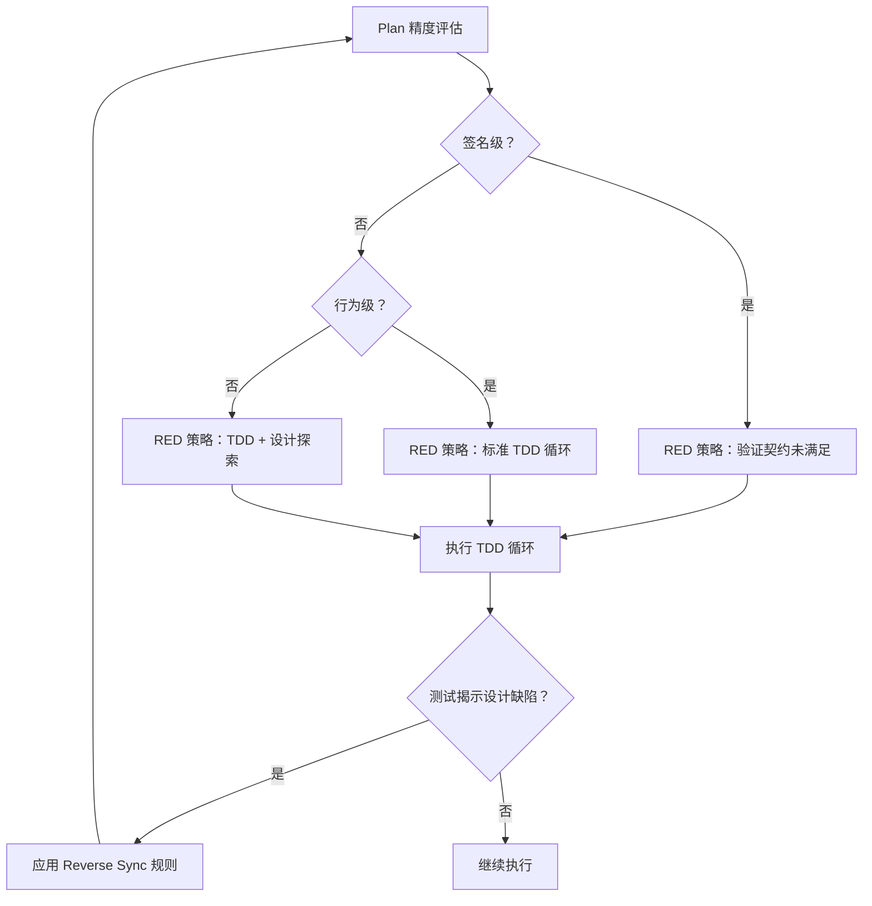
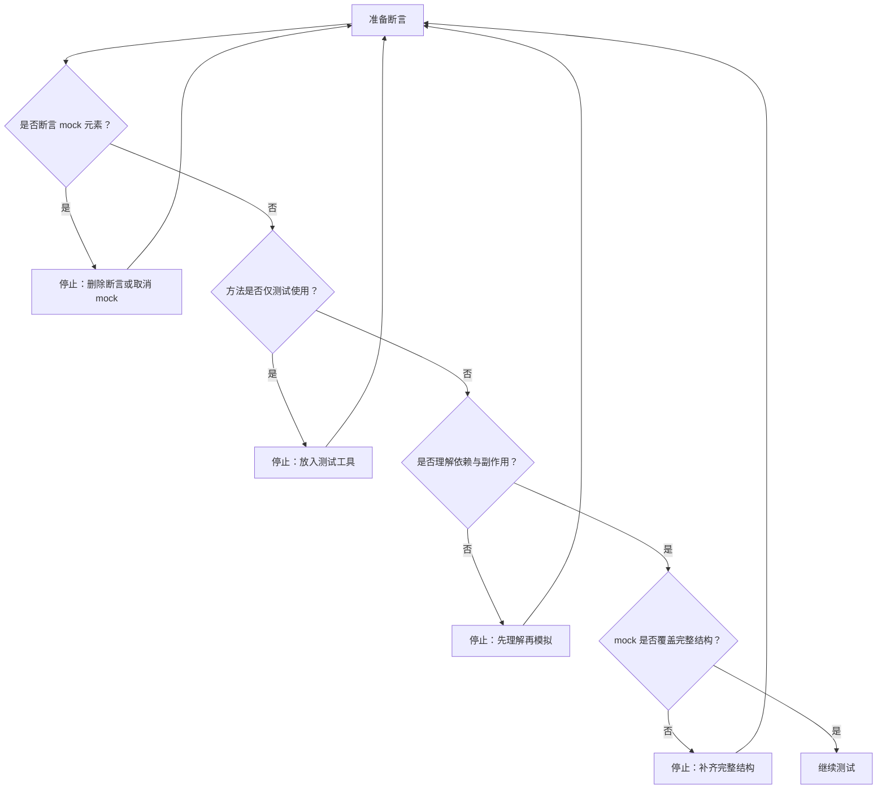
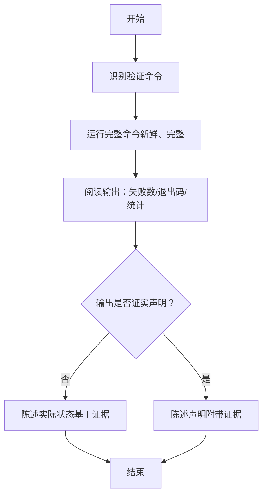
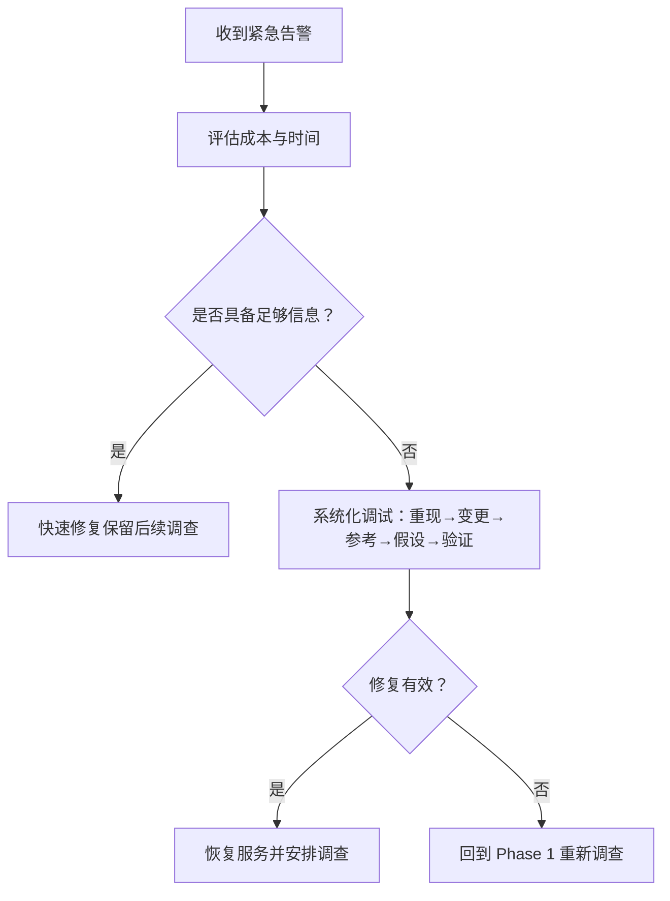
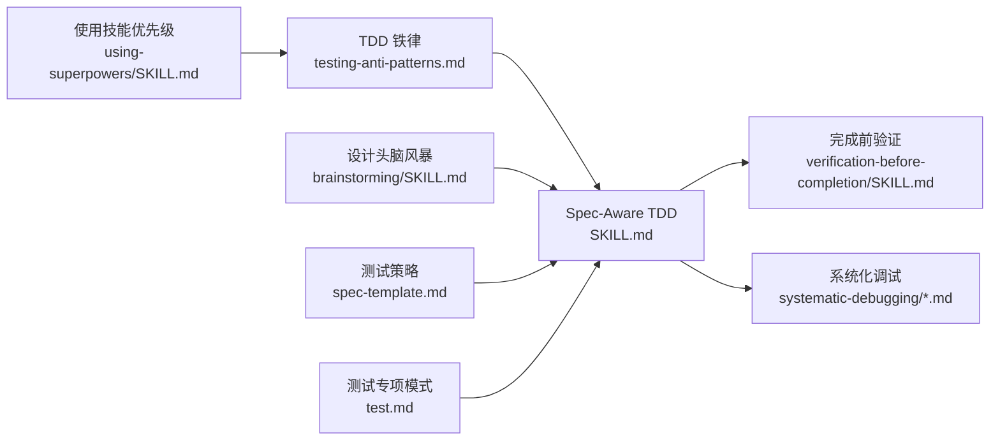

# TDD 铁律

<cite>
**本文引用的文件**
- [altas-workflow/README.md](file://altas-workflow/README.md)
- [altas-workflow/QUICKSTART.md](file://altas-workflow/QUICKSTART.md)
- [altas-workflow/references/superpowers/test-driven-development/SKILL.md](file://altas-workflow/references/superpowers/test-driven-development/SKILL.md)
- [altas-workflow/references/superpowers/test-driven-development/testing-anti-patterns.md](file://altas-workflow/references/superpowers/test-driven-development/testing-anti-patterns.md)
- [altas-workflow/references/superpowers/systematic-debugging/test-pressure-1.md](file://altas-workflow/references/superpowers/systematic-debugging/test-pressure-1.md)
- [altas-workflow/references/superpowers/systematic-debugging/test-pressure-2.md](file://altas-workflow/references/superpowers/systematic-debugging/test-pressure-2.md)
- [altas-workflow/references/superpowers/systematic-debugging/test-pressure-3.md](file://altas-workflow/references/superpowers/systematic-debugging/test-pressure-3.md)
- [altas-workflow/references/superpowers/verification-before-completion/SKILL.md](file://altas-workflow/references/superpowers/verification-before-completion/SKILL.md)
- [altas-workflow/references/superpowers/using-superpowers/SKILL.md](file://altas-workflow/references/superpowers/using-superpowers/SKILL.md)
- [altas-workflow/references/superpowers/brainstorming/SKILL.md](file://altas-workflow/references/superpowers/brainstorming/SKILL.md)
- [altas-workflow/docs/IMPLEMENTATION-PLAN-v4.6.md](file://altas-workflow/docs/IMPLEMENTATION-PLAN-v4.6.md)
- [altas-workflow/references/spec-driven-development/spec-template.md](file://altas-workflow/references/spec-driven-development/spec-template.md)
- [altas-workflow/references/special-modes/test.md](file://altas-workflow/references/special-modes/test.md)
</cite>

## 更新摘要
**变更内容**
- 新增 Spec-Aware TDD 概念章节，解决 TDD 与 Spec-First 方法的执行冲突
- 添加 TDD 适配规则，针对不同 Plan 精度提供相应的 RED 策略
- 更新 TDD 铁律章节，包含 Reverse Sync 规则
- 增强测试策略章节，明确测试框架、范围和优先级
- 完善检查点强制暂停约束，确保执行质量

## 目录
1. [简介](#简介)
2. [项目结构](#项目结构)
3. [核心组件](#核心组件)
4. [架构总览](#架构总览)
5. [详细组件分析](#详细组件分析)
6. [依赖分析](#依赖分析)
7. [性能考虑](#性能考虑)
8. [故障排查指南](#故障排查指南)
9. [结论](#结论)
10. [附录](#附录)

## 简介
本文件围绕"TDD 铁律"展开，系统阐述测试驱动开发的核心原理、红绿重构循环、测试金字塔与四个黄金法则；结合仓库中关于测试反模式、压力测试情境与"完成前验证"的实践，给出可操作的实施指南、常见陷阱识别、最佳实践与团队协作策略。特别新增了 Spec-Aware TDD 概念，消除了 TDD 与 Spec-First 方法之间的执行冲突，为不同规模和复杂度的任务提供灵活的执行指导。

## 项目结构
该仓库以"工作流与技能体系"为核心，将 TDD 作为 M/L 规模执行阶段的关键纪律，并配套"验证优先""系统化调试""设计先行"等能力，形成闭环的质量保障与交付流程。新增的 Spec-Aware TDD 机制确保了 TDD 与 Spec-First 方法的无缝衔接。

**图表来源**
- [altas-workflow/README.md:41-60](file://altas-workflow/README.md#L41-L60)
- [altas-workflow/QUICKSTART.md:30-48](file://altas-workflow/QUICKSTART.md#L30-L48)
- [altas-workflow/references/superpowers/test-driven-development/testing-anti-patterns.md:13-19](file://altas-workflow/references/superpowers/test-driven-development/testing-anti-patterns.md#L13-L19)
- [altas-workflow/references/superpowers/test-driven-development/SKILL.md:351-360](file://altas-workflow/references/superpowers/test-driven-development/SKILL.md#L351-L360)
- [altas-workflow/references/superpowers/verification-before-completion/SKILL.md:16-20](file://altas-workflow/references/superpowers/verification-before-completion/SKILL.md#L16-L20)
- [altas-workflow/references/superpowers/systematic-debugging/test-pressure-1.md:1-59](file://altas-workflow/references/superpowers/systematic-debugging/test-pressure-1.md#L1-L59)
- [altas-workflow/references/superpowers/using-superpowers/SKILL.md:42-76](file://altas-workflow/references/superpowers/using-superpowers/SKILL.md#L42-L76)
- [altas-workflow/references/superpowers/brainstorming/SKILL.md:34-66](file://altas-workflow/references/superpowers/brainstorming/SKILL.md#L34-L66)
- [altas-workflow/references/spec-driven-development/spec-template.md:80-94](file://altas-workflow/references/spec-driven-development/spec-template.md#L80-L94)
- [altas-workflow/references/special-modes/test.md:18-31](file://altas-workflow/references/special-modes/test.md#L18-L31)

**章节来源**
- [altas-workflow/README.md:1-133](file://altas-workflow/README.md#L1-L133)
- [altas-workflow/QUICKSTART.md:1-182](file://altas-workflow/QUICKSTART.md#L1-L182)

## 核心组件
- **TDD 铁律与反模式**：明确"绝不测试模拟行为""绝不向生产类添加仅测试方法""模拟前必须理解依赖"等三条铁律，配套识别与纠正流程。
- **Spec-Aware TDD**：新增的智能 TDD 机制，根据 Spec 的 Plan 精度提供相应的执行策略，消除了 TDD 与 Spec-First 方法的冲突。
- **TDD 适配规则**：针对签名级、行为级、探索级三种 Plan 精度，提供不同的 RED 测试策略。
- **红绿重构循环**：以"失败测试→最小实现→重构→提交"为主线，贯穿 M/L 规模执行阶段。
- **完成前验证**：在宣称完成前，必须运行完整验证命令并依据输出做出声明，杜绝"应该/大概/看起来"等主观断言。
- **系统化调试与压力测试**：提供真实场景下的决策框架，帮助在高压下坚持证据优先与系统化流程。
- **设计与验证边界**：强调"设计先于实现"，并通过阶段性审批与验证降低返工风险。

**章节来源**
- [altas-workflow/references/superpowers/test-driven-development/testing-anti-patterns.md:13-19](file://altas-workflow/references/superpowers/test-driven-development/testing-anti-patterns.md#L13-L19)
- [altas-workflow/references/superpowers/test-driven-development/SKILL.md:351-360](file://altas-workflow/references/superpowers/test-driven-development/SKILL.md#L351-L360)
- [altas-workflow/docs/IMPLEMENTATION-PLAN-v4.6.md:55-67](file://altas-workflow/docs/IMPLEMENTATION-PLAN-v4.6.md#L55-L67)
- [altas-workflow/references/superpowers/verification-before-completion/SKILL.md:16-38](file://altas-workflow/references/superpowers/verification-before-completion/SKILL.md#L16-L38)
- [altas-workflow/references/superpowers/systematic-debugging/test-pressure-1.md:1-59](file://altas-workflow/references/superpowers/systematic-debugging/test-pressure-1.md#L1-L59)
- [altas-workflow/references/superpowers/brainstorming/SKILL.md:34-66](file://altas-workflow/references/superpowers/brainstorming/SKILL.md#L34-L66)

## 架构总览
下图展示了 TDD 在 ALTAS 工作流中的位置与与其他关键技能的交互关系：TDD 作为执行阶段的核心纪律，与"设计""验证""调试""使用技能"共同构成高质量交付的闭环。新增的 Spec-Aware TDD 机制确保了 TDD 与 Spec-First 方法的无缝衔接。

**图表来源**
- [altas-workflow/references/superpowers/brainstorming/SKILL.md:34-66](file://altas-workflow/references/superpowers/brainstorming/SKILL.md#L34-L66)
- [altas-workflow/references/superpowers/using-superpowers/SKILL.md:42-76](file://altas-workflow/references/superpowers/using-superpowers/SKILL.md#L42-L76)
- [altas-workflow/references/spec-driven-development/spec-template.md:80-94](file://altas-workflow/references/spec-driven-development/spec-template.md#L80-L94)
- [altas-workflow/references/superpowers/test-driven-development/testing-anti-patterns.md:13-19](file://altas-workflow/references/superpowers/test-driven-development/testing-anti-patterns.md#L13-L19)
- [altas-workflow/references/superpowers/test-driven-development/SKILL.md:351-360](file://altas-workflow/references/superpowers/test-driven-development/SKILL.md#L351-L360)
- [altas-workflow/references/superpowers/verification-before-completion/SKILL.md:16-38](file://altas-workflow/references/superpowers/verification-before-completion/SKILL.md#L16-L38)
- [altas-workflow/references/superpowers/systematic-debugging/test-pressure-1.md:1-59](file://altas-workflow/references/superpowers/systematic-debugging/test-pressure-1.md#L1-L59)
- [altas-workflow/references/special-modes/test.md:18-31](file://altas-workflow/references/special-modes/test.md#L18-L31)

## 详细组件分析

### TDD 铁律与 Spec-Aware TDD

#### TDD 铁律
- **四个黄金法则**（来自测试反模式文档的"铁律"部分）：
  - 绝不测试模拟行为
  - 绝不向生产类添加仅测试方法
  - 模拟前必须理解依赖
- **TDD 铁律#5：Reverse Sync 规则**：如果测试揭示了 Plan 的设计缺陷，必须先更新 Spec 再调整实现
- **TDD 铁律#6：证据驱动**：所有执行都必须基于证据，违反此规则视为违反铁律#4（无批准不执行）

#### Spec-Aware TDD 概念
当在规范驱动开发工作流中工作时（例如 ALTAS 工作流）：
- **Spec 的 Plan 部分定义了 WHAT，TDD 定义了 HOW 来验证它**
- 如果 Plan 已经指定了精确的签名和契约，你的 RED 测试应该验证这些契约当前未被满足，而不是猜测实现
- 如果 Plan 只描述了高级别的行为但未精确定义签名，遵循标准的 TDD 循环来设计和验证接口
- 如果你的测试揭示了 Plan 的设计缺陷，STOP 并先更新 Spec（Reverse Sync 规则）
- 即使写了实现代码在任何测试之前，如果 Plan 告诉你构建什么，你也必须删除并从测试重新构建

**图表来源**
- [altas-workflow/references/superpowers/test-driven-development/SKILL.md:351-360](file://altas-workflow/references/superpowers/test-driven-development/SKILL.md#L351-L360)
- [altas-workflow/docs/IMPLEMENTATION-PLAN-v4.6.md:55-67](file://altas-workflow/docs/IMPLEMENTATION-PLAN-v4.6.md#L55-L67)

**章节来源**
- [altas-workflow/references/superpowers/test-driven-development/testing-anti-patterns.md:13-19](file://altas-workflow/references/superpowers/test-driven-development/testing-anti-patterns.md#L13-L19)
- [altas-workflow/references/superpowers/test-driven-development/SKILL.md:351-360](file://altas-workflow/references/superpowers/test-driven-development/SKILL.md#L351-L360)
- [altas-workflow/docs/IMPLEMENTATION-PLAN-v4.6.md:55-67](file://altas-workflow/docs/IMPLEMENTATION-PLAN-v4.6.md#L55-L67)

### TDD 适配规则

#### 三种 Plan 精度与对应的 RED 策略

| Plan 精度 | TDD RED 策略 | 说明 |
|-----------|-------------|------|
| **签名级**（Plan 已定义精确签名、参数、返回类型） | 写测试验证 Plan 定义的行为会失败 | 不"猜"实现，用测试确认 Plan 中声明的接口当前不存在或行为不符 |
| **行为级**（Plan 描述了预期行为但未精确定义签名） | 完整 RED-GREEN-REFACTOR | 先写测试定义行为，再实现，符合标准 TDD |
| **探索级**（Plan 仅标注方向，细节待确定） | 完整 TDD + 设计探索 | 测试驱动接口设计，允许迭代签名 |

#### 核心原则
- Plan 已精确到签名级时，RED 阶段的目标是"验证 Plan 定义的行为当前未被满足"，而非从零猜测实现
- 仍然禁止先写实现代码再补测试——即使 Plan 已定义签名，也必须先让测试失败
- 如果 Plan 中的签名在实际测试中被证明不合理，必须先更新 Spec 再调整实现（铁律#5）

**图表来源**
- [altas-workflow/docs/IMPLEMENTATION-PLAN-v4.6.md:55-67](file://altas-workflow/docs/IMPLEMENTATION-PLAN-v4.6.md#L55-L67)

**章节来源**
- [altas-workflow/docs/IMPLEMENTATION-PLAN-v4.6.md:55-67](file://altas-workflow/docs/IMPLEMENTATION-PLAN-v4.6.md#L55-L67)

### 测试反模式识别与纠正
- **反模式 1：测试模拟行为**
  - 表现：断言 mock 元素存在
  - 修正：测试真实行为或取消 mock
  - 门禁：断言前问"是否在测试模拟行为？"
- **反模式 2：仅测试方法出现在生产类**
  - 表现：生产类出现仅被测试使用的 API
  - 修正：将清理逻辑放入测试工具
  - 门禁：添加方法前问"是否仅测试使用？"
- **反模式 3：无依赖理解的模拟**
  - 表现：mock 导致测试逻辑被破坏
  - 修正：在正确层级进行最小化模拟
  - 门禁：先理解副作用，再决定模拟层级
- **反模式 4：不完整的 mock**
  - 表现：mock 数据结构不完整
  - 修正：镜像真实 API 的完整性
  - 门禁：mock 前核对真实响应结构
- **反模式 5：把集成测试当作事后补课**
  - 表现：实现完成后再补测试
  - 修正：TDD 循环：先测试，再实现，再重构

**图表来源**
- [altas-workflow/references/superpowers/test-driven-development/testing-anti-patterns.md:21-61](file://altas-workflow/references/superpowers/test-driven-development/testing-anti-patterns.md#L21-L61)
- [altas-workflow/references/superpowers/test-driven-development/testing-anti-patterns.md:63-116](file://altas-workflow/references/superpowers/test-driven-development/testing-anti-patterns.md#L63-L116)
- [altas-workflow/references/superpowers/test-driven-development/testing-anti-patterns.md:118-175](file://altas-workflow/references/superpowers/test-driven-development/testing-anti-patterns.md#L118-L175)
- [altas-workflow/references/superpowers/test-driven-development/testing-anti-patterns.md:177-226](file://altas-workflow/references/superpowers/test-driven-development/testing-anti-patterns.md#L177-L226)

**章节来源**
- [altas-workflow/references/superpowers/test-driven-development/testing-anti-patterns.md:13-19](file://altas-workflow/references/superpowers/test-driven-development/testing-anti-patterns.md#L13-L19)
- [altas-workflow/references/superpowers/test-driven-development/testing-anti-patterns.md:21-61](file://altas-workflow/references/superpowers/test-driven-development/testing-anti-patterns.md#L21-L61)
- [altas-workflow/references/superpowers/test-driven-development/testing-anti-patterns.md:63-116](file://altas-workflow/references/superpowers/test-driven-development/testing-anti-patterns.md#L63-L116)
- [altas-workflow/references/superpowers/test-driven-development/testing-anti-patterns.md:118-175](file://altas-workflow/references/superpowers/test-driven-development/testing-anti-patterns.md#L118-L175)
- [altas-workflow/references/superpowers/test-driven-development/testing-anti-patterns.md:177-226](file://altas-workflow/references/superpowers/test-driven-development/testing-anti-patterns.md#L177-L226)

### 完成前验证（Evidence Before Claims）
- **核心原则**：在宣称完成/修复/通过之前，必须运行完整验证命令并依据输出做出声明
- **门禁流程**：识别命令→运行完整命令→阅读输出与退出码→验证结论→仅在确认后声明
- **常见误区**：仅凭"应该/大概/看起来好"断言；信任代理报告；依赖部分验证

**图表来源**
- [altas-workflow/references/superpowers/verification-before-completion/SKILL.md:24-38](file://altas-workflow/references/superpowers/verification-before-completion/SKILL.md#L24-L38)

**章节来源**
- [altas-workflow/references/superpowers/verification-before-completion/SKILL.md:16-38](file://altas-workflow/references/superpowers/verification-before-completion/SKILL.md#L16-L38)
- [altas-workflow/references/superpowers/verification-before-completion/SKILL.md:40-75](file://altas-workflow/references/superpowers/verification-before-completion/SKILL.md#L40-L75)

### 系统化调试与压力测试
- **压力测试 1：紧急生产修复**
  - 场景：监控告警、收入损失、时间压力
  - 选项：系统化调试 vs 快速修复 vs 折中调查
- **压力测试 2：沉没成本与疲惫**
  - 场景：长时间调试、间歇性失败、时间与精力限制
  - 选项：回到系统化调试 vs "足够好"方案 vs 快速调查
- **压力测试 3：权威与社交压力**
  - 场景：资深工程师主导、技术负责人批准、团队期望
  - 选项：坚持系统化流程 vs 遵从既有方案 vs 快速尽调

**图表来源**
- [altas-workflow/references/superpowers/systematic-debugging/test-pressure-1.md:1-59](file://altas-workflow/references/superpowers/systematic-debugging/test-pressure-1.md#L1-L59)
- [altas-workflow/references/superpowers/systematic-debugging/test-pressure-2.md:1-69](file://altas-workflow/references/superpowers/systematic-debugging/test-pressure-2.md#L1-L69)
- [altas-workflow/references/superpowers/systematic-debugging/test-pressure-3.md:1-70](file://altas-workflow/references/superpowers/systematic-debugging/test-pressure-3.md#L1-L70)

**章节来源**
- [altas-workflow/references/superpowers/systematic-debugging/test-pressure-1.md:1-59](file://altas-workflow/references/superpowers/systematic-debugging/test-pressure-1.md#L1-L59)
- [altas-workflow/references/superpowers/systematic-debugging/test-pressure-2.md:1-69](file://altas-workflow/references/superpowers/systematic-debugging/test-pressure-2.md#L1-L69)
- [altas-workflow/references/superpowers/systematic-debugging/test-pressure-3.md:1-70](file://altas-workflow/references/superpowers/systematic-debugging/test-pressure-3.md#L1-L70)

### 设计与验证的边界（设计先于实现）
- **设计先于实现**：在任何实现动作前，必须呈现设计并获得批准
- **设计要点**：分解为更小单元、清晰接口、可独立测试与理解
- **与 TDD 协同**：设计阶段明确测试边界，执行阶段以测试驱动实现

**章节来源**
- [altas-workflow/references/superpowers/brainstorming/SKILL.md:12-14](file://altas-workflow/references/superpowers/brainstorming/SKILL.md#L12-L14)
- [altas-workflow/references/superpowers/brainstorming/SKILL.md:34-66](file://altas-workflow/references/superpowers/brainstorming/SKILL.md#L34-L66)
- [altas-workflow/references/superpowers/brainstorming/SKILL.md:94-99](file://altas-workflow/references/superpowers/brainstorming/SKILL.md#L94-L99)

### 测试策略与规范
- **测试框架选择**：根据项目技术栈选择合适的测试框架（Jest/Pytest/Go test等）
- **测试范围定义**：明确单元测试、集成测试、端到端测试的覆盖范围
- **测试优先级**：P0（必须）、P1（应该）、P2（可以）的优先级划分
- **Mock 策略**：优先使用真实依赖，必要时进行 Mock，已有测试助手的情况
- **现有测试影响**：评估变更对现有测试的影响，避免破坏性修改

**章节来源**
- [altas-workflow/references/spec-driven-development/spec-template.md:80-94](file://altas-workflow/references/spec-driven-development/spec-template.md#L80-L94)
- [altas-workflow/references/special-modes/test.md:45-54](file://altas-workflow/references/special-modes/test.md#L45-54)

## 依赖分析
- **TDD 与"使用技能优先级"协同**：当存在适用技能时必须先调用，避免偏离 TDD 纪律
- **TDD 与"完成前验证"协同**：在宣称完成前必须运行完整验证命令
- **TDD 与"系统化调试"协同**：在遇到复杂问题时，回到系统化流程而非凭直觉修复
- **Spec-Aware TDD 与"设计"协同**：设计阶段明确边界，减少后期重构与反模式
- **测试策略与"Spec 模板"协同**：通过标准化的测试策略确保测试质量的一致性

**图表来源**
- [altas-workflow/references/superpowers/using-superpowers/SKILL.md:42-76](file://altas-workflow/references/superpowers/using-superpowers/SKILL.md#L42-L76)
- [altas-workflow/references/superpowers/test-driven-development/testing-anti-patterns.md:13-19](file://altas-workflow/references/superpowers/test-driven-development/testing-anti-patterns.md#L13-L19)
- [altas-workflow/references/superpowers/test-driven-development/SKILL.md:351-360](file://altas-workflow/references/superpowers/test-driven-development/SKILL.md#L351-L360)
- [altas-workflow/references/superpowers/verification-before-completion/SKILL.md:16-38](file://altas-workflow/references/superpowers/verification-before-completion/SKILL.md#L16-L38)
- [altas-workflow/references/superpowers/systematic-debugging/test-pressure-1.md:1-59](file://altas-workflow/references/superpowers/systematic-debugging/test-pressure-1.md#L1-L59)
- [altas-workflow/references/superpowers/brainstorming/SKILL.md:34-66](file://altas-workflow/references/superpowers/brainstorming/SKILL.md#L34-L66)
- [altas-workflow/references/spec-driven-development/spec-template.md:80-94](file://altas-workflow/references/spec-driven-development/spec-template.md#L80-L94)
- [altas-workflow/references/special-modes/test.md:18-31](file://altas-workflow/references/special-modes/test.md#L18-L31)

**章节来源**
- [altas-workflow/references/superpowers/using-superpowers/SKILL.md:42-76](file://altas-workflow/references/superpowers/using-superpowers/SKILL.md#L42-L76)
- [altas-workflow/references/superpowers/test-driven-development/testing-anti-patterns.md:13-19](file://altas-workflow/references/superpowers/test-driven-development/testing-anti-patterns.md#L13-L19)
- [altas-workflow/references/superpowers/test-driven-development/SKILL.md:351-360](file://altas-workflow/references/superpowers/test-driven-development/SKILL.md#L351-L360)
- [altas-workflow/references/superpowers/verification-before-completion/SKILL.md:16-38](file://altas-workflow/references/superpowers/verification-before-completion/SKILL.md#L16-L38)
- [altas-workflow/references/superpowers/systematic-debugging/test-pressure-1.md:1-59](file://altas-workflow/references/superpowers/systematic-debugging/test-pressure-1.md#L1-L59)
- [altas-workflow/references/superpowers/brainstorming/SKILL.md:34-66](file://altas-workflow/references/superpowers/brainstorming/SKILL.md#L34-L66)

## 性能考虑
- 通过"最小实现"与"完成前验证"减少无效工作与返工，提高交付效率
- 在压力情境下优先系统化调试，避免"快速修复"导致的长期隐患
- 通过设计先行降低实现复杂度，减少后期重构成本
- **Spec-Aware TDD 机制**：根据不同 Plan 精度提供最优的执行策略，避免不必要的测试开销
- **测试策略标准化**：通过统一的测试框架和优先级划分，提高测试执行效率

## 故障排查指南
- **常见问题与症状**
  - 测试仅断言 mock 存在：删除断言或取消 mock
  - 生产类出现仅测试方法：移至测试工具
  - 模拟层级不当导致测试逻辑失效：在正确层级进行最小化模拟
  - mock 数据不完整：镜像真实 API 结构
  - 宣称完成但未运行完整验证：必须运行完整命令并依据输出声明
  - **Plan 精度评估错误**：根据实际 Plan 精度选择合适的 RED 策略
  - **Reverse Sync 规则违规**：测试揭示设计缺陷时未及时更新 Spec
- **快速检查清单**
  - 断言前问"是否在测试模拟行为？"
  - 添加方法前问"是否仅测试使用？"
  - 模拟前问"是否理解副作用与依赖？"
  - mock 前问"是否覆盖完整结构？"
  - 宣称完成前问"是否运行完整验证命令？"
  - **Plan 精度评估**：问"Plan 是否精确定义了签名？"
  - **测试策略选择**：问"应该采用哪种 RED 策略？"

**章节来源**
- [altas-workflow/references/superpowers/test-driven-development/testing-anti-patterns.md:284-292](file://altas-workflow/references/superpowers/test-driven-development/testing-anti-patterns.md#L284-L292)
- [altas-workflow/references/superpowers/verification-before-completion/SKILL.md:52-62](file://altas-workflow/references/superpowers/verification-before-completion/SKILL.md#L52-L62)
- [altas-workflow/references/superpowers/test-driven-development/SKILL.md:351-360](file://altas-workflow/references/superpowers/test-driven-development/SKILL.md#L351-L360)

## 结论
TDD 铁律是高质量交付的基石：以失败测试为起点，以最小实现与重构为手段，以完成前验证为终点。新增的 Spec-Aware TDD 机制消除了 TDD 与 Spec-First 方法之间的执行冲突，为不同规模和复杂度的任务提供了灵活的执行指导。通过 TDD 适配规则，团队可以在精确签名级、行为级和探索级三种场景下都有明确的行为指引。配合设计先行、系统化调试与"使用技能优先级"，可在高压与复杂场景中保持一致性与可预测性。反模式识别与压力测试情境提供了实践中的"刹车片"，帮助团队在效率与质量之间取得平衡。

## 附录
- **实施建议**
  - 在 M/L 规模执行阶段严格执行"先测试后实现"
  - 使用"完成前验证"作为最后的守门人
  - 遇到复杂问题时回到系统化调试，避免凭直觉修复
  - 在设计阶段明确测试边界，减少后期重构
  - **根据 Plan 精度选择合适的 TDD 策略**
  - **及时应用 Reverse Sync 规则更新 Spec**
- **团队协作与持续集成**
  - 将"完成前验证"纳入 CI/CD 的必经步骤
  - 以"证据优先"替代主观断言，减少沟通成本
  - 在评审中强调 TDD 循环与反模式识别
  - **标准化测试策略，确保测试质量一致性**
  - **建立 Reverse Sync 流程，保证 Spec 与实现的同步**