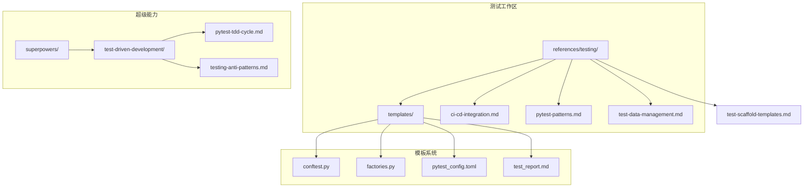
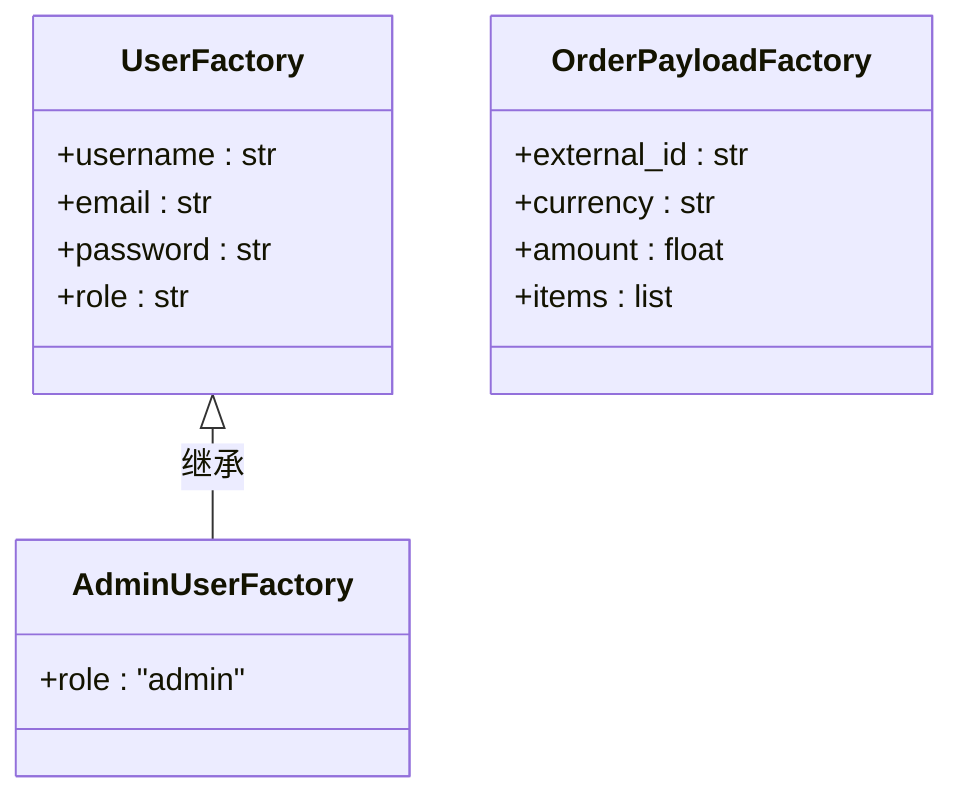
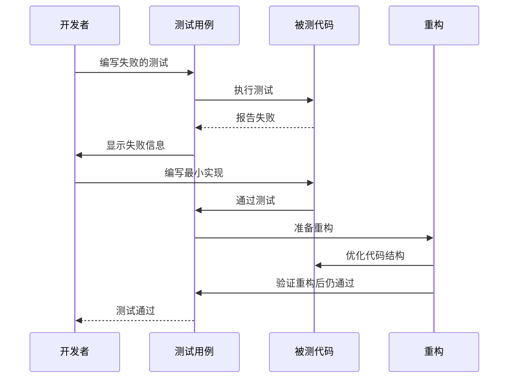
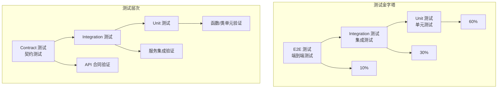
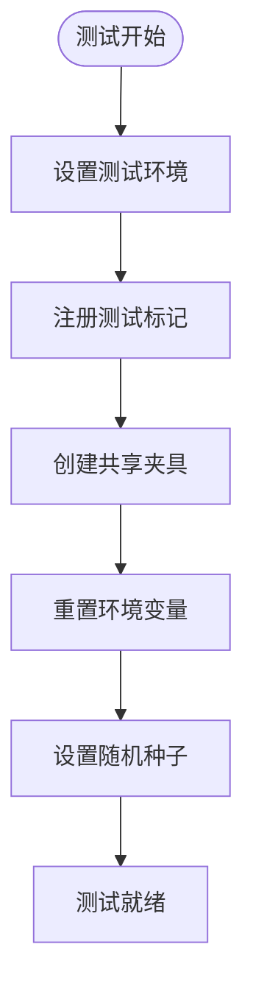
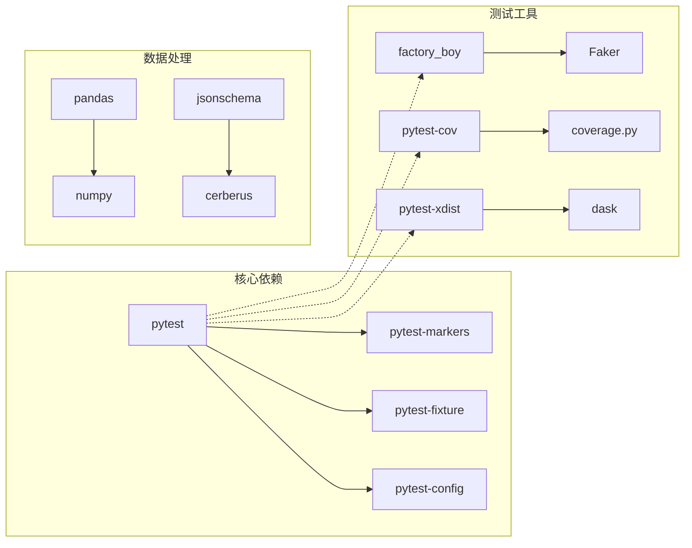

# pytest TDD 循环指南

<cite>
**本文档引用的文件**
- [pytest-tdd-cycle.md](file://altas-workflow/references/superpowers/test-driven-development/pytest-tdd-cycle.md)
- [testing-anti-patterns.md](file://altas-workflow/references/superpowers/test-driven-development/testing-anti-patterns.md)
- [pytest-patterns.md](file://altas-workflow/references/testing/pytest-patterns.md)
- [test-data-management.md](file://altas-workflow/references/testing/test-data-management.md)
- [ci-cd-integration.md](file://altas-workflow/references/testing/ci-cd-integration.md)
- [test-scaffold-templates.md](file://altas-workflow/references/testing/test-scaffold-templates.md)
- [conftest.py](file://altas-workflow/references/testing/templates/conftest.py)
- [factories.py](file://altas-workflow/references/testing/templates/factories.py)
- [pytest_config.toml](file://altas-workflow/references/testing/templates/pytest_config.toml)
- [test_report.md](file://altas-workflow/references/testing/templates/test_report.md)
</cite>

## 目录
1. [引言](#引言)
2. [项目结构](#项目结构)
3. [核心组件](#核心组件)
4. [架构概览](#架构概览)
5. [详细组件分析](#详细组件分析)
6. [依赖分析](#依赖分析)
7. [性能考虑](#性能考虑)
8. [故障排除指南](#故障排除指南)
9. [结论](#结论)
10. [附录](#附录)

## 引言

本指南专注于基于 pytest 的测试驱动开发(TDD)循环实践，提供从理论到实践的完整指导。TDD作为一种迭代的软件开发方法，通过"编写失败的测试 → 编写最小代码使其通过 → 重构"的循环，确保代码质量和设计的持续改进。

本项目提供了完整的测试基础设施，包括：
- 标准化的 pytest 配置和标记系统
- 可复用的测试夹具(fixture)模板
- 工厂模式的数据生成器
- CI/CD 集成方案
- 测试报告模板

## 项目结构

该项目采用模块化组织方式，将测试相关的资源按功能域进行分类：

**图表来源**
- [test-scaffold-templates.md:1-81](file://altas-workflow/references/testing/test-scaffold-templates.md#L1-L81)
- [pytest-tdd-cycle.md](file://altas-workflow/references/superpowers/test-driven-development/pytest-tdd-cycle.md)

**章节来源**
- [test-scaffold-templates.md:1-81](file://altas-workflow/references/testing/test-scaffold-templates.md#L1-L81)

## 核心组件

### 测试配置系统

测试配置系统提供了标准化的 pytest 设置，确保团队在一致的环境中进行测试开发。

#### 标记系统
系统定义了六种核心测试标记：
- `unit`: 快速隔离的单元测试
- `integration`: 涉及真实依赖的集成测试
- `contract`: 验证 API 合同的测试
- `slow`: 运行时间较长的测试
- `e2e`: 端到端测试
- `flaky`: 已知不稳定测试（启用重试）

#### 环境配置
- API 基础 URL 默认指向本地开发服务器
- HTTP 超时时间可配置
- 环境变量自动重置为测试状态
- 随机种子固定以确保测试可重现性

**章节来源**
- [conftest.py:15-67](file://altas-workflow/references/testing/templates/conftest.py#L15-L67)
- [pytest_config.toml:6-19](file://altas-workflow/references/testing/templates/pytest_config.toml#L6-L19)

### 测试数据管理

#### 工厂模式实现
使用 factory_boy 和 Faker 库创建可预测且多样化的测试数据：

**图表来源**
- [factories.py:16-49](file://altas-workflow/references/testing/templates/factories.py#L16-L49)

#### 数据生成策略
- 用户数据：用户名、邮箱、密码、角色
- 订单数据：UUID 外部 ID、货币、金额、商品列表
- 邮箱验证：提供无效邮箱的构造函数

**章节来源**
- [factories.py:16-50](file://altas-workflow/references/testing/templates/factories.py#L16-L50)

### 测试报告系统

标准化的测试报告模板包含：
- 基本信息：测试范围、契约来源、执行环境
- 策略摘要：测试层级、风险矩阵、可追溯性
- 结果统计：总测试数、通过/失败/跳过数量
- 质量度量：覆盖率、通过率、不稳定风险等指标
- 缺口分析：P0-P2 问题分类

**章节来源**
- [test_report.md:1-59](file://altas-workflow/references/testing/templates/test_report.md#L1-L59)

## 架构概览

### TDD 循环流程

**图表来源**
- [pytest-tdd-cycle.md](file://altas-workflow/references/superpowers/test-driven-development/pytest-tdd-cycle.md)

### 测试金字塔架构

**图表来源**
- [pytest-tdd-cycle.md](file://altas-workflow/references/superpowers/test-driven-development/pytest-tdd-cycle.md)

## 详细组件分析

### 测试夹具系统

#### 基础夹具模板
基础夹具提供了测试环境的标准配置：

**图表来源**
- [conftest.py:15-67](file://altas-workflow/references/testing/templates/conftest.py#L15-L67)

#### API 客户端夹具
用于 HTTP API 测试的客户端封装，支持：
- 统一的 API 基础 URL 配置
- 请求头管理和认证处理
- 错误响应处理和重试机制

#### 数据库回滚夹具
针对数据库集成测试的专用夹具：
- 事务性测试隔离
- 自动回滚机制
- 测试数据清理

**章节来源**
- [conftest.py:24-67](file://altas-workflow/references/testing/templates/conftest.py#L24-L67)

### 测试模式与最佳实践

#### 常见测试模式
项目总结了多种有效的测试模式：
- 断言模式：明确的期望值验证
- 行为模式：关注对象行为而非实现细节
- 状态模式：验证系统状态变化
- 交互模式：验证对象间交互

#### 反模式识别
避免常见的测试陷阱：
- 测试过于脆弱：过度依赖具体实现
- 测试运行缓慢：不必要的外部依赖
- 测试难以维护：测试代码复杂度高
- 测试覆盖不均：重点区域缺乏测试

**章节来源**
- [pytest-patterns.md](file://altas-workflow/references/testing/pytest-patterns.md)
- [testing-anti-patterns.md](file://altas-workflow/references/superpowers/test-driven-development/testing-anti-patterns.md)

### CI/CD 集成

#### 自动化测试流水线
- 代码提交触发测试
- 多环境测试矩阵
- 并行执行优化
- 覆盖率报告生成

#### 质量门禁
- 最小覆盖率阈值
- 失败测试阻止合并
- 性能回归检测
- 安全漏洞扫描

**章节来源**
- [ci-cd-integration.md](file://altas-workflow/references/testing/ci-cd-integration.md)

## 依赖分析

### 外部依赖关系

**图表来源**
- [pytest_config.toml:51-58](file://altas-workflow/references/testing/templates/pytest_config.toml#L51-L58)

### 内部模块依赖

测试系统的内部模块遵循清晰的依赖层次：
- 基础配置层：conftest.py 提供核心设置
- 工具层：工厂、夹具、辅助函数
- 业务层：具体的测试用例和断言逻辑
- 报告层：测试结果收集和分析

**章节来源**
- [test-scaffold-templates.md:28-34](file://altas-workflow/references/testing/test-scaffold-templates.md#L28-L34)

## 性能考虑

### 测试执行优化

#### 并行执行策略
- 使用 pytest-xdist 实现多进程并行
- 合理的进程数量配置
- 避免共享状态的竞争条件

#### 内存管理
- 及时清理临时数据
- 控制测试数据规模
- 优化大对象的生命周期

#### 网络测试优化
- 使用本地模拟服务
- 缓存外部 API 响应
- 实现超时和重试策略

### 性能监控

#### 关键指标
- 测试执行时间分布
- 内存使用峰值
- 并发测试成功率
- CI 执行时间趋势

#### 优化建议
- 识别慢测试并重构
- 减少不必要的依赖
- 使用更高效的断言方法

## 故障排除指南

### 常见问题诊断

#### 测试失败排查
1. **环境问题**：检查 TEST_ENV 和相关环境变量
2. **数据问题**：验证测试数据生成和清理
3. **网络问题**：确认 API 服务可用性和超时设置
4. **并发问题**：检查共享状态和锁机制

#### 调试技巧
- 使用 pytest --pdb 进入调试模式
- 启用详细日志输出
- 分离关注点进行孤立测试
- 使用更具体的断言消息

### 性能问题解决

#### 执行缓慢
- 分析测试依赖链
- 优化数据库查询
- 减少外部服务调用
- 实现适当的缓存策略

#### 内存泄漏
- 检查资源释放
- 验证对象生命周期
- 使用弱引用避免循环引用

**章节来源**
- [testing-anti-patterns.md](file://altas-workflow/references/superpowers/test-driven-development/testing-anti-patterns.md)

## 结论

本指南提供了基于 pytest 的完整 TDD 实践框架，通过标准化的测试基础设施和最佳实践，帮助团队建立高质量的测试文化。

### 核心价值

1. **一致性**：标准化的配置和模板确保团队协作的一致性
2. **可扩展性**：模块化的架构支持不同规模项目的测试需求
3. **可维护性**：清晰的依赖关系和文档便于长期维护
4. **可移植性**：独立的模板系统可在不同项目间复用

### 实施建议

1. **渐进式采用**：从简单的单元测试开始，逐步扩展到集成和端到端测试
2. **团队培训**：确保所有开发者理解 TDD 原则和工具使用
3. **持续改进**：定期回顾测试质量，优化测试策略
4. **工具集成**：将测试工具集成到开发工作流中

## 附录

### 快速开始清单

1. **环境准备**：安装 pytest 和相关依赖
2. **配置设置**：复制基础配置到项目根目录
3. **模板应用**：根据项目类型选择合适的模板
4. **测试编写**：遵循 TDD 循环开始编写测试
5. **持续集成**：配置 CI/CD 流水线

### 参考资源

- pytest 官方文档和最佳实践
- 测试数据管理策略
- CI/CD 集成模式
- 性能测试和监控