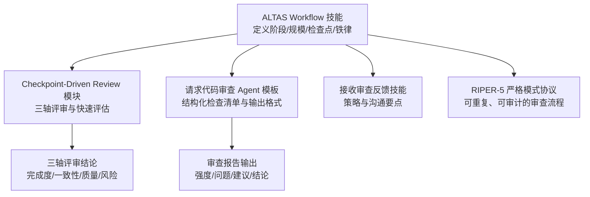
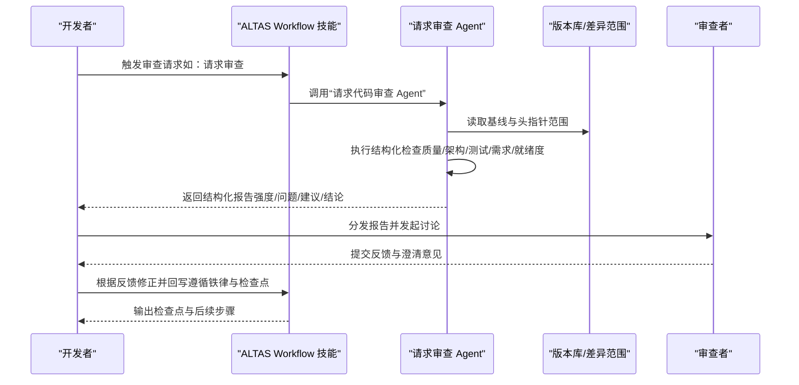
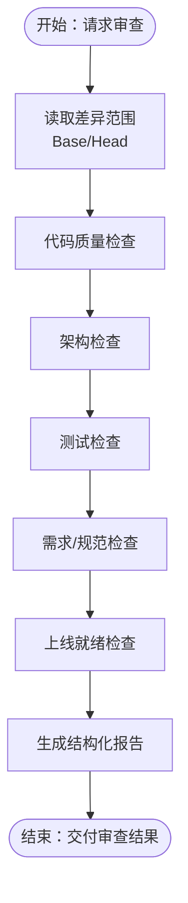
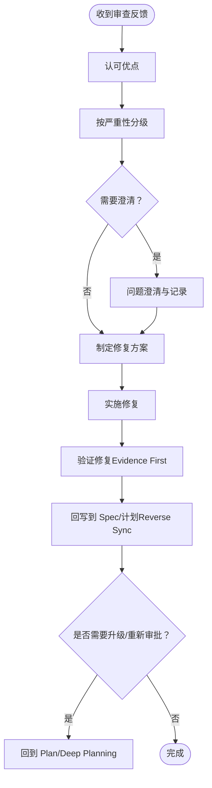
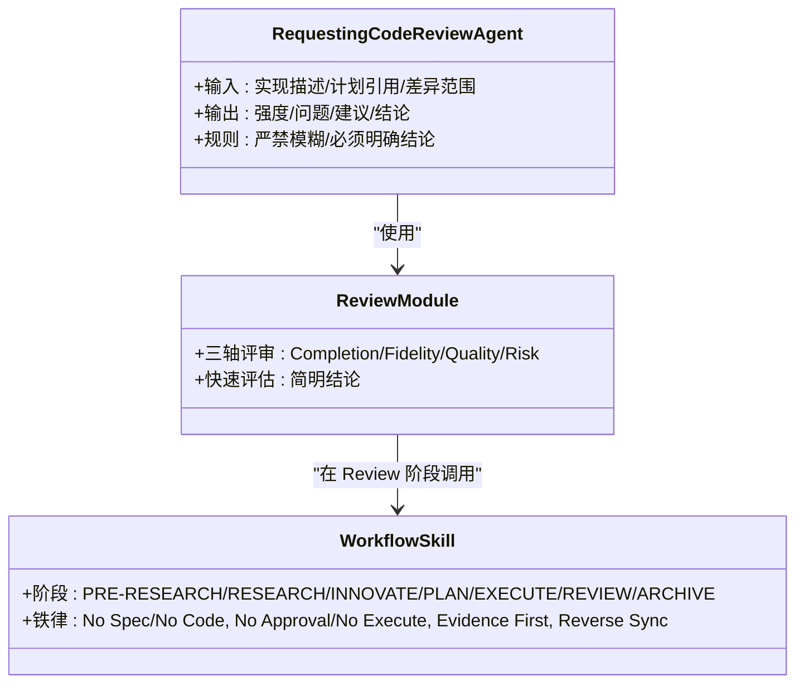
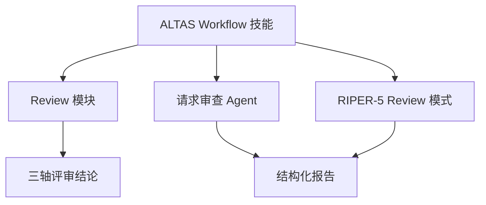

# 代码审查流程

<cite>
**本文引用的文件**
- [altas-workflow/SKILL.md](file://altas-workflow/SKILL.md)
- [altas-workflow/QUICKSTART.md](file://altas-workflow/QUICKSTART.md)
- [altas-workflow/reference-index.md](file://altas-workflow/reference-index.md)
- [altas-workflow/references/checkpoint-driven/modules.md](file://altas-workflow/references/checkpoint-driven/modules.md)
- [altas-workflow/references/checkpoint-driven/SKILL.md](file://altas-workflow/references/checkpoint-driven/SKILL.md)
- [altas-workflow/references/superpowers/requesting-code-review/code-reviewer.md](file://altas-workflow/references/superpowers/requesting-code-review/code-reviewer.md)
- [altas-workflow/references/agents/code-reviewer.md](file://altas-workflow/references/agents/code-reviewer.md)
- [altas-workflow/protocols/RIPER-5.md](file://altas-workflow/protocols/RIPER-5.md)
</cite>

## 目录
1. [简介](#简介)
2. [项目结构](#项目结构)
3. [核心组件](#核心组件)
4. [架构总览](#架构总览)
5. [详细组件分析](#详细组件分析)
6. [依赖关系分析](#依赖关系分析)
7. [性能考量](#性能考量)
8. [故障排查指南](#故障排查指南)
9. [结论](#结论)
10. [附录](#附录)

## 简介
本文件面向团队与个人开发者，系统化阐述基于 ALTAS Workflow 的代码审查流程与质量保障体系。文档围绕“请求审查”“接收反馈”“Agent 审查模板”“检查清单与常见问题识别”“效率与协作”五个维度展开，结合仓库中的协议、技能与模板文件，给出可落地的实施指南与可视化图示，帮助团队建立稳定、高效且可传承的代码审查实践。

## 项目结构
该仓库以“工作流协议 + 按需模块 + Agent 模板”的方式组织代码审查相关内容，核心包括：
- 工作流总控：ALTAS Workflow 技能文件，定义规模评估、阶段划分、检查点与铁律约束
- 审查模块：Checkpoint-Driven 的 Review 模块，定义三轴评审与快速评估维度
- 审查 Agent：请求审查与接收审查的模板与技能，提供结构化输出与严重性分级
- 协议与模式：RIPER-5 严格模式，确保审查过程的可重复与可审计

图表来源
- [altas-workflow/SKILL.md:194-209](file://altas-workflow/SKILL.md#L194-L209)
- [altas-workflow/references/checkpoint-driven/modules.md:31-43](file://altas-workflow/references/checkpoint-driven/modules.md#L31-L43)
- [altas-workflow/references/superpowers/requesting-code-review/code-reviewer.md:30-92](file://altas-workflow/references/superpowers/requesting-code-review/code-reviewer.md#L30-L92)
- [altas-workflow/protocols/RIPER-5.md:104-125](file://altas-workflow/protocols/RIPER-5.md#L104-L125)

章节来源
- [altas-workflow/SKILL.md:138-219](file://altas-workflow/SKILL.md#L138-L219)
- [altas-workflow/reference-index.md:63-72](file://altas-workflow/reference-index.md#L63-L72)

## 核心组件
- 工作流总控（ALTAS Workflow）
  - 定义阶段：PRE-RESEARCH、RESEARCH、INNOVATE、PLAN、EXECUTE、REVIEW、ARCHIVE
  - 铁律约束：No Spec, No Code；No Approval, No Execute；Evidence First；Reverse Sync；TDD 铁律等
  - 规模评估：XS/S/M/L 四档，按任务复杂度与影响范围选择深度
  - 检查点：M/L 规模输出完整检查点，S 规模输出短检查点
- 审查模块（Checkpoint-Driven）
  - 三轴评审：需求达成、Spec-代码一致性、代码内在质量
  - 快速评估：Completion/Fidelity/Quality/Risk
- 审查 Agent 模板
  - 结构化检查清单：代码质量、架构、测试、需求、上线就绪
  - 严重性分级：Critical/Important/Minor
  - 输出格式：Strengths、Issues（含定位与修复建议）、Recommendations、Assessment
- 协议与模式（RIPER-5）
  - 严格模式：RESEARCH/INNOVATE/PLAN/EXECUTE/REVIEW 五态机，强制模式声明与偏差处理

章节来源
- [altas-workflow/SKILL.md:90-102](file://altas-workflow/SKILL.md#L90-L102)
- [altas-workflow/SKILL.md:138-219](file://altas-workflow/SKILL.md#L138-L219)
- [altas-workflow/references/checkpoint-driven/modules.md:31-43](file://altas-workflow/references/checkpoint-driven/modules.md#L31-L43)
- [altas-workflow/references/superpowers/requesting-code-review/code-reviewer.md:30-92](file://altas-workflow/references/superpowers/requesting-code-review/code-reviewer.md#L30-L92)
- [altas-workflow/protocols/RIPER-5.md:25-125](file://altas-workflow/protocols/RIPER-5.md#L25-L125)

## 架构总览
下图展示了“请求代码审查”的端到端流程，从任务触发、Agent 调用、到产出结构化报告与结论闭环。

图表来源
- [altas-workflow/SKILL.md:194-209](file://altas-workflow/SKILL.md#L194-L209)
- [altas-workflow/references/superpowers/requesting-code-review/code-reviewer.md:30-92](file://altas-workflow/references/superpowers/requesting-code-review/code-reviewer.md#L30-L92)

章节来源
- [altas-workflow/SKILL.md:194-209](file://altas-workflow/SKILL.md#L194-L209)
- [altas-workflow/references/superpowers/requesting-code-review/code-reviewer.md:12-92](file://altas-workflow/references/superpowers/requesting-code-review/code-reviewer.md#L12-L92)

## 详细组件分析

### 组件A：请求代码审查（Agent 模板）
- 目标与范围
  - 对比实现与计划/需求，评估代码质量、架构、测试与上线就绪度
  - 明确 Git 差异范围（Base/Head），便于聚焦审查
- 结构化检查清单
  - 代码质量：关注关注点分离、错误处理、类型安全、DRY、边界处理
  - 架构：设计合理性、可扩展性、性能与安全
  - 测试：测试有效性、边界覆盖、集成测试、全部通过
  - 需求：是否满足计划/规范、无范围蔓延、破坏性变更文档化
  - 上线就绪：迁移策略、兼容性、文档、明显缺陷
- 输出格式
  - Strengths：具体亮点
  - Issues：按严重性分级，含文件定位、问题描述、影响说明、修复建议
  - Recommendations：改进意见
  - Assessment：是否可合并与理由

图表来源
- [altas-workflow/references/superpowers/requesting-code-review/code-reviewer.md:20-92](file://altas-workflow/references/superpowers/requesting-code-review/code-reviewer.md#L20-L92)

章节来源
- [altas-workflow/references/superpowers/requesting-code-review/code-reviewer.md:12-147](file://altas-workflow/references/superpowers/requesting-code-review/code-reviewer.md#L12-L147)

### 组件B：接收审查反馈与沟通策略
- 接收反馈的策略
  - 先认可优点，再逐条讨论问题，避免情绪化
  - 对于严重性问题（Critical/Important）优先处理，Minor 问题纳入后续迭代
  - 针对“为何重要”和“如何修复”进行澄清与记录
- 问题澄清与修改实施
  - 将问题映射到具体文件与行号，必要时补充最小可复现示例
  - 修改后回写到 Spec/计划，遵循 Reverse Sync（先更新 Spec，再修代码）
  - 通过 Evidence First 验证修复效果，确保完成由验证结果证明
- 与工作流的衔接
  - 若涉及计划偏差，回到 Plan 阶段重新审批
  - 若为架构或跨模块改动，考虑升级规模并启用 Multi-project/Deep Planning

图表来源
- [altas-workflow/SKILL.md:90-102](file://altas-workflow/SKILL.md#L90-L102)
- [altas-workflow/SKILL.md:167-173](file://altas-workflow/SKILL.md#L167-L173)

章节来源
- [altas-workflow/SKILL.md:90-102](file://altas-workflow/SKILL.md#L90-L102)
- [altas-workflow/SKILL.md:167-173](file://altas-workflow/SKILL.md#L167-L173)

### 组件C：代码审查 Agent 的模板设计与使用
- 模板设计
  - 明确输入：实现描述、计划/需求引用、差异范围
  - 明确输出：Strengths、Issues（分级）、Recommendations、Assessment
  - 明确规则：不得含糊其辞、必须给出明确结论
- 使用方法
  - 在 Review 阶段调用，结合三轴评审与快速评估
  - 与 Checkpoint-Driven 的 Review 模块配合，输出短结论或展开说明
  - 与 RIPER-5 的 Review 模式配合，进行逐项偏差标记与结论判定

图表来源
- [altas-workflow/references/superpowers/requesting-code-review/code-reviewer.md:30-92](file://altas-workflow/references/superpowers/requesting-code-review/code-reviewer.md#L30-L92)
- [altas-workflow/references/checkpoint-driven/modules.md:31-43](file://altas-workflow/references/checkpoint-driven/modules.md#L31-L43)
- [altas-workflow/SKILL.md:138-219](file://altas-workflow/SKILL.md#L138-L219)

章节来源
- [altas-workflow/references/superpowers/requesting-code-review/code-reviewer.md:30-92](file://altas-workflow/references/superpowers/requesting-code-review/code-reviewer.md#L30-L92)
- [altas-workflow/references/checkpoint-driven/modules.md:31-43](file://altas-workflow/references/checkpoint-driven/modules.md#L31-L43)
- [altas-workflow/SKILL.md:138-219](file://altas-workflow/SKILL.md#L138-L219)

### 组件D：审查准备、提交规范与沟通技巧
- 审查准备
  - 在 Review 阶段前完成三轴评审，确保实现与计划/需求一致
  - 准备差异范围与最小可复现示例，便于审查者聚焦
- 提交规范
  - 使用结构化检查点输出（M/L），包含“已完成/预期产出/下一步操作”
  - 严格遵循 No Approval, No Execute；未获批准不得进入实现
- 沟通技巧
  - 先肯定再建议，针对问题给出修复建议与影响说明
  - 对于架构或跨模块改动，提前说明风险与收益，必要时升级规模

章节来源
- [altas-workflow/SKILL.md:115-135](file://altas-workflow/SKILL.md#L115-L135)
- [altas-workflow/SKILL.md:194-209](file://altas-workflow/SKILL.md#L194-L209)
- [altas-workflow/QUICKSTART.md:36-49](file://altas-workflow/QUICKSTART.md#L36-L49)

### 组件E：效率提升与团队协作
- 效率提升
  - 使用 Checkpoint-Driven 的 Review 模块进行快速评估，减少冗长讨论
  - 通过 RIPER-5 的 Review 模式进行逐项偏差标记，降低遗漏风险
  - 将审查结论与 Trace to Sources 一起沉淀，形成知识资产
- 团队协作
  - Spec 为团队共享真相源，核心开发者 Review Plan，不 Review 全部代码
  - 多项目场景启用 Multi-project 模块，明确边界与依赖顺序
  - 使用 Agent 模板统一输出，降低沟通成本

章节来源
- [altas-workflow/references/checkpoint-driven/modules.md:31-43](file://altas-workflow/references/checkpoint-driven/modules.md#L31-L43)
- [altas-workflow/protocols/RIPER-5.md:104-125](file://altas-workflow/protocols/RIPER-5.md#L104-L125)
- [altas-workflow/reference-index.md:49-58](file://altas-workflow/reference-index.md#L49-L58)

## 依赖关系分析
- 工作流总控与审查模块
  - Review 阶段依赖 Checkpoint-Driven 的 Review 模块，输出三轴评审结论
- 审查 Agent 与工作流
  - 请求审查 Agent 在 Review 阶段被调用，输出结构化报告
  - 与 Workflow 的铁律与检查点机制协同，确保可审计与可追溯
- 协议与模式
  - RIPER-5 的 Review 模式与 Agent 的结构化输出相互印证，形成闭环

图表来源
- [altas-workflow/SKILL.md:194-209](file://altas-workflow/SKILL.md#L194-L209)
- [altas-workflow/references/checkpoint-driven/modules.md:31-43](file://altas-workflow/references/checkpoint-driven/modules.md#L31-L43)
- [altas-workflow/references/superpowers/requesting-code-review/code-reviewer.md:63-92](file://altas-workflow/references/superpowers/requesting-code-review/code-reviewer.md#L63-L92)
- [altas-workflow/protocols/RIPER-5.md:104-125](file://altas-workflow/protocols/RIPER-5.md#L104-L125)

章节来源
- [altas-workflow/SKILL.md:194-209](file://altas-workflow/SKILL.md#L194-L209)
- [altas-workflow/references/checkpoint-driven/modules.md:31-43](file://altas-workflow/references/checkpoint-driven/modules.md#L31-L43)
- [altas-workflow/references/superpowers/requesting-code-review/code-reviewer.md:63-92](file://altas-workflow/references/superpowers/requesting-code-review/code-reviewer.md#L63-L92)
- [altas-workflow/protocols/RIPER-5.md:104-125](file://altas-workflow/protocols/RIPER-5.md#L104-L125)

## 性能考量
- 降低上下文负担：按需加载参考文件，避免常驻大量文本
- 快速评估优先：在 Review 阶段先用三轴评审与快速评估确定优先级
- 自动化沉淀：利用归档模板与脚本，将结论与来源映射固化为知识资产

## 故障排查指南
- 常见问题
  - 审查结论模糊：检查 Agent 输出格式是否完整，是否包含文件定位与修复建议
  - 未获批准即实现：遵循 No Approval, No Execute；若已发生，立即回退到 Plan
  - 证据不足：坚持 Evidence First；在未验证前不宣布完成
- 解决路径
  - 回到 Plan 阶段补充证据与变更说明
  - 使用 Debug 模块进行系统化根因分析
  - 启用 Multi-project 模块明确跨项目边界与依赖

章节来源
- [altas-workflow/SKILL.md:90-102](file://altas-workflow/SKILL.md#L90-L102)
- [altas-workflow/references/checkpoint-driven/modules.md:18-29](file://altas-workflow/references/checkpoint-driven/modules.md#L18-L29)
- [altas-workflow/reference-index.md:85-93](file://altas-workflow/reference-index.md#L85-L93)

## 结论
通过将 ALTAS Workflow 的阶段化控制、Checkpoint-Driven 的快速评估、结构化的审查 Agent 模板与 RIPER-5 的严格模式有机结合，团队可以建立一套可重复、可审计、可传承的代码审查体系。建议在团队内统一使用 Agent 模板与检查点输出，配合三轴评审与知识沉淀，持续优化审查效率与质量。

## 附录
- 审查检查清单（摘自 Agent 模板）
  - 代码质量：关注点分离、错误处理、类型安全、DRY、边界处理
  - 架构：设计合理性、可扩展性、性能与安全
  - 测试：测试有效性、边界覆盖、集成测试、全部通过
  - 需求：满足计划/规范、无范围蔓延、破坏性变更文档化
  - 上线就绪：迁移策略、兼容性、文档、明显缺陷
- 严重性分级（摘自 Agent 模板）
  - Critical（必须修复）
  - Important（应修复）
  - Minor（建议性）

章节来源
- [altas-workflow/references/superpowers/requesting-code-review/code-reviewer.md:30-92](file://altas-workflow/references/superpowers/requesting-code-review/code-reviewer.md#L30-L92)