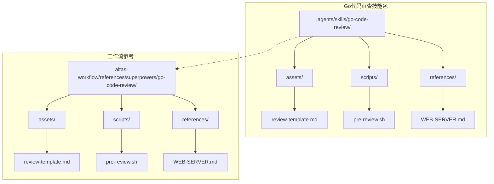
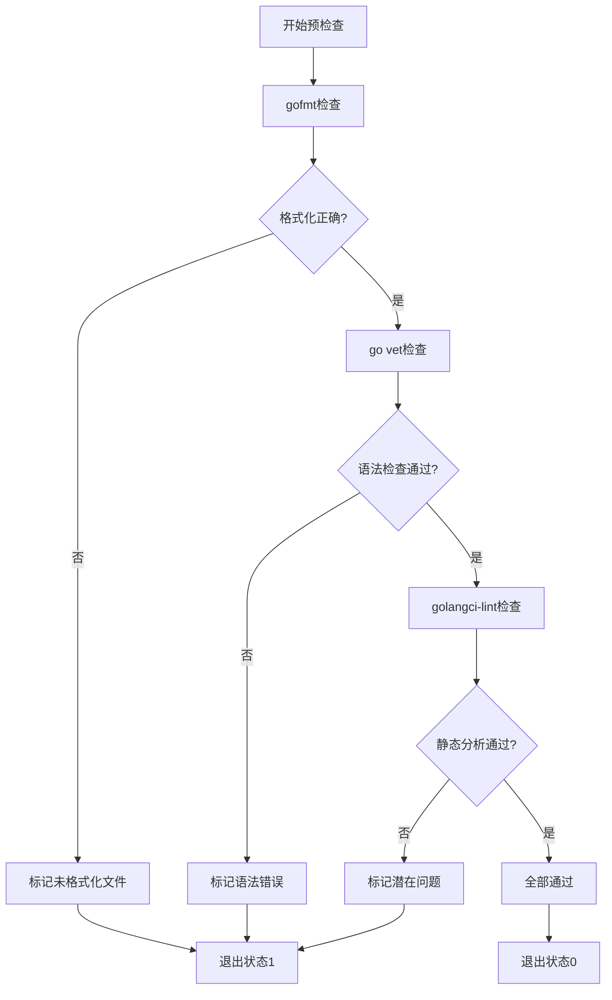
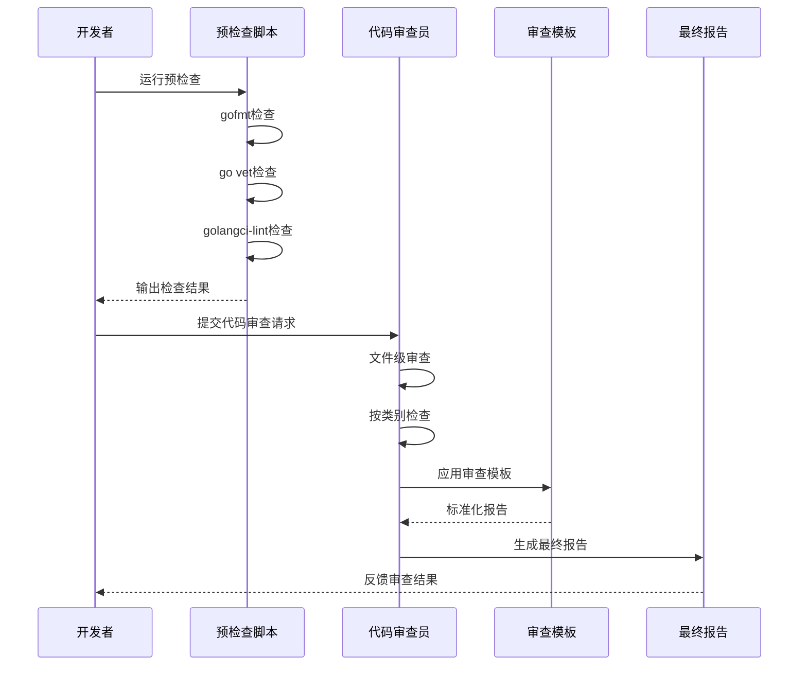
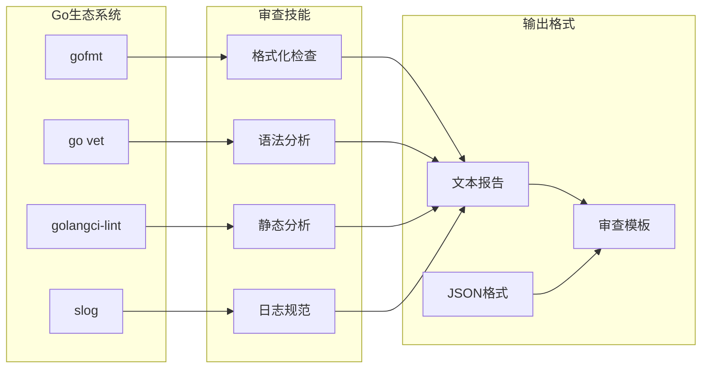
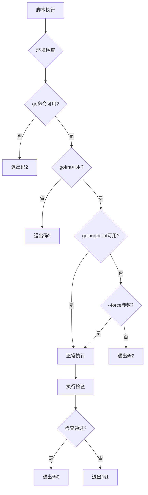
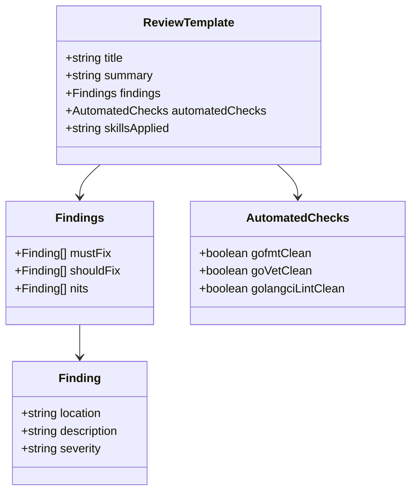
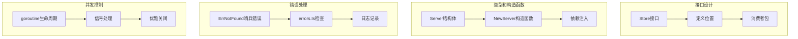
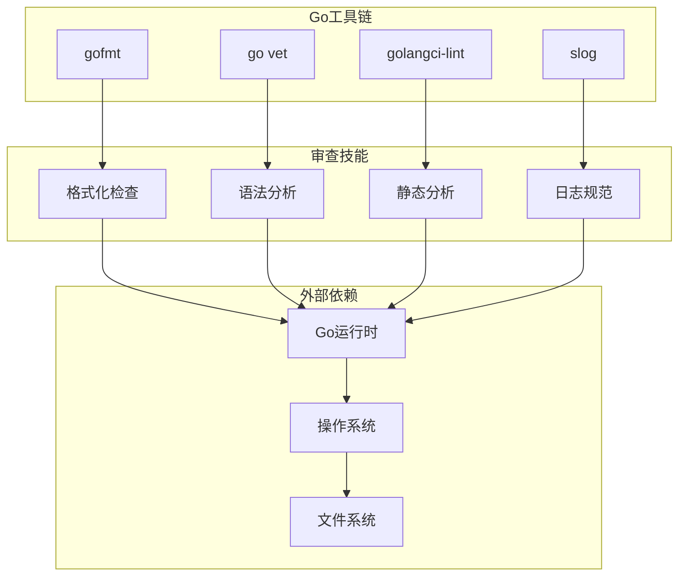
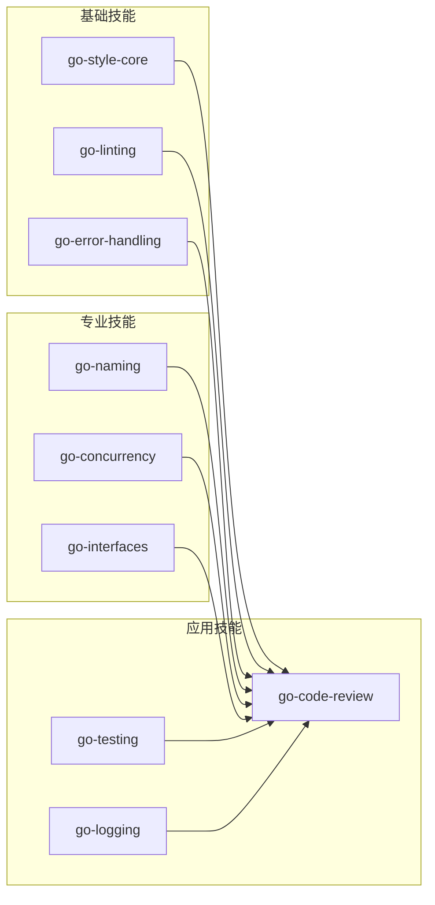
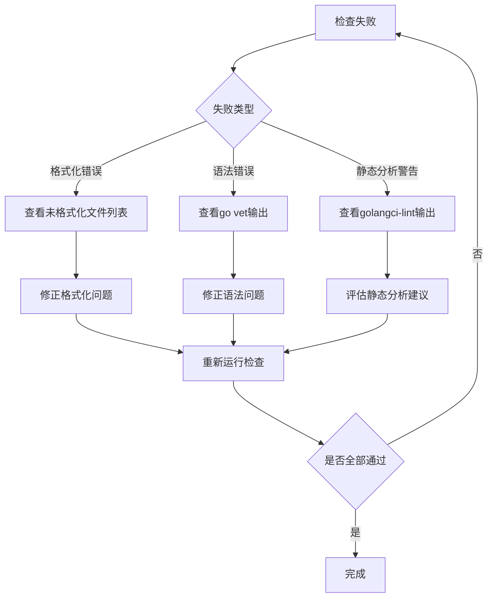

# Go代码审查技能

<cite>
**本文档引用的文件**
- [SKILL.md](file://.agents/skills/go-code-review/SKILL.md)
- [review-template.md](file://.agents/skills/go-code-review/assets/review-template.md)
- [pre-review.sh](file://.agents/skills/go-code-review/scripts/pre-review.sh)
- [WEB-SERVER.md](file://.agents/skills/go-code-review/references/WEB-SERVER.md)
- [SKILL.md](file://altas-workflow/references/superpowers/go-code-review/SKILL.md)
- [review-template.md](file://altas-workflow/references/superpowers/go-code-review/assets/review-template.md)
- [pre-review.sh](file://altas-workflow/references/superpowers/go-code-review/scripts/pre-review.sh)
- [WEB-SERVER.md](file://altas-workflow/references/superpowers/go-code-review/references/WEB-SERVER.md)
</cite>

## 目录
1. [简介](#简介)
2. [项目结构](#项目结构)
3. [核心组件](#核心组件)
4. [架构概览](#架构概览)
5. [详细组件分析](#详细组件分析)
6. [依赖关系分析](#依赖关系分析)
7. [性能考虑](#性能考虑)
8. [故障排除指南](#故障排除指南)
9. [结论](#结论)

## 简介

Go代码审查技能是一个专门用于审查Go语言代码质量的自动化工具集。该技能专注于识别格式化问题、错误处理模式、并发安全、命名约定、接口设计等关键代码质量要素，确保代码符合社区最佳实践标准。

该技能的核心价值在于提供系统化的代码审查流程，通过自动化预检查和人工复核相结合的方式，提高代码质量和开发效率。特别适用于Pull Request提交前的质量把关和日常代码审查工作。

## 项目结构

该项目采用模块化组织方式，主要包含以下核心目录结构：

**图表来源**
- [.agents/skills/go-code-review/SKILL.md:1-184](file://.agents/skills/go-code-review/SKILL.md#L1-L184)
- [altas-workflow/references/superpowers/go-code-review/SKILL.md:1-171](file://altas-workflow/references/superpowers/go-code-review/SKILL.md#L1-L171)

**章节来源**
- [.agents/skills/go-code-review/SKILL.md:1-184](file://.agents/skills/go-code-review/SKILL.md#L1-L184)
- [altas-workflow/references/superpowers/go-code-review/SKILL.md:1-171](file://altas-workflow/references/superpowers/go-code-review/SKILL.md#L1-L171)

## 核心组件

### 1. 审查检查清单

Go代码审查技能提供了全面的检查清单，涵盖以下关键领域：

#### 格式化规范
- 使用 `gofmt` 或 `goimports` 进行代码格式化
- 遵循Go官方格式化标准

#### 文档注释
- 导出名称必须有文档注释
- 非平凡的未导出声明也需要文档注释
- 包注释应紧邻包声明且无空行

#### 错误处理
- 避免丢弃错误（_）
- 错误字符串应为小写且无标点符号
- 使用多返回值而非魔法数字

#### 命名约定
- 使用 `MixedCaps` 或 `mixedCaps`，避免下划线
- 统一缩略词大小写（URL、ID、HTTP）
- 合理使用变量名长度

**章节来源**
- [.agents/skills/go-code-review/SKILL.md:27-135](file://.agents/skills/go-code-review/SKILL.md#L27-L135)

### 2. 自动化预检查工具

预检查脚本提供了三个层次的自动化验证：

**图表来源**
- [.agents/skills/go-code-review/scripts/pre-review.sh:79-112](file://.agents/skills/go-code-review/scripts/pre-review.sh#L79-L112)

**章节来源**
- [.agents/skills/go-code-review/scripts/pre-review.sh:1-247](file://.agents/skills/go-code-review/scripts/pre-review.sh#L1-L247)

### 3. 审查模板系统

标准化的审查报告模板确保了审查结果的一致性和可读性：

| 模板部分 | 描述 | 用途 |
|---------|------|------|
| Summary | 变更简要描述 | 提供上下文信息 |
| Findings | 审查发现 | 分类展示问题 |
| Must Fix | 关键问题 | 必须修复的问题 |
| Should Fix | 建议改进 | 推荐但非关键问题 |
| Nits | 细节建议 | 轻微改进建议 |
| Automated Checks | 自动化检查结果 | 展示工具检查状态 |

**章节来源**
- [.agents/skills/go-code-review/assets/review-template.md:1-24](file://.agents/skills/go-code-review/assets/review-template.md#L1-L24)

## 架构概览

### 审查流程架构

**图表来源**
- [.agents/skills/go-code-review/SKILL.md:13-23](file://.agents/skills/go-code-review/SKILL.md#L13-L23)
- [.agents/skills/go-code-review/scripts/pre-review.sh:154-165](file://.agents/skills/go-code-review/scripts/pre-review.sh#L154-L165)

### 技术栈集成

该技能集成功了多个Go生态系统工具：

**图表来源**
- [.agents/skills/go-code-review/SKILL.md:154-165](file://.agents/skills/go-code-review/SKILL.md#L154-L165)
- [.agents/skills/go-code-review/scripts/pre-review.sh:114-176](file://.agents/skills/go-code-review/scripts/pre-review.sh#L114-L176)

**章节来源**
- [.agents/skills/go-code-review/SKILL.md:1-184](file://.agents/skills/go-code-review/SKILL.md#L1-L184)

## 详细组件分析

### 预检查脚本深度分析

#### 功能特性

预检查脚本提供了灵活的配置选项和多种输出格式：

| 选项 | 默认值 | 描述 | 用途 |
|------|--------|------|------|
| --json | 关闭 | JSON格式输出 | 机器可读报告 |
| --force | 关闭 | 强制执行（跳过golangci-lint） | 环境限制场景 |
| --limit N | 0（无限制） | 限制每部分显示数量 | 大型项目的可读性 |
| --version | 1.0.0 | 显示版本信息 | 版本管理 |

#### 错误处理机制

**图表来源**
- [.agents/skills/go-code-review/scripts/pre-review.sh:69-107](file://.agents/skills/go-code-review/scripts/pre-review.sh#L69-L107)

**章节来源**
- [.agents/skills/go-code-review/scripts/pre-review.sh:1-247](file://.agents/skills/go-code-review/scripts/pre-review.sh#L1-L247)

### 审查模板系统

#### 模板结构设计

审查模板采用了层次化的结构设计，确保审查结果的清晰性和一致性：

**图表来源**
- [.agents/skills/go-code-review/assets/review-template.md:1-24](file://.agents/skills/go-code-review/assets/review-template.md#L1-L24)

**章节来源**
- [.agents/skills/go-code-review/assets/review-template.md:1-24](file://.agents/skills/go-code-review/assets/review-template.md#L1-L24)

### 综合示例分析

#### Web服务器示例

Web服务器示例展示了Go技能在实际生产环境中的综合应用：

**图表来源**
- [.agents/skills/go-code-review/references/WEB-SERVER.md:23-104](file://.agents/skills/go-code-review/references/WEB-SERVER.md#L23-L104)

**章节来源**
- [.agents/skills/go-code-review/references/WEB-SERVER.md:1-120](file://.agents/skills/go-code-review/references/WEB-SERVER.md#L1-L120)

## 依赖关系分析

### 工具链依赖

该技能集与Go生态系统紧密集成，形成了完整的工具链依赖关系：

**图表来源**
- [.agents/skills/go-code-review/scripts/pre-review.sh:69-77](file://.agents/skills/go-code-review/scripts/pre-review.sh#L69-L77)

### 技能间依赖关系

**图表来源**
- [.agents/skills/go-code-review/SKILL.md:175-184](file://.agents/skills/go-code-review/SKILL.md#L175-L184)

**章节来源**
- [.agents/skills/go-code-review/SKILL.md:175-184](file://.agents/skills/go-code-review/SKILL.md#L175-L184)

## 性能考虑

### 预检查性能优化

预检查脚本在设计时充分考虑了性能因素：

1. **并行执行策略**：各检查步骤独立执行，避免不必要的等待
2. **早期失败机制**：任何一步失败立即停止后续检查
3. **输出限制功能**：支持限制输出数量，避免大型项目产生过多输出
4. **条件执行**：根据可用性动态选择检查工具

### 内存使用优化

- 使用流式处理避免加载整个代码库到内存
- 合理的缓冲区管理和垃圾回收
- 及时释放临时资源和文件句柄

## 故障排除指南

### 常见问题诊断

#### 环境配置问题

| 问题症状 | 可能原因 | 解决方案 |
|----------|----------|----------|
| "go命令未找到" | Go SDK未安装或PATH未配置 | 安装Go并添加到PATH |
| "gofmt未找到" | Go工具链不完整 | 安装完整Go工具链 |
| "golangci-lint未安装" | 可选工具未安装 | 安装golangci-lint或使用--force参数 |

#### 检查失败处理

**图表来源**
- [.agents/skills/go-code-review/scripts/pre-review.sh:178-244](file://.agents/skills/go-code-review/scripts/pre-review.sh#L178-L244)

**章节来源**
- [.agents/skills/go-code-review/scripts/pre-review.sh:1-247](file://.agents/skills/go-code-review/scripts/pre-review.sh#L1-L247)

### 调试技巧

1. **逐步执行**：分别运行各个检查工具以精确定位问题
2. **详细输出**：使用--json参数获取结构化输出便于分析
3. **限制范围**：对特定目录或文件运行检查以缩小问题范围
4. **版本兼容性**：检查Go版本和工具版本的兼容性

## 结论

Go代码审查技能提供了一个完整、系统化的代码质量保证框架。通过自动化预检查、标准化审查流程和综合示例指导，该技能能够有效提升Go代码的质量和一致性。

### 主要优势

1. **全面覆盖**：涵盖格式化、错误处理、并发、命名等多个关键方面
2. **自动化程度高**：预检查脚本减少重复劳动
3. **标准化输出**：统一的审查模板确保报告质量
4. **实用性强**：结合实际项目示例，易于理解和应用

### 最佳实践建议

1. **预检查优先**：在进行人工审查前先运行自动化检查
2. **分层审查**：先关注重大问题，再处理细节建议
3. **持续改进**：根据项目特点调整审查重点和严格程度
4. **团队协作**：建立统一的代码审查标准和流程

该技能为Go项目的代码质量管理提供了坚实的基础设施，有助于建立高质量的代码审查文化。