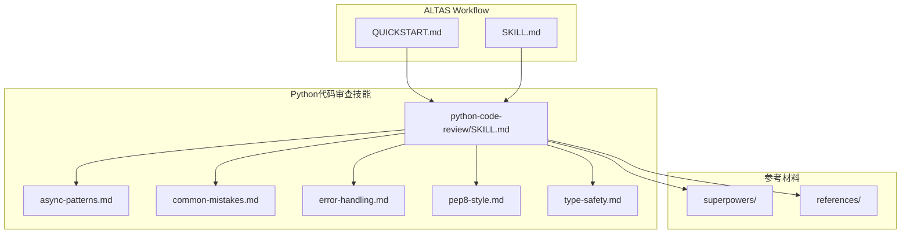
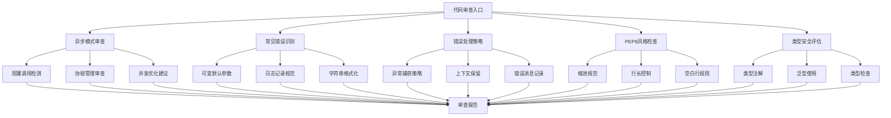
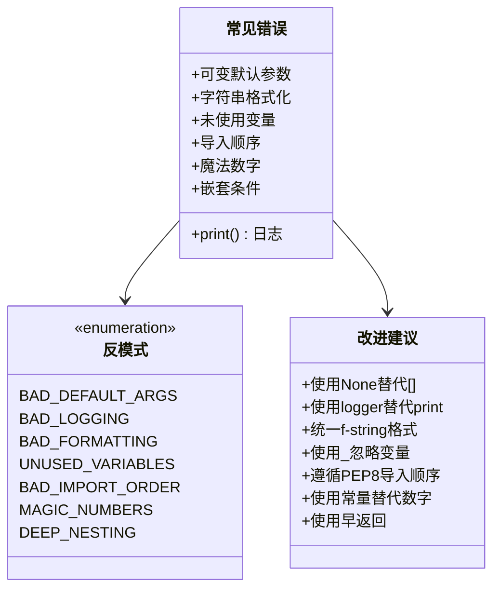
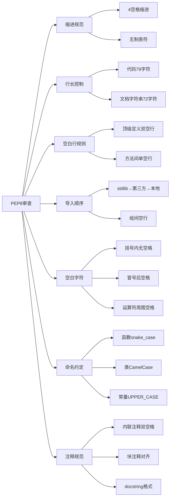
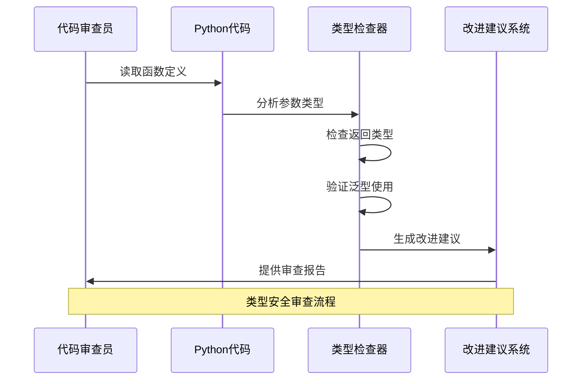
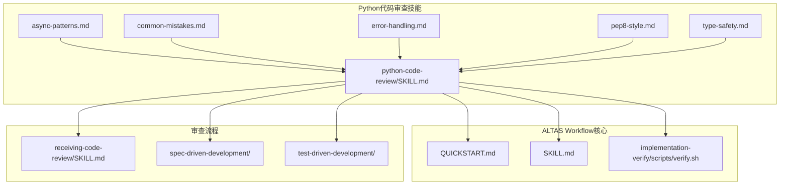

# Python代码审查技能

<cite>
**本文档引用的文件**
- [python-code-review/SKILL.md](file://altas-workflow/references/superpowers/python-code-review/SKILL.md)
- [async-patterns.md](file://altas-workflow/references/superpowers/python-code-review/references/async-patterns.md)
- [common-mistakes.md](file://altas-workflow/references/superpowers/python-code-review/references/common-mistakes.md)
- [error-handling.md](file://altas-workflow/references/superpowers/python-code-review/references/error-handling.md)
- [pep8-style.md](file://altas-workflow/references/superpowers/python-code-review/references/pep8-style.md)
- [type-safety.md](file://altas-workflow/references/superpowers/python-code-review/references/type-safety.md)
- [QUICKSTART.md](file://altas-workflow/QUICKSTART.md)
- [SKILL.md](file://altas-workflow/SKILL.md)
</cite>

## 目录
1. [简介](#简介)
2. [项目结构](#项目结构)
3. [核心组件](#核心组件)
4. [架构概览](#架构概览)
5. [详细组件分析](#详细组件分析)
6. [依赖分析](#依赖分析)
7. [性能考虑](#性能考虑)
8. [故障排除指南](#故障排除指南)
9. [结论](#结论)

## 简介

Python代码审查技能是ALTAS Workflow工作流中的一个重要组成部分，专门用于指导AI代理进行Python代码的质量审查和改进。该技能基于一系列最佳实践和反模式识别，旨在确保Python代码的可读性、可维护性和可靠性。

该技能体系涵盖了Python开发的各个方面，包括异步编程模式、常见错误、错误处理、PEP8风格指南和类型安全等关键领域。通过系统化的审查流程，帮助开发者识别和修复潜在问题，提高代码质量。

## 项目结构

Python代码审查技能位于ALTAS Workflow的超级能力（Superpowers）模块中，采用模块化组织结构：



**图表来源**
- [python-code-review/SKILL.md:1-50](file://altas-workflow/references/superpowers/python-code-review/SKILL.md#L1-L50)
- [QUICKSTART.md:1-50](file://altas-workflow/QUICKSTART.md#L1-L50)

**章节来源**
- [python-code-review/SKILL.md:1-50](file://altas-workflow/references/superpowers/python-code-review/SKILL.md#L1-L50)
- [QUICKSTART.md:1-100](file://altas-workflow/QUICKSTART.md#L1-L100)

## 核心组件

Python代码审查技能体系包含五个核心组件，每个组件专注于不同的代码质量维度：

### 1. 异步编程模式审查
重点关注Python异步编程中的常见陷阱和最佳实践，包括阻塞调用、协程管理、并发处理等。

### 2. 常见错误识别
涵盖Python开发中的典型错误模式，如可变默认参数、日志记录不当、字符串格式化混乱等。

### 3. 错误处理策略
指导如何正确处理异常，包括异常捕获、上下文保留、错误消息记录等。

### 4. PEP8风格指南
提供Python代码风格的标准化指导，包括缩进、行长、空白行、导入顺序等。

### 5. 类型安全实践
强调Python类型注解的重要性，包括类型提示、泛型使用、类型检查等。

**章节来源**
- [python-code-review/SKILL.md:1-100](file://altas-workflow/references/superpowers/python-code-review/SKILL.md#L1-L100)
- [async-patterns.md:1-50](file://altas-workflow/references/superpowers/python-code-review/references/async-patterns.md#L1-L50)
- [common-mistakes.md:1-50](file://altas-workflow/references/superpowers/python-code-review/references/common-mistakes.md#L1-L50)

## 架构概览

Python代码审查技能采用分层架构设计，从基础规则到高级模式识别：



**图表来源**
- [python-code-review/SKILL.md:1-200](file://altas-workflow/references/superpowers/python-code-review/SKILL.md#L1-L200)
- [async-patterns.md:1-106](file://altas-workflow/references/superpowers/python-code-review/references/async-patterns.md#L1-L106)

## 详细组件分析

### 异步编程模式审查

异步编程是现代Python开发的重要组成部分，但也是最容易出现问题的领域之一。

#### 关键反模式识别

```mermaid
flowchart LR
A[异步代码审查] --> B[阻塞调用检测]
A --> C[协程管理审查]
A --> D[并发优化]
B --> B1[requests.get调用]
B --> B2[time.sleep使用]
B --> B3[同步文件I/O]
C --> C1[缺少await关键字]
C --> C2[协程未执行]
C --> C3[资源管理不当]
D --> D1[顺序执行vs并发]
D --> D2[gather()使用]
D --> D3[async with管理器]
```

**图表来源**
- [async-patterns.md:1-106](file://altas-workflow/references/superpowers/python-code-review/references/async-patterns.md#L1-L106)

#### 审查要点

1. **阻塞调用识别**：检查异步函数中是否存在阻塞操作
2. **协程管理**：确保所有协程都被正确等待
3. **并发优化**：识别可以并行化的顺序操作
4. **资源管理**：验证异步上下文管理器的正确使用

**章节来源**
- [async-patterns.md:1-106](file://altas-workflow/references/superpowers/python-code-review/references/async-patterns.md#L1-L106)

### 常见错误识别

Python开发中的常见错误往往源于习惯性问题和缺乏最佳实践意识。

#### 错误分类体系



**图表来源**
- [common-mistakes.md:1-151](file://altas-workflow/references/superpowers/python-code-review/references/common-mistakes.md#L1-L151)

#### 审查策略

1. **静态分析**：通过代码扫描识别潜在问题
2. **模式匹配**：使用正则表达式匹配常见错误模式
3. **上下文分析**：结合代码上下文提供针对性建议
4. **自动化修复**：为简单问题提供自动修复建议

**章节来源**
- [common-mistakes.md:1-151](file://altas-workflow/references/superpowers/python-code-review/references/common-mistakes.md#L1-L151)

### 错误处理策略

良好的错误处理是可靠软件的关键要素。

#### 错误处理金字塔

```mermaid
flowchart TD
A[错误处理审查] --> B[异常捕获策略]
A --> C[上下文保留]
A --> D[日志记录]
B --> B1[裸异常处理]
B --> B2[异常吞没]
B --> B3[异常链]
C --> C1[上下文丢失]
C --> C2[信息不足]
C --> C3[重新抛出]
D --> D1[print()使用]
D --> D2[日志级别]
D --> D3[异常信息]
B1 --> E[严重问题]
B2 --> E
B3 --> F[良好实践]
C1 --> E
C2 --> E
C3 --> F
D1 --> E
D2 --> F
D3 --> F
```

**图表来源**
- [error-handling.md:1-126](file://altas-workflow/references/superpowers/python-code-review/references/error-handling.md#L1-L126)

#### 审查标准

1. **异常捕获**：检查是否正确捕获特定异常类型
2. **上下文保留**：验证异常链是否正确保留
3. **日志记录**：确保错误信息包含足够诊断信息
4. **优雅降级**：检查错误处理是否支持系统优雅降级

**章节来源**
- [error-handling.md:1-126](file://altas-workflow/references/superpowers/python-code-review/references/error-handling.md#L1-L126)

### PEP8风格指南

PEP8是Python社区广泛接受的代码风格标准。

#### 风格检查矩阵



**图表来源**
- [pep8-style.md:1-241](file://altas-workflow/references/superpowers/python-code-review/references/pep8-style.md#L1-L241)

#### 审查重点

1. **缩进一致性**：确保使用4个空格且无制表符
2. **行长控制**：检查代码行长度是否符合PEP8标准
3. **空白行使用**：验证函数和类之间的空白行使用
4. **导入组织**：检查导入语句的分组和排序
5. **命名规范**：确保变量、函数、类的命名符合约定

**章节来源**
- [pep8-style.md:1-241](file://altas-workflow/references/superpowers/python-code-review/references/pep8-style.md#L1-L241)

### 类型安全实践

类型安全是现代Python开发的重要趋势，特别是随着类型注解的普及。

#### 类型检查流程



**图表来源**
- [type-safety.md:1-101](file://altas-workflow/references/superpowers/python-code-review/references/type-safety.md#L1-L101)

#### 审查维度

1. **参数类型注解**：检查所有函数参数是否具有类型注解
2. **返回类型声明**：验证函数返回类型的准确性
3. **Any类型使用**：审查Any类型的合理性和必要性
4. **泛型类型使用**：检查集合类型的泛型参数
5. **类型语法现代化**：验证是否使用最新的类型语法

**章节来源**
- [type-safety.md:1-101](file://altas-workflow/references/superpowers/python-code-review/references/type-safety.md#L1-L101)

## 依赖分析

Python代码审查技能与其他ALTAS Workflow组件存在密切的依赖关系：



**图表来源**
- [SKILL.md:486-500](file://altas-workflow/SKILL.md#L486-L500)
- [python-code-review/SKILL.md:1-50](file://altas-workflow/references/superpowers/python-code-review/SKILL.md#L1-L50)

### 审查流程集成

Python代码审查技能在ALTAS Workflow中扮演着关键的审查角色：

1. **自动化验证**：通过`implementation-verify/scripts/verify.sh`脚本进行自动化代码验证
2. **三轴评审**：与SPEC-Code一致性、代码质量共同构成完整的评审体系
3. **工作流集成**：无缝集成到ALTAS的RIPER（Research-Innovate-Plan-Execute-Review）流程中

**章节来源**
- [SKILL.md:486-500](file://altas-workflow/SKILL.md#L486-L500)
- [python-code-review/SKILL.md:1-100](file://altas-workflow/references/superpowers/python-code-review/SKILL.md#L1-L100)

## 性能考虑

Python代码审查技能在设计时充分考虑了性能因素：

### 审查效率优化

1. **增量审查**：支持针对特定文件或代码区域的局部审查
2. **并行处理**：多个审查组件可以并行运行，提高整体效率
3. **缓存机制**：对常见的模式匹配结果进行缓存，避免重复计算
4. **智能过滤**：根据代码语言和上下文智能选择适用的审查规则

### 资源管理

1. **内存优化**：审查过程中的内存使用控制在合理范围内
2. **CPU效率**：算法设计注重时间复杂度，避免不必要的计算
3. **I/O优化**：最小化文件系统访问，提高审查速度

## 故障排除指南

### 常见问题及解决方案

#### 审查结果不准确

**问题表现**：代码审查给出的建议与实际情况不符

**可能原因**：
1. 代码上下文不完整
2. 审查规则过于严格
3. 代码结构复杂，难以准确分析

**解决方法**：
1. 提供完整的代码上下文
2. 调整审查规则的严格程度
3. 分阶段进行代码审查

#### 审查速度过慢

**问题表现**：代码审查过程耗时过长

**可能原因**：
1. 代码库过大
2. 审查规则过多
3. 系统资源不足

**解决方法**：
1. 使用增量审查功能
2. 选择性启用审查规则
3. 优化系统资源配置

#### 审查建议不实用

**问题表现**：给出的改进建议过于理论化

**可能原因**：
1. 缺乏实际项目经验
2. 审查规则过于通用
3. 忽视了项目的特殊性

**解决方法**：
1. 结合项目实际情况调整建议
2. 提供具体的代码示例
3. 考虑项目的约束和限制

**章节来源**
- [SKILL.md:527-539](file://altas-workflow/SKILL.md#L527-L539)

## 结论

Python代码审查技能是ALTAS Workflow工作流中的重要组成部分，通过系统化的审查流程和全面的检查标准，有效提升了Python代码的质量和可靠性。

该技能体系的核心价值在于：

1. **全面覆盖**：从异步编程到类型安全，涵盖Python开发的主要方面
2. **实用性强**：提供具体的改进建议和最佳实践
3. **自动化程度高**：支持自动化的代码审查和验证
4. **可扩展性好**：可以根据项目需求定制审查规则

通过持续的实践和完善，Python代码审查技能将继续为高质量的Python开发提供有力支撑，帮助开发者编写更加健壮、可维护的代码。