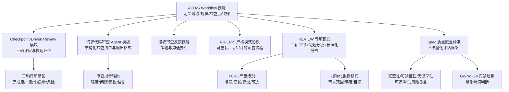
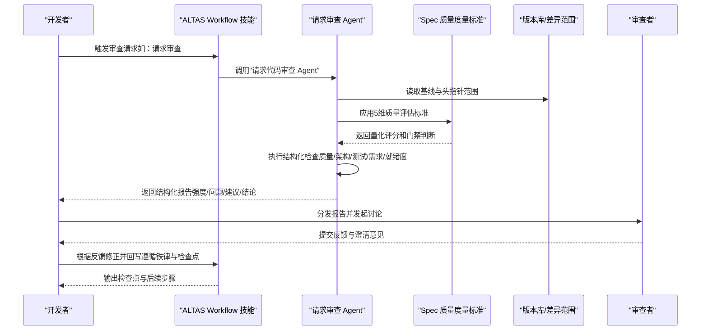
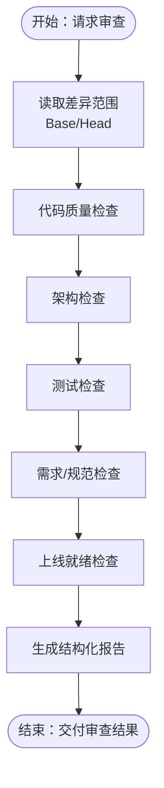
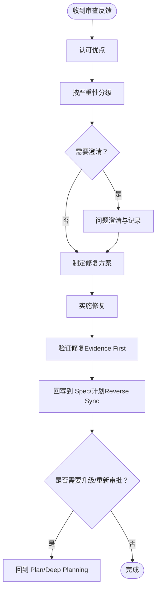
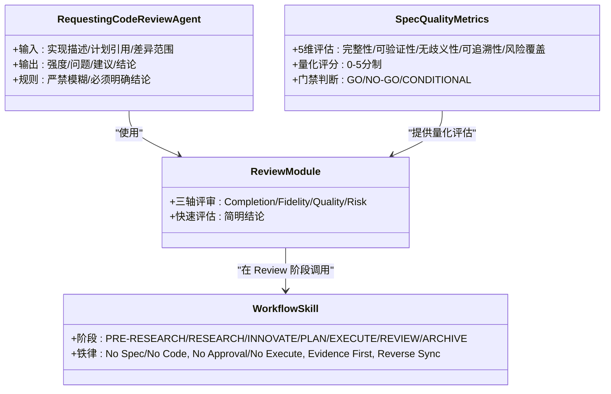
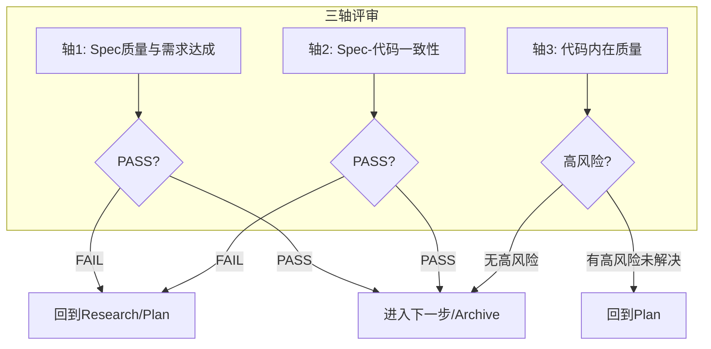
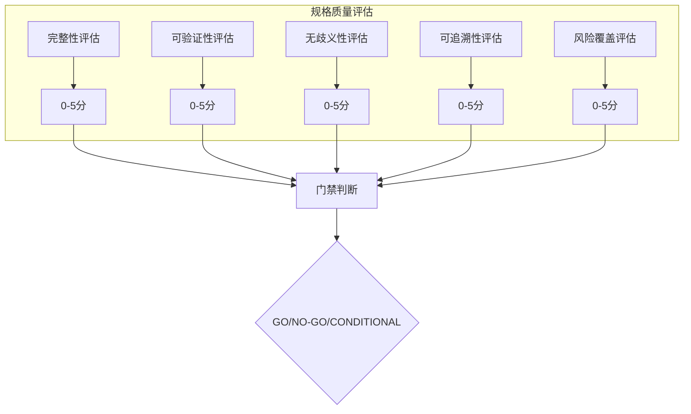
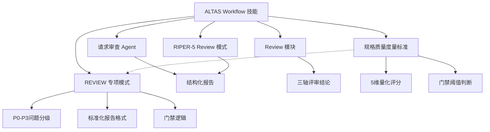

# 代码审查流程

<cite>
**本文引用的文件**
- [altas-workflow/SKILL.md](file://altas-workflow/SKILL.md)
- [altas-workflow/QUICKSTART.md](file://altas-workflow/QUICKSTART.md)
- [altas-workflow/reference-index.md](file://altas-workflow/reference-index.md)
- [altas-workflow/references/checkpoint-driven/modules.md](file://altas-workflow/references/checkpoint-driven/modules.md)
- [altas-workflow/references/checkpoint-driven/SKILL.md](file://altas-workflow/references/checkpoint-driven/SKILL.md)
- [altas-workflow/references/superpowers/requesting-code-review/code-reviewer.md](file://altas-workflow/references/superpowers/requesting-code-review/code-reviewer.md)
- [altas-workflow/references/superpowers/receiving-code-review/SKILL.md](file://altas-workflow/references/superpowers/receiving-code-review/SKILL.md)
- [altas-workflow/references/agents/code-reviewer.md](file://altas-workflow/references/agents/code-reviewer.md)
- [altas-workflow/references/special-modes/review.md](file://altas-workflow/references/special-modes/review.md)
- [altas-workflow/protocols/RIPER-5.md](file://altas-workflow/protocols/RIPER-5.md)
- [altas-workflow/workflow-diagrams.md](file://altas-workflow/workflow-diagrams.md)
- [altas-workflow/references/agents/sdd-riper-one-light/examples/codemap/codemap-feature-content-control.md](file://altas-workflow/references/agents/sdd-riper-one-light/examples/codemap/codemap-feature-content-control.md)
- [altas-workflow/references/superpowers/requesting-code-review/spec-quality-metrics.md](file://altas-workflow/references/superpowers/requesting-code-review/spec-quality-metrics.md)
- [altas-workflow/SKILL-entry-review.md](file://altas-workflow/SKILL-entry-review.md)
</cite>

## 更新摘要
**变更内容**
- 新增详细的三轴审查标准和门禁逻辑
- 引入P0-P3严重级别分类系统
- 增强标准化报告格式和输出规范
- 完善特殊场景处理程序（窗口期、临时放行）
- 强化与其他工作流模式的集成机制
- 更新审查流程图和协作模式
- **新增** 规格质量度量标准，提供5维量化评估框架
- **新增** 完整的Spec质量评分维度和阈值标准

## 目录
1. [简介](#简介)
2. [项目结构](#项目结构)
3. [核心组件](#核心组件)
4. [架构总览](#架构总览)
5. [详细组件分析](#详细组件分析)
6. [依赖关系分析](#依赖关系分析)
7. [性能考量](#性能考量)
8. [故障排查指南](#故障排查指南)
9. [结论](#结论)
10. [附录](#附录)

## 简介
本文件面向团队与个人开发者，系统化阐述基于 ALTAS Workflow 的代码审查流程与质量保障体系。文档围绕"请求审查""接收反馈""Agent 审查模板""检查清单与常见问题识别""效率与协作"五个维度展开，结合仓库中的协议、技能与模板文件，给出可落地的实施指南与可视化图示，帮助团队建立稳定、高效且可传承的代码审查实践。

**更新** 本次更新重点强化了三轴审查标准、问题分类系统和标准化报告格式，完善了特殊案例处理程序，增强了与其他工作流模式的集成能力。**新增** 规格质量度量标准，为Spec质量评估提供了5维量化评估框架，进一步完善了代码审查评估体系。

## 项目结构
该仓库以"工作流协议 + 按需模块 + Agent 模板"的方式组织代码审查相关内容，核心包括：
- 工作流总控：ALTAS Workflow 技能文件，定义规模评估、阶段划分、检查点与铁律约束
- 审查模块：Checkpoint-Driven 的 Review 模块，定义三轴评审与快速评估维度
- 审查 Agent：请求审查与接收审查的模板与技能，提供结构化输出与严重性分级
- 协议与模式：RIPER-5 严格模式，确保审查过程的可重复与可审计
- 专项模式：REVIEW 模式协议，提供完整的三轴评审和问题分级系统
- **新增** 规格质量度量：5维Spec质量评估标准，提供量化评分和阈值判断

**图表来源**
- [altas-workflow/SKILL.md:194-209](file://altas-workflow/SKILL.md#L194-L209)
- [altas-workflow/references/checkpoint-driven/modules.md:31-43](file://altas-workflow/references/checkpoint-driven/modules.md#L31-L43)
- [altas-workflow/references/superpowers/requesting-code-review/code-reviewer.md:30-92](file://altas-workflow/references/superpowers/requesting-code-review/code-reviewer.md#L30-L92)
- [altas-workflow/references/special-modes/review.md:45-53](file://altas-workflow/references/special-modes/review.md#L45-L53)
- [altas-workflow/protocols/RIPER-5.md:104-125](file://altas-workflow/protocols/RIPER-5.md#L104-L125)
- [altas-workflow/references/superpowers/requesting-code-review/spec-quality-metrics.md:3-17](file://altas-workflow/references/superpowers/requesting-code-review/spec-quality-metrics.md#L3-L17)

**章节来源**
- [altas-workflow/SKILL.md:138-219](file://altas-workflow/SKILL.md#L138-L219)
- [altas-workflow/reference-index.md:63-72](file://altas-workflow/reference-index.md#L63-L72)

## 核心组件
- 工作流总控（ALTAS Workflow）
  - 定义阶段：PRE-RESEARCH、RESEARCH、INNOVATE、PLAN、EXECUTE、REVIEW、ARCHIVE
  - 铁律约束：No Spec, No Code；No Approval, No Execute；Evidence First；Reverse Sync；TDD 铁律等
  - 规模评估：XS/S/M/L 四档，按任务复杂度与影响范围选择深度
  - 检查点：M/L 规模输出完整检查点，S 规模输出短检查点
- 审查模块（Checkpoint-Driven）
  - 三轴评审：需求达成、Spec-代码一致性、代码内在质量
  - 快速评估：Completion/Fidelity/Quality/Risk
- 审查 Agent 模板
  - 结构化检查清单：代码质量、架构、测试、需求、上线就绪
  - 严重性分级：Critical/Important/Minor
  - 输出格式：Strengths、Issues（含定位与修复建议）、Recommendations、Assessment
- 协议与模式（RIPER-5）
  - 严格模式：RESEARCH/INNOVATE/PLAN/EXECUTE/REVIEW 五态机，强制模式声明与偏差处理
- 专项模式（REVIEW）
  - 三轴评审标准：Spec质量与需求达成、Spec-代码一致性、代码内在质量
  - 问题分级系统：P0-P3四个级别，从阻塞到可选
  - 标准化报告格式：审查范围、深度、目标、总体评价、问题清单、亮点
- **新增** 规格质量度量标准（Spec Quality Metrics）
  - 5维评估维度：完整性、可验证性、无歧义性、可追溯性、风险覆盖
  - 量化评分：每维0-5分，提供明确的评分标准
  - 门禁阈值：GO/NO-GO/CONDITIONAL三类判断标准
  - 使用场景：REVIEW SPEC阶段的质量评估

**更新** 新增了REVIEW专项模式和规格质量度量标准，提供完整的三轴评审标准、问题分级系统、标准化报告格式和5维量化评估框架。

**章节来源**
- [altas-workflow/SKILL.md:90-102](file://altas-workflow/SKILL.md#L90-L102)
- [altas-workflow/SKILL.md:138-219](file://altas-workflow/SKILL.md#L138-L219)
- [altas-workflow/references/checkpoint-driven/modules.md:31-43](file://altas-workflow/references/checkpoint-driven/modules.md#L31-L43)
- [altas-workflow/references/superpowers/requesting-code-review/code-reviewer.md:30-92](file://altas-workflow/references/superpowers/requesting-code-review/code-reviewer.md#L30-L92)
- [altas-workflow/references/special-modes/review.md:45-101](file://altas-workflow/references/special-modes/review.md#L45-L101)
- [altas-workflow/protocols/RIPER-5.md:25-125](file://altas-workflow/protocols/RIPER-5.md#L25-L125)
- [altas-workflow/references/superpowers/requesting-code-review/spec-quality-metrics.md:3-17](file://altas-workflow/references/superpowers/requesting-code-review/spec-quality-metrics.md#L3-L17)

## 架构总览
下图展示了"请求代码审查"的端到端流程，从任务触发、Agent 调用、到产出结构化报告与结论闭环。

**图表来源**
- [altas-workflow/SKILL.md:194-209](file://altas-workflow/SKILL.md#L194-L209)
- [altas-workflow/references/superpowers/requesting-code-review/code-reviewer.md:30-92](file://altas-workflow/references/superpowers/requesting-code-review/code-reviewer.md#L30-L92)
- [altas-workflow/references/superpowers/requesting-code-review/spec-quality-metrics.md:19-21](file://altas-workflow/references/superpowers/requesting-code-review/spec-quality-metrics.md#L19-L21)

**章节来源**
- [altas-workflow/SKILL.md:194-209](file://altas-workflow/SKILL.md#L194-L209)
- [altas-workflow/references/superpowers/requesting-code-review/code-reviewer.md:12-92](file://altas-workflow/references/superpowers/requesting-code-review/code-reviewer.md#L12-L92)

## 详细组件分析

### 组件A：请求代码审查（Agent 模板）
- 目标与范围
  - 对比实现与计划/需求，评估代码质量、架构、测试与上线就绪度
  - 明确 Git 差异范围（Base/Head），便于聚焦审查
- 结构化检查清单
  - 代码质量：关注关注点分离、错误处理、类型安全、DRY、边界处理
  - 架构：设计合理性、可扩展性、性能与安全
  - 测试：测试有效性、边界覆盖、集成测试、全部通过
  - 需求：是否满足计划/规范、无范围蔓延、破坏性变更文档化
  - 上线就绪：迁移策略、兼容性、文档、明显缺陷
- 输出格式
  - Strengths：具体亮点
  - Issues：按严重性分级，含文件定位、问题描述、影响说明、修复建议
  - Recommendations：改进意见
  - Assessment：是否可合并与理由

**更新** 该组件提供了基础的审查模板，但更详细的三轴评审和问题分级系统在REVIEW专项模式中有专门说明。

**图表来源**
- [altas-workflow/references/superpowers/requesting-code-review/code-reviewer.md:20-92](file://altas-workflow/references/superpowers/requesting-code-review/code-reviewer.md#L20-L92)

**章节来源**
- [altas-workflow/references/superpowers/requesting-code-review/code-reviewer.md:12-147](file://altas-workflow/references/superpowers/requesting-code-review/code-reviewer.md#L12-L147)

### 组件B：接收审查反馈与沟通策略
- 接收反馈的策略
  - 先认可优点，再逐条讨论问题，避免情绪化
  - 对于严重性问题（Critical/Important）优先处理，Minor 问题纳入后续迭代
  - 针对"为何重要"和"如何修复"进行澄清与记录
- 问题澄清与修改实施
  - 将问题映射到具体文件与行号，必要时补充最小可复现示例
  - 修改后回写到 Spec/计划，遵循 Reverse Sync（先更新 Spec，再修代码）
  - 通过 Evidence First 验证修复效果，确保完成由验证结果证明
- 与工作流的衔接
  - 若涉及计划偏差，回到 Plan 阶段重新审批
  - 若为架构或跨模块改动，考虑升级规模并启用 Multi-project/Deep Planning

**图表来源**
- [altas-workflow/SKILL.md:90-102](file://altas-workflow/SKILL.md#L90-L102)
- [altas-workflow/SKILL.md:167-173](file://altas-workflow/SKILL.md#L167-L173)

**章节来源**
- [altas-workflow/SKILL.md:90-102](file://altas-workflow/SKILL.md#L90-L102)
- [altas-workflow/SKILL.md:167-173](file://altas-workflow/SKILL.md#L167-L173)

### 组件C：代码审查 Agent 的模板设计与使用
- 模板设计
  - 明确输入：实现描述、计划/需求引用、差异范围
  - 明确输出：Strengths、Issues（分级）、Recommendations、Assessment
  - 明确规则：不得含糊其辞、必须给出明确结论
- 使用方法
  - 在 Review 阶段调用，结合三轴评审与快速评估
  - 与 Checkpoint-Driven 的 Review 模块配合，输出短结论或展开说明
  - 与 RIPER-5 的 Review 模式配合，进行逐项偏差标记与结论判定

**更新** 该组件提供了基础的Agent模板，但REVIEW专项模式提供了更完整的三轴评审和问题分级系统。

**图表来源**
- [altas-workflow/references/superpowers/requesting-code-review/code-reviewer.md:30-92](file://altas-workflow/references/superpowers/requesting-code-review/code-reviewer.md#L30-L92)
- [altas-workflow/references/checkpoint-driven/modules.md:31-43](file://altas-workflow/references/checkpoint-driven/modules.md#L31-L43)
- [altas-workflow/SKILL.md:138-219](file://altas-workflow/SKILL.md#L138-L219)
- [altas-workflow/references/superpowers/requesting-code-review/spec-quality-metrics.md:3-17](file://altas-workflow/references/superpowers/requesting-code-review/spec-quality-metrics.md#L3-L17)

**章节来源**
- [altas-workflow/references/superpowers/requesting-code-review/code-reviewer.md:30-92](file://altas-workflow/references/superpowers/requesting-code-review/code-reviewer.md#L30-L92)
- [altas-workflow/references/checkpoint-driven/modules.md:31-43](file://altas-workflow/references/checkpoint-driven/modules.md#L31-L43)
- [altas-workflow/SKILL.md:138-219](file://altas-workflow/SKILL.md#L138-L219)

### 组件D：三轴审查标准与问题分级系统
- 三轴评审标准
  - **轴1：Spec质量与需求达成**：Goal/In-Scope/Acceptance 是否完整；需求是否达成
  - **轴2：Spec-代码一致性**：文件、签名、Checklist、行为是否与 Plan 一致
  - **轴3：代码内在质量**：正确性、鲁棒性、可维护性、测试、关键风险
- 问题分级系统（P0-P3）
  - **P0 - 阻塞**：必须修复，否则不能合并（安全漏洞、核心逻辑错误、数据不一致）
  - **P1 - 高优**：强烈建议修复（未处理的异常路径、关键逻辑无测试、性能瓶颈）
  - **P2 - 建议**：可择机优化（代码风格不统一、注释缺失、可读性差）
  - **P3 - 可选**：锦上添花（命名不够精确、小的重构机会）
- 门禁逻辑
  - 轴1或轴2=FAIL：回到 Research/Plan 修正，不得合并
  - 轴3有P0问题：必须修复后重新审查
  - 轴3有P1问题：建议修复，用户可决定是否阻塞合并
  - 全部PASS或仅有P2/P3：建议合并

**新增** 这是本次更新的核心内容，建立了完整的三轴审查标准和问题分级系统。

**图表来源**
- [altas-workflow/workflow-diagrams.md:108-125](file://altas-workflow/workflow-diagrams.md#L108-L125)

**章节来源**
- [altas-workflow/workflow-diagrams.md:108-125](file://altas-workflow/workflow-diagrams.md#L108-L125)
- [altas-workflow/references/special-modes/review.md:37-101](file://altas-workflow/references/special-modes/review.md#L37-L101)

### 组件E：规格质量度量标准（新增）
- 5维评估维度
  - **完整性**：Goal/In-Scope/Out-of-Scope/Facts/Signatures/Checklist 全部完整且无 TBD
  - **可验证性**：每个 Acceptance 都有明确的验证方式（测试/运行命令/人工检查）
  - **无歧义性**：所有术语、接口签名、文件路径精确到行号
  - **可追溯性**：每个 Checklist 项可追溯到具体 Requirements 条目
  - **风险覆盖**：已识别风险均有缓解措施或回滚方案
- 量化评分标准
  - 每维0-5分，提供明确的评分标准
  - 5分标准：各项都达到最高水平
  - 1分标准：存在关键缺陷或严重不足
- 门禁判断阈值
  - **GO**：所有维度 ≥ 3 分，且完整性 + 可验证性 ≥ 4 分
  - **NO-GO**：任一维度 < 2 分，或完整性 < 3 分
  - **CONDITIONAL**：其他情况，需用户确认是否带风险执行
- 使用场景
  - 在 REVIEW SPEC 阶段使用此评分表
  - 输出各维度分数和 Go/No-Go 结论
  - 与三轴评审相结合，提供更全面的质量评估

**新增** 规格质量度量标准是本次更新的重要新增内容，为Spec质量评估提供了具体的量化框架。

**图表来源**
- [altas-workflow/references/superpowers/requesting-code-review/spec-quality-metrics.md:3-17](file://altas-workflow/references/superpowers/requesting-code-review/spec-quality-metrics.md#L3-L17)

**章节来源**
- [altas-workflow/references/superpowers/requesting-code-review/spec-quality-metrics.md:1-22](file://altas-workflow/references/superpowers/requesting-code-review/spec-quality-metrics.md#L1-L22)

### 组件F：标准化报告格式与输出规范
- 标准格式要求
  - **审查范围**：文件列表/PR链接
  - **审查深度**：Lite/Standard/Deep
  - **审查目标**：找Bug/代码质量/架构合理性/...
  - **总体评价**：轴1/轴2/轴3的PASS/FAIL/PARTIAL + 综合结论
  - **问题清单**：按P0-P3分级的问题列表
  - **亮点**：值得肯定的设计/实现
- 输出规范
  - 必须包含文件定位和修复建议
  - 问题描述必须说明影响程度
  - 修复建议必须具体可行
  - 结论必须明确可合并或需要修改

**新增** 标准化报告格式确保了审查输出的一致性和可追溯性。

**章节来源**
- [altas-workflow/references/special-modes/review.md:54-89](file://altas-workflow/references/special-modes/review.md#L54-L89)

### 组件G：特殊场景处理程序
- **审查外部代码（无Spec）**
  - 重点审查：代码内在质量轴（轴3）
  - 输出：问题清单 + 重构建议 + 风险提示
  - 不强制要求Spec一致性审查
- **审查自己的代码（自我审查）**
  - 建议明确审查目标（如"重点看有没有边界情况遗漏"）
  - 输出风格：建议式而非审判式
- **审查超大PR（>500行）**
  - 建议拆分为多个逻辑单元分别审查
  - 若无法拆分，输出声明："由于PR规模过大，以下审查可能不完整，建议拆分后重新审查"
- **窗口期与临时放行**
  - 临时放行必须带有效期，避免无限扩大权限
  - 审批通过后的放行必须与"永久白名单"语义严格区分
  - 灰度逻辑与默认逻辑必须边界清晰

**新增** 特殊场景处理程序完善了审查流程的边界条件和风险管理。

**章节来源**
- [altas-workflow/references/special-modes/review.md:112-129](file://altas-workflow/references/special-modes/review.md#L112-L129)
- [altas-workflow/references/agents/sdd-riper-one-light/examples/codemap/codemap-feature-content-control.md:81-90](file://altas-workflow/references/agents/sdd-riper-one-light/examples/codemap/codemap-feature-content-control.md#L81-L90)

### 组件H：效率提升与团队协作
- 效率提升
  - 使用 Checkpoint-Driven 的 Review 模块进行快速评估，减少冗长讨论
  - 通过 RIPER-5 的 Review 模式进行逐项偏差标记，降低遗漏风险
  - 将审查结论与 Trace to Sources 一起沉淀，形成知识资产
  - 利用P0-P3分级系统快速识别高优先级问题
  - **新增** 使用规格质量度量标准进行量化评估，提高判断客观性
- 团队协作
  - Spec 为团队共享真相源，核心开发者 Review Plan，不 Review 全部代码
  - 多项目场景启用 Multi-project 模块，明确边界与依赖顺序
  - 使用 Agent 模板统一输出，降低沟通成本
  - 与其他模式协作：REVIEW→REFACTOR、REVIEW→DEBUG、REVIEW→TEST

**更新** 新增了P0-P3分级系统、规格质量度量标准和与其他模式的协作机制。

**章节来源**
- [altas-workflow/references/checkpoint-driven/modules.md:31-43](file://altas-workflow/references/checkpoint-driven/modules.md#L31-L43)
- [altas-workflow/protocols/RIPER-5.md:104-125](file://altas-workflow/protocols/RIPER-5.md#L104-L125)
- [altas-workflow/reference-index.md:49-58](file://altas-workflow/reference-index.md#L49-L58)
- [altas-workflow/references/special-modes/review.md:104-109](file://altas-workflow/references/special-modes/review.md#L104-L109)

## 依赖关系分析
- 工作流总控与审查模块
  - Review 阶段依赖 Checkpoint-Driven 的 Review 模块，输出三轴评审结论
- 审查 Agent 与工作流
  - 请求审查 Agent 在 Review 阶段被调用，输出结构化报告
  - 与 Workflow 的铁律与检查点机制协同，确保可审计与可追溯
- 协议与模式
  - RIPER-5 的 Review 模式与 Agent 的结构化输出相互印证，形成闭环
- 专项模式与基础组件
  - REVIEW专项模式基于基础的Agent模板和三轴评审模块
  - 提供了更严格的门禁逻辑和标准化输出格式
- **新增** 规格质量度量标准与审查流程
  - 作为独立的评估工具，与三轴评审并行使用
  - 为Spec质量评估提供量化标准，增强审查客观性

**更新** 新增了REVIEW专项模式与基础组件的依赖关系，以及规格质量度量标准与审查流程的集成关系。

**图表来源**
- [altas-workflow/SKILL.md:194-209](file://altas-workflow/SKILL.md#L194-L209)
- [altas-workflow/references/checkpoint-driven/modules.md:31-43](file://altas-workflow/references/checkpoint-driven/modules.md#L31-L43)
- [altas-workflow/references/superpowers/requesting-code-review/code-reviewer.md:63-92](file://altas-workflow/references/superpowers/requesting-code-review/code-reviewer.md#L63-L92)
- [altas-workflow/references/special-modes/review.md:45-101](file://altas-workflow/references/special-modes/review.md#L45-L101)
- [altas-workflow/protocols/RIPER-5.md:104-125](file://altas-workflow/protocols/RIPER-5.md#L104-L125)
- [altas-workflow/references/superpowers/requesting-code-review/spec-quality-metrics.md:3-17](file://altas-workflow/references/superpowers/requesting-code-review/spec-quality-metrics.md#L3-L17)

**章节来源**
- [altas-workflow/SKILL.md:194-209](file://altas-workflow/SKILL.md#L194-L209)
- [altas-workflow/references/checkpoint-driven/modules.md:31-43](file://altas-workflow/references/checkpoint-driven/modules.md#L31-L43)
- [altas-workflow/references/superpowers/requesting-code-review/code-reviewer.md:63-92](file://altas-workflow/references/superpowers/requesting-code-review/code-reviewer.md#L63-L92)
- [altas-workflow/references/special-modes/review.md:45-101](file://altas-workflow/references/special-modes/review.md#L45-L101)
- [altas-workflow/protocols/RIPER-5.md:104-125](file://altas-workflow/protocols/RIPER-5.md#L104-L125)

## 性能考量
- 降低上下文负担：按需加载参考文件，避免常驻大量文本
- 快速评估优先：在 Review 阶段先用三轴评审与快速评估确定优先级
- 自动化沉淀：利用归档模板与脚本，将结论与来源映射固化为知识资产
- 分级审查优化：利用P0-P3分级系统快速识别高优先级问题，提高审查效率
- 标准化输出：统一的报告格式减少沟通成本，提高问题处理效率
- **新增** 量化评估：规格质量度量标准提供客观的量化指标，减少主观判断偏差

**更新** 新增了分级审查优化和标准化输出的性能考量，以及量化评估减少主观偏差的优势。

## 故障排查指南
- 常见问题
  - 审查结论模糊：检查 Agent 输出格式是否完整，是否包含文件定位与修复建议
  - 未获批准即实现：遵循 No Approval, No Execute；若已发生，立即回退到 Plan
  - 证据不足：坚持 Evidence First；在未验证前不宣布完成
  - 问题分级不当：检查是否严格按照P0-P3标准进行分级
  - 报告格式不规范：确认是否按照标准化格式输出
  - **新增** 规格质量评估不准确：检查是否严格按照5维标准进行评分
  - **新增** 门禁判断错误：确认是否符合GO/NO-GO/CONDITIONAL的阈值要求
- 解决路径
  - 回到 Plan 阶段补充证据与变更说明
  - 使用 Debug 模块进行系统化根因分析
  - 启用 Multi-project 模块明确跨项目边界与依赖
  - 重新进行三轴评审，确保问题分级准确
  - 按照标准化格式重新输出审查报告
  - **新增** 使用规格质量度量标准重新评估Spec质量
  - **新增** 重新计算门禁阈值，确保判断准确

**更新** 新增了规格质量评估不准确和门禁判断错误的故障排查，以及相应的解决路径。

**章节来源**
- [altas-workflow/SKILL.md:90-102](file://altas-workflow/SKILL.md#L90-L102)
- [altas-workflow/references/checkpoint-driven/modules.md:18-29](file://altas-workflow/references/checkpoint-driven/modules.md#L18-L29)
- [altas-workflow/reference-index.md:85-93](file://altas-workflow/reference-index.md#L85-L93)

## 结论
通过将 ALTAS Workflow 的阶段化控制、Checkpoint-Driven 的快速评估、结构化的审查 Agent 模板与 RIPER-5 的严格模式有机结合，并新增REVIEW专项模式的三轴审查标准、P0-P3问题分级系统、标准化报告格式和**新增的规格质量度量标准**，团队可以建立一套更加完善、可重复、可审计、可传承的代码审查体系。

**更新** 本次更新显著增强了代码审查流程的系统性和规范性，为团队提供了更强大的质量保障工具。**新增的5维规格质量度量标准**为Spec质量评估提供了客观的量化框架，进一步提升了审查的科学性和准确性。

建议在团队内统一使用 Agent 模板与检查点输出，配合三轴评审、问题分级、规格质量度量和知识沉淀，持续优化审查效率与质量。

## 附录
- 审查检查清单（摘自 Agent 模板）
  - 代码质量：关注点分离、错误处理、类型安全、DRY、边界处理
  - 架构：设计合理性、可扩展性、性能与安全
  - 测试：测试有效性、边界覆盖、集成测试、全部通过
  - 需求：满足计划/规范、无范围蔓延、破坏性变更文档化
  - 上线就绪：迁移策略、兼容性、文档、明显缺陷
- 严重性分级（摘自 Agent 模板）
  - Critical（必须修复）
  - Important（应修复）
  - Minor（建议性）
- 三轴审查标准（REVIEW专项模式）
  - 轴1：Spec质量与需求达成
  - 轴2：Spec-代码一致性
  - 轴3：代码内在质量
- 问题分级系统（P0-P3）
  - P0：阻塞（必须修复）
  - P1：高优（强烈建议修复）
  - P2：建议（可择机优化）
  - P3：可选（锦上添花）
- **新增** 规格质量度量标准（5维评估）
  - 完整性：Goal/In-Scope/Out-of-Scope/Facts/Signatures/Checklist
  - 可验证性：Acceptance的明确验证方式
  - 无歧义性：术语、接口签名、文件路径精确到行号
  - 可追溯性：Checklist项与Requirements条目的对应关系
  - 风险覆盖：已识别风险的缓解措施或回滚方案
- **新增** 门禁判断阈值
  - GO：所有维度≥3分，且完整性+可验证性≥4分
  - NO-GO：任一维度<2分，或完整性<3分
  - CONDITIONAL：其他情况，需用户确认是否带风险执行

**更新** 新增了三轴审查标准、问题分级系统、标准化报告格式和规格质量度量标准的附录内容。

**章节来源**
- [altas-workflow/references/superpowers/requesting-code-review/code-reviewer.md:30-92](file://altas-workflow/references/superpowers/requesting-code-review/code-reviewer.md#L30-L92)
- [altas-workflow/references/special-modes/review.md:45-101](file://altas-workflow/references/special-modes/review.md#L45-L101)
- [altas-workflow/references/superpowers/requesting-code-review/spec-quality-metrics.md:1-22](file://altas-workflow/references/superpowers/requesting-code-review/spec-quality-metrics.md#L1-L22)