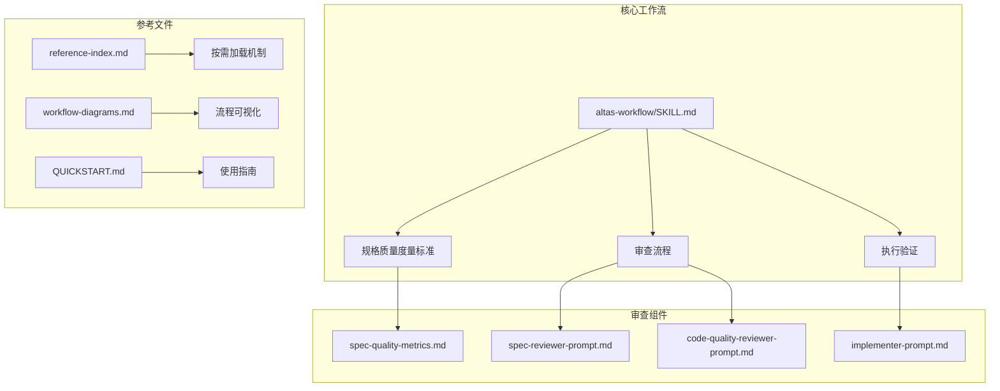
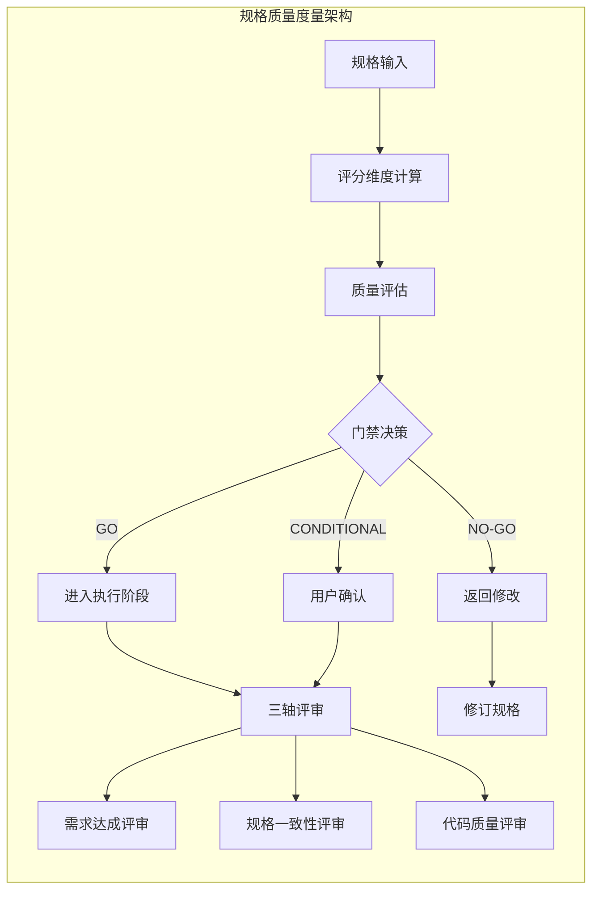
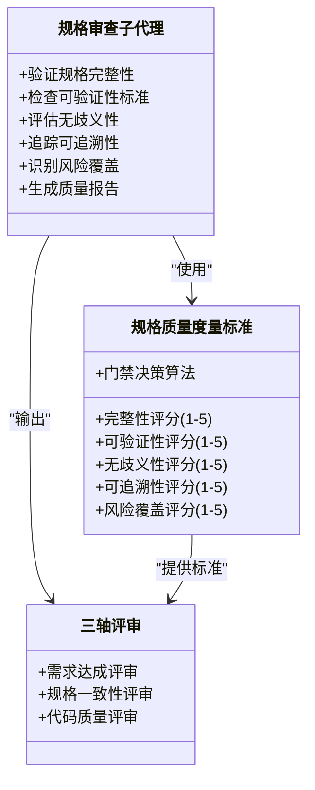
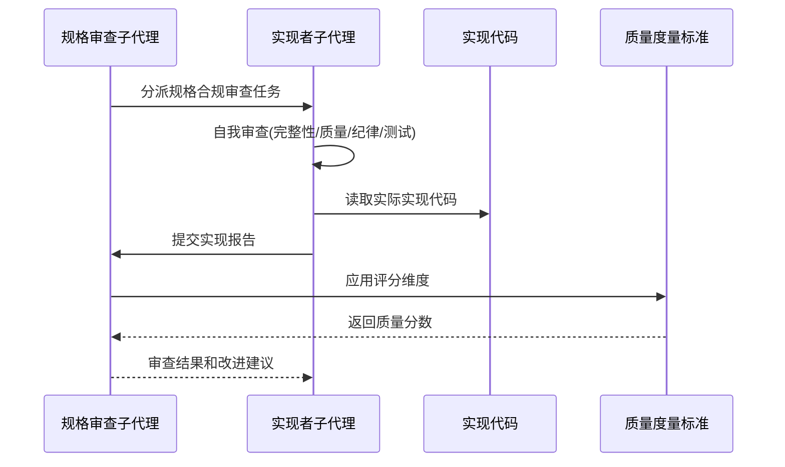
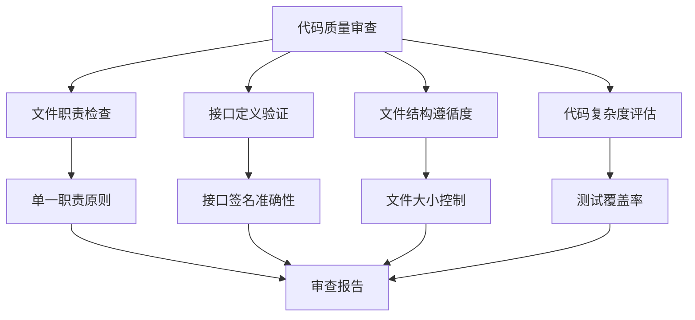
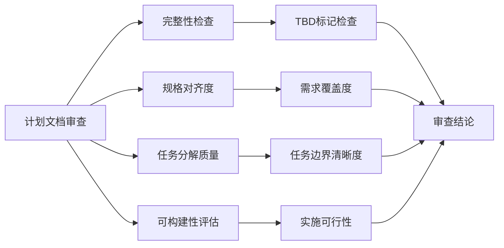
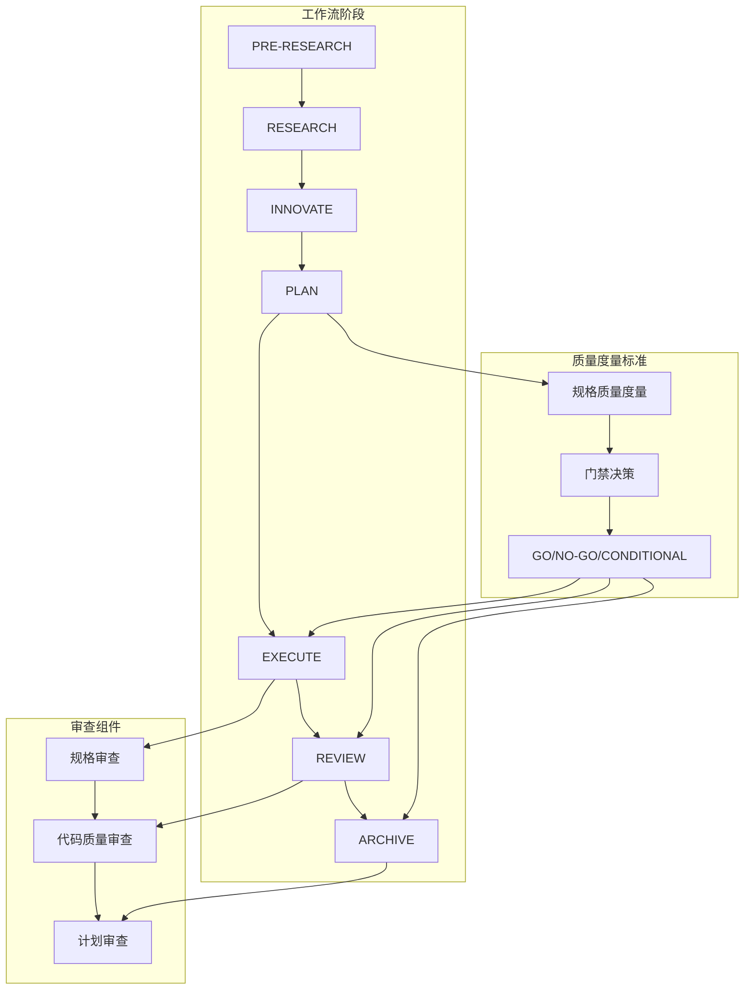
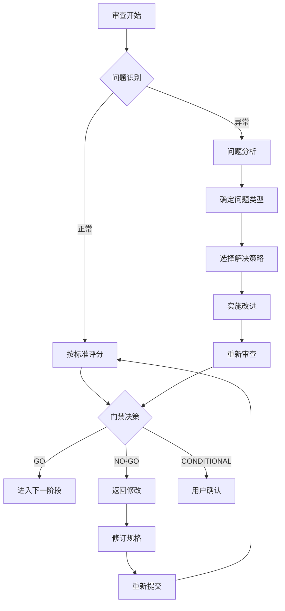

# 规格质量度量标准

<cite>
**本文档引用的文件**
- [altas-workflow/SKILL.md](file://altas-workflow/SKILL.md)
- [altas-workflow/reference-index.md](file://altas-workflow/reference-index.md)
- [altas-workflow/workflow-diagrams.md](file://altas-workflow/workflow-diagrams.md)
- [altas-workflow/QUICKSTART.md](file://altas-workflow/QUICKSTART.md)
- [spec-quality-metrics.md](file://altas-workflow/references/superpowers/requesting-code-review/spec-quality-metrics.md)
- [spec-reviewer-prompt.md](file://altas-workflow/references/superpowers/subagent-driven-development/spec-reviewer-prompt.md)
- [implementer-prompt.md](file://altas-workflow/references/superpowers/subagent-driven-development/implementer-prompt.md)
- [code-quality-reviewer-prompt.md](file://altas-workflow/references/superpowers/subagent-driven-development/code-quality-reviewer-prompt.md)
- [plan-document-reviewer-prompt.md](file://altas-workflow/references/superpowers/writing-plans/plan-document-reviewer-prompt.md)
</cite>

## 目录
1. [简介](#简介)
2. [项目结构](#项目结构)
3. [核心组件](#核心组件)
4. [架构概览](#架构概览)
5. [详细组件分析](#详细组件分析)
6. [依赖关系分析](#依赖关系分析)
7. [性能考虑](#性能考虑)
8. [故障排除指南](#故障排除指南)
9. [结论](#结论)

## 简介

规格质量度量标准是ALTAS Workflow工作流中的核心质量保证机制，旨在通过系统化的评分体系确保软件规格文档的质量和完整性。该标准为规格审查提供了客观的量化指标，确保规格文档在设计、实现和验证三个维度都达到预期的质量水平。

## 项目结构

ALTAS Workflow是一个完整的AI结对编程工作流系统，包含以下主要组成部分：

**图表来源**
- [altas-workflow/SKILL.md:1-543](file://altas-workflow/SKILL.md#L1-L543)
- [altas-workflow/reference-index.md:1-304](file://altas-workflow/reference-index.md#L1-L304)

**章节来源**
- [altas-workflow/SKILL.md:1-543](file://altas-workflow/SKILL.md#L1-L543)
- [altas-workflow/reference-index.md:1-304](file://altas-workflow/reference-index.md#L1-L304)

## 核心组件

### 规格质量评分维度

规格质量度量标准定义了五个核心评分维度，每个维度满分为5分：

| 维度 | 5分标准 | 1分标准 |
|------|---------|---------|
| **完整性** | Goal/In-Scope/Out-of-Scope/Facts/Signatures/Checklist全部完整且无TBD | 关键章节缺失或大量TBD |
| **可验证性** | 每个Acceptance都有明确的验证方式（测试/运行命令/人工检查） | 验收标准模糊（如"应该能工作"） |
| **无歧义性** | 所有术语、接口签名、文件路径精确到行号 | 使用"类似X"、"大概Y"等模糊表述 |
| **可追溯性** | 每个Checklist项可追溯到具体Requirements条目 | Checklist与Requirements无明确对应 |
| **风险覆盖** | 已识别风险均有缓解措施或回滚方案 | 未提及风险或风险未处理 |

### 门禁阈值标准

基于五个维度的评分，制定了明确的门禁决策标准：

- **GO**: 所有维度≥3分，且完整性+可验证性≥4分
- **NO-GO**: 任一维度<2分，或完整性<3分  
- **CONDITIONAL**: 其他情况，需用户确认是否带风险执行

**章节来源**
- [spec-quality-metrics.md:1-22](file://altas-workflow/references/superpowers/requesting-code-review/spec-quality-metrics.md#L1-L22)

## 架构概览

ALTAS Workflow采用分层架构设计，将规格质量度量标准嵌入到整个工作流的各个阶段：

**图表来源**
- [altas-workflow/SKILL.md:486-491](file://altas-workflow/SKILL.md#L486-L491)
- [spec-quality-metrics.md:13-17](file://altas-workflow/references/superpowers/requesting-code-review/spec-quality-metrics.md#L13-L17)

## 详细组件分析

### 规格审查子代理组件

规格审查子代理是实现规格质量度量标准的关键执行组件：

**图表来源**
- [spec-reviewer-prompt.md:1-62](file://altas-workflow/references/superpowers/subagent-driven-development/spec-reviewer-prompt.md#L1-L62)
- [spec-quality-metrics.md:1-22](file://altas-workflow/references/superpowers/requesting-code-review/spec-quality-metrics.md#L1-L22)

### 实现者子代理组件

实现者子代理负责确保规格到实现的一致性：

**图表来源**
- [implementer-prompt.md:1-114](file://altas-workflow/references/superpowers/subagent-driven-development/implementer-prompt.md#L1-L114)
- [spec-reviewer-prompt.md:37-61](file://altas-workflow/references/superpowers/subagent-driven-development/spec-reviewer-prompt.md#L37-L61)

**章节来源**
- [spec-reviewer-prompt.md:1-62](file://altas-workflow/references/superpowers/subagent-driven-development/spec-reviewer-prompt.md#L1-L62)
- [implementer-prompt.md:1-114](file://altas-workflow/references/superpowers/subagent-driven-development/implementer-prompt.md#L1-L114)

### 代码质量审查组件

代码质量审查确保实现的代码符合质量标准：

**图表来源**
- [code-quality-reviewer-prompt.md:20-27](file://altas-workflow/references/superpowers/subagent-driven-development/code-quality-reviewer-prompt.md#L20-L27)

**章节来源**
- [code-quality-reviewer-prompt.md:1-27](file://altas-workflow/references/superpowers/subagent-driven-development/code-quality-reviewer-prompt.md#L1-L27)

### 计划文档审查组件

计划文档审查确保实施计划的质量和可行性：

**图表来源**
- [plan-document-reviewer-prompt.md:18-47](file://altas-workflow/references/superpowers/writing-plans/plan-document-reviewer-prompt.md#L18-L47)

**章节来源**
- [plan-document-reviewer-prompt.md:1-50](file://altas-workflow/references/superpowers/writing-plans/plan-document-reviewer-prompt.md#L1-L50)

## 依赖关系分析

规格质量度量标准在整个ALTAS工作流中扮演着关键的协调角色：

**图表来源**
- [altas-workflow/SKILL.md:433-497](file://altas-workflow/SKILL.md#L433-L497)
- [altas-workflow/reference-index.md:82-92](file://altas-workflow/reference-index.md#L82-L92)

**章节来源**
- [altas-workflow/SKILL.md:433-497](file://altas-workflow/SKILL.md#L433-L497)
- [altas-workflow/reference-index.md:82-92](file://altas-workflow/reference-index.md#L82-L92)

## 性能考虑

规格质量度量标准在实际应用中具有以下性能特征：

### 评分效率
- **计算复杂度**: O(n)，其中n为规格文档的元素数量
- **内存占用**: 低，主要存储评分结果和中间状态
- **实时性**: 支持增量评分，可在审查过程中动态更新

### 扩展性
- **维度扩展**: 可轻松添加新的评分维度
- **阈值调整**: 门禁阈值可根据项目需求灵活调整
- **自动化**: 支持部分自动化的质量评估

### 集成成本
- **学习曲线**: 简单易懂的评分标准，培训成本低
- **工具集成**: 与现有审查工具无缝集成
- **维护成本**: 低，主要维护评分标准和阈值

## 故障排除指南

### 常见问题及解决方案

| 问题类型 | 症状 | 解决方案 | 预防措施 |
|----------|------|----------|----------|
| 评分不一致 | 不同审查员给出不同分数 | 建立评分标准培训 | 定期标准化培训 |
| 维度权重不当 | 某维度过于重要或不重要 | 调整权重系数 | 定期评估和调整 |
| 门禁决策错误 | 错误批准或拒绝 | 建立复审机制 | 双人审查制度 |
| 标准过时 | 项目发展导致标准不适用 | 定期更新标准 | 建立标准维护流程 |

### 审查流程优化

**章节来源**
- [altas-workflow/SKILL.md:519-531](file://altas-workflow/SKILL.md#L519-L531)

## 结论

规格质量度量标准为ALTAS Workflow提供了一个系统化、可量化的质量保证框架。通过五个核心维度的评分和明确的门禁决策机制，该标准确保了规格文档在设计、实现和验证各个阶段的质量一致性。

### 主要优势

1. **全面性**: 覆盖规格质量的各个方面，包括完整性、可验证性、无歧义性、可追溯性和风险覆盖
2. **可操作性**: 提供明确的评分标准和门禁阈值，便于实际应用
3. **灵活性**: 支持根据项目需求调整评分权重和阈值
4. **自动化潜力**: 为未来的自动化质量评估奠定了基础

### 实施建议

1. **建立培训体系**: 确保所有审查员理解评分标准和应用方法
2. **定期评估标准**: 根据项目发展和经验反馈调整评分标准
3. **工具集成**: 将质量度量标准集成到现有的审查工具中
4. **持续改进**: 建立反馈机制，不断优化评分标准和流程

通过有效实施规格质量度量标准，ALTAS Workflow能够显著提升软件开发过程的质量和效率，确保交付的软件产品符合预期的质量要求。