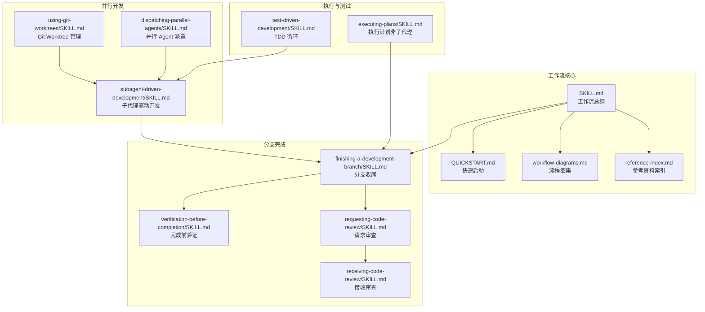
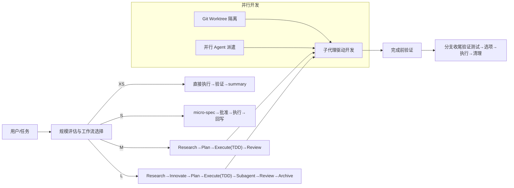
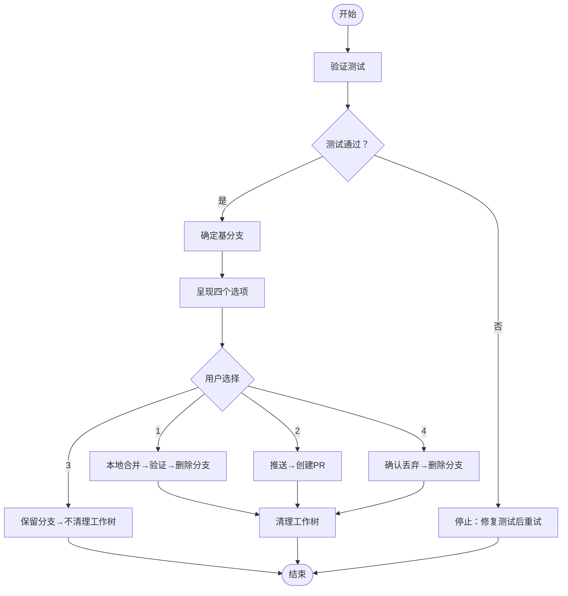
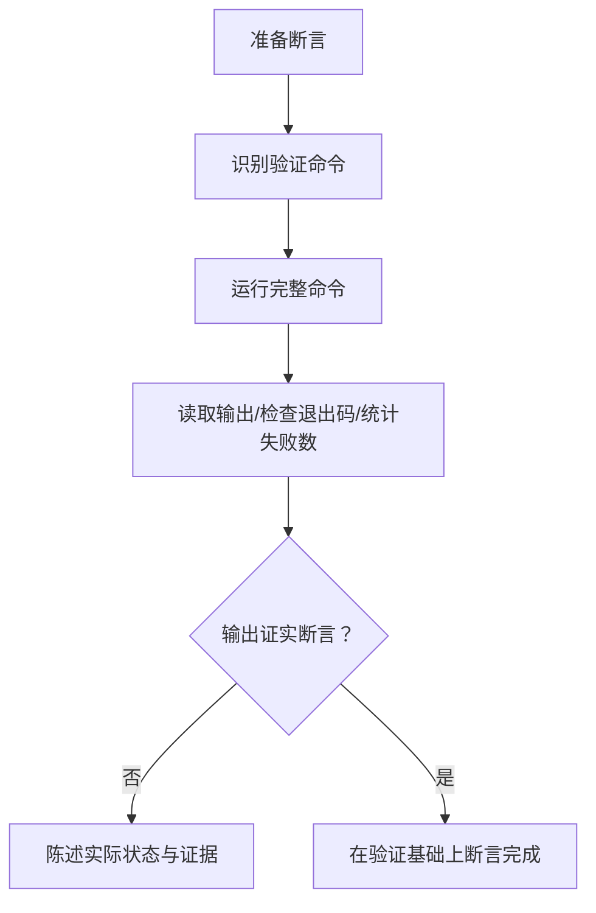
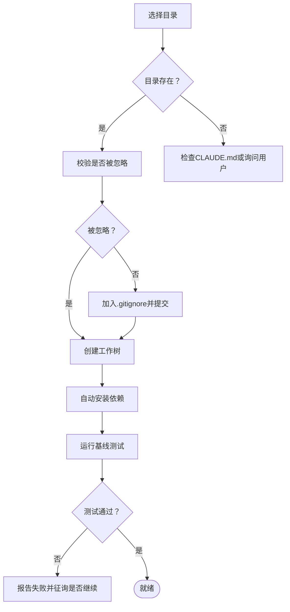
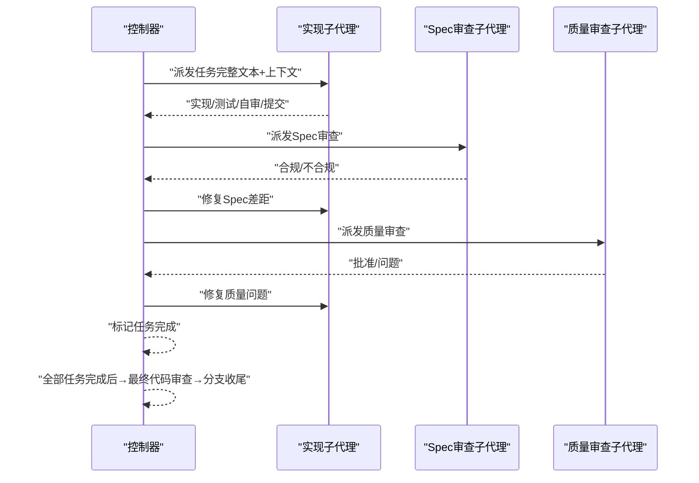
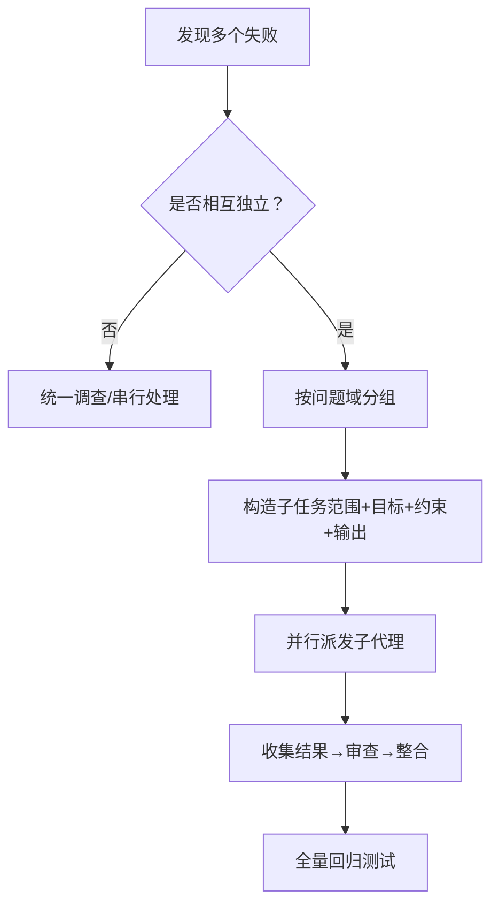
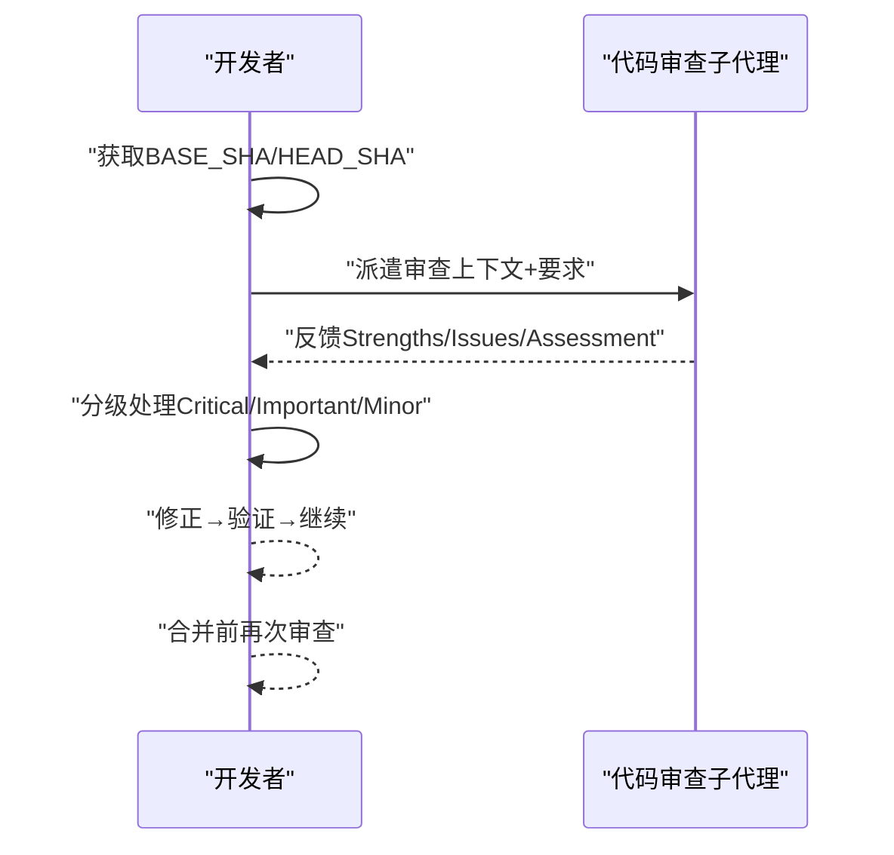
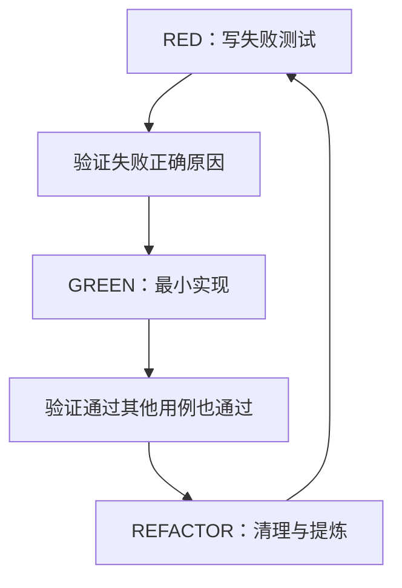
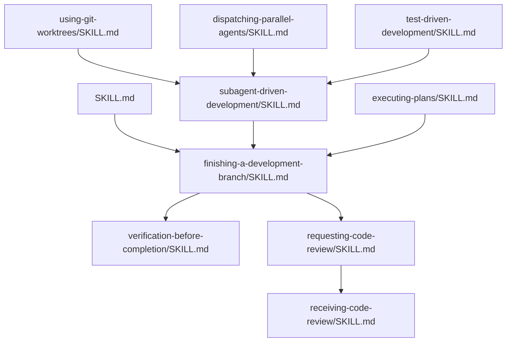

# 分支完成管理

<cite>
**本文引用的文件**
- [altas-workflow/SKILL.md](file://altas-workflow/SKILL.md)
- [altas-workflow/QUICKSTART.md](file://altas-workflow/QUICKSTART.md)
- [altas-workflow/reference-index.md](file://altas-workflow/reference-index.md)
- [altas-workflow/workflow-diagrams.md](file://altas-workflow/workflow-diagrams.md)
- [altas-workflow/README.md](file://altas-workflow/README.md)
- [references/superpowers/finishing-a-development-branch/SKILL.md](file://altas-workflow/references/superpowers/finishing-a-development-branch/SKILL.md)
- [references/superpowers/dispatching-parallel-agents/SKILL.md](file://altas-workflow/references/superpowers/dispatching-parallel-agents/SKILL.md)
- [references/superpowers/using-git-worktrees/SKILL.md](file://altas-workflow/references/superpowers/using-git-worktrees/SKILL.md)
- [references/superpowers/subagent-driven-development/SKILL.md](file://altas-workflow/references/superpowers/subagent-driven-development/SKILL.md)
- [references/superpowers/test-driven-development/SKILL.md](file://altas-workflow/references/superpowers/test-driven-development/SKILL.md)
- [references/superpowers/verification-before-completion/SKILL.md](file://altas-workflow/references/superpowers/verification-before-completion/SKILL.md)
- [references/superpowers/requesting-code-review/SKILL.md](file://altas-workflow/references/superpowers/requesting-code-review/SKILL.md)
- [references/superpowers/receiving-code-review/SKILL.md](file://altas-workflow/references/superpowers/receiving-code-review/SKILL.md)
- [references/superpowers/executing-plans/SKILL.md](file://altas-workflow/references/superpowers/executing-plans/SKILL.md)
</cite>

## 目录
1. [简介](#简介)
2. [项目结构](#项目结构)
3. [核心组件](#核心组件)
4. [架构总览](#架构总览)
5. [详细组件分析](#详细组件分析)
6. [依赖关系分析](#依赖关系分析)
7. [性能考量](#性能考量)
8. [故障排查指南](#故障排查指南)
9. [结论](#结论)
10. [附录](#附录)

## 简介
本文件面向“分支完成管理”的工程目标，系统化梳理开发分支完成的标准流程、Git Worktree 并行开发实践、并行 Agent 派遣协调机制、代码合并与审查策略、以及团队协作与发布流程的最佳实践。文档以 ALTAS Workflow 为核心框架，结合 SDD-RIPER、Checkpoint-Driven 与 Superpowers 的成熟方法论，提供从任务评估、执行、审查到分支收尾的全链路指导。

## 项目结构
该仓库围绕“工作流规范 + 参考资料 + 协议 + 方法论”组织内容，其中与分支完成管理直接相关的关键模块包括：
- 工作流主技能与快速启动：SKILL.md、QUICKSTART.md、workflow-diagrams.md
- 分支完成与收尾：finishing-a-development-branch
- 并行 Agent 派遣：dispatching-parallel-agents
- 并行开发隔离：using-git-worktrees
- 子代理驱动开发：subagent-driven-development
- 测试驱动开发：test-driven-development
- 完成前验证：verification-before-completion
- 代码审查：requesting-code-review、receiving-code-review
- 计划执行（非子代理）：executing-plans

图表来源
- [altas-workflow/SKILL.md:1-358](file://altas-workflow/SKILL.md#L1-L358)
- [altas-workflow/QUICKSTART.md:1-182](file://altas-workflow/QUICKSTART.md#L1-L182)
- [altas-workflow/reference-index.md:1-210](file://altas-workflow/reference-index.md#L1-L210)
- [altas-workflow/workflow-diagrams.md:1-338](file://altas-workflow/workflow-diagrams.md#L1-L338)
- [references/superpowers/finishing-a-development-branch/SKILL.md:1-201](file://altas-workflow/references/superpowers/finishing-a-development-branch/SKILL.md#L1-L201)
- [references/superpowers/verification-before-completion/SKILL.md:1-140](file://altas-workflow/references/superpowers/verification-before-completion/SKILL.md#L1-L140)
- [references/superpowers/requesting-code-review/SKILL.md:1-106](file://altas-workflow/references/superpowers/requesting-code-review/SKILL.md#L1-L106)
- [references/superpowers/receiving-code-review/SKILL.md:1-214](file://altas-workflow/references/superpowers/receiving-code-review/SKILL.md#L1-L214)
- [references/superpowers/using-git-worktrees/SKILL.md:1-219](file://altas-workflow/references/superpowers/using-git-worktrees/SKILL.md#L1-L219)
- [references/superpowers/subagent-driven-development/SKILL.md:1-278](file://altas-workflow/references/superpowers/subagent-driven-development/SKILL.md#L1-L278)
- [references/superpowers/dispatching-parallel-agents/SKILL.md:1-183](file://altas-workflow/references/superpowers/dispatching-parallel-agents/SKILL.md#L1-L183)
- [references/superpowers/test-driven-development/SKILL.md:1-372](file://altas-workflow/references/superpowers/test-driven-development/SKILL.md#L1-L372)
- [references/superpowers/executing-plans/SKILL.md:1-71](file://altas-workflow/references/superpowers/executing-plans/SKILL.md#L1-L71)

章节来源
- [altas-workflow/README.md:1-133](file://altas-workflow/README.md#L1-L133)
- [altas-workflow/SKILL.md:1-358](file://altas-workflow/SKILL.md#L1-L358)
- [altas-workflow/QUICKSTART.md:1-182](file://altas-workflow/QUICKSTART.md#L1-L182)
- [altas-workflow/reference-index.md:1-210](file://altas-workflow/reference-index.md#L1-L210)
- [altas-workflow/workflow-diagrams.md:1-338](file://altas-workflow/workflow-diagrams.md#L1-L338)

## 核心组件
- 规模评估与工作流深度：根据任务复杂度自动选择 XS/S/M/L，分别对应“直接执行/验证/summary”、“micro-spec→批准→执行→回写”、“Research→Plan→Execute(TDD)→Review”、“Research→Innovate→Plan→Execute(TDD)→Subagent→Review→Archive”。
- 铁律与门禁：No Spec, No Code；No Approval, No Execute；Spec is Truth；Reverse Sync；Evidence First；No Fixes Without Root Cause；TDD Iron Law；Resume Ready。
- 完成前验证：在声明完成/合并/PR之前，必须运行完整的验证命令并读取输出，确保证据先行。
- 分支收尾：验证测试→呈现选项→执行选择→清理工作树，提供四种分支集成路径（本地合并、推送创建PR、保留分支、丢弃）。
- 并行开发隔离：通过 Git Worktree 创建隔离工作空间，遵循目录优先级与安全校验，确保工作树内容不被意外提交。
- 子代理驱动开发：每个任务派发新鲜子代理，两阶段审查（Spec 合规 → 代码质量），并行安全、减少上下文污染。
- 并行 Agent 派遣：针对相互独立的多个故障，按问题域分发 Agent 并行调查，结束后统一验证与整合。
- 代码审查：请求审查与接收审查均强调技术严谨性，先验证再实现，必要时理性推翻或补充说明。

章节来源
- [altas-workflow/SKILL.md:90-282](file://altas-workflow/SKILL.md#L90-L282)
- [altas-workflow/QUICKSTART.md:36-182](file://altas-workflow/QUICKSTART.md#L36-L182)
- [references/superpowers/verification-before-completion/SKILL.md:16-140](file://altas-workflow/references/superpowers/verification-before-completion/SKILL.md#L16-L140)
- [references/superpowers/finishing-a-development-branch/SKILL.md:16-201](file://altas-workflow/references/superpowers/finishing-a-development-branch/SKILL.md#L16-L201)
- [references/superpowers/using-git-worktrees/SKILL.md:16-219](file://altas-workflow/references/superpowers/using-git-worktrees/SKILL.md#L16-L219)
- [references/superpowers/subagent-driven-development/SKILL.md:40-278](file://altas-workflow/references/superpowers/subagent-driven-development/SKILL.md#L40-L278)
- [references/superpowers/dispatching-parallel-agents/SKILL.md:16-183](file://altas-workflow/references/superpowers/dispatching-parallel-agents/SKILL.md#L16-L183)
- [references/superpowers/requesting-code-review/SKILL.md:12-106](file://altas-workflow/references/superpowers/requesting-code-review/SKILL.md#L12-L106)
- [references/superpowers/receiving-code-review/SKILL.md:14-214](file://altas-workflow/references/superpowers/receiving-code-review/SKILL.md#L14-L214)

## 架构总览
下图展示了从任务评估到分支收尾的总体流程，以及与并行开发、子代理与并行 Agent 的交互关系。

图表来源
- [altas-workflow/workflow-diagrams.md:45-105](file://altas-workflow/workflow-diagrams.md#L45-L105)
- [altas-workflow/SKILL.md:138-225](file://altas-workflow/SKILL.md#L138-L225)
- [references/superpowers/using-git-worktrees/SKILL.md:16-219](file://altas-workflow/references/superpowers/using-git-worktrees/SKILL.md#L16-L219)
- [references/superpowers/subagent-driven-development/SKILL.md:40-278](file://altas-workflow/references/superpowers/subagent-driven-development/SKILL.md#L40-L278)
- [references/superpowers/dispatching-parallel-agents/SKILL.md:16-183](file://altas-workflow/references/superpowers/dispatching-parallel-agents/SKILL.md#L16-L183)
- [references/superpowers/verification-before-completion/SKILL.md:16-140](file://altas-workflow/references/superpowers/verification-before-completion/SKILL.md#L16-L140)
- [references/superpowers/finishing-a-development-branch/SKILL.md:16-201](file://altas-workflow/references/superpowers/finishing-a-development-branch/SKILL.md#L16-L201)

## 详细组件分析

### 分支完成流程（Finishing a Development Branch）
- 核心步骤：验证测试 → 确定基分支 → 呈现四个选项（本地合并、推送创建PR、保留分支、丢弃）→ 执行选择 → 清理工作树。
- 关键要点：
  - 严禁在测试失败时推进合并/PR。
  - 选项3（保留分支）不清理工作树；选项1与4清理工作树。
  - 强制要求对“丢弃”进行显式确认，防止误删。
- 与工作流的衔接：在子代理驱动开发或执行计划完成后，调用该技能进行最终收尾。

图表来源
- [references/superpowers/finishing-a-development-branch/SKILL.md:18-151](file://altas-workflow/references/superpowers/finishing-a-development-branch/SKILL.md#L18-L151)

章节来源
- [references/superpowers/finishing-a-development-branch/SKILL.md:16-201](file://altas-workflow/references/superpowers/finishing-a-development-branch/SKILL.md#L16-L201)

### 完成前验证（Verification Before Completion）
- 铁律：在任何“完成/通过/修复/满足”等断言之前，必须运行完整验证命令并读取输出，确认证据。
- 常见失败模式：依赖“应该/大概/看起来正确”等模糊表述；信任代理报告而不独立验证；仅做部分验证。
- 关键模式：测试（完整命令+失败数）、回归测试（红-绿-红验证）、构建（编译成功）、需求（逐条核查清单）。

图表来源
- [references/superpowers/verification-before-completion/SKILL.md:24-107](file://altas-workflow/references/superpowers/verification-before-completion/SKILL.md#L24-L107)

章节来源
- [references/superpowers/verification-before-completion/SKILL.md:16-140](file://altas-workflow/references/superpowers/verification-before-completion/SKILL.md#L16-L140)

### Git Worktree 并行开发
- 目录选择优先级：已有目录（.worktrees > worktrees）→ CLAUDE.md 配置 → 用户询问。
- 安全校验：项目本地工作树目录必须被忽略（.gitignore），否则先加入忽略并提交。
- 创建流程：检测项目名 → 创建工作树 → 自动识别并安装依赖 → 基线测试验证 → 报告就绪。
- 与分支收尾配合：在执行“本地合并/丢弃”时清理工作树，在“保留分支”时不清理。

图表来源
- [references/superpowers/using-git-worktrees/SKILL.md:16-155](file://altas-workflow/references/superpowers/using-git-worktrees/SKILL.md#L16-L155)

章节来源
- [references/superpowers/using-git-worktrees/SKILL.md:16-219](file://altas-workflow/references/superpowers/using-git-worktrees/SKILL.md#L16-L219)

### 子代理驱动开发（Subagent-Driven Development）
- 每个任务派发新鲜子代理，两阶段审查：Spec 合规审查 → 代码质量审查。
- 控制器职责：提取完整任务文本与上下文，创建待办清单，处理子代理状态（DONE/DONE_WITH_CONCERNS/NEEDS_CONTEXT/BLOCKED）。
- 模型选型：机械实现用便宜模型，集成判断用标准模型，架构设计用最强模型。
- 与分支收尾衔接：全部任务完成后，控制器派发最终代码审查子代理，随后调用分支收尾技能。

图表来源
- [references/superpowers/subagent-driven-development/SKILL.md:40-278](file://altas-workflow/references/superpowers/subagent-driven-development/SKILL.md#L40-L278)

章节来源
- [references/superpowers/subagent-driven-development/SKILL.md:40-278](file://altas-workflow/references/superpowers/subagent-driven-development/SKILL.md#L40-L278)

### 并行 Agent 派遣（Dispatching Parallel Agents）
- 适用场景：多个相互独立的故障（不同文件/子系统/根因不同），且无共享状态。
- 模式：识别独立域 → 构造聚焦任务 → 并行派发 → 审查与整合 → 全量回归。
- 常见误区：任务范围过大、缺乏上下文、无约束导致过度修改、输出不明确。

图表来源
- [references/superpowers/dispatching-parallel-agents/SKILL.md:16-183](file://altas-workflow/references/superpowers/dispatching-parallel-agents/SKILL.md#L16-L183)

章节来源
- [references/superpowers/dispatching-parallel-agents/SKILL.md:16-183](file://altas-workflow/references/superpowers/dispatching-parallel-agents/SKILL.md#L16-L183)

### 代码审查（请求与接收）
- 请求审查：获取基线与HEAD SHA → 派遣审查子代理 → 按Critical/Important/Minor分级处理 → 推进到下一步。
- 接收审查：先阅读再理解 → 技术验证 → 有分歧时理性推翻或澄清 → 逐项实现并测试 → 保持技术严谨性。
- 与分支收尾衔接：在合并前请求审查，确保质量门槛。

图表来源
- [references/superpowers/requesting-code-review/SKILL.md:24-106](file://altas-workflow/references/superpowers/requesting-code-review/SKILL.md#L24-L106)
- [references/superpowers/receiving-code-review/SKILL.md:14-214](file://altas-workflow/references/superpowers/receiving-code-review/SKILL.md#L14-L214)

章节来源
- [references/superpowers/requesting-code-review/SKILL.md:12-106](file://altas-workflow/references/superpowers/requesting-code-review/SKILL.md#L12-L106)
- [references/superpowers/receiving-code-review/SKILL.md:14-214](file://altas-workflow/references/superpowers/receiving-code-review/SKILL.md#L14-L214)

### 测试驱动开发（TDD）
- 铁律：无失败测试不写生产代码；先红后绿再重构。
- 循环：RED（写失败测试）→ GREEN（最小实现）→ REFACTOR（清理）→ 下一测试。
- 常见误区：测试后写、覆盖不全、过度设计、用例不清。

图表来源
- [references/superpowers/test-driven-development/SKILL.md:47-198](file://altas-workflow/references/superpowers/test-driven-development/SKILL.md#L47-L198)

章节来源
- [references/superpowers/test-driven-development/SKILL.md:1-372](file://altas-workflow/references/superpowers/test-driven-development/SKILL.md#L1-L372)

### 执行计划（非子代理场景）
- 适用于无子代理支持的并行会话：加载计划 → 批次式执行 → 审查 → 分支收尾。
- 与分支收尾衔接：全部任务完成后调用 finishing-a-development-branch。

章节来源
- [references/superpowers/executing-plans/SKILL.md:16-71](file://altas-workflow/references/superpowers/executing-plans/SKILL.md#L16-L71)

## 依赖关系分析
- 工作流主技能（SKILL.md）定义了整体流程、铁律与模块调用时机，是所有子技能的契约基础。
- 分支收尾（finishing-a-development-branch）依赖完成前验证（verification-before-completion）与代码审查（requesting-code-review/receiving-code-review）。
- 并行开发（using-git-worktrees）与子代理驱动开发（subagent-driven-development）共同保障隔离与并行安全。
- 并行 Agent 派遣（dispatching-parallel-agents）与子代理驱动开发互补，前者聚焦“多独立故障”，后者聚焦“计划任务分解”。

图表来源
- [altas-workflow/SKILL.md:138-225](file://altas-workflow/SKILL.md#L138-L225)
- [references/superpowers/finishing-a-development-branch/SKILL.md:193-201](file://altas-workflow/references/superpowers/finishing-a-development-branch/SKILL.md#L193-L201)
- [references/superpowers/verification-before-completion/SKILL.md:16-140](file://altas-workflow/references/superpowers/verification-before-completion/SKILL.md#L16-L140)
- [references/superpowers/requesting-code-review/SKILL.md:12-106](file://altas-workflow/references/superpowers/requesting-code-review/SKILL.md#L12-L106)
- [references/superpowers/receiving-code-review/SKILL.md:14-214](file://altas-workflow/references/superpowers/receiving-code-review/SKILL.md#L14-L214)
- [references/superpowers/using-git-worktrees/SKILL.md:209-219](file://altas-workflow/references/superpowers/using-git-worktrees/SKILL.md#L209-L219)
- [references/superpowers/subagent-driven-development/SKILL.md:265-278](file://altas-workflow/references/superpowers/subagent-driven-development/SKILL.md#L265-L278)
- [references/superpowers/dispatching-parallel-agents/SKILL.md:16-183](file://altas-workflow/references/superpowers/dispatching-parallel-agents/SKILL.md#L16-L183)
- [references/superpowers/test-driven-development/SKILL.md:1-372](file://altas-workflow/references/superpowers/test-driven-development/SKILL.md#L1-L372)
- [references/superpowers/executing-plans/SKILL.md:32-71](file://altas-workflow/references/superpowers/executing-plans/SKILL.md#L32-L71)

章节来源
- [altas-workflow/reference-index.md:1-210](file://altas-workflow/reference-index.md#L1-L210)
- [altas-workflow/workflow-diagrams.md:1-338](file://altas-workflow/workflow-diagrams.md#L1-L338)

## 性能考量
- 并行收益：独立故障并行调查、任务域并行实现，显著缩短修复周期。
- 成本权衡：子代理调用次数增加、控制器准备成本上升；但早期发现问题的成本更低。
- 资源隔离：Git Worktree 避免上下文污染与冲突，减少反复切换与重建成本。
- 验证前置：完成前验证减少无效沟通与返工，提高整体吞吐。

## 故障排查指南
- 分支收尾常见问题
  - 跳过测试验证：修复测试后再呈现选项。
  - 未清理工作树：仅在“本地合并/丢弃”时清理；保留分支不清理。
  - 未确认“丢弃”：必须输入精确确认词。
- 完成前验证常见问题
  - 依赖模糊表述：必须运行完整命令并读取输出。
  - 仅做部分验证：必须执行完整验证。
- Git Worktree 常见问题
  - 目录未被忽略：先加入忽略并提交，再创建工作树。
  - 假设目录位置：遵循“已有>配置>询问”的优先级。
  - 直接在主分支开发：必须获得明确许可。
- 子代理与并行 Agent
  - 任务耦合：若存在共享状态或关联影响，应统一调查而非并行。
  - 输出不明确：要求子代理返回“根因总结/变更摘要”。

章节来源
- [references/superpowers/finishing-a-development-branch/SKILL.md:161-192](file://altas-workflow/references/superpowers/finishing-a-development-branch/SKILL.md#L161-L192)
- [references/superpowers/verification-before-completion/SKILL.md:40-75](file://altas-workflow/references/superpowers/verification-before-completion/SKILL.md#L40-L75)
- [references/superpowers/using-git-worktrees/SKILL.md:156-208](file://altas-workflow/references/superpowers/using-git-worktrees/SKILL.md#L156-L208)
- [references/superpowers/dispatching-parallel-agents/SKILL.md:126-132](file://altas-workflow/references/superpowers/dispatching-parallel-agents/SKILL.md#L126-L132)
- [references/superpowers/subagent-driven-development/SKILL.md:234-260](file://altas-workflow/references/superpowers/subagent-driven-development/SKILL.md#L234-L260)

## 结论
通过将 ALTAS Workflow 的“规模评估—执行—审查—收尾”闭环与 Git Worktree、子代理驱动开发、并行 Agent 派遣相结合，团队可以实现：
- 高质量交付：TDD、两阶段审查、完成前验证确保交付物可信。
- 高效并行：隔离工作空间与并行 Agent 减少冲突与等待。
- 规范化分支管理：分支收尾提供明确的合并/PR/保留/丢弃策略与清理流程。
- 可持续改进：Archive 与 Checkpoint 驱动的知识沉淀，降低上下文腐烂风险。

## 附录
- 快速启动命令与典型场景参见 [QUICKSTART.md:36-182](file://altas-workflow/QUICKSTART.md#L36-L182)。
- 工作流流程图与触发词映射参见 [workflow-diagrams.md:1-338](file://altas-workflow/workflow-diagrams.md#L1-L338)。
- 参考资料索引与调用时机参见 [reference-index.md:1-210](file://altas-workflow/reference-index.md#L1-L210)。