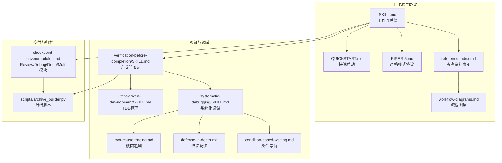
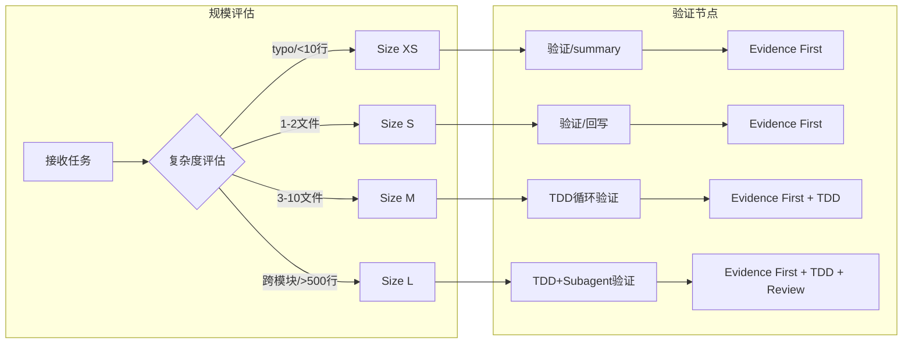
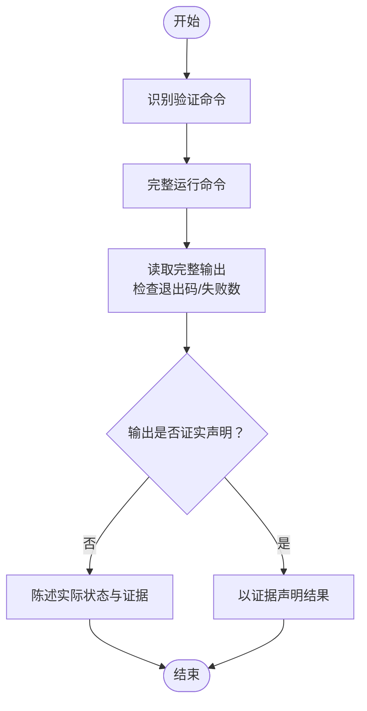
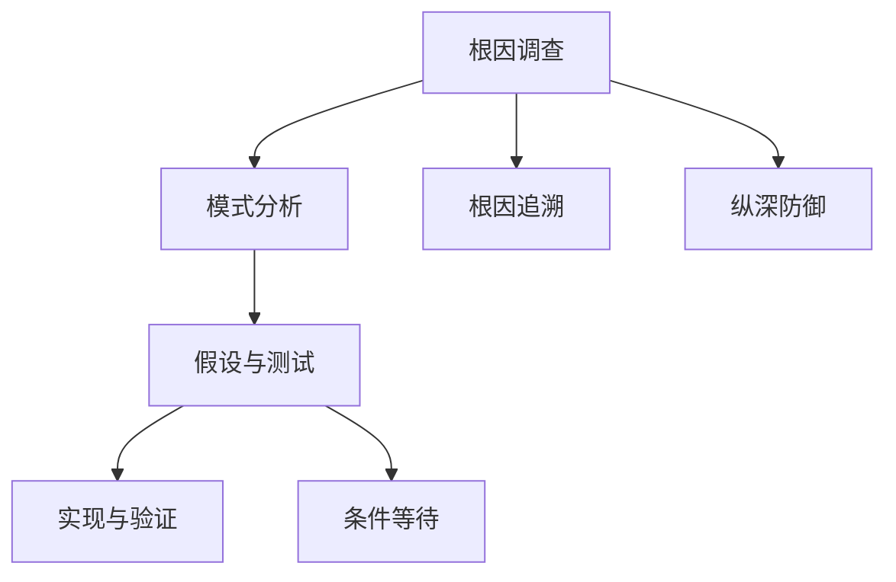
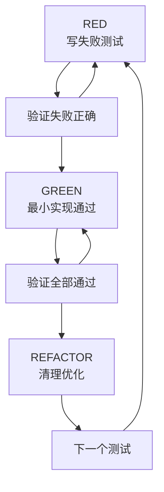
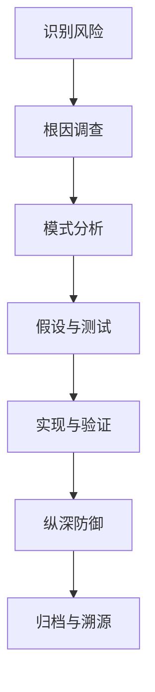
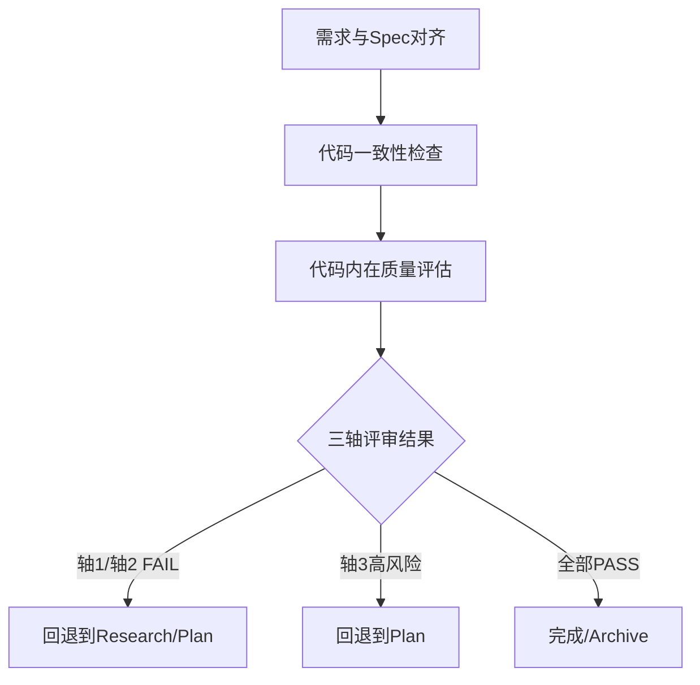
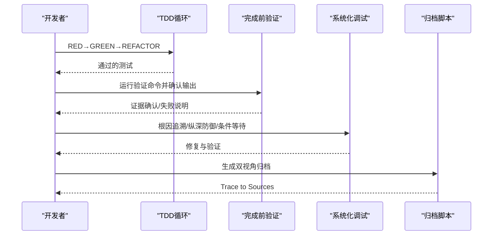
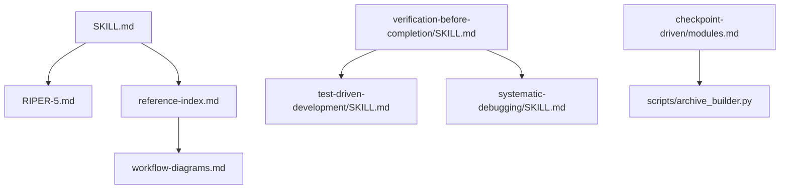

# 完成前验证

<cite>
**本文引用的文件**
- [altas-workflow/QUICKSTART.md](file://altas-workflow/QUICKSTART.md)
- [altas-workflow/SKILL.md](file://altas-workflow/SKILL.md)
- [altas-workflow/reference-index.md](file://altas-workflow/reference-index.md)
- [altas-workflow/workflow-diagrams.md](file://altas-workflow/workflow-diagrams.md)
- [altas-workflow/protocols/RIPER-5.md](file://altas-workflow/protocols/RIPER-5.md)
- [altas-workflow/references/superpowers/verification-before-completion/SKILL.md](file://altas-workflow/references/superpowers/verification-before-completion/SKILL.md)
- [altas-workflow/references/superpowers/systematic-debugging/SKILL.md](file://altas-workflow/references/superpowers/systematic-debugging/SKILL.md)
- [altas-workflow/references/superpowers/systematic-debugging/root-cause-tracing.md](file://altas-workflow/references/superpowers/systematic-debugging/root-cause-tracing.md)
- [altas-workflow/references/superpowers/systematic-debugging/defense-in-depth.md](file://altas-workflow/references/superpowers/systematic-debugging/defense-in-depth.md)
- [altas-workflow/references/superpowers/systematic-debugging/condition-based-waiting.md](file://altas-workflow/references/superpowers/systematic-debugging/condition-based-waiting.md)
- [altas-workflow/references/superpowers/test-driven-development/SKILL.md](file://altas-workflow/references/superpowers/test-driven-development/SKILL.md)
- [altas-workflow/references/checkpoint-driven/modules.md](file://altas-workflow/references/checkpoint-driven/modules.md)
- [altas-workflow/scripts/archive_builder.py](file://altas-workflow/scripts/archive_builder.py)
- [altas-workflow/references/agents/sdd-riper-one/scripts/archive_builder.py](file://altas-workflow/references/agents/sdd-riper-one/scripts/archive_builder.py)
</cite>

## 目录
1. [简介](#简介)
2. [项目结构](#项目结构)
3. [核心组件](#核心组件)
4. [架构总览](#架构总览)
5. [详细组件分析](#详细组件分析)
6. [依赖关系分析](#依赖关系分析)
7. [性能考量](#性能考量)
8. [故障排查指南](#故障排查指南)
9. [结论](#结论)
10. [附录](#附录)

## 简介
本文件围绕“完成前验证”主题，系统化梳理 ALTAS Workflow 在 Spec-Driven、Checkpoint-Driven 与 Superpowers（TDD+Subagent）融合下的验证策略与实施方法。内容覆盖功能验证、性能测试与安全检查的维度，深入解析风险评估流程与工具，明确上线准备清单与检查要点，提供验证工具使用指南与自动化测试集成方法，并给出质量门禁、验收标准与交付物管理策略，旨在为团队构建可靠的软件交付保障体系与最佳实践。

## 项目结构
该仓库以“工作流技能 + 参考资料 + 协议 + 脚本”为核心组织方式，围绕“完成前验证”的关键环节，形成可按需加载的模块化参考体系。关键目录与职责如下：
- altas-workflow/QUICKSTART.md：快速启动与典型场景，明确测试框架与一键命令。
- altas-workflow/SKILL.md：ALTAS 工作流总纲，定义规模评估、铁律门禁、阶段执行与产物命名约定。
- altas-workflow/reference-index.md：参考资料索引，按阶段/模式/来源分类，指导按需加载。
- altas-workflow/workflow-diagrams.md：流程图集，涵盖架构总览、阶段流程、铁律门禁、TDD 循环、特殊模式等。
- altas-workflow/protocols/RIPER-5.md：严格模式协议，强调“模式声明 + 逐模式推进 + 严格门禁”。
- references/superpowers/verification-before-completion/SKILL.md：完成前验证的“证据优先”铁律与门禁函数。
- references/superpowers/systematic-debugging/*：系统化调试的四阶段流程与配套技术（根因追溯、纵深防御、条件等待）。
- references/superpowers/test-driven-development/SKILL.md：TDD 铁律与红绿重构循环，确保功能验证可重复、可回归。
- references/checkpoint-driven/modules.md：Review/Debug/Deep/Multi 等按需模块，统一“无 Spec 不执行、无批准不执行”的门禁。
- scripts/archive_builder.py：归档沉淀脚本，支持生成 human/llm 双视角归档，附带 Trace to Sources。

**图表来源**
- [altas-workflow/SKILL.md:1-351](file://altas-workflow/SKILL.md#L1-L351)
- [altas-workflow/QUICKSTART.md:1-182](file://altas-workflow/QUICKSTART.md#L1-L182)
- [altas-workflow/reference-index.md:1-210](file://altas-workflow/reference-index.md#L1-L210)
- [altas-workflow/workflow-diagrams.md:1-338](file://altas-workflow/workflow-diagrams.md#L1-L338)
- [altas-workflow/protocols/RIPER-5.md:1-187](file://altas-workflow/protocols/RIPER-5.md#L1-L187)
- [altas-workflow/references/superpowers/verification-before-completion/SKILL.md:1-140](file://altas-workflow/references/superpowers/verification-before-completion/SKILL.md#L1-L140)
- [altas-workflow/references/superpowers/systematic-debugging/SKILL.md:1-297](file://altas-workflow/references/superpowers/systematic-debugging/SKILL.md#L1-L297)
- [altas-workflow/references/superpowers/systematic-debugging/root-cause-tracing.md:1-170](file://altas-workflow/references/superpowers/systematic-debugging/root-cause-tracing.md#L1-L170)
- [altas-workflow/references/superpowers/systematic-debugging/defense-in-depth.md:1-123](file://altas-workflow/references/superpowers/systematic-debugging/defense-in-depth.md#L1-L123)
- [altas-workflow/references/superpowers/systematic-debugging/condition-based-waiting.md:1-116](file://altas-workflow/references/superpowers/systematic-debugging/condition-based-waiting.md#L1-L116)
- [altas-workflow/references/superpowers/test-driven-development/SKILL.md:1-372](file://altas-workflow/references/superpowers/test-driven-development/SKILL.md#L1-L372)
- [altas-workflow/references/checkpoint-driven/modules.md:1-57](file://altas-workflow/references/checkpoint-driven/modules.md#L1-L57)
- [altas-workflow/scripts/archive_builder.py:1-505](file://altas-workflow/scripts/archive_builder.py#L1-L505)

**章节来源**
- [altas-workflow/QUICKSTART.md:1-182](file://altas-workflow/QUICKSTART.md#L1-L182)
- [altas-workflow/SKILL.md:1-351](file://altas-workflow/SKILL.md#L1-L351)
- [altas-workflow/reference-index.md:1-210](file://altas-workflow/reference-index.md#L1-L210)
- [altas-workflow/workflow-diagrams.md:1-338](file://altas-workflow/workflow-diagrams.md#L1-L338)

## 核心组件
- 规模评估与工作流深度：根据任务复杂度自动选择 XS/S/M/L，差异化输出与门禁策略。
- 铁律门禁：No Spec, No Code；No Approval, No Execute；Evidence First；TDD Iron Law；Root Cause 必先等。
- 验证优先：完成前验证强调“证据优先”，任何成功/完成声明前必须运行验证命令并确认输出。
- 系统化调试：四阶段根因调查、模式分析、假设与测试、实现与验证，杜绝症状修复。
- TDD 循环：RED→GREEN→REFACTOR，确保测试先行、最小实现、持续重构。
- 按需模块：Review/Debug/Deep/Multi 等模块，统一门禁与输出格式。
- 归档沉淀：双视角（human/llm）归档，附 Trace to Sources，便于复用与审计。

**章节来源**
- [altas-workflow/SKILL.md:90-102](file://altas-workflow/SKILL.md#L90-L102)
- [altas-workflow/SKILL.md:138-218](file://altas-workflow/SKILL.md#L138-L218)
- [altas-workflow/reference-index.md:175-202](file://altas-workflow/reference-index.md#L175-L202)
- [altas-workflow/references/superpowers/verification-before-completion/SKILL.md:16-38](file://altas-workflow/references/superpowers/verification-before-completion/SKILL.md#L16-L38)
- [altas-workflow/references/superpowers/systematic-debugging/SKILL.md:46-214](file://altas-workflow/references/superpowers/systematic-debugging/SKILL.md#L46-L214)
- [altas-workflow/references/superpowers/test-driven-development/SKILL.md:31-68](file://altas-workflow/references/superpowers/test-driven-development/SKILL.md#L31-L68)
- [altas-workflow/references/checkpoint-driven/modules.md:1-57](file://altas-workflow/references/checkpoint-driven/modules.md#L1-L57)
- [altas-workflow/scripts/archive_builder.py:318-443](file://altas-workflow/scripts/archive_builder.py#L318-L443)

## 架构总览
下图展示 ALTAS 工作流在不同规模下的推进路径与验证节点，突出“完成前验证”在各阶段的关键位置与门禁约束。

**图表来源**
- [altas-workflow/workflow-diagrams.md:7-41](file://altas-workflow/workflow-diagrams.md#L7-L41)
- [altas-workflow/SKILL.md:105-135](file://altas-workflow/SKILL.md#L105-L135)
- [altas-workflow/references/superpowers/verification-before-completion/SKILL.md:16-38](file://altas-workflow/references/superpowers/verification-before-completion/SKILL.md#L16-L38)
- [altas-workflow/references/superpowers/test-driven-development/SKILL.md:47-68](file://altas-workflow/references/superpowers/test-driven-development/SKILL.md#L47-L68)

## 详细组件分析

### 完成前验证（Evidence First）
- 核心原则：任何成功/完成声明前，必须运行验证命令并确认输出；证据优先，严禁“应该/大概/看起来”等主观表述。
- 门禁函数：IDENTIFY→RUN→READ→VERIFY→仅在确认后才做出声明；违反任一步骤即视为“说谎而非验证”。
- 常见误区：测试通过、Lint 清洁、构建成功、代理完成、需求满足等，均需以“新鲜、完整”的验证输出为依据。
- 应用场景：提交前、PR 创建前、移动到下一任务前、委托给代理前。

**图表来源**
- [altas-workflow/references/superpowers/verification-before-completion/SKILL.md:24-38](file://altas-workflow/references/superpowers/verification-before-completion/SKILL.md#L24-L38)

**章节来源**
- [altas-workflow/references/superpowers/verification-before-completion/SKILL.md:16-140](file://altas-workflow/references/superpowers/verification-before-completion/SKILL.md#L16-L140)

### 系统化调试（根因优先）
- 铁律：在提出修复前，必须完成根因调查；症状修复即失败。
- 四阶段：根因调查（读取错误、重现、检查变更、多组件证据）、模式分析（寻找工作示例、对比差异、理解依赖）、假设与测试（单一假设、最小验证）、实现（创建失败测试、单一修复、验证修复）。
- 配套技术：根因追溯（逆向调用链定位原始触发点）、纵深防御（四层校验使缺陷结构上不可能发生）、条件等待（等待真实条件而非猜测时长）。

**图表来源**
- [altas-workflow/references/superpowers/systematic-debugging/SKILL.md:46-214](file://altas-workflow/references/superpowers/systematic-debugging/SKILL.md#L46-L214)
- [altas-workflow/references/superpowers/systematic-debugging/root-cause-tracing.md:32-152](file://altas-workflow/references/superpowers/systematic-debugging/root-cause-tracing.md#L32-L152)
- [altas-workflow/references/superpowers/systematic-debugging/defense-in-depth.md:20-123](file://altas-workflow/references/superpowers/systematic-debugging/defense-in-depth.md#L20-L123)
- [altas-workflow/references/superpowers/systematic-debugging/condition-based-waiting.md:34-116](file://altas-workflow/references/superpowers/systematic-debugging/condition-based-waiting.md#L34-L116)

**章节来源**
- [altas-workflow/references/superpowers/systematic-debugging/SKILL.md:16-297](file://altas-workflow/references/superpowers/systematic-debugging/SKILL.md#L16-L297)
- [altas-workflow/references/superpowers/systematic-debugging/root-cause-tracing.md:1-170](file://altas-workflow/references/superpowers/systematic-debugging/root-cause-tracing.md#L1-L170)
- [altas-workflow/references/superpowers/systematic-debugging/defense-in-depth.md:1-123](file://altas-workflow/references/superpowers/systematic-debugging/defense-in-depth.md#L1-L123)
- [altas-workflow/references/superpowers/systematic-debugging/condition-based-waiting.md:1-116](file://altas-workflow/references/superpowers/systematic-debugging/condition-based-waiting.md#L1-L116)

### TDD 循环（测试驱动）
- 铁律：无失败测试不写生产代码；测试先行，确保测试真正覆盖行为而非实现。
- 红绿重构：RED（写失败测试）→ GREEN（最小实现通过）→ REFACTOR（清理优化），循环推进。
- 验证清单：每个新函数都有测试、看过失败、失败原因正确、最小实现、全部通过、输出纯净、使用真实代码、覆盖边界与错误。

**图表来源**
- [altas-workflow/references/superpowers/test-driven-development/SKILL.md:47-68](file://altas-workflow/references/superpowers/test-driven-development/SKILL.md#L47-L68)
- [altas-workflow/references/superpowers/test-driven-development/SKILL.md:327-341](file://altas-workflow/references/superpowers/test-driven-development/SKILL.md#L327-L341)

**章节来源**
- [altas-workflow/references/superpowers/test-driven-development/SKILL.md:31-372](file://altas-workflow/references/superpowers/test-driven-development/SKILL.md#L31-L372)

### 风险评估与工具
- 风险识别：通过系统化调试定位根因，结合 TDD 验证与完成前验证，识别潜在缺陷与回归风险。
- 概率分析：基于历史失败记忆与常见误区（如“应该/大概/看起来”），量化主观断言的风险。
- 影响评估：通过纵深防御与 Trace to Sources，评估修复对系统整体的影响与后续建议。
- 工具链：完成前验证脚本、TDD 循环、系统化调试工具、条件等待、归档脚本。

**图表来源**
- [altas-workflow/references/superpowers/systematic-debugging/SKILL.md:46-214](file://altas-workflow/references/superpowers/systematic-debugging/SKILL.md#L46-L214)
- [altas-workflow/references/superpowers/verification-before-completion/SKILL.md:16-38](file://altas-workflow/references/superpowers/verification-before-completion/SKILL.md#L16-L38)
- [altas-workflow/scripts/archive_builder.py:318-443](file://altas-workflow/scripts/archive_builder.py#L318-L443)

**章节来源**
- [altas-workflow/references/checkpoint-driven/modules.md:31-43](file://altas-workflow/references/checkpoint-driven/modules.md#L31-L43)

### 上线准备清单与检查要点
- 代码审查：三轴评审（Spec 质量与需求达成、Spec-代码一致性、代码内在质量），高风险退回 Plan。
- 测试验证：TDD 循环完整通过，回归测试稳定，构建与静态检查通过。
- 部署检查：完成前验证确认，证据链完整，Trace to Sources 明确。
- 回滚预案：归档沉淀中记录风险与后续建议，必要时回退到上一版本并补充验证。

**图表来源**
- [altas-workflow/SKILL.md:194-209](file://altas-workflow/SKILL.md#L194-L209)
- [altas-workflow/references/checkpoint-driven/modules.md:31-43](file://altas-workflow/references/checkpoint-driven/modules.md#L31-L43)

**章节来源**
- [altas-workflow/SKILL.md:194-209](file://altas-workflow/SKILL.md#L194-L209)
- [altas-workflow/references/checkpoint-driven/modules.md:31-43](file://altas-workflow/references/checkpoint-driven/modules.md#L31-L43)

### 验证工具使用指南与自动化集成
- 完成前验证：在声明任何成功/完成前，运行验证命令并确认输出；若失败，明确陈述实际状态与证据。
- TDD 集成：在执行阶段，每一步均以测试失败→通过→重构的循环推进，确保可重复验证。
- 系统化调试：根因追溯、纵深防御、条件等待三件套，配合完成前验证形成闭环。
- 归档沉淀：使用归档脚本生成 human/llm 双视角文档，附带 Trace to Sources，便于复用与审计。

**图表来源**
- [altas-workflow/references/superpowers/verification-before-completion/SKILL.md:24-38](file://altas-workflow/references/superpowers/verification-before-completion/SKILL.md#L24-L38)
- [altas-workflow/references/superpowers/test-driven-development/SKILL.md:47-68](file://altas-workflow/references/superpowers/test-driven-development/SKILL.md#L47-L68)
- [altas-workflow/references/superpowers/systematic-debugging/SKILL.md:46-214](file://altas-workflow/references/superpowers/systematic-debugging/SKILL.md#L46-L214)
- [altas-workflow/scripts/archive_builder.py:451-500](file://altas-workflow/scripts/archive_builder.py#L451-L500)

**章节来源**
- [altas-workflow/scripts/archive_builder.py:318-443](file://altas-workflow/scripts/archive_builder.py#L318-L443)

## 依赖关系分析
- 工作流与协议：SKILL.md 作为总纲，引用 RIPER-5 严格模式协议，确保模式切换与门禁执行。
- 验证与调试：完成前验证与 TDD 循环相互支撑，系统化调试贯穿始终，保证根因可溯与修复可靠。
- 模块化加载：reference-index.md 提供按需加载指引，workflow-diagrams.md 提供可视化参考。
- 交付与归档：按需模块统一门禁，归档脚本生成双视角文档，Trace to Sources 串联来源。

**图表来源**
- [altas-workflow/SKILL.md:1-351](file://altas-workflow/SKILL.md#L1-L351)
- [altas-workflow/protocols/RIPER-5.md:1-187](file://altas-workflow/protocols/RIPER-5.md#L1-L187)
- [altas-workflow/reference-index.md:1-210](file://altas-workflow/reference-index.md#L1-L210)
- [altas-workflow/workflow-diagrams.md:1-338](file://altas-workflow/workflow-diagrams.md#L1-L338)
- [altas-workflow/references/superpowers/verification-before-completion/SKILL.md:1-140](file://altas-workflow/references/superpowers/verification-before-completion/SKILL.md#L1-L140)
- [altas-workflow/references/superpowers/test-driven-development/SKILL.md:1-372](file://altas-workflow/references/superpowers/test-driven-development/SKILL.md#L1-L372)
- [altas-workflow/references/superpowers/systematic-debugging/SKILL.md:1-297](file://altas-workflow/references/superpowers/systematic-debugging/SKILL.md#L1-L297)
- [altas-workflow/references/checkpoint-driven/modules.md:1-57](file://altas-workflow/references/checkpoint-driven/modules.md#L1-L57)
- [altas-workflow/scripts/archive_builder.py:1-505](file://altas-workflow/scripts/archive_builder.py#L1-L505)

**章节来源**
- [altas-workflow/reference-index.md:1-210](file://altas-workflow/reference-index.md#L1-L210)

## 性能考量
- 验证效率：TDD 循环与完成前验证减少调试成本，提高修复速度与质量。
- 调试稳定性：系统化调试降低“猜测-修复-再猜测”的无效循环，提升首次修复成功率。
- 归档复用：双视角归档与 Trace to Sources 降低重复劳动，加速后续任务推进。
- 模块化加载：按需加载参考资料，避免不必要的 token 消耗与上下文膨胀。

## 故障排查指南
- 常见误区与红灯：避免“应该/大概/看起来”等主观表述；不要信任代理报告；不要依赖部分验证；不要认为“只是这一次”。
- 系统化调试：遇到任何测试失败、生产缺陷、性能问题、构建失败、集成问题，先完成根因调查，再形成假设并最小化验证，最后实现修复。
- 根因追溯：逆向调用链定位原始触发点，必要时添加栈跟踪日志。
- 纵深防御：在入口、业务逻辑、环境、调试四个层面增加校验，使缺陷结构上不可能发生。
- 条件等待：等待真实条件而非猜测时长，避免竞态与超时。

**章节来源**
- [altas-workflow/references/superpowers/verification-before-completion/SKILL.md:40-75](file://altas-workflow/references/superpowers/verification-before-completion/SKILL.md#L40-L75)
- [altas-workflow/references/superpowers/systematic-debugging/SKILL.md:215-244](file://altas-workflow/references/superpowers/systematic-debugging/SKILL.md#L215-L244)
- [altas-workflow/references/superpowers/systematic-debugging/root-cause-tracing.md:130-152](file://altas-workflow/references/superpowers/systematic-debugging/root-cause-tracing.md#L130-L152)
- [altas-workflow/references/superpowers/systematic-debugging/defense-in-depth.md:87-123](file://altas-workflow/references/superpowers/systematic-debugging/defense-in-depth.md#L87-L123)
- [altas-workflow/references/superpowers/systematic-debugging/condition-based-waiting.md:84-116](file://altas-workflow/references/superpowers/systematic-debugging/condition-based-waiting.md#L84-L116)

## 结论
通过“完成前验证”为核心的验证策略，结合系统化调试、TDD 循环与按需模块化工作流，ALTAS 提供了一套可落地、可复用、可审计的软件交付保障体系。团队可在不同规模任务中，严格遵循证据优先与门禁约束，确保功能正确、性能稳定、安全可控，并通过归档沉淀形成知识资产，持续改进交付质量。

## 附录
- 快速启动与典型场景参见 [QUICKSTART.md:1-182](file://altas-workflow/QUICKSTART.md#L1-L182)。
- 工作流总纲与铁律门禁参见 [SKILL.md:90-135](file://altas-workflow/SKILL.md#L90-L135)。
- 参考资料索引与按需加载参见 [reference-index.md:175-202](file://altas-workflow/reference-index.md#L175-L202)。
- 流程图集参见 [workflow-diagrams.md:1-338](file://altas-workflow/workflow-diagrams.md#L1-L338)。
- RIPER-5 严格模式协议参见 [RIPER-5.md:1-187](file://altas-workflow/protocols/RIPER-5.md#L1-L187)。
- 完成前验证参见 [verification-before-completion/SKILL.md:16-140](file://altas-workflow/references/superpowers/verification-before-completion/SKILL.md#L16-L140)。
- 系统化调试参见 [systematic-debugging/SKILL.md:16-297](file://altas-workflow/references/superpowers/systematic-debugging/SKILL.md#L16-L297)。
- TDD 循环参见 [test-driven-development/SKILL.md:31-372](file://altas-workflow/references/superpowers/test-driven-development/SKILL.md#L31-L372)。
- 按需模块参见 [checkpoint-driven/modules.md:1-57](file://altas-workflow/references/checkpoint-driven/modules.md#L1-L57)。
- 归档脚本参见 [scripts/archive_builder.py:451-500](file://altas-workflow/scripts/archive_builder.py#L451-500)。