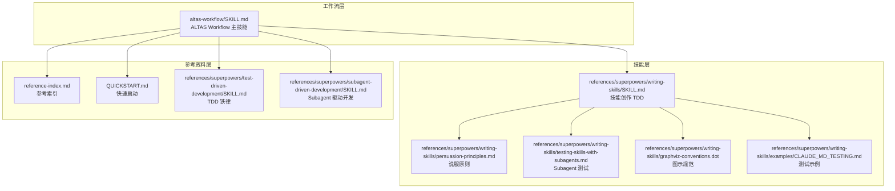
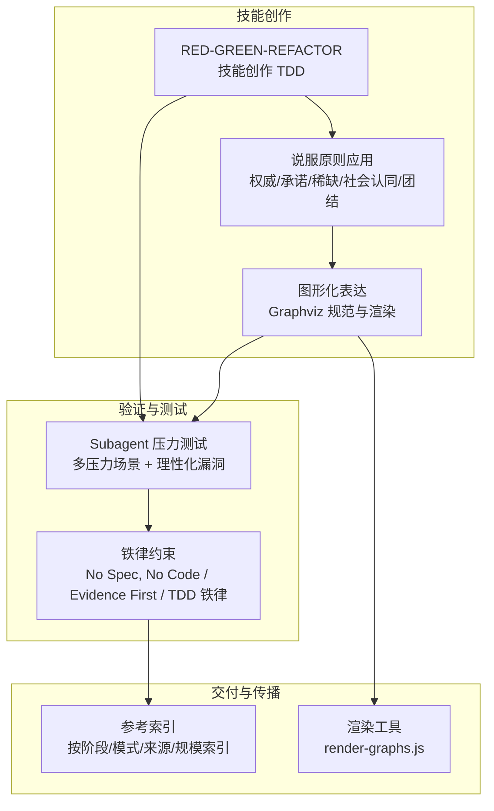
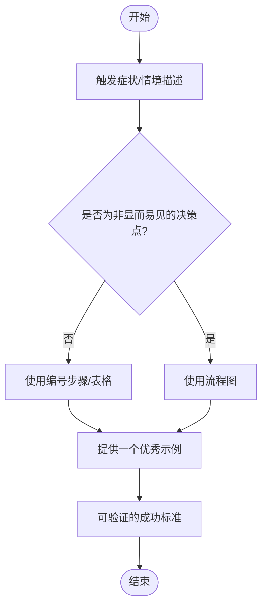
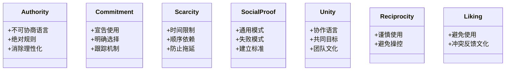
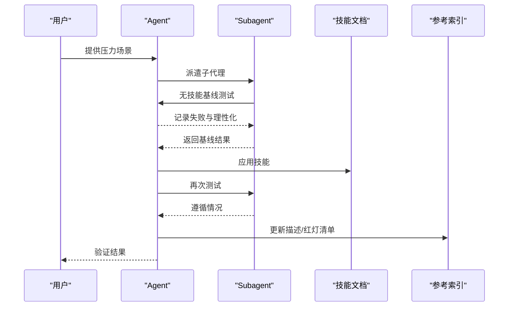
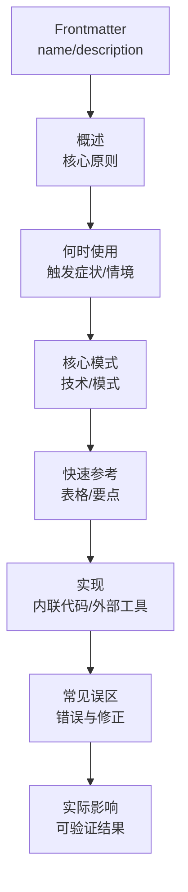
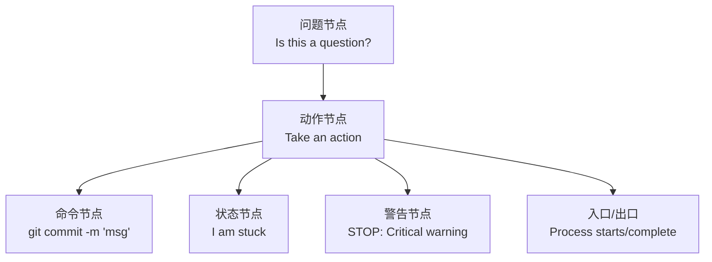
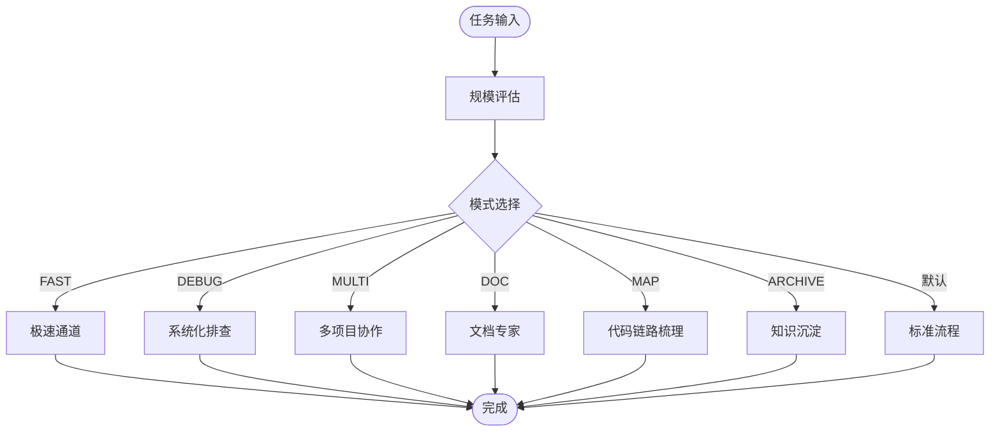
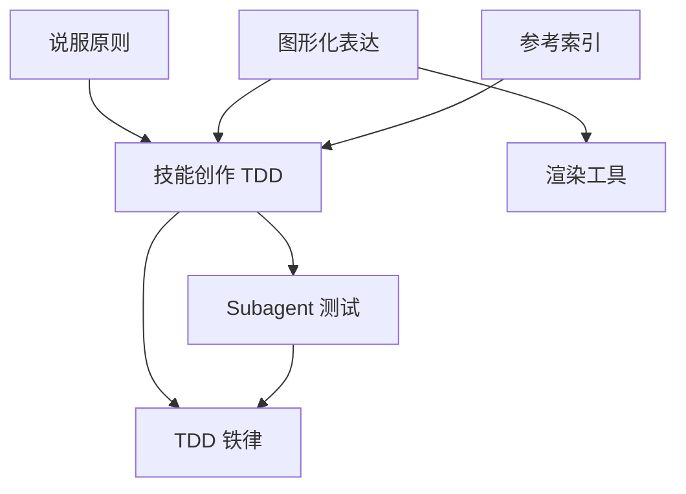

# 技能编写指南

<cite>
**本文引用的文件**
- [altas-workflow/SKILL.md](file://altas-workflow/SKILL.md)
- [altas-workflow/writing-skills/SKILL.md](file://altas-workflow/references/superpowers/writing-skills/SKILL.md)
- [altas-workflow/writing-skills/persuasion-principles.md](file://altas-workflow/references/superpowers/writing-skills/persuasion-principles.md)
- [altas-workflow/writing-skills/testing-skills-with-subagents.md](file://altas-workflow/references/superpowers/writing-skills/testing-skills-with-subagents.md)
- [altas-workflow/writing-skills/graphviz-conventions.dot](file://altas-workflow/references/superpowers/writing-skills/graphviz-conventions.dot)
- [altas-workflow/reference-index.md](file://altas-workflow/reference-index.md)
- [altas-workflow/QUICKSTART.md](file://altas-workflow/QUICKSTART.md)
- [altas-workflow/references/superpowers/test-driven-development/SKILL.md](file://altas-workflow/references/superpowers/test-driven-development/SKILL.md)
- [altas-workflow/references/superpowers/subagent-driven-development/SKILL.md](file://altas-workflow/references/superpowers/subagent-driven-development/SKILL.md)
- [altas-workflow/references/superpowers/writing-skills/examples/CLAUDE_MD_TESTING.md](file://altas-workflow/references/superpowers/writing-skills/examples/CLAUDE_MD_TESTING.md)
</cite>

## 目录
1. [简介](#简介)
2. [项目结构](#项目结构)
3. [核心组件](#核心组件)
4. [架构概览](#架构概览)
5. [详细组件分析](#详细组件分析)
6. [依赖分析](#依赖分析)
7. [性能考虑](#性能考虑)
8. [故障排除指南](#故障排除指南)
9. [结论](#结论)
10. [附录](#附录)

## 简介
本指南面向开发者与技术文档作者，系统阐述如何基于 ALTAS Workflow 体系编写高质量技能文档（SKILL.md）。内容涵盖：
- 技能设计原则与结构化表达方法：目标明确性、步骤可执行性、结果可验证性
- 说服原则的应用技巧：逻辑论证、情感共鸣、权威建立
- 使用 Subagent 进行技能测试的方法与验证流程
- 技能文档模板与格式规范：示例展示与最佳实践
- 图形化表示方法、可视化工具使用与文档渲染技术
- 开发者高质量技能文档编写指南与知识传承方法论

## 项目结构
该仓库以“工作流 + 技能 + 参考资料”三层结构组织：
- 工作流层：ALTAS Workflow（主 SKILL.md）定义任务规模评估、阶段流程与铁律约束
- 技能层：writing-skills 子模块提供技能创作与测试的 TDD 方法论
- 参考资料层：按来源与主题划分的参考文件，支持按需加载

图表来源
- [altas-workflow/SKILL.md:1-358](file://altas-workflow/SKILL.md#L1-L358)
- [altas-workflow/writing-skills/SKILL.md:1-656](file://altas-workflow/references/superpowers/writing-skills/SKILL.md#L1-L656)
- [altas-workflow/reference-index.md:1-210](file://altas-workflow/reference-index.md#L1-L210)

章节来源
- [altas-workflow/SKILL.md:1-358](file://altas-workflow/SKILL.md#L1-L358)
- [altas-workflow/reference-index.md:1-210](file://altas-workflow/reference-index.md#L1-L210)

## 核心组件
- ALTAS Workflow 主技能：定义任务规模评估、阶段流程、铁律约束与进度检查点输出规范
- 技能创作 TDD：将 TDD 思想应用于技能文档创作，形成 RED-GREEN-REFACTOR 循环
- 说服原则：权威、承诺、稀缺、社会认同、团结、互惠、喜欢七原则在技能设计中的应用
- Subagent 测试：通过压力场景与理性化漏洞挖掘，确保技能在真实压力下仍被严格遵循
- 图形化表示：Graphviz 规范与渲染工具，支持流程图与决策图的可视化表达
- 参考资料索引：按阶段、模式、来源与规模的统一索引，支持按需加载

章节来源
- [altas-workflow/SKILL.md:1-358](file://altas-workflow/SKILL.md#L1-L358)
- [altas-workflow/writing-skills/SKILL.md:1-656](file://altas-workflow/references/superpowers/writing-skills/SKILL.md#L1-L656)
- [altas-workflow/writing-skills/persuasion-principles.md:1-188](file://altas-workflow/references/superpowers/writing-skills/persuasion-principles.md#L1-L188)
- [altas-workflow/writing-skills/testing-skills-with-subagents.md:1-385](file://altas-workflow/references/superpowers/writing-skills/testing-skills-with-subagents.md#L1-L385)
- [altas-workflow/writing-skills/graphviz-conventions.dot:1-172](file://altas-workflow/references/superpowers/writing-skills/graphviz-conventions.dot#L1-L172)

## 架构概览
技能编写架构以“TDD 驱动的技能创作 + 说服原则 + Subagent 测试 + 图形化表达”为核心，结合 ALTAS Workflow 的阶段与铁律约束，形成闭环的质量保障体系。

图表来源
- [altas-workflow/writing-skills/SKILL.md:374-394](file://altas-workflow/references/superpowers/writing-skills/SKILL.md#L374-L394)
- [altas-workflow/writing-skills/persuasion-principles.md:1-188](file://altas-workflow/references/superpowers/writing-skills/persuasion-principles.md#L1-L188)
- [altas-workflow/writing-skills/testing-skills-with-subagents.md:30-42](file://altas-workflow/references/superpowers/writing-skills/testing-skills-with-subagents.md#L30-L42)
- [altas-workflow/SKILL.md:90-102](file://altas-workflow/SKILL.md#L90-L102)
- [altas-workflow/reference-index.md:1-210](file://altas-workflow/reference-index.md#L1-L210)

## 详细组件分析

### 组件一：技能设计原则与结构化表达
- 目标明确性：描述字段聚焦“何时使用”，而非“技能做什么”。触发症状、情境与问题描述应具体、技术无关或明确标注技术特定性
- 步骤可执行性：流程图仅用于非显而易见的决策点；线性步骤用编号列表；参考材料用表格/清单；代码示例用简洁可复用示例
- 结果可验证性：技能必须具备可验证的“成功标准”，如 Agent 在最大压力下仍遵循规则、能引用具体条款、能自我识别理性化倾向

图表来源
- [altas-workflow/writing-skills/SKILL.md:290-317](file://altas-workflow/references/superpowers/writing-skills/SKILL.md#L290-L317)
- [altas-workflow/writing-skills/SKILL.md:140-172](file://altas-workflow/references/superpowers/writing-skills/SKILL.md#L140-L172)

章节来源
- [altas-workflow/writing-skills/SKILL.md:140-198](file://altas-workflow/references/superpowers/writing-skills/SKILL.md#L140-L198)
- [altas-workflow/writing-skills/SKILL.md:290-317](file://altas-workflow/references/superpowers/writing-skills/SKILL.md#L290-L317)

### 组件二：说服原则的应用技巧
- 权威：使用“必须/永远/绝不”等不可协商语言，消除决策疲劳与理性化
- 承诺：要求宣告使用、明确选择、使用 TodoWrite 等跟踪机制
- 稀缺：时间限制、顺序依赖，防止拖延
- 社会认同：通用模式与失败模式，建立标准
- 团结：协作语言与共同目标，营造“我们”的文化
- 互惠/喜欢：谨慎使用，避免操控与拍马行为

图表来源
- [altas-workflow/writing-skills/persuasion-principles.md:11-125](file://altas-workflow/references/superpowers/writing-skills/persuasion-principles.md#L11-L125)

章节来源
- [altas-workflow/writing-skills/persuasion-principles.md:1-188](file://altas-workflow/references/superpowers/writing-skills/persuasion-principles.md#L1-L188)

### 组件三：使用 Subagent 进行技能测试
- RED 阶段：构建至少三种压力组合的场景，观察 Agent 在无技能情况下如何选择与理性化
- GREEN 阶段：针对具体失败编写技能，确保 Agent 在有技能情况下遵循
- REFACTOR 阶段：捕获新的理性化借口，逐一添加明确否定条款、更新描述与红灯清单
- meta-testing：询问 Agent 为何技能未能使其遵循，从基础原理、组织结构与关键要点可见性三个角度改进

图表来源
- [altas-workflow/writing-skills/testing-skills-with-subagents.md:30-42](file://altas-workflow/references/superpowers/writing-skills/testing-skills-with-subagents.md#L30-L42)
- [altas-workflow/writing-skills/SKILL.md:533-561](file://altas-workflow/references/superpowers/writing-skills/SKILL.md#L533-L561)

章节来源
- [altas-workflow/writing-skills/testing-skills-with-subagents.md:1-385](file://altas-workflow/references/superpowers/writing-skills/testing-skills-with-subagents.md#L1-L385)
- [altas-workflow/writing-skills/examples/CLAUDE_MD_TESTING.md:1-190](file://altas-workflow/references/superpowers/writing-skills/examples/CLAUDE_MD_TESTING.md#L1-L190)

### 组件四：技能文档模板与格式规范
- Frontmatter：name 与 description 字段，description 仅描述触发条件，不超过 500 字符
- 结构：概述、何时使用、核心模式（技术/模式）、快速参考、实现、常见误区、实际影响（可选）
- 搜索优化（CSO）：丰富的触发词、症状、同义词与工具名；命名采用动词优先；压缩冗余信息
- 跨引用：使用技能名并标注“必需子技能/背景”，避免强制加载
- 图形化：仅在必要时使用流程图；遵循 Graphviz 规范与渲染工具

图表来源
- [altas-workflow/writing-skills/SKILL.md:93-137](file://altas-workflow/references/superpowers/writing-skills/SKILL.md#L93-L137)
- [altas-workflow/writing-skills/SKILL.md:140-277](file://altas-workflow/references/superpowers/writing-skills/SKILL.md#L140-L277)

章节来源
- [altas-workflow/writing-skills/SKILL.md:93-137](file://altas-workflow/references/superpowers/writing-skills/SKILL.md#L93-L137)
- [altas-workflow/writing-skills/SKILL.md:140-277](file://altas-workflow/references/superpowers/writing-skills/SKILL.md#L140-L277)

### 组件五：图形化表示方法与可视化工具
- Graphviz 规范：节点类型（问题/动作/命令/状态/警告）、边标签（yes/no/otherwise/triggers）、命名模式（以问号结尾的问题、以动词开头的动作、命令为字面量）
- 渲染工具：render-graphs.js 支持单独渲染与合并渲染
- 在技能中嵌入流程图，仅用于非显而易见的决策点与过程循环

图表来源
- [altas-workflow/writing-skills/graphviz-conventions.dot:1-172](file://altas-workflow/references/superpowers/writing-skills/graphviz-conventions.dot#L1-L172)

章节来源
- [altas-workflow/writing-skills/graphviz-conventions.dot:1-172](file://altas-workflow/references/superpowers/writing-skills/graphviz-conventions.dot#L1-L172)

### 组件六：与 ALTAS Workflow 的集成
- 铁律约束：No Spec, No Code；No Approval, No Execute；Spec is Truth；Reverse Sync；Evidence First；No Fixes Without Root Cause；TDD Iron Law；Resume Ready
- 阶段流程：PRE-RESEARCH → RESEARCH → INNOVATE → PLAN → EXECUTE → REVIEW → ARCHIVE
- 触发词与模式：FAST、DEBUG、MULTI、DOC、MAP、ARCHIVE 等模式下的参考文件索引

图表来源
- [altas-workflow/SKILL.md:22-102](file://altas-workflow/SKILL.md#L22-L102)
- [altas-workflow/SKILL.md:138-281](file://altas-workflow/SKILL.md#L138-L281)

章节来源
- [altas-workflow/SKILL.md:22-102](file://altas-workflow/SKILL.md#L22-L102)
- [altas-workflow/SKILL.md:138-281](file://altas-workflow/SKILL.md#L138-L281)

## 依赖分析
技能创作与验证依赖于以下关键关系：
- 技能创作 TDD 依赖于 TDD 铁律与 Subagent 测试方法
- 说服原则为技能设计提供心理层面的强制力与可遵循性
- 图形化表达与渲染工具提升技能的可读性与可传播性
- 参考资料索引确保技能在需要时按需加载，避免上下文污染

图表来源
- [altas-workflow/writing-skills/SKILL.md:374-394](file://altas-workflow/references/superpowers/writing-skills/SKILL.md#L374-L394)
- [altas-workflow/writing-skills/testing-skills-with-subagents.md:30-42](file://altas-workflow/references/superpowers/writing-skills/testing-skills-with-subagents.md#L30-L42)
- [altas-workflow/writing-skills/persuasion-principles.md:1-188](file://altas-workflow/references/superpowers/writing-skills/persuasion-principles.md#L1-L188)
- [altas-workflow/reference-index.md:1-210](file://altas-workflow/reference-index.md#L1-L210)

章节来源
- [altas-workflow/reference-index.md:1-210](file://altas-workflow/reference-index.md#L1-L210)
- [altas-workflow/writing-skills/SKILL.md:374-394](file://altas-workflow/references/superpowers/writing-skills/SKILL.md#L374-L394)

## 性能考虑
- 技能体积控制：Getting Started 工作流 <150 字，常用技能 <200 字，其他 <500 字
- 减少冗余：避免重复交叉引用技能内容；解释命令时避免多余示例
- 按需加载：通过参考索引在命中场景时加载对应文件，减少上下文开销
- 模型成本：Subagent 驱动开发中按角色选择合适模型，降低总体成本

## 故障排除指南
- 描述字段总结流程导致 Agent 跳过正文：修改为仅触发条件，避免总结工作流
- 技能过于抽象或第一人称：改为第三人称、具体触发症状
- 多语言示例稀释质量：保留一种代表性语言的完整示例
- 流程图中包含代码块：使用命令节点与状态节点，保持可复制性
- 通用标签无语义：使用语义化标签，避免 helper1、step3 等

章节来源
- [altas-workflow/writing-skills/SKILL.md:140-277](file://altas-workflow/references/superpowers/writing-skills/SKILL.md#L140-L277)
- [altas-workflow/writing-skills/SKILL.md:562-582](file://altas-workflow/references/superpowers/writing-skills/SKILL.md#L562-L582)

## 结论
高质量技能文档不仅是“如何做”的说明，更是“为何必须如此做”的说服与验证。通过 TDD 驱动的创作流程、说服原则的心理强制、Subagent 压力测试的实证验证以及图形化表达的可读性增强，开发者可以构建可遵循、可验证、可传播的技能体系。结合 ALTAS Workflow 的铁律与阶段约束，技能将成为团队知识传承与质量保障的基石。

## 附录
- 快速启动：安装与测试框架、一键执行命令、典型场景与 FAQ
- 参考资料索引：按阶段、模式、来源与规模的统一索引，支持按需加载
- 示例测试：CLAUDE.md 技能文档变体测试，验证不同表达风格对 Agent 遵循的影响

章节来源
- [altas-workflow/QUICKSTART.md:1-182](file://altas-workflow/QUICKSTART.md#L1-L182)
- [altas-workflow/reference-index.md:1-210](file://altas-workflow/reference-index.md#L1-L210)
- [altas-workflow/references/superpowers/writing-skills/examples/CLAUDE_MD_TESTING.md:1-190](file://altas-workflow/references/superpowers/writing-skills/examples/CLAUDE_MD_TESTING.md#L1-L190)