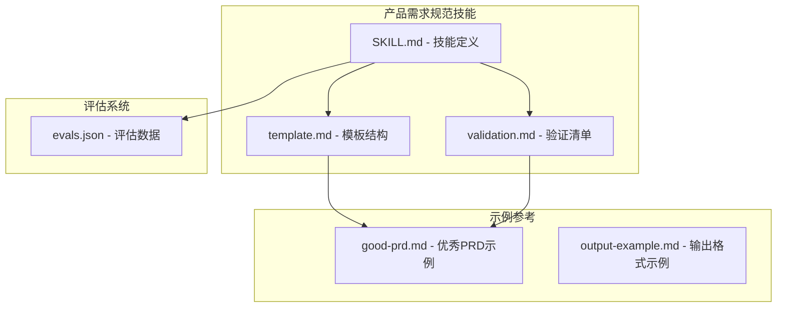
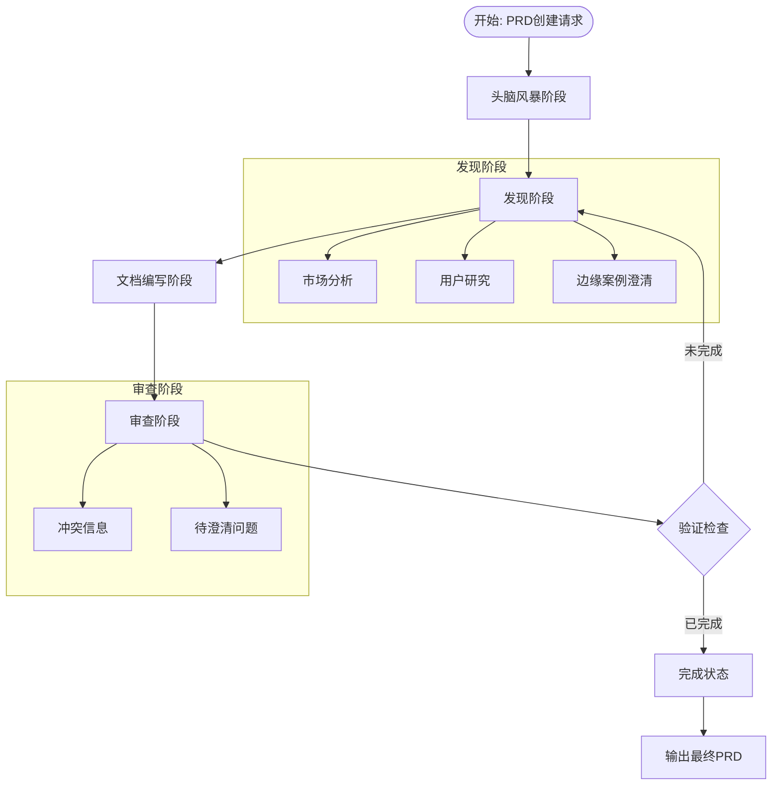
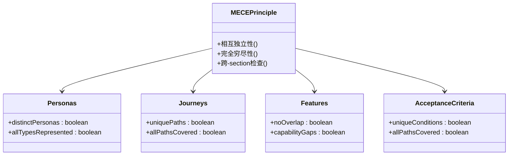
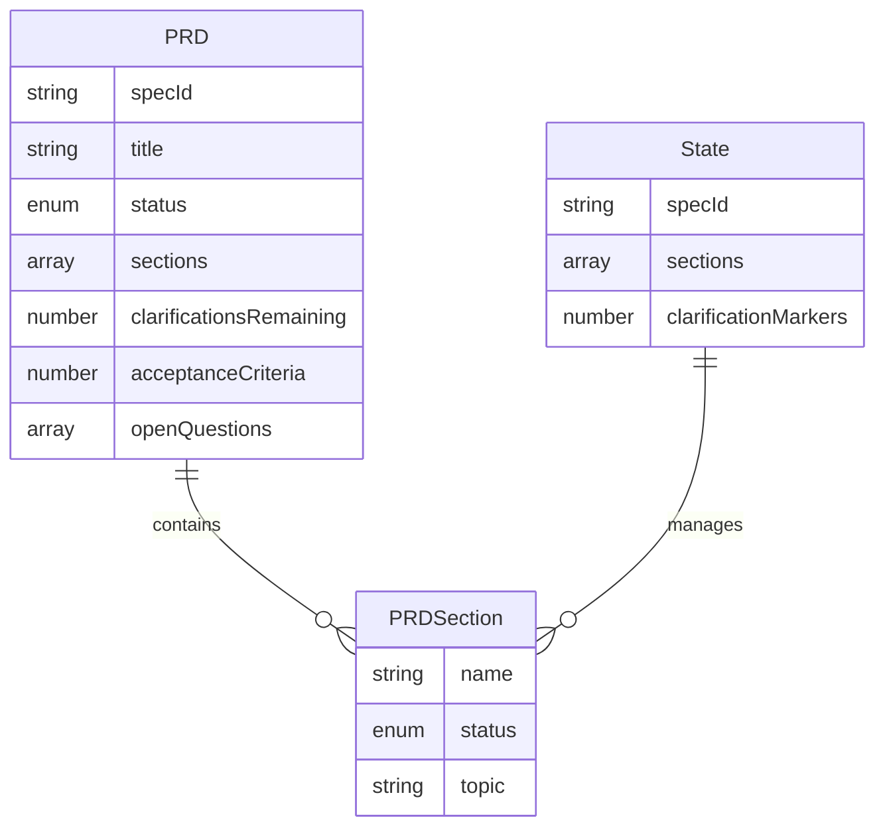
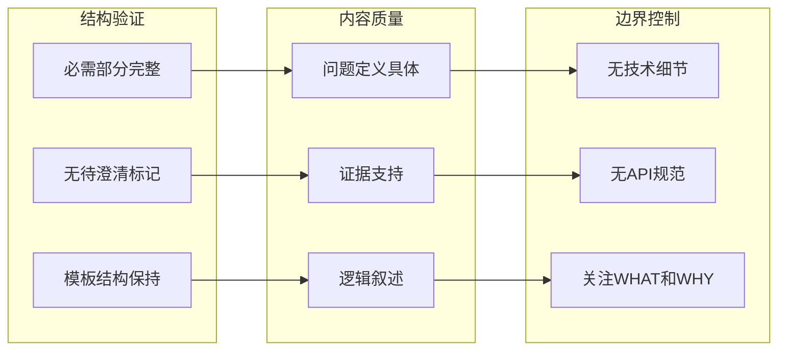
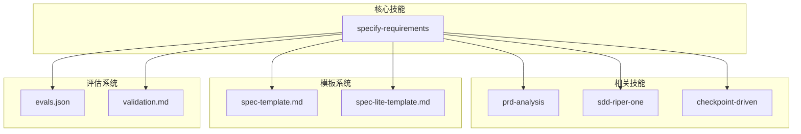

# 产品需求规范技能

<cite>
**本文档引用的文件**
- [SKILL.md](file://.agents/skills/specify-requirements/SKILL.md)
- [template.md](file://.agents/skills/specify-requirements/template.md)
- [validation.md](file://.agents/skills/specify-requirements/validation.md)
- [good-prd.md](file://.agents/skills/specify-requirements/examples/good-prd.md)
- [output-example.md](file://.agents/skills/specify-requirements/examples/output-example.md)
</cite>

## 目录
1. [简介](#简介)
2. [项目结构](#项目结构)
3. [核心组件](#核心组件)
4. [架构概览](#架构概览)
5. [详细组件分析](#详细组件分析)
6. [依赖关系分析](#依赖关系分析)
7. [性能考虑](#性能考虑)
8. [故障排除指南](#故障排除指南)
9. [结论](#结论)

## 简介

"产品需求规范技能"是一个专门用于创建和验证产品需求文档（PRD）的AI代理技能。该技能专注于定义WHAT（需要构建什么）和WHY（为什么重要），确保产品需求的完整性和质量。

该技能的核心目标是帮助产品经理和开发团队创建结构化、可测试、用户导向的产品需求文档，重点关注业务价值而非技术实现细节。通过采用MECE原则（相互独立、完全穷尽）和迭代工作流程，确保产品需求的准确性和完整性。

## 项目结构

该项目采用模块化设计，围绕产品需求规范技能构建了完整的工具链：

**图表来源**
- [.agents/skills/specify-requirements/SKILL.md:1-128](file://.agents/skills/specify-requirements/SKILL.md#L1-L128)
- [.agents/skills/specify-requirements/template.md:1-220](file://.agents/skills/specify-requirements/template.md#L1-L220)

**章节来源**
- [.agents/skills/specify-requirements/SKILL.md:1-128](file://.agents/skills/specify-requirements/SKILL.md#L1-L128)
- [.agents/skills/specify-requirements/template.md:1-220](file://.agents/skills/specify-requirements/template.md#L1-L220)

## 核心组件

### 技能定义组件

技能定义文件明确了AI代理的角色定位和职责边界：

- **角色定位**：产品需求专家，专注于定义需要构建的内容和其重要性
- **目标受众**：$ARGUMENTS（参数化的目标）
- **核心职责**：创建和验证PRD，包括用户故事定义、验收标准制定、用户需求分析

### 模板结构组件

模板文件提供了标准化的PRD结构框架：

- **验证检查表**：包含关键门禁条件和质量检查项
- **输出模式**：定义PRD状态报告的数据结构
- **完整PRD模板**：涵盖产品概述、用户画像、用户旅程、功能需求等核心部分

### 验证组件

验证清单确保PRD的质量和完整性：

- **结构验证**：检查所有必需部分是否完整
- **内容质量**：评估问题定义、用户理解、需求质量等方面
- **边界验证**：确保不包含技术实现细节
- **完成标准**：明确PRD完成的最终条件

**章节来源**
- [.agents/skills/specify-requirements/SKILL.md:6-76](file://.agents/skills/specify-requirements/SKILL.md#L6-L76)
- [.agents/skills/specify-requirements/validation.md:1-70](file://.agents/skills/specify-requirements/validation.md#L1-L70)

## 架构概览

该技能采用分层架构设计，通过明确的工作流程确保PRD创建的质量和效率：

**图表来源**
- [.agents/skills/specify-requirements/SKILL.md:78-127](file://.agents/skills/specify-requirements/SKILL.md#L78-L127)

### 工作流程详解

技能遵循严格的四步工作流程：

1. **头脑风暴阶段**：探索用户想法，理解问题本质和成功标准
2. **发现阶段**：识别知识差距，启动并行代理收集信息
3. **文档阶段**：基于发现更新PRD内容
4. **审查阶段**：呈现所有发现，征求用户确认

**章节来源**
- [.agents/skills/specify-requirements/SKILL.md:80-127](file://.agents/skills/specify-requirements/SKILL.md#L80-L127)

## 详细组件分析

### MECE原则应用

该技能严格实施MECE（相互独立、完全穷尽）原则，确保PRD的逻辑严谨性：

**图表来源**
- [.agents/skills/specify-requirements/SKILL.md:36-51](file://.agents/skills/specify-requirements/SKILL.md#L36-L51)

### 数据模型结构

PRD采用标准化的数据结构，确保信息的一致性和可处理性：

**图表来源**
- [.agents/skills/specify-requirements/template.md:35-56](file://.agents/skills/specify-requirements/template.md#L35-L56)

### 验证检查清单

验证系统包含多层次的检查机制：

**图表来源**
- [.agents/skills/specify-requirements/validation.md:5-47](file://.agents/skills/specify-requirements/validation.md#L5-L47)

**章节来源**
- [.agents/skills/specify-requirements/SKILL.md:36-69](file://.agents/skills/specify-requirements/SKILL.md#L36-L69)
- [.agents/skills/specify-requirements/validation.md:1-70](file://.agents/skills/specify-requirements/validation.md#L1-L70)

## 依赖关系分析

该技能与其他Altas工作流组件存在紧密的依赖关系：

**图表来源**
- [.agents/skills/specify-requirements/SKILL.md:70-76](file://.agents/skills/specify-requirements/SKILL.md#L70-L76)

### 外部依赖

技能依赖于以下外部组件：

- **评估系统**：使用evals.json进行质量评估
- **模板系统**：基于spec-template.md和spec-lite-template.md
- **分析技能**：与prd-analysis技能协同工作
- **验证机制**：通过validation.md确保质量标准

**章节来源**
- [.agents/skills/specify-requirements/SKILL.md:70-76](file://.agents/skills/specify-requirements/SKILL.md#L70-L76)

## 性能考虑

该技能在设计时充分考虑了性能优化：

### 并行处理能力
- 支持并行启动多个代理处理不同信息领域
- 减少整体处理时间，提高效率

### 迭代优化
- 通过多角度验证减少返工
- 清晰的状态跟踪避免重复工作

### 资源管理
- 明确的约束条件防止信息过载
- 结构化的检查清单确保专注度

## 故障排除指南

### 常见问题及解决方案

**问题1：PRD内容不完整**
- 检查验证清单中的必需部分
- 确保无任何"[NEEDS CLARIFICATION]"标记
- 遵循模板的完整结构

**问题2：用户故事不够具体**
- 确保每个功能都有明确的验收标准
- 使用Gherkin格式（Given/When/Then）
- 包含具体的测试条件

**问题3：缺乏用户视角**
- 每个用户画像必须包含人口统计、目标和痛点
- 确保每个用户至少有一个用户旅程
- 从用户角度描述需求

**问题4：技术细节混入**
- 专注于业务需求而非技术实现
- 避免数据库设计、API规范等内容
- 将技术细节留给SDD阶段

**章节来源**
- [.agents/skills/specify-requirements/validation.md:11-62](file://.agents/skills/specify-requirements/validation.md#L11-L62)

## 结论

"产品需求规范技能"提供了一个完整的、结构化的PRD创建和验证框架。通过采用MECE原则、严格的验证机制和迭代工作流程，该技能能够：

1. **确保质量**：通过多层次验证确保PRD的完整性和准确性
2. **提高效率**：并行处理和清晰的工作流程减少开发时间
3. **保持专注**：明确的边界控制确保关注业务需求而非技术实现
4. **促进协作**：标准化的输出格式便于团队沟通和决策

该技能特别适用于需要创建高质量产品需求文档的场景，为产品开发团队提供了可靠的方法论和工具支持。