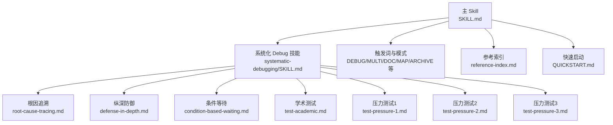
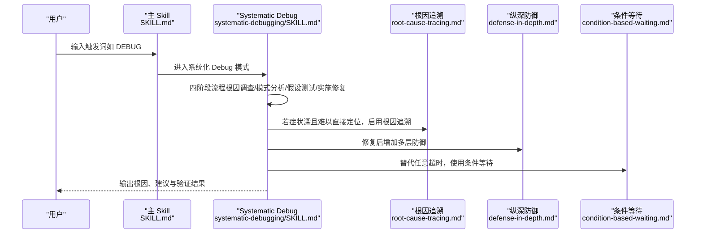
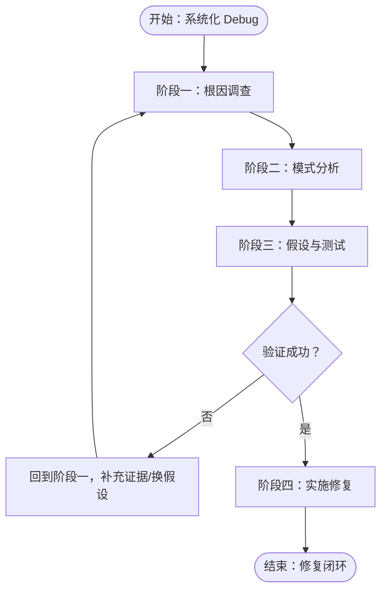
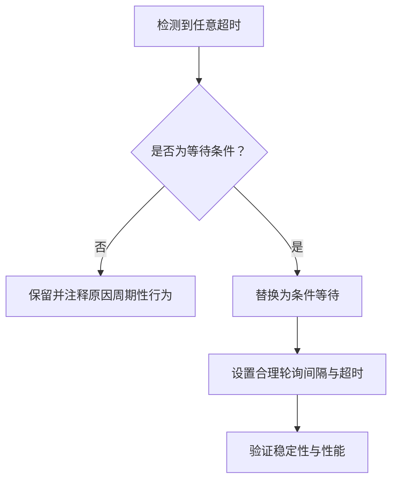
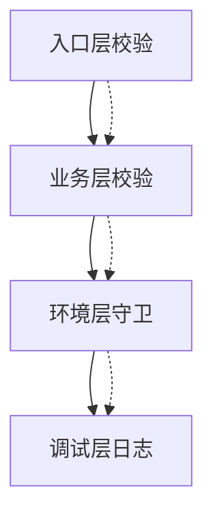
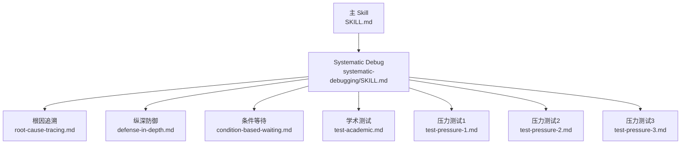

# 系统化 Debug

<cite>
**本文引用的文件**
- [reference-index.md](file://altas-workflow/reference-index.md)
- [SKILL.md](file://altas-workflow/SKILL.md)
- [QUICKSTART.md](file://altas-workflow/QUICKSTART.md)
- [systematic-debugging/SKILL.md](file://altas-workflow/references/superpowers/systematic-debugging/SKILL.md)
- [root-cause-tracing.md](file://altas-workflow/references/superpowers/systematic-debugging/root-cause-tracing.md)
- [defense-in-depth.md](file://altas-workflow/references/superpowers/systematic-debugging/defense-in-depth.md)
- [condition-based-waiting.md](file://altas-workflow/references/superpowers/systematic-debugging/condition-based-waiting.md)
- [test-academic.md](file://altas-workflow/references/superpowers/systematic-debugging/test-academic.md)
- [test-pressure-1.md](file://altas-workflow/references/superpowers/systematic-debugging/test-pressure-1.md)
- [test-pressure-2.md](file://altas-workflow/references/superpowers/systematic-debugging/test-pressure-2.md)
- [test-pressure-3.md](file://altas-workflow/references/superpowers/systematic-debugging/test-pressure-3.md)
</cite>

## 目录
1. [简介](#简介)
2. [项目结构](#项目结构)
3. [核心组件](#核心组件)
4. [架构总览](#架构总览)
5. [详细组件分析](#详细组件分析)
6. [依赖关系分析](#依赖关系分析)
7. [性能考量](#性能考量)
8. [故障排查指南](#故障排查指南)
9. [结论](#结论)
10. [附录](#附录)

## 简介
本技术文档围绕“系统化 Debug”的四阶段根因分析法展开，结合条件等待问题的诊断与处理策略、纵深防御设计原理，以及学术测试与压力测试一到三的完整实施方案，帮助开发者建立系统化的调试思维模式与实战经验。文档以 ALTAS Workflow 的“Systematic Debugging”技能为核心，辅以根因追溯、条件等待、纵深防御等专项文档，并提供真实压力场景下的决策演练，帮助在高压环境下做出正确判断。

## 项目结构
该仓库以“工作流与技能”为主，系统化 Debug 的相关内容集中在 references/superpowers/systematic-debugging 目录下，配合主 Skill 与 Quickstart 使用说明，形成“触发词 → 模式 → 子技能 → 专项文档”的渐进式披露结构。

图表来源
- [SKILL.md:220-275](file://altas-workflow/SKILL.md#L220-L275)
- [systematic-debugging/SKILL.md:280-289](file://altas-workflow/references/superpowers/systematic-debugging/SKILL.md#L280-L289)
- [reference-index.md:85-93](file://altas-workflow/reference-index.md#L85-L93)

章节来源
- [reference-index.md:1-210](file://altas-workflow/reference-index.md#L1-L210)
- [SKILL.md:1-351](file://altas-workflow/SKILL.md#L1-L351)
- [QUICKSTART.md:1-182](file://altas-workflow/QUICKSTART.md#L1-L182)

## 核心组件
- 系统化 Debug 四阶段：根因调查、模式分析、假设与测试、实施修复
- 根因追溯：从症状回溯到原始触发点，避免仅修复症状
- 纵深防御：在数据流的每一层增加校验与保护，使缺陷结构上不可复现
- 条件等待：以“实际条件”替代“任意超时”，消除竞态与抖动
- 压力测试：覆盖真实高压场景，检验过程的稳健性与可执行性

章节来源
- [systematic-debugging/SKILL.md:46-214](file://altas-workflow/references/superpowers/systematic-debugging/SKILL.md#L46-L214)
- [root-cause-tracing.md:1-170](file://altas-workflow/references/superpowers/systematic-debugging/root-cause-tracing.md#L1-L170)
- [defense-in-depth.md:1-123](file://altas-workflow/references/superpowers/systematic-debugging/defense-in-depth.md#L1-L123)
- [condition-based-waiting.md:1-116](file://altas-workflow/references/superpowers/systematic-debugging/condition-based-waiting.md#L1-L116)

## 架构总览
系统化 Debug 的“触发词 → 模式 → 子技能 → 专项文档”的架构，确保在不同复杂度与压力场景下，按需加载正确的调试手段与流程。

图表来源
- [SKILL.md:230-239](file://altas-workflow/SKILL.md#L230-L239)
- [systematic-debugging/SKILL.md:46-214](file://altas-workflow/references/superpowers/systematic-debugging/SKILL.md#L46-L214)
- [root-cause-tracing.md:1-170](file://altas-workflow/references/superpowers/systematic-debugging/root-cause-tracing.md#L1-L170)
- [defense-in-depth.md:1-123](file://altas-workflow/references/superpowers/systematic-debugging/defense-in-depth.md#L1-L123)
- [condition-based-waiting.md:1-116](file://altas-workflow/references/superpowers/systematic-debugging/condition-based-waiting.md#L1-L116)

## 详细组件分析

### 四阶段根因分析方法
- 阶段一：根因调查
  - 仔细阅读错误信息与堆栈，记录文件、行号、错误码
  - 可重现性验证：明确触发步骤、频率与环境差异
  - 近期变更审查：代码、依赖、配置、环境
  - 多组件系统证据收集：在各边界记录输入/输出、状态与环境传播
  - 深层调用链回溯：使用日志与栈追踪定位原始触发点
- 阶段二：模式分析
  - 寻找同类工作实现，对比参考实现与差异
  - 明确依赖关系：配置、环境、假设与前置条件
- 阶段三：假设与测试
  - 单一假设、最小化验证、一次一变量
  - 若首次假设失败，形成新的假设，不叠加多个修复
- 阶段四：实施修复
  - 先写失败测试，再修复，最后验证
  - 一次性修复根因，避免“顺手优化”
  - 若尝试三次以上仍未解决，应质疑架构而非继续修补

图表来源
- [systematic-debugging/SKILL.md:46-214](file://altas-workflow/references/superpowers/systematic-debugging/SKILL.md#L46-L214)

章节来源
- [systematic-debugging/SKILL.md:46-214](file://altas-workflow/references/superpowers/systematic-debugging/SKILL.md#L46-L214)

### 条件等待问题的诊断与处理
- 症状识别：测试在不同机器/负载下不稳定，存在任意超时（setTimeout/sleep/time.sleep）
- 根因定位：竞态条件、资源竞争、异步完成时机不确定
- 处理策略：
  - 以“实际条件”替代“任意超时”：等待事件发生、状态就绪、计数满足、文件出现等
  - 实现要点：轮询间隔合理（如 10ms）、带超时与清晰错误、避免陈旧数据缓存
  - 特殊场景：确需基于已知周期的行为验证时，必须注明原因与计算依据
- 价值：显著提升稳定性与并发下的通过率，减少竞态与抖动

图表来源
- [condition-based-waiting.md:9-33](file://altas-workflow/references/superpowers/systematic-debugging/condition-based-waiting.md#L9-L33)
- [condition-based-waiting.md:58-82](file://altas-workflow/references/superpowers/systematic-debugging/condition-based-waiting.md#L58-L82)

章节来源
- [condition-based-waiting.md:1-116](file://altas-workflow/references/superpowers/systematic-debugging/condition-based-waiting.md#L1-L116)

### 纵深防御策略设计原理
- 单点校验的局限：可能被不同路径绕过、重构或 mock 破坏
- 四层防护：
  - 入口层：API 边界拒绝明显无效输入
  - 业务层：针对操作语义进行合理性校验
  - 环境层：在特定上下文中阻止危险操作
  - 调试层：捕获上下文信息，便于取证
- 应用流程：定位数据流、列出所有检查点、逐层增加校验、分别测试绕过情况

图表来源
- [defense-in-depth.md:20-95](file://altas-workflow/references/superpowers/systematic-debugging/defense-in-depth.md#L20-L95)

章节来源
- [defense-in-depth.md:1-123](file://altas-workflow/references/superpowers/systematic-debugging/defense-in-depth.md#L1-L123)

### 学术测试、压力测试一到三的实施方案与用例设计

#### 学术测试（验证理解）
- 目标：基于系统化 Debug 技能回答关键问题，检验对四阶段流程与铁律的理解
- 用例设计：
  - 四阶段名称与先后顺序
  - 实施修复前必须完成的步骤
  - 假设验证失败后的正确做法
  - 对“同时修复多项”的禁止理由
  - 不完全理解时的应对策略
  - 是否允许跳过流程处理简单问题
- 评分要点：答案必须来自技能原文，体现对“先调查、后修复”的原则掌握

章节来源
- [test-academic.md:1-15](file://altas-workflow/references/superpowers/systematic-debugging/test-academic.md#L1-L15)

#### 压力测试一：紧急生产修复
- 场景：生产 API 全量失败，监控显示每分钟损失巨大，存在连接超时错误
- 选项与权衡：
  - A：严格遵循系统化流程（耗时长、成本高）
  - B：快速修复（加重试），立即止损，后续再调查
  - C：折中：快速检查近期变更，若无明显线索则加重试
- 决策要点：在“即时止损 vs. 架构安全”之间做取舍，强调“被逼无奈时的最小化调查”

章节来源
- [test-pressure-1.md:1-59](file://altas-workflow/references/superpowers/systematic-debugging/test-pressure-1.md#L1-L59)

#### 压力测试二：沉没成本与疲惫
- 场景：连续 4 小时尝试用任意超时解决异步状态不一致问题，效果不稳定
- 选项与权衡：
  - A：删除所有超时，回到阶段一重新调查
  - B：采用较长超时（5 秒）作为“够用的临时方案”，留待后续调查
  - C：快速再查 30 分钟，若无头绪则采用超时方案
- 决策要点：在“完美 vs. 足够好”之间平衡，避免“越改越错”的沉没成本

章节来源
- [test-pressure-2.md:1-69](file://altas-workflow/references/superpowers/systematic-debugging/test-pressure-2.md#L1-L69)

#### 压力测试三：权威与社交压力
- 场景：资深工程师提出“症状修复”方案，技术负责人倾向信任经验，团队希望尽快结束会议
- 选项与权衡：
  - A：坚持先调查根因，即便被质疑
  - B：随大流实施修复，私下再验证
  - C：快速查看相关文档，确认后再决定
- 决策要点：在“权威信任 vs. 过程严谨”之间坚持原则，必要时以“尽到尽调”为底线

章节来源
- [test-pressure-3.md:1-70](file://altas-workflow/references/superpowers/systematic-debugging/test-pressure-3.md#L1-L70)

## 依赖关系分析
- 主 Skill 作为入口，按需加载子技能与专项文档
- Systematic Debug 技能依赖根因追溯、纵深防御、条件等待等专项文档
- 压力测试作为“过程验证器”，用于检验在高压情境下的执行一致性

图表来源
- [SKILL.md:230-239](file://altas-workflow/SKILL.md#L230-L239)
- [systematic-debugging/SKILL.md:280-289](file://altas-workflow/references/superpowers/systematic-debugging/SKILL.md#L280-L289)

章节来源
- [SKILL.md:220-275](file://altas-workflow/SKILL.md#L220-L275)
- [systematic-debugging/SKILL.md:280-289](file://altas-workflow/references/superpowers/systematic-debugging/SKILL.md#L280-L289)

## 性能考量
- 条件等待优于任意超时：降低 CPU 空转与竞态，提高稳定性与并发通过率
- 纵深防御减少回归与补丁式修复带来的额外开销
- 系统化流程在简单问题上同样高效，避免“先修后验”的反复返工

## 故障排查指南
- 日志与证据收集
  - 记录错误、堆栈、文件路径、行号、环境变量
  - 在组件边界记录输入/输出与状态，定位断点
- 根因追溯
  - 从症状向上回溯，找到最初触发点，避免症状修复
  - 在无法手动追踪时，加入栈追踪与上下文日志
- 条件等待
  - 用“条件成立”替代“固定时间”，设置合理轮询与超时
  - 对确需周期性行为的场景，必须注明原因与计算
- 纵深防御
  - 在入口、业务、环境、调试四层增加校验与保护
  - 分别测试绕过情况，确保每层有效
- 压力场景下的决策
  - 在紧急、疲惫、权威压力下，坚持“最小调查 + 可验证修复”的原则
  - 以“够用的临时方案”为过渡，承诺后续彻底调查

章节来源
- [systematic-debugging/SKILL.md:50-214](file://altas-workflow/references/superpowers/systematic-debugging/SKILL.md#L50-L214)
- [root-cause-tracing.md:66-96](file://altas-workflow/references/superpowers/systematic-debugging/root-cause-tracing.md#L66-L96)
- [condition-based-waiting.md:84-108](file://altas-workflow/references/superpowers/systematic-debugging/condition-based-waiting.md#L84-L108)
- [defense-in-depth.md:87-123](file://altas-workflow/references/superpowers/systematic-debugging/defense-in-depth.md#L87-L123)

## 结论
系统化 Debug 的核心在于“先调查、后修复”，并通过根因追溯、条件等待与纵深防御构建稳定基线。在学术测试与压力测试中反复演练，有助于在真实高压场景下保持理性与一致性，最终实现“第一次就修对”的目标。

## 附录
- 触发词与模式：DEBUG/MULTI/DOC/MAP/ARCHIVE 等，按需加载对应参考
- 快速启动：了解命令、典型场景与常见问题，便于快速落地

章节来源
- [SKILL.md:220-275](file://altas-workflow/SKILL.md#L220-L275)
- [QUICKSTART.md:36-116](file://altas-workflow/QUICKSTART.md#L36-L116)