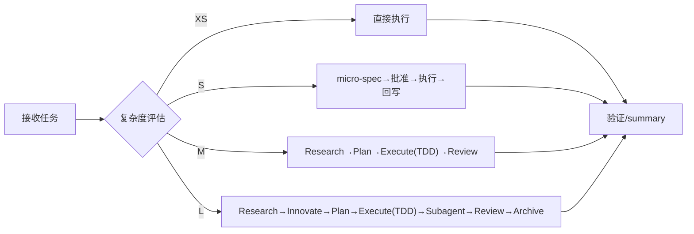
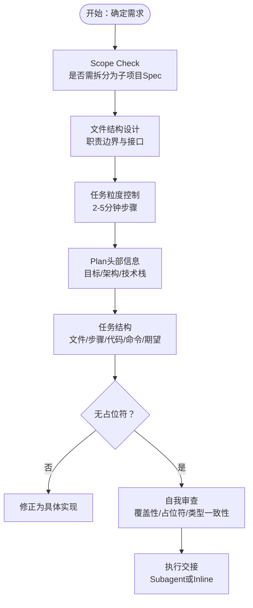
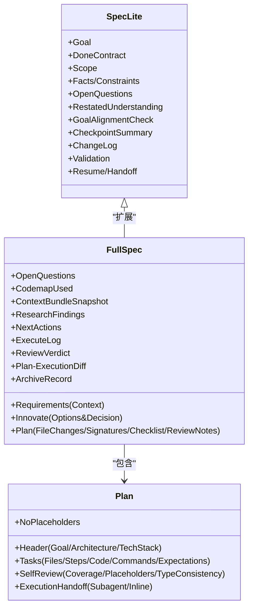
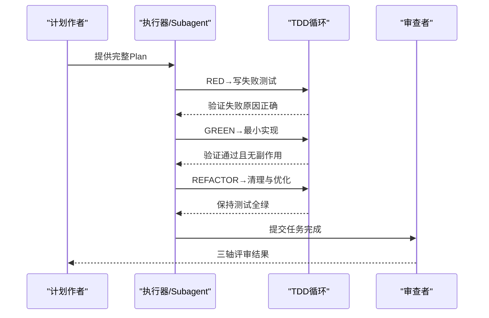
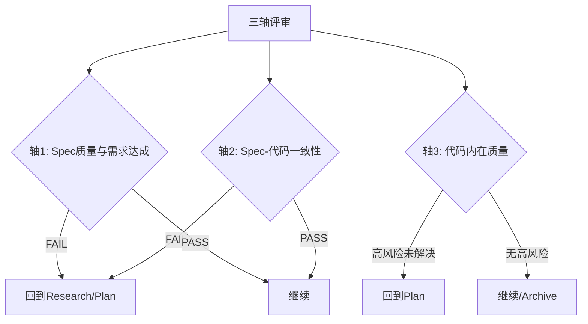
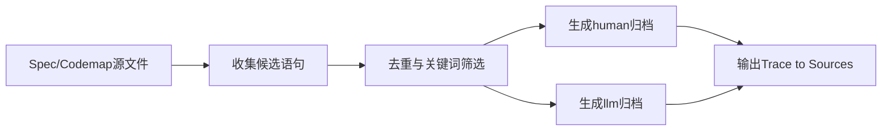
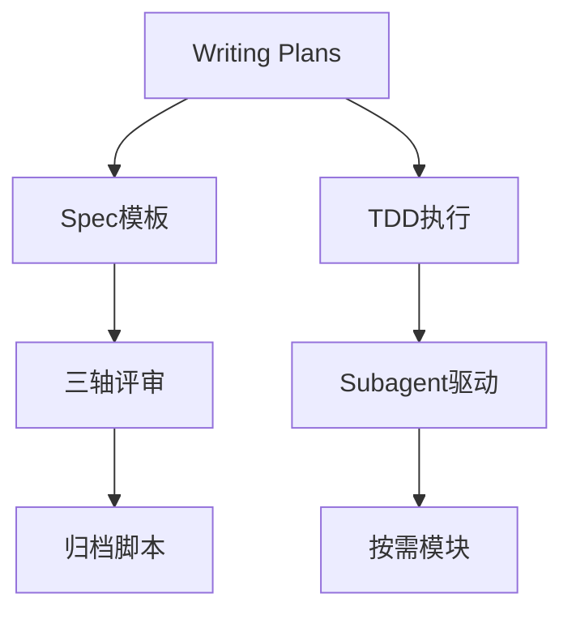

# 计划写作最佳实践

<cite>
**本文引用的文件**
- [altas-workflow/SKILL.md](file://altas-workflow/SKILL.md)
- [altas-workflow/QUICKSTART.md](file://altas-workflow/QUICKSTART.md)
- [altas-workflow/reference-index.md](file://altas-workflow/reference-index.md)
- [altas-workflow/workflow-diagrams.md](file://altas-workflow/workflow-diagrams.md)
- [altas-workflow/protocols/RIPER-DOC.md](file://altas-workflow/protocols/RIPER-DOC.md)
- [altas-workflow/references/superpowers/writing-plans/SKILL.md](file://altas-workflow/references/superpowers/writing-plans/SKILL.md)
- [altas-workflow/references/superpowers/writing-plans/plan-document-reviewer-prompt.md](file://altas-workflow/references/superpowers/writing-plans/plan-document-reviewer-prompt.md)
- [altas-workflow/references/spec-driven-development/spec-template.md](file://altas-workflow/references/spec-driven-development/spec-template.md)
- [altas-workflow/references/checkpoint-driven/spec-lite-template.md](file://altas-workflow/references/checkpoint-driven/spec-lite-template.md)
- [altas-workflow/references/superpowers/test-driven-development/SKILL.md](file://altas-workflow/references/superpowers/test-driven-development/SKILL.md)
- [altas-workflow/references/checkpoint-driven/modules.md](file://altas-workflow/references/checkpoint-driven/modules.md)
- [altas-workflow/references/superpowers/systematic-debugging/SKILL.md](file://altas-workflow/references/superpowers/systematic-debugging/SKILL.md)
- [altas-workflow/references/superpowers/subagent-driven-development/SKILL.md](file://altas-workflow/references/superpowers/subagent-driven-development/SKILL.md)
- [altas-workflow/scripts/archive_builder.py](file://altas-workflow/scripts/archive_builder.py)
</cite>

## 目录
1. [简介](#简介)
2. [项目结构](#项目结构)
3. [核心组件](#核心组件)
4. [架构总览](#架构总览)
5. [详细组件分析](#详细组件分析)
6. [依赖关系分析](#依赖关系分析)
7. [性能考量](#性能考量)
8. [故障排除指南](#故障排除指南)
9. [结论](#结论)
10. [附录](#附录)

## 简介
本文件面向计划写作的最佳实践，围绕 ALTAS Workflow 的 Plan 文档结构设计与内容组织原则，系统阐述目标设定、任务分解、时间安排与资源配置；给出 WBS 工作分解结构、依赖关系分析与优先级排序技巧；总结计划审查流程的逻辑一致性检查、可行性评估与风险识别方法；提供 Plan 模板设计与标准化格式规范；并涵盖计划执行监控、进度跟踪与变更管理方法，以及团队编写指南与评审标准。

## 项目结构
该仓库以“工作流技能 + 参考资料 + 协议 + 脚本”的方式组织，核心在于通过 Skill 文件统一入口，按需加载各阶段参考文档，形成可复用、可审计的工作流闭环。

```mermaid
graph TB
subgraph "工作流技能"
SKILL["altas-workflow/SKILL.md<br/>主工作流技能"]
QS["altas-workflow/QUICKSTART.md<br/>快速启动"]
RI["altas-workflow/reference-index.md<br/>参考资料索引"]
WD["altas-workflow/workflow-diagrams.md<br/>流程图集"]
end
subgraph "计划与规范"
PLAN_SKILL["references/superpowers/writing-plans/SKILL.md<br/>Plan写作技能"]
PLAN_REV["references/superpowers/writing-plans/plan-document-reviewer-prompt.md<br/>Plan评审模板"]
SPEC_TPL["references/spec-driven-development/spec-template.md<br/>Spec模板"]
SPEC_LITE["references/checkpoint-driven/spec-lite-template.md<br/>轻量Spec模板"]
end
subgraph "执行与审查"
TDD["references/superpowers/test-driven-development/SKILL.md<br/>TDD执行"]
DEBUG["references/superpowers/systematic-debugging/SKILL.md<br/>系统化Debug"]
SUB["references/superpowers/subagent-driven-development/SKILL.md<br/>Subagent驱动"]
MOD["references/checkpoint-driven/modules.md<br/>按需模块"]
end
subgraph "协议与工具"
DOC["protocols/RIPER-DOC.md<br/>文档专家协议"]
ARCH["scripts/archive_builder.py<br/>知识沉淀脚本"]
end
SKILL --> PLAN_SKILL
SKILL --> SPEC_TPL
SKILL --> SPEC_LITE
SKILL --> TDD
SKILL --> DEBUG
SKILL --> SUB
SKILL --> MOD
SKILL --> DOC
SKILL --> ARCH
RI --> PLAN_SKILL
RI --> SPEC_TPL
RI --> SPEC_LITE
RI --> TDD
RI --> DEBUG
RI --> SUB
RI --> MOD
RI --> DOC
RI --> ARCH
```

图表来源
- [altas-workflow/SKILL.md:1-351](file://altas-workflow/SKILL.md#L1-L351)
- [altas-workflow/reference-index.md:1-210](file://altas-workflow/reference-index.md#L1-L210)

章节来源
- [altas-workflow/SKILL.md:1-351](file://altas-workflow/SKILL.md#L1-L351)
- [altas-workflow/QUICKSTART.md:1-182](file://altas-workflow/QUICKSTART.md#L1-L182)
- [altas-workflow/reference-index.md:1-210](file://altas-workflow/reference-index.md#L1-L210)

## 核心组件
- 规模评估与工作流深度：根据任务复杂度自动选择 XS/S/M/L 四档深度，配套差异化产出与检查点策略。
- 规划阶段（Plan）：将需求转化为可执行的原子任务清单，明确文件变更、签名与验收契约。
- 执行阶段（Execute）：遵循 TDD 铁律，逐步或批量执行，配合 Subagent 并行与两阶段审查。
- 审查阶段（Review）：三轴评审（Spec质量、Spec-代码一致性、代码内在质量），门禁逻辑确保闭环。
- 归档沉淀（Archive）：双视角输出（human/llm），附“Trace to Sources”。

章节来源
- [altas-workflow/SKILL.md:47-102](file://altas-workflow/SKILL.md#L47-L102)
- [altas-workflow/SKILL.md:167-218](file://altas-workflow/SKILL.md#L167-L218)
- [altas-workflow/SKILL.md:194-218](file://altas-workflow/SKILL.md#L194-L218)

## 架构总览
整体工作流以“输入准备 → 研究对齐 → 方案对比 → 详细规划 → 执行实现 → 审查 → 归档”为主线，不同规模采用差异化策略，贯穿证据优先与门禁约束。

图表来源
- [altas-workflow/workflow-diagrams.md:47-67](file://altas-workflow/workflow-diagrams.md#L47-L67)
- [altas-workflow/SKILL.md:138-218](file://altas-workflow/SKILL.md#L138-L218)

## 详细组件分析

### 计划写作技能（Writing Plans）
- 目标：将多步骤需求转化为可执行的 Plan，确保每个任务可被工程师独立完成。
- 关键原则：DRY、YAGNI、TDD、频繁提交；任务粒度控制在 2-5 分钟内可完成的步骤。
- 文件结构：先定义文件变更边界，再拆分子任务；任务结构包含文件清单、步骤、代码片段、命令与期望输出。
- 无占位符：严禁“TBD/TODO/稍后实现/填充细节”等模糊表述，必须提供可执行的具体内容。
- 自我审查：覆盖性、占位符扫描、类型一致性检查；必要时补充任务或修正不一致项。
- 执行交接：保存 Plan 后提供两种执行选项（Subagent 驱动或 Inline 执行），并明确所需子技能。

图表来源
- [altas-workflow/references/superpowers/writing-plans/SKILL.md:1-153](file://altas-workflow/references/superpowers/writing-plans/SKILL.md#L1-L153)

章节来源
- [altas-workflow/references/superpowers/writing-plans/SKILL.md:1-153](file://altas-workflow/references/superpowers/writing-plans/SKILL.md#L1-L153)

### 计划评审模板（Plan Document Reviewer Prompt）
- 评审目的：验证 Plan 的完整性、与 Spec 的匹配度与任务分解的可执行性。
- 评审维度：完整性（占位符、遗漏步骤）、Spec 对齐（需求覆盖、范围蔓延）、任务边界（可操作性）、可构建性（工程师能否按计划推进）。
- 校准原则：仅标记会对实施造成真实阻碍的问题；轻微措辞与“可选建议”不构成阻断。
- 输出格式：状态（Approved/Issues Found）、问题清单（Task/Step + 问题 + 影响）、建议（可选）。

章节来源
- [altas-workflow/references/superpowers/writing-plans/plan-document-reviewer-prompt.md:1-50](file://altas-workflow/references/superpowers/writing-plans/plan-document-reviewer-prompt.md#L1-L50)

### 规划阶段（Plan）与 Spec 模板
- Plan 与 Spec 的关系：Plan 是 Spec 的可执行子集，Plan 的文件变更、签名与验收契约必须与 Spec 保持一致。
- 规模差异：
  - S 规模：使用轻量 Spec 模板，强调 Done Contract、Restated Understanding、Checkpoint Summary、Validation 与 Resume/Handoff。
  - M/L 规模：使用完整 Spec 模板，包含 Innovate、Plan（文件变更/签名/Checklist/评审意见）、Execute Log、Review Verdict、Archive Record 等。
- 多项目支持：按项目分组列出文件变更、签名与契约接口，明确 Provider/Consumer 顺序与跨项目一致性检查。

图表来源
- [altas-workflow/references/checkpoint-driven/spec-lite-template.md:1-85](file://altas-workflow/references/checkpoint-driven/spec-lite-template.md#L1-L85)
- [altas-workflow/references/spec-driven-development/spec-template.md:1-297](file://altas-workflow/references/spec-driven-development/spec-template.md#L1-L297)
- [altas-workflow/references/superpowers/writing-plans/SKILL.md:45-153](file://altas-workflow/references/superpowers/writing-plans/SKILL.md#L45-L153)

章节来源
- [altas-workflow/references/checkpoint-driven/spec-lite-template.md:1-85](file://altas-workflow/references/checkpoint-driven/spec-lite-template.md#L1-L85)
- [altas-workflow/references/spec-driven-development/spec-template.md:1-297](file://altas-workflow/references/spec-driven-development/spec-template.md#L1-L297)

### 执行阶段（Execute）与 TDD 铁律
- TDD 循环：RED（写失败测试）→ GREEN（最小实现通过）→ REFACTOR（重构优化）→ 下一测试。
- 铁律约束：无失败测试不写生产代码；测试通过后才允许重构；测试失败原因必须是“缺少功能而非拼写错误”。
- 执行纪律：逐步执行（1 个 Checklist 项 → 检查点）；批量执行需明确“全部/execute all”；编译错误可自动修复，逻辑变更必须回到 Plan。

图表来源
- [altas-workflow/references/superpowers/test-driven-development/SKILL.md:47-197](file://altas-workflow/references/superpowers/test-driven-development/SKILL.md#L47-L197)
- [altas-workflow/SKILL.md:176-192](file://altas-workflow/SKILL.md#L176-L192)

章节来源
- [altas-workflow/references/superpowers/test-driven-development/SKILL.md:1-372](file://altas-workflow/references/superpowers/test-driven-development/SKILL.md#L1-L372)
- [altas-workflow/SKILL.md:176-192](file://altas-workflow/SKILL.md#L176-L192)

### 审查阶段（Review）与三轴评审
- 三轴评审：
  - 轴1：Spec 质量与需求达成（Goal/In-Scope/Acceptance 完整性与达成度）
  - 轴2：Spec-代码一致性（文件/签名/Checklist/行为与 Plan 一致）
  - 轴3：代码内在质量（正确性、鲁棒性、可维护性、测试、关键风险）
- 门禁逻辑：轴1/轴2 FAIL → 回到 Research/Plan；轴3高风险未解决 → 回到 Plan；全部 PASS → Archive 或完成。

图表来源
- [altas-workflow/SKILL.md:194-209](file://altas-workflow/SKILL.md#L194-L209)

章节来源
- [altas-workflow/SKILL.md:194-209](file://altas-workflow/SKILL.md#L194-L209)

### 归档沉淀（Archive）与双视角输出
- 双视角：human 版（汇报视角）+ llm 版（后续开发参考视角），每个结论附“Trace to Sources”。
- 自动化：通过脚本批量抽取候选语句，按主题/快照模式生成归档文档。
- 产物命名：统一时间前缀 + 主题 + 人类/LLM 角色标识。

图表来源
- [altas-workflow/scripts/archive_builder.py:227-443](file://altas-workflow/scripts/archive_builder.py#L227-L443)

章节来源
- [altas-workflow/scripts/archive_builder.py:1-505](file://altas-workflow/scripts/archive_builder.py#L1-L505)
- [altas-workflow/SKILL.md:210-218](file://altas-workflow/SKILL.md#L210-L218)

### 任务拆解技巧：WBS、依赖关系与优先级
- WBS 工作分解结构：以“文件变更 + 签名 + 验收契约”为最小单元，确保任务可独立验证。
- 依赖关系分析：多项目场景按 Provider/Consumer 顺序拆分；跨项目接口契约明确迁移计划与破坏性变更。
- 优先级排序：按风险与价值排序，高风险/高影响任务优先；TDD 循环中先处理最易失败的测试，快速暴露问题。

章节来源
- [altas-workflow/references/spec-driven-development/spec-template.md:189-230](file://altas-workflow/references/spec-driven-development/spec-template.md#L189-L230)
- [altas-workflow/references/superpowers/writing-plans/SKILL.md:36-44](file://altas-workflow/references/superpowers/writing-plans/SKILL.md#L36-L44)

### 计划审查流程设计要素
- 逻辑一致性检查：Plan 与 Spec 的一致性矩阵；类型与签名一致性；任务边界清晰度。
- 可行性评估：任务粒度是否可执行；是否满足 TDD 铁律；是否存在不可验证的步骤。
- 风险识别：跨项目契约风险、回归风险、多模型协作风险；高风险未解决不得进入下一阶段。

章节来源
- [altas-workflow/references/superpowers/writing-plans/plan-document-reviewer-prompt.md:18-34](file://altas-workflow/references/superpowers/writing-plans/plan-document-reviewer-prompt.md#L18-L34)
- [altas-workflow/SKILL.md:90-102](file://altas-workflow/SKILL.md#L90-L102)

### 计划模板设计与标准化格式规范
- Plan 头部：Feature 名称、目标、架构、技术栈、子技能要求与任务清单格式。
- 任务结构：文件清单、步骤编号、代码片段、命令与期望输出；每步必须可验证。
- 无占位符：严禁模糊表述；每个步骤必须包含可执行的具体内容。
- 自我审查清单：覆盖性、占位符扫描、类型一致性；必要时补充或修正。

章节来源
- [altas-workflow/references/superpowers/writing-plans/SKILL.md:45-153](file://altas-workflow/references/superpowers/writing-plans/SKILL.md#L45-L153)

### 计划执行监控、进度跟踪与变更管理
- 执行监控：逐步执行 + 检查点；批量执行需明确指令；编译错误自动修复，逻辑变更回退到 Plan。
- 进度跟踪：XS/S 使用短检查点；M/L 使用完整检查点模板；每个阶段完成后等待批准。
- 变更管理：偏差暴露 → 先更新 Spec → 再修代码 → 重对齐核心目标；执行中发现复杂度超出预期 → 立即暂停，提议升级。

章节来源
- [altas-workflow/SKILL.md:105-135](file://altas-workflow/SKILL.md#L105-L135)
- [altas-workflow/SKILL.md:185-190](file://altas-workflow/SKILL.md#L185-L190)

### 团队编写指南与评审标准
- 编写指南：先定义文件边界，再拆分子任务；任务粒度控制在 2-5 分钟；每个步骤提供代码与命令；无占位符。
- 评审标准：完整性、Spec 对齐、任务可执行性；仅标记会对实施造成真实阻碍的问题；轻微措辞不阻断。
- 评审工具：Plan 文档评审子代理模板；三轴评审矩阵；变更回溯与差异分析。

章节来源
- [altas-workflow/references/superpowers/writing-plans/SKILL.md:116-153](file://altas-workflow/references/superpowers/writing-plans/SKILL.md#L116-L153)
- [altas-workflow/references/superpowers/writing-plans/plan-document-reviewer-prompt.md:18-47](file://altas-workflow/references/superpowers/writing-plans/plan-document-reviewer-prompt.md#L18-L47)
- [altas-workflow/SKILL.md:194-209](file://altas-workflow/SKILL.md#L194-L209)

## 依赖关系分析
- 模块耦合：Plan 写作技能依赖 Spec 模板与 TDD 执行技能；执行阶段依赖 Subagent 驱动与按需模块；审查阶段依赖三轴评审与归档脚本。
- 外部依赖：测试框架（npm test/pytest/go test）；归档脚本依赖 Python 与正则解析。
- 潜在循环：工作流为线性闭环，不存在循环依赖；按需模块仅在命中场景加载，避免常驻资源占用。

图表来源
- [altas-workflow/reference-index.md:16-81](file://altas-workflow/reference-index.md#L16-L81)
- [altas-workflow/SKILL.md:138-218](file://altas-workflow/SKILL.md#L138-L218)

章节来源
- [altas-workflow/reference-index.md:1-210](file://altas-workflow/reference-index.md#L1-L210)
- [altas-workflow/SKILL.md:138-218](file://altas-workflow/SKILL.md#L138-L218)

## 性能考量
- 按需加载：仅在命中场景加载对应参考文件，减少 token 消耗与上下文污染。
- 执行效率：Subagent 驱动 + 两阶段审查，缩短等待时间；批量执行需谨慎，优先保证质量。
- 归档效率：脚本自动抽取候选语句，按主题/快照模式生成归档，降低人工成本。

## 故障排除指南
- 常见问题：
  - AI 一次性输出过多代码：严格检查点机制，要求每次只推进一步。
  - TDD 铁律引发的“慢”：证据优先与失败测试是质量保障，XS/S 可用 `>>` 跳过 TDD。
  - 计划无法执行：检查占位符、类型一致性与任务边界；必要时回退到 Plan。
- 调试模式：系统化 Debug 四阶段（根因调查/模式分析/假设与测试/实现）；无根因不修复。
- 多项目协作：声明 active_project 与变更范围；跨项目记录接口契约与依赖顺序。

章节来源
- [altas-workflow/QUICKSTART.md:119-152](file://altas-workflow/QUICKSTART.md#L119-L152)
- [altas-workflow/references/superpowers/systematic-debugging/SKILL.md:46-232](file://altas-workflow/references/superpowers/systematic-debugging/SKILL.md#L46-L232)
- [altas-workflow/references/checkpoint-driven/modules.md:45-57](file://altas-workflow/references/checkpoint-driven/modules.md#L45-L57)

## 结论
通过将 Plan 文档结构化、规范化与可审计化，结合 TDD 铁律、三轴评审与双视角归档，团队可在不同规模的任务中实现高质量交付与持续改进。建议在实践中坚持“证据优先、门禁约束、按需加载、两阶段审查”的原则，确保计划可执行、可验证、可沉淀。

## 附录
- 文档专家协议（DOC 模式）：Absorb→Outline→Author→Fact-Check 四阶段，确保文档准确性与可验证性。
- 触发词与模式映射：FAST/DEEP/MAP/MULTI/DEBUG/REVIEW/ARCHIVE/DOC 等触发词对应不同工作流模式。

章节来源
- [altas-workflow/protocols/RIPER-DOC.md:1-66](file://altas-workflow/protocols/RIPER-DOC.md#L1-L66)
- [altas-workflow/workflow-diagrams.md:261-287](file://altas-workflow/workflow-diagrams.md#L261-L287)