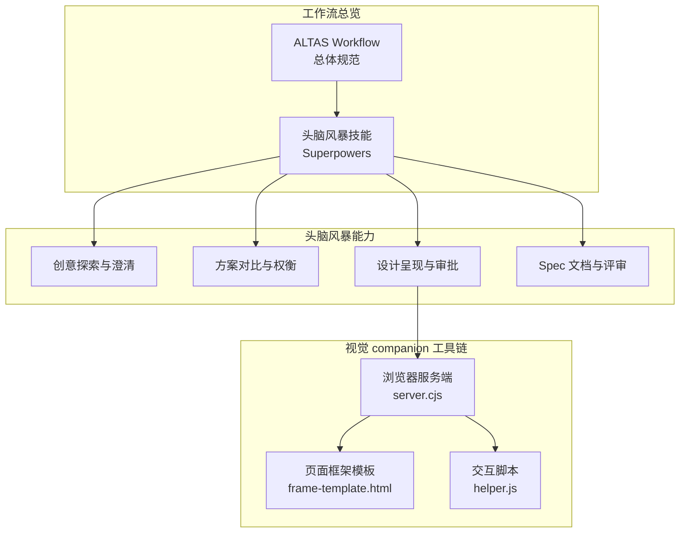
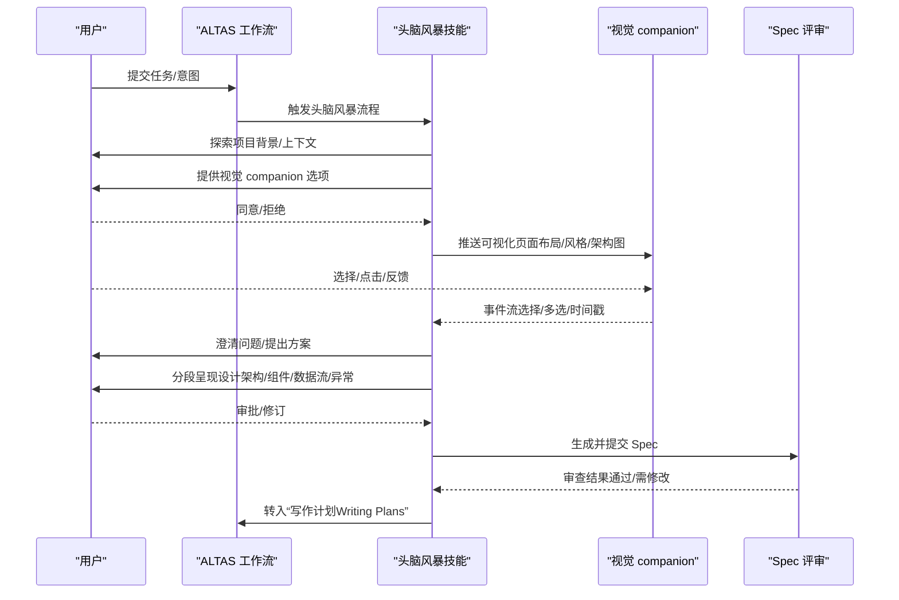
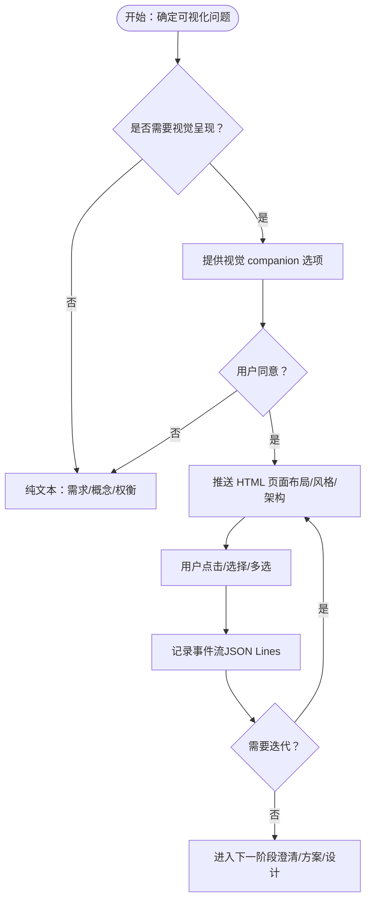
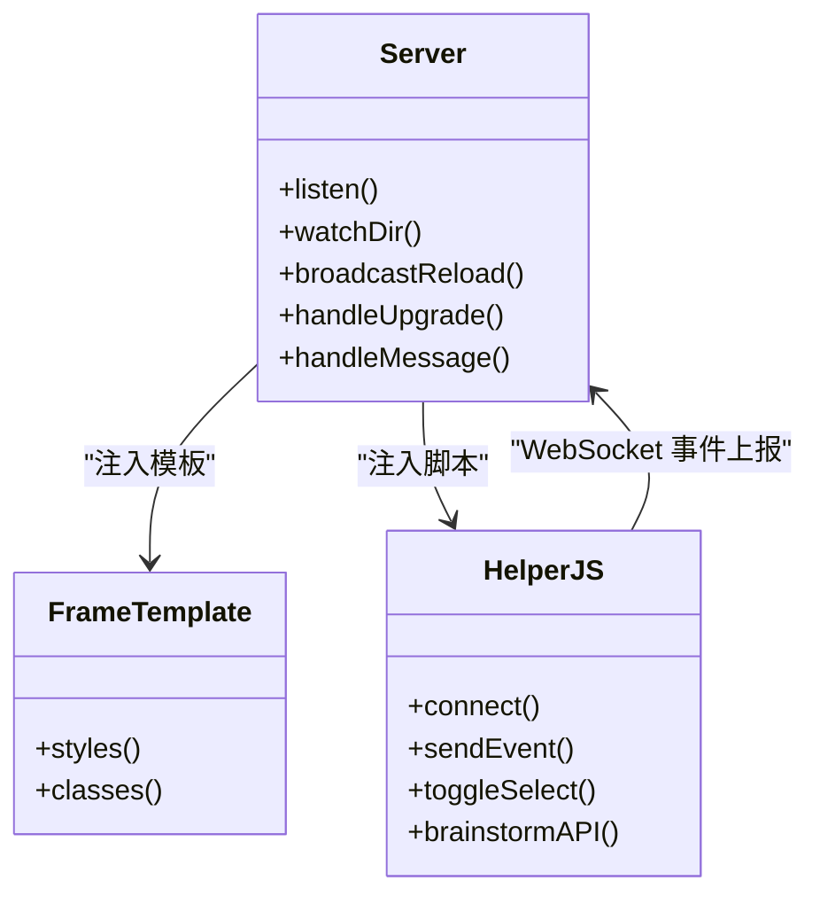
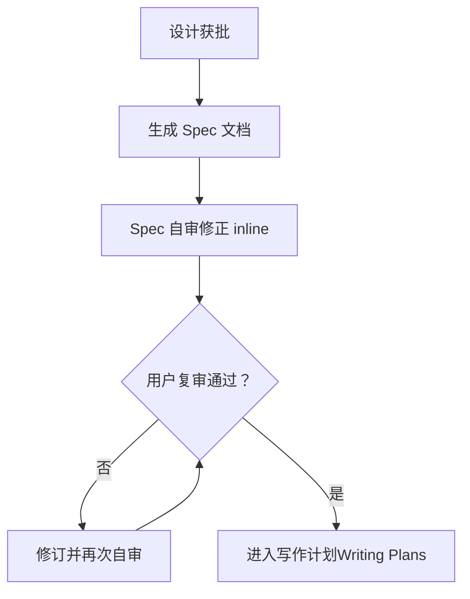
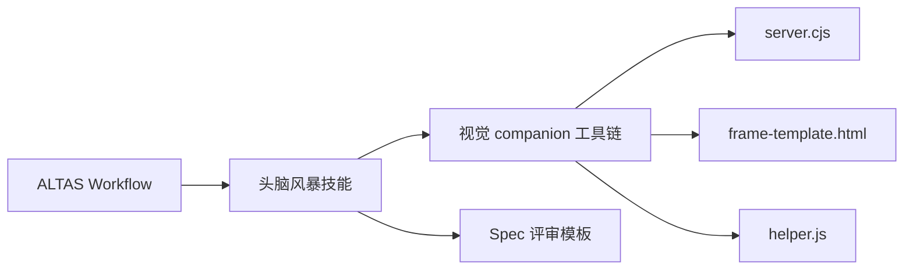

# 设计头脑风暴

<cite>
**本文引用的文件**
- [altas-workflow/SKILL.md](file://altas-workflow/SKILL.md)
- [altas-workflow/QUICKSTART.md](file://altas-workflow/QUICKSTART.md)
- [altas-workflow/references/superpowers/brainstorming/SKILL.md](file://altas-workflow/references/superpowers/brainstorming/SKILL.md)
- [altas-workflow/references/superpowers/brainstorming/visual-companion.md](file://altas-workflow/references/superpowers/brainstorming/visual-companion.md)
- [altas-workflow/references/superpowers/brainstorming/spec-document-reviewer-prompt.md](file://altas-workflow/references/superpowers/brainstorming/spec-document-reviewer-prompt.md)
- [altas-workflow/references/superpowers/brainstorming/scripts/frame-template.html](file://altas-workflow/references/superpowers/brainstorming/scripts/frame-template.html)
- [altas-workflow/references/superpowers/brainstorming/scripts/helper.js](file://altas-workflow/references/superpowers/brainstorming/scripts/helper.js)
- [altas-workflow/references/superpowers/brainstorming/scripts/server.cjs](file://altas-workflow/references/superpowers/brainstorming/scripts/server.cjs)
</cite>

## 目录
1. [简介](#简介)
2. [项目结构](#项目结构)
3. [核心组件](#核心组件)
4. [架构总览](#架构总览)
5. [详细组件分析](#详细组件分析)
6. [依赖关系分析](#依赖关系分析)
7. [性能考量](#性能考量)
8. [故障排除指南](#故障排除指南)
9. [结论](#结论)
10. [附录](#附录)

## 简介
本文件围绕“设计头脑风暴”主题，系统化梳理并输出一套可复用、可落地的方法论与工具链，覆盖方案对比与选择（SWOT、成本效益、风险矩阵）、视觉设计辅助（图表生成、原型设计、交互演示）、Spec 审查流程、头脑风暴组织与协作、视觉 companion 工具使用与自定义模板、评审与迭代策略等。该体系以 ALTAS Workflow 为总体框架，将“头脑风暴”作为“创新设计”的关键阶段，贯穿于 Spec-Driven Development 的 Innovate 阶段，确保创意可验证、可落地、可沉淀。

## 项目结构
本仓库将“设计头脑风暴”作为 Superpowers 子能力之一，配套完整的技能说明、视觉 companion 工具链与评审模板，形成从创意到设计再到实现的闭环。

**图示来源**
- [altas-workflow/SKILL.md:165-165](file://altas-workflow/SKILL.md#L165-L165)
- [altas-workflow/references/superpowers/brainstorming/SKILL.md:34-66](file://altas-workflow/references/superpowers/brainstorming/SKILL.md#L34-L66)
- [altas-workflow/references/superpowers/brainstorming/scripts/server.cjs:1-355](file://altas-workflow/references/superpowers/brainstorming/scripts/server.cjs#L1-L355)
- [altas-workflow/references/superpowers/brainstorming/scripts/frame-template.html:1-215](file://altas-workflow/references/superpowers/brainstorming/scripts/frame-template.html#L1-L215)
- [altas-workflow/references/superpowers/brainstorming/scripts/helper.js:1-89](file://altas-workflow/references/superpowers/brainstorming/scripts/helper.js#L1-L89)

**章节来源**
- [altas-workflow/SKILL.md:165-165](file://altas-workflow/SKILL.md#L165-L165)
- [altas-workflow/QUICKSTART.md:1-182](file://altas-workflow/QUICKSTART.md#L1-L182)

## 核心组件
- 头脑风暴技能（Superpowers）：定义从“理解需求—澄清边界—提出方案—设计呈现—Spec 审查—转入实现”的标准化流程，强调“先设计、后实现”，并提供可视化 companion 辅助。
- 视觉 companion 工具链：基于本地 HTTP/WebSocket 服务，动态推送 HTML 页面，支持选项选择、事件上报、多选与交互反馈，便于 UI/UX 方案的可视化比对与快速迭代。
- Spec 文档评审模板：提供评审维度清单（完整性、一致性、清晰度、范围、YAGNI），指导子代理或人工评审，确保设计可实施、可验证、可归档。

**章节来源**
- [altas-workflow/references/superpowers/brainstorming/SKILL.md:20-33](file://altas-workflow/references/superpowers/brainstorming/SKILL.md#L20-L33)
- [altas-workflow/references/superpowers/brainstorming/visual-companion.md:27-127](file://altas-workflow/references/superpowers/brainstorming/visual-companion.md#L27-L127)
- [altas-workflow/references/superpowers/brainstorming/spec-document-reviewer-prompt.md:10-49](file://altas-workflow/references/superpowers/brainstorming/spec-document-reviewer-prompt.md#L10-L49)

## 架构总览
下图展示“头脑风暴”在 ALTAS Workflow 中的位置与关键交互：从“创意探索”到“可视化呈现”，再到“Spec 审查与批准”，最终进入“写作计划（Plan）”阶段。

**图示来源**
- [altas-workflow/SKILL.md:159-165](file://altas-workflow/SKILL.md#L159-L165)
- [altas-workflow/references/superpowers/brainstorming/SKILL.md:34-66](file://altas-workflow/references/superpowers/brainstorming/SKILL.md#L34-L66)
- [altas-workflow/references/superpowers/brainstorming/visual-companion.md:94-127](file://altas-workflow/references/superpowers/brainstorming/visual-companion.md#L94-L127)
- [altas-workflow/references/superpowers/brainstorming/spec-document-reviewer-prompt.md:10-49](file://altas-workflow/references/superpowers/brainstorming/spec-document-reviewer-prompt.md#L10-L49)

## 详细组件分析

### 方法论：方案对比与选择
- SWOT 分析：针对每个备选方案，从优势（Strengths）、劣势（Weaknesses）、机会（Opportunities）、威胁（Threats）四个维度展开，结合团队资源、技术栈、用户画像与竞品态势，量化影响权重。
- 成本效益评估：以“功能点/故事点”估算开发成本，“用户价值/业务收益”量化收益，计算 ROI；对低价值高成本方案直接淘汰。
- 风险矩阵：以“发生概率×影响程度”构建二维矩阵，区分高风险高优先级、高风险低优先级、低风险高优先级等象限，指导取舍与缓解策略。
- 决策工具清单：建议在头脑风暴中固定使用“决策矩阵表/打分卡/投票法/成本-收益曲线/蒙特卡洛模拟（简易）”。

上述方法论为“头脑风暴技能”中“提出 2-3 种方案并给出权衡与推荐”的环节提供支撑，确保讨论聚焦、可量化、可追踪。

**章节来源**
- [altas-workflow/references/superpowers/brainstorming/SKILL.md:80-85](file://altas-workflow/references/superpowers/brainstorming/SKILL.md#L80-L85)

### 视觉设计辅助技术
- 图表生成：利用 companion 生成系统架构图、数据流图、实体关系图、状态机图等，便于跨角色对齐。
- 原型设计：通过 wireframe/卡片布局对比，快速验证布局、导航、信息层级与交互路径。
- 交互演示：借助多选、点击反馈与事件流，记录用户偏好与犹豫点，形成“选择轨迹”用于后续访谈与优化。

**图示来源**
- [altas-workflow/references/superpowers/brainstorming/SKILL.md:147-165](file://altas-workflow/references/superpowers/brainstorming/SKILL.md#L147-L165)
- [altas-workflow/references/superpowers/brainstorming/visual-companion.md:27-127](file://altas-workflow/references/superpowers/brainstorming/visual-companion.md#L27-L127)

**章节来源**
- [altas-workflow/references/superpowers/brainstorming/visual-companion.md:5-26](file://altas-workflow/references/superpowers/brainstorming/visual-companion.md#L5-L26)
- [altas-workflow/references/superpowers/brainstorming/visual-companion.md:128-288](file://altas-workflow/references/superpowers/brainstorming/visual-companion.md#L128-L288)

### 视觉 companion 工具链详解
- 服务端（server.cjs）：提供 HTTP 服务与 WebSocket 协议，监听 content 目录变化，动态推送最新 HTML；记录用户事件到 state 目录；空闲超时自动退出；支持 owner 进程存活检测。
- 页面框架（frame-template.html）：提供暗/亮主题、响应式布局、选项卡/卡片/分割视图等 CSS 类，简化页面编写。
- 交互脚本（helper.js）：建立 WebSocket 连接，捕获点击事件，发送选择事件；更新顶部指示条显示当前选择；提供 API 供显式上报。

**图示来源**
- [altas-workflow/references/superpowers/brainstorming/scripts/server.cjs:129-161](file://altas-workflow/references/superpowers/brainstorming/scripts/server.cjs#L129-L161)
- [altas-workflow/references/superpowers/brainstorming/scripts/frame-template.html:1-215](file://altas-workflow/references/superpowers/brainstorming/scripts/frame-template.html#L1-L215)
- [altas-workflow/references/superpowers/brainstorming/scripts/helper.js:1-89](file://altas-workflow/references/superpowers/brainstorming/scripts/helper.js#L1-L89)

**章节来源**
- [altas-workflow/references/superpowers/brainstorming/scripts/server.cjs:1-355](file://altas-workflow/references/superpowers/brainstorming/scripts/server.cjs#L1-L355)
- [altas-workflow/references/superpowers/brainstorming/scripts/frame-template.html:1-215](file://altas-workflow/references/superpowers/brainstorming/scripts/frame-template.html#L1-L215)
- [altas-workflow/references/superpowers/brainstorming/scripts/helper.js:1-89](file://altas-workflow/references/superpowers/brainstorming/scripts/helper.js#L1-L89)

### 设计 Spec 审查流程
- 审查维度：完整性（占位符/未完成）、一致性（冲突/矛盾）、清晰度（歧义/二义性）、范围（是否可由单一 Plan 实施）、YAGNI（未请求的功能/过度设计）。
- 审查节奏：设计经用户审批后，生成 Spec 文档；随后进行“Spec 自审”（修正 inline）与“用户复审”；通过后方可进入“写作计划（Writing Plans）”。

**图示来源**
- [altas-workflow/references/superpowers/brainstorming/SKILL.md:107-137](file://altas-workflow/references/superpowers/brainstorming/SKILL.md#L107-L137)
- [altas-workflow/references/superpowers/brainstorming/spec-document-reviewer-prompt.md:10-49](file://altas-workflow/references/superpowers/brainstorming/spec-document-reviewer-prompt.md#L10-L49)

**章节来源**
- [altas-workflow/references/superpowers/brainstorming/SKILL.md:116-132](file://altas-workflow/references/superpowers/brainstorming/SKILL.md#L116-L132)
- [altas-workflow/references/superpowers/brainstorming/spec-document-reviewer-prompt.md:17-47](file://altas-workflow/references/superpowers/brainstorming/spec-document-reviewer-prompt.md#L17-L47)

### 头脑风暴组织与协作
- 组织技巧：设定“一次一个问题”的节奏，避免信息过载；优先使用多项选择题，便于快速收敛；对大型任务进行子项目分解，逐个 Spec 化。
- 创意激发：鼓励“反向思考”（从失败案例出发）、“极端场景”（极限用户/边界条件）、“跨界借鉴”（其他领域优秀实践）。
- 团队协作：以 Spec 为“唯一真相源”，每次讨论后将结论落盘；评审由核心开发者把控 Plan 阶段入口，避免重复返工。

**章节来源**
- [altas-workflow/references/superpowers/brainstorming/SKILL.md:138-146](file://altas-workflow/references/superpowers/brainstorming/SKILL.md#L138-L146)
- [altas-workflow/SKILL.md:278-351](file://altas-workflow/SKILL.md#L278-L351)

### 视觉 companion 使用指南与自定义模板
- 使用步骤：启动服务器并保存 screen_dir/state_dir；按问题类型决定是否使用浏览器；每次写入新 HTML 文件（语义化命名、不复用）；在终端提示用户返回继续；必要时推送“waiting”页面清理状态。
- 自定义模板：基于 frame-template.html 的 CSS 类（options/cards/mockup/split/pros-cons/placeholder 等）组合；如需完全控制页面结构，可写入完整 HTML 文档并以 DOCTYPE 开头。
- 事件采集：浏览器事件以 JSON Lines 形式写入 state_dir/events，包含 type、choice、text、timestamp 等字段，便于后续分析与回放。

**章节来源**
- [altas-workflow/references/superpowers/brainstorming/visual-companion.md:33-127](file://altas-workflow/references/superpowers/brainstorming/visual-companion.md#L33-L127)
- [altas-workflow/references/superpowers/brainstorming/visual-companion.md:128-288](file://altas-workflow/references/superpowers/brainstorming/visual-companion.md#L128-L288)

### 设计评审与迭代优化策略
- 标准流程：设计分段呈现（架构/组件/数据流/异常处理/测试），每段征求用户意见；对模糊点及时澄清；对争议点补充可视化对比。
- 反馈收集：结合浏览器事件流与用户文本反馈，识别偏好与犹豫点；对反复修改的区域进行二次验证。
- 迭代优化：以“最小可行设计”为基线，逐步细化；对高风险模块优先输出原型验证；对跨模块耦合问题在 Spec 中明确接口契约与演进路径。

**章节来源**
- [altas-workflow/references/superpowers/brainstorming/SKILL.md:86-99](file://altas-workflow/references/superpowers/brainstorming/SKILL.md#L86-L99)
- [altas-workflow/references/superpowers/brainstorming/visual-companion.md:246-259](file://altas-workflow/references/superpowers/brainstorming/visual-companion.md#L246-L259)

## 依赖关系分析
- 头脑风暴技能依赖 ALTAS Workflow 的“规模评估与阶段执行”能力，确保在合适阶段引入 Innovate/Brainstorm。
- 视觉 companion 工具链内部依赖关系：server.cjs 作为核心服务，负责 HTTP/WebSocket 与文件监控；frame-template.html 提供前端 UI 框架；helper.js 提供客户端交互与事件上报。
- Spec 评审依赖评审模板与评审子代理/人工评审流程，确保设计可实施、可验证。

**图示来源**
- [altas-workflow/SKILL.md:159-165](file://altas-workflow/SKILL.md#L159-L165)
- [altas-workflow/references/superpowers/brainstorming/SKILL.md:34-66](file://altas-workflow/references/superpowers/brainstorming/SKILL.md#L34-L66)
- [altas-workflow/references/superpowers/brainstorming/visual-companion.md:284-288](file://altas-workflow/references/superpowers/brainstorming/visual-companion.md#L284-L288)
- [altas-workflow/references/superpowers/brainstorming/spec-document-reviewer-prompt.md:10-49](file://altas-workflow/references/superpowers/brainstorming/spec-document-reviewer-prompt.md#L10-L49)

**章节来源**
- [altas-workflow/SKILL.md:159-165](file://altas-workflow/SKILL.md#L159-L165)
- [altas-workflow/references/superpowers/brainstorming/SKILL.md:34-66](file://altas-workflow/references/superpowers/brainstorming/SKILL.md#L34-L66)

## 性能考量
- 服务器空闲超时：30 分钟无活动自动退出，减少资源占用；可通过 --foreground 或持久化 session_dir 保持后台运行。
- 文件监控去抖：对同一文件的多次写入进行去抖处理，避免频繁刷新。
- 事件上报与连接：WebSocket 断线自动重连，消息队列保障事件不丢失；仅在需要时推送 HTML，降低带宽与渲染压力。
- 主题与样式：框架模板内置暗/亮主题与响应式布局，减少自定义样式开销。

**章节来源**
- [altas-workflow/references/superpowers/brainstorming/scripts/server.cjs:247-325](file://altas-workflow/references/superpowers/brainstorming/scripts/server.cjs#L247-L325)
- [altas-workflow/references/superpowers/brainstorming/visual-companion.md:83-93](file://altas-workflow/references/superpowers/brainstorming/visual-companion.md#L83-L93)

## 故障排除指南
- 服务器无法访问：检查 URL_HOST 与绑定主机，必要时使用 --host 0.0.0.0 与 --url-host 指定可访问地址。
- 事件未记录：确认 state_dir/events 是否存在；若不存在，说明用户未在浏览器交互，需以终端反馈为主。
- 会话清理：停止服务器时使用 stop-server.sh 清理；使用 --project-dir 时 mockup 文件会持久化至 .superpowers/brainstorm/。
- 进程回收：在某些平台（如 Codex）需前台运行或设置后台执行机制，确保跨回合存活。

**章节来源**
- [altas-workflow/references/superpowers/brainstorming/visual-companion.md:74-93](file://altas-workflow/references/superpowers/brainstorming/visual-companion.md#L74-L93)
- [altas-workflow/references/superpowers/brainstorming/visual-companion.md:276-283](file://altas-workflow/references/superpowers/brainstorming/visual-companion.md#L276-L283)
- [altas-workflow/references/superpowers/brainstorming/scripts/server.cjs:301-312](file://altas-workflow/references/superpowers/brainstorming/scripts/server.cjs#L301-L312)

## 结论
本方案将“设计头脑风暴”系统化为可执行的工作流：以 ALTAS Workflow 为骨架，以头脑风暴技能为创新引擎，以视觉 companion 工具链为可视化抓手，以 Spec 评审为质量门禁，最终进入“写作计划（Writing Plans）”。通过 SWOT、成本效益与风险矩阵等决策工具，结合可视化对比与事件流反馈，团队可以高效地生成高质量设计方案，并将其转化为可验证、可实施的工程计划。

## 附录
- 快速启动与规模评估：参阅 ALTAS Workflow 快速启动与规模速查表，明确 XS/S/M/L 的触发条件与执行策略。
- 参考资料索引：按需加载 Spec 模板、命令参数、TDD、Debug、Writing Plans、Subagent 等参考文件，确保流程衔接顺畅。

**章节来源**
- [altas-workflow/QUICKSTART.md:155-169](file://altas-workflow/QUICKSTART.md#L155-L169)
- [altas-workflow/SKILL.md:278-299](file://altas-workflow/SKILL.md#L278-L299)