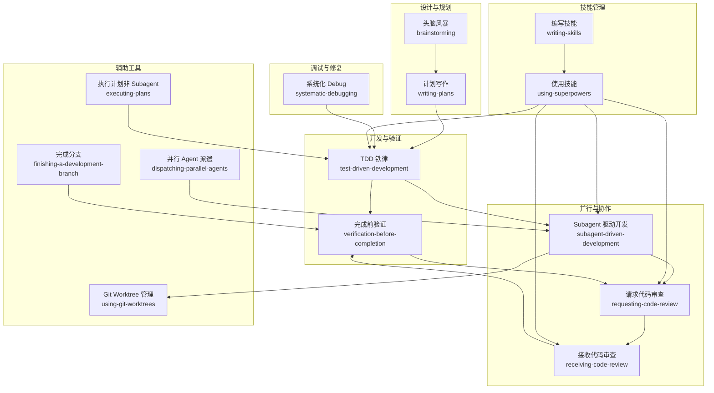
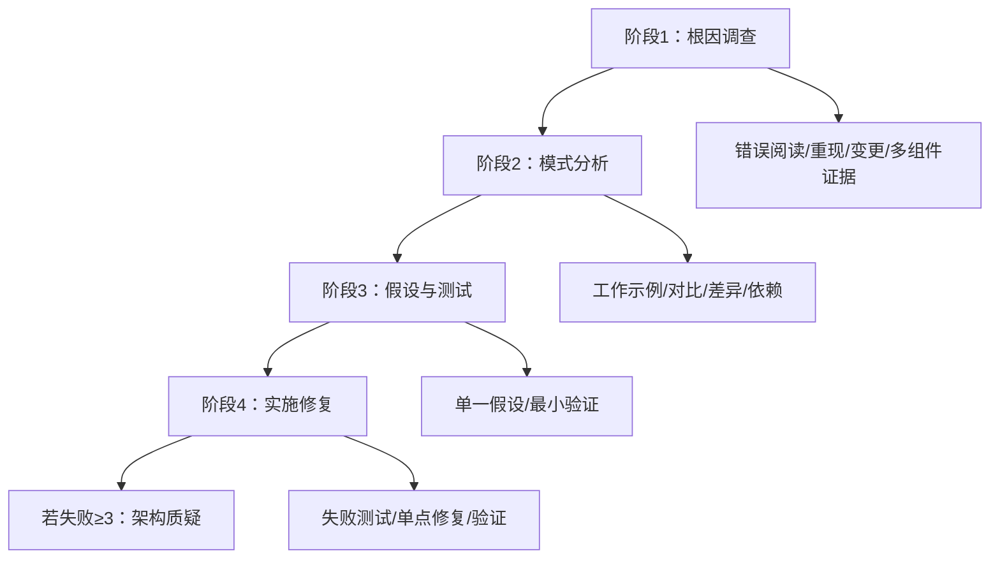
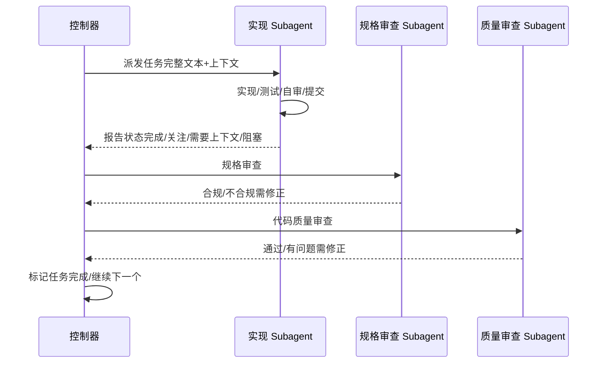
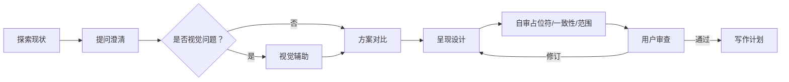
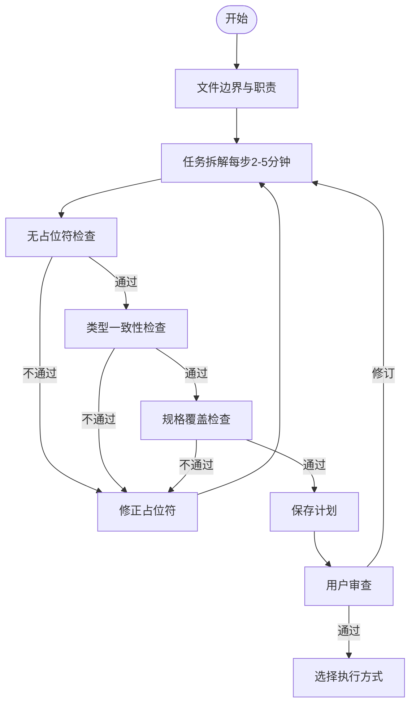
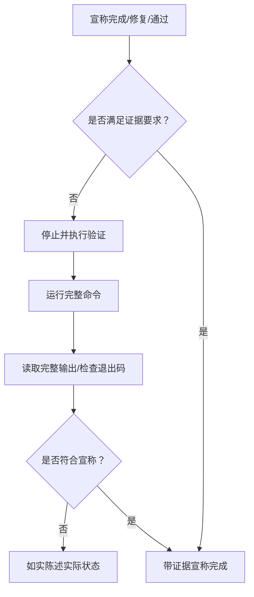
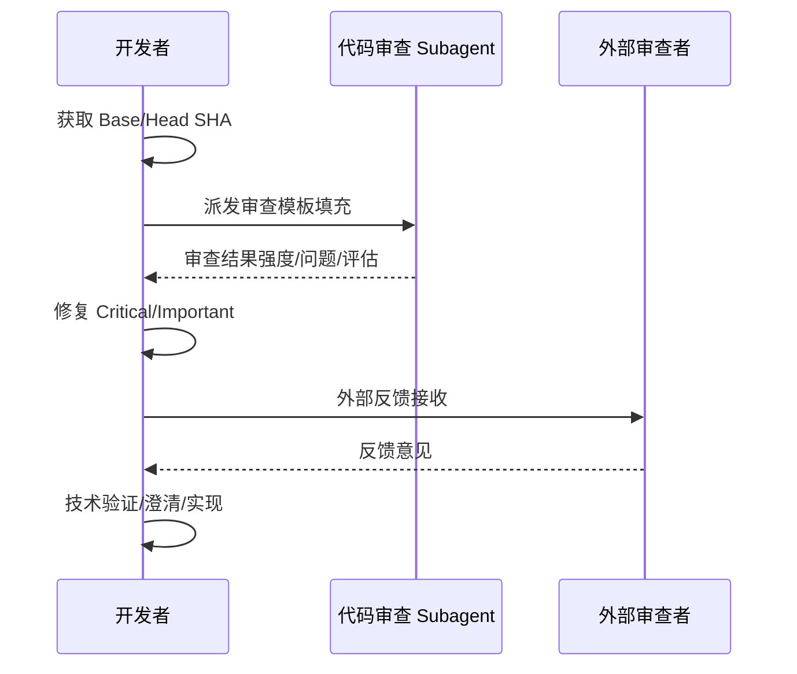
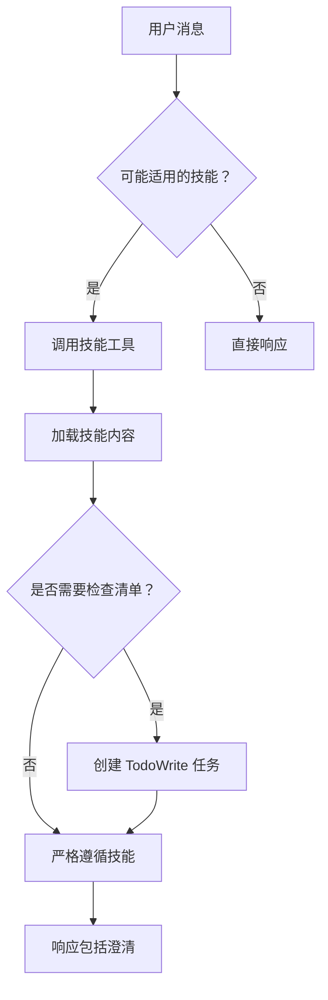
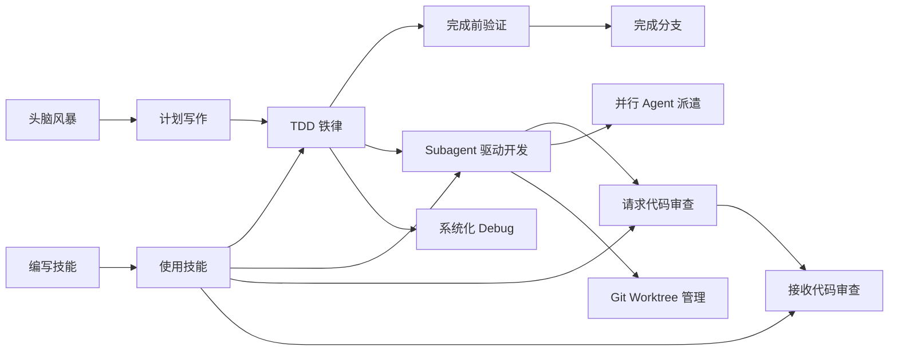

# 超级能力模块

<cite>
**本文引用的文件**
- [altas-workflow/SKILL.md](file://altas-workflow/SKILL.md)
- [altas-workflow/QUICKSTART.md](file://altas-workflow/QUICKSTART.md)
- [altas-workflow/workflow-diagrams.md](file://altas-workflow/workflow-diagrams.md)
- [altas-workflow/reference-index.md](file://altas-workflow/reference-index.md)
- [superpowers/test-driven-development/SKILL.md](file://altas-workflow/references/superpowers/test-driven-development/SKILL.md)
- [superpowers/systematic-debugging/SKILL.md](file://altas-workflow/references/superpowers/systematic-debugging/SKILL.md)
- [superpowers/subagent-driven-development/SKILL.md](file://altas-workflow/references/superpowers/subagent-driven-development/SKILL.md)
- [superpowers/writing-plans/SKILL.md](file://altas-workflow/references/superpowers/writing-plans/SKILL.md)
- [superpowers/brainstorming/SKILL.md](file://altas-workflow/references/superpowers/brainstorming/SKILL.md)
- [superpowers/verification-before-completion/SKILL.md](file://altas-workflow/references/superpowers/verification-before-completion/SKILL.md)
- [superpowers/requesting-code-review/SKILL.md](file://altas-workflow/references/superpowers/requesting-code-review/SKILL.md)
- [superpowers/receiving-code-review/SKILL.md](file://altas-workflow/references/superpowers/receiving-code-review/SKILL.md)
- [superpowers/using-superpowers/SKILL.md](file://altas-workflow/references/superpowers/using-superpowers/SKILL.md)
- [superpowers/writing-skills/SKILL.md](file://altas-workflow/references/superpowers/writing-skills/SKILL.md)
</cite>

## 目录
1. [简介](#简介)
2. [项目结构](#项目结构)
3. [核心组件](#核心组件)
4. [架构总览](#架构总览)
5. [详细组件分析](#详细组件分析)
6. [依赖关系分析](#依赖关系分析)
7. [性能考量](#性能考量)
8. [故障排查指南](#故障排查指南)
9. [结论](#结论)
10. [附录](#附录)

## 简介
本文件面向 ALTAS Workflow 的"超级能力模块"，系统化阐述以下能力体系：
- TDD 铁律：测试驱动开发的原理、实践与反模式识别
- 系统化 Debug：四阶段根因分析、条件等待问题处理、纵深防御策略
- Subagent 驱动开发：并行实现策略、两阶段评审机制、任务拆解与分配
- 设计头脑风暴：方案对比选择、视觉设计辅助、设计 Spec 审查流程
- 计划写作：最佳实践、任务拆解技巧、计划审查流程
- 完成前验证：策略与流程
- 代码审查：请求与接收流程
- 分支完成管理：合并与收尾
- 技能编写：指南与范式
- **技能使用与管理**：基于技能工具的动态加载与使用机制

本指南既提供概念性理解，也给出可操作的流程图与参考路径，帮助开发者在不同规模的任务中高效落地。

## 项目结构
超级能力模块位于 `altas-workflow/references/superpowers/` 目录下，围绕六大能力域构建：
- 设计与规划：brainstorming、writing-plans
- 开发与验证：test-driven-development、verification-before-completion
- 调试与修复：systematic-debugging
- 并行与协作：subagent-driven-development、requesting-code-review、receiving-code-review
- 辅助工具：dispatching-parallel-agents、executing-plans、using-git-worktrees、finishing-a-development-branch、writing-skills
- **技能管理**：using-superpowers、writing-skills

```mermaid
graph TB
subgraph "超级能力模块"
A["设计与规划"]
B["开发与验证"]
C["调试与修复"]
D["并行与协作"]
E["辅助工具"]
F["技能管理"]
end
A --> A1["头脑风暴<br/>brainstorming"]
A --> A2["计划写作<br/>writing-plans"]
B --> B1["TDD 铁律<br/>test-driven-development"]
B --> B2["完成前验证<br/>verification-before-completion"]
C --> C1["系统化 Debug<br/>systematic-debugging"]
D --> D1["Subagent 驱动开发<br/>subagent-driven-development"]
D --> D2["请求代码审查<br/>requesting-code-review"]
D --> D3["接收代码审查<br/>receiving-code-review"]
E --> E1["并行 Agent 派遣<br/>dispatching-parallel-agents"]
E --> E2["执行计划非 Subagent<br/>executing-plans"]
E --> E3["Git Worktree 管理<br/>using-git-worktrees"]
E --> E4["完成分支<br/>finishing-a-development-branch"]
E --> E5["编写技能<br/>writing-skills"]
F --> F1["使用技能<br/>using-superpowers"]
F --> F2["编写技能<br/>writing-skills"]
```

**图表来源**
- [altas-workflow/reference-index.md:141-172](file://altas-workflow/reference-index.md#L141-L172)

**章节来源**
- [altas-workflow/reference-index.md:1-210](file://altas-workflow/reference-index.md#L1-L210)

## 核心组件
本节聚焦"超级能力"的八大关键能力及其在 ALTAS Workflow 中的应用位置与约束。

- TDD 铁律
  - 原理：先写失败测试，再写最小实现，最后重构
  - 约束：无失败测试不写生产代码；测试应覆盖真实行为与边界
  - 反模式识别：测试后补、Mock 过度、借口复杂、删除已有实现
  - 应用：M/L 规模执行阶段的默认纪律，XS/S 可豁免但需事后同步
- 系统化 Debug
  - 四阶段：根因调查 → 模式分析 → 假设与测试 → 实施修复
  - 约束：无根因不修复；多层证据收集；最小化变更验证
  - 辅助：根因追踪、纵深防御、条件等待处理
- Subagent 驱动开发
  - 策略：每任务派发新鲜 Subagent，两阶段评审（Spec 合规 → 代码质量）
  - 约束：不可并行执行多个实现 Subagent；必须提供完整上下文
  - 优势：并行安全、自动审查、早期缺陷拦截
- 设计头脑风暴
  - 流程：探索现状 → 视觉辅助（可选）→ 提问澄清 → 方案对比 → 设计呈现 → 自审 → 用户审查 → 进入计划
  - 约束：必须先设计再实现；设计文档落盘并经用户确认
- 计划写作
  - 要求：文件边界清晰、任务粒度小（2-5分钟）、步骤可执行、无占位符
  - 审查：自检（占位符、类型一致性、规格覆盖）→ 用户复核 → 选择执行方式
- 完成前验证
  - 铁律：无新鲜证据不宣称完成；必须运行完整命令、读取完整输出
  - 关键：测试、构建、回归、代理委托均需验证
- 代码审查
  - 请求：任务级/特性级/合并前；提供精确上下文（Base/Head SHA）
  - 接收：技术验证优先；对不清楚项先澄清；可理性反驳但需技术依据
- **技能管理**
  - **使用技能**：基于技能工具的动态加载机制，确保技能在需要时才被加载
  - **编写技能**：采用 TDD 方法论创建和维护技能，确保技能的可靠性和有效性
  - **技能优先级**：过程技能优先于实现技能，用户指令优先于技能规则

**章节来源**
- [altas-workflow/SKILL.md:90-218](file://altas-workflow/SKILL.md#L90-L218)
- [superpowers/test-driven-development/SKILL.md:1-372](file://altas-workflow/references/superpowers/test-driven-development/SKILL.md#L1-L372)
- [superpowers/systematic-debugging/SKILL.md:1-297](file://altas-workflow/references/superpowers/systematic-debugging/SKILL.md#L1-L297)
- [superpowers/subagent-driven-development/SKILL.md:1-278](file://altas-workflow/references/superpowers/subagent-driven-development/SKILL.md#L1-L278)
- [superpowers/brainstorming/SKILL.md:1-165](file://altas-workflow/references/superpowers/brainstorming/SKILL.md#L1-L165)
- [superpowers/writing-plans/SKILL.md:1-153](file://altas-workflow/references/superpowers/writing-plans/SKILL.md#L1-L153)
- [superpowers/verification-before-completion/SKILL.md:1-140](file://altas-workflow/references/superpowers/verification-before-completion/SKILL.md#L1-L140)
- [superpowers/requesting-code-review/SKILL.md:1-106](file://altas-workflow/references/superpowers/requesting-code-review/SKILL.md#L1-L106)
- [superpowers/receiving-code-review/SKILL.md:1-214](file://altas-workflow/references/superpowers/receiving-code-review/SKILL.md#L1-L214)
- [superpowers/using-superpowers/SKILL.md:1-118](file://altas-workflow/references/superpowers/using-superpowers/SKILL.md#L1-L118)
- [superpowers/writing-skills/SKILL.md:1-656](file://altas-workflow/references/superpowers/writing-skills/SKILL.md#L1-L656)

## 架构总览
下图展示 ALTAS Workflow 的总体架构与超级能力的交互关系：设计与规划（头脑风暴、计划写作）→ 开发与验证（TDD、完成前验证）→ 并行与协作（Subagent、审查）→ 调试与修复（系统化 Debug）→ 技能管理（使用与编写）→ 辅助工具（并行 Agent、Git Worktree、分支完成）。

**图表来源**
- [altas-workflow/reference-index.md:141-172](file://altas-workflow/reference-index.md#L141-L172)

## 详细组件分析

### TDD 铁律：测试驱动开发原理与实践
- 核心循环：RED（写失败测试）→ GREEN（最小实现通过）→ REFACTOR（清理优化）
- 质量要求：测试名称清晰、行为单一、真实代码、最小实现、通过后再重构
- 反模式清单：测试后补、Mock 代替真实行为、借口复杂、删除实现后"参考"、多次尝试修复不溯源
- 与工作流结合：M/L 规模默认 TDD 循环；XS/S 可跳过但需事后同步；Bug 修复必须先写失败测试

**图表来源**
- [superpowers/test-driven-development/SKILL.md:47-69](file://altas-workflow/references/superpowers/test-driven-development/SKILL.md#L47-L69)

**章节来源**
- [superpowers/test-driven-development/SKILL.md:1-372](file://altas-workflow/references/superpowers/test-driven-development/SKILL.md#L1-L372)
- [altas-workflow/SKILL.md:176-192](file://altas-workflow/SKILL.md#L176-L192)

### 系统化 Debug：四阶段根因分析与纵深防御
- 四阶段流程：根因调查（错误、重现、变更、多组件证据）→ 模式分析（工作示例、对比差异、依赖）→ 假设与测试（单一假设、最小验证）→ 实施修复（创建失败测试、单点修复、验证）
- 红灯信号：快速修复、多处同时修复、跳过测试、凭感觉修复、多次修复无效
- 辅助技术：根因追踪（逆向调用链）、纵深防御（多层校验）、条件等待（替代任意超时）

**图表来源**
- [superpowers/systematic-debugging/SKILL.md:46-214](file://altas-workflow/references/superpowers/systematic-debugging/SKILL.md#L46-L214)

**章节来源**
- [superpowers/systematic-debugging/SKILL.md:1-297](file://altas-workflow/references/superpowers/systematic-debugging/SKILL.md#L1-L297)

### Subagent 驱动开发：并行实现与两阶段评审
- 策略：每任务派发新鲜 Subagent，两阶段评审（Spec 合规 → 代码质量），自动审查闭环
- 模型选择：机械实现用低成本模型；集成判断用标准模型；架构设计用最强模型
- 实施要点：任务独立性强、同一会话内、避免并行实现、提供完整上下文、处理阻塞与问题
- 与工作流结合：L 规模执行阶段的主力；配合 Git Worktree 隔离工作空间；最终由分支完成收尾

**图表来源**
- [superpowers/subagent-driven-development/SKILL.md:40-85](file://altas-workflow/references/superpowers/subagent-driven-development/SKILL.md#L40-L85)

**章节来源**
- [superpowers/subagent-driven-development/SKILL.md:1-278](file://altas-workflow/references/superpowers/subagent-driven-development/SKILL.md#L1-L278)
- [altas-workflow/SKILL.md:192-193](file://altas-workflow/SKILL.md#L192-L193)

### 设计头脑风暴：方案对比与 Spec 审查
- 流程：探索现状 → 视觉辅助（可选）→ 提问澄清 → 方案对比（含权衡）→ 设计呈现 → 自审 → 用户审查 → 进入计划
- 约束：必须先设计再实现；设计文档落盘并经用户确认；YAGNI、模块边界清晰
- 与计划写作衔接：设计通过后调用"计划写作"生成可执行清单

**图表来源**
- [superpowers/brainstorming/SKILL.md:34-66](file://altas-workflow/references/superpowers/brainstorming/SKILL.md#L34-L66)

**章节来源**
- [superpowers/brainstorming/SKILL.md:1-165](file://altas-workflow/references/superpowers/brainstorming/SKILL.md#L1-L165)

### 计划写作：任务拆解与计划审查
- 文件结构：明确文件边界、职责单一、接口清晰
- 任务粒度：每步 2-5 分钟，包含测试、实现、验证、提交
- 无占位符：严禁 TBD/TODO/模糊描述；步骤必须包含实际代码与命令
- 审查清单：占位符扫描、类型一致性、规格覆盖；随后用户复核

**图表来源**
- [superpowers/writing-plans/SKILL.md:25-153](file://altas-workflow/references/superpowers/writing-plans/SKILL.md#L25-L153)

**章节来源**
- [superpowers/writing-plans/SKILL.md:1-153](file://altas-workflow/references/superpowers/writing-plans/SKILL.md#L1-L153)

### 完成前验证：证据优先的收尾策略
- 铁律：无新鲜证据不宣称完成；必须运行完整命令、读取完整输出
- 关键场景：测试全通过、构建成功、回归验证、代理委托结果核查
- 常见误区：仅凭"应该""大概""看起来正确"宣称完成；信任代理报告而不核查

**图表来源**
- [superpowers/verification-before-completion/SKILL.md:24-38](file://altas-workflow/references/superpowers/verification-before-completion/SKILL.md#L24-L38)

**章节来源**
- [superpowers/verification-before-completion/SKILL.md:1-140](file://altas-workflow/references/superpowers/verification-before-completion/SKILL.md#L1-L140)

### 代码审查：请求与接收流程
- 请求审查：任务级/特性级/合并前；提供 Base/Head SHA 与实现摘要；按严重性分级处理
- 接收审查：先验证再实现；对不清楚项先澄清；可理性反驳但需技术依据；YAGNI 检查

**图表来源**
- [superpowers/requesting-code-review/SKILL.md:24-48](file://altas-workflow/references/superpowers/requesting-code-review/SKILL.md#L24-L48)
- [superpowers/receiving-code-review/SKILL.md:14-25](file://altas-workflow/references/superpowers/receiving-code-review/SKILL.md#L14-L25)

**章节来源**
- [superpowers/requesting-code-review/SKILL.md:1-106](file://altas-workflow/references/superpowers/requesting-code-review/SKILL.md#L1-L106)
- [superpowers/receiving-code-review/SKILL.md:1-214](file://altas-workflow/references/superpowers/receiving-code-review/SKILL.md#L1-L214)

### 技能管理：动态加载与使用机制
- **使用技能**：基于技能工具的动态加载机制，确保技能在需要时才被加载，避免不必要的资源消耗
- **技能优先级**：过程技能优先于实现技能，用户指令优先于技能规则，确保灵活性和可控性
- **技能类型**：刚性技能（如 TDD、调试）严格遵循，柔性技能（如模式）可根据情境适应
- **编写技能**：采用 TDD 方法论创建和维护技能，确保技能的可靠性和有效性，包括压力测试、漏洞修补和质量检查

**图表来源**
- [superpowers/using-superpowers/SKILL.md:48-76](file://altas-workflow/references/superpowers/using-superpowers/SKILL.md#L48-L76)

**章节来源**
- [superpowers/using-superpowers/SKILL.md:1-118](file://altas-workflow/references/superpowers/using-superpowers/SKILL.md#L1-L118)
- [superpowers/writing-skills/SKILL.md:1-656](file://altas-workflow/references/superpowers/writing-skills/SKILL.md#L1-L656)

## 依赖关系分析
超级能力模块内部存在明确的依赖与协作关系：
- 设计与规划依赖于头脑风暴与计划写作；计划写作完成后进入开发与验证阶段
- 开发与验证贯穿 TDD 与完成前验证；Subagent 驱动开发在执行阶段引入并行与自动审查
- 代码审查贯穿任务级与特性级；系统化 Debug 作为兜底修复手段
- **技能管理**为所有超级能力提供统一的加载与使用机制
- 辅助工具为上述流程提供并行、隔离与分支管理支撑

**图表来源**
- [altas-workflow/reference-index.md:141-172](file://altas-workflow/reference-index.md#L141-L172)

**章节来源**
- [altas-workflow/reference-index.md:1-210](file://altas-workflow/reference-index.md#L1-L210)

## 性能考量
- Subagent 驱动开发通过"新鲜上下文+两阶段评审"降低返工成本，适合大规模并行任务
- 完成前验证避免虚假完成导致的回滚与重做，提升整体交付效率
- 系统化 Debug 的四阶段减少试错成本，尤其在紧急修复场景显著缩短修复周期
- 计划写作的小粒度任务与无占位符要求降低沟通成本与歧义
- **技能管理**通过动态加载机制减少不必要的资源消耗，提升系统响应速度

## 故障排查指南
- TDD 铁律违规：测试后补、Mock 过度、借口复杂、删除实现后"参考"
  - 处理：立即删除相关代码，按 TDD 循环重来
- Subagent 驱动异常：并行实现、上下文污染、阻塞未处理
  - 处理：同一会话内串行派发；提供完整上下文；按状态分类处理
- 完成前验证缺失：宣称完成但未运行完整命令
  - 处理：立即运行完整命令，按输出如实陈述
- 代码审查误用：忽略 Critical/Important、盲目实现、未验证直接合并
  - 处理：按严重性分级修复；对不清楚项先澄清；验证后再合并
- **技能管理异常**：技能加载失败、优先级冲突、描述不准确
  - 处理：检查技能工具配置；验证技能描述的触发条件；确认技能优先级设置

**章节来源**
- [superpowers/test-driven-development/SKILL.md:272-288](file://altas-workflow/references/superpowers/test-driven-development/SKILL.md#L272-L288)
- [superpowers/subagent-driven-development/SKILL.md:234-260](file://altas-workflow/references/superpowers/subagent-driven-development/SKILL.md#L234-L260)
- [superpowers/verification-before-completion/SKILL.md:52-62](file://altas-workflow/references/superpowers/verification-before-completion/SKILL.md#L52-L62)
- [superpowers/requesting-code-review/SKILL.md:92-99](file://altas-workflow/references/superpowers/requesting-code-review/SKILL.md#L92-L99)
- [superpowers/using-superpowers/SKILL.md:78-96](file://altas-workflow/references/superpowers/using-superpowers/SKILL.md#L78-L96)

## 结论
超级能力模块以"证据优先、过程可审计、结果可验证"为核心，将设计、开发、调试、协作与收尾串联为闭环。通过 TDD 铁律、系统化 Debug、Subagent 驱动开发、计划写作与完成前验证等能力，开发者可在不同规模任务中稳定提升交付质量与效率。**新的技能管理机制**通过动态加载和优先级管理，进一步提升了系统的灵活性和性能。建议在团队内统一遵循铁律与门禁，结合流程图与参考索引，持续优化执行节奏与质量门控。

## 附录
- 快速启动与典型场景参见：[altas-workflow/QUICKSTART.md:1-182](file://altas-workflow/QUICKSTART.md#L1-L182)
- 工作流可视化参考：[altas-workflow/workflow-diagrams.md:1-338](file://altas-workflow/workflow-diagrams.md#L1-L338)
- 参考资料索引与按来源分类：[altas-workflow/reference-index.md:1-210](file://altas-workflow/reference-index.md#L1-L210)
- **技能使用与管理详情**：[altas-workflow/references/superpowers/using-superpowers/SKILL.md](file://altas-workflow/references/superpowers/using-superpowers/SKILL.md)
- **技能编写指南**：[altas-workflow/references/superpowers/writing-skills/SKILL.md](file://altas-workflow/references/superpowers/writing-skills/SKILL.md)