# 重构专项模式

<cite>
**本文档引用的文件**
- [altas-workflow/protocols/RIPER-5.md](file://altas-workflow/protocols/RIPER-5.md)
- [altas-workflow/protocols/RIPER-DOC.md](file://altas-workflow/protocols/RIPER-DOC.md)
- [altas-workflow/protocols/SDD-RIPER-DUAL-COOP.md](file://altas-workflow/protocols/SDD-RIPER-DUAL-COOP.md)
- [altas-workflow/reference-index.md](file://altas-workflow/reference-index.md)
- [altas-workflow/workflow-diagrams.md](file://altas-workflow/workflow-diagrams.md)
- [altas-workflow/QUICKSTART.md](file://altas-workflow/QUICKSTART.md)
- [altas-workflow/SKILL.md](file://altas-workflow/SKILL.md)
- [altas-workflow/references/special-modes/refactor.md](file://altas-workflow/references/special-modes/refactor.md)
- [altas-workflow/references/special-modes/migrate.md](file://altas-workflow/references/special-modes/migrate.md)
- [altas-workflow/references/special-modes/perf.md](file://altas-workflow/references/special-modes/perf.md)
- [altas-workflow/references/special-modes/test.md](file://altas-workflow/references/special-modes/test.md)
- [altas-workflow/docs/AI-原生研发范式-从代码中心到文档驱动的演进.md](file://altas-workflow/docs/AI-原生研发范式-从代码中心到文档驱动的演进.md)
- [altas-workflow/references/spec-driven-development/spec-template.md](file://altas-workflow/references/spec-driven-development/spec-template.md)
- [altas-workflow/references/checkpoint-driven/spec-lite-template.md](file://altas-workflow/references/checkpoint-driven/spec-lite-template.md)
</cite>

## 目录
1. [简介](#简介)
2. [项目结构](#项目结构)
3. [核心组件](#核心组件)
4. [架构概览](#架构概览)
5. [详细组件分析](#详细组件分析)
6. [依赖分析](#依赖分析)
7. [性能考虑](#性能考虑)
8. [故障排除指南](#故障排除指南)
9. [结论](#结论)
10. [附录](#附录)

## 简介

重构专项模式是 ALTAS Workflow 中专门针对代码重构任务设计的标准化工作流程。该模式旨在通过系统化的方法消除代码坏味道、改进代码结构，同时确保重构过程的安全性和可追溯性。

重构专项模式的核心特点包括：
- **CodeMap 先行**：在开始重构前先生成代码映射图
- **坏味道识别**：系统性识别和分类代码质量问题
- **小步重构**：将大规模重构分解为可管理的小步骤
- **TDD 循环**：每步重构后进行回归测试验证
- **三轴评审**：从多个维度审查重构质量

## 项目结构

ALTAS Workflow 重构专项模式位于 `altas-workflow/references/special-modes/refactor.md` 文件中，该文件定义了完整的重构工作流程和规范。

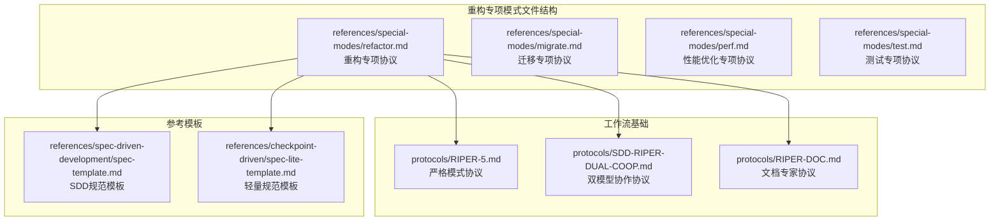

**图表来源**
- [altas-workflow/references/special-modes/refactor.md:1-181](file://altas-workflow/references/special-modes/refactor.md#L1-L181)
- [altas-workflow/protocols/RIPER-5.md:1-187](file://altas-workflow/protocols/RIPER-5.md#L1-L187)

**章节来源**
- [altas-workflow/reference-index.md:116-123](file://altas-workflow/reference-index.md#L116-L123)
- [altas-workflow/SKILL.md:391-398](file://altas-workflow/SKILL.md#L391-L398)

## 核心组件

重构专项模式包含以下核心组件：

### 1. 触发机制
- **触发词**：`REFACTOR` / `重构`
- **默认规模**：M/L（中等至大规模重构）
- **执行模式**：必须先 CodeMap，后重构

### 2. 重构流程阶段
重构专项模式遵循五阶段标准流程：

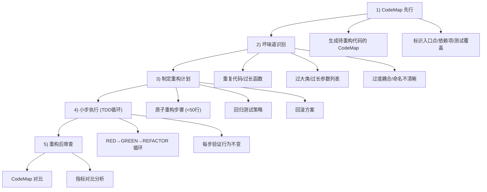

**图表来源**
- [altas-workflow/references/special-modes/refactor.md:33-92](file://altas-workflow/references/special-modes/refactor.md#L33-L92)

### 3. 产出物管理
重构专项模式定义了多种产出物：

| 产出物类型 | 路径 | 用途 |
|------------|------|------|
| 重构前 CodeMap | `mydocs/codemap/YYYY-MM-DD_hh-mm_<模块>_重构前.md` | 重构前代码结构分析 |
| 重构后 CodeMap | `mydocs/codemap/YYYY-MM-DD_hh-mm_<模块>_重构后.md` | 重构后代码结构分析 |
| 重构计划 | Spec 中的 Plan 部分 | 详细重构步骤清单 |
| 重构记录 | `mydocs/refactor/YYYY-MM-DD_hh-mm_<模块>.md` | 可选的重构过程记录 |

**章节来源**
- [altas-workflow/references/special-modes/refactor.md:94-134](file://altas-workflow/references/special-modes/refactor.md#L94-L134)

## 架构概览

重构专项模式在整个 ALTAS Workflow 体系中占据重要地位，与其它专项模式形成互补关系：

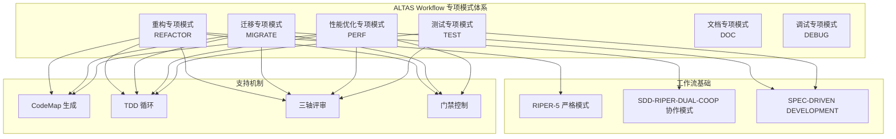

**图表来源**
- [altas-workflow/reference-index.md:116-147](file://altas-workflow/reference-index.md#L116-L147)
- [altas-workflow/SKILL.md:391-422](file://altas-workflow/SKILL.md#L391-L422)

## 详细组件分析

### 重构流程详解

#### 1) CodeMap 先行阶段
CodeMap 生成是重构的基础，必须在开始任何代码修改前完成：

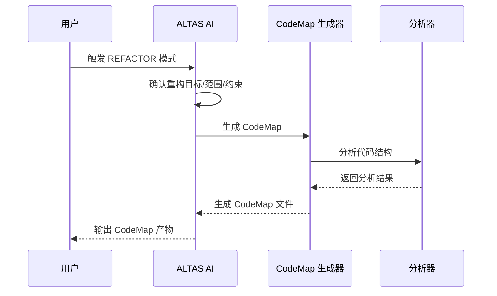

**图表来源**
- [altas-workflow/references/special-modes/refactor.md:35-43](file://altas-workflow/references/special-modes/refactor.md#L35-L43)

#### 2) 坏味道识别机制
重构专项模式提供了系统性的代码坏味道识别清单：

| 坏味道类型 | 描述 | 重构策略 |
|------------|------|----------|
| 重复代码 | 相同/相似代码出现在多处 | 提取函数/提取公共模块 |
| 过长函数 | 函数超过 50 行 | 提取函数/分解为多个小函数 |
| 过大类 | 类超过 500 行或职责过多 | 拆分类/提取职责 |
| 过长参数列表 | 函数参数超过 5 个 | 引入参数对象/使用配置对象 |
| 过度耦合 | 模块间依赖复杂 | 引入接口/依赖注入 |
| 命名不清晰 | 变量/函数名不能表达意图 | 重命名 |
| 条件复杂 | 嵌套 if/switch 超过 3 层 | 提取条件函数/使用策略模式 |
| 数据簇 | 多个数据总是一起出现 | 封装为数据结构/类 |

#### 3) 计划制定规范
重构计划必须包含以下要素：

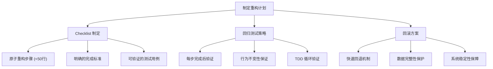

**图表来源**
- [altas-workflow/references/special-modes/refactor.md:61-68](file://altas-workflow/references/special-modes/refactor.md#L61-L68)

#### 4) 执行阶段控制
重构执行严格遵循 TDD 循环：

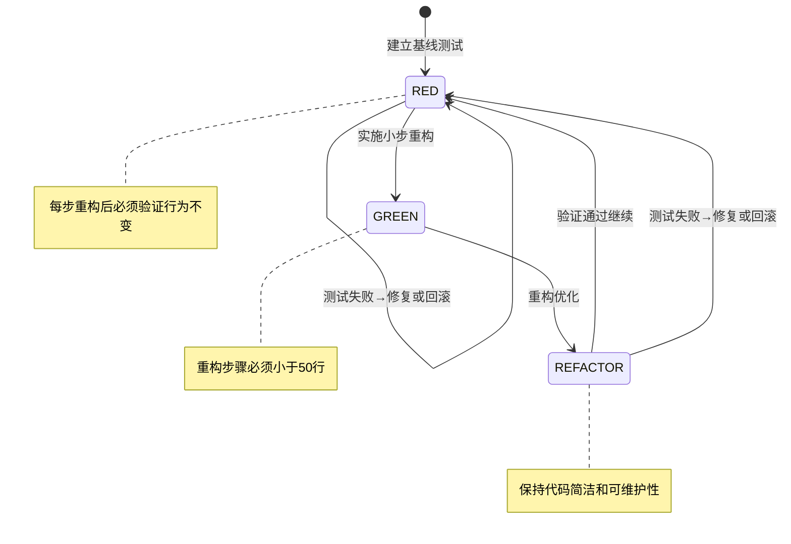

**图表来源**
- [altas-workflow/references/special-modes/refactor.md:69-85](file://altas-workflow/references/special-modes/refactor.md#L69-L85)

#### 5) 审查阶段标准
重构完成后进行全面的质量审查：

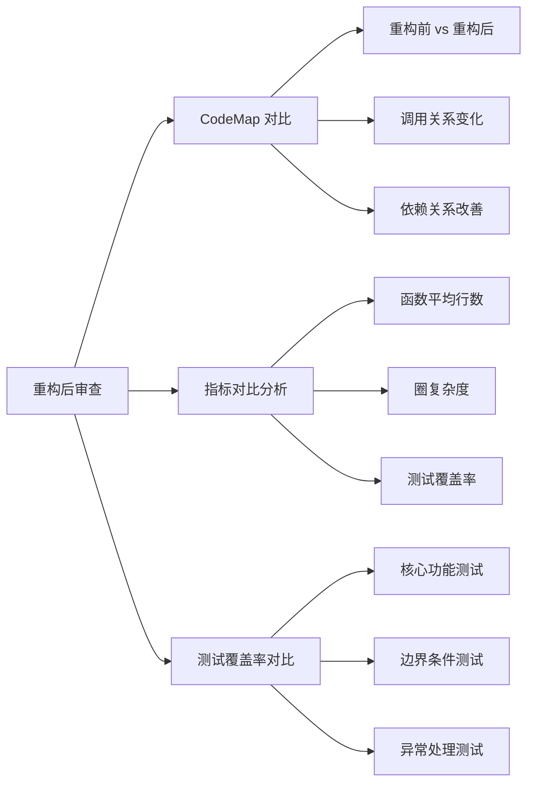

**图表来源**
- [altas-workflow/references/special-modes/refactor.md:86-92](file://altas-workflow/references/special-modes/refactor.md#L86-L92)

### 特殊场景处理

#### 大重构场景
对于跨多模块的大规模重构，需要拆分为多个独立子任务：

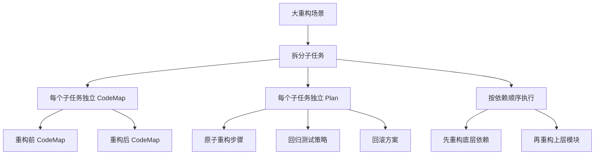

#### 无测试覆盖场景
对于没有测试覆盖的老代码，重构前必须先补关键路径测试：

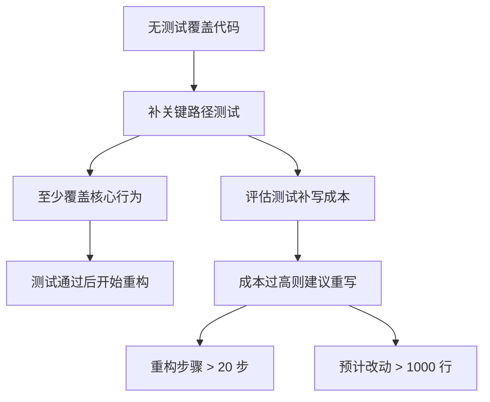

**章节来源**
- [altas-workflow/references/special-modes/refactor.md:156-173](file://altas-workflow/references/special-modes/refactor.md#L156-L173)

## 依赖分析

重构专项模式与 ALTAS Workflow 其他组件存在密切依赖关系：

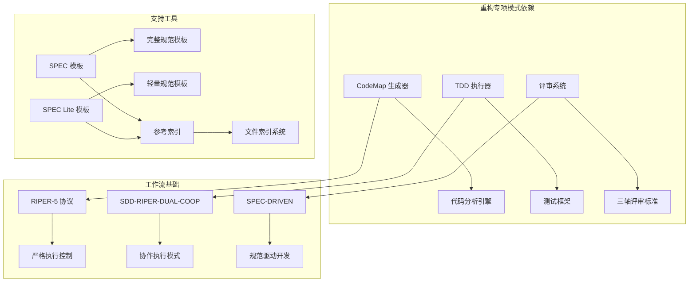

**图表来源**
- [altas-workflow/reference-index.md:425-455](file://altas-workflow/reference-index.md#L425-L455)
- [altas-workflow/SKILL.md:425-455](file://altas-workflow/SKILL.md#L425-L455)

### 外部依赖关系

重构专项模式依赖于以下外部组件：

1. **代码分析工具**：用于生成 CodeMap 和分析代码结构
2. **测试框架**：支持 TDD 循环和回归测试
3. **版本控制系统**：支持回滚和变更追踪
4. **文档系统**：支持规范和产物的持久化存储

**章节来源**
- [altas-workflow/reference-index.md:1-251](file://altas-workflow/reference-index.md#L1-L251)

## 性能考虑

重构专项模式在性能方面的考虑主要包括：

### 1. 执行效率优化
- **小步执行**：每步重构控制在 50 行以内，减少代码审查负担
- **增量测试**：每步重构后进行针对性测试，避免全量测试开销
- **并行处理**：在支持的情况下，多个独立的重构任务可以并行执行

### 2. 资源利用优化
- **内存管理**：重构前先生成 CodeMap，避免不必要的内存占用
- **CPU 利用**：通过 TDD 循环减少无效的代码修改
- **存储优化**：合理管理重构过程中的临时文件和中间产物

### 3. 时间管理
- **任务分解**：将大规模重构分解为可管理的小任务
- **优先级排序**：根据影响范围和复杂度确定重构优先级
- **进度跟踪**：通过 Checkpoint 系统实时跟踪重构进度

## 故障排除指南

### 常见问题及解决方案

#### 1. 重构中发现 Bug
**问题**：在重构过程中发现原有 Bug
**处理方式**：
- 暂停重构，记录 Bug 信息
- 优先修复 Bug，再继续重构
- 更新回归测试策略

#### 2. 重构后测试失败
**问题**：重构后的测试无法通过
**处理方式**：
- 立即回滚到上一个稳定版本
- 分析失败原因，修复代码或测试
- 重新执行 TDD 循环

#### 3. 重构偏离计划
**问题**：重构过程偏离原定计划
**处理方式**：
- 暂停执行，重新评估计划
- 必要时回到 Plan 阶段重新制定计划
- 评估影响范围，决定是否继续

#### 4. 重构引入破坏性变更
**问题**：重构改变了原有的行为
**处理方式**：
- 立即暂停，评估影响范围
- 与相关方确认是否接受变更
- 必要时回滚并重新设计

**章节来源**
- [altas-workflow/references/special-modes/refactor.md:137-145](file://altas-workflow/references/special-modes/refactor.md#L137-L145)

### 异常恢复策略

重构专项模式提供了完善的异常恢复机制：

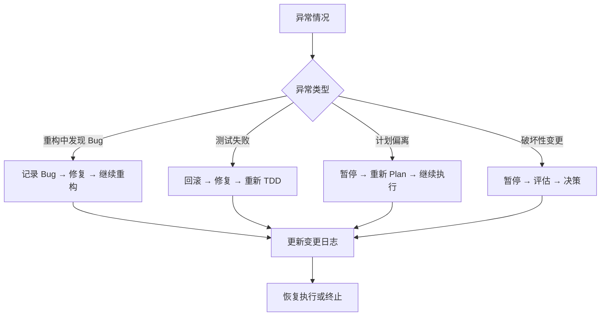

## 结论

重构专项模式为 ALTAS Workflow 提供了系统化、规范化的代码重构解决方案。通过严格的流程控制、完善的质量保证机制和全面的风险管理，该模式能够有效提升代码质量，减少技术债务，同时确保重构过程的安全性和可追溯性。

### 主要优势

1. **系统性**：提供从 CodeMap 生成到最终审查的完整流程
2. **安全性**：通过 TDD 循环和三轴评审确保重构质量
3. **可追溯性**：完整的变更记录和产物管理
4. **可扩展性**：支持从小规模重构到大规模重构的不同场景

### 最佳实践建议

1. **充分准备**：在开始重构前确保充分理解代码结构和业务需求
2. **小步前进**：严格按照原子步骤执行，避免大范围同时修改
3. **持续验证**：每步重构后及时进行测试验证
4. **文档记录**：详细记录重构过程和决策依据
5. **团队协作**：在需要时寻求团队成员的审查和建议

重构专项模式不仅是代码重构的技术规范，更是提升团队代码质量和开发效率的重要工具。

## 附录

### 相关文件索引

重构专项模式涉及的主要文件包括：

1. **核心协议文件**
   - `altas-workflow/references/special-modes/refactor.md` - 重构专项协议
   - `altas-workflow/protocols/RIPER-5.md` - 严格模式协议
   - `altas-workflow/protocols/SDD-RIPER-DUAL-COOP.md` - 双模型协作协议

2. **参考模板文件**
   - `altas-workflow/references/spec-driven-development/spec-template.md` - SDD规范模板
   - `altas-workflow/references/checkpoint-driven/spec-lite-template.md` - 轻量规范模板

3. **工作流文档**
   - `altas-workflow/workflow-diagrams.md` - 流程图集
   - `altas-workflow/reference-index.md` - 参考资料索引

4. **技能和快速启动**
   - `altas-workflow/SKILL.md` - ALTAS Workflow 技能
   - `altas-workflow/QUICKSTART.md` - 快速启动方案

### 触发词和使用场景

重构专项模式可通过以下触发词激活：
- `REFACTOR` - 重构代码
- `重构` - 重构代码（中文）

适用于以下场景：
- 消除代码坏味道
- 改进代码结构
- 提升代码可读性和可维护性
- 为新功能开发铺路
- 优化代码性能