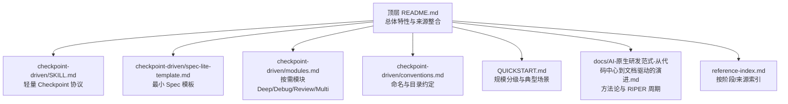
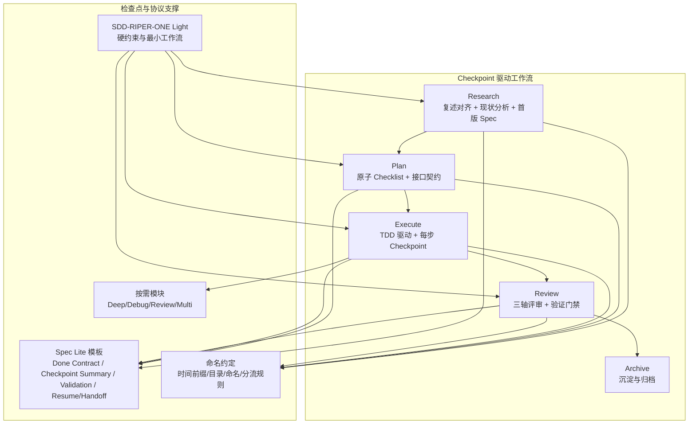
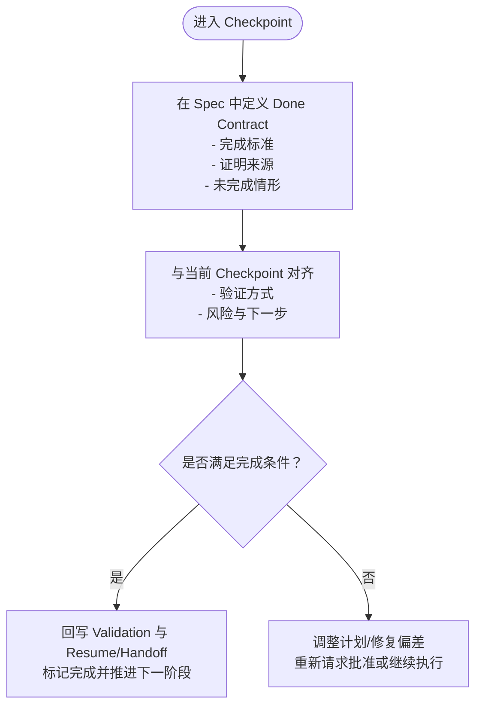
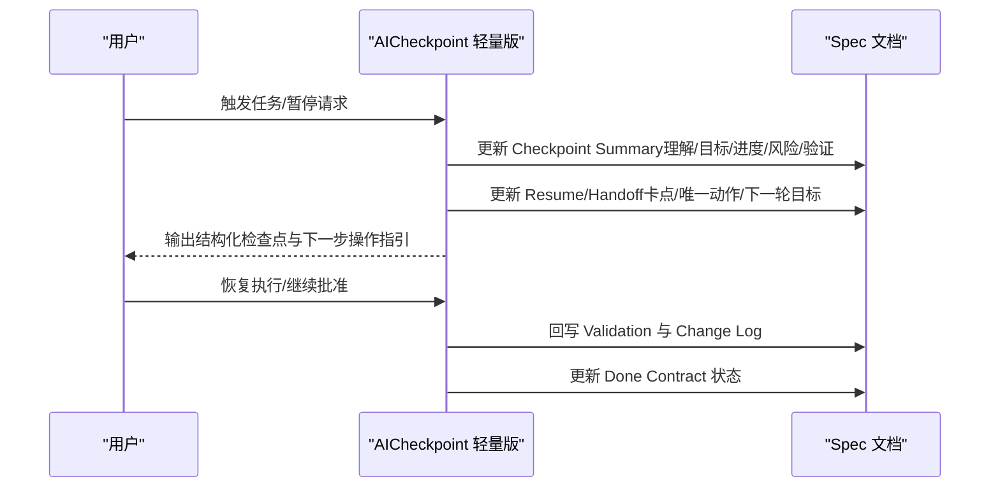
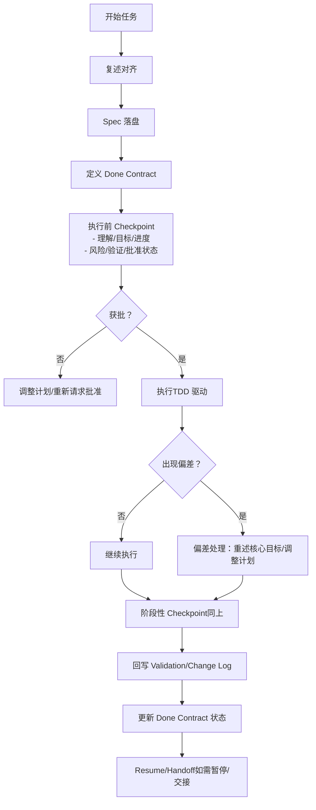
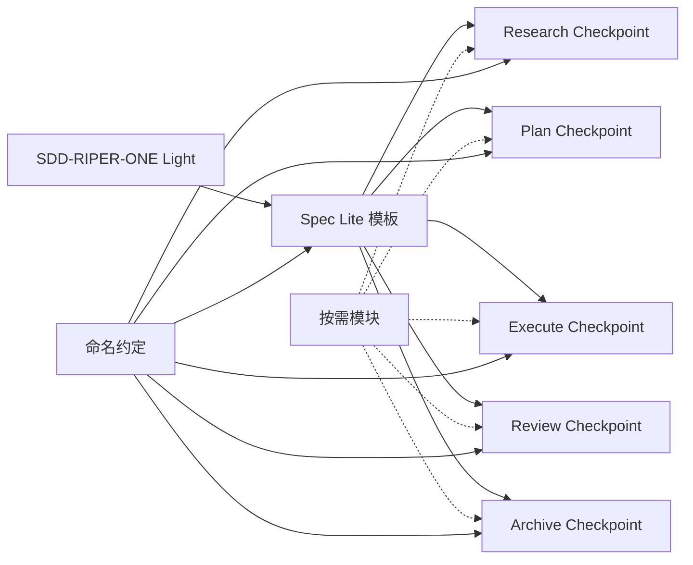

# Checkpoint 驱动模式

<cite>
**本文引用的文件**
- [README.md](file://altas-workflow/README.md)
- [QUICKSTART.md](file://altas-workflow/QUICKSTART.md)
- [reference-index.md](file://altas-workflow/reference-index.md)
- [AI-原生研发范式-从代码中心到文档驱动的演进.md](file://altas-workflow/docs/AI-原生研发范式-从代码中心到文档驱动的演进.md)
- [SKILL.md（Checkpoint 轻量版）](file://altas-workflow/references/checkpoint-driven/SKILL.md)
- [Spec Lite 模板](file://altas-workflow/references/checkpoint-driven/spec-lite-template.md)
- [按需模块](file://altas-workflow/references/checkpoint-driven/modules.md)
- [命名与目录约定](file://altas-workflow/references/checkpoint-driven/conventions.md)
- [SDD-RIPER-ONE Light（Agent）](file://altas-workflow/references/agents/sdd-riper-one-light/SKILL.md)
</cite>

## 目录
1. [简介](#简介)
2. [项目结构](#项目结构)
3. [核心组件](#核心组件)
4. [架构总览](#架构总览)
5. [详细组件分析](#详细组件分析)
6. [依赖关系分析](#依赖关系分析)
7. [性能考量](#性能考量)
8. [故障排查指南](#故障排查指南)
9. [结论](#结论)
10. [附录](#附录)

## 简介
本文件系统化阐述 Checkpoint 驱动模式在 ALTAS Workflow 中的设计与实践，围绕 Done Contract、Resume Ready 等关键机制，解释检查点的创建时机、内容要求与验证标准，梳理在不同工作流阶段设置检查点的策略与依赖关系，并给出检查点模板、最佳实践与回滚策略。文档旨在帮助开发者高效利用检查点机制提升工作流的可靠性与可维护性。

## 项目结构
- Checkpoint 驱动模式位于“checkpoint-driven”模块，配套模板、命名约定与按需模块，与 SDD-RIPER 标准模式互补，适用于强模型高频多轮场景。
- 顶层 README 与 QUICKSTART 提供规模分级、进度可视化与渐进式披露等总体特性说明。
- reference-index.md 提供按阶段与来源的索引，便于按需加载对应文件。

**图表来源**
- [README.md:1-133](file://altas-workflow/README.md#L1-L133)
- [QUICKSTART.md:1-182](file://altas-workflow/QUICKSTART.md#L1-L182)
- [reference-index.md:1-210](file://altas-workflow/reference-index.md#L1-L210)

**章节来源**
- [README.md:1-133](file://altas-workflow/README.md#L1-L133)
- [QUICKSTART.md:1-182](file://altas-workflow/QUICKSTART.md#L1-L182)
- [reference-index.md:1-210](file://altas-workflow/reference-index.md#L1-L210)

## 核心组件
- 轻量 Checkpoint 协议（SDD-RIPER-ONE Light）：定义硬约束、任务深度、最小工作流与输出风格，强调“先复述对齐、再落盘 Spec、再 Checkpoint、再获批执行、再回写收尾”。
- 最小 Spec 模板（Spec Lite）：定义 Done Contract、Restated Understanding、Checkpoint Summary、Change Log、Validation、Resume/Handoff 等关键区块，确保检查点内容结构化与可验证。
- 按需模块：Deep Planning、Debug、Review、Multi-project，按场景加载，避免常驻 token。
- 命名与目录约定：统一时间前缀、目录结构与文件命名，指导 micro-spec 与 standard spec 的分流与落盘。

**章节来源**
- [SKILL.md（Checkpoint 轻量版）:1-84](file://altas-workflow/references/checkpoint-driven/SKILL.md#L1-L84)
- [Spec Lite 模板:1-85](file://altas-workflow/references/checkpoint-driven/spec-lite-template.md#L1-L85)
- [按需模块:1-57](file://altas-workflow/references/checkpoint-driven/modules.md#L1-L57)
- [命名与目录约定:1-48](file://altas-workflow/references/checkpoint-driven/conventions.md#L1-L48)

## 架构总览
Checkpoint 驱动模式以“Spec 为真相源”为核心，通过阶段性检查点串联 Research、Plan、Execute、Review 等阶段，确保每步可反馈、可回溯、可恢复。

**图表来源**
- [README.md:41-60](file://altas-workflow/README.md#L41-L60)
- [SKILL.md（Checkpoint 轻量版）:48-56](file://altas-workflow/references/checkpoint-driven/SKILL.md#L48-L56)
- [Spec Lite 模板:12-69](file://altas-workflow/references/checkpoint-driven/spec-lite-template.md#L12-L69)
- [按需模块:1-57](file://altas-workflow/references/checkpoint-driven/modules.md#L1-L57)
- [命名与目录约定:6-48](file://altas-workflow/references/checkpoint-driven/conventions.md#L6-L48)

## 详细组件分析

### Done Contract（完成契约）
- 定义：在 Spec 中用 1-3 行明确“什么算完成、由什么证明、哪些算未完成”，作为完成判定的唯一依据。
- 作用：完成由验证结果与外部反馈证明，而非模型自宣布；避免“自我宣称完成”带来的歧义与返工。
- 与检查点的关系：Checkpoint Summary 中需明确“验证方式”，并与 Done Contract 对齐，确保每步进展可量化、可回溯。

**图表来源**
- [Spec Lite 模板:12-16](file://altas-workflow/references/checkpoint-driven/spec-lite-template.md#L12-L16)
- [Spec Lite 模板:54-62](file://altas-workflow/references/checkpoint-driven/spec-lite-template.md#L54-L62)
- [SKILL.md（Checkpoint 轻量版）:24-26](file://altas-workflow/references/checkpoint-driven/SKILL.md#L24-L26)

**章节来源**
- [Spec Lite 模板:12-16](file://altas-workflow/references/checkpoint-driven/spec-lite-template.md#L12-L16)
- [Spec Lite 模板:54-62](file://altas-workflow/references/checkpoint-driven/spec-lite-template.md#L54-L62)
- [SKILL.md（Checkpoint 轻量版）:24-26](file://altas-workflow/references/checkpoint-driven/SKILL.md#L24-L26)

### Resume Ready（可恢复锚点）
- 定义：长任务或暂停前在 Spec 中留下最小恢复锚点，确保下一轮可快速恢复。
- 关键区块：Resume/Handoff（当前状态、当前卡点、下一步唯一动作、下一轮核心目标）。
- 与检查点的关系：Checkpoint Summary 与 Resume/Handoff 互为镜像，前者面向“当前进展”，后者面向“下一轮起点”。

**图表来源**
- [Spec Lite 模板:40-69](file://altas-workflow/references/checkpoint-driven/spec-lite-template.md#L40-L69)
- [SKILL.md（Checkpoint 轻量版）:26-26](file://altas-workflow/references/checkpoint-driven/SKILL.md#L26-L26)

**章节来源**
- [Spec Lite 模板:64-69](file://altas-workflow/references/checkpoint-driven/spec-lite-template.md#L64-L69)
- [SKILL.md（Checkpoint 轻量版）:26-26](file://altas-workflow/references/checkpoint-driven/SKILL.md#L26-L26)

### 检查点创建时机与内容要求
- 创建时机
  - 执行前：实现前给一次短 checkpoint（理解/目标/下一步/风险/验证）。
  - 偏差暴露后：基于证据重述核心目标，决定继续或调整。
  - 暂停/切换/交接前：更新 Resume/Handoff，确保下一轮快速恢复。
- 内容要求
  - Done Contract：完成定义 + 证明来源。
  - Checkpoint Summary：任务理解、核心目标、当前进度、下一步 1-3 动作、涉及文件/模块、风险、验证方式、Execution Approval 状态。
  - Validation：优先记录外部证据，模型自检仅作补充。
  - Resume/Handoff：当前状态、卡点、下一步唯一动作、下一轮核心目标。

**图表来源**
- [SKILL.md（Checkpoint 轻量版）:48-56](file://altas-workflow/references/checkpoint-driven/SKILL.md#L48-L56)
- [Spec Lite 模板:40-69](file://altas-workflow/references/checkpoint-driven/spec-lite-template.md#L40-L69)

**章节来源**
- [SKILL.md（Checkpoint 轻量版）:48-56](file://altas-workflow/references/checkpoint-driven/SKILL.md#L48-L56)
- [Spec Lite 模板:40-69](file://altas-workflow/references/checkpoint-driven/spec-lite-template.md#L40-L69)

### 不同工作流阶段的检查点策略与依赖关系
- Research 阶段
  - 目标：现状分析、风险识别、首版 Spec 落地。
  - 检查点：Research 完成后的阶段性 Checkpoint，明确成果与下一步（Plan）。
  - 依赖：与 CodeMap/Context 的依赖关系，确保“事实优先”。
- Plan 阶段
  - 目标：原子 Checklist + 接口契约 + Done Contract。
  - 检查点：Plan 完成后的 Checkpoint，明确实现路径与验证策略。
  - 依赖：与接口契约、文件清单、签名的依赖关系。
- Execute 阶段
  - 目标：TDD 驱动，每步产出可验证。
  - 检查点：每步执行后的 Checkpoint，确保“证据先行”。
  - 依赖：测试先行、失败测试驱动实现。
- Review 阶段
  - 目标：三轴评审 + 验证门禁。
  - 检查点：Review 完成后的 Checkpoint，明确通过与否与后续动作。
  - 依赖：Spec 与 Change Log 的一致性。
- Archive 阶段
  - 目标：沉淀与归档。
  - 检查点：Archive 完成后的 Checkpoint，确保知识资产可检索。

**章节来源**
- [README.md:11-21](file://altas-workflow/README.md#L11-L21)
- [AI-原生研发范式-从代码中心到文档驱动的演进.md:184-323](file://altas-workflow/docs/AI-原生研发范式-从代码中心到文档驱动的演进.md#L184-L323)

### 按需模块与检查点的协同
- Deep Planning：需求模糊、架构设计、跨模块重构时，先收敛目标与边界，形成短计划与 checkpoint summary，再请求批准。
- Debug：报错复现不稳定、根因未知时，先复现、缩小范围、形成假设、验证，将结论写入 Spec 后再执行修复。
- Review：默认从 Completion/Fidelity/Quality/Risk 四点快速评估，输出结论并反向同步到 Spec。
- Multi-project：声明 active_project 与改动范围，跨项目前先回读相关 Spec/codemap，再请求批准。

**章节来源**
- [按需模块:5-16](file://altas-workflow/references/checkpoint-driven/modules.md#L5-L16)
- [按需模块:18-29](file://altas-workflow/references/checkpoint-driven/modules.md#L18-L29)
- [按需模块:31-43](file://altas-workflow/references/checkpoint-driven/modules.md#L31-L43)
- [按需模块:45-57](file://altas-workflow/references/checkpoint-driven/modules.md#L45-L57)

### 检查点模板与最佳实践
- 模板结构
  - Goal/Done Contract/Scope/Facts/Constraints/Open Questions
  - Restated Understanding/Goal Alignment Check
  - Checkpoint Summary（含 Execution Approval）
  - Change Log/Validation/Resume/Handoff
- 最佳实践
  - Done Contract 保持 1-3 行，优先写“完成定义 + 证明来源”。
  - Checkpoint Summary 明确区分“任务理解/核心目标/当前进度”。
  - Validation 优先记录外部证据，模型自检仅作补充。
  - 执行前将 Execution Approval 置为 Pending，获批后再改为 Approved。
  - 暂停/切换/交接前更新 Resume/Handoff，确保下一轮快速恢复。
  - 编码前、切换任务点前、收尾前，回读当前相关区块，不整份重载。

**章节来源**
- [Spec Lite 模板:71-85](file://altas-workflow/references/checkpoint-driven/spec-lite-template.md#L71-L85)

### 命名与目录约定
- 时间前缀：YYYY-MM-DD_hh-mm_
- 目录约定：micro-specs/、specs/、codemap/
- 文件命名：按时间前缀 + 任务名
- 分流规则：小范围代码修改优先 micro-spec；大范围/跨项目/复杂迁移升级为 standard spec

**章节来源**
- [命名与目录约定:6-48](file://altas-workflow/references/checkpoint-driven/conventions.md#L6-L48)

### Agent 与 Checkpoint 的协同
- SDD-RIPER-ONE Light（Agent）：强调“先复述对齐、再落盘 Spec、再 Checkpoint、再获批执行、再回写收尾”，并在硬约束中明确 Checkpoint Before Execute、Done by Evidence、Reverse Sync、Resume Ready。

**章节来源**
- [SDD-RIPER-ONE Light（Agent）:14-26](file://altas-workflow/references/agents/sdd-riper-one-light/SKILL.md#L14-L26)
- [SDD-RIPER-ONE Light（Agent）:48-56](file://altas-workflow/references/agents/sdd-riper-one-light/SKILL.md#L48-L56)

## 依赖关系分析
- 协议与模板的依赖
  - Checkpoint 轻量协议依赖 Spec Lite 模板提供结构化内容。
  - 按需模块在命中场景时加载，避免常驻 token。
- 工作流阶段的依赖
  - Execute 依赖 Plan 的 Checklist 与接口契约。
  - Review 依赖 Spec 与 Change Log 的一致性。
  - Archive 依赖 Review 与 Execute 的沉淀。

**图表来源**
- [SKILL.md（Checkpoint 轻量版）:48-56](file://altas-workflow/references/checkpoint-driven/SKILL.md#L48-L56)
- [Spec Lite 模板:1-85](file://altas-workflow/references/checkpoint-driven/spec-lite-template.md#L1-L85)
- [按需模块:1-57](file://altas-workflow/references/checkpoint-driven/modules.md#L1-L57)
- [命名与目录约定:1-48](file://altas-workflow/references/checkpoint-driven/conventions.md#L1-L48)

**章节来源**
- [SKILL.md（Checkpoint 轻量版）:48-56](file://altas-workflow/references/checkpoint-driven/SKILL.md#L48-L56)
- [Spec Lite 模板:1-85](file://altas-workflow/references/checkpoint-driven/spec-lite-template.md#L1-L85)
- [按需模块:1-57](file://altas-workflow/references/checkpoint-driven/modules.md#L1-L57)
- [命名与目录约定:1-48](file://altas-workflow/references/checkpoint-driven/conventions.md#L1-L48)

## 性能考量
- 渐进式披露：仅在命中场景时加载对应模块，避免常驻 token。
- 短输出优先：默认短输出，不复述完整协议，减少上下文占用。
- 结构化检查点：每步输出标准化检查点，便于快速反馈与中断恢复。
- 任务深度分级：XS/S/M/L 四级评估，按需选择工作流深度，平衡效率与质量。

**章节来源**
- [README.md:29-34](file://altas-workflow/README.md#L29-L34)
- [README.md:11-21](file://altas-workflow/README.md#L11-L21)
- [QUICKSTART.md:141-144](file://altas-workflow/QUICKSTART.md#L141-L144)

## 故障排查指南
- 常见问题
  - AI 一次性输出过多代码：内置检查点机制要求每步暂停等确认，若出现“暴走”，回复“请停止，严格执行检查点机制，每次只推进一步”。
  - 为什么总是先写测试：Evidence First + TDD 铁律，没有失败测试，AI 生成的代码可能未被执行过。
  - 如何中途干预计划：在任意检查点回复“[修改] …”，AI 会根据反馈调整 Plan 后重新请求批准。
- LAFR 故障排查协议（来自方法论文档）
  - Locate：Spec + 相关代码 + 报错日志
  - Analyze：判断是执行层错误还是设计层错误
  - Fix：文档错先改文档，再重新生成代码
  - Record：更新技能与文档留痕

**章节来源**
- [QUICKSTART.md:121-132](file://altas-workflow/QUICKSTART.md#L121-L132)
- [AI-原生研发范式-从代码中心到文档驱动的演进.md:336-356](file://altas-workflow/docs/AI-原生研发范式-从代码中心到文档驱动的演进.md#L336-L356)

## 结论
Checkpoint 驱动模式通过 Done Contract 与 Resume Ready 两大机制，将“可验证完成”与“可恢复执行”嵌入到工作流的每个阶段。结合最小 Spec 模板、按需模块与命名约定，开发者可以在强模型高频多轮场景下，以较低的上下文成本获得更高的可控性与可维护性。建议在每个关键节点设置结构化检查点，确保每步进展可量化、可回溯、可恢复。

## 附录
- 规模分级速查（来自 QUICKSTART）
  - XS：改个 typo / 加个配置项 → 直接执行→验证→summary
  - S：加个参数 / 新增接口 → micro-spec→批准→执行→回写
  - M：一般功能开发 → Research→Plan→Execute(TDD)→Review
  - L：架构重构/跨项目 → Research→Innovate→Plan→Execute(TDD)→Subagent→Review→Archive

**章节来源**
- [QUICKSTART.md:155-169](file://altas-workflow/QUICKSTART.md#L155-L169)