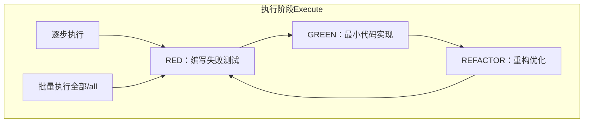
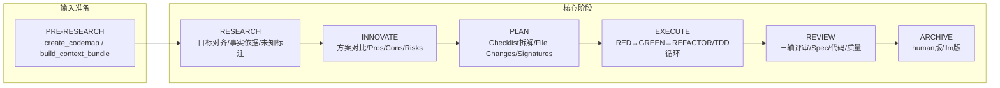
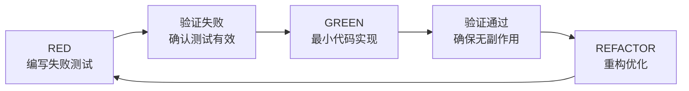
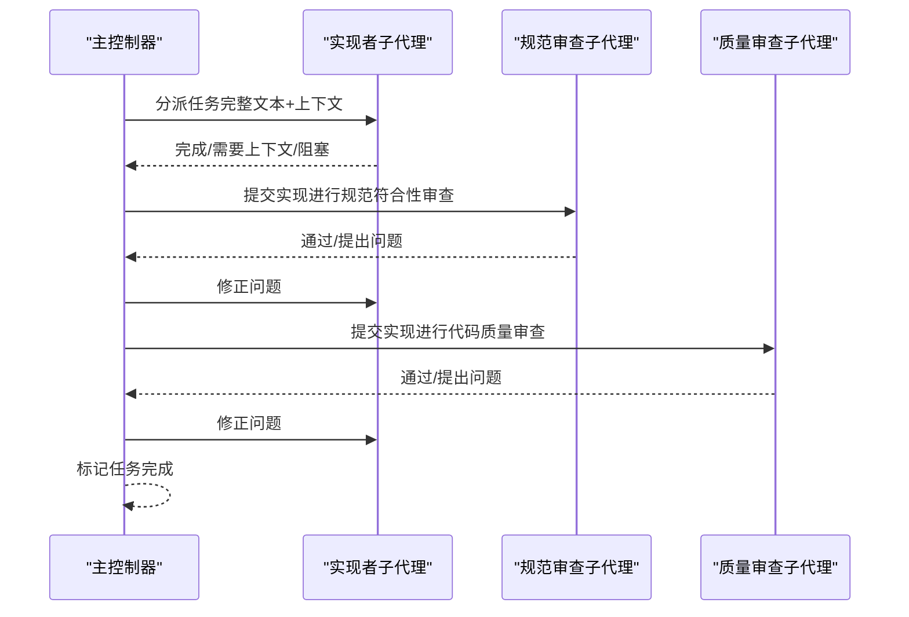
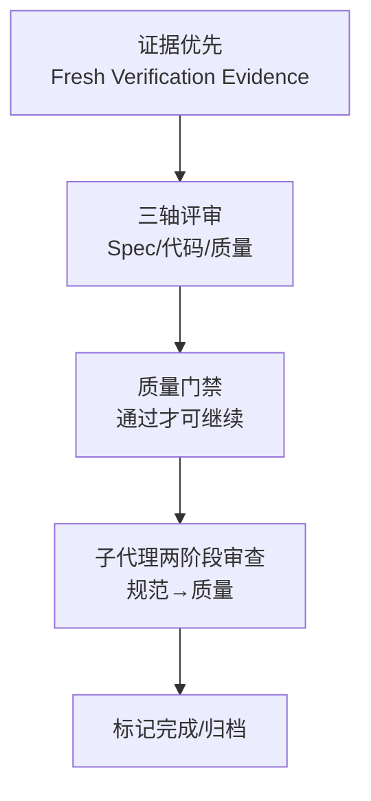
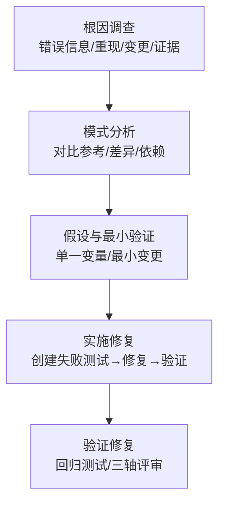
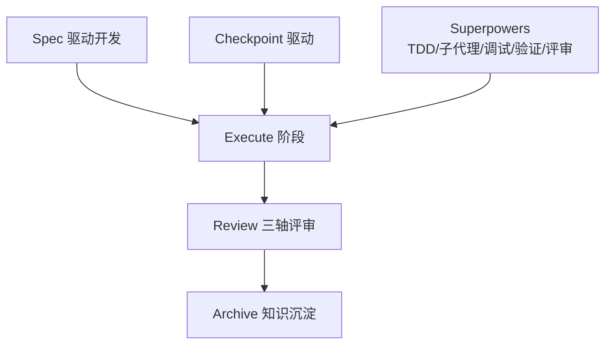

# Execute 执行阶段

<cite>
**本文引用的文件**
- [altas-workflow/SKILL.md](file://altas-workflow/SKILL.md)
- [altas-workflow/QUICKSTART.md](file://altas-workflow/QUICKSTART.md)
- [altas-workflow/workflow-diagrams.md](file://altas-workflow/workflow-diagrams.md)
- [altas-workflow/references/superpowers/test-driven-development/SKILL.md](file://altas-workflow/references/superpowers/test-driven-development/SKILL.md)
- [altas-workflow/references/superpowers/test-driven-development/testing-anti-patterns.md](file://altas-workflow/references/superpowers/test-driven-development/testing-anti-patterns.md)
- [altas-workflow/references/superpowers/systematic-debugging/SKILL.md](file://altas-workflow/references/superpowers/systematic-debugging/SKILL.md)
- [altas-workflow/references/superpowers/subagent-driven-development/SKILL.md](file://altas-workflow/references/superpowers/subagent-driven-development/SKILL.md)
- [altas-workflow/references/checkpoint-driven/modules.md](file://altas-workflow/references/checkpoint-driven/modules.md)
- [altas-workflow/references/superpowers/verification-before-completion/SKILL.md](file://altas-workflow/references/superpowers/verification-before-completion/SKILL.md)
- [altas-workflow/references/superpowers/executing-plans/SKILL.md](file://altas-workflow/references/superpowers/executing-plans/SKILL.md)
- [altas-workflow/references/superpowers/requesting-code-review/SKILL.md](file://altas-workflow/references/superpowers/requesting-code-review/SKILL.md)
</cite>

## 目录
1. [简介](#简介)
2. [项目结构](#项目结构)
3. [核心组件](#核心组件)
4. [架构总览](#架构总览)
5. [详细组件分析](#详细组件分析)
6. [依赖关系分析](#依赖关系分析)
7. [性能考虑](#性能考虑)
8. [故障排除指南](#故障排除指南)
9. [结论](#结论)
10. [附录](#附录)

## 简介
本文件聚焦 RIPER 工作流的 Execute 执行阶段，系统阐述 TDD 循环（RED→GREEN→REFACTOR）与持续集成实践，详解测试驱动开发的失败测试编写、最小代码实现与重构优化，以及执行阶段的质量保证机制（代码质量检查、测试覆盖率与性能验证）。文档还提供执行过程中的工具使用、流程控制与问题处理方法，并结合实际执行示例与 TDD 实践案例，帮助开发者掌握高效编码实践与持续改进方法。

## 项目结构
- Execute 阶段位于 ALTAS Workflow 的核心路径中，适用于 XS/S/M/L 各规模任务，其中 M/L 规模严格遵循 TDD 循环与两阶段 Review。
- 执行阶段以“单步推进、逐步验证”为纪律，禁止在一次对话轮次中实现多个 Checklist 项，确保上下文可控与质量稳定。
- 执行阶段与 Checkpoint 驱动、Superpowers（TDD/Subagent）、Spec 驱动开发协同，形成“输入准备→研究对齐→创新对比→详细规划→执行实现→审查归档”的闭环。

**图表来源**
- [altas-workflow/workflow-diagrams.md:155-169](file://altas-workflow/workflow-diagrams.md#L155-L169)
- [altas-workflow/SKILL.md:210-227](file://altas-workflow/SKILL.md#L210-L227)

**章节来源**
- [altas-workflow/SKILL.md:210-227](file://altas-workflow/SKILL.md#L210-L227)
- [altas-workflow/QUICKSTART.md:36-49](file://altas-workflow/QUICKSTART.md#L36-L49)

## 核心组件
- TDD 执行循环：RED→GREEN→REFACTOR，贯穿 M/L 执行阶段，确保“先测试、再实现、后重构”的质量基线。
- 子代理驱动（Subagent）：在 L 规模下，按任务拆分派发子代理，执行后进行“规范符合性审查→代码质量审查”的两阶段 Review。
- 质量门禁与证据优先：所有主张（完成、修复、通过）必须经“新鲜验证证据”确认，严禁主观断言。
- 系统化调试：在执行过程中遇到问题时，先进行根因调查，再形成假设与最小验证，最后修复根因而非症状。

**章节来源**
- [altas-workflow/SKILL.md:210-227](file://altas-workflow/SKILL.md#L210-L227)
- [altas-workflow/references/superpowers/subagent-driven-development/SKILL.md:1-278](file://altas-workflow/references/superpowers/subagent-driven-development/SKILL.md#L1-L278)
- [altas-workflow/references/superpowers/verification-before-completion/SKILL.md:1-140](file://altas-workflow/references/superpowers/verification-before-completion/SKILL.md#L1-L140)
- [altas-workflow/references/superpowers/systematic-debugging/SKILL.md:1-297](file://altas-workflow/references/superpowers/systematic-debugging/SKILL.md#L1-L297)

## 架构总览
下图展示 Execute 阶段在不同规模下的执行路径与质量门禁：

**图表来源**
- [altas-workflow/workflow-diagrams.md:45-67](file://altas-workflow/workflow-diagrams.md#L45-L67)
- [altas-workflow/SKILL.md:172-251](file://altas-workflow/SKILL.md#L172-L251)

## 详细组件分析

### TDD 循环与持续集成实践
- RED：编写失败测试，确保测试失败原因符合“缺少功能而非拼写错误”，并通过一次性运行验证失败。
- GREEN：实现最小可行代码，使测试通过，同时确保其他测试不受影响。
- REFACTOR：在保持测试绿色的前提下，消除重复、改善命名、提取辅助函数。
- 持续集成：每次实现后立即运行测试套件，确保构建与测试通过，避免技术债积累。

**图表来源**
- [altas-workflow/references/superpowers/test-driven-development/SKILL.md:47-197](file://altas-workflow/references/superpowers/test-driven-development/SKILL.md#L47-L197)

**章节来源**
- [altas-workflow/references/superpowers/test-driven-development/SKILL.md:1-372](file://altas-workflow/references/superpowers/test-driven-development/SKILL.md#L1-L372)

### 子代理驱动开发（L 规模并行执行）
- 每个任务派发“实现者子代理”，完成后进行“规范符合性审查子代理”与“代码质量审查子代理”的两阶段 Review。
- 两阶段审查顺序不可颠倒：必须先确认实现与 Spec 一致，再评估代码质量。
- 任务状态管理：DONE/DONE_WITH_CONCERNS/NEEDS_CONTEXT/BLOCKED 四类状态，分别对应继续、修正、补充上下文或重新调度。

**图表来源**
- [altas-workflow/references/superpowers/subagent-driven-development/SKILL.md:40-85](file://altas-workflow/references/superpowers/subagent-driven-development/SKILL.md#L40-L85)

**章节来源**
- [altas-workflow/references/superpowers/subagent-driven-development/SKILL.md:1-278](file://altas-workflow/references/superpowers/subagent-driven-development/SKILL.md#L1-L278)

### 质量保证机制
- 证据优先：Claim 任何完成/修复/通过状态前，必须运行验证命令并读取完整输出，确认后再做出断言。
- 三轴评审：Spec 质量与需求达成、Spec-代码一致性、代码内在质量（正确性、鲁棒性、可维护性、测试）。
- 代码质量检查：子代理驱动开发中，质量审查子代理对实现进行强度评估与问题反馈，实现者修正后复审直至通过。
- 测试覆盖率与性能验证：通过 TDD 循环与自动化测试确保覆盖率与回归稳定性；性能验证在验证阶段统一执行。

**图表来源**
- [altas-workflow/references/superpowers/verification-before-completion/SKILL.md:16-38](file://altas-workflow/references/superpowers/verification-before-completion/SKILL.md#L16-L38)
- [altas-workflow/SKILL.md:228-243](file://altas-workflow/SKILL.md#L228-L243)

**章节来源**
- [altas-workflow/references/superpowers/verification-before-completion/SKILL.md:1-140](file://altas-workflow/references/superpowers/verification-before-completion/SKILL.md#L1-L140)
- [altas-workflow/SKILL.md:228-243](file://altas-workflow/SKILL.md#L228-L243)

### 执行过程中的工具使用与流程控制
- IDE 原生工具调用建议：检索优先、读取其次、写入专用、任务跟踪；在 Plan/Execute 期间同步原子 Checklist。
- 执行纪律：严格禁止一次对话轮次实现多个 Checklist 项；“全部/all”仅在用户明确授权时批量执行。
- 偏差处理：发现偏差→先更新 Spec→再修代码→重对齐核心目标；编译错误可自动修复，逻辑变更必须回到 Plan。

**章节来源**
- [altas-workflow/SKILL.md:166-171](file://altas-workflow/SKILL.md#L166-L171)
- [altas-workflow/SKILL.md:219-224](file://altas-workflow/SKILL.md#L219-L224)

### 问题处理方法与系统化调试
- 系统化调试四阶段：根因调查→模式分析→假设与最小验证→实施修复；在修复前必须创建失败测试用例。
- 红灯信号：快速修复、多处同时修复、跳过测试、仅凭主观判断、多次修复无效等，均需返回根因调查。
- 与 TDD 结合：先写失败测试→再修复→验证通过→回归测试，确保问题不复现。

**图表来源**
- [altas-workflow/references/superpowers/systematic-debugging/SKILL.md:46-214](file://altas-workflow/references/superpowers/systematic-debugging/SKILL.md#L46-L214)

**章节来源**
- [altas-workflow/references/superpowers/systematic-debugging/SKILL.md:1-297](file://altas-workflow/references/superpowers/systematic-debugging/SKILL.md#L1-L297)

### 实际执行示例与 TDD 实践案例
- 示例场景：功能迭代（M 规模）→ Research→Plan→Execute（TDD 循环）→ Review；紧急修复（XS 规模）→ 直接执行→验证→1行 summary。
- TDD 实战：先写失败测试（明确行为、单一职责、真实代码）→ 验证失败→实现最小代码→验证通过→重构优化→下一测试。
- 反模式警示：测试 mock 行为、测试专用方法、过度 mock、不完整 mock、测试作为事后补救等，均违反 TDD 铁律。

**章节来源**
- [altas-workflow/QUICKSTART.md:52-116](file://altas-workflow/QUICKSTART.md#L52-L116)
- [altas-workflow/references/superpowers/test-driven-development/SKILL.md:290-326](file://altas-workflow/references/superpowers/test-driven-development/SKILL.md#L290-L326)
- [altas-workflow/references/superpowers/test-driven-development/testing-anti-patterns.md:1-300](file://altas-workflow/references/superpowers/test-driven-development/testing-anti-patterns.md#L1-L300)

## 依赖关系分析
- Execute 阶段依赖：
  - Spec 驱动开发：确保 Spec 是唯一真相源，执行前必须完成 Research/Plan 并获得批准。
  - Checkpoint 驱动：在执行中按需加载模块，避免常驻消耗 token。
  - Superpowers：TDD 铁律、子代理驱动、系统化调试、验证前完成、请求代码评审。
- 质量门禁与证据优先贯穿全流程，确保“Spec is Truth、Evidence First”。

**图表来源**
- [altas-workflow/SKILL.md:100-111](file://altas-workflow/SKILL.md#L100-L111)
- [altas-workflow/references/checkpoint-driven/modules.md:1-57](file://altas-workflow/references/checkpoint-driven/modules.md#L1-L57)

**章节来源**
- [altas-workflow/SKILL.md:100-111](file://altas-workflow/SKILL.md#L100-L111)
- [altas-workflow/references/checkpoint-driven/modules.md:1-57](file://altas-workflow/references/checkpoint-driven/modules.md#L1-L57)

## 性能考虑
- TDD 循环缩短反馈周期，减少调试成本与回归风险，提升整体交付效率。
- 子代理驱动开发在 L 规模下通过并行与两阶段 Review 提升迭代速度，同时降低上下文污染与沟通成本。
- 验证前完成机制避免虚假进度与返工，确保每次提交的质量基线。

## 故障排除指南
- 常见问题与对策：
  - AI 一次性输出过多代码：严格遵循检查点机制，每次只推进一步。
  - 任务极简但要求 TDD：使用 `>>` 触发 XS 模式跳过 TDD。
  - 中途干预计划：在检查点回复“[修改] + 意见”，AI 将调整 Plan 后重新请求 Approve。
  - 多人协作：Spec 是团队共享真相源，核心开发者 Review Plan，不必 Review 全部代码。
- 系统化调试：遇到问题先进行根因调查，再形成假设与最小验证，最后修复根因；修复前必须创建失败测试用例。

**章节来源**
- [altas-workflow/QUICKSTART.md:119-152](file://altas-workflow/QUICKSTART.md#L119-L152)
- [altas-workflow/references/superpowers/systematic-debugging/SKILL.md:16-45](file://altas-workflow/references/superpowers/systematic-debugging/SKILL.md#L16-L45)

## 结论
Execute 执行阶段以 TDD 循环为核心，结合子代理驱动与两阶段 Review，在 XS/S/M/L 各规模下实现高质量、可追溯、可复现的交付。通过证据优先与质量门禁，确保每次变更都有可验证的结果；通过系统化调试与反模式警示，避免常见陷阱。配合 Checkpoint 驱动与 Spec 驱动开发，形成从输入准备到知识沉淀的完整闭环，助力团队持续改进与规模化协作。

## 附录
- 触发词与模式映射：FAST/DEEP/MAP/MULTI/DEBUG/REVIEW/ARCHIVE/DOC 等触发词对应不同模式与入口，按需加载参考文档。
- 上下文装配策略：Hot/Warm/Cold 三层上下文按需加载，冲突/不确定时从磁盘重读完整 Spec。

**章节来源**
- [altas-workflow/workflow-diagrams.md:261-287](file://altas-workflow/workflow-diagrams.md#L261-L287)
- [altas-workflow/SKILL.md:350-366](file://altas-workflow/SKILL.md#L350-L366)