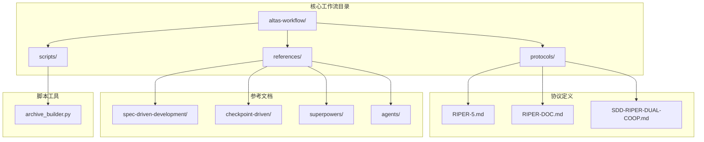
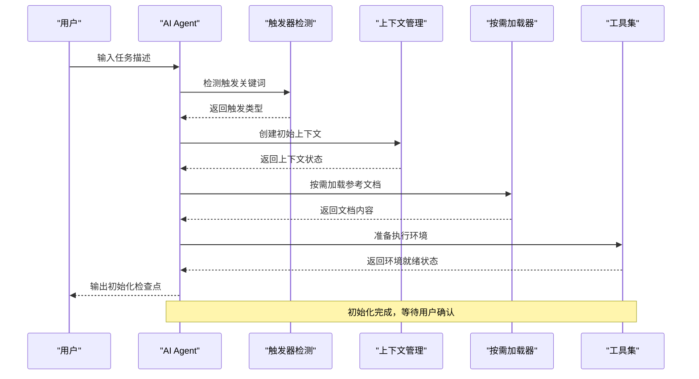
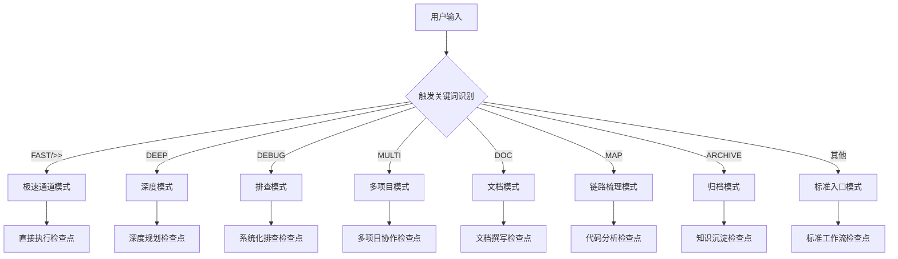
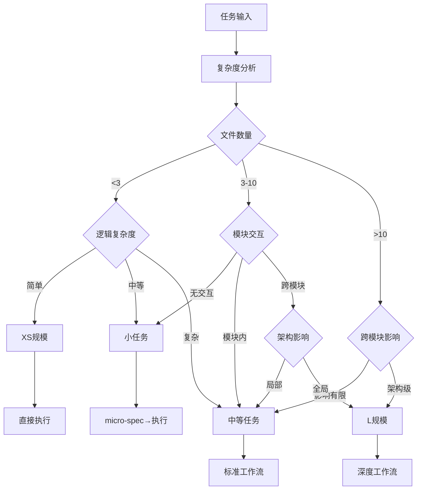
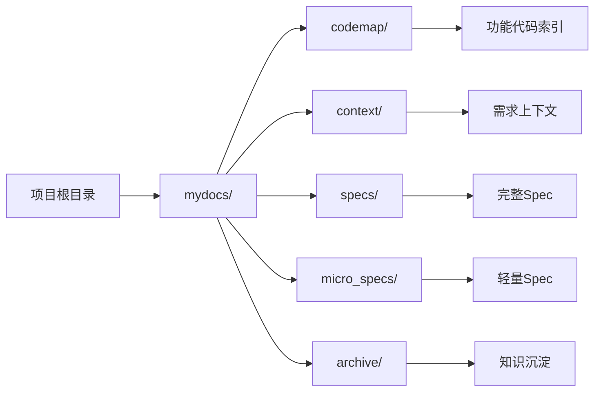
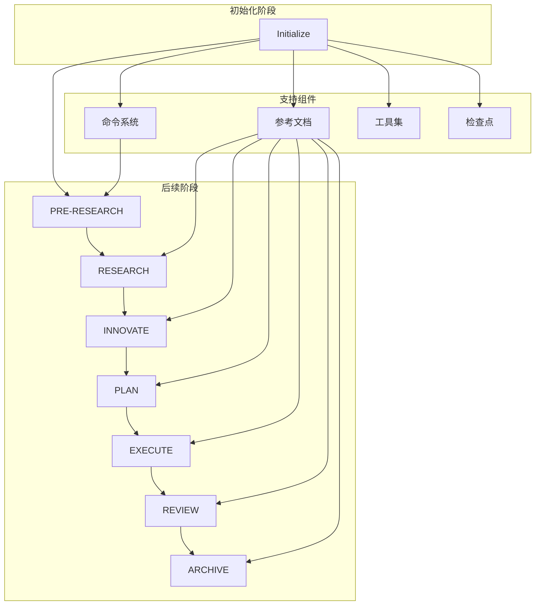
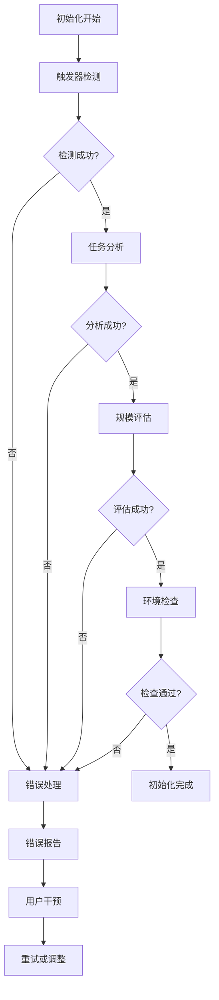

# Initialize 初始化阶段

<cite>
**本文档引用的文件**
- [RIPER-5.md](file://altas-workflow/protocols/RIPER-5.md)
- [QUICKSTART.md](file://altas-workflow/QUICKSTART.md)
- [SKILL.md](file://altas-workflow/SKILL.md)
- [reference-index.md](file://altas-workflow/reference-index.md)
- [commands.md](file://altas-workflow/references/spec-driven-development/commands.md)
- [modules.md](file://altas-workflow/references/checkpoint-driven/modules.md)
- [usage-examples.md](file://altas-workflow/references/spec-driven-development/usage-examples.md)
- [spec-template.md](file://altas-workflow/references/spec-driven-development/spec-template.md)
- [archive_builder.py](file://altas-workflow/scripts/archive_builder.py)
</cite>

## 目录
1. [简介](#简介)
2. [项目结构](#项目结构)
3. [核心组件](#核心组件)
4. [架构概览](#架构概览)
5. [详细组件分析](#详细组件分析)
6. [依赖关系分析](#依赖关系分析)
7. [性能考虑](#性能考虑)
8. [故障排除指南](#故障排除指南)
9. [结论](#结论)

## 简介

Initialize 初始化阶段是 RIPER 工作流的第一阶段，负责为整个开发流程建立基础框架和准备工作。该阶段的核心任务包括任务接收、规模评估、环境准备等关键步骤，确保后续各阶段能够顺利执行。

RIPER（Spec-Driven Development + Checkpoint-Driven + Superpowers）工作流是一个综合性的 AI 工作流程规范，融合了规范驱动开发、检查点驱动和超级能力三个核心要素。初始化阶段作为整个流程的起点，承担着至关重要的角色。

## 项目结构

Altas Workflow 项目采用模块化的组织方式，主要包含以下几个核心目录：

**图表来源**
- [SKILL.md:1-50](file://altas-workflow/SKILL.md#L1-L50)
- [reference-index.md:1-50](file://altas-workflow/reference-index.md#L1-L50)

**章节来源**
- [SKILL.md:1-100](file://altas-workflow/SKILL.md#L1-L100)
- [reference-index.md:1-100](file://altas-workflow/reference-index.md#L1-L100)

## 核心组件

### 初始化触发器

初始化阶段通过特定的触发关键词来激活，这些关键词包括：
- `FAST` - 极速通道
- `DEEP` - 深度模式
- `DEBUG` - 系统化排查
- `MULTI` - 多项目协作
- `DOC` - 文档专家
- `MAP` - 代码链路梳理
- `ARCHIVE` - 知识沉淀
- `>>` - 直接执行
- `sdd_bootstrap` - 标准入口

### 规模评估机制

系统根据任务的复杂度自动评估规模等级：

| 规模 | 触发条件 | 规模评估标准 | 工作流深度 |
|------|----------|--------------|------------|
| **XS** | typo/配置值，<10行 | 极小改动，单一文件 | 直接执行→验证→summary |
| **S** | 1-2文件，逻辑清晰 | 轻量改动，单一模块 | micro-spec→批准→执行→回写 |
| **M** | 3-10文件，模块内 | 中等复杂度，模块间交互 | Research→Plan→Execute(TDD)→Review |
| **L** | 跨模块，>500行，架构级 | 大规模改动，多模块协作 | Research→Innovate→Plan→Execute(TDD)→Subagent→Review→Archive |

### 环境准备要求

初始化阶段需要准备以下环境和资源：

1. **项目目录结构**：确保 `mydocs/` 目录存在，包含 `codemap/`、`context/`、`specs/`、`micro_specs/`、`archive/` 子目录
2. **测试框架**：确保项目支持一键测试（`npm test` / `pytest` / `go test`）
3. **工具链**：Git、Python 3.6+（用于归档脚本）、文件系统权限
4. **上下文工具**：代码检索、文件读取、任务跟踪工具

**章节来源**
- [SKILL.md:369-385](file://altas-workflow/SKILL.md#L369-L385)
- [QUICKSTART.md:7-33](file://altas-workflow/QUICKSTART.md#L7-L33)

## 架构概览

初始化阶段的架构设计遵循"按需加载"的原则，只在需要时才加载相应的参考文档和工具：

**图表来源**
- [SKILL.md:162-251](file://altas-workflow/SKILL.md#L162-L251)
- [reference-index.md:16-80](file://altas-workflow/reference-index.md#L16-L80)

## 详细组件分析

### 任务接收与分析

初始化阶段的任务接收机制具有以下特点：

#### 触发关键词识别
系统能够识别多种触发关键词，每种关键词对应不同的工作流模式：

**图表来源**
- [SKILL.md:69-81](file://altas-workflow/SKILL.md#L69-L81)
- [QUICKSTART.md:36-49](file://altas-workflow/QUICKSTART.md#L36-L49)

#### 任务复述与模式判断
初始化阶段会输出详细的任务复述，包括：
- 任务描述的准确复述
- 工作流模式的确定
- 规模等级的评估
- 是否需要只读分析的判断
- 执行许可的必要性
- 下一步行动的指导

### 规模评估算法

规模评估采用多层次的判断机制：

**图表来源**
- [SKILL.md:55-63](file://altas-workflow/SKILL.md#L55-L63)
- [QUICKSTART.md:155-169](file://altas-workflow/QUICKSTART.md#L155-L169)

### 环境准备与工具配置

初始化阶段需要准备的工作环境包括：

#### 目录结构准备

**图表来源**
- [QUICKSTART.md:17-28](file://altas-workflow/QUICKSTART.md#L17-L28)
- [SKILL.md:335-348](file://altas-workflow/SKILL.md#L335-L348)

#### 工具链配置
- **测试框架**：确保项目支持一键测试命令
- **代码检索**：使用原生搜索工具进行代码定位
- **文件读取**：精确读取关键文件内容
- **任务跟踪**：维护原子化的检查点清单

### 初始化检查清单

以下是初始化阶段的标准检查清单：

#### 基础环境检查
- [ ] 项目根目录存在
- [ ] `mydocs/` 目录结构完整
- [ ] 测试框架可用
- [ ] Git 仓库状态正常
- [ ] Python 环境可用（用于归档）

#### 触发器检测
- [ ] 触发关键词识别成功
- [ ] 任务模式正确判断
- [ ] 规模等级评估合理
- [ ] 执行许可需求确认

#### 上下文准备
- [ ] 初始上下文创建完成
- [ ] 相关参考文档按需加载
- [ ] 工具链配置就绪
- [ ] 产物命名约定确认

### 质量标准与前置条件

#### 质量标准
- **准确性**：任务描述的准确复述
- **完整性**：所有必要信息的完整呈现
- **一致性**：与后续阶段的无缝衔接
- **可执行性**：明确的下一步行动指导

#### 前置条件
- **触发条件满足**：用户输入符合触发关键词
- **环境条件满足**：工作环境准备就绪
- **工具条件满足**：所需工具可用
- **上下文条件满足**：初始上下文创建完成

**章节来源**
- [SKILL.md:114-126](file://altas-workflow/SKILL.md#L114-L126)
- [SKILL.md:369-385](file://altas-workflow/SKILL.md#L369-L385)

## 依赖关系分析

初始化阶段与其他工作流阶段存在密切的依赖关系：

**图表来源**
- [SKILL.md:162-251](file://altas-workflow/SKILL.md#L162-L251)
- [reference-index.md:16-80](file://altas-workflow/reference-index.md#L16-L80)

### 依赖关系特点

1. **单向依赖**：初始化阶段为后续所有阶段提供基础
2. **按需加载**：参考文档和工具只在需要时加载
3. **渐进式披露**：随着任务进展逐步暴露更多信息
4. **门禁控制**：严格的执行许可和验证机制

### 关键依赖组件

#### 命令系统
- `create_codemap`：生成代码索引地图
- `build_context_bundle`：整理需求上下文
- `sdd_bootstrap`：启动 RIPER 流程
- `review_spec`：规格评审
- `review_execute`：执行后评审
- `archive`：知识沉淀

#### 参考文档系统
- 规模评估参考
- 工作流快速参考
- 铁律门禁约束
- 模块化按需加载

**章节来源**
- [commands.md:1-97](file://altas-workflow/references/spec-driven-development/commands.md#L1-L97)
- [reference-index.md:109-173](file://altas-workflow/reference-index.md#L109-L173)

## 性能考虑

### 时间复杂度优化

初始化阶段的时间复杂度主要取决于以下因素：

1. **触发关键词识别**：O(n) - n为关键词数量
2. **任务分析**：O(m) - m为任务描述长度
3. **规模评估**：O(k) - k为评估维度数量
4. **环境检查**：O(p) - p为检查项目数量

### 空间复杂度优化

- **按需加载**：只加载当前需要的参考文档
- **渐进式上下文**：逐步构建和维护上下文
- **原子化检查点**：避免冗余信息存储

### 性能最佳实践

1. **早期终止**：在无法满足前置条件时及时终止
2. **缓存策略**：缓存常用参考文档内容
3. **并发处理**：在支持的情况下并行处理多个检查点
4. **增量更新**：只更新发生变化的上下文信息

## 故障排除指南

### 常见问题与解决方案

#### 触发器识别失败
**问题**：无法识别有效的触发关键词
**解决方案**：
- 检查输入格式是否正确
- 确认触发关键词拼写
- 参考触发词速查表

#### 规模评估偏差
**问题**：规模评估与预期不符
**解决方案**：
- 重新分析任务复杂度
- 考虑任务的潜在影响范围
- 必要时手动调整规模等级

#### 环境准备失败
**问题**：初始化环境检查失败
**解决方案**：
- 检查项目目录结构
- 验证工具链可用性
- 确认文件权限设置

### 错误处理机制

初始化阶段采用多层次的错误处理机制：

**图表来源**
- [SKILL.md:114-126](file://altas-workflow/SKILL.md#L114-L126)
- [SKILL.md:381-385](file://altas-workflow/SKILL.md#L381-L385)

### 调试技巧

1. **逐步验证**：逐个检查点验证功能
2. **日志记录**：详细记录初始化过程
3. **状态监控**：实时监控环境状态
4. **回滚机制**：提供初始化失败的回滚选项

**章节来源**
- [SKILL.md:114-126](file://altas-workflow/SKILL.md#L114-L126)
- [QUICKSTART.md:119-152](file://altas-workflow/QUICKSTART.md#L119-L152)

## 结论

Initialize 初始化阶段作为 RIPER 工作流的起点，承担着至关重要的基础性作用。通过精心设计的触发机制、智能的规模评估、完善的环境准备和严格的检查点控制，该阶段为整个工作流的成功执行奠定了坚实的基础。

初始化阶段的核心价值在于：
- **标准化入口**：提供统一的任务接收和处理机制
- **智能评估**：自动识别任务特征并选择合适的工作流深度
- **环境准备**：确保执行环境的完整性和可用性
- **质量保证**：通过多重检查点确保初始化质量

通过遵循本文档的指导原则和最佳实践，开发者可以高效地完成初始化任务，为后续的各个工作流阶段做好充分准备，最终实现高质量的软件开发和知识沉淀。