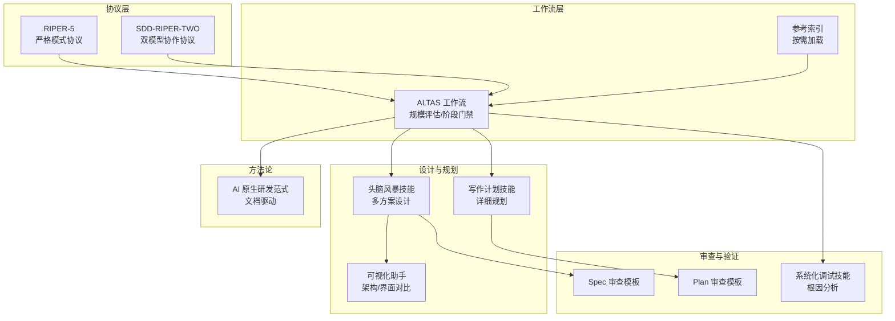
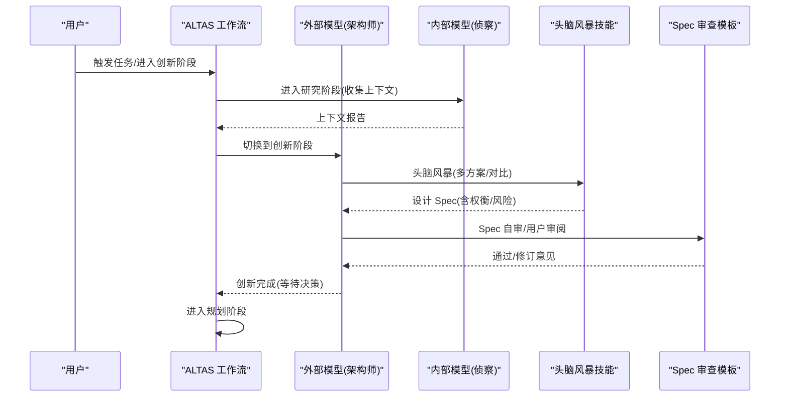
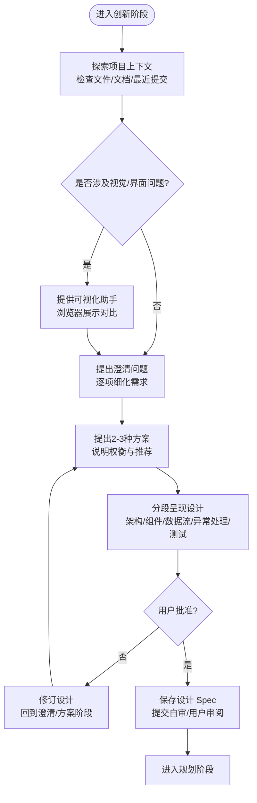
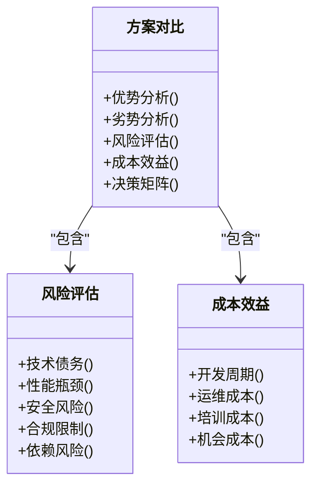
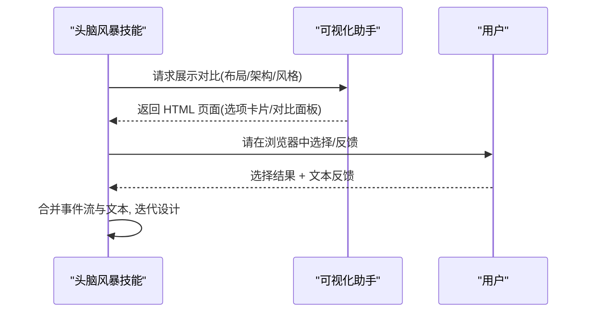
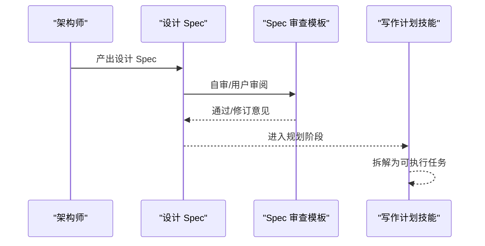
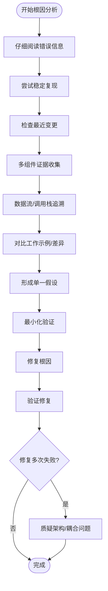
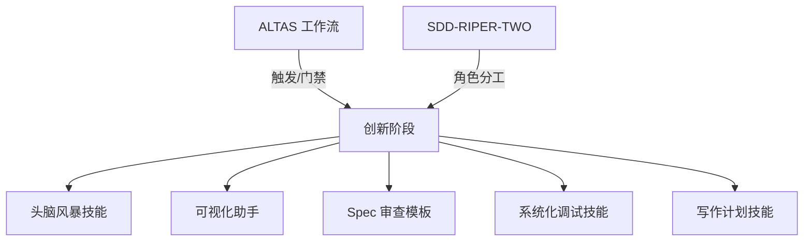

# Innovate 创新阶段

<cite>
**本文引用的文件**
- [RIPER-5](file://altas-workflow/protocols/RIPER-5.md)
- [SDD-RIPER-TWO](file://altas-workflow/protocols/SDD-RIPER-DUAL-COOP.md)
- [ALTAS 工作流](file://altas-workflow/SKILL.md)
- [参考索引](file://altas-workflow/reference-index.md)
- [头脑风暴技能](file://altas-workflow/references/superpowers/brainstorming/SKILL.md)
- [头脑风暴可视化助手](file://altas-workflow/references/superpowers/brainstorming/visual-companion.md)
- [头脑风暴 Spec 审查模板](file://altas-workflow/references/superpowers/brainstorming/spec-document-reviewer-prompt.md)
- [写作计划技能](file://altas-workflow/references/superpowers/writing-plans/SKILL.md)
- [写作计划审查模板](file://altas-workflow/references/superpowers/writing-plans/plan-document-reviewer-prompt.md)
- [系统化调试技能](file://altas-workflow/references/superpowers/systematic-debugging/SKILL.md)
- [AI 原生研发范式](file://altas-workflow/docs/AI-原生研发范式-从代码中心到文档驱动的演进.md)
</cite>

## 目录
1. [简介](#简介)
2. [项目结构](#项目结构)
3. [核心组件](#核心组件)
4. [架构概览](#架构概览)
5. [详细组件分析](#详细组件分析)
6. [依赖分析](#依赖分析)
7. [性能考虑](#性能考虑)
8. [故障排除指南](#故障排除指南)
9. [结论](#结论)
10. [附录](#附录)

## 简介
本文件面向 RIPER 工作流的 Innovate 创新阶段，系统化阐述如何在创新过程中进行多方案设计、技术选型与架构对比，以及如何建立可量化的评估标准与决策矩阵。文档结合 ALTAS 工作流与 SDD-RIPER 协议，提供从设计思维到可执行规划的完整方法论，帮助开发者掌握系统化创新思维与科学决策能力。

## 项目结构
围绕创新阶段，相关规范与参考分布在以下模块：
- 协议层：RIPER-5（严格模式协议）、SDD-RIPER-TWO（双模型协作）
- 工作流层：ALTAS 工作流（规模评估、阶段门禁、检查点）
- 设计与规划：头脑风暴技能、写作计划技能、可视化助手
- 审查与验证：Spec/Plan 审查模板、系统化调试技能
- 方法论：AI 原生研发范式文档

**图表来源**
- [ALTAS 工作流:162-252](file://altas-workflow/SKILL.md#L162-L252)
- [SDD-RIPER-TWO:76-154](file://altas-workflow/protocols/SDD-RIPER-DUAL-COOP.md#L76-L154)
- [RIPER-5:43-86](file://altas-workflow/protocols/RIPER-5.md#L43-L86)
- [头脑风暴技能:34-66](file://altas-workflow/references/superpowers/brainstorming/SKILL.md#L34-L66)
- [写作计划技能:25-45](file://altas-workflow/references/superpowers/writing-plans/SKILL.md#L25-L45)

**章节来源**
- [ALTAS 工作流:162-252](file://altas-workflow/SKILL.md#L162-L252)
- [参考索引:16-81](file://altas-workflow/reference-index.md#L16-L81)

## 核心组件
- 创新阶段（Innovate）职责：在严格模式下进行多方案头脑风暴，产出设计 Spec，不涉及具体实现细节。
- 设计思维工具：头脑风暴技能、可视化助手、Spec 审查模板。
- 规划衔接：创新完成后进入 Plan 阶段，将设计转化为可执行的详细规划。
- 评估与决策：通过 Pros/Cons/Risks/Effort 的系统化对比，形成决策矩阵与最终方案。

**章节来源**
- [RIPER-5:43-57](file://altas-workflow/protocols/RIPER-5.md#L43-L57)
- [头脑风暴技能:20-33](file://altas-workflow/references/superpowers/brainstorming/SKILL.md#L20-L33)
- [ALTAS 工作流:193-200](file://altas-workflow/SKILL.md#L193-L200)

## 架构概览
创新阶段在整体工作流中的位置与流转如下：

**图表来源**
- [SDD-RIPER-TWO:76-154](file://altas-workflow/protocols/SDD-RIPER-DUAL-COOP.md#L76-L154)
- [ALTAS 工作流:193-200](file://altas-workflow/SKILL.md#L193-L200)
- [头脑风暴技能:20-33](file://altas-workflow/references/superpowers/brainstorming/SKILL.md#L20-L33)
- [头脑风暴 Spec 审查模板:9-47](file://altas-workflow/references/superpowers/brainstorming/spec-document-reviewer-prompt.md#L9-L47)

## 详细组件分析

### 组件 A：创新阶段（Innovate）设计流程
创新阶段的核心目标是“在不进入实现的前提下，系统性探索多种可行方案”。流程要点：
- 严格模式约束：仅讨论可能性，禁止具体实现细节与代码编写。
- 多方案生成：至少提出 2-3 种技术/架构方案，涵盖优势、劣势、风险与所需努力。
- 设计文档化：将方案对比与推荐写入设计 Spec，供后续规划阶段使用。
- 审查与确认：通过 Spec 自审与用户审阅，确保设计清晰、无歧义、聚焦单一子系统。

**图表来源**
- [头脑风暴技能:34-66](file://altas-workflow/references/superpowers/brainstorming/SKILL.md#L34-L66)
- [头脑风暴技能:68-100](file://altas-workflow/references/superpowers/brainstorming/SKILL.md#L68-L100)
- [头脑风暴技能:107-137](file://altas-workflow/references/superpowers/brainstorming/SKILL.md#L107-L137)

**章节来源**
- [RIPER-5:43-57](file://altas-workflow/protocols/RIPER-5.md#L43-L57)
- [头脑风暴技能:20-33](file://altas-workflow/references/superpowers/brainstorming/SKILL.md#L20-L33)
- [ALTAS 工作流:193-200](file://altas-workflow/SKILL.md#L193-L200)

### 组件 B：方案对比与决策矩阵
在创新阶段，应建立结构化的对比与决策框架：
- 对比维度：技术可行性、成本/资源投入、风险等级、可维护性、扩展性、与现有架构契合度。
- 风险评估：识别技术债务、性能瓶颈、安全风险、合规限制与依赖风险。
- 成本效益：估算开发周期、运维成本、培训成本与机会成本。
- 决策矩阵：以评分或权重方式量化比较，形成“推荐方案 + 备选方案 + 风险缓解措施”。

**图表来源**
- [头脑风暴技能:80-92](file://altas-workflow/references/superpowers/brainstorming/SKILL.md#L80-L92)
- [ALTAS 工作流:193-200](file://altas-workflow/SKILL.md#L193-L200)

**章节来源**
- [头脑风暴技能:80-92](file://altas-workflow/references/superpowers/brainstorming/SKILL.md#L80-L92)
- [ALTAS 工作流:193-200](file://altas-workflow/SKILL.md#L193-L200)

### 组件 C：可视化设计与界面对比
当设计涉及界面布局、交互流程或系统架构时，可使用可视化助手进行对比与验证：
- 适用场景：UI 布局选择、组件关系图、数据流图、颜色/风格对比。
- 使用原则：每题单独判断“是否需要可视化”，避免滥用；以“是否通过视觉更易理解”为标准。
- 输出形态：HTML 页面 + 选项卡片/对比面板，支持多选与点击记录。

**图表来源**
- [头脑风暴可视化助手:5-26](file://altas-workflow/references/superpowers/brainstorming/visual-companion.md#L5-L26)
- [头脑风暴可视化助手:94-127](file://altas-workflow/references/superpowers/brainstorming/visual-companion.md#L94-L127)

**章节来源**
- [头脑风暴可视化助手:5-26](file://altas-workflow/references/superpowers/brainstorming/visual-companion.md#L5-L26)
- [头脑风暴可视化助手:94-127](file://altas-workflow/references/superpowers/brainstorming/visual-companion.md#L94-L127)

### 组件 D：设计 Spec 审查与规划衔接
创新完成后，设计需通过 Spec 审查模板进行自审与用户审阅，确保可进入规划阶段：
- 审查要点：完整性、一致性、清晰度、范围聚焦、YAGNI（删除不必要的特性）。
- 与规划衔接：设计 Spec 作为 Plan 阶段的输入，Plan 将进一步拆解为可执行的任务清单。

**图表来源**
- [头脑风暴 Spec 审查模板:9-47](file://altas-workflow/references/superpowers/brainstorming/spec-document-reviewer-prompt.md#L9-L47)
- [写作计划技能:25-45](file://altas-workflow/references/superpowers/writing-plans/SKILL.md#L25-L45)

**章节来源**
- [头脑风暴 Spec 审查模板:9-47](file://altas-workflow/references/superpowers/brainstorming/spec-document-reviewer-prompt.md#L9-L47)
- [写作计划技能:25-45](file://altas-workflow/references/superpowers/writing-plans/SKILL.md#L25-L45)

### 组件 E：系统化调试与根因分析（用于创新阶段的风险识别）
在创新阶段，可通过系统化调试技能进行“根因式”风险识别，避免表面化决策：
- 根因调查：错误信息、可重现性、最近变更、多组件证据收集。
- 模式分析：工作示例、差异对比、依赖关系、假设验证。
- 假设与测试：单一假设、最小化验证、失败后的架构质疑。
- 实施修复：以修复根因为目标，避免症状化处理。

**图表来源**
- [系统化调试技能:50-121](file://altas-workflow/references/superpowers/systematic-debugging/SKILL.md#L50-L121)
- [系统化调试技能:145-170](file://altas-workflow/references/superpowers/systematic-debugging/SKILL.md#L145-L170)
- [系统化调试技能:170-214](file://altas-workflow/references/superpowers/systematic-debugging/SKILL.md#L170-L214)

**章节来源**
- [系统化调试技能:50-121](file://altas-workflow/references/superpowers/systematic-debugging/SKILL.md#L50-L121)
- [系统化调试技能:145-170](file://altas-workflow/references/superpowers/systematic-debugging/SKILL.md#L145-L170)
- [系统化调试技能:170-214](file://altas-workflow/references/superpowers/systematic-debugging/SKILL.md#L170-L214)

## 依赖分析
创新阶段的依赖关系如下：
- ALTAS 工作流提供规模评估与阶段门禁，确保创新阶段在合适时机启动。
- SDD-RIPER-TWO 提供双模型协作框架，明确外部模型负责创新与规划，内部模型负责研究与执行。
- 头脑风暴技能与可视化助手为创新阶段提供设计工具链。
- Spec/Plan 审查模板与系统化调试技能为创新阶段的质量与风险控制提供保障。

**图表来源**
- [ALTAS 工作流:162-252](file://altas-workflow/SKILL.md#L162-L252)
- [SDD-RIPER-TWO:76-154](file://altas-workflow/protocols/SDD-RIPER-DUAL-COOP.md#L76-L154)
- [头脑风暴技能:20-33](file://altas-workflow/references/superpowers/brainstorming/SKILL.md#L20-L33)
- [写作计划技能:25-45](file://altas-workflow/references/superpowers/writing-plans/SKILL.md#L25-L45)

**章节来源**
- [ALTAS 工作流:162-252](file://altas-workflow/SKILL.md#L162-L252)
- [SDD-RIPER-TWO:76-154](file://altas-workflow/protocols/SDD-RIPER-DUAL-COOP.md#L76-L154)

## 性能考虑
- 创新阶段的“设计-审查-修订”循环应保持轻量与快速，避免陷入过度设计。
- 可视化助手仅在“视觉优先”的问题上使用，避免不必要的计算与延迟。
- 规模评估与阶段门禁有助于控制创新阶段的范围，防止范围蔓延。
- 通过系统化调试技能提前识别风险，可减少后期返工的成本与时间。

## 故障排除指南
- 症状：创新阶段停滞不前
  - 排查：是否已充分探索上下文、是否提出 2-3 种方案、是否进行可视化对比
  - 处理：回到头脑风暴流程，增加澄清问题与可视化对比
- 症状：设计 Spec 存在歧义或范围不清
  - 排查：Spec 审查模板的完整性/一致性检查
  - 处理：根据审查意见修订，直至满足“单一子系统、可验证、无歧义”
- 症状：风险识别不足导致后续规划困难
  - 排查：是否使用系统化调试技能进行根因分析
  - 处理：进行根因调查与模式分析，必要时质疑架构并提出重构建议

**章节来源**
- [头脑风暴 Spec 审查模板:17-34](file://altas-workflow/references/superpowers/brainstorming/spec-document-reviewer-prompt.md#L17-L34)
- [系统化调试技能:215-233](file://altas-workflow/references/superpowers/systematic-debugging/SKILL.md#L215-L233)

## 结论
创新阶段是 RIPER 工作流中承上启下的关键环节。通过严格模式约束、系统化设计工具与审查机制，创新阶段能够产出高质量的设计 Spec，并为后续规划与执行奠定坚实基础。结合 ALTAS 工作流的规模评估与阶段门禁，创新过程将更加可控、可验证、可追溯。

## 附录
- 实际创新案例与决策示例可参考以下文件：
  - [AI 原生研发范式:253-271](file://altas-workflow/docs/AI-原生研发范式-从代码中心到文档驱动的演进.md#L253-L271)
  - [参考索引:175-202](file://altas-workflow/reference-index.md#L175-L202)