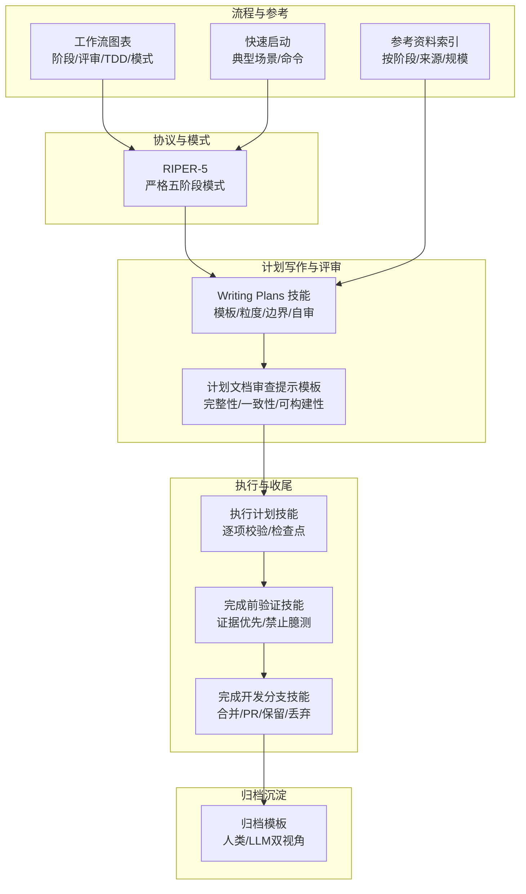
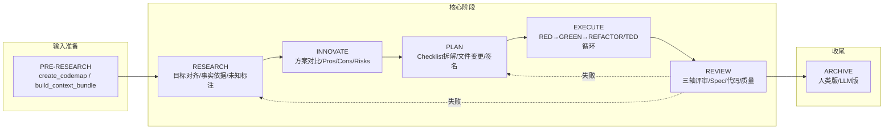
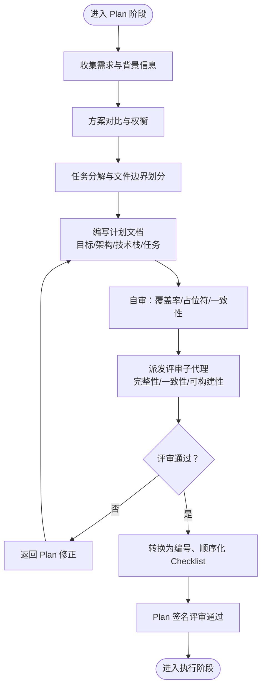
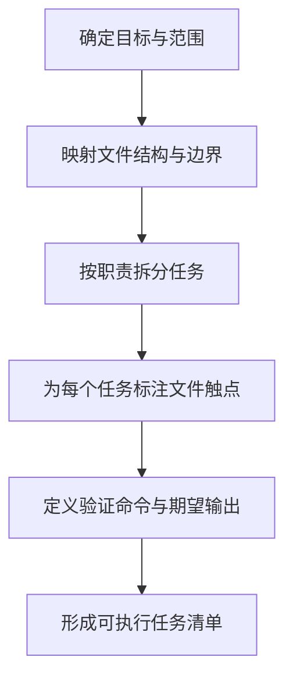
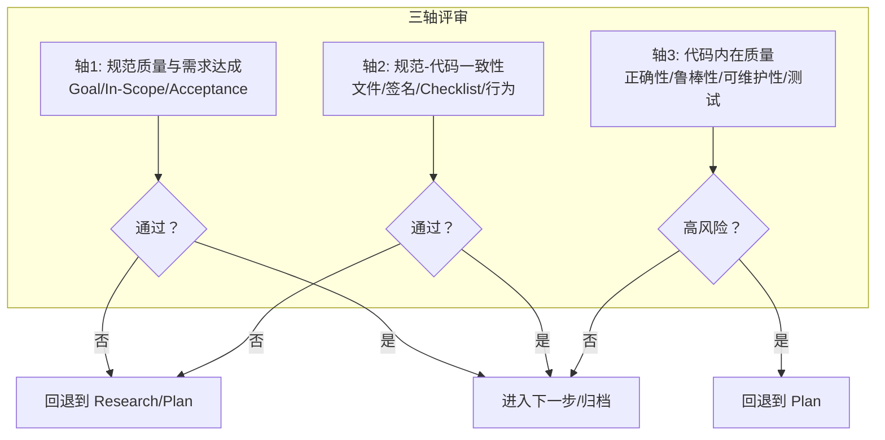
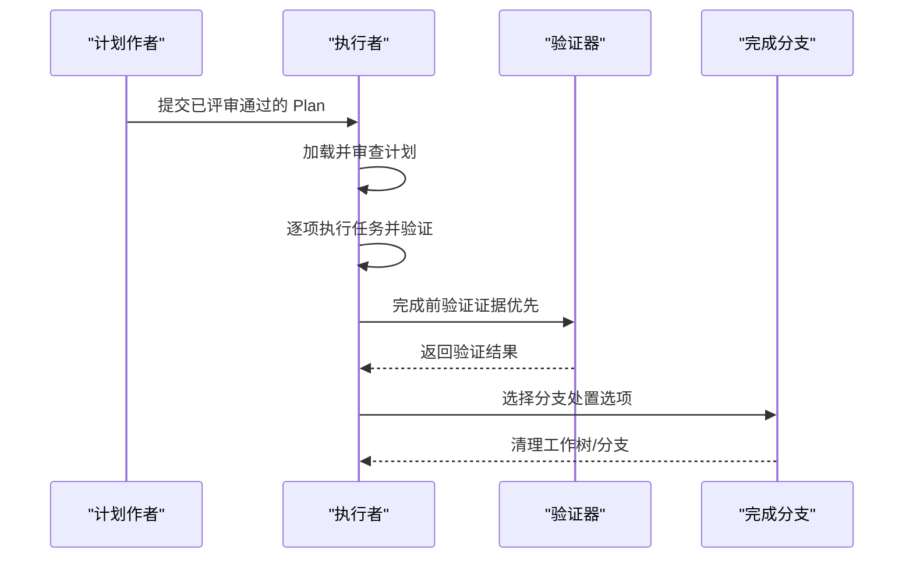
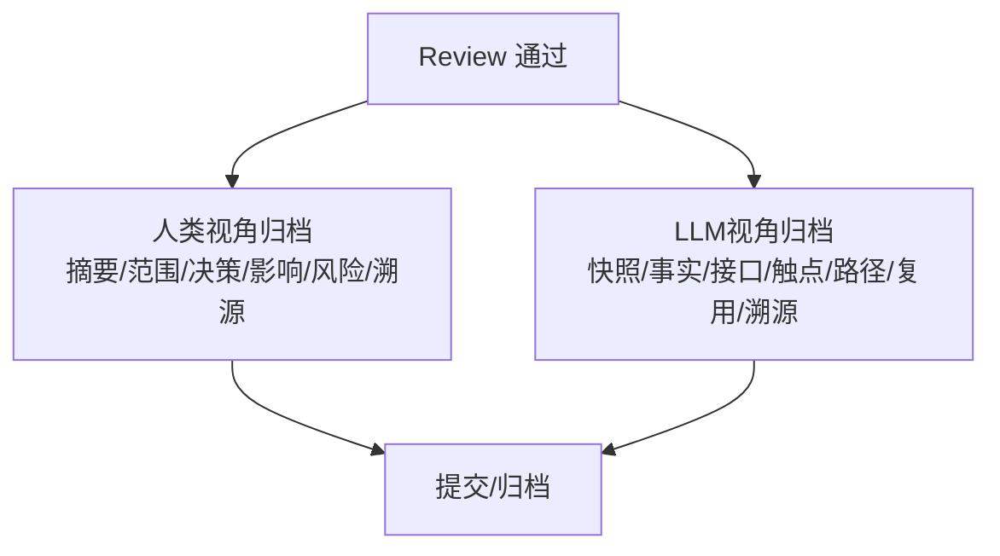
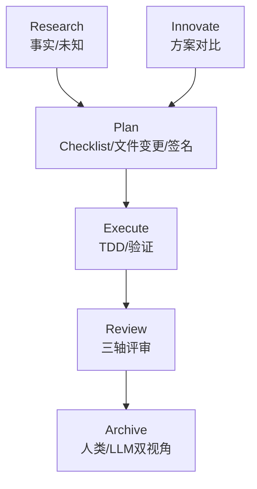

# Plan 计划阶段

<cite>
**本文引用的文件**
- [RIPER-5.md](file://altas-workflow/protocols/RIPER-5.md)
- [Writing Plans 技能.md](file://altas-workflow/references/superpowers/writing-plans/SKILL.md)
- [计划文档审查提示模板.md](file://altas-workflow/references/superpowers/writing-plans/plan-document-reviewer-prompt.md)
- [执行计划技能.md](file://altas-workflow/references/superpowers/executing-plans/SKILL.md)
- [完成开发分支技能.md](file://altas-workflow/references/superpowers/finishing-a-development-branch/SKILL.md)
- [完成前验证技能.md](file://altas-workflow/references/superpowers/verification-before-completion/SKILL.md)
- [归档模板.md](file://altas-workflow/references/spec-driven-development/archive-template.md)
- [工作流图表.md](file://altas-workflow/workflow-diagrams.md)
- [快速启动.md](file://altas-workflow/QUICKSTART.md)
- [参考资料索引.md](file://altas-workflow/reference-index.md)
</cite>

## 目录
1. [简介](#简介)
2. [项目结构](#项目结构)
3. [核心组件](#核心组件)
4. [架构总览](#架构总览)
5. [详细组件分析](#详细组件分析)
6. [依赖关系分析](#依赖关系分析)
7. [性能考量](#性能考量)
8. [故障排除指南](#故障排除指南)
9. [结论](#结论)
10. [附录](#附录)

## 简介
本文件面向 RIPER 工作流的 Plan（计划）阶段，系统化阐述如何将创新方案转化为可执行的详细计划，涵盖 Checklist 拆解、文件变更规划、签名与评审流程、质量标准与风险控制，并提供模板、工具与方法论，帮助开发者制定高质量的执行计划。

## 项目结构
围绕 Plan 阶段的关键文件与职责如下：
- 协议与模式
  - RIPER-5：定义严格的五阶段模式，其中 Plan 阶段要求产出“详尽技术规范”，并强制转换为编号、顺序化的 Checklist。
- 计划写作与评审
  - Writing Plans 技能：提供 Plan 的结构化模板、任务粒度、文件边界划分、No Placeholder 规则与自审清单。
  - 计划文档审查提示模板：用于派发评审子代理，明确审查维度（完整性、规范一致性、任务可构建性）。
- 执行与收尾
  - 执行计划技能：在无子代理平台上的 Plan 执行流程，强调逐项校验与检查点。
  - 完成前验证技能：完成节点前的证据优先原则，禁止未经验证的“完成声明”。
  - 完成开发分支技能：测试通过后的分支合并/PR/保留/丢弃选项与清理流程。
- 归档沉淀
  - 归档模板：以人类与 LLM 双视角沉淀成果，形成稳定事实、接口契约、代码触点与复用建议。
- 流程与参考
  - 工作流图表：阶段流程、三轴评审、TDD 循环、特殊模式映射等可视化。
  - 快速启动：典型场景与命令，体现 Plan 阶段在整体流程中的位置与产出形态。
  - 参考资料索引：按阶段/来源/规模的索引，便于按需加载。

**图表来源**
- [RIPER-5.md:59-86](file://altas-workflow/protocols/RIPER-5.md#L59-L86)
- [Writing Plans 技能.md:45-104](file://altas-workflow/references/superpowers/writing-plans/SKILL.md#L45-L104)
- [计划文档审查提示模板.md:9-47](file://altas-workflow/references/superpowers/writing-plans/plan-document-reviewer-prompt.md#L9-L47)
- [执行计划技能.md:16-38](file://altas-workflow/references/superpowers/executing-plans/SKILL.md#L16-L38)
- [完成前验证技能.md:16-38](file://altas-workflow/references/superpowers/verification-before-completion/SKILL.md#L16-L38)
- [完成开发分支技能.md:16-62](file://altas-workflow/references/superpowers/finishing-a-development-branch/SKILL.md#L16-L62)
- [归档模板.md:1-42](file://altas-workflow/references/spec-driven-development/archive-template.md#L1-L42)
- [工作流图表.md:45-67](file://altas-workflow/workflow-diagrams.md#L45-L67)
- [快速启动.md:36-48](file://altas-workflow/QUICKSTART.md#L36-L48)
- [参考资料索引.md:42-47](file://altas-workflow/reference-index.md#L42-L47)

**章节来源**
- [RIPER-5.md:59-86](file://altas-workflow/protocols/RIPER-5.md#L59-L86)
- [Writing Plans 技能.md:25-44](file://altas-workflow/references/superpowers/writing-plans/SKILL.md#L25-L44)
- [计划文档审查提示模板.md:1-49](file://altas-workflow/references/superpowers/writing-plans/plan-document-reviewer-prompt.md#L1-L49)
- [工作流图表.md:45-67](file://altas-workflow/workflow-diagrams.md#L45-L67)

## 核心组件
- 计划模板与结构
  - 计划头部包含目标、架构说明、技术栈；任务按“组件”组织，每个任务明确涉及的文件（创建/修改/测试）与步骤。
  - 任务步骤必须“可执行、可验证、可提交”，避免占位符与模糊描述。
- Checklist 强制化
  - Plan 阶段末尾必须将整个计划转换为编号、顺序化的 Checklist，确保执行阶段无需创造性决策。
- 文件变更规划
  - 明确文件边界与责任，遵循“小而专”的原则；变更文件应集中、相邻，减少耦合。
- 质量与评审
  - 自审清单覆盖规范覆盖率、占位符扫描、类型一致性；审查维度包括完整性、规范一致性、任务可构建性。
- 执行与验证
  - 执行阶段严格遵循 Plan 步骤，完成前进行证据验证，禁止臆测成功；完成后提供标准化的分支处置选项。

**章节来源**
- [Writing Plans 技能.md:45-104](file://altas-workflow/references/superpowers/writing-plans/SKILL.md#L45-L104)
- [RIPER-5.md:71-82](file://altas-workflow/protocols/RIPER-5.md#L71-L82)
- [计划文档审查提示模板.md:18-34](file://altas-workflow/references/superpowers/writing-plans/plan-document-reviewer-prompt.md#L18-L34)
- [完成前验证技能.md:16-38](file://altas-workflow/references/superpowers/verification-before-completion/SKILL.md#L16-L38)

## 架构总览
Plan 阶段在整体工作流中的位置与与其他阶段的关系如下：

**图表来源**
- [工作流图表.md:45-67](file://altas-workflow/workflow-diagrams.md#L45-L67)
- [快速启动.md:36-48](file://altas-workflow/QUICKSTART.md#L36-L48)

**章节来源**
- [工作流图表.md:45-67](file://altas-workflow/workflow-diagrams.md#L45-L67)
- [快速启动.md:36-48](file://altas-workflow/QUICKSTART.md#L36-L48)

## 详细组件分析

### 组件A：Checklist 拆解与签名流程
- Checklist 要求
  - 必须是“原子动作清单”，每项为具体、可验证的操作；最终以编号顺序呈现，确保执行阶段无需二次决策。
- 签名与评审
  - Plan 阶段结束即视为“签名”：Plan 通过评审后方可进入执行阶段；评审失败需返回 Plan 修正。
- 执行与偏差处理
  - 执行阶段严格按 Checklist 行事；若发现偏差，必须立即返回 Plan 修正后再进入执行。

**图表来源**
- [RIPER-5.md:59-86](file://altas-workflow/protocols/RIPER-5.md#L59-L86)
- [Writing Plans 技能.md:122-132](file://altas-workflow/references/superpowers/writing-plans/SKILL.md#L122-L132)
- [计划文档审查提示模板.md:18-34](file://altas-workflow/references/superpowers/writing-plans/plan-document-reviewer-prompt.md#L18-L34)

**章节来源**
- [RIPER-5.md:59-86](file://altas-workflow/protocols/RIPER-5.md#L59-L86)
- [Writing Plans 技能.md:122-132](file://altas-workflow/references/superpowers/writing-plans/SKILL.md#L122-L132)
- [计划文档审查提示模板.md:18-34](file://altas-workflow/references/superpowers/writing-plans/plan-document-reviewer-prompt.md#L18-L34)

### 组件B：文件变更规划与任务粒度
- 文件边界与职责
  - 每个文件应有清晰职责；变更文件应集中、相邻；遵循“按职责而非技术层”拆分。
- 任务粒度
  - 每个任务应是“可独立产出”的小步骤，便于验证与回滚；粒度以“2-5分钟”为宜。
- 代码与测试同步
  - 每个任务明确涉及的文件（创建/修改/测试），并在任务内给出可运行的命令与期望输出。

**图表来源**
- [Writing Plans 技能.md:25-44](file://altas-workflow/references/superpowers/writing-plans/SKILL.md#L25-L44)
- [Writing Plans 技能.md:63-104](file://altas-workflow/references/superpowers/writing-plans/SKILL.md#L63-L104)

**章节来源**
- [Writing Plans 技能.md:25-44](file://altas-workflow/references/superpowers/writing-plans/SKILL.md#L25-L44)
- [Writing Plans 技能.md:63-104](file://altas-workflow/references/superpowers/writing-plans/SKILL.md#L63-L104)

### 组件C：质量标准与风险控制
- 质量标准
  - 完整性：计划覆盖所有需求，无遗漏；无占位符与模糊描述。
  - 一致性：任务间类型、方法名、属性名一致；前后文引用匹配。
  - 可构建性：工程师可按计划直接执行，不被卡住。
- 风险控制
  - 评审阶段对“轴1/轴2/轴3”进行三轴评审；任一轴失败需回退至 Plan 或 Research 修正。
  - 完成前验证：严禁未经验证的“完成声明”，必须运行完整验证命令并读取输出后才可宣称完成。

**图表来源**
- [工作流图表.md:108-125](file://altas-workflow/workflow-diagrams.md#L108-L125)
- [完成前验证技能.md:16-38](file://altas-workflow/references/superpowers/verification-before-completion/SKILL.md#L16-L38)

**章节来源**
- [工作流图表.md:108-125](file://altas-workflow/workflow-diagrams.md#L108-L125)
- [完成前验证技能.md:16-38](file://altas-workflow/references/superpowers/verification-before-completion/SKILL.md#L16-L38)

### 组件D：执行阶段与完成前验证
- 执行流程
  - 加载并批判性审查计划；逐项执行并验证；完成后进入完成前验证。
- 完成前验证
  - 证据优先：在宣称任何状态或表达满足感之前，必须识别并运行证明该主张的命令，读取完整输出并确认。
- 分支处置
  - 测试通过后提供四种选项：本地合并、推送并创建 PR、保留分支、丢弃工作；严格遵循清理流程与确认机制。

**图表来源**
- [执行计划技能.md:16-38](file://altas-workflow/references/superpowers/executing-plans/SKILL.md#L16-L38)
- [完成前验证技能.md:24-38](file://altas-workflow/references/superpowers/verification-before-completion/SKILL.md#L24-L38)
- [完成开发分支技能.md:49-62](file://altas-workflow/references/superpowers/finishing-a-development-branch/SKILL.md#L49-L62)

**章节来源**
- [执行计划技能.md:16-38](file://altas-workflow/references/superpowers/executing-plans/SKILL.md#L16-L38)
- [完成前验证技能.md:24-38](file://altas-workflow/references/superpowers/verification-before-completion/SKILL.md#L24-L38)
- [完成开发分支技能.md:49-62](file://altas-workflow/references/superpowers/finishing-a-development-branch/SKILL.md#L49-L62)

### 组件E：归档沉淀与知识复用
- 人类视角归档
  - 包含摘要、范围与来源、关键决策、成果与业务影响、风险与后续建议、溯源链接。
- LLM 视角归档
  - 包含任务快照、稳定事实与约束、接口与契约、代码触点与热点、接受与拒绝路径、复用建议与常见坑位、溯源链接。
- 归档时机
  - Review 通过后进入 Archive，形成“唯一真相源”，沉淀经验与教训。

**图表来源**
- [归档模板.md:7-42](file://altas-workflow/references/spec-driven-development/archive-template.md#L7-L42)
- [归档模板.md:46-87](file://altas-workflow/references/spec-driven-development/archive-template.md#L46-L87)

**章节来源**
- [归档模板.md:7-42](file://altas-workflow/references/spec-driven-development/archive-template.md#L7-L42)
- [归档模板.md:46-87](file://altas-workflow/references/spec-driven-development/archive-template.md#L46-L87)

## 依赖关系分析
- Plan 阶段依赖
  - Research 阶段提供的事实与未知标注，确保 Plan 基于真实情况。
  - Innovate 阶段的方案对比结果，指导 Plan 的技术选型与边界划分。
  - Writing Plans 技能与计划审查模板，保障 Plan 的结构化与可评审性。
- 执行与收尾依赖
  - 执行计划技能依赖 Plan 的原子任务与验证命令；完成前验证技能确保“证据优先”；完成开发分支技能提供分支处置的标准化流程。
- 归档依赖
  - Review 三轴评审通过后，归档模板作为沉淀载体，形成可检索的知识资产。

**图表来源**
- [工作流图表.md:45-67](file://altas-workflow/workflow-diagrams.md#L45-L67)
- [Writing Plans 技能.md:21-34](file://altas-workflow/references/superpowers/writing-plans/SKILL.md#L21-L34)
- [完成前验证技能.md:16-38](file://altas-workflow/references/superpowers/verification-before-completion/SKILL.md#L16-L38)
- [完成开发分支技能.md:16-62](file://altas-workflow/references/superpowers/finishing-a-development-branch/SKILL.md#L16-L62)
- [归档模板.md:1-42](file://altas-workflow/references/spec-driven-development/archive-template.md#L1-L42)

**章节来源**
- [工作流图表.md:45-67](file://altas-workflow/workflow-diagrams.md#L45-L67)
- [Writing Plans 技能.md:21-34](file://altas-workflow/references/superpowers/writing-plans/SKILL.md#L21-L34)
- [完成前验证技能.md:16-38](file://altas-workflow/references/superpowers/verification-before-completion/SKILL.md#L16-L38)
- [完成开发分支技能.md:16-62](file://altas-workflow/references/superpowers/finishing-a-development-branch/SKILL.md#L16-L62)
- [归档模板.md:1-42](file://altas-workflow/references/spec-driven-development/archive-template.md#L1-L42)

## 性能考量
- 任务粒度与并行
  - 小而独立的任务更易并行执行；在具备子代理支持时，可按任务派发子代理，提高吞吐。
- 验证前置与回退成本
  - 完成前验证可显著降低后期返工成本；三轴评审失败回退至 Plan/Research，避免在错误方向上浪费资源。
- 工具链效率
  - 使用统一的验证命令与检查点机制，减少环境差异导致的阻塞；归档模板有助于快速检索历史经验，缩短下次迭代周期。

## 故障排除指南
- 常见问题
  - 计划含占位符或模糊描述：按自审清单修正，确保每步都有具体代码与命令。
  - 类型/方法名不一致：统一命名，确保前后文引用一致。
  - 评审不通过：根据评审意见回退 Plan，聚焦缺失需求或不可构建的任务。
  - 完成前臆测成功：必须运行完整验证命令并读取输出后才可宣称完成。
- 处理流程
  - 问题发现 → 回退 Plan/Research → 修正计划 → 重新评审 → 重新执行 → 完成前验证 → 分支处置 → 归档。

**章节来源**
- [Writing Plans 技能.md:122-132](file://altas-workflow/references/superpowers/writing-plans/SKILL.md#L122-L132)
- [计划文档审查提示模板.md:18-34](file://altas-workflow/references/superpowers/writing-plans/plan-document-reviewer-prompt.md#L18-L34)
- [完成前验证技能.md:52-62](file://altas-workflow/references/superpowers/verification-before-completion/SKILL.md#L52-L62)
- [完成开发分支技能.md:161-191](file://altas-workflow/references/superpowers/finishing-a-development-branch/SKILL.md#L161-L191)

## 结论
Plan 阶段是 RIPER 工作流的“蓝图与契约”。通过严格的 Checklist 拆解、明确的文件变更规划、可评审的质量标准与风险控制，以及完成前验证与标准化分支处置，能够将创新方案转化为可执行、可验证、可沉淀的高质量计划。配合归档模板，形成“唯一真相源”，持续提升团队交付效率与质量。

## 附录
- 计划模板与方法论要点
  - 计划头部：目标、架构、技术栈；任务按组件组织；每个任务明确文件触点与步骤。
  - 任务粒度：原子化、可验证、可提交；避免占位符与模糊描述。
  - 自审清单：规范覆盖率、占位符扫描、类型一致性。
  - Checklist 强制：编号、顺序化，执行阶段无需创造性决策。
- 实际示例与评审流程
  - 示例场景可参考快速启动中的 Size M 场景，体现 Plan → 批准 → 执行 → 评审的闭环。
  - 评审维度：完整性、规范一致性、任务可构建性；仅对真正阻碍实现的问题提出 Issue。

**章节来源**
- [Writing Plans 技能.md:45-104](file://altas-workflow/references/superpowers/writing-plans/SKILL.md#L45-L104)
- [计划文档审查提示模板.md:18-34](file://altas-workflow/references/superpowers/writing-plans/plan-document-reviewer-prompt.md#L18-L34)
- [快速启动.md:52-90](file://altas-workflow/QUICKSTART.md#L52-L90)