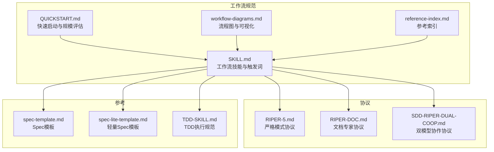
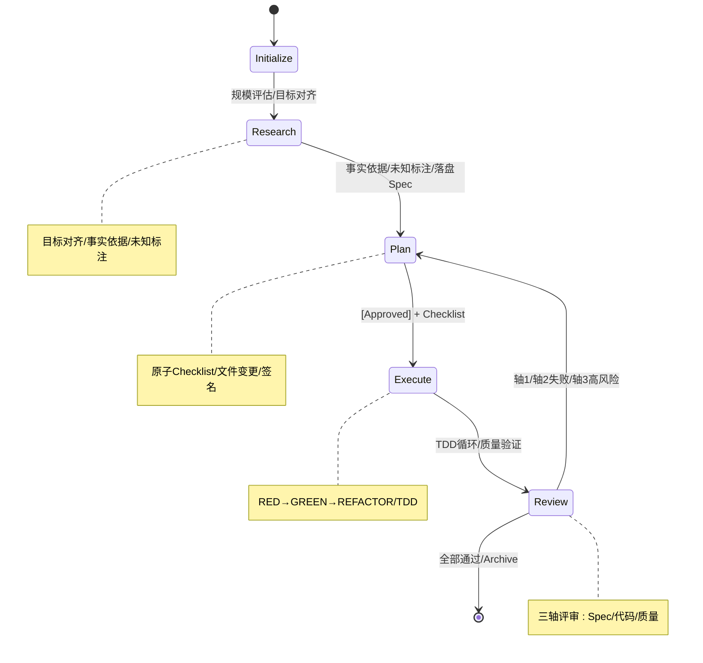
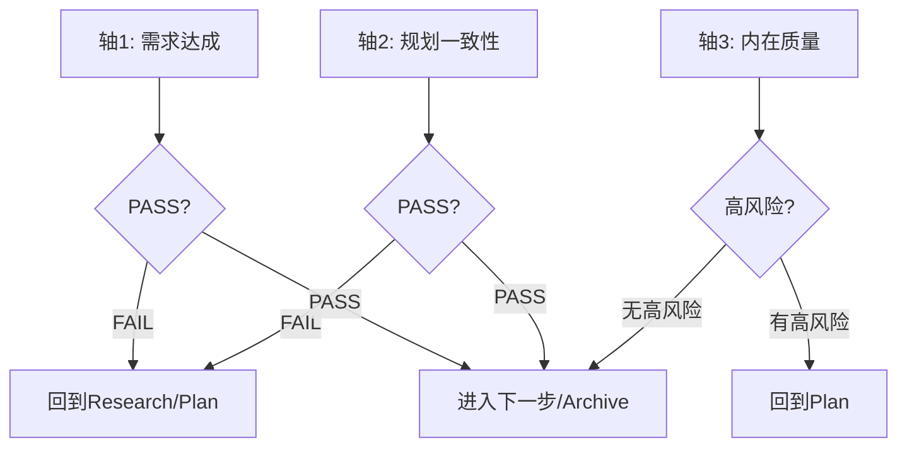
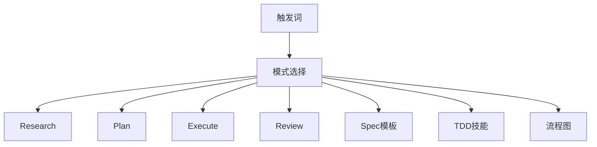
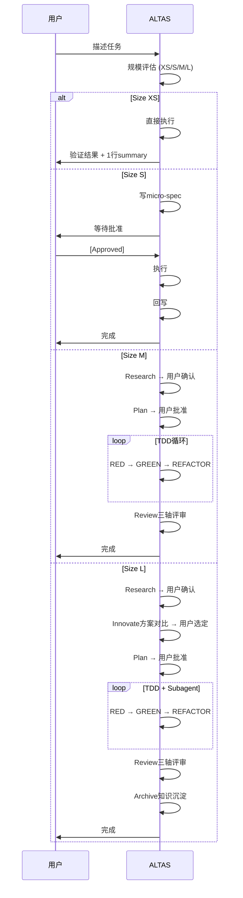
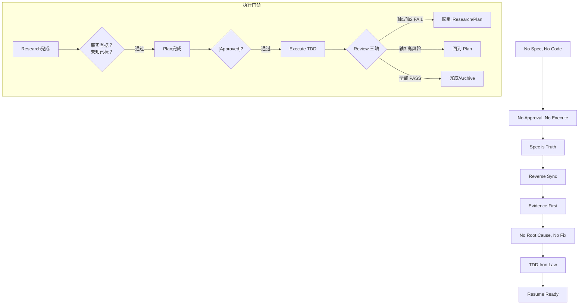

# RIPER 工作流

<cite>
**本文引用的文件**
- [RIPER-5.md](file://altas-workflow/protocols/RIPER-5.md)
- [RIPER-DOC.md](file://altas-workflow/protocols/RIPER-DOC.md)
- [SDD-RIPER-DUAL-COOP.md](file://altas-workflow/protocols/SDD-RIPER-DUAL-COOP.md)
- [workflow-diagrams.md](file://altas-workflow/workflow-diagrams.md)
- [QUICKSTART.md](file://altas-workflow/QUICKSTART.md)
- [SKILL.md](file://altas-workflow/SKILL.md)
- [reference-index.md](file://altas-workflow/reference-index.md)
- [spec-template.md](file://altas-workflow/references/spec-driven-development/spec-template.md)
- [spec-lite-template.md](file://altas-workflow/references/checkpoint-driven/spec-lite-template.md)
- [TDD-SKILL.md](file://altas-workflow/references/superpowers/test-driven-development/SKILL.md)
</cite>

## 目录
1. [简介](#简介)
2. [项目结构](#项目结构)
3. [核心组件](#核心组件)
4. [架构总览](#架构总览)
5. [详细阶段解析](#详细阶段解析)
6. [依赖关系分析](#依赖关系分析)
7. [性能与规模化考量](#性能与规模化考量)
8. [故障排查指南](#故障排查指南)
9. [结论](#结论)
10. [附录](#附录)

## 简介
本文件系统化阐述 RIPER 工作流的五个阶段：Initialize → Research → Plan → Execute → Review。结合仓库中的协议、技能与流程图，给出阶段目标、执行要求、相互关系、输出物与质量标准，并提供流程图、状态转换图与最佳实践，帮助开发者在不同规模任务中正确落地执行。

## 项目结构
仓库围绕“工作流规范 + 协议 + 参考资料 + 可视化图表”组织，核心包括：
- protocols：严格模式与双模型协作协议
- references：Spec 驱动、Checkpoint 驱动、Superpowers（TDD/Subagent 等）参考
- altas-workflow：工作流技能、快速启动、流程图与参考索引

**图表来源**
- [SKILL.md:1-358](file://altas-workflow/SKILL.md#L1-L358)
- [RIPER-5.md:1-187](file://altas-workflow/protocols/RIPER-5.md#L1-L187)
- [RIPER-DOC.md:1-66](file://altas-workflow/protocols/RIPER-DOC.md#L1-L66)
- [SDD-RIPER-DUAL-COOP.md:1-210](file://altas-workflow/protocols/SDD-RIPER-DUAL-COOP.md#L1-L210)
- [workflow-diagrams.md:1-338](file://altas-workflow/workflow-diagrams.md#L1-L338)
- [reference-index.md:1-210](file://altas-workflow/reference-index.md#L1-L210)

**章节来源**
- [SKILL.md:1-358](file://altas-workflow/SKILL.md#L1-L358)
- [workflow-diagrams.md:1-338](file://altas-workflow/workflow-diagrams.md#L1-L338)

## 核心组件
- 严格模式协议（RIPER-5）：定义五阶段模式与门禁，强调“无模式声明不输出、无批准不执行、偏差先修Spec再修代码”等铁律。
- 双模型协作协议（SDD-RIPER-DUAL-COOP）：External/Architect 与 Internal/Scout 角色分工，SPEC-CENTRIC 与 STOP-AND-WAIT 协作机制。
- 工作流技能（SKILL）：自动规模评估（XS/S/M/L）、阶段执行指南、检查点输出、特殊模式（FAST/DEBUG/MULTI/DOC/MAP/ARCHIVE）。
- 规模化流程图（workflow-diagrams）：三轴评审、TDD 循环、门禁与回退、大小任务甘特图。
- 参考模板与技能：Spec 模板、轻量 Spec、TDD 执行规范。

**章节来源**
- [RIPER-5.md:25-187](file://altas-workflow/protocols/RIPER-5.md#L25-L187)
- [SDD-RIPER-DUAL-COOP.md:76-210](file://altas-workflow/protocols/SDD-RIPER-DUAL-COOP.md#L76-L210)
- [SKILL.md:90-282](file://altas-workflow/SKILL.md#L90-L282)
- [workflow-diagrams.md:108-170](file://altas-workflow/workflow-diagrams.md#L108-L170)

## 架构总览
RIPER 工作流以“Spec 为中心”的状态机贯穿五阶段，配合证据优先与三轴评审，确保可验证、可回溯、可复用。

**图表来源**
- [SDD-RIPER-DUAL-COOP.md:76-153](file://altas-workflow/protocols/SDD-RIPER-DUAL-COOP.md#L76-L153)
- [workflow-diagrams.md:291-337](file://altas-workflow/workflow-diagrams.md#L291-L337)

## 详细阶段解析

### Initialize（初始化）
- 目标：接收任务，自动评估规模（XS/S/M/L），选择工作流深度，输出检查点。
- 关键要求：
  - 触发词：FAST/DEEP/DEBUG/MULTI/DOC/MAP/ARCHIVE/>>/sdd_bootstrap 等。
  - 规模判定：typo/配置值/小改动→XS；1-2文件→S；3-10文件→M；跨模块/架构级→L。
  - 输出：进度检查点（XS为1行summary；S为短checkpoint；M/L为完整检查点）。
- 输出物：任务理解、目标、下一步、规模与模式选择。
- 质量标准：明确触发词、清晰目标、可验证的下一步。

**章节来源**
- [SKILL.md:45-73](file://altas-workflow/SKILL.md#L45-L73)
- [SKILL.md:105-135](file://altas-workflow/SKILL.md#L105-L135)
- [QUICKSTART.md:36-49](file://altas-workflow/QUICKSTART.md#L36-L49)
- [workflow-diagrams.md:291-337](file://altas-workflow/workflow-diagrams.md#L291-L337)

### Research（研究对齐）
- 目标：目标对齐、事实依据收集、未知标注。
- 核心任务：
  - 复述任务目标，梳理现状，形成事实依据，标识未知项与风险。
  - 产出：在 Spec 中记录 Goal/In-Scope/Out-of-Scope/Facts/Risks/Open Questions。
  - 门禁：证据先行；未知项必须标注；在 Spec 落地前不得进入代码实现。
- 输出物：Research Findings、Open Questions、Next Actions、Codemap/Context Bundle 引用。
- 质量标准：需求边界清晰、事实可溯源、未知项可追踪。

**章节来源**
- [SKILL.md:156-163](file://altas-workflow/SKILL.md#L156-L163)
- [spec-template.md:40-47](file://altas-workflow/references/spec-driven-development/spec-template.md#L40-L47)
- [workflow-diagrams.md:45-67](file://altas-workflow/workflow-diagrams.md#L45-L67)

### Plan（详细规划）
- 目标：创建“像素级蓝图”，形成可执行的原子 Checklist。
- 核心任务：
  - 将任务拆解为原子动作，明确 File Changes、Signatures、Implementation Checklist。
  - 必须获得明确“[Approved]”才可进入 Execute。
  - 输出：Spec 中 Plan 部分（含文件变更、签名、Checklist、评审建议）。
- 输出物：完整 Plan（含评审矩阵与Ready Verdict）。
- 质量标准：无创造性决策、可验证、可回溯、可并行。

**章节来源**
- [RIPER-5.md:59-86](file://altas-workflow/protocols/RIPER-5.md#L59-L86)
- [SDD-RIPER-DUAL-COOP.md:117-128](file://altas-workflow/protocols/SDD-RIPER-DUAL-COOP.md#L117-L128)
- [spec-template.md:62-84](file://altas-workflow/references/spec-driven-development/spec-template.md#L62-L84)
- [SKILL.md:173-179](file://altas-workflow/SKILL.md#L173-L179)

### Execute（执行实现）
- 目标：严格按 Plan 实施，遵循 TDD 循环与单步执行纪律。
- 核心任务：
  - 单步执行：实现单项→输出检查点→请求 Review→获批后再执行下一项。
  - 批量执行：仅在用户明确授权（如“全部/All”）时批量执行。
  - 偏差处理：暴露偏差→先更新 Spec→再修代码→重对齐目标。
  - TDD 铁律：Size M/L 必须先写失败测试，再实现，再重构。
- 输出物：Execute Log、Checklist 完成状态、验证结果。
- 质量标准：100% 符合 Plan；测试驱动；无上下文超载。

**图表来源**
- [TDD-SKILL.md:47-69](file://altas-workflow/references/superpowers/test-driven-development/SKILL.md#L47-L69)
- [SKILL.md:182-199](file://altas-workflow/SKILL.md#L182-L199)

**章节来源**
- [RIPER-5.md:88-103](file://altas-workflow/protocols/RIPER-5.md#L88-L103)
- [TDD-SKILL.md:31-46](file://altas-workflow/references/superpowers/test-driven-development/SKILL.md#L31-L46)
- [SKILL.md:182-199](file://altas-workflow/SKILL.md#L182-L199)

### Review（三轴评审）
- 目标：系统化验证实现与 Spec 的一致性与内在质量。
- 三轴评审：
  - 轴1：Spec 质量与需求达成（Goal/In-Scope/Acceptance）。
  - 轴2：Spec-代码一致性（文件/签名/Checklist/行为）。
  - 轴3：代码内在质量（正确性/鲁棒性/可维护性/测试/关键风险）。
- 门禁逻辑：轴1/轴2 FAIL → 回到 Research/Plan；轴3高风险未解决 → 回到 Plan；全部 PASS → Archive。
- 输出物：Review Verdict（含整体结论、阻塞问题、回归风险、后续跟进）。
- 质量标准：零偏差容忍；证据优先；可追溯。

**图表来源**
- [workflow-diagrams.md:108-125](file://altas-workflow/workflow-diagrams.md#L108-L125)
- [spec-template.md:91-101](file://altas-workflow/references/spec-driven-development/spec-template.md#L91-L101)

**章节来源**
- [SKILL.md:200-215](file://altas-workflow/SKILL.md#L200-L215)
- [spec-template.md:91-101](file://altas-workflow/references/spec-driven-development/spec-template.md#L91-L101)

## 依赖关系分析
- 触发词与模式映射：FAST/DEEP/MAP/MULTI/DEBUG/DOC/ARCHIVE 等触发不同工作流深度与参考加载。
- 阶段间依赖：Research → Plan → Execute → Review，任一失败均回退到前序阶段。
- 参考加载：按需加载，避免一次性读取全部资料；核心参考集中在 Spec 模板、TDD 技能与流程图。

**图表来源**
- [SKILL.md:61-73](file://altas-workflow/SKILL.md#L61-L73)
- [reference-index.md:284-306](file://altas-workflow/reference-index.md#L284-L306)

**章节来源**
- [reference-index.md:16-81](file://altas-workflow/reference-index.md#L16-L81)
- [workflow-diagrams.md:261-287](file://altas-workflow/workflow-diagrams.md#L261-L287)

## 性能与规模化考量
- 规模评估与自动升降级：执行中发现复杂度超出预期→立即暂停，提议升级；用户可随时调整规模。
- 执行纪律：单步执行，避免上下文超载；批量执行需明确授权。
- 证据优先：完成由验证结果证明，非模型自宣布；TDD 铁律适用于 M/L。
- 上下文装配：Hot/Warm/Cold 分层，冲突/不确定时从磁盘重读完整 Spec。

**章节来源**
- [SKILL.md:56-60](file://altas-workflow/SKILL.md#L56-L60)
- [SKILL.md:191-196](file://altas-workflow/SKILL.md#L191-L196)
- [SKILL.md:325-341](file://altas-workflow/SKILL.md#L325-L341)

## 故障排查指南
- 常见问题与对策：
  - AI一次性输出过多代码：强调检查点机制，要求每次只推进一步。
  - 为什么先写测试：Evidence First + TDD 铁律；极简任务可用 “>>” 跳过 TDD。
  - 如何干预计划：在检查点回复“[修改] …”，AI 将调整 Plan 后重新请求 Approve。
  - 如何选择规模：ALTAS 自动评估；可强制指定或在执行中调整。
- 三轴评审失败回退：轴1/轴2 FAIL → 回到 Research/Plan；轴3高风险未解决 → 回到 Plan。

**章节来源**
- [QUICKSTART.md:119-152](file://altas-workflow/QUICKSTART.md#L119-L152)
- [workflow-diagrams.md:108-125](file://altas-workflow/workflow-diagrams.md#L108-L125)

## 结论
RIPER 工作流通过“严格模式 + 双模型协作 + 规模化流程 + 三轴评审 + TDD 铁律”，构建了可验证、可回溯、可复用的工程交付范式。开发者应：
- 以 Spec 为中心，先落盘再实现；
- 严格遵循阶段门禁与检查点机制；
- 用证据说话，用测试验证；
- 在复杂度上升时及时升级规模与模式。

## 附录

### 阶段流程与时序（大小任务差异）

**图表来源**
- [workflow-diagrams.md:291-337](file://altas-workflow/workflow-diagrams.md#L291-L337)

### 门禁与回退（证据优先与三轴评审）

**图表来源**
- [SKILL.md:90-102](file://altas-workflow/SKILL.md#L90-L102)
- [workflow-diagrams.md:71-104](file://altas-workflow/workflow-diagrams.md#L71-L104)

### 实际执行示例（来自快速启动）
- 日常功能迭代（Size M）：Research → Plan → Execute（TDD）→ Review。
- 紧急修复（Size XS）：直接修改→验证→1行summary。
- 架构重构（Size L）：Research → Innovate → Plan → Execute（TDD+Subagent）→ Review → Archive。
- Bug排查：DEBUG 模式（只读分析），输出症状/预期行为/根因候选/建议修复。

**章节来源**
- [QUICKSTART.md:52-116](file://altas-workflow/QUICKSTART.md#L52-L116)