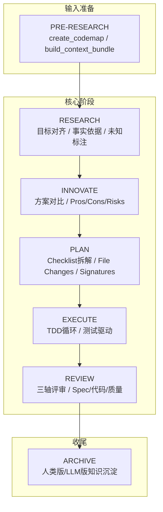
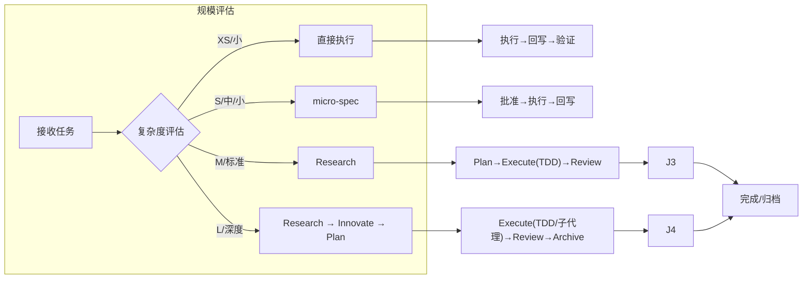
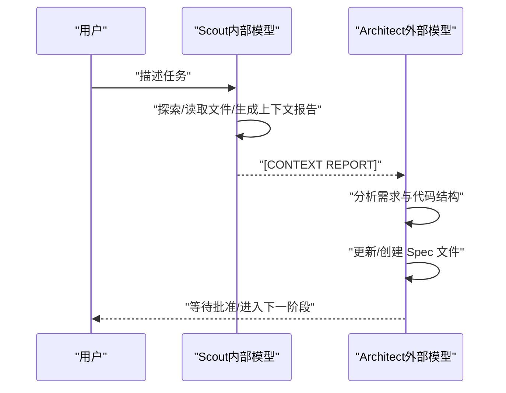
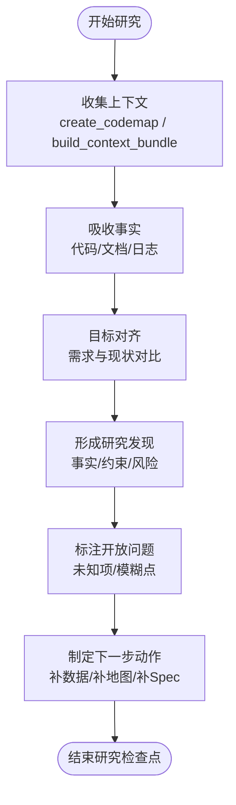
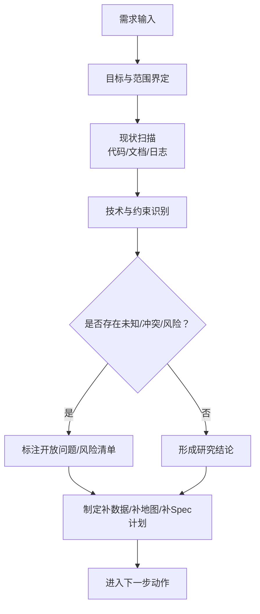
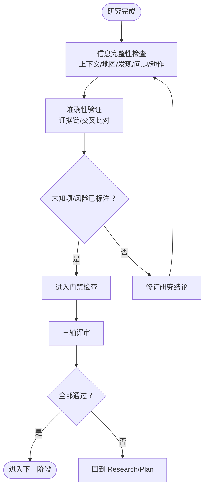
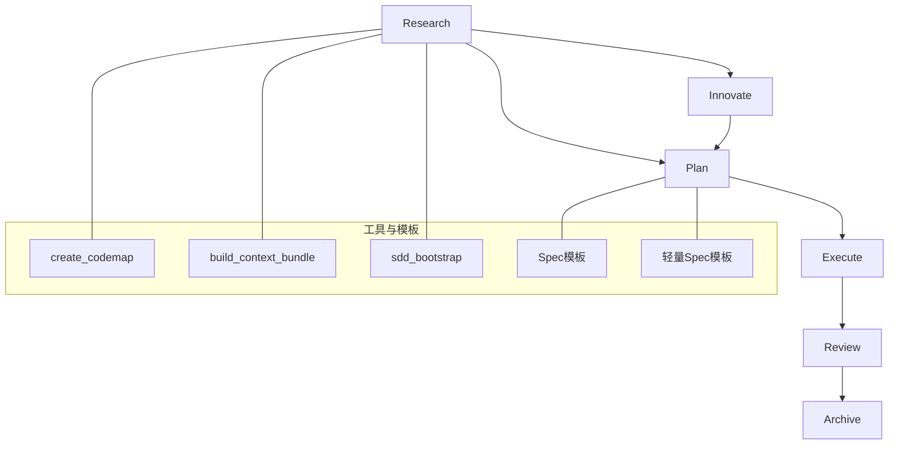

# Research 研究阶段

<cite>
**本文引用的文件**
- [RIPER-5.md](file://altas-workflow/protocols/RIPER-5.md)
- [SDD-RIPER-DUAL-COOP.md](file://altas-workflow/protocols/SDD-RIPER-DUAL-COOP.md)
- [workflow-diagrams.md](file://altas-workflow/workflow-diagrams.md)
- [reference-index.md](file://altas-workflow/reference-index.md)
- [QUICKSTART.md](file://altas-workflow/QUICKSTART.md)
- [spec-template.md](file://altas-workflow/references/spec-driven-development/spec-template.md)
- [spec-lite-template.md](file://altas-workflow/references/checkpoint-driven/spec-lite-template.md)
- [commands.md](file://altas-workflow/references/spec-driven-development/commands.md)
- [usage-examples.md](file://altas-workflow/references/spec-driven-development/usage-examples.md)
- [SKILL.md（Superpowers：头脑风暴）](file://altas-workflow/references/superpowers/brainstorming/SKILL.md)
- [spec-document-reviewer-prompt.md](file://altas-workflow/references/superpowers/brainstorming/spec-document-reviewer-prompt.md)
- [SKILL.md（Superpowers：写计划）](file://altas-workflow/references/superpowers/writing-plans/SKILL.md)
</cite>

## 目录
1. [简介](#简介)
2. [项目结构](#项目结构)
3. [核心组件](#核心组件)
4. [架构总览](#架构总览)
5. [详细组件分析](#详细组件分析)
6. [依赖分析](#依赖分析)
7. [性能考虑](#性能考虑)
8. [故障排除指南](#故障排除指南)
9. [结论](#结论)
10. [附录](#附录)

## 简介
本文件面向 RIPER 工作流的 Research（研究）阶段，系统化阐述研究阶段的目标对齐、事实依据收集与未知标注机制，以及如何进行需求分析、技术调研、上下文收集与问题识别。文档同时给出研究阶段的质量标准（信息完整性、准确性验证、未知项标注规范）、工具使用方法、数据收集策略与分析框架，并提供实际研究示例与最佳实践，帮助开发者高效开展研究并产出高质量研究成果。

## 项目结构
研究阶段位于 ALTAS Workflow 的标准工作流中，贯穿于 PRE-RESEARCH、RESEARCH、INNOVATE、PLAN、EXECUTE、REVIEW 等阶段之间。其核心目标是“以证据为基础的事实收集与目标对齐”，并通过最小 Spec 与上下文资产沉淀，为后续 Innovate/Plan/Execute/Review 提供可靠基础。

**图表来源**
- [workflow-diagrams.md: 45-67:45-67](file://altas-workflow/workflow-diagrams.md#L45-L67)

**章节来源**
- [workflow-diagrams.md: 45-67:45-67](file://altas-workflow/workflow-diagrams.md#L45-L67)
- [reference-index.md: 16-81:16-81](file://altas-workflow/reference-index.md#L16-L81)

## 核心组件
- 研究模式协议（RIPER-5）：定义 Research 模式的职责边界（仅信息收集）、输出格式与模式声明要求，确保研究阶段不越界进入规划或实现。
- 双模型协作协议（SDD-RIPER-DUAL-COOP）：明确“外部模型（Architect）+ 内部模型（Scout）”在 Research 阶段的角色分工与状态流转，保证“Scout 先事实、Architect 后 Spec”。
- 研究产物模板（Spec 模板/轻量 Spec）：提供标准化的“研究发现、开放问题、下一步动作、上下文来源”等结构，确保研究结论可追溯、可复用。
- 原生命令与工具链：create_codemap、build_context_bundle、sdd_bootstrap 等，支撑研究阶段的数据收集与上下文装配。
- 质量门禁与评审：Evidence First、No Spec, No Code、三轴评审等铁律，确保研究阶段的输入输出符合规范。

**章节来源**
- [RIPER-5.md: 27-42:27-42](file://altas-workflow/protocols/RIPER-5.md#L27-L42)
- [SDD-RIPER-DUAL-COOP.md: 78-105:78-105](file://altas-workflow/protocols/SDD-RIPER-DUAL-COOP.md#L78-L105)
- [spec-template.md: 10-115:10-115](file://altas-workflow/references/spec-driven-development/spec-template.md#L10-L115)
- [spec-lite-template.md: 5-85:5-85](file://altas-workflow/references/checkpoint-driven/spec-lite-template.md#L5-L85)
- [commands.md: 5-36:5-36](file://altas-workflow/references/spec-driven-development/commands.md#L5-L36)

## 架构总览
研究阶段在整体工作流中的位置如下：

**图表来源**
- [workflow-diagrams.md: 1-L41:1-41](file://altas-workflow/workflow-diagrams.md#L1-L41)

**章节来源**
- [workflow-diagrams.md: 1-L41:1-41](file://altas-workflow/workflow-diagrams.md#L1-L41)

## 详细组件分析

### 组件A：研究模式协议（RIPER-5）与双模型协作（SDD-RIPER-DUAL-COOP）
- 研究模式职责边界
  - 仅限信息收集与理解，禁止提出建议、规划或实现。
  - 输出必须以“观察与问题”为主，遵循模式声明格式。
- 双模型角色与状态
  - Scout（内部模型）负责探索、读取文件、生成上下文报告。
  - Architect（外部模型）负责基于事实提炼 Spec，必要时进入 Innovate。
  - 状态机：Scout（SCOUTING）→ Architect（LOCKED）→ Innovate/Plan（LOCKED/ACTIVE）→ Execute（ACTIVE）→ Review（LOCKED）。

**图表来源**
- [SDD-RIPER-DUAL-COOP.md: 78-105:78-105](file://altas-workflow/protocols/SDD-RIPER-DUAL-COOP.md#L78-L105)
- [RIPER-5.md: 27-42:27-42](file://altas-workflow/protocols/RIPER-5.md#L27-L42)

**章节来源**
- [RIPER-5.md: 27-42:27-42](file://altas-workflow/protocols/RIPER-5.md#L27-L42)
- [SDD-RIPER-DUAL-COOP.md: 78-105:78-105](file://altas-workflow/protocols/SDD-RIPER-DUAL-COOP.md#L78-L105)

### 组件B：研究产物模板与上下文装配
- 规范化研究输出
  - 使用 Spec 模板的“研究发现、开放问题、下一步动作、上下文来源、代码地图”等结构，确保研究结论可追溯、可复用。
  - 轻量 Spec 适用于 XS/S 任务，强调“完成定义 + 证明来源 + 执行批准”等关键字段。
- 上下文装配
  - create_codemap：生成功能级/项目级代码地图，聚焦入口、核心链路、依赖与风险。
  - build_context_bundle：从多源资料中提炼需求背景包（需求事实、业务规则、验收口径、约束、冲突点、开放问题）。
  - sdd_bootstrap：启动研究流程，产出首版 Spec，标注冲突与下一步动作。

**图表来源**
- [spec-template.md: 10-115:10-115](file://altas-workflow/references/spec-driven-development/spec-template.md#L10-L115)
- [spec-lite-template.md: 5-85:5-85](file://altas-workflow/references/checkpoint-driven/spec-lite-template.md#L5-L85)
- [commands.md: 5-36:5-36](file://altas-workflow/references/spec-driven-development/commands.md#L5-L36)

**章节来源**
- [spec-template.md: 10-115:10-115](file://altas-workflow/references/spec-driven-development/spec-template.md#L10-L115)
- [spec-lite-template.md: 5-85:5-85](file://altas-workflow/references/checkpoint-driven/spec-lite-template.md#L5-L85)
- [commands.md: 5-36:5-36](file://altas-workflow/references/spec-driven-development/commands.md#L5-L36)

### 组件C：需求分析、技术调研与问题识别
- 需求分析
  - 明确目标、范围与验收标准；区分 In-Scope/Out-of-Scope；溯源需求来源与设计参考。
- 技术调研
  - 识别技术栈、关键签名、潜在冲突与遗留问题；结合 CodeMap 与 Context Bundle 进行交叉验证。
- 问题识别
  - 将“未知项/模糊点/冲突/风险”显性化，形成开放问题清单，指导下一步行动。

**图表来源**
- [spec-template.md: 15-47:15-47](file://altas-workflow/references/spec-driven-development/spec-template.md#L15-L47)
- [usage-examples.md: 34-92:34-92](file://altas-workflow/references/spec-driven-development/usage-examples.md#L34-L92)

**章节来源**
- [spec-template.md: 15-47:15-47](file://altas-workflow/references/spec-driven-development/spec-template.md#L15-L47)
- [usage-examples.md: 34-92:34-92](file://altas-workflow/references/spec-driven-development/usage-examples.md#L34-L92)

### 组件D：质量标准与评审门禁
- 信息完整性
  - 研究阶段必须产出：上下文来源、代码地图、研究发现、开放问题、下一步动作。
- 准确性验证
  - 通过 Evidence First 与三轴评审（Spec 质量、Spec-代码一致性、代码内在质量）确保结论可验证。
- 未知项标注规范
  - 使用“开放问题”清单明确标注未知项、模糊点与风险，避免臆测与假设。

**图表来源**
- [workflow-diagrams.md: 71-125:71-125](file://altas-workflow/workflow-diagrams.md#L71-L125)
- [spec-template.md: 90-101:90-101](file://altas-workflow/references/spec-driven-development/spec-template.md#L90-L101)

**章节来源**
- [workflow-diagrams.md: 71-125:71-125](file://altas-workflow/workflow-diagrams.md#L71-L125)
- [spec-template.md: 90-101:90-101](file://altas-workflow/references/spec-driven-development/spec-template.md#L90-L101)

### 组件E：工具使用方法与数据收集策略
- 工具链
  - create_codemap：按功能/项目维度生成代码地图，聚焦入口、核心链路、依赖与风险。
  - build_context_bundle：从多源资料中提炼需求背景包，支持 Lite/Standard 两种级别。
  - sdd_bootstrap：启动研究流程，产出首版 Spec，标注冲突与下一步动作。
- 数据收集策略
  - 以“证据优先”为原则，优先读取代码、日志与历史 Spec；对图片/文档采用 OCR/结构化提炼。
  - 对信息不足场景，先产出 Lite 版，再迭代补全。

**章节来源**
- [commands.md: 5-36:5-36](file://altas-workflow/references/spec-driven-development/commands.md#L5-L36)
- [usage-examples.md: 34-92:34-92](file://altas-workflow/references/spec-driven-development/usage-examples.md#L34-L92)

### 组件F：分析框架与最佳实践
- 分析框架
  - 目标对齐：需求来源、目标、范围、验收标准。
  - 技术现状：技术栈、关键签名、潜在冲突、遗留问题。
  - 风险与不确定：未知项、模糊点、边界与回退策略。
- 最佳实践
  - 先事实、后决策：Scout 仅报告事实，Architect 基于事实写 Spec。
  - 渐进式披露：按需加载参考文件，避免全仓扫描。
  - 明确门禁：研究完成后必须通过“事实有据、未知已标”的门禁。

**章节来源**
- [SDD-RIPER-DUAL-COOP.md: 78-105:78-105](file://altas-workflow/protocols/SDD-RIPER-DUAL-COOP.md#L78-L105)
- [reference-index.md: 175-210:175-210](file://altas-workflow/reference-index.md#L175-L210)

## 依赖分析
研究阶段与其他阶段的耦合关系如下：

**图表来源**
- [workflow-diagrams.md: 45-67:45-67](file://altas-workflow/workflow-diagrams.md#L45-L67)
- [commands.md: 5-36:5-36](file://altas-workflow/references/spec-driven-development/commands.md#L5-L36)
- [spec-template.md: 10-115:10-115](file://altas-workflow/references/spec-driven-development/spec-template.md#L10-L115)
- [spec-lite-template.md: 5-85:5-85](file://altas-workflow/references/checkpoint-driven/spec-lite-template.md#L5-L85)

**章节来源**
- [workflow-diagrams.md: 45-67:45-67](file://altas-workflow/workflow-diagrams.md#L45-L67)
- [commands.md: 5-36:5-36](file://altas-workflow/references/spec-driven-development/commands.md#L5-L36)
- [spec-template.md: 10-115:10-115](file://altas-workflow/references/spec-driven-development/spec-template.md#L10-L115)
- [spec-lite-template.md: 5-85:5-85](file://altas-workflow/references/checkpoint-driven/spec-lite-template.md#L5-L85)

## 性能考虑
- 降低扫描成本：通过 create_codemap 生成代码地图，避免重复全仓扫描。
- 渐进式披露：仅在命中场景时按需加载参考文件，减少上下文膨胀。
- 明确门禁：研究阶段完成后才进入 Innovate/Plan，避免无效迭代。

## 故障排除指南
- 研究阶段常见问题
  - 未产出上下文地图/需求包：检查 create_codemap 与 build_context_bundle 的输入范围与输出路径。
  - 研究结论缺乏证据：回溯日志、代码与历史 Spec，补充证据链。
  - 开放问题未标注：使用“开放问题”清单逐项核对，确保未知项可见化。
- 评审门禁触发
  - 轴 1/轴 2 失败：回到 Research/Plan 修订。
  - 轴 3 高风险：回到 Plan 修订风险与回退策略。

**章节来源**
- [workflow-diagrams.md: 71-125:71-125](file://altas-workflow/workflow-diagrams.md#L71-L125)
- [usage-examples.md: 407-424:407-424](file://altas-workflow/references/spec-driven-development/usage-examples.md#L407-L424)

## 结论
研究阶段是 RIPER 工作流的“证据基石”。通过明确模式边界、规范化的研究产物模板、系统化的工具链与严格的门禁机制，研究阶段能够高效完成目标对齐、事实依据收集与未知标注，为后续 Innovate/Plan/Execute/Review 提供坚实基础。遵循 Evidence First 与三轴评审，有助于产出高质量、可验证的研究成果。

## 附录
- 实际研究示例与最佳实践可参考：
  - [使用示例（SDD-RIPER）:1-454](file://altas-workflow/references/spec-driven-development/usage-examples.md#L1-L454)
  - [原生命令参数:1-97](file://altas-workflow/references/spec-driven-development/commands.md#L1-L97)
  - [Spec 模板:1-297](file://altas-workflow/references/spec-driven-development/spec-template.md#L1-L297)
  - [轻量 Spec 模板:1-85](file://altas-workflow/references/checkpoint-driven/spec-lite-template.md#L1-L85)
  - [双模型协作协议:1-210](file://altas-workflow/protocols/SDD-RIPER-DUAL-COOP.md#L1-L210)
  - [研究模式协议（RIPER-5）:1-187](file://altas-workflow/protocols/RIPER-5.md#L1-L187)
  - [工作流流程图:1-338](file://altas-workflow/workflow-diagrams.md#L1-L338)
  - [快速启动方案:1-182](file://altas-workflow/QUICKSTART.md#L1-L182)
  - [Superpowers：头脑风暴技能:1-165](file://altas-workflow/references/superpowers/brainstorming/SKILL.md#L1-L165)
  - [Superpowers：写计划技能:1-153](file://altas-workflow/references/superpowers/writing-plans/SKILL.md#L1-L153)
  - [Spec 文档评审模板:1-50](file://altas-workflow/references/superpowers/brainstorming/spec-document-reviewer-prompt.md#L1-L50)