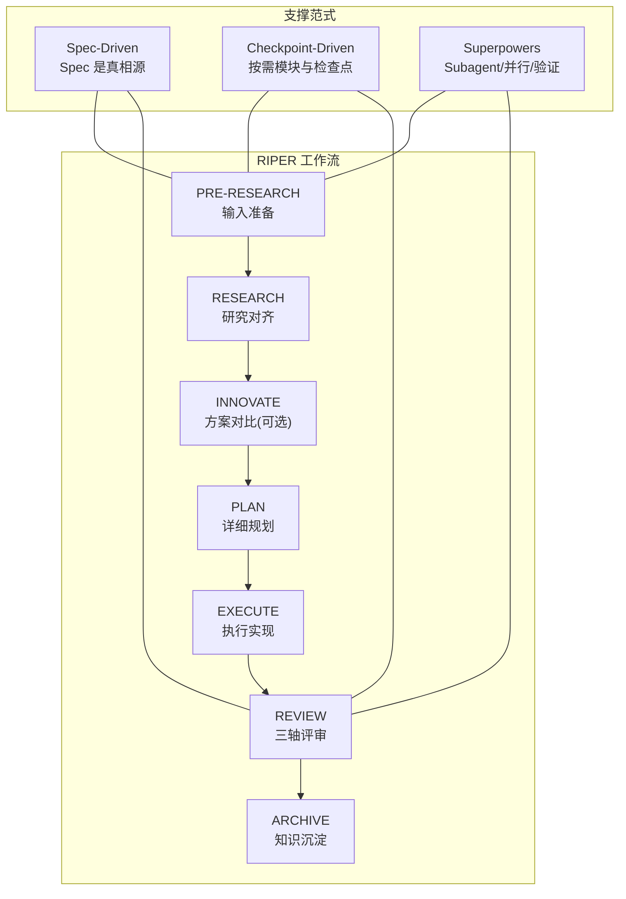
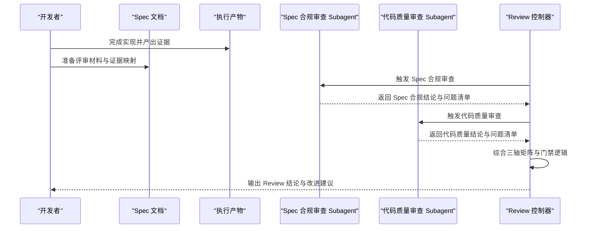
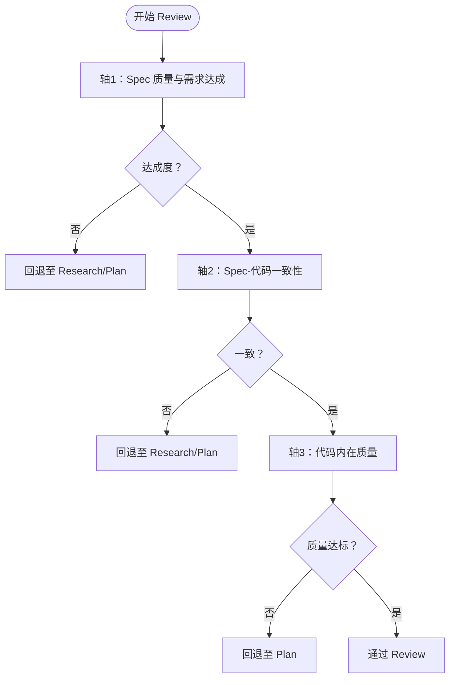
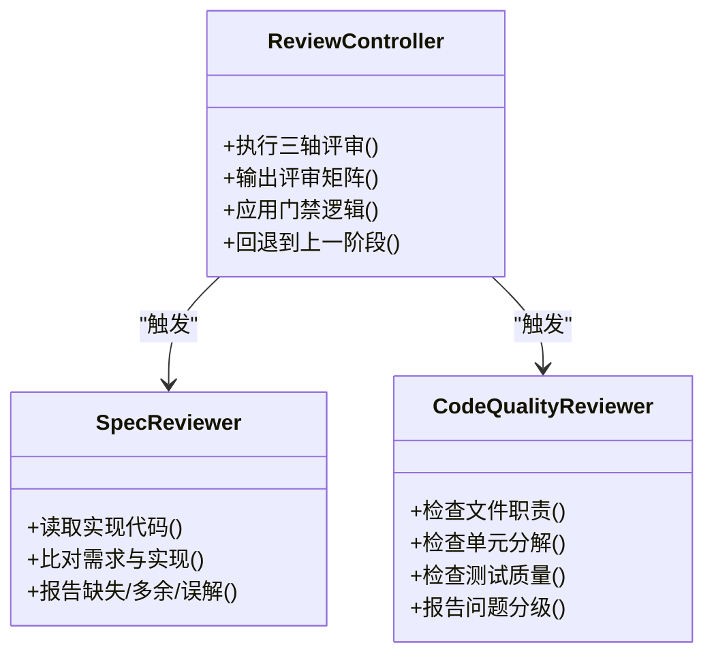
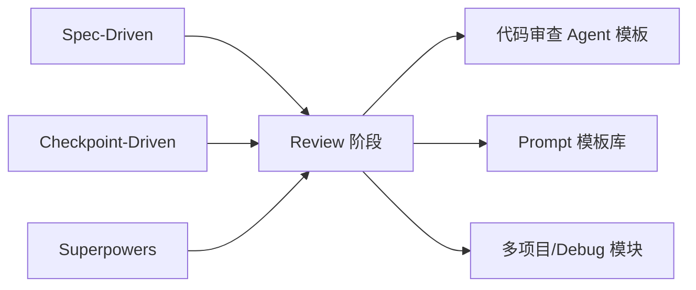

# Review 审查阶段

<cite>
**本文引用的文件**
- [altas-workflow/SKILL.md](file://altas-workflow/SKILL.md)
- [altas-workflow/protocols/RIPER-5.md](file://altas-workflow/protocols/RIPER-5.md)
- [altas-workflow/references/agents/code-reviewer.md](file://altas-workflow/references/agents/code-reviewer.md)
- [altas-workflow/references/agents/sdd-riper-one/SKILL.md](file://altas-workflow/references/agents/sdd-riper-one/SKILL.md)
- [altas-workflow/references/checkpoint-driven/modules.md](file://altas-workflow/references/checkpoint-driven/modules.md)
- [altas-workflow/references/superpowers/subagent-driven-development/spec-reviewer-prompt.md](file://altas-workflow/references/superpowers/subagent-driven-development/spec-reviewer-prompt.md)
- [altas-workflow/references/superpowers/subagent-driven-development/code-quality-reviewer-prompt.md](file://altas-workflow/references/superpowers/subagent-driven-development/code-quality-reviewer-prompt.md)
- [altas-workflow/references/superpowers/writing-plans/plan-document-reviewer-prompt.md](file://altas-workflow/references/superpowers/writing-plans/plan-document-reviewer-prompt.md)
- [altas-workflow/reference-index.md](file://altas-workflow/reference-index.md)
</cite>

## 目录
1. [简介](#简介)
2. [项目结构](#项目结构)
3. [核心组件](#核心组件)
4. [架构总览](#架构总览)
5. [详细组件分析](#详细组件分析)
6. [依赖分析](#依赖分析)
7. [性能考虑](#性能考虑)
8. [故障排除指南](#故障排除指南)
9. [结论](#结论)
10. [附录](#附录)

## 简介
本文件面向 RIPER 工作流的 Review 审查阶段，系统化阐述三轴评审体系与流程标准，覆盖：
- 三轴评审维度：Spec 质量与需求达成、Spec-代码一致性、代码内在质量
- 审查流程与标准：评审准备、评审执行、问题跟踪与闭环
- 质量控制机制：问题分类、风险评估、改进措施
- 工具、检查清单与沟通方法：Subagent 审查、Prompt 模板、评审矩阵
- 实战示例与问题处理案例：帮助开发者掌握质量保证与团队协作

## 项目结构
Review 审查阶段位于 RIPER 工作流的“执行-审查”闭环末端，与 Spec-Driven、Checkpoint-Driven、Superpowers 三大范式协同，确保“以 Spec 为中心、以证据为依据、以质量为目标”的交付。

图表来源
- [altas-workflow/SKILL.md:228-242](file://altas-workflow/SKILL.md#L228-L242)
- [altas-workflow/references/agents/sdd-riper-one/SKILL.md:24-26](file://altas-workflow/references/agents/sdd-riper-one/SKILL.md#L24-L26)

章节来源
- [altas-workflow/SKILL.md:162-252](file://altas-workflow/SKILL.md#L162-L252)
- [altas-workflow/references/agents/sdd-riper-one/SKILL.md:19-26](file://altas-workflow/references/agents/sdd-riper-one/SKILL.md#L19-L26)

## 核心组件
- 三轴评审矩阵（M/L 必须输出）：Spec 质量与需求达成、Spec-代码一致性、代码内在质量
- 评审门禁逻辑：任一轴 FAIL 则回退至 Research/Plan；代码内在质量高风险未解决亦回退
- Subagent 审查子流程：Spec 合规审查、代码质量审查、计划文档审查（可选）
- 检查点与证据：每次审查均需输出评审结论与证据映射，形成可追溯的 Review Matrix

章节来源
- [altas-workflow/SKILL.md:228-242](file://altas-workflow/SKILL.md#L228-L242)
- [altas-workflow/references/checkpoint-driven/modules.md:31-43](file://altas-workflow/references/checkpoint-driven/modules.md#L31-L43)

## 架构总览
Review 阶段的系统化架构围绕“证据驱动的三轴评审”展开，结合 Subagent 的并行审查能力，形成“Spec-代码-质量”三位一体的验证闭环。

图表来源
- [altas-workflow/SKILL.md:228-242](file://altas-workflow/SKILL.md#L228-L242)
- [altas-workflow/references/superpowers/subagent-driven-development/spec-reviewer-prompt.md:1-62](file://altas-workflow/references/superpowers/subagent-driven-development/spec-reviewer-prompt.md#L1-L62)
- [altas-workflow/references/superpowers/subagent-driven-development/code-quality-reviewer-prompt.md:1-27](file://altas-workflow/references/superpowers/subagent-driven-development/code-quality-reviewer-prompt.md#L1-L27)

## 详细组件分析

### 三轴评审体系
- 轴1：Spec 质量与需求达成
  - 关注点：目标完整性、需求达成度、验收标准可验证性
  - 评审方式：对照 Spec 的 Goal/In-Scope/Acceptance，逐条核验
- 轴2：Spec-代码一致性
  - 关注点：文件、签名、Checklist、行为与 Plan 一致
  - 评审方式：逐项比对 Plan 与实际改动，标记偏差
- 轴3：代码内在质量
  - 关注点：正确性、鲁棒性、可维护性、测试与关键风险
  - 评审方式：代码质量审查 Subagent + 人工复核

图表来源
- [altas-workflow/SKILL.md:230-240](file://altas-workflow/SKILL.md#L230-L240)

章节来源
- [altas-workflow/SKILL.md:228-242](file://altas-workflow/SKILL.md#L228-L242)

### 评审准备
- 准备材料
  - 完整 Spec（含 Plan、Checklist、验收标准）
  - 执行产物证据（代码、测试、变更摘要）
  - 证据映射（Trace to Sources）
- 触发条件
  - Execute 阶段完成后，或用户要求评审
  - L 规模可启用两阶段 Review 与 Subagent 并行审查

章节来源
- [altas-workflow/SKILL.md:228-242](file://altas-workflow/SKILL.md#L228-L242)
- [altas-workflow/references/agents/sdd-riper-one/SKILL.md:104-110](file://altas-workflow/references/agents/sdd-riper-one/SKILL.md#L104-L110)

### 评审执行
- 三轴矩阵输出
  - 每轴给出 PASS/FAIL/PARTIAL 判定
  - 问题分级：Critical/Important/Suggestions
- Subagent 审查
  - Spec 合规审查：独立阅读实现代码，核对需求与实现一致性
  - 代码质量审查：关注文件职责、单元分解、接口清晰度、测试质量
- 门禁与回退
  - 任一轴 FAIL → 回退至 Research/Plan
  - 代码内在质量高风险未解决 → 回退至 Plan

图表来源
- [altas-workflow/references/superpowers/subagent-driven-development/spec-reviewer-prompt.md:1-62](file://altas-workflow/references/superpowers/subagent-driven-development/spec-reviewer-prompt.md#L1-L62)
- [altas-workflow/references/superpowers/subagent-driven-development/code-quality-reviewer-prompt.md:1-27](file://altas-workflow/references/superpowers/subagent-driven-development/code-quality-reviewer-prompt.md#L1-L27)

章节来源
- [altas-workflow/references/superpowers/subagent-driven-development/spec-reviewer-prompt.md:1-62](file://altas-workflow/references/superpowers/subagent-driven-development/spec-reviewer-prompt.md#L1-L62)
- [altas-workflow/references/superpowers/subagent-driven-development/code-quality-reviewer-prompt.md:1-27](file://altas-workflow/references/superpowers/subagent-driven-development/code-quality-reviewer-prompt.md#L1-L27)

### 问题跟踪与改进
- 问题分类与分级
  - Critical：必须修复，阻断上线
  - Important：应修复，影响质量或稳定性
  - Suggestions：可选优化，提升可维护性
- 风险评估
  - 残余风险、回归点、后续建议
- 改进措施
  - 回退至 Plan → 修订 Spec/Plan → 再次 Review
  - 证据映射 Trace to Sources，确保可追溯

章节来源
- [altas-workflow/SKILL.md:238-240](file://altas-workflow/SKILL.md#L238-L240)
- [altas-workflow/references/checkpoint-driven/modules.md:35-43](file://altas-workflow/references/checkpoint-driven/modules.md#L35-L43)

### 工具、检查清单与沟通方法
- 工具
  - Subagent：Spec 合规审查、代码质量审查
  - Prompt 模板：Spec/Plan/代码质量审查模板
  - 检查点：Review Matrix + 证据映射
- 检查清单
  - 轴1：目标/范围/验收是否完整
  - 轴2：文件/签名/行为/Checklist 是否与 Plan 一致
  - 轴3：正确性/鲁棒性/可维护性/测试/关键风险
- 沟通方法
  - 先肯定再建议，明确问题与改进建议
  - 对重大偏差要求 Coding Agent 确认变更
  - 对计划问题建议更新 Plan

章节来源
- [altas-workflow/references/agents/code-reviewer.md:10-47](file://altas-workflow/references/agents/code-reviewer.md#L10-L47)
- [altas-workflow/references/superpowers/writing-plans/plan-document-reviewer-prompt.md:18-47](file://altas-workflow/references/superpowers/writing-plans/plan-document-reviewer-prompt.md#L18-L47)

### 实战示例与问题处理案例
- 示例场景
  - L 规模任务：两阶段 Review + Subagent 并行审查
  - S 规模任务：简单回写验证，仍需三轴结论
- 典型问题
  - 需求理解偏差：Spec 合规审查发现“缺少关键验收点”
  - 实现偏离 Plan：代码质量审查发现“文件职责不清、测试不足”
  - 高风险未解决：内在质量轴 FAIL，回退至 Plan 修订
- 处理流程
  - 记录问题与证据映射 → 修订 Spec/Plan → 再次 Review → 通过后 Archive

章节来源
- [altas-workflow/SKILL.md:228-242](file://altas-workflow/SKILL.md#L228-L242)
- [altas-workflow/references/checkpoint-driven/modules.md:31-43](file://altas-workflow/references/checkpoint-driven/modules.md#L31-L43)

## 依赖分析
Review 阶段依赖以下上游与周边能力：
- 上游依赖
  - Spec-Driven：Spec 是真相源，Plan 为执行依据
  - Checkpoint-Driven：Review 模块与检查点机制
  - Superpowers：Subagent 并行审查、验证前完成
- 周边依赖
  - 代码审查 Agent 模板与 Prompt 模板
  - 多项目协作与 Debug 模块（跨范围任务）

图表来源
- [altas-workflow/SKILL.md:106-108](file://altas-workflow/SKILL.md#L106-L108)
- [altas-workflow/reference-index.md:63-72](file://altas-workflow/reference-index.md#L63-L72)

章节来源
- [altas-workflow/reference-index.md:63-72](file://altas-workflow/reference-index.md#L63-L72)

## 性能考虑
- 并行审查：L 规模启用 Subagent 并行，缩短审查周期
- 按需加载：仅在命中场景加载模块，避免常驻 Token 消耗
- 证据驱动：以证据为依据，减少无效讨论与返工
- 门禁前置：FAIL 即刻回退，避免在错误路径上投入过多资源

## 故障排除指南
- 常见问题
  - Review 通过但仍有高风险：回退至 Plan，补充风险缓解措施
  - 偏差较多：回退至 Research/Plan，重新收敛目标与边界
  - 证据缺失：要求实现者补充 Trace to Sources，直至满足证据门禁
- 处理建议
  - 使用 Subagent 辅助独立验证，避免主观偏差
  - 问题分级明确，优先处理 Critical
  - 与实现者沟通确认变更，避免静默认可

章节来源
- [altas-workflow/SKILL.md:238-240](file://altas-workflow/SKILL.md#L238-L240)
- [altas-workflow/references/agents/code-reviewer.md:42-46](file://altas-workflow/references/agents/code-reviewer.md#L42-L46)

## 结论
Review 审查阶段通过三轴评审体系与严格的门禁逻辑，确保交付质量与 Spec 对齐。借助 Subagent 并行审查与证据驱动的检查点机制，团队可在保证质量的同时提升效率。建议在每次 Review 后沉淀 Archive，形成可复用的知识资产。

## 附录
- 触发与命令
  - Review Spec/代码：review_spec / review_execute
  - 请求/接收代码审查：requesting-code-review / receiving-code-review
- 参考文件索引
  - Review 模块：checkpoint-driven/modules.md
  - 代码审查 Agent：superpowers/requesting-code-review/code-reviewer.md
  - Prompt 模板：spec-reviewer、code-quality-reviewer、plan-document-reviewer

章节来源
- [altas-workflow/references/agents/sdd-riper-one/SKILL.md:97-110](file://altas-workflow/references/agents/sdd-riper-one/SKILL.md#L97-L110)
- [altas-workflow/reference-index.md:63-72](file://altas-workflow/reference-index.md#L63-L72)