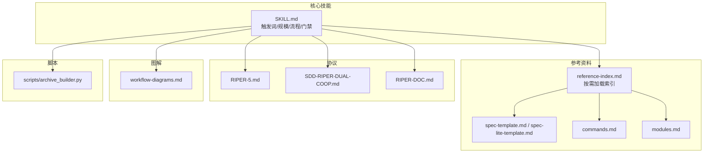
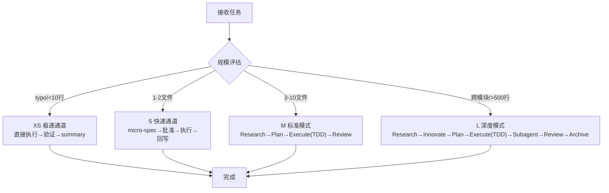
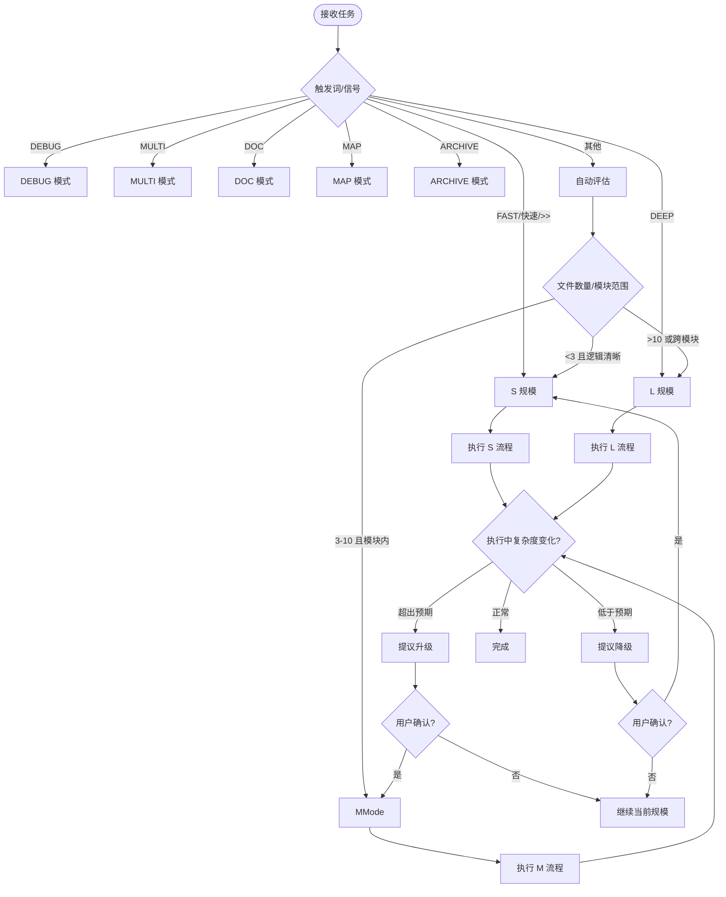
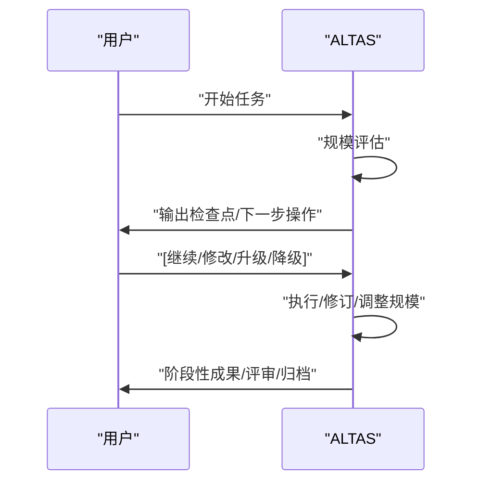
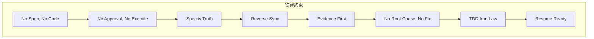
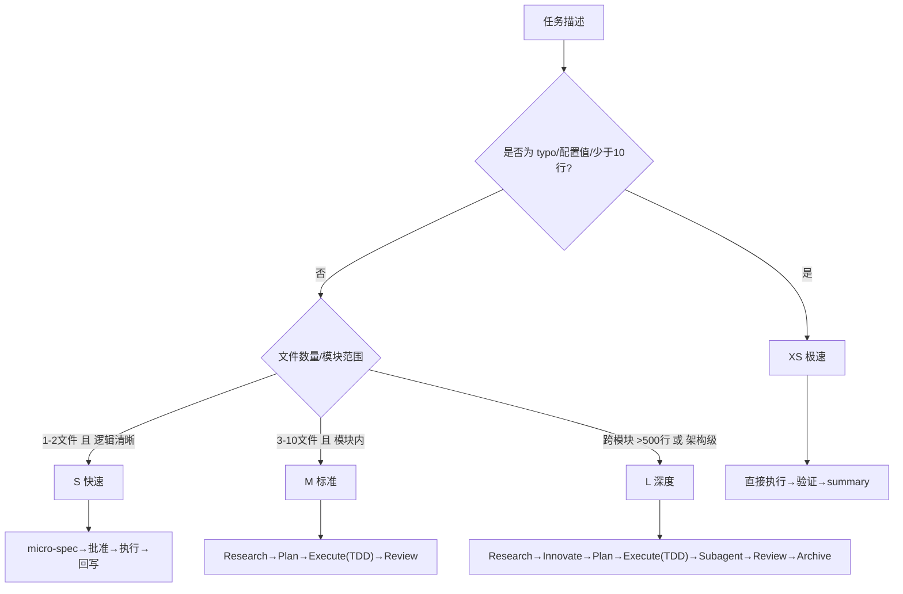
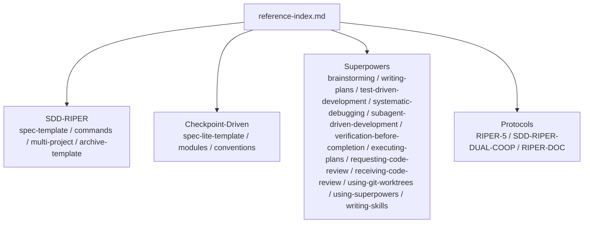

# 任务深度评估系统

<cite>
**本文引用的文件**
- [README.md](file://README.md)
- [QUICKSTART.md](file://altas-workflow/QUICKSTART.md)
- [SKILL.md](file://altas-workflow/SKILL.md)
- [reference-index.md](file://altas-workflow/reference-index.md)
- [workflow-diagrams.md](file://altas-workflow/workflow-diagrams.md)
- [spec-template.md](file://altas-workflow/references/spec-driven-development/spec-template.md)
- [spec-lite-template.md](file://altas-workflow/references/checkpoint-driven/spec-lite-template.md)
- [commands.md](file://altas-workflow/references/spec-driven-development/commands.md)
- [modules.md](file://altas-workflow/references/checkpoint-driven/modules.md)
- [SDD-RIPER-5.md](file://altas-workflow/protocols/RIPER-5.md)
- [SDD-RIPER-DUAL-COOP.md](file://altas-workflow/protocols/SDD-RIPER-DUAL-COOP.md)
- [RIPER-DOC.md](file://altas-workflow/protocols/RIPER-DOC.md)
- [SDD-RIPER-ONE-LIGHT-SKILL.md](file://altas-workflow/references/agents/sdd-riper-one-light/SKILL.md)
- [SDD-RIPER-ONE-SKILL.md](file://altas-workflow/references/agents/sdd-riper-one/SKILL.md)
- [archive_builder.py](file://altas-workflow/scripts/archive_builder.py)
</cite>

## 目录
1. [简介](#简介)
2. [项目结构](#项目结构)
3. [核心组件](#核心组件)
4. [架构总览](#架构总览)
5. [详细组件分析](#详细组件分析)
6. [依赖分析](#依赖分析)
7. [性能考虑](#性能考虑)
8. [故障排除指南](#故障排除指南)
9. [结论](#结论)
10. [附录](#附录)

## 简介
本文件面向 ALTAS 任务深度评估系统，系统性阐述 4 级任务深度（XS/S/M/L）的判断标准、评估指标与自动升降级机制。文档聚焦以下目标：
- 明确 XS（简单修复）、S（小功能）、M（中等规模）、L（大型重构）四类任务的特征差异与适用场景
- 解释评估算法如何综合代码行数、文件数量、模块范围、复杂度等因素进行判断
- 说明自动升降级机制的工作原理（触发条件、升级/降级阈值、人工干预）
- 提供评估示例与决策树，帮助开发者正确评估任务规模并选择合适的工作流模式
- 总结常见评估误区与解决方案

## 项目结构
系统以“技能提示词 + 参考资料 + 协议 + 图解”为核心，形成“按需加载、渐进披露、可反馈”的工作流体系：
- 核心技能提示词：SKILL.md 定义触发词、规模评估、流程门禁、进度输出与特殊模式
- 参考资料：按阶段/场景按需加载，避免上下文膨胀
- 协议：RIPER-5、SDD-RIPER-DUAL-COOP、RIPER-DOC 等，提供严格模式与协作模式
- 图解：workflow-diagrams.md 提供架构、流程、评审、上下文装配等可视化

**图表来源**
- [SKILL.md:1-358](file://altas-workflow/SKILL.md#L1-L358)
- [reference-index.md:1-210](file://altas-workflow/reference-index.md#L1-L210)
- [workflow-diagrams.md:1-338](file://altas-workflow/workflow-diagrams.md#L1-L338)

**章节来源**
- [README.md:1-133](file://README.md#L1-L133)
- [SKILL.md:1-358](file://altas-workflow/SKILL.md#L1-L358)

## 核心组件
- 触发词与模式映射：FAST/DEEP/DEBUG/MULTI/DOC/MAP/ARCHIVE 等触发词映射到不同工作流模式与规模
- 规模评估矩阵：XS/S/M/L 的触发条件、Spec 要求、工作流差异
- 自动升降级机制：执行中发现复杂度超出预期时暂停并提议升级；用户可随时手动调整
- 阶段门禁与检查点：No Spec, No Code；No Approval, No Execute；Evidence First；三轴评审等
- 特殊模式：FAST（极速通道）、DEBUG（系统化排查）、MULTI（多项目）、DOC（文档专家）、MAP（CodeMap）

**章节来源**
- [SKILL.md:45-102](file://altas-workflow/SKILL.md#L45-L102)
- [QUICKSTART.md:36-170](file://altas-workflow/QUICKSTART.md#L36-L170)

## 架构总览
系统采用“接收任务 → 规模评估 → 选择工作流 → 渐进披露 → 检查点反馈 → 三轴评审/归档”的闭环架构。不同规模的任务在“研究/创新/计划/执行/评审/归档”阶段的深度与复杂度不同，XS/S 跳过研究与计划，M/L 强制 TDD 与评审。

**图表来源**
- [workflow-diagrams.md:7-41](file://altas-workflow/workflow-diagrams.md#L7-L41)
- [SKILL.md:105-135](file://altas-workflow/SKILL.md#L105-L135)

## 详细组件分析

### 4 级任务深度评估与工作流选择
- XS（简单修复）：typo、配置值、少于 10 行修改；跳过 Spec，事后 1 行 summary
- S（小功能）：1-2 文件，逻辑清晰；micro-spec（1-3 句）→ 批准 → 执行 → 回写
- M（中等规模）：3-10 文件，模块内；Research→Plan→Execute(TDD)→Review
- L（大型重构）：跨模块、>500 行、架构级；Research→Innovate→Plan→Execute(TDD)→Subagent→Review→Archive

评估触发条件与工作流差异详见“规模评估速查”与“阶段执行指南”。

**章节来源**
- [SKILL.md:47-54](file://altas-workflow/SKILL.md#L47-L54)
- [SKILL.md:182-198](file://altas-workflow/SKILL.md#L182-L198)
- [QUICKSTART.md:155-169](file://altas-workflow/QUICKSTART.md#L155-L169)

### 评估指标与算法思路
系统通过“触发词 + 规模速查 + 执行中动态评估”实现自动评估与升降级：
- 触发词映射：FAST/DEEP/DEBUG/MULTI/DOC/MAP/ARCHIVE 等触发词决定初始模式
- 规模速查：基于“文件数量、代码行数、模块范围、复杂度”等信号进行快速判定
- 执行中评估：若发现复杂度超出预期，立即暂停并提议升级；用户可随时手动调整（升级为 M/降级为 S）

**图表来源**
- [SKILL.md:56-60](file://altas-workflow/SKILL.md#L56-L60)
- [QUICKSTART.md:137-139](file://altas-workflow/QUICKSTART.md#L137-L139)

**章节来源**
- [SKILL.md:56-60](file://altas-workflow/SKILL.md#L56-L60)
- [QUICKSTART.md:137-139](file://altas-workflow/QUICKSTART.md#L137-L139)

### 自动升降级机制
- 触发条件：执行中发现复杂度超出预期（如触及>2核心文件或架构改动）
- 升级阈值：跨模块、>500 行、架构级改动
- 降级阈值：S 规模任务实际仅涉及 1-2 文件且逻辑清晰
- 人工干预：用户随时可用“[升级为M]/[降级为S]”调整；AI 会在检查点暂停等待确认

**图表来源**
- [SKILL.md:115-134](file://altas-workflow/SKILL.md#L115-L134)

**章节来源**
- [SKILL.md:56-60](file://altas-workflow/SKILL.md#L56-L60)
- [SKILL.md:115-134](file://altas-workflow/SKILL.md#L115-L134)

### 工作流阶段与门禁
- 铁律与门禁：No Spec, No Code；No Approval, No Execute；Spec is Truth；Reverse Sync；Evidence First；No Fixes Without Root Cause；TDD Iron Law；Resume Ready
- 三轴评审：Spec 质量与需求达成、Spec-代码一致性、代码内在质量
- 执行纪律：严格单步循环，批量执行需明确授权；编译错误可自动修正，逻辑变更必须回到 Plan

**图表来源**
- [SKILL.md:90-102](file://altas-workflow/SKILL.md#L90-L102)

**章节来源**
- [SKILL.md:90-102](file://altas-workflow/SKILL.md#L90-L102)
- [SKILL.md:200-214](file://altas-workflow/SKILL.md#L200-L214)

### 特殊模式与适用场景
- FAST 模式：极速通道，跳过 Research/Plan，直接执行，事后同步 Spec；若触及>2核心文件或架构，暂停提议切换到标准模式
- DEBUG 模式：系统化排查，诊断/验证两种子模式，只读分析，代码修改需进入 RIPER 或 FAST
- MULTI 模式：自动发现子项目，作用域默认 local，必要时 CROSS 跨项目
- DOC 模式：文档专家，Absorb→Outline→Author→Fact-Check
- MAP 模式：只读分析，输出 CodeMap 后暂停等待指示；用户要求修改代码时进入标准流程

**章节来源**
- [SKILL.md:227-281](file://altas-workflow/SKILL.md#L227-L281)
- [QUICKSTART.md:36-48](file://altas-workflow/QUICKSTART.md#L36-L48)

### 评估示例与决策树
- 示例一：typo 配置值（XS）→ 直接执行→验证→summary
- 示例二：新增 CRUD 接口（M）→ Research→Plan→Execute(TDD)→Review
- 示例三：重构认证模块（L）→ Research→Innovate→Plan→Execute(TDD)→Subagent→Review→Archive
- 示例四：紧急修复线上配置（XS）→ 直接修改→运行验证→1行 summary

**图表来源**
- [QUICKSTART.md:52-116](file://altas-workflow/QUICKSTART.md#L52-L116)
- [SKILL.md:47-54](file://altas-workflow/SKILL.md#L47-L54)

**章节来源**
- [QUICKSTART.md:52-116](file://altas-workflow/QUICKSTART.md#L52-L116)

## 依赖分析
系统通过 reference-index.md 提供统一的按需加载索引，避免常驻上下文带来的 token 消耗与上下文腐烂：
- 触发场景 → 对应参考文件（如写 Spec、命令参数、TDD、Debug、写 Plan、Subagent、完成前验证、Review、Archived 等）
- 规模等级 → 标准/完整加载清单（S/M/L 的参考文件集合）

**图表来源**
- [reference-index.md:175-202](file://altas-workflow/reference-index.md#L175-L202)

**章节来源**
- [reference-index.md:1-210](file://altas-workflow/reference-index.md#L1-L210)

## 性能考虑
- 渐进式披露：仅在命中场景时按需加载参考文件，避免上下文膨胀
- 检查点机制：每步完成后输出标准化检查点，减少无效重复
- 自动化归档：提供 archive_builder.py 脚本，支持自动化知识沉淀
- 模型选择：Subagent 驱动中按角色选择合适模型，节约成本并提高速度

**章节来源**
- [SKILL.md:325-358](file://altas-workflow/SKILL.md#L325-L358)
- [reference-index.md:193-201](file://altas-workflow/reference-index.md#L193-L201)
- [archive_builder.py](file://altas-workflow/scripts/archive_builder.py)

## 故障排除指南
- AI 一次性输出过多代码：ALTAS 内置检查点机制，AI 完成一步后必须暂停等待确认；如暴走，回复“请停止，严格执行检查点机制”
- 为什么 AI 总是先写测试：这是 Evidence First + TDD 铁律；任务极简可用 >> 触发 XS 模式跳过 TDD
- 如何中途干预计划：在任意检查点回复“[修改] 请不要使用 Redis，改为内存缓存”，AI 会根据反馈调整 Plan 后重新请求 Approve
- 多人团队协作：Spec 是团队共享的真相源；核心开发者只需 Review Plan，不必 Review 全部代码
- 触发词误用：FAST/DEEP/DEBUG/MULTI/DOC/MAP/ARCHIVE 等触发词与规模映射见“触发词速查”

**章节来源**
- [QUICKSTART.md:119-152](file://altas-workflow/QUICKSTART.md#L119-L152)
- [SKILL.md:61-73](file://altas-workflow/SKILL.md#L61-L73)

## 结论
ALTAS 任务深度评估系统通过“触发词 + 规模速查 + 执行中动态评估 + 人工干预”的组合，实现了对 XS/S/M/L 四类任务的精准匹配与工作流选择。系统强调“Spec is Truth、No Approval, No Execute、Evidence First、三轴评审”，并通过渐进式披露与检查点机制，降低上下文腐烂与执行风险。配合 RIPER-5、SDD-RIPER-DUAL-COOP、RIPER-DOC 等协议，系统在不同团队与场景下具备良好的可移植性与可扩展性。

## 附录
- 触发词与模式映射：见“触发词速查”与“特殊模式”
- 规模评估速查：见“规模评估速查”
- 参考资料索引：见 reference-index.md
- 图解参考：见 workflow-diagrams.md

**章节来源**
- [SKILL.md:61-73](file://altas-workflow/SKILL.md#L61-L73)
- [SKILL.md:47-54](file://altas-workflow/SKILL.md#L47-L54)
- [reference-index.md:1-210](file://altas-workflow/reference-index.md#L1-L210)
- [workflow-diagrams.md:1-338](file://altas-workflow/workflow-diagrams.md#L1-L338)