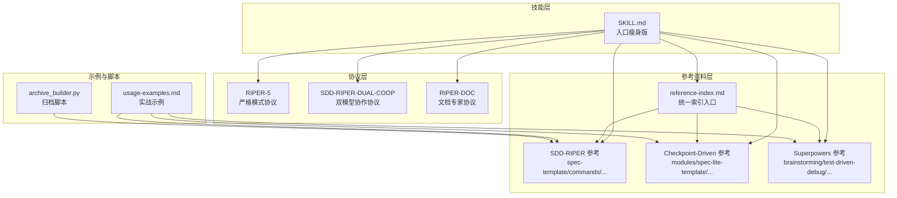
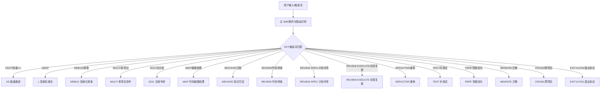
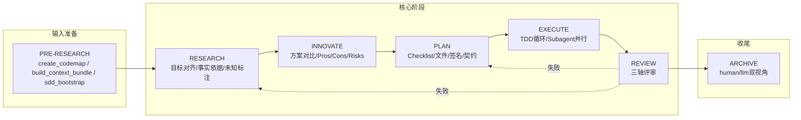
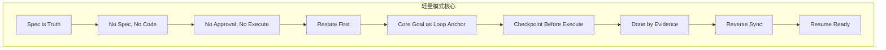
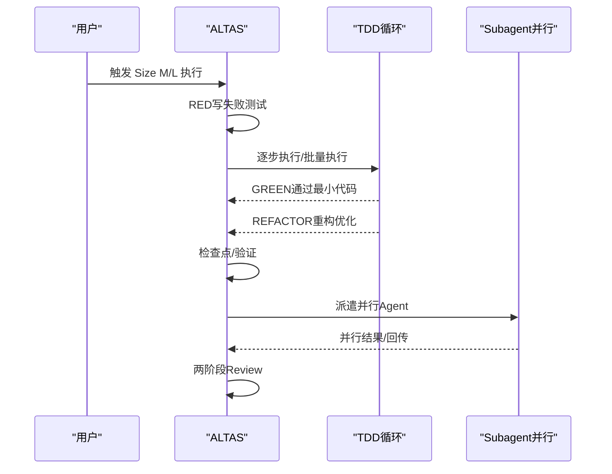
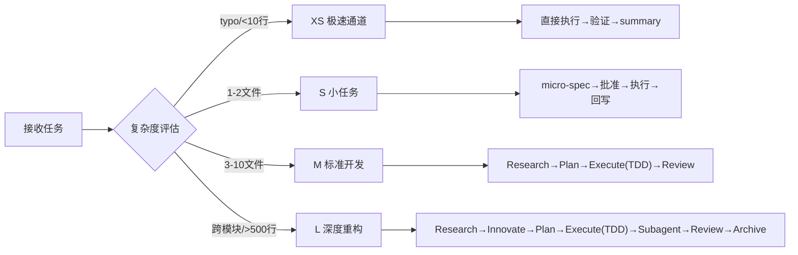
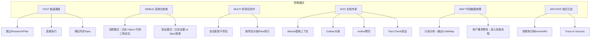
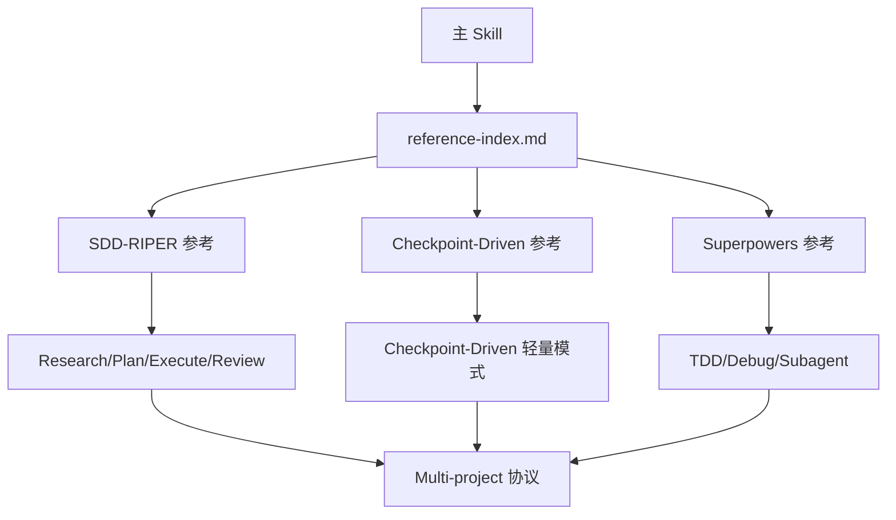

# 工作流架构

<cite>
**本文引用的文件**
- [altas-workflow/SKILL.md](file://altas-workflow/SKILL.md)
- [altas-workflow/reference-index.md](file://altas-workflow/reference-index.md)
- [altas-workflow/workflow-diagrams.md](file://altas-workflow/workflow-diagrams.md)
- [altas-workflow/QUICKSTART.md](file://altas-workflow/QUICKSTART.md)
- [altas-workflow/protocols/RIPER-5.md](file://altas-workflow/protocols/RIPER-5.md)
- [altas-workflow/protocols/RIPER-DOC.md](file://altas-workflow/protocols/RIPER-DOC.md)
- [altas-workflow/protocols/SDD-RIPER-DUAL-COOP.md](file://altas-workflow/protocols/SDD-RIPER-DUAL-COOP.md)
- [altas-workflow/references/checkpoint-driven/SKILL.md](file://altas-workflow/references/checkpoint-driven/SKILL.md)
- [altas-workflow/references/superpowers/using-superpowers/SKILL.md](file://altas-workflow/references/superpowers/using-superpowers/SKILL.md)
- [altas-workflow/references/spec-driven-development/sdd-riper-one-protocol.md](file://altas-workflow/references/spec-driven-development/sdd-riper-one-protocol.md)
- [altas-workflow/references/spec-driven-development/usage-examples.md](file://altas-workflow/references/spec-driven-development/usage-examples.md)
- [altas-workflow/scripts/archive_builder.py](file://altas-workflow/scripts/archive_builder.py)
</cite>

## 更新摘要
**变更内容**
- 更新触发词系统：从 6 个扩展到 25 个触发词，包括中文关键词
- 重构路由表：提供更详细的路由速查表和按需加载机制
- 简化检查点系统：XS/S/M/L 三级输出要求替代复杂模板
- 统一引用索引：reference-index.md 作为单一参考资料入口
- 更新架构图：反映入口瘦身版的设计理念

## 目录
1. [简介](#简介)
2. [项目结构](#项目结构)
3. [核心组件](#核心组件)
4. [架构总览](#架构总览)
5. [详细组件分析](#详细组件分析)
6. [依赖分析](#依赖分析)
7. [性能考量](#性能考量)
8. [故障排查指南](#故障排查指南)
9. [结论](#结论)
10. [附录](#附录)

## 简介
本文档面向 ALTAS Workflow 的工作流架构，系统阐述三大融合工作流（SDD-RIPER、SDD-RIPER-Optimized、Superpowers）的协同机制与架构优势。4.1 版本以"入口瘦身"为核心设计理念，通过统一的触发词系统、重构的路由表和简化的检查点系统，实现了从详细工作流指南到精简引导入口的转变。文档深入解析 RIPER 工作流（Initialize → Research → Plan → Execute → Review）的五个阶段及其相互关系，解释 Checkpoint-Driven 轻量模式的设计原理，并给出 4 级任务深度评估系统（XS/S/M/L）的判断标准与自动升降级机制。

## 项目结构
ALTAS Workflow 以"技能 + 协议 + 参考资料 + 示例 + 脚本"的精简方式组织，形成"按需加载、渐进披露"的知识体系：
- **技能层**：统一的主 Skill（SKILL.md）负责路由识别、规模评估、触发词识别和按需加载策略
- **协议层**：RIPER-5、SDD-RIPER-DUAL-COOP 等协议定义严格的状态机与门禁约束
- **参考资料层**：统一的 reference-index.md 作为单一入口，按场景按需加载
- **示例与脚本**：真实用例与自动化归档工具，支撑落地与复用



**图表来源**
- [altas-workflow/SKILL.md:1-270](file://altas-workflow/SKILL.md#L1-L270)
- [altas-workworkflow/reference-index.md:1-251](file://altas-workflow/reference-index.md#L1-L251)

**章节来源**
- [altas-workflow/SKILL.md:1-270](file://altas-workflow/SKILL.md#L1-L270)
- [altas-workflow/reference-index.md:1-251](file://altas-workflow/reference-index.md#L1-L251)

## 核心组件
- **统一触发词系统**：25个触发词（FAST/DEEP/DEBUG/MULTI/DOC/MAP/ARCHIVE 等）及中文关键词，支持多语言环境
- **智能路由识别**：先判断任务属于 Coding / Debug / Doc / Map / Archive / Review / Refactor / Test / Perf / Migrate / Multi 中哪一类
- **4级规模评估**：根据任务复杂度（XS/S/M/L）自动选择工作流深度
- **精简检查点系统**：XS/S/M/L 三级输出要求，替代复杂的检查点模板
- **按需加载机制**：入口只保留高杠杆约束；模板、阶段细节、特殊模式协议一律去 `reference-index.md` 与 `references/` 按需读取
- **统一引用索引**：reference-index.md 作为单一参考资料入口，支持按阶段、按模式、按来源分类查找

**章节来源**
- [altas-workflow/SKILL.md:5-10](file://altas-workflow/SKILL.md#L5-L10)
- [altas-workflow/SKILL.md:79-101](file://altas-workflow/SKILL.md#L79-L101)
- [altas-workflow/SKILL.md:151-176](file://altas-workflow/SKILL.md#L151-L176)
- [altas-workflow/reference-index.md:1-251](file://altas-workflow/reference-index.md#L1-L251)

## 架构总览
ALTAS 4.1 版本以"入口瘦身"为核心，通过统一触发词系统和重构路由表，在不同规模下按需加载协议与参考模块，形成"Spec-Driven + Checkpoint-Driven + Superpowers"的统一范式。架构优势体现在：
- **控制力与简洁性平衡**：通过"按需加载"减少常驻 token，同时保持严格的门禁与状态机约束
- **一致性与可复用性**：统一的产物命名与落盘策略，以及三轴评审与归档沉淀，确保知识资产可复用
- **适应性与可扩展性**：支持多项目协作、文档专家、系统化 Debug 等特殊模式，满足多样化场景



**图表来源**
- [altas-workflow/SKILL.md:79-101](file://altas-workflow/SKILL.md#L79-L101)
- [altas-workflow/SKILL.md:36-36](file://altas-workflow/SKILL.md#L36-L36)

## 详细组件分析

### RIPER 工作流（Initialize → Research → Plan → Execute → Review）
RIPER 是 SDD-RIPER 的核心状态机，强调"Spec 为中心、Plan 为契约、执行零偏差、评审三轴"。四大阶段职责与交互如下：
- **Initialize（预研究）**：通过 create_codemap、build_context_bundle、sdd_bootstrap 等准备输入，进入 Research
- **Research（研究对齐）**：对齐目标、梳理现状、标注未知、形成 Spec 基础，产出 Research Findings 与 Next Actions
- **Innovate（方案对比，仅 L）**：提出 2-3 种方案，对比 Pros/Cons/Risks/Effort，记录决策与权衡
- **Plan（详细规划）**：拆解为原子 Checklist，明确 File Changes、Signatures、Done Contract，等待批准
- **Execute（执行实现）**：默认逐步执行（1 个 Checklist 项→检查点），支持批量执行；TDD 循环（RED→GREEN→REFACTOR）与 Subagent 并行
- **Review（审查）**：三轴评审（Spec 质量与需求达成、Spec-代码一致性、代码内在质量），失败退回 Research/Plan
- **Archive（知识沉淀）**：生成 human/llm 双视角归档，附 Trace to Sources



**图表来源**
- [altas-workflow/workflow-diagrams.md:45-67](file://altas-workflow/workflow-diagrams.md#L45-L67)
- [altas-workflow/references/spec-driven-development/sdd-riper-one-protocol.md:95-200](file://altas-workflow/references/spec-driven-development/sdd-riper-one-protocol.md#L95-L200)

**章节来源**
- [altas-workflow/references/spec-driven-development/sdd-riper-one-protocol.md:95-200](file://altas-workflow/references/spec-driven-development/sdd-riper-one-protocol.md#L95-L200)
- [altas-workflow/workflow-diagrams.md:45-67](file://altas-workflow/workflow-diagrams.md#L45-L67)

### Checkpoint-Driven 轻量模式（SDD-RIPER-Optimized）
SDD-RIPER-Optimized 以"Checkpoint-Driven"为核心，强调"最小 Spec + 关键锚点 + 按需模块"，适用于强模型高频多轮场景：
- **硬约束**：Spec is Truth、No Spec, No Code、No Approval, No Execute、Restate First、Core Goal as Loop Anchor、Checkpoint Before Execute、Done by Evidence、Reverse Sync、Resume Ready
- **任务深度分级**：zero（零 Spec，机械性改动）、fast（micro-spec→批准→执行→回写）、standard（默认，轻量 Spec 落盘）、deep（深思考，按需加载 modules）
- **最小工作流**：复述对齐→Spec 落地→Done Contract→Checkpoint→获批执行→偏差处理→回写收尾
- **按需模块**：Deep Planning、Debug、Review、Multi-project
- **上下文装配**：Hot（每轮）→Warm（阶段切换）→Cold（按需）



**图表来源**
- [altas-workflow/references/checkpoint-driven/SKILL.md:14-26](file://altas-workflow/references/checkpoint-driven/SKILL.md#L14-L26)

**章节来源**
- [altas-workflow/references/checkpoint-driven/SKILL.md:1-84](file://altas-workflow/references/checkpoint-driven/SKILL.md#L1-L84)
- [altas-workflow/references/checkpoint-driven/modules.md:1-57](file://altas-workflow/references/checkpoint-driven/modules.md#L1-L57)

### Superpowers 能力矩阵
Superpowers 提供工程化能力，支撑复杂任务的高质量交付：
- **TDD 铁律**：RED→GREEN→REFACTOR 循环，Evidence First，无失败测试不写生产代码（XS/S 豁免）
- **系统化 Debug**：诊断模式（日志+Spec+代码三角定位）与验证模式（日志证据 vs Spec 验收标准）
- **Subagent 驱动**：并行 Agent 派遣与执行，支持多独立故障并行处理
- **验证优先**：完成前验证（Verification Before Completion），降低回归风险
- **使用技能**：严格遵循"might any skill apply?"的前置检查，确保技能正确加载与执行



**图表来源**
- [altas-workflow/SKILL.md:176-192](file://altas-workflow/SKILL.md#L176-L192)
- [altas-workflow/references/superpowers/using-superpowers/SKILL.md:44-76](file://altas-workflow/references/superpowers/using-superpowers/SKILL.md#L44-L76)

**章节来源**
- [altas-workflow/SKILL.md:176-192](file://altas-workflow/SKILL.md#L176-L192)
- [altas-workflow/references/superpowers/using-superpowers/SKILL.md:1-118](file://altas-workflow/references/superpowers/using-superpowers/SKILL.md#L1-L118)

### 4 级任务深度评估系统（XS/S/M/L）
- **XS（极致轻量）**：typo/配置值，<10 行；跳过 Spec，事后 1 行 summary；直接执行→验证→summary
- **S（小任务）**：1-2 文件，逻辑清晰；micro-spec（1-3 句）→批准→执行→回写
- **M（标准开发）**：3-10 文件，模块内；Research→Plan→Execute（TDD）→Review
- **L（深度重构）**：跨模块，>500 行，架构级；Research→Innovate→Plan→Execute（TDD）→Subagent→Review→Archive

**自动升降级机制**：
- 执行中发现复杂度超出预期→立即暂停，提议升级
- 用户随时可用"[升级为M]/[降级为S]"调整
- FAQ 中明确：XS/S 用 `>>`/`FAST`，默认 M，L 用 `DEEP`



**图表来源**
- [altas-workflow/QUICKSTART.md:164-178](file://altas-workflow/QUICKSTART.md#L164-L178)
- [altas-workflow/SKILL.md:102-122](file://altas-workflow/SKILL.md#L102-L122)

**章节来源**
- [altas-workflow/QUICKSTART.md:164-178](file://altas-workflow/QUICKSTART.md#L164-L178)
- [altas-workflow/SKILL.md:102-122](file://altas-workflow/SKILL.md#L102-L122)

### 触发词系统与路由表
**更新** 4.1 版本引入了全新的触发词系统，从原来的 6 个扩展到 25 个触发词，包括中文关键词：

**触发词分类**：
- **极速通道**：`>>`、`FAST`、`快速`
- **深度标准流**：`DEEP`
- **系统化排查**：`DEBUG`、`排查`、`日志分析`、`验证功能`
- **文档专家**：`DOC`、`写文档`
- **代码链路梳理**：`MAP`、`链路梳理`、`只看代码`
- **项目总图**：`PROJECT MAP`、`MAP ALL`、`全局地图`、`项目总图`
- **知识沉淀**：`ARCHIVE`、`归档`、`沉淀`
- **代码审查**：`REVIEW`、`代码审查`、`审查 PR`
- **计划评审**：`REVIEW SPEC`、`评审规格`、`计划评审`
- **实现复盘**：`REVIEW EXECUTE`、`代码评审`、`实现复盘`
- **重构**：`REFACTOR`、`重构`
- **补测试**：`TEST`、`写测试`、`补测试`
- **性能优化**：`PERF`、`性能优化`
- **迁移**：`MIGRATE`、`迁移`、`版本升级`
- **跨项目**：`CROSS`、`跨项目`
- **退出协议**：`EXIT ALTAS`、`退出协议`

**路由速查表**：
| 触发/意图 | 默认路由 | 只读 | 首轮重点 | 按需加载 |
|-----------|----------|------|----------|----------|
| 改代码 / 修 Bug / 新功能 | 标准 Coding 流 | 否 | 规模评估 + 最小 Spec + 门禁 | `references/spec-driven-development/spec-template.md` / `references/checkpoint-driven/spec-lite-template.md` |
| `>>` / `FAST` / `快速` | FAST | 否 | 确认是否为 `XS/S` | `references/spec-driven-development/workflow-quickref.md` |
| `DEEP` | 深度标准流 | 否 | 默认按 `L` 处理 | `references/superpowers/brainstorming/SKILL.md` |
| `DEBUG` / `排查` / `日志分析` / `验证功能` | DEBUG | 是 | 症状、预期、证据、根因候选 | `references/superpowers/systematic-debugging/SKILL.md` |
| `DOC` / `写文档` | DOC | 通常是 | 先抽事实与范围，再给大纲 | `protocols/RIPER-DOC.md` |
| `MAP` / `链路梳理` / `只看代码` | MAP | 是 | 输出功能级 CodeMap | `references/spec-driven-development/commands.md` |
| `PROJECT MAP` / `MAP ALL` / `全局地图` / `项目总图` | MAP | 是 | 输出项目级 CodeMap | `references/spec-driven-development/commands.md` |
| `ARCHIVE` / `归档` / `沉淀` | ARCHIVE | 通常是 | 基于完成产物做知识沉淀 | `references/spec-driven-development/archive-template.md` |
| `REVIEW` / `代码审查` / `审查 PR` | REVIEW | 是 | 确定范围、目标、深度，再三轴评审 | `references/special-modes/review.md` |
| `REVIEW SPEC` / `评审规格` / `计划评审` | REVIEW | 是 | 执行前审查 Spec/Plan | `references/superpowers/requesting-code-review/SKILL.md` |
| `REVIEW EXECUTE` / `代码评审` / `实现复盘` | REVIEW | 是 | 执行后三轴评审 | `references/checkpoint-driven/modules.md` |
| `REFACTOR` / `重构` | REFACTOR | 否 | 先 CodeMap，再计划 | `references/special-modes/refactor.md` |
| `TEST` / `写测试` / `补测试` | TEST | 否 | 先测试现状与优先级 | `references/special-modes/test.md` |
| `PERF` / `性能优化` | PERF | 否 | 先基线与瓶颈定位 | `references/special-modes/perf.md` |
| `MIGRATE` / `迁移` / `版本升级` | MIGRATE | 否 | 风险、回滚、预演优先 | `references/special-modes/migrate.md` |
| `MULTI` / `多项目` | MULTI | 视任务而定 | 扫描子项目并确认作用域；进入后可使用 `SWITCH` / `REGISTRY` / `SCOPE LOCAL` | `references/spec-driven-development/multi-project.md` |
| `CROSS` / `跨项目` | MULTI 扩展 | 否 | 允许跨项目改动，必须明示范围；必要时再切回 `SCOPE LOCAL` | `references/spec-driven-development/multi-project.md` |
| `EXIT ALTAS` / `退出协议` | 停止协议 | - | 输出摘要与恢复锚点后退出 | 无 |

**章节来源**
- [altas-workflow/SKILL.md:5-5](file://altas-workflow/SKILL.md#L5-L5)
- [altas-workflow/SKILL.md:79-101](file://altas-workflow/SKILL.md#L79-L101)

### 简化的检查点系统
**更新** 4.1 版本将复杂的检查点模板简化为 XS/S/M/L 三级输出要求：

| 规模 | 输出要求 |
|------|----------|
| **XS** | 1 行 summary：做了什么 + 如何验证 |
| **S** | 短 checkpoint：当前理解 / 核心目标 / 下一步 |
| **M/L** | 完整检查点，逐步推进 |

**完整检查点模板（M/L）**：
```markdown
### 进度 [Phase ▸ Step]
[已完成] ▸ **[当前]** ▸ [下一步] ▸ [后续...]

### 当前成果
- 刚完成了什么

### 预期产出
- 下一步将产出什么

### 下一步操作
- **[继续/Approved/直接执行]**: 同意，进入下一步
- **[修改]** + 意见: 调整当前成果
- **[升级为X]** / **[降级为X]**: 调整规模
- **[加载参考: XXX]**: 查看某参考文档
```

**章节来源**
- [altas-workflow/SKILL.md:151-176](file://altas-workflow/SKILL.md#L151-L176)

### 统一的引用索引结构
**更新** 4.1 版本引入了统一的 reference-index.md 作为单一参考资料入口：

**按工作流阶段索引**：
- **PRE-RESEARCH / 输入准备**：`references/spec-driven-development/commands.md`、`references/spec-driven-development/sdd-riper-one-protocol.md`、`references/spec-driven-development/workflow-quickref.md`
- **RESEARCH / 研究对齐**：`references/spec-driven-development/spec-template.md`、`references/checkpoint-driven/spec-lite-template.md`、`references/checkpoint-driven/conventions.md`
- **INNOVATE / 方案对比**：`references/superpowers/brainstorming/SKILL.md`、`references/superpowers/brainstorming/visual-companion.md`、`references/superpowers/brainstorming/spec-document-reviewer-prompt.md`
- **PLAN / 详细规划**：`references/superpowers/writing-plans/SKILL.md`、`references/superpowers/writing-plans/plan-document-reviewer-prompt.md`
- **EXECUTE / 执行实现**：`references/superpowers/test-driven-development/SKILL.md`、`references/superpowers/test-driven-development/testing-anti-patterns.md`、`references/superpowers/subagent-driven-development/SKILL.md`、`references/superpowers/dispatching-parallel-agents/SKILL.md`、`references/superpowers/executing-plans/SKILL.md`、`references/superpowers/using-git-worktrees/SKILL.md`
- **REVIEW / 审查**：`references/checkpoint-driven/modules.md`、`references/superpowers/verification-before-completion/SKILL.md`、`references/superpowers/requesting-code-review/SKILL.md`、`references/superpowers/receiving-code-review/SKILL.md`
- **ARCHIVE / 知识沉淀**：`references/spec-driven-development/archive-template.md`、`scripts/archive_builder.py`、`references/superpowers/finishing-a-development-branch/SKILL.md`

**按特殊模式索引**：
- **DEBUG 模式**：`references/superpowers/systematic-debugging/SKILL.md`、`references/superpowers/systematic-debugging/root-cause-tracing.md`、`references/superpowers/systematic-debugging/defense-in-depth.md`、`references/superpowers/systematic-debugging/condition-based-waiting.md`
- **MULTI 模式**：`references/spec-driven-development/multi-project.md`、`references/checkpoint-driven/modules.md` (Multi-project 模块)
- **DOC 模式**：`protocols/RIPER-DOC.md`
- **REVIEW 模式**：`references/special-modes/review.md`、`references/checkpoint-driven/modules.md` (Review 模块)、`references/superpowers/requesting-code-review/SKILL.md`、`references/superpowers/receiving-code-review/SKILL.md`
- **REFACTOR 模式**：`references/special-modes/refactor.md`、`references/superpowers/test-driven-development/SKILL.md`、`references/spec-driven-development/commands.md` (create_codemap)
- **TEST 模式**：`references/special-modes/test.md`、`references/superpowers/test-driven-development/SKILL.md`、`references/superpowers/test-driven-development/testing-anti-patterns.md`
- **PERF 模式**：`references/special-modes/perf.md`、`references/superpowers/verification-before-completion/SKILL.md`、`references/superpowers/finishing-a-development-branch/SKILL.md`
- **MIGRATE 模式**：`references/special-modes/migrate.md`、`references/superpowers/brainstorming/SKILL.md`、`references/superpowers/verification-before-completion/SKILL.md`

**章节来源**
- [altas-workflow/reference-index.md:16-251](file://altas-workflow/reference-index.md#L16-L251)

### 特殊模式与最佳实践
- **FAST 模式（极速通道）**：跳过 Research/Plan→直接执行→事后同步 Spec；触及>2 核心文件或架构→暂停，提议切换到标准模式
- **DEBUG 模式（系统化排查）**：诊断模式（日志+Spec+代码三角定位→根因候选）与验证模式（日志证据 vs Spec 验收）；只读分析，修复需进入 RIPER 或 FAST
- **MULTI 模式（多项目协作）**：自动发现子项目→构建项目注册表→按项目分组 Plan→跨项目依赖顺序执行→记录 Contract Interfaces 与 Touched Projects
- **DOC 模式（文档专家）**：Absorb→Outline→Author→Fact-Check，不猜测实现，每个细节对照实际代码验证
- **MAP 模式（代码链路梳理）**：只读分析，输出 CodeMap 后暂停等待用户指示；用户要求修改→进入 Research→Plan→Execute
- **ARCHIVE 模式（知识沉淀）**：生成双视角归档（human/llm），每个结论附 Trace to Sources；可由脚本自动化生成



**图表来源**
- [altas-workflow/SKILL.md:221-275](file://altas-workflow/SKILL.md#L221-L275)
- [altas-workflow/protocols/RIPER-DOC.md:1-66](file://altas-workflow/protocols/RIPER-DOC.md#L1-L66)

**章节来源**
- [altas-workflow/SKILL.md:221-275](file://altas-workflow/SKILL.md#L221-L275)
- [altas-workflow/protocols/RIPER-DOC.md:1-66](file://altas-workflow/protocols/RIPER-DOC.md#L1-L66)

## 依赖分析
- **主 Skill 与协议/参考的耦合**：主 Skill 通过 reference-index.md 统一索引，仅在命中场景时按需加载，避免常驻 token
- **阶段间依赖**：Research 完成→Plan 完成→Execute 完成→Review 完成→Archive（可选）
- **门禁与铁律**：No Spec, No Code；No Approval, No Execute；Spec is Truth；Reverse Sync；Evidence First；No Fixes Without Root Cause；TDD Iron Law；Resume Ready
- **多项目边界**：Multi-project 协议在不替换 RIPER 门禁的前提下，增加边界控制与契约接口记录



**图表来源**
- [altas-workflow/reference-index.md:1-251](file://altas-workflow/reference-index.md#L1-L251)
- [altas-workflow/references/spec-driven-development/sdd-riper-one-protocol.md:389-529](file://altas-workflow/references/spec-driven-development/sdd-riper-one-protocol.md#L389-L529)

**章节来源**
- [altas-workflow/reference-index.md:1-251](file://altas-workflow/reference-index.md#L1-L251)
- [altas-workflow/references/spec-driven-development/sdd-riper-one-protocol.md:389-529](file://altas-workflow/references/spec-driven-development/sdd-riper-one-protocol.md#L389-L529)

## 性能考量
- **按需加载与渐进披露**：仅在命中场景加载参考文件，减少上下文膨胀与 token 消耗
- **上下文装配策略**：Hot/Warm/Cold 分层，避免重复加载与上下文腐烂
- **批量执行与逐步执行**：默认逐步执行便于调试与回溯，支持批量执行加速长任务
- **归档自动化**：通过 archive_builder.py 生成双视角归档，降低重复劳动与信息丢失风险
- **触发词优化**：25个触发词支持多语言环境，提高路由准确性

## 故障排查指南
常见问题与处理建议：
- **AI 一次性输出过多代码**：ALTAS 内置检查点机制，AI 完成一步后必须暂停等确认；如暴走，回复"请停止，严格执行检查点机制，每次只推进一步"
- **为什么 AI 总是先写测试**：Evidence First + TDD 铁律；若任务极简，用 `>>` 触发 XS 模式跳过 TDD
- **如何中途干预 AI 的计划**：在任意检查点回复"[修改] 请不要使用 Redis，改为内存缓存"，AI 会根据反馈调整 Plan 后重新请求 Approve
- **mydocs/ 下太多 md 文件，要提交 Git 吗**：强烈建议提交；Spec 和 Archive 是项目的唯一真相源，防止上下文腐烂
- **如何选择 XS/S/M/L**：ALTAS 会自动评估；也可强制指定：`>>`=XS，`FAST`=S，默认=M，`DEEP`=L；执行中可随时"[升级为M]"或"[降级为S]"
- **触发词不生效**：确认触发词格式正确，支持英文和中文关键词；检查是否在正确的场景下使用

**章节来源**
- [altas-workflow/QUICKSTART.md:128-161](file://altas-workflow/QUICKSTART.md#L128-L161)

## 结论
ALTAS Workflow 4.1 版本通过"入口瘦身"的设计理念，实现了从详细工作流指南到精简引导入口的转变。其架构优势在于：
- **以"按需加载"降低上下文成本**，同时保持严格的门禁与状态机约束
- **通过统一触发词系统和路由表**，提高任务识别准确性和执行效率
- **通过简化的检查点系统**，降低学习成本和执行复杂度
- **通过统一引用索引结构**，确保知识资产可复用
- **支持多规模与多模式**（XS/S/M/L、FAST、DEBUG、MULTI、DOC、MAP、ARCHIVE），满足多样化场景
- **通过三轴评审与归档沉淀**，保障交付质量与可追溯性

## 附录
- **触发词与模式映射**：FAST/快速/>>、DEEP、MAP/链路梳理、PROJECT MAP、MULTI/多项目、DEBUG/排查、REVIEW SPEC/REVIEW EXECUTE、ARCHIVE/归档、DOC/写文档
- **产物命名约定**：CodeMap（功能级/项目级）、Context Bundle、Spec（M/L）、Micro-spec（S）、Archive（human/llm）
- **实际流程示例**：参见 usage-examples.md 中的多项目协作、Debug 模式、Review 规格与执行等完整对话流
- **平台兼容性**：支持 Cursor、Trae、Claude、OpenAI、Qoder 等多个平台

**章节来源**
- [altas-workflow/SKILL.md:302-315](file://altas-workflow/SKILL.md#L302-L315)
- [altas-workflow/references/spec-driven-development/usage-examples.md:1-454](file://altas-workflow/references/spec-driven-development/usage-examples.md#L1-L454)
- [altas-workflow/SKILL.md:10-11](file://altas-workflow/SKILL.md#L10-L11)