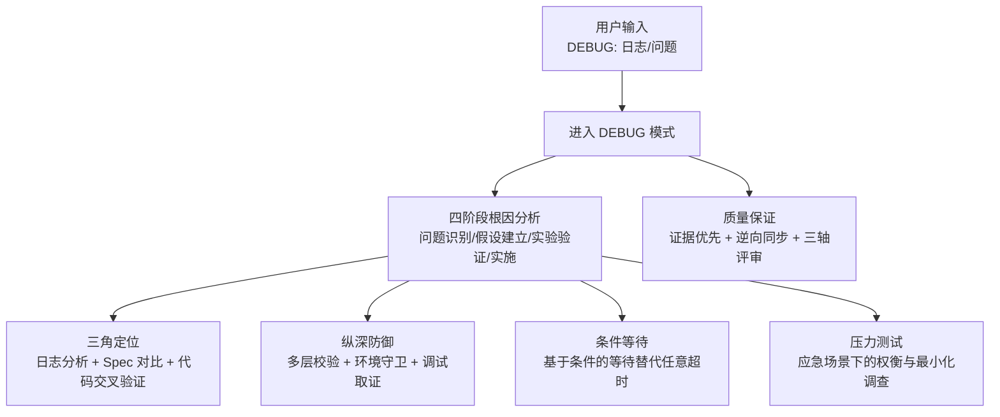
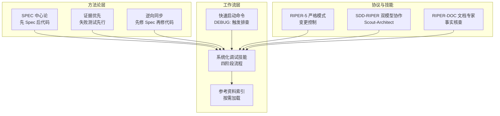
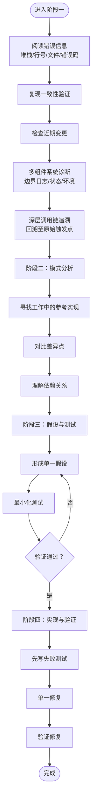
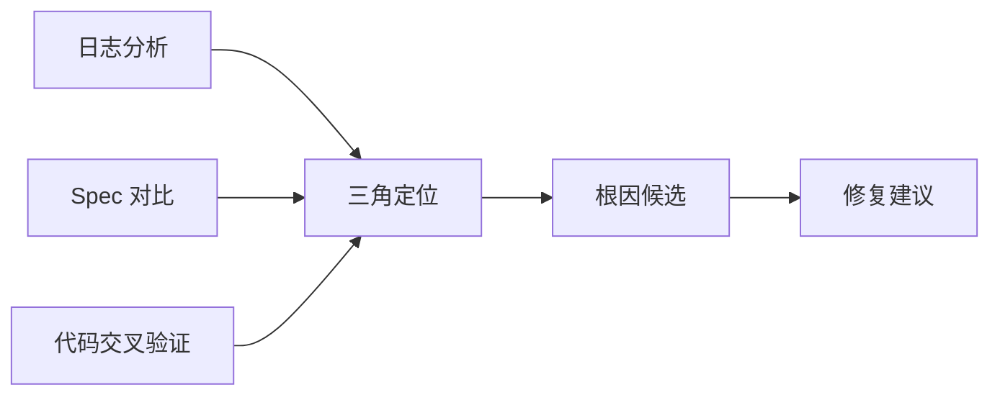
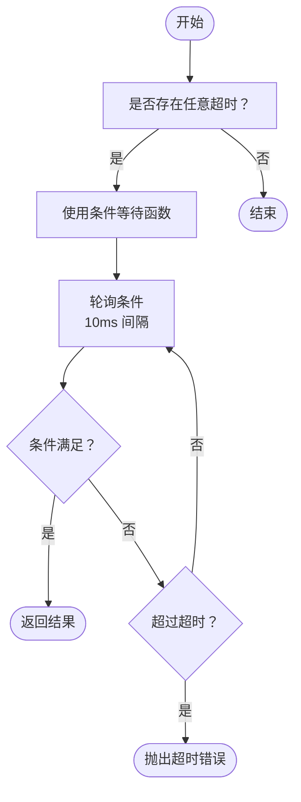
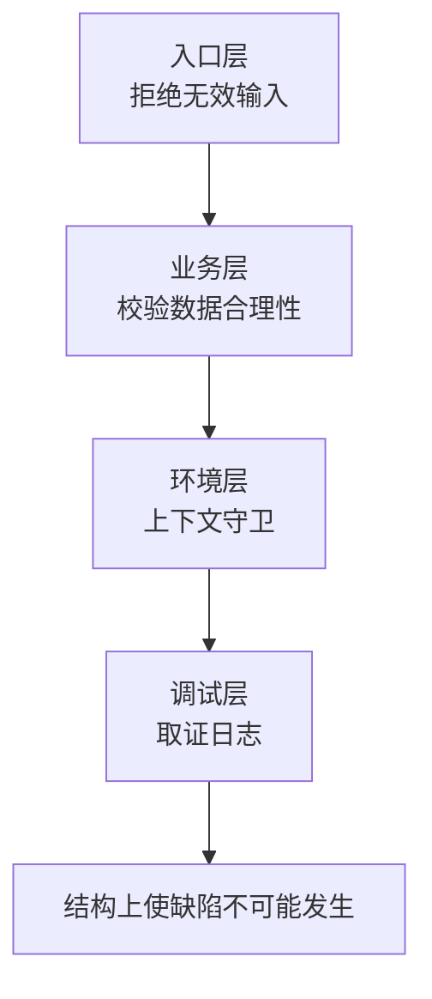
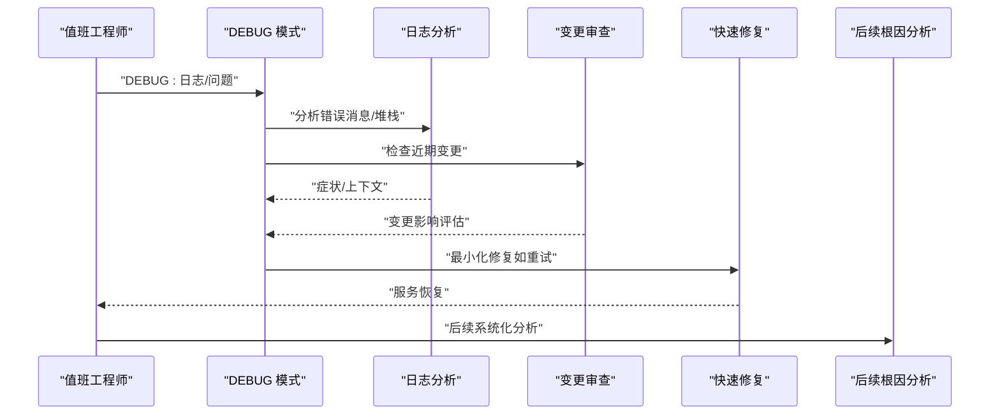
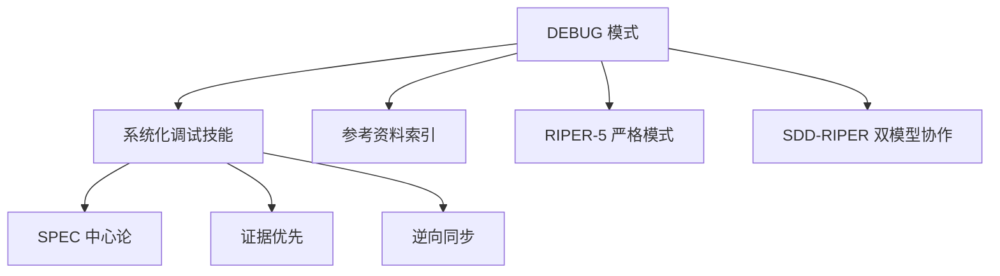

# DEBUG 系统化排查模式

<cite>
**本文引用的文件**
- [README.md](file://altas-workflow/README.md)
- [QUICKSTART.md](file://altas-workflow/QUICKSTART.md)
- [reference-index.md](file://altas-workflow/reference-index.md)
- [SDD-RIPER-DUAL-COOP.md](file://altas-workflow/protocols/SDD-RIPER-DUAL-COOP.md)
- [RIPER-5.md](file://altas-workflow/protocols/RIPER-5.md)
- [RIPER-DOC.md](file://altas-workflow/protocols/RIPER-DOC.md)
- [SKILL.md](file://altas-workflow/references/superpowers/systematic-debugging/SKILL.md)
- [root-cause-tracing.md](file://altas-workflow/references/superpowers/systematic-debugging/root-cause-tracing.md)
- [defense-in-depth.md](file://altas-workflow/references/superpowers/systematic-debugging/defense-in-depth.md)
- [condition-based-waiting.md](file://altas-workflow/references/superpowers/systematic-debugging/condition-based-waiting.md)
- [test-pressure-1.md](file://altas-workflow/references/superpowers/systematic-debugging/test-pressure-1.md)
</cite>

## 目录
1. [简介](#简介)
2. [项目结构](#项目结构)
3. [核心组件](#核心组件)
4. [架构总览](#架构总览)
5. [详细组件分析](#详细组件分析)
6. [依赖关系分析](#依赖关系分析)
7. [性能考量](#性能考量)
8. [故障排查指南](#故障排查指南)
9. [结论](#结论)
10. [附录](#附录)

## 简介
本文件系统化阐述 DEBUG 模式的诊断与验证双重机制，围绕“日志分析、Spec 对比、代码交叉验证”的三角定位方法，给出四阶段根因分析流程：问题识别、假设建立、实验验证、解决方案实施。同时覆盖条件等待问题的处理策略、纵深防御的构建方法、压力测试的应用场景，并明确 DEBUG 模式的触发条件、执行策略与质量保证机制，帮助开发者掌握从问题发现到彻底解决的系统化排查技能。

## 项目结构
ALTAS Workflow 将 DEBUG 模式嵌入到“系统化调试”能力集中，配合 SDD-RIPER、Checkpoint-Driven 与 Superpowers 的方法论，形成可落地的工程化流程。DEBUG 模式在以下位置被索引与调用：
- 快速启动命令中提供 DEBUG: 触发系统化排查
- 参考资料索引中列出系统化调试相关文件
- README 明确“无根因不修复”的铁律与四阶段流程

图表来源
- [QUICKSTART.md: 92-102:92-102](file://altas-workflow/QUICKSTART.md#L92-L102)
- [reference-index.md: 85-93:85-93](file://altas-workflow/reference-index.md#L85-L93)
- [README.md: 46-48:46-48](file://altas-workflow/README.md#L46-L48)

章节来源
- [QUICKSTART.md: 92-102:92-102](file://altas-workflow/QUICKSTART.md#L92-L102)
- [reference-index.md: 85-93:85-93](file://altas-workflow/reference-index.md#L85-L93)
- [README.md: 46-48:46-48](file://altas-workflow/README.md#L46-L48)

## 核心组件
- 系统化调试四阶段流程：根因调查、模式分析、假设与测试、实现与验证
- 三角定位方法：日志分析、Spec 对比、代码交叉验证
- 纵深防御：多层校验、业务逻辑校验、环境守卫、调试取证
- 条件等待：以条件代替任意超时，避免竞态与抖动
- 压力测试：在紧急场景下进行最小化调查与快速修复
- 质量保证：证据优先、逆向同步（先修 Spec 再修代码）、三轴评审

章节来源
- [SKILL.md: 46-214:46-214](file://altas-workflow/references/superpowers/systematic-debugging/SKILL.md#L46-L214)
- [defense-in-depth.md: 20-123:20-123](file://altas-workflow/references/superpowers/systematic-debugging/defense-in-depth.md#L20-L123)
- [condition-based-waiting.md: 9-116:9-116](file://altas-workflow/references/superpowers/systematic-debugging/condition-based-waiting.md#L9-L116)
- [test-pressure-1.md: 1-59:1-59](file://altas-workflow/references/superpowers/systematic-debugging/test-pressure-1.md#L1-L59)
- [README.md: 46-48:46-48](file://altas-workflow/README.md#L46-L48)

## 架构总览
DEBUG 模式在 ALTAS 中的定位与协作关系如下：

图表来源
- [QUICKSTART.md: 46](file://altas-workflow/QUICKSTART.md#L46)
- [reference-index.md: 85-93:85-93](file://altas-workflow/reference-index.md#L85-L93)
- [README.md: 43-49:43-49](file://altas-workflow/README.md#L43-L49)
- [SDD-RIPER-DUAL-COOP.md: 10-73:10-73](file://altas-workflow/protocols/SDD-RIPER-DUAL-COOP.md#L10-L73)
- [RIPER-5.md: 128-141:128-141](file://altas-workflow/protocols/RIPER-5.md#L128-L141)
- [RIPER-DOC.md: 3-66:3-66](file://altas-workflow/protocols/RIPER-DOC.md#L3-L66)

## 详细组件分析

### 四阶段根因分析流程
- 阶段一：根因调查
  - 仔细阅读错误信息、堆栈、行号、文件路径与错误码
  - 可重复性验证：触发步骤、是否稳定复现
  - 近期变更审查：Git diff、最近提交、依赖变更、环境差异
  - 多组件系统诊断：在每个组件边界记录输入/输出、环境传播、状态，定位失败环节
  - 深层调用链追溯：从症状点向上回溯，找到原始触发点
- 阶段二：模式分析
  - 寻找同类工作实现，对比参考实现的完整细节
  - 列举差异点，不放过微小差异
  - 明确依赖关系：其他组件、配置、环境、假设
- 阶段三：假设与测试
  - 明确单一假设并记录
  - 最小化测试：一次只变一个变量
  - 先验证再继续：成功则进入阶段四；失败则形成新假设
- 阶段四：实现与验证
  - 先写失败测试，再实现修复
  - 单一修复：仅针对根因，不顺带改进
  - 验证修复：测试通过、无副作用、问题真正解决
  - 若三次以上修复失败，停止并质疑架构设计

图表来源
- [SKILL.md: 50-214:50-214](file://altas-workflow/references/superpowers/systematic-debugging/SKILL.md#L50-L214)

章节来源
- [SKILL.md: 50-214:50-214](file://altas-workflow/references/superpowers/systematic-debugging/SKILL.md#L50-L214)

### 三角定位方法：日志分析、Spec 对比、代码交叉验证
- 日志分析
  - 从错误消息与堆栈入手，定位具体文件与行号
  - 记录上下文：当前工作目录、环境变量、时间戳
  - 在测试中使用标准输出捕获关键上下文
- Spec 对比
  - 将当前实现与参考实现逐行对照，列出差异清单
  - 确保理解完整模式后再应用
- 代码交叉验证
  - 在组件边界插入日志与断言，验证数据流与状态
  - 通过最小化复现实验验证假设

图表来源
- [SKILL.md: 72-87:72-87](file://altas-workflow/references/superpowers/systematic-debugging/SKILL.md#L72-L87)
- [SKILL.md: 126-144:126-144](file://altas-workflow/references/superpowers/systematic-debugging/SKILL.md#L126-L144)

章节来源
- [SKILL.md: 72-87:72-87](file://altas-workflow/references/superpowers/systematic-debugging/SKILL.md#L72-L87)
- [SKILL.md: 126-144:126-144](file://altas-workflow/references/superpowers/systematic-debugging/SKILL.md#L126-L144)

### 条件等待问题的处理策略
- 问题背景：任意超时导致竞态、不稳定与抖动
- 解决方案：等待实际条件而非猜测耗时
- 关键要点
  - 使用条件等待函数，轮询条件并在超时后抛出清晰错误
  - 避免过快轮询（如每毫秒轮询），建议 10ms 间隔
  - 对于确需固定时长的场景，必须记录原因与依据
- 应用场景：异步事件、状态变化、文件出现、计数达到阈值

图表来源
- [condition-based-waiting.md: 9-116:9-116](file://altas-workflow/references/superpowers/systematic-debugging/condition-based-waiting.md#L9-L116)

章节来源
- [condition-based-waiting.md: 9-116:9-116](file://altas-workflow/references/superpowers/systematic-debugging/condition-based-waiting.md#L9-L116)

### 纵深防御的构建方法
- 核心思想：使缺陷在结构上不可能发生，而非仅靠单点校验
- 四层防御
  - 入口层：API 边界拒绝明显无效输入
  - 业务层：确保数据对当前操作有意义
  - 环境层：在特定上下文中阻止危险操作
  - 调试层：捕获上下文用于取证
- 实施建议：映射数据流的所有检查点，逐层添加校验并验证每层的拦截能力

图表来源
- [defense-in-depth.md: 20-123:20-123](file://altas-workflow/references/superpowers/systematic-debugging/defense-in-depth.md#L20-L123)

章节来源
- [defense-in-depth.md: 20-123:20-123](file://altas-workflow/references/superpowers/systematic-debugging/defense-in-depth.md#L20-L123)

### 压力测试的应用场景与执行策略
- 应用场景：生产故障、紧急停机、高收入损失风险
- 执行策略
  - 最小化调查：快速确认近期变更与工作实现
  - 快速修复：在可接受风险内采取最小可行修复
  - 后续完善：恢复服务后进行系统化根因分析
- 示例场景：支付网关连接超时，短期增加重试，随后系统化调查

图表来源
- [test-pressure-1.md: 1-59:1-59](file://altas-workflow/references/superpowers/systematic-debugging/test-pressure-1.md#L1-L59)
- [SKILL.md: 192-214:192-214](file://altas-workflow/references/superpowers/systematic-debugging/SKILL.md#L192-L214)

章节来源
- [test-pressure-1.md: 1-59:1-59](file://altas-workflow/references/superpowers/systematic-debugging/test-pressure-1.md#L1-L59)
- [SKILL.md: 192-214:192-214](file://altas-workflow/references/superpowers/systematic-debugging/SKILL.md#L192-L214)

### 调试案例研究：从问题发现到彻底解决
- 案例背景：生产 API 停机，错误率为 100%，每分钟收入损失 $15,000
- 步骤
  - 阶段一：根因调查
    - 分析日志：连接超时到外部服务
    - 复现：设置测试环境约 10 分钟
    - 变更：审查最近 PR 约 15 分钟
    - 参考：查找类似超时问题的修复案例
  - 阶段二：模式分析
    - 对比参考实现，列出差异
    - 明确依赖与假设
  - 阶段三：假设与测试
    - 假设：增加重试可缓解瞬时网络波动
    - 最小化测试：添加重试逻辑并验证
  - 阶段四：实现与验证
    - 先写失败测试，再实现修复
    - 验证修复有效且无副作用
    - 恢复服务后进行系统化根因分析

章节来源
- [test-pressure-1.md: 1-59:1-59](file://altas-workflow/references/superpowers/systematic-debugging/test-pressure-1.md#L1-L59)
- [SKILL.md: 50-214:50-214](file://altas-workflow/references/superpowers/systematic-debugging/SKILL.md#L50-L214)

## 依赖关系分析
- DEBUG 模式依赖于系统化调试技能与参考资料索引的按需加载机制
- 与 SPEC 中心论、证据优先、逆向同步等工程原则协同
- 在紧急场景下可结合 RIPER-5 严格模式与 SDD-RIPER 双模型协作进行变更控制与文档化

图表来源
- [reference-index.md: 85-93:85-93](file://altas-workflow/reference-index.md#L85-L93)
- [README.md: 43-49:43-49](file://altas-workflow/README.md#L43-L49)
- [SDD-RIPER-DUAL-COOP.md: 10-73:10-73](file://altas-workflow/protocols/SDD-RIPER-DUAL-COOP.md#L10-L73)
- [RIPER-5.md: 128-141:128-141](file://altas-workflow/protocols/RIPER-5.md#L128-L141)

章节来源
- [reference-index.md: 85-93:85-93](file://altas-workflow/reference-index.md#L85-L93)
- [README.md: 43-49:43-49](file://altas-workflow/README.md#L43-L49)
- [SDD-RIPER-DUAL-COOP.md: 10-73:10-73](file://altas-workflow/protocols/SDD-RIPER-DUAL-COOP.md#L10-L73)
- [RIPER-5.md: 128-141:128-141](file://altas-workflow/protocols/RIPER-5.md#L128-L141)

## 性能考量
- 系统化调试在简单问题上更快：首 fix 率更高，减少反复返工
- 条件等待替代任意超时，消除竞态，提高稳定性与吞吐
- 纵深防御降低缺陷逃逸率，减少回归与补丁风暴
- 在紧急场景下，最小化调查与快速修复可显著降低业务损失

章节来源
- [SKILL.md: 290-297:290-297](file://altas-workflow/references/superpowers/systematic-debugging/SKILL.md#L290-L297)
- [condition-based-waiting.md: 109-116:109-116](file://altas-workflow/references/superpowers/systematic-debugging/condition-based-waiting.md#L109-L116)
- [defense-in-depth.md: 114-123:114-123](file://altas-workflow/references/superpowers/systematic-debugging/defense-in-depth.md#L114-L123)
- [test-pressure-1.md: 109-116:109-116](file://altas-workflow/references/superpowers/systematic-debugging/test-pressure-1.md#L109-L116)

## 故障排查指南
- 触发条件
  - 任何技术问题：测试失败、生产缺陷、异常行为、性能问题、构建失败、集成问题
  - 特别场景：时间压力、显而易见的“快速修复”、多次修复无效、理解不足
- 执行策略
  - 严格遵循四阶段流程，不跳过任一阶段
  - 使用三角定位方法进行证据收集与交叉验证
  - 对于条件等待问题，采用基于条件的等待替代任意超时
  - 在紧急场景下进行最小化调查与快速修复，随后系统化根因分析
- 质量保证机制
  - 证据优先：先写失败测试，再实现修复
  - 逆向同步：先修 Spec 再修代码
  - 三轴评审：完成后的回顾与沉淀

章节来源
- [SKILL.md: 24-45:24-45](file://altas-workflow/references/superpowers/systematic-debugging/SKILL.md#L24-L45)
- [SKILL.md: 174-191:174-191](file://altas-workflow/references/superpowers/systematic-debugging/SKILL.md#L174-L191)
- [README.md: 46-48:46-48](file://altas-workflow/README.md#L46-L48)

## 结论
DEBUG 系统化排查模式通过“四阶段根因分析 + 三角定位 + 纵深防御 + 条件等待 + 压力测试”的组合拳，将“随机修复”转变为“可验证、可复现、可沉淀”的工程实践。它不仅提升首次修复成功率、降低新缺陷引入概率，还能在紧急场景下实现最小成本止损与后续系统化治理的平衡。

## 附录
- 相关协议与技能
  - RIPER-5 严格模式：变更控制与执行一致性
  - SDD-RIPER 双模型协作：Scout-Architect 分工与 Spec 中心
  - RIPER-DOC 文档专家：事实核查与文档质量保障
- 参考资料索引：按需加载，命中即取，避免上下文膨胀

章节来源
- [RIPER-5.md: 128-141:128-141](file://altas-workflow/protocols/RIPER-5.md#L128-L141)
- [SDD-RIPER-DUAL-COOP.md: 76-153:76-153](file://altas-workflow/protocols/SDD-RIPER-DUAL-COOP.md#L76-L153)
- [RIPER-DOC.md: 3-66:3-66](file://altas-workflow/protocols/RIPER-DOC.md#L3-L66)
- [reference-index.md: 85-93:85-93](file://altas-workflow/reference-index.md#L85-L93)