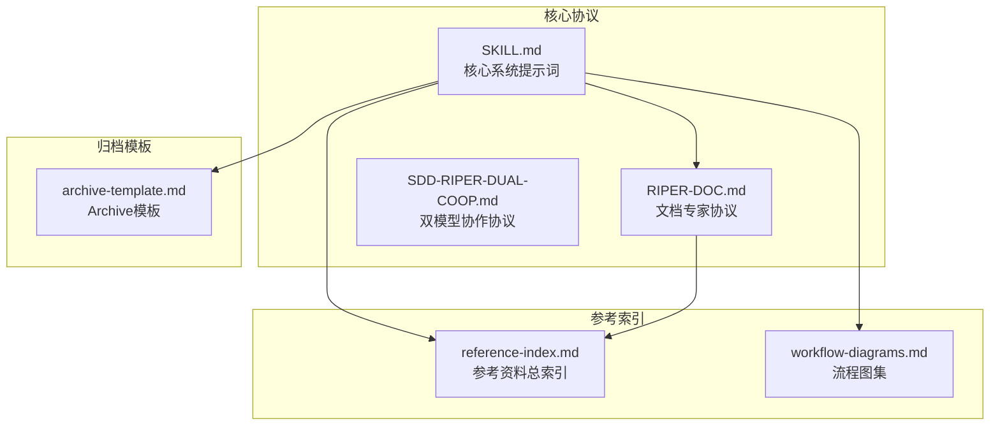
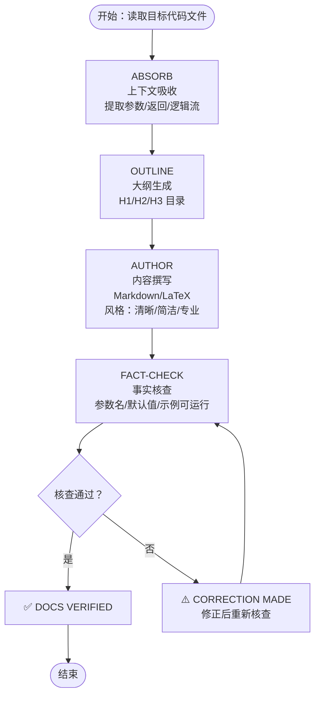
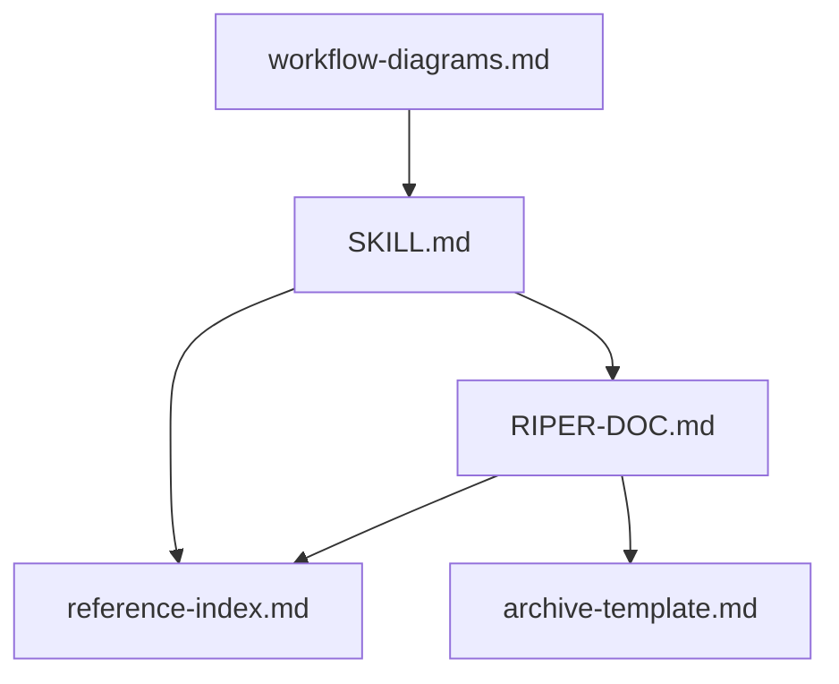

# DOC 文档专家模式

<cite>
**本文引用的文件**
- [RIPER-DOC.md](file://altas-workflow/protocols/RIPER-DOC.md)
- [SKILL.md](file://altas-workflow/SKILL.md)
- [README.md](file://README.md)
- [QUICKSTART.md](file://altas-workflow/QUICKSTART.md)
- [reference-index.md](file://altas-workflow/reference-index.md)
- [archive-template.md](file://altas-workflow/references/spec-driven-development/archive-template.md)
- [workflow-diagrams.md](file://altas-workflow/workflow-diagrams.md)
- [SDD-RIPER-DUAL-COOP.md](file://altas-workflow/protocols/SDD-RIPER-DUAL-COOP.md)
</cite>

## 目录
1. [简介](#简介)
2. [项目结构](#项目结构)
3. [核心组件](#核心组件)
4. [架构总览](#架构总览)
5. [详细组件分析](#详细组件分析)
6. [依赖关系分析](#依赖关系分析)
7. [性能考量](#性能考量)
8. [故障排除指南](#故障排除指南)
9. [结论](#结论)
10. [附录](#附录)

## 简介
本文件面向 ALTAS Workflow 的 DOC 文档专家模式，系统阐述文档专家的四阶段工作流：Absorb（上下文吸收）、Outline（大纲生成）、Author（内容撰写）、Fact-Check（事实核查）。文档聚焦于如何通过自动化流程实现高质量技术文档的生成与验证，包括上下文理解、结构化组织与内容创作的智能机制，以及质量保证体系（事实核查、逻辑验证、风格统一）。

## 项目结构
DOC 模式作为 ALTAS Workflow 的特殊模式之一，位于核心协议目录中，与标准开发流程（Research/Plan/Execute/Review）并列。其触发词为“DOC/写文档”，并在 SKILL 中提供完整的入口指引与按需加载参考。

图表来源
- [SKILL.md: 283-289:283-289](file://altas-workflow/SKILL.md#L283-L289)
- [RIPER-DOC.md: 1-66:1-66](file://altas-workflow/protocols/RIPER-DOC.md#L1-L66)
- [reference-index.md: 101-106:101-106](file://altas-workflow/reference-index.md#L101-L106)
- [workflow-diagrams.md: 1-70:1-70](file://altas-workflow/workflow-diagrams.md#L1-L70)
- [archive-template.md: 1-88:1-88](file://altas-workflow/references/spec-driven-development/archive-template.md#L1-L88)

章节来源
- [SKILL.md: 283-289:283-289](file://altas-workflow/SKILL.md#L283-L289)
- [RIPER-DOC.md: 1-66:1-66](file://altas-workflow/protocols/RIPER-DOC.md#L1-L66)
- [reference-index.md: 101-106:101-106](file://altas-workflow/reference-index.md#L101-L106)
- [workflow-diagrams.md: 1-70:1-70](file://altas-workflow/workflow-diagrams.md#L1-L70)
- [archive-template.md: 1-88:1-88](file://altas-workflow/references/spec-driven-development/archive-template.md#L1-L88)

## 核心组件
- 文档专家协议（RIPER-DOC）：定义四阶段流程与约束，强调“不猜测实现，必须对照代码验证”的纪律。
- 触发与入口（SKILL）：提供 DOC 模式的触发词、首轮动作与按需加载参考的导航。
- 参考资料索引：按需加载文档撰写、风格与模板相关的参考资料。
- 归档模板：为最终文档沉淀提供双视角（human/llm）模板，支持 Trace to Sources。

章节来源
- [RIPER-DOC.md: 9-66:9-66](file://altas-workflow/protocols/RIPER-DOC.md#L9-L66)
- [SKILL.md: 283-289:283-289](file://altas-workflow/SKILL.md#L283-L289)
- [reference-index.md: 101-106:101-106](file://altas-workflow/reference-index.md#L101-L106)
- [archive-template.md: 1-88:1-88](file://altas-workflow/references/spec-driven-development/archive-template.md#L1-L88)

## 架构总览
DOC 模式在 ALTAS Workflow 中与其他模式（DEBUG/MAP/MULTI/ARCHIVE）并列，遵循相同的“触发词识别—模式判断—规模评估—按需加载—执行—验证”的通用框架。其独特之处在于以“代码事实”为依据，通过四阶段自动化生成与验证文档。

图表来源
- [SKILL.md: 283-289:283-289](file://altas-workflow/SKILL.md#L283-L289)
- [RIPER-DOC.md: 1-66:1-66](file://altas-workflow/protocols/RIPER-DOC.md#L1-L66)
- [reference-index.md: 101-106:101-106](file://altas-workflow/reference-index.md#L101-L106)

章节来源
- [SKILL.md: 283-289:283-289](file://altas-workflow/SKILL.md#L283-L289)
- [RIPER-DOC.md: 1-66:1-66](file://altas-workflow/protocols/RIPER-DOC.md#L1-L66)
- [reference-index.md: 101-106:101-106](file://altas-workflow/reference-index.md#L101-L106)

## 详细组件分析

### 文档专家协议（RIPER-DOC）
- 目标与纪律：文档专家是技术写作专家，目标是将代码逻辑转化为清晰易读的文档；严禁猜测实现，必须验证。
- 四阶段职责与约束：
  - ABSORB：上下文提取，聚焦参数、返回类型与逻辑流，产出技术要点摘要（不含正文）。
  - OUTLINE：结构规划，提出 H1/H2/H3 的目录结构，确保符合项目现有文档风格。
  - AUTHOR：内容生成，按 ABSORB 的技术要点撰写 Markdown/LaTeX 文档，风格清晰、简洁、专业。
  - FACT-CHECK：准确性验证，交叉比对生成文本与代码，检查参数名、默认值、示例可运行性，输出“✅ DOCS VERIFIED”或“⚠️ CORRECTION MADE”。

图表来源
- [RIPER-DOC.md: 11-66:11-66](file://altas-workflow/protocols/RIPER-DOC.md#L11-L66)

章节来源
- [RIPER-DOC.md: 9-66:9-66](file://altas-workflow/protocols/RIPER-DOC.md#L9-L66)

### 触发与入口（SKILL）
- 触发词：DOC/写文档，进入文档专家模式。
- 首轮动作：先提取事实与文档范围，再给大纲，不直接长篇撰写。
- 纪律：不猜测实现；每个细节必须对照实际代码验证。
- 按需加载：进入 DOC 模式时读取 RIPER-DOC 协议。

章节来源
- [SKILL.md: 283-289:283-289](file://altas-workflow/SKILL.md#L283-L289)

### 参考资料索引（按需加载）
- DOC 模式专属：protocols/RIPER-DOC.md
- 文档风格与模板：可结合 Writing Skills 与 Archive 模板进行风格统一与归档沉淀。

章节来源
- [reference-index.md: 101-106:101-106](file://altas-workflow/reference-index.md#L101-L106)

### 归档模板（双视角）
- Human Archive：面向汇报与沟通的总结性文档，包含执行摘要、范围与来源、关键决策、业务影响、风险与后续、Trace to Sources。
- LLM Archive：面向后续开发参考的稳定事实与约束、接口契约、代码触点、接受模式/拒绝路径、复用建议与溯源。

章节来源
- [archive-template.md: 1-88:1-88](file://altas-workflow/references/spec-driven-development/archive-template.md#L1-L88)

### 与其他模式的关系
- 与 DEBUG/MAP/MULTI/ARCHIVE 并列的特殊模式，均遵循“触发词识别—模式判断—规模评估—按需加载—执行—验证”的通用框架。
- 与双模型协作（SDD-RIPER-DUAL-COOP）的区别：DOC 模式专注于文档生成与验证，不涉及代码实现；DUAL-COOP 模式强调外部架构师与内部执行者的角色分工与协作。

章节来源
- [SKILL.md: 283-308:283-308](file://altas-workflow/SKILL.md#L283-L308)
- [SDD-RIPER-DUAL-COOP.md: 1-210:1-210](file://altas-workflow/protocols/SDD-RIPER-DUAL-COOP.md#L1-L210)

## 依赖关系分析
- 直接依赖
  - RIPER-DOC 协议：定义四阶段流程与约束。
  - reference-index：提供按需加载的导航，确保只在命中场景时读取对应文件。
  - archive-template：为最终文档沉淀提供模板。
- 间接依赖
  - SKILL：提供触发词、模式判断与规模评估的通用框架。
  - workflow-diagrams：提供工作流的可视化参考。

图表来源
- [RIPER-DOC.md: 1-66:1-66](file://altas-workflow/protocols/RIPER-DOC.md#L1-L66)
- [reference-index.md: 101-106:101-106](file://altas-workflow/reference-index.md#L101-L106)
- [archive-template.md: 1-88:1-88](file://altas-workflow/references/spec-driven-development/archive-template.md#L1-L88)
- [SKILL.md: 283-289:283-289](file://altas-workflow/SKILL.md#L283-L289)
- [workflow-diagrams.md: 1-70:1-70](file://altas-workflow/workflow-diagrams.md#L1-L70)

章节来源
- [RIPER-DOC.md: 1-66:1-66](file://altas-workflow/protocols/RIPER-DOC.md#L1-L66)
- [reference-index.md: 101-106:101-106](file://altas-workflow/reference-index.md#L101-L106)
- [archive-template.md: 1-88:1-88](file://altas-workflow/references/spec-driven-development/archive-template.md#L1-L88)
- [SKILL.md: 283-289:283-289](file://altas-workflow/SKILL.md#L283-L289)
- [workflow-diagrams.md: 1-70:1-70](file://altas-workflow/workflow-diagrams.md#L1-L70)

## 性能考量
- 按需加载：DOC 模式遵循 ALTAS 的渐进式披露原则，仅在命中场景时读取 RIPER-DOC 协议，避免上下文污染与不必要的 IO。
- 规模评估：DOC 通常为只读分析，可按 XS/S 规模执行，减少不必要的检查点与审批流程。
- 交叉验证：FACT-CHECK 阶段通过代码交叉比对，避免重复修改与返工，提高文档生成效率。

## 故障排除指南
- 触发词无效：确认使用“DOC/写文档”触发词，或在任务描述中明确文档生成需求。
- 文档风格不统一：参考 Writing Skills 与 Archive 模板，确保风格清晰、简洁、专业。
- 事实核查失败：若参数名、默认值或示例不可运行，返回“⚠️ CORRECTION MADE”，修正后重新核查。
- 按需加载缺失：若找不到参考文件，使用全局搜索（Glob/Search）定位；若确实缺失，基于自身知识按标准模式执行，并提醒用户补全依赖。

章节来源
- [SKILL.md: 311-328:311-328](file://altas-workflow/SKILL.md#L311-L328)
- [RIPER-DOC.md: 43-66:43-66](file://altas-workflow/protocols/RIPER-DOC.md#L43-L66)

## 结论
DOC 文档专家模式通过四阶段自动化流程，将代码事实转化为高质量技术文档，并以交叉验证确保准确性与一致性。配合按需加载与归档模板，实现从需求分析到最终文档交付的闭环，帮助开发者掌握高质量技术文档的自动生成与优化方法。

## 附录

### 触发条件与适用场景
- 触发条件：用户输入包含“DOC/写文档”等触发词，或明确要求生成文档类任务。
- 适用场景：需要只读分析仓库、生成文档、整理知识沉淀、结构化开发流程与规范约束等。

章节来源
- [SKILL.md: 35-43:35-43](file://altas-workflow/SKILL.md#L35-L43)
- [SKILL.md: 283-289:283-289](file://altas-workflow/SKILL.md#L283-L289)

### 输出格式规范
- 文档格式：Markdown/LaTeX，风格清晰、简洁、专业。
- 归档格式：human/llm 双视角，包含执行摘要、范围与来源、关键决策、业务影响、风险与后续、Trace to Sources。

章节来源
- [RIPER-DOC.md: 31-42:31-42](file://altas-workflow/protocols/RIPER-DOC.md#L31-L42)
- [archive-template.md: 1-88:1-88](file://altas-workflow/references/spec-driven-development/archive-template.md#L1-L88)

### 实际应用案例
- 案例一：为用户注册接口添加图形验证码防刷功能
  - 输入：sdd_bootstrap: task=为用户注册接口添加图形验证码防刷功能, goal=安全性提升
  - 行为：自动评估规模 → Size M → Research → Plan → Execute(TDD) → Review
  - 产出：Spec 文档、代码改动、测试文件
- 案例二：紧急修复线上配置
  - 输入：>> 将 src/config.ts 中的 MAX_RETRIES 从 3 改为 5
  - 行为：识别为 Size XS → 直接修改代码→运行验证→1行summary
  - 产出：1行 summary: 修改 MAX_RETRIES 从 3→5，验证通过
- 案例三：架构重构
  - 输入：DEEP: 重构认证模块拆分为独立微服务
  - 行为：识别为 Size L → create_codemap → Research → Innovate → Plan → Execute(TDD) → Subagent → Review → Archive
  - 产出：CodeMap、Spec、Archive（human/llm）

章节来源
- [README.md: 421-478:421-478](file://README.md#L421-L478)
- [QUICKSTART.md: 52-116:52-116](file://altas-workflow/QUICKSTART.md#L52-L116)