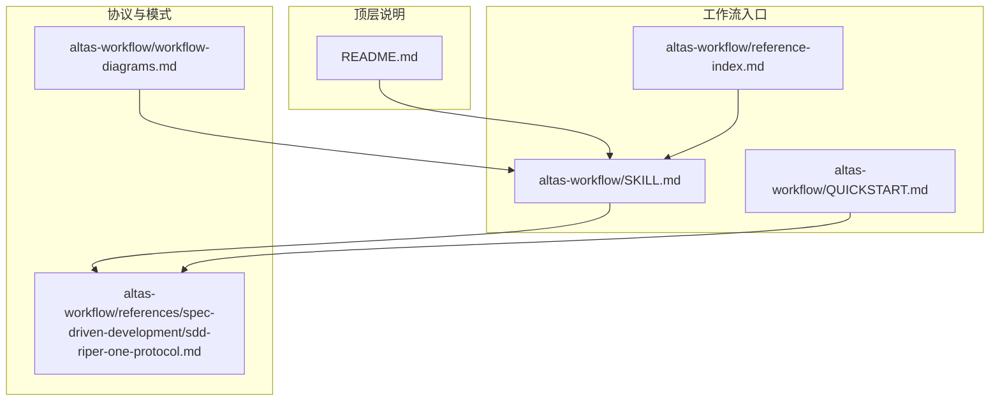
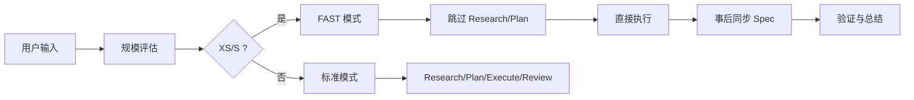
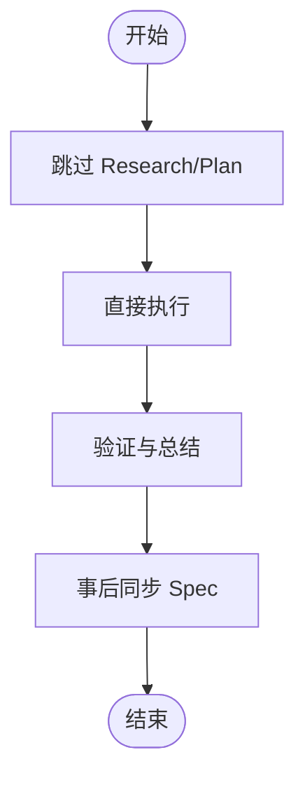
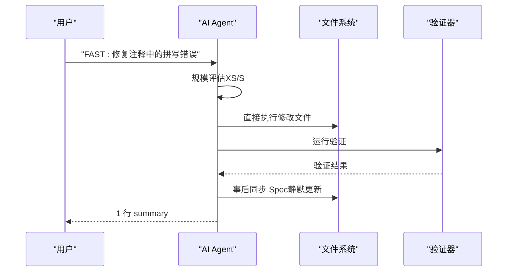
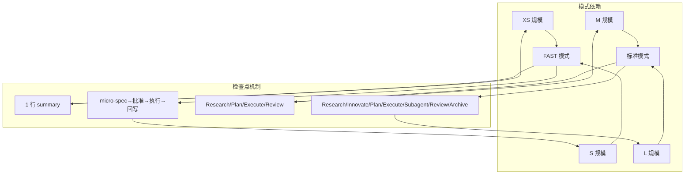

# FAST 极速模式

<cite>
**本文引用的文件**
- [README.md](file://README.md)
- [altas-workflow/SKILL.md](file://altas-workflow/SKILL.md)
- [altas-workflow/QUICKSTART.md](file://altas-workflow/QUICKSTART.md)
- [altas-workflow/reference-index.md](file://altas-workflow/reference-index.md)
- [altas-workflow/references/spec-driven-development/sdd-riper-one-protocol.md](file://altas-workflow/references/spec-driven-development/sdd-riper-one-protocol.md)
- [altas-workflow/workflow-diagrams.md](file://altas-workflow/workflow-diagrams.md)
</cite>

## 目录
1. [简介](#简介)
2. [项目结构](#项目结构)
3. [核心组件](#核心组件)
4. [架构概览](#架构概览)
5. [详细组件分析](#详细组件分析)
6. [依赖关系分析](#依赖关系分析)
7. [性能考量](#性能考量)
8. [故障排除指南](#故障排除指南)
9. [结论](#结论)
10. [附录](#附录)

## 简介
本文件系统性阐述 ALTAS Workflow 中的 FAST 极速模式，面向需要快速交付的场景，包括 typo 修复、配置修改、紧急 hotfix 等小型任务。FAST 模式通过跳过 Research/Plan 阶段，直接执行并事后同步 Spec，实现"极速交付"。同时，文档深入解析其触发条件、设计理念、适用场景、三个核心执行步骤、优势与风险、配置参数、最佳实践与使用限制，并提供实际应用案例与排障建议，帮助开发者在保证质量的前提下高效使用这一特殊工作模式。

## 项目结构
FAST 极速模式位于 ALTAS Workflow 的统一工作流体系中，核心文件分布如下：
- 核心协议与触发词定义：位于 `altas-workflow/references/spec-driven-development/sdd-riper-one-protocol.md`
- 工作流入口与模式路由：位于 `altas-workflow/SKILL.md`
- 快速启动与典型场景：位于 `altas-workflow/QUICKSTART.md`
- 参考资料索引与按需加载：位于 `altas-workflow/reference-index.md`
- 工作流可视化与铁律约束：位于 `altas-workflow/workflow-diagrams.md`
- 顶层说明与规模评估：位于 `README.md`

**图表来源**
- [altas-workflow/SKILL.md:1-385](file://altas-workflow/SKILL.md#L1-L385)
- [altas-workflow/QUICKSTART.md:1-182](file://altas-workflow/QUICKSTART.md#L1-L182)
- [altas-workflow/reference-index.md:1-210](file://altas-workflow/reference-index.md#L1-L210)
- [altas-workflow/references/spec-driven-development/sdd-riper-one-protocol.md:260-283](file://altas-workflow/references/spec-driven-development/sdd-riper-one-protocol.md#L260-L283)
- [altas-workflow/workflow-diagrams.md:71-128](file://altas-workflow/workflow-diagrams.md#L71-L128)

**章节来源**
- [README.md:1-673](file://README.md#L1-L673)
- [altas-workflow/SKILL.md:1-385](file://altas-workflow/SKILL.md#L1-L385)
- [altas-workflow/QUICKSTART.md:1-182](file://altas-workflow/QUICKSTART.md#L1-L182)
- [altas-workflow/reference-index.md:1-210](file://altas-workflow/reference-index.md#L1-L210)
- [altas-workflow/references/spec-driven-development/sdd-riper-one-protocol.md:260-283](file://altas-workflow/references/spec-driven-development/sdd-riper-one-protocol.md#L260-L283)
- [altas-workflow/workflow-diagrams.md:71-128](file://altas-workflow/workflow-diagrams.md#L71-L128)

## 核心组件
- 触发词与模式路由
  - FAST 模式触发词：`FAST`、`快速`、`>>`，用于 XS/S 规模的极速通道
  - 模式路由：入口根据用户意图选择 Coding/Debug/Doc/Map/Archive，再进行规模评估
- 三个核心执行步骤
  - 跳过 Research/Plan：直接进入执行阶段
  - 直接执行：实现请求的变更
  - 事后同步 Spec：在编码完成后静默更新 Spec 文件以匹配新现实
- 允许与限制
  - 允许：UI 微调、配置修改、单文件逻辑、typo、日志
  - 限制：若任务涉及超过 2 个核心文件或架构级改动，暂停并建议切换到标准模式
- 质量保障
  - Evidence First：完成由验证结果证明
  - Reverse Sync：执行中发现偏差→先更新 Spec→再修代码
  - 验证与总结：XS 规模直接执行→验证→1 行 summary

**章节来源**
- [altas-workflow/SKILL.md:253-307](file://altas-workflow/SKILL.md#L253-L307)
- [altas-workflow/references/spec-driven-development/sdd-riper-one-protocol.md:260-283](file://altas-workflow/references/spec-driven-development/sdd-riper-one-protocol.md#L260-L283)
- [README.md:241-242](file://README.md#L241-L242)

## 架构概览
FAST 极速模式在 ALTAS Workflow 的统一入口下运行，遵循"规模评估→模式路由→按需加载→检查点推进"的总体流程。FAST 模式在 XS/S 规模下，跳过 Research/Plan 阶段，直接进入执行与事后同步。

**图表来源**
- [altas-workflow/SKILL.md:162-251](file://altas-workflow/SKILL.md#L162-L251)
- [altas-workflow/references/spec-driven-development/sdd-riper-one-protocol.md:260-283](file://altas-workflow/references/spec-driven-development/sdd-riper-one-protocol.md#L260-L283)
- [README.md:239-244](file://README.md#L239-L244)

## 详细组件分析

### FAST 模式触发条件与设计理念
- 触发条件
  - 命令触发：`FAST`、`快速`、`>>`
  - 上下文触发：用户明确表达特定、孤立的变更
- 设计理念
  - 极速交付：跳过 Research/Plan，直接执行，减少沟通与审批成本
  - 事后同步：在编码完成后静默更新 Spec，确保文档与现实一致
  - 适用场景：typo、配置值、<10 行、UI 微调、日志等小型任务
- 触发词速查
  - `FAST` / `快速` / `>>`：极速通道（XS/S）
  - `DEEP`：深度模式（L）
  - `DEBUG` / `排查`：系统化 Debug
  - `MULTI` / `多项目`：多项目协作
  - `DOC` / `写文档`：文档专家模式
  - `MAP` / `链路梳理`：功能级 CodeMap
  - `ARCHIVE` / `归档`：知识沉淀

**章节来源**
- [altas-workflow/SKILL.md:69-81](file://altas-workflow/SKILL.md#L69-L81)
- [altas-workflow/SKILL.md:255-261](file://altas-workflow/SKILL.md#L255-L261)
- [README.md:177-191](file://README.md#L177-L191)

### FAST 模式的三个核心执行步骤
- 步骤一：跳过 Research/Plan
  - 直接进入执行阶段，避免冗长的研究与规划
- 步骤二：直接执行
  - 实现请求的变更，遵循 Evidence First 与 Reverse Sync 原则
- 步骤三：事后同步 Spec
  - 在编码完成后静默更新 Spec 文件，确保文档与现实一致

**图表来源**
- [altas-workflow/references/spec-driven-development/sdd-riper-one-protocol.md:270-277](file://altas-workflow/references/spec-driven-development/sdd-riper-one-protocol.md#L270-L277)

**章节来源**
- [altas-workflow/references/spec-driven-development/sdd-riper-one-protocol.md:270-277](file://altas-workflow/references/spec-driven-development/sdd-riper-one-protocol.md#L270-L277)

### FAST 模式的适用场景与限制
- 适用场景
  - typo 修复、配置修改、UI 微调、日志调整、单文件逻辑变更
  - 紧急 hotfix（如线上配置调整）
- 使用限制
  - 允许范围：UI 微调、配置、单文件逻辑、typo、日志
  - 升级条件：若任务涉及 >2 个核心文件或架构级改动，暂停并建议切换到标准模式
- 规模评估速查
  - XS：typo、配置值、<10 行，跳过 Spec，事后 1 行 summary
  - S：1-2 文件，逻辑清晰，micro-spec（1-3 句）

**章节来源**
- [README.md:239-244](file://README.md#L239-L244)
- [README.md:241-242](file://README.md#L241-L242)
- [altas-workflow/SKILL.md:55-62](file://altas-workflow/SKILL.md#L55-L62)

### FAST 模式的配置参数与最佳实践
- 触发词与命令
  - `FAST` / `快速` / `>>`：触发极速通道
  - `DEEP`：深度模式（L）
  - `DEBUG`：系统化 Debug
  - `MULTI`：多项目协作
  - `DOC`：文档专家模式
  - `MAP`：功能级 CodeMap
  - `ARCHIVE`：知识沉淀
- 最佳实践
  - 保持变更的孤立性与明确性，避免跨模块影响
  - 严格遵循 Evidence First 与 Reverse Sync，确保质量
  - 在执行前明确验证目标，执行后进行总结
  - 遇到复杂度超出预期时，及时升级到标准模式
- 使用限制
  - 不适用于架构级改动或跨模块重大变更
  - 不替代必要的审查与验证流程

**章节来源**
- [altas-workflow/SKILL.md:69-81](file://altas-workflow/SKILL.md#L69-L81)
- [altas-workflow/SKILL.md:114-126](file://altas-workflow/SKILL.md#L114-L126)
- [altas-workflow/QUICKSTART.md:36-49](file://altas-workflow/QUICKSTART.md#L36-L49)

### FAST 模式的优势与潜在风险
- 优势
  - 极速交付：跳过 Research/Plan，显著缩短交付周期
  - 低门槛：无需复杂的规划与审批，适合小型任务
  - 事后同步：确保文档与现实一致，避免脱节
- 潜在风险
  - 缺乏系统性规划：可能导致遗漏边界条件或副作用
  - 质量控制：过度依赖事后同步，可能忽略早期验证
  - 复杂度误判：若任务实际涉及多模块，可能引发架构风险
- 风险缓解
  - 明确变更范围，避免跨模块影响
  - 严格执行 Evidence First 与 Reverse Sync
  - 遇到复杂度超出预期时，立即升级到标准模式

**章节来源**
- [altas-workflow/SKILL.md:114-126](file://altas-workflow/SKILL.md#L114-L126)
- [altas-workflow/references/spec-driven-development/sdd-riper-one-protocol.md:278-282](file://altas-workflow/references/spec-driven-development/sdd-riper-one-protocol.md#L278-L282)

### FAST 模式应用案例
- 案例一：紧急修复线上配置（XS）
  - 输入：`>> 将 src/config.ts 中的 MAX_RETRIES 从 3 改为 5`
  - 行为：识别为 XS（极速）→ 直接修改代码→运行验证→1 行 summary
  - 输出：1 行 summary：`修改 MAX_RETRIES 从 3→5，验证通过`
- 案例二：小任务（S）
  - 输入：`FAST: 为登录接口添加图形验证码`
  - 行为：micro-spec→批准→执行→回写
  - 输出：micro-spec 文档与代码改动
- 案例三：typo 修复
  - 输入：`FAST: 修复注释中的拼写错误`
  - 行为：直接执行→验证→1 行 summary
  - 输出：1 行 summary：`修复注释拼写错误，验证通过`

**图表来源**
- [altas-workflow/QUICKSTART.md:67-75](file://altas-workflow/QUICKSTART.md#L67-L75)
- [altas-workflow/references/spec-driven-development/sdd-riper-one-protocol.md:270-277](file://altas-workflow/references/spec-driven-development/sdd-riper-one-protocol.md#L270-L277)

**章节来源**
- [altas-workflow/QUICKSTART.md:67-75](file://altas-workflow/QUICKSTART.md#L67-L75)
- [README.md:442-456](file://README.md#L442-L456)

## 依赖关系分析
FAST 模式在 ALTAS Workflow 中与其他模式存在明确的依赖与协作关系：
- 与标准模式的协作
  - 当 FAST 模式遇到复杂度超出预期时，自动暂停并建议升级到标准模式
- 与按需加载机制的配合
  - FAST 模式在 XS/S 规模下无需加载参考文档，但可在需要时按需加载
- 与检查点机制的集成
  - XS 规模的 FAST 模式以 1 行 summary 结束，S 规模以 micro-spec→批准→执行→回写结束

**图表来源**
- [altas-workflow/SKILL.md:129-159](file://altas-workflow/SKILL.md#L129-L159)
- [altas-workflow/QUICKSTART.md:36-49](file://altas-workflow/QUICKSTART.md#L36-L49)
- [README.md:239-244](file://README.md#L239-L244)

**章节来源**
- [altas-workflow/SKILL.md:129-159](file://altas-workflow/SKILL.md#L129-L159)
- [altas-workflow/QUICKSTART.md:36-49](file://altas-workflow/QUICKSTART.md#L36-L49)
- [README.md:239-244](file://README.md#L239-L244)

## 性能考量
- 时间效率
  - 跳过 Research/Plan 显著减少沟通与审批时间，适合高频小任务
- 资源占用
  - XS/S 规模下无需加载参考文档，降低上下文装配成本
- 质量保障
  - Evidence First 与 Reverse Sync 确保执行质量与文档一致性
- 适用性
  - 高频小任务场景下收益最大，复杂任务应升级到标准模式

[本节为一般性讨论，无需引用具体文件]

## 故障排除指南
- FAST 模式无法触发
  - 检查触发词是否正确：`FAST`、`快速`、`>>`
  - 确认任务描述是否明确表达特定、孤立的变更
- 执行后文档未更新
  - 确认 FAST 模式是否正确识别为 XS/S 规模
  - 检查事后同步 Spec 是否正常执行
- 复杂度超出预期
  - FAST 模式会自动暂停并建议升级到标准模式
  - 用户可手动选择 `[升级为 M]` 或 `[降级为 S]`
- 验证失败
  - 严格遵循 Evidence First，确保验证通过后再总结
  - 如需修复，可进入标准模式或 FAST 模式继续

**章节来源**
- [altas-workflow/SKILL.md:64-68](file://altas-workflow/SKILL.md#L64-L68)
- [altas-workflow/SKILL.md:114-126](file://altas-workflow/SKILL.md#L114-L126)

## 结论
FAST 极速模式通过跳过 Research/Plan 阶段，直接执行并事后同步 Spec，实现了在保证质量前提下的极速交付。它特别适用于 typo、配置修改、UI 微调、日志调整等小型任务。开发者应在明确变更范围、严格遵循 Evidence First 与 Reverse Sync 的前提下，谨慎使用 FAST 模式，并在遇到复杂度超出预期时及时升级到标准模式，以确保整体质量与可维护性。

[本节为总结性内容，无需引用具体文件]

## 附录
- 参考资料索引
  - 按需加载机制：在命中场景时按需读取对应文件，避免上下文污染
  - 核心参考文件：Spec 模板、命令参数、TDD 执行、Debug 模式、写 Plan、Subagent 驱动、完成前验证、进入 Review、快速参考、完整协议定义、落盘命名约定、流程可视化参考
- 产物命名约定
  - CodeMap（功能级）、CodeMap（项目级）、Context Bundle、Spec（M/L）、Micro-spec（S）、Archive（human）、Archive（llm）

**章节来源**
- [altas-workflow/reference-index.md:310-332](file://altas-workflow/reference-index.md#L310-L332)
- [altas-workflow/SKILL.md:335-348](file://altas-workflow/SKILL.md#L335-L348)