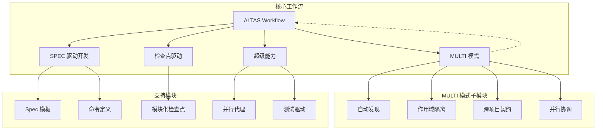
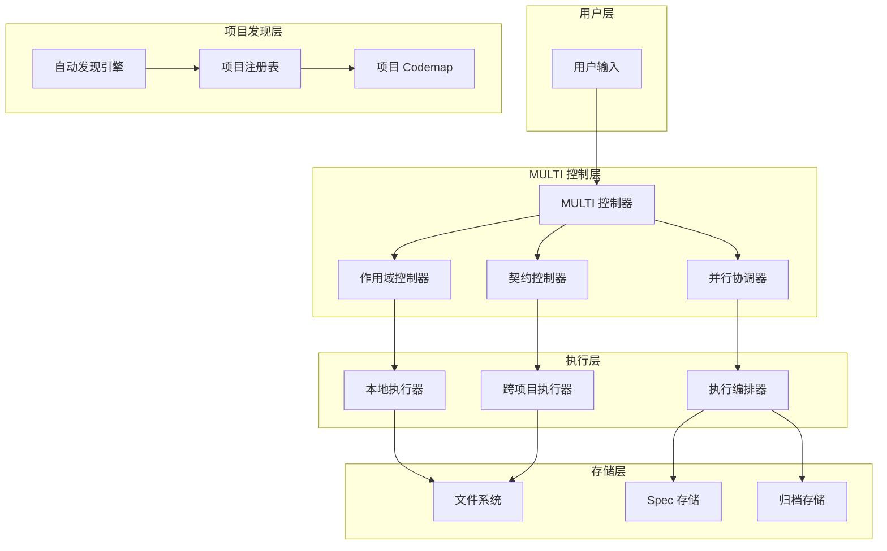
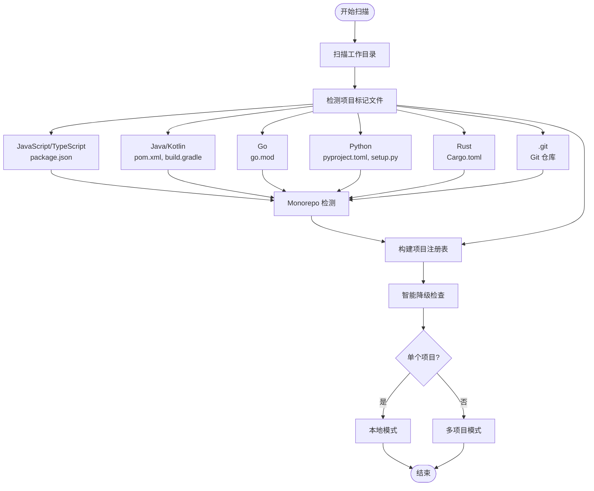
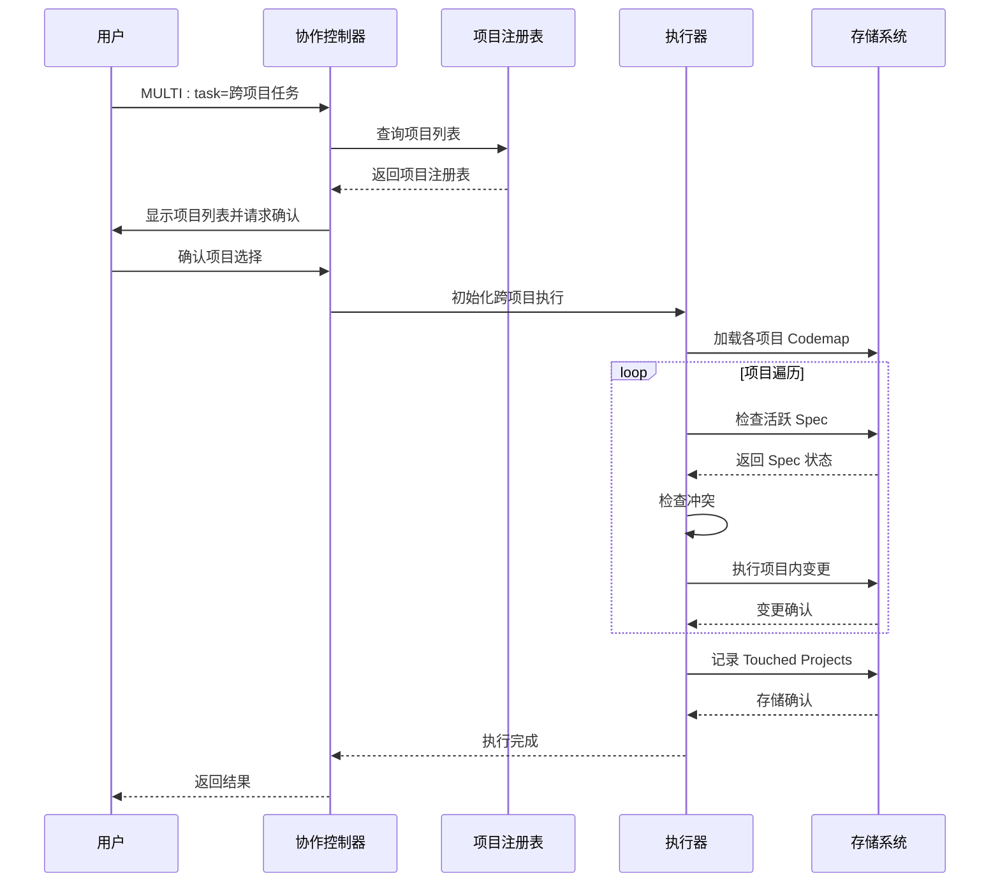
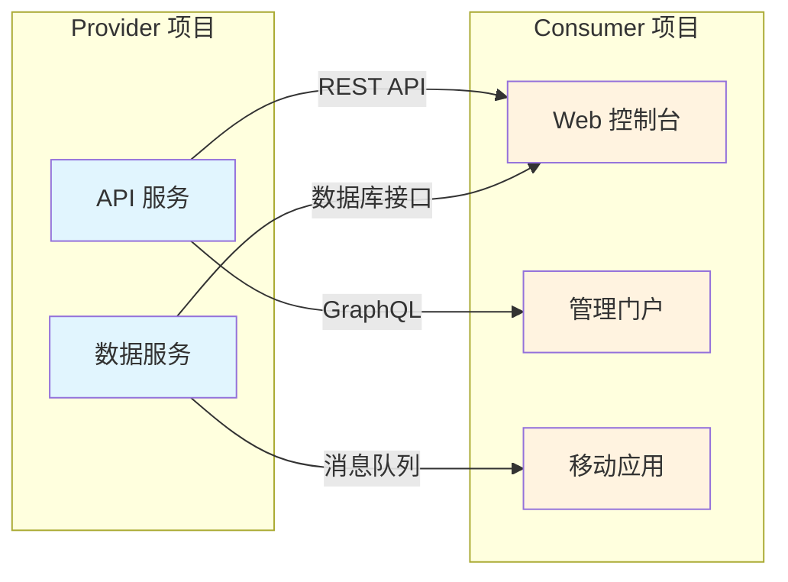
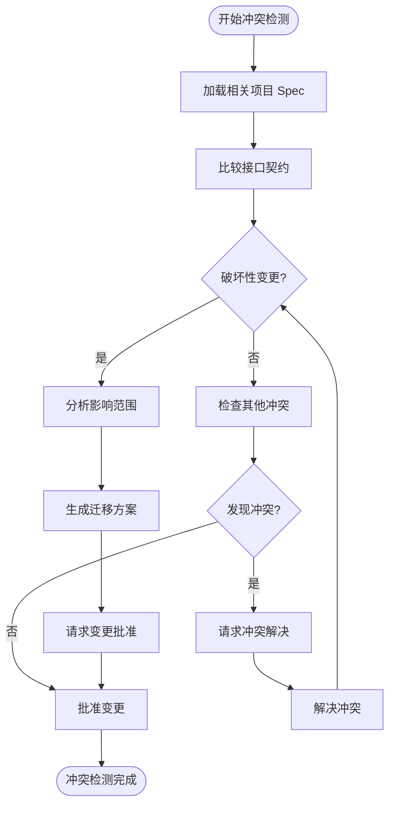
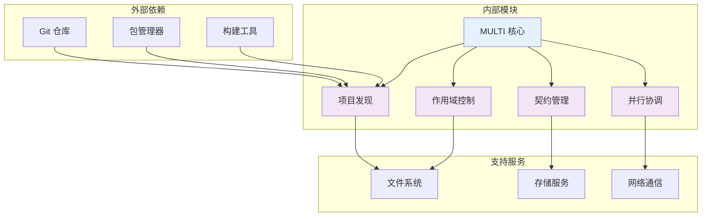

# MULTI 多项目协作模式

<cite>
**本文档引用的文件**
- [altas-workflow/QUICKSTART.md](file://altas-workflow/QUICKSTART.md)
- [altas-workflow/SKILL.md](file://altas-workflow/SKILL.md)
- [altas-workflow/reference-index.md](file://altas-workflow/reference-index.md)
- [altas-workflow/workflow-diagrams.md](file://altas-workflow/workflow-diagrams.md)
- [altas-workflow/references/spec-driven-development/multi-project.md](file://altas-workflow/references/spec-driven-development/multi-project.md)
- [altas-workflow/references/agents/sdd-riper-one/references/multi-project.md](file://altas-workflow/references/agents/sdd-riper-one/references/multi-project.md)
- [altas-workflow/references/checkpoint-driven/modules.md](file://altas-workflow/references/checkpoint-driven/modules.md)
- [altas-workflow/references/spec-driven-development/usage-examples.md](file://altas-workflow/references/spec-driven-development/usage-examples.md)
- [altas-workflow/references/spec-driven-development/sdd-riper-one-protocol.md](file://altas-workflow/references/spec-driven-development/sdd-riper-one-protocol.md)
- [altas-workflow/protocols/RIPER-5.md](file://altas-workflow/protocols/RIPER-5.md)
- [altas-workflow/scripts/archive_builder.py](file://altas-workflow/scripts/archive_builder.py)
</cite>

## 目录
1. [简介](#简介)
2. [项目结构](#项目结构)
3. [核心组件](#核心组件)
4. [架构概览](#架构概览)
5. [详细组件分析](#详细组件分析)
6. [依赖分析](#依赖分析)
7. [性能考虑](#性能考虑)
8. [故障排除指南](#故障排除指南)
9. [结论](#结论)
10. [附录](#附录)

## 简介
MULTI 多项目协作模式是 ALTAS Workflow 的核心能力之一，专为跨仓库、多子项目的复杂开发场景设计。该模式通过自动项目发现机制、严格的跨项目协作策略和完善的项目间依赖管理，实现了从项目识别到任务完成的完整生命周期管理。

MULTI 模式的核心价值在于：
- **自动化项目发现**：智能识别 monorepo 和多仓库结构
- **作用域隔离**：确保变更在受控范围内进行
- **跨项目契约管理**：建立清晰的接口定义和依赖关系
- **并行执行协调**：支持多项目并行开发和进度协调

## 项目结构
ALTAS Workflow 采用模块化设计，MULTI 模式作为独立的工作流模块集成在整体架构中：

**图表来源**
- [altas-workflow/SKILL.md:275-282](file://altas-workflow/SKILL.md#L275-L282)
- [altas-workflow/reference-index.md:94-100](file://altas-workflow/reference-index.md#L94-L100)

**章节来源**
- [altas-workflow/SKILL.md:1-50](file://altas-workflow/SKILL.md#L1-L50)
- [altas-workflow/reference-index.md:1-50](file://altas-workflow/reference-index.md#L1-L50)

## 核心组件
MULTI 模式由四个核心组件构成，每个组件都有明确的职责和交互关系：

### 1. 自动项目发现引擎
负责扫描工作目录，识别子项目并建立项目注册表。支持多种语言的项目标记文件识别，包括 monorepo 结构检测。

### 2. 作用域隔离控制器
管理项目的访问权限和变更范围，确保默认情况下只能修改当前活跃项目，跨项目变更需要显式授权。

### 3. 跨项目契约管理系统
维护项目间的接口契约，记录 Provider-Consumer 关系、破坏性变更和迁移方案。

### 4. 并行执行协调器
协调多项目的并行开发，按照依赖顺序执行变更，确保系统的一致性和完整性。

**章节来源**
- [altas-workflow/references/spec-driven-development/multi-project.md:5-57](file://altas-workflow/references/spec-driven-development/multi-project.md#L5-L57)
- [altas-workflow/references/agents/sdd-riper-one/references/multi-project.md:5-57](file://altas-workflow/references/agents/sdd-riper-one/references/multi-project.md#L5-L57)

## 架构概览
MULTI 模式的整体架构采用分层设计，从底层的项目发现到顶层的任务协调，形成了完整的协作生态系统：

**图表来源**
- [altas-workflow/references/spec-driven-development/sdd-riper-one-protocol.md:389-529](file://altas-workflow/references/spec-driven-development/sdd-riper-one-protocol.md#L389-L529)
- [altas-workflow/workflow-diagrams.md:1-42](file://altas-workflow/workflow-diagrams.md#L1-L42)

## 详细组件分析

### 自动项目发现机制
自动发现机制是 MULTI 模式的核心基础设施，负责识别和分类各种类型的项目结构：

**图表来源**
- [altas-workflow/references/spec-driven-development/multi-project.md:8-13](file://altas-workflow/references/spec-driven-development/multi-project.md#L8-L13)
- [altas-workflow/references/agents/sdd-riper-one/references/multi-project.md:8-13](file://altas-workflow/references/agents/sdd-riper-one/references/multi-project.md#L8-L13)

#### 项目边界识别策略
项目边界识别采用多层次的启发式算法：

1. **语言特定标记**：针对不同编程语言使用相应的项目标记文件
2. **Monorepo 检测**：识别工作空间配置文件，支持多种工具链
3. **Git 边界**：利用 Git 仓库边界作为项目分隔符
4. **智能降级**：根据项目数量自动调整协作模式

#### 支持的项目类型
- **前端项目**：JavaScript/TypeScript (package.json)
- **后端服务**：Java/Kotlin (pom.xml, build.gradle)
- **Go 服务**：Go (go.mod)
- **Python 应用**：Python (pyproject.toml, setup.py)
- **Rust 项目**：Rust (Cargo.toml)
- **Monorepo**：支持多种工作空间配置

**章节来源**
- [altas-workflow/references/spec-driven-development/multi-project.md:8-13](file://altas-workflow/references/spec-driven-development/multi-project.md#L8-L13)
- [altas-workflow/references/agents/sdd-riper-one/references/multi-project.md:8-13](file://altas-workflow/references/agents/sdd-riper-one/references/multi-project.md#L8-L13)

### 跨项目协作策略
跨项目协作策略确保在复杂的多项目环境中实现安全、可控的变更管理：

**图表来源**
- [altas-workflow/references/spec-driven-development/sdd-riper-one-protocol.md:423-488](file://altas-workflow/references/spec-driven-development/sdd-riper-one-protocol.md#L423-L488)
- [altas-workflow/workflow-diagrams.md:291-337](file://altas-workflow/workflow-diagrams.md#L291-L337)

#### 作用域隔离规则
作用域隔离是 MULTI 模式的核心安全机制：

1. **默认本地模式**：仅允许修改当前活跃项目
2. **显式跨项目授权**：需要明确的 CROSS 命令或触发词
3. **Codemap 优先**：任何项目变更前必须加载对应的 Codemap
4. **变更记录**：跨项目执行后必须记录受影响的项目

#### 跨项目依赖管理
系统通过契约接口管理跨项目依赖关系：

**图表来源**
- [altas-workflow/references/spec-driven-development/sdd-riper-one-protocol.md:433-460](file://altas-workflow/references/spec-driven-development/sdd-riper-one-protocol.md#L433-L460)

**章节来源**
- [altas-workflow/references/spec-driven-development/sdd-riper-one-protocol.md:423-488](file://altas-workflow/references/spec-driven-development/sdd-riper-one-protocol.md#L423-L488)

### 项目间依赖管理
项目间依赖管理确保变更的原子性和一致性，防止出现悬挂依赖和不一致状态：

#### 依赖识别与建模
系统自动识别项目间的依赖关系，包括：

1. **直接依赖**：API 调用、数据库连接、消息传递
2. **间接依赖**：通过中间层或共享组件的依赖
3. **运行时依赖**：部署和运行时的依赖关系

#### 变更传播控制
通过严格的变更传播控制机制：

1. **Provider-Consumer 顺序**：先修改提供者，再修改消费者
2. **破坏性变更检测**：自动识别可能的破坏性变更
3. **迁移方案生成**：为破坏性变更生成迁移指导

#### 冲突检测与解决
系统提供多层次的冲突检测：

**图表来源**
- [altas-workflow/references/spec-driven-development/sdd-riper-one-protocol.md:441-445](file://altas-workflow/references/spec-driven-development/sdd-riper-one-protocol.md#L441-L445)

**章节来源**
- [altas-workflow/references/spec-driven-development/sdd-riper-one-protocol.md:433-460](file://altas-workflow/references/spec-driven-development/sdd-riper-one-protocol.md#L433-L460)

### 任务分解与资源分配
MULTI 模式采用智能的任务分解和资源分配策略：

#### 任务分解策略
1. **按项目分组**：将任务分解为各个项目的子任务
2. **按依赖排序**：根据依赖关系确定执行顺序
3. **按复杂度分级**：根据任务复杂度分配资源

#### 资源分配机制
- **CPU 资源**：并行执行不同项目的任务
- **存储资源**：隔离各项目的变更历史
- **网络资源**：协调跨项目的数据传输

#### 进度协调方法
系统提供多种进度协调机制：

```mermaid
gantt
title MULTI 任务执行甘特图
dateFormat X
axisFormat %s
section 项目发现
自动发现 :done, discovery, 0, 5
section 规划阶段
项目分析 :active, analysis, 5, 15
依赖识别 :active, dependency, 10, 25
任务分解 :active, decomposition, 20, 35
section 执行阶段
Provider 执行 :active, provider, 35, 70
Consumer 执行 :active, consumer, 60, 100
并行协调 :active, coordination, 50, 90
section 收尾阶段
质量检查 :active, validation, 95, 110
归档总结 :active, archive, 105, 120
```

**图表来源**
- [altas-workflow/workflow-diagrams.md:129-151](file://altas-workflow/workflow-diagrams.md#L129-L151)

**章节来源**
- [altas-workflow/references/spec-driven-development/usage-examples.md:258-320](file://altas-workflow/references/spec-driven-development/usage-examples.md#L258-L320)

## 依赖分析
MULTI 模式的依赖关系呈现复杂的层次结构：

**图表来源**
- [altas-workflow/reference-index.md:109-173](file://altas-workflow/reference-index.md#L109-L173)

### 直接依赖
- **项目发现**：依赖于文件系统扫描和配置文件解析
- **作用域控制**：依赖于文件系统权限管理和变更跟踪
- **契约管理**：依赖于存储系统和版本控制
- **并行协调**：依赖于网络通信和分布式锁

### 间接依赖
- **工作流集成**：与 ALTAS 主工作流的深度集成
- **工具链支持**：支持多种开发工具和平台
- **协议兼容**：遵循标准的开发协议和规范

**章节来源**
- [altas-workflow/reference-index.md:1-50](file://altas-workflow/reference-index.md#L1-L50)

## 性能考虑
MULTI 模式在设计时充分考虑了性能优化：

### 并行执行优化
- **智能调度**：根据项目依赖关系动态调度执行
- **资源池管理**：合理分配 CPU 和内存资源
- **I/O 优化**：减少文件系统和网络 I/O 操作

### 内存使用优化
- **增量加载**：按需加载项目信息和变更数据
- **缓存策略**：合理使用缓存提高访问速度
- **垃圾回收**：及时释放不再使用的资源

### 网络通信优化
- **批量操作**：合并相似的网络请求
- **连接复用**：复用网络连接减少开销
- **异步处理**：使用异步操作提高响应速度

## 故障排除指南
MULTI 模式提供了完善的故障排除机制：

### 常见问题诊断
1. **项目发现失败**：检查项目标记文件是否存在
2. **跨项目变更被拒绝**：确认是否正确设置了跨项目模式
3. **依赖冲突**：检查接口契约是否匹配
4. **执行顺序错误**：验证项目间的依赖关系

### 错误处理策略
- **自动恢复**：系统能够自动处理大部分常见错误
- **手动干预**：提供明确的手动干预指导
- **日志记录**：详细记录所有操作和错误信息

### 性能监控
- **执行时间监控**：跟踪各阶段的执行时间
- **资源使用监控**：监控 CPU、内存和磁盘使用情况
- **错误率统计**：统计错误发生频率和类型

**章节来源**
- [altas-workflow/references/checkpoint-driven/modules.md:1-57](file://altas-workflow/references/checkpoint-driven/modules.md#L1-L57)

## 结论
MULTI 多项目协作模式代表了现代软件开发协作的最佳实践。通过自动化的项目发现、严格的作用域隔离、完善的契约管理和智能的并行协调，该模式为复杂的多项目开发提供了可靠的解决方案。

该模式的核心优势包括：
- **自动化程度高**：减少手动配置和管理工作
- **安全性强**：通过多重检查点确保变更的安全性
- **可扩展性好**：支持从小型团队到大型组织的各种规模
- **易用性强**：提供直观的界面和清晰的操作流程

随着软件系统复杂性的不断增加，MULTI 模式将继续演进，为团队协作提供更好的支持。

## 附录

### 配置选项详解
MULTI 模式提供了丰富的配置选项：

#### 基础配置
- **工作目录**：指定项目扫描的根目录
- **项目列表**：显式指定要协作的项目
- **默认模式**：设置默认的协作模式

#### 高级配置
- **超时设置**：配置操作超时时间
- **并发限制**：限制同时执行的项目数量
- **日志级别**：设置详细的日志输出

#### 触发词参考
- **MULTI / 多项目**：进入多项目模式
- **CROSS / 跨项目**：启用跨项目变更
- **SWITCH / 切换**：切换活跃项目
- **REGISTRY / 项目列表**：显示项目注册表
- **SCOPE LOCAL / 回到本地**：重置为本地模式

### 团队协作规范
MULTI 模式建议的团队协作规范：

#### 开发流程
1. **需求分析**：明确跨项目需求和边界
2. **项目发现**：自动识别相关项目
3. **契约制定**：定义项目间接口契约
4. **任务分解**：按项目和依赖关系分解任务
5. **执行协调**：协调各项目的并行执行
6. **质量保证**：确保变更质量和一致性

#### 沟通机制
- **定期同步**：定期召开项目同步会议
- **变更通知**：及时通知相关项目的变更
- **问题反馈**：建立问题反馈和解决机制
- **知识分享**：分享最佳实践和经验教训

### 实际案例分析
MULTI 模式在实际项目中的应用案例：

#### 案例一：前后端联动发布
场景描述：需要同时发布前端控制台和后端 API 服务的新功能。

实施步骤：
1. 自动发现 web-console 和 api-service 两个项目
2. 分析项目间的依赖关系和接口契约
3. 制定按 Provider-Consumer 顺序的执行计划
4. 并行协调两个项目的发布过程
5. 验证发布结果和系统一致性

#### 案例二：微服务架构演进
场景描述：需要重构现有的 monorepo 为微服务架构。

实施步骤：
1. 识别现有的 monorepo 结构和项目边界
2. 设计新的微服务架构和接口契约
3. 制定渐进式的重构计划
4. 协调各微服务的独立开发和部署
5. 确保系统的整体一致性和稳定性

**章节来源**
- [altas-workflow/references/spec-driven-development/usage-examples.md:174-334](file://altas-workflow/references/spec-driven-development/usage-examples.md#L174-L334)