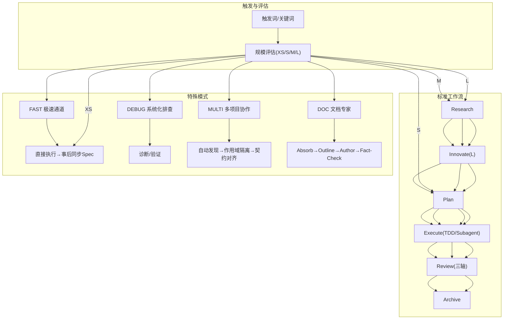
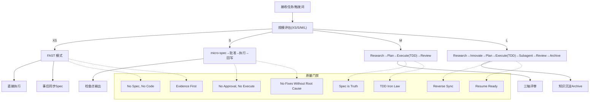
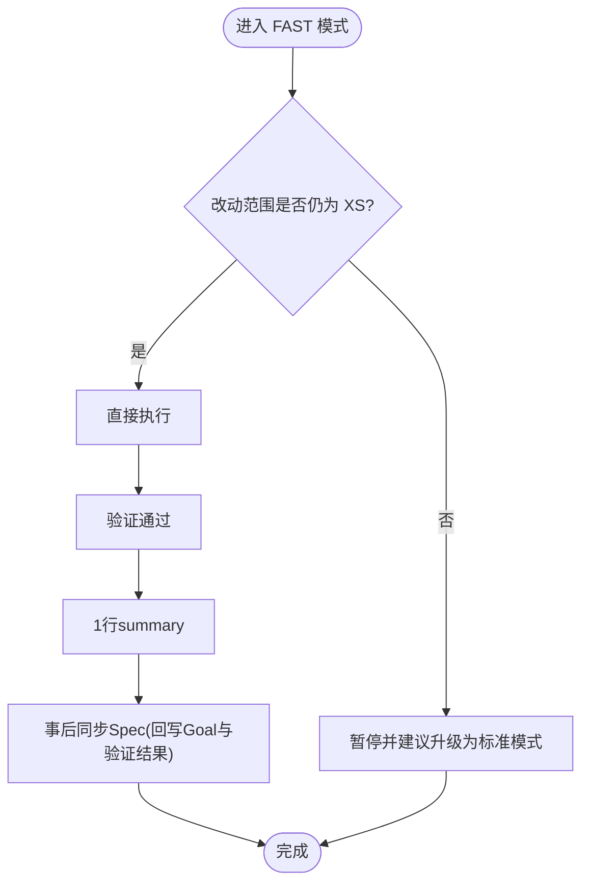
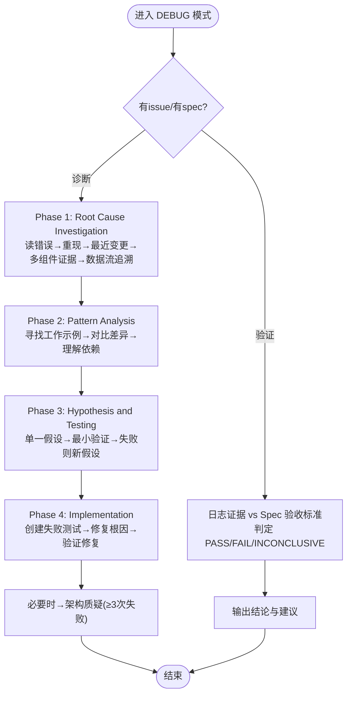
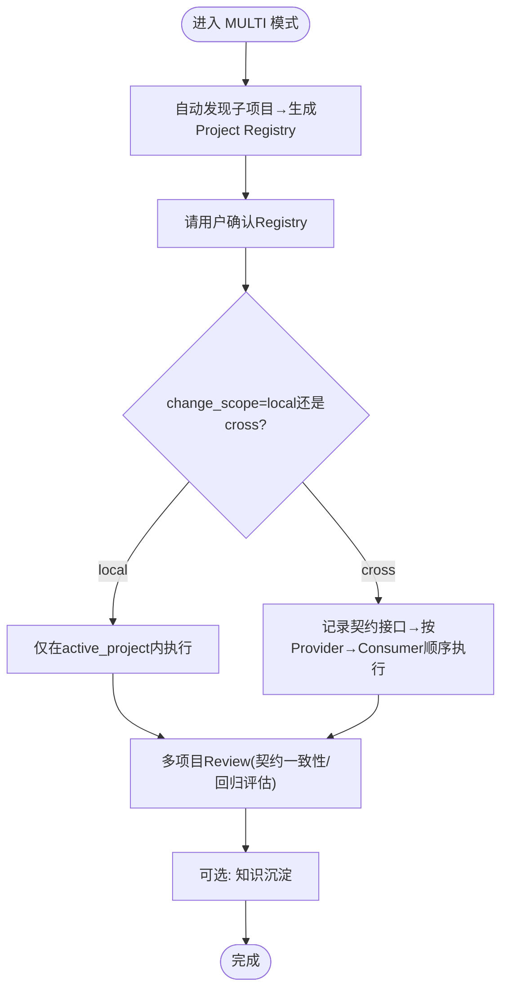
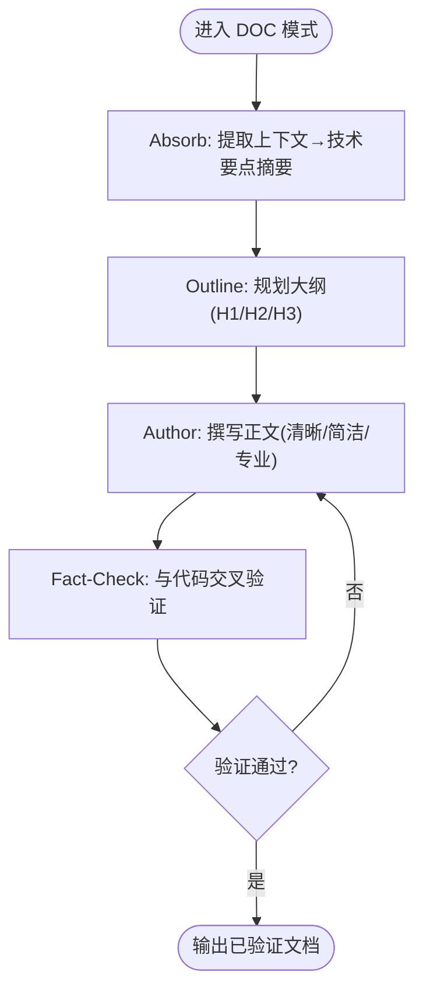
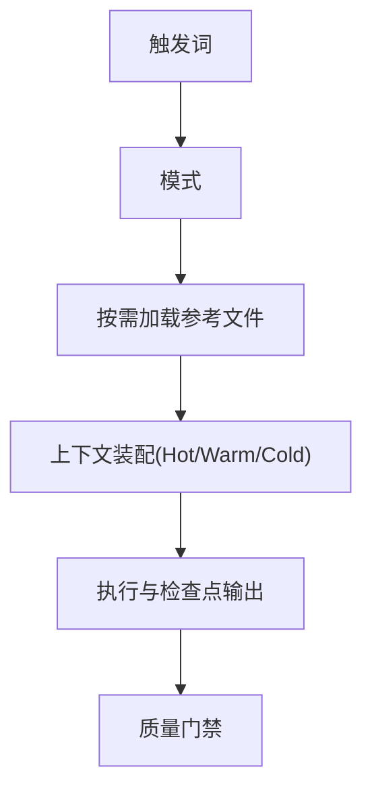
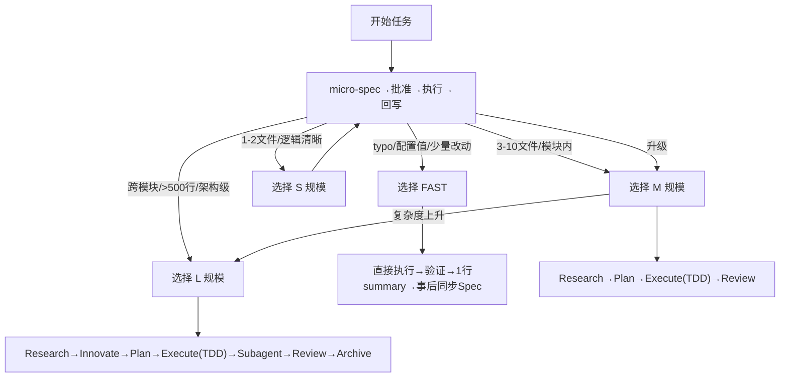

# 特殊工作模式

<cite>
**本文引用的文件**
- [altas-workflow/QUICKSTART.md](file://altas-workflow/QUICKSTART.md)
- [altas-workflow/SKILL.md](file://altas-workflow/SKILL.md)
- [altas-workflow/reference-index.md](file://altas-workflow/reference-index.md)
- [altas-workflow/workflow-diagrams.md](file://altas-workflow/workflow-diagrams.md)
- [altas-workflow/protocols/RIPER-DOC.md](file://altas-workflow/protocols/RIPER-DOC.md)
- [altas-workflow/references/superpowers/systematic-debugging/SKILL.md](file://altas-workflow/references/superpowers/systematic-debugging/SKILL.md)
- [altas-workflow/references/superpowers/systematic-debugging/root-cause-tracing.md](file://altas-workflow/references/superpowers/systematic-debugging/root-cause-tracing.md)
- [altas-workflow/references/superpowers/systematic-debugging/defense-in-depth.md](file://altas-workflow/references/superpowers/systematic-debugging/defense-in-depth.md)
- [altas-workflow/references/superpowers/systematic-debugging/condition-based-waiting.md](file://altas-workflow/references/superpowers/systematic-debugging/condition-based-waiting.md)
- [altas-workflow/references/spec-driven-development/multi-project.md](file://altas-workflow/references/spec-driven-development/multi-project.md)
- [altas-workflow/references/spec-driven-development/sdd-riper-one-protocol.md](file://altas-workflow/references/spec-driven-development/sdd-riper-one-protocol.md)
- [altas-workflow/docs/AI-原生研发范式-从代码中心到文档驱动的演进.md](file://altas-workflow/docs/AI-原生研发范式-从代码中心到文档驱动的演进.md)
</cite>

## 目录
1. [简介](#简介)
2. [项目结构](#项目结构)
3. [核心组件](#核心组件)
4. [架构总览](#架构总览)
5. [详细组件分析](#详细组件分析)
6. [依赖分析](#依赖分析)
7. [性能考虑](#性能考虑)
8. [故障排查指南](#故障排查指南)
9. [结论](#结论)
10. [附录](#附录)

## 简介
本文件系统化阐述 ALTAS Workflow 的“特殊工作模式”，包括 FAST 模式（极速通道）、DEBUG 模式（系统化排查）、MULTI 模式（多项目协作）、DOC 模式（文档专家）等。文档围绕设计目的、适用场景、触发条件、执行策略、质量保证机制与决策实践展开，并提供模式切换的决策树、最佳实践与案例评估，帮助开发者在不同任务复杂度与协作需求下，选择并优化模式参数，稳定提升交付质量与效率。

## 项目结构
ALTAS 将“规范驱动开发（Spec-Driven）”“检查点驱动（Checkpoint-Driven）”“超级能力（Superpowers，含 TDD/Subagent/系统化 Debug）”整合为统一工作流，特殊模式作为“按需加载”的子流程，与标准工作流（Research/Plan/Execute/Review/Archive）协同，通过触发词与上下文装配实现无缝衔接。

图表来源
- [altas-workflow/SKILL.md](file://altas-workflow/SKILL.md)
- [altas-workflow/workflow-diagrams.md](file://altas-workflow/workflow-diagrams.md)

章节来源
- [altas-workflow/SKILL.md](file://altas-workflow/SKILL.md)
- [altas-workflow/QUICKSTART.md](file://altas-workflow/QUICKSTART.md)
- [altas-workflow/reference-index.md](file://altas-workflow/reference-index.md)

## 核心组件
- 触发与评估：通过触发词（FAST/DEBUG/MULTI/DOC 等）与任务复杂度评估，自动选择 XS/S/M/L 规模，决定是否进入特殊模式或标准工作流。
- 特殊模式引擎：按需加载对应参考文件，提供子流程与约束，确保质量门禁与可追溯性。
- 质量门禁：No Spec, No Code；No Approval, No Execute；Spec is Truth；Reverse Sync；Evidence First；No Fixes Without Root Cause；TDD 铁律；Resume Ready。
- 上下文装配：Hot/Warm/Cold 三层上下文，按阶段与门禁动态加载，避免上下文腐烂。

章节来源
- [altas-workflow/SKILL.md](file://altas-workflow/SKILL.md)
- [altas-workflow/workflow-diagrams.md](file://altas-workflow/workflow-diagrams.md)

## 架构总览
下图展示特殊模式在整体工作流中的位置与交互关系，突出“按需加载”“质量门禁”“检查点输出”的一致性设计。

图表来源
- [altas-workflow/SKILL.md](file://altas-workflow/SKILL.md)
- [altas-workflow/workflow-diagrams.md](file://altas-workflow/workflow-diagrams.md)

## 详细组件分析

### FAST 模式（极速通道）
- 设计目的
  - 面向 XS 规模（typo/配置值/少量改动），跳过 Research/Plan，直接执行并事后同步 Spec，最大化“快速修复/微调”的吞吐。
- 适用场景
  - UI 微调、配置修改、单文件逻辑、typo、日志修正等。
- 触发条件
  - 触发词：`>>` / `FAST` / `快速`。
- 执行策略
  - 直接执行→验证→1行 summary；若触及>2核心文件或架构改动，暂停并建议升级到标准模式。
- 质量保证机制
  - 事后同步：执行后回写最小 Spec（Goal 与验证结果），确保可追溯；若发现偏差，执行 Reverse Sync（先更新 Spec 再修代码）。
- 与标准模式的关系
  - XS 规模下，FAST 与 S 规模的 micro-spec→批准→执行→回写在“产出形态”上互补：FAST 强调速度，S 强调可审计。

图表来源
- [altas-workflow/SKILL.md](file://altas-workflow/SKILL.md)
- [altas-workflow/QUICKSTART.md](file://altas-workflow/QUICKSTART.md)

章节来源
- [altas-workflow/SKILL.md](file://altas-workflow/SKILL.md)
- [altas-workflow/QUICKSTART.md](file://altas-workflow/QUICKSTART.md)

### DEBUG 模式（系统化排查）
- 设计目的
  - 面向 Bug/测试失败/异常行为，通过系统化四阶段流程定位根因，禁止“症状修复”，确保修复可验证、可追溯。
- 适用场景
  - 生产缺陷、测试失败、性能问题、构建失败、集成问题；尤其在紧急、多次修复无效、不完全理解问题时。
- 触发条件
  - 触发词：`DEBUG` / `排查` / `日志分析`；或携带日志路径与问题描述的任务输入。
- 执行策略
  - 子模式：
    - 诊断模式（有 issue）：日志+Spec+代码三角定位→根因候选；
    - 验证模式（有 spec）：日志证据 vs Spec 验收标准→PASS/FAIL/INCONCLUSIVE。
  - 约束：只读分析；代码修改需进入 RIPER 或 FAST。
- 质量保证机制
  - 铁律：No Fixes Without Root Cause Investigation First；全程 Evidence First；必要时引入纵深防御与条件等待等支撑技术。
  - 支撑技术：
    - 根因追溯（Backward tracing）：从症状点向上追溯原始触发点；
    - 纵深防御（Defense-in-depth）：在每一层增加校验，使问题结构上不可重现；
    - 条件等待（Condition-based waiting）：替代任意超时，等待实际条件满足。
- 与标准模式的关系
  - DEBUG 作为“前置诊断”，可引导进入标准模式的 Research/Plan/Execute/Review，或直接进入 FAST 的修复流程。

图表来源
- [altas-workflow/SKILL.md](file://altas-workflow/SKILL.md)
- [altas-workflow/references/superpowers/systematic-debugging/SKILL.md](file://altas-workflow/references/superpowers/systematic-debugging/SKILL.md)
- [altas-workflow/references/superpowers/systematic-debugging/root-cause-tracing.md](file://altas-workflow/references/superpowers/systematic-debugging/root-cause-tracing.md)
- [altas-workflow/references/superpowers/systematic-debugging/defense-in-depth.md](file://altas-workflow/references/superpowers/systematic-debugging/defense-in-depth.md)
- [altas-workflow/references/superpowers/systematic-debugging/condition-based-waiting.md](file://altas-workflow/references/superpowers/systematic-debugging/condition-based-waiting.md)

章节来源
- [altas-workflow/SKILL.md](file://altas-workflow/SKILL.md)
- [altas-workflow/references/superpowers/systematic-debugging/SKILL.md](file://altas-workflow/references/superpowers/systematic-debugging/SKILL.md)
- [altas-workflow/references/superpowers/systematic-debugging/root-cause-tracing.md](file://altas-workflow/references/superpowers/systematic-debugging/root-cause-tracing.md)
- [altas-workflow/references/superpowers/systematic-debugging/defense-in-depth.md](file://altas-workflow/references/superpowers/systematic-debugging/defense-in-depth.md)
- [altas-workflow/references/superpowers/systematic-debugging/condition-based-waiting.md](file://altas-workflow/references/superpowers/systematic-debugging/condition-based-waiting.md)

### MULTI 模式（多项目协作）
- 设计目的
  - 面向多仓/monorepo/前后端联动/跨子项目任务，实现自动发现、作用域隔离、契约对齐与依赖顺序执行，降低跨项目改动风险。
- 适用场景
  - 多仓、monorepo、前后端联动、跨项目接口变更、Provider/Consumer 依赖链。
- 触发条件
  - 触发词：`MULTI` / `多项目`；或通过 `sdd_bootstrap: mode=multi_project` 启动。
- 执行策略
  - 自动发现：扫描 workdir，通过标志文件识别子项目（package.json/pom.xml/go.mod/pyproject.toml 等），生成 Project Registry 并请用户确认。
  - 作用域隔离：默认 local，仅在显式 cross 时允许跨项目；切换项目前必须先加载目标项目的 codemap/context。
  - 契约对齐：跨项目改动时记录 Provider→Interface→Consumer→是否 Breaking Change→迁移方案；Plan 按项目分组，Provider 优先执行。
  - 门禁：修改前检查目标项目是否有活跃 Spec，有冲突则 STOP 等待用户决策。
- 质量保证机制
  - 多项目 Review：校验契约一致性、Touched Projects 完整性、无孤立改动、按项目评估回归风险。
  - 双视角归档：可选沉淀跨项目改动的 human/llm 视角文档。
- 与标准模式的关系
  - MULTI 作为作用域扩展，与标准模式的 Plan/Execute/Review/Archive 协同，确保跨项目变更有序、可追溯。

图表来源
- [altas-workflow/SKILL.md](file://altas-workflow/SKILL.md)
- [altas-workflow/references/spec-driven-development/multi-project.md](file://altas-workflow/references/spec-driven-development/multi-project.md)
- [altas-workflow/references/spec-driven-development/sdd-riper-one-protocol.md](file://altas-workflow/references/spec-driven-development/sdd-riper-one-protocol.md)

章节来源
- [altas-workflow/SKILL.md](file://altas-workflow/SKILL.md)
- [altas-workflow/references/spec-driven-development/multi-project.md](file://altas-workflow/references/spec-driven-development/multi-project.md)
- [altas-workflow/references/spec-driven-development/sdd-riper-one-protocol.md](file://altas-workflow/references/spec-driven-development/sdd-riper-one-protocol.md)

### DOC 模式（文档专家）
- 设计目的
  - 将代码逻辑转化为清晰、可验证的人类可读文档，确保“文档即协议”，杜绝臆测实现。
- 适用场景
  - 生成/修订 API 文档、技术白皮书、设计说明、接口契约、测试策略等。
- 触发条件
  - 触发词：`DOC` / `写文档`；或生成文档类任务。
- 执行策略
  - 四阶段流程：
    - ABSORB：提取上下文（参数/返回类型/逻辑流），输出技术要点摘要；
    - OUTLINE：规划大纲（H1/H2/H3），契合项目既有风格；
    - AUTHOR：按大纲撰写正文，保持清晰、简洁、专业；
    - FACT-CHECK：与代码交叉验证（参数名/默认值/可运行示例），输出验证结果。
- 质量保证机制
  - 严格验证清单：参数名一致、默认值准确、示例可运行；未通过则修正并重新验证。
  - 与 Spec 驱动结合：文档生成以 Spec 为依据，避免“先写代码再写文档”的反向流程。
- 与标准模式的关系
  - DOC 作为“知识沉淀”的前置流程，可与 Archive 协同，生成 human/llm 双视角归档。

图表来源
- [altas-workflow/SKILL.md](file://altas-workflow/SKILL.md)
- [altas-workflow/protocols/RIPER-DOC.md](file://altas-workflow/protocols/RIPER-DOC.md)

章节来源
- [altas-workflow/SKILL.md](file://altas-workflow/SKILL.md)
- [altas-workflow/protocols/RIPER-DOC.md](file://altas-workflow/protocols/RIPER-DOC.md)

## 依赖分析
- 触发词与模式映射
  - FAST/快速/>> → 极速通道
  - DEEP → Size L 深度
  - MAP/链路梳理 → 功能级 CodeMap
  - MULTI/多项目 → 多项目协作
  - DEBUG/排查 → 系统化排查
  - DOC/写文档 → 文档专家
  - ARCHIVE/归档 → 知识沉淀
- 参考资料索引
  - 按需加载：Spec 模板、命令参数、Plan/Execute/TDD、Debug 技术、Multi-project 协作、Archive 模板等。
- 上下文装配层级
  - Hot：每轮对话包含 phase/approval/Spec 路径/Goal/Scope/Checklist；
  - Warm：阶段切换时加载研究发现/Plan 文件/签名/验证结果；
  - Cold：冲突/不确定时从磁盘重读完整 Spec。

图表来源
- [altas-workflow/reference-index.md](file://altas-workflow/reference-index.md)
- [altas-workflow/SKILL.md](file://altas-workflow/SKILL.md)

章节来源
- [altas-workflow/reference-index.md](file://altas-workflow/reference-index.md)
- [altas-workflow/SKILL.md](file://altas-workflow/SKILL.md)

## 性能考虑
- 任务规模与吞吐
  - XS：极致吞吐（1行 summary），适合高频微调；
  - S：轻量 Spec 与检查点，平衡速度与可审计；
  - M/L：TDD/Subagent 并行与三轴评审，提升质量与稳定性。
- 资源占用
  - 按需加载参考文件，避免不必要的上下文膨胀；
  - 多项目协作中，Codemap 预热与作用域隔离减少无关文件扫描。
- 诊断效率
  - 系统化 Debug 的四阶段与支撑技术（根因追溯/纵深防御/条件等待）显著缩短修复时间，降低返工成本。

## 故障排查指南
- 常见问题与对策
  - AI 一次性输出过多：ALTAS 内置检查点机制，必须在每步完成后等待确认；若失控，回复“请停止，严格执行检查点机制”。
  - 测试优先导致速度慢：S 规模可跳过 TDD；XS 规模直接执行；紧急修复可用 `>>` 触发极速通道。
  - 多人协作混乱：Spec 是团队共享真相源；Plan 阶段人类批准后方可执行。
  - 参考资料过多：按需加载，命中场景时才读取对应文件。
- 调试与验证
  - 使用系统化 Debug 四阶段定位根因，必要时启用根因追溯、纵深防御与条件等待；
  - 修复后通过 Evidence First 验证，确保 PASS/FAIL/INCONCLUSIVE 判定明确。

章节来源
- [altas-workflow/QUICKSTART.md](file://altas-workflow/QUICKSTART.md)
- [altas-workflow/SKILL.md](file://altas-workflow/SKILL.md)
- [altas-workflow/references/superpowers/systematic-debugging/SKILL.md](file://altas-workflow/references/superpowers/systematic-debugging/SKILL.md)

## 结论
特殊工作模式以“按需加载”“质量门禁”“检查点输出”为核心，将 FAST/DEBUG/MULTI/DOC 与标准工作流有机融合。通过明确的触发条件、执行策略与质量保障，开发者可在不同任务复杂度与协作需求下，稳定提升交付质量与效率。建议在日常开发中优先采用 Spec 驱动与 TDD，配合系统化 Debug 与多项目契约管理，确保代码可维护、可审查、可追溯。

## 附录

### 模式切换决策树

图表来源
- [altas-workflow/SKILL.md](file://altas-workflow/SKILL.md)
- [altas-workflow/QUICKSTART.md](file://altas-workflow/QUICKSTART.md)

### 最佳实践
- 何时选择哪种模式
  - 极速修复/微调：FAST（XS）；
  - 新增功能/小改动：S（micro-spec→批准→执行）；
  - 标准开发：M（Research→Plan→Execute→Review）；
  - 架构重构/跨模块：L（含 Innovate/Subagent）；
  - Bug 排查：DEBUG（系统化四阶段）；
  - 多项目/前后端联动：MULTI（自动发现→作用域隔离→契约对齐）；
  - 文档生成：DOC（Absorb→Outline→Author→Fact-Check）。
- 模式配置与优化
  - FAST：尽量保持 XS 范围，超过阈值及时升级；事后同步最小 Spec；
  - DEBUG：先诊断再修复，根因不明时使用根因追溯；修复后进行纵深防御；
  - MULTI：默认 local，跨项目时明确 change_scope 与契约接口；按 Provider→Consumer 顺序执行；
  - DOC：严格 Fact-Check，确保参数名/默认值/示例可验证。
- 案例与效果评估
  - DEBUG：系统化方法 15-30 分钟修复 vs 随机修复 2-3 小时；首次修复率 95% vs 40%，新问题引入近零 vs 常见；
  - 条件等待：修复 15 个 flaky 测试，通过率从 60% 提升至 100%，执行时间减少 40%；
  - 多项目：通过契约接口与作用域隔离，避免跨项目冲突与回归风险。

章节来源
- [altas-workflow/SKILL.md](file://altas-workflow/SKILL.md)
- [altas-workflow/QUICKSTART.md](file://altas-workflow/QUICKSTART.md)
- [altas-workflow/references/superpowers/systematic-debugging/SKILL.md](file://altas-workflow/references/superpowers/systematic-debugging/SKILL.md)
- [altas-workflow/references/superpowers/systematic-debugging/condition-based-waiting.md](file://altas-workflow/references/superpowers/systematic-debugging/condition-based-waiting.md)
- [altas-workflow/references/spec-driven-development/multi-project.md](file://altas-workflow/references/spec-driven-development/multi-project.md)
- [altas-workflow/docs/AI-原生研发范式-从代码中心到文档驱动的演进.md](file://altas-workflow/docs/AI-原生研发范式-从代码中心到文档驱动的演进.md)